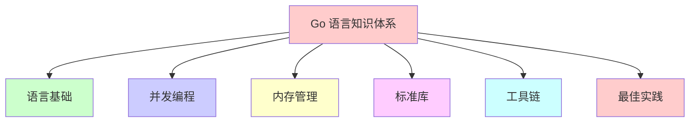
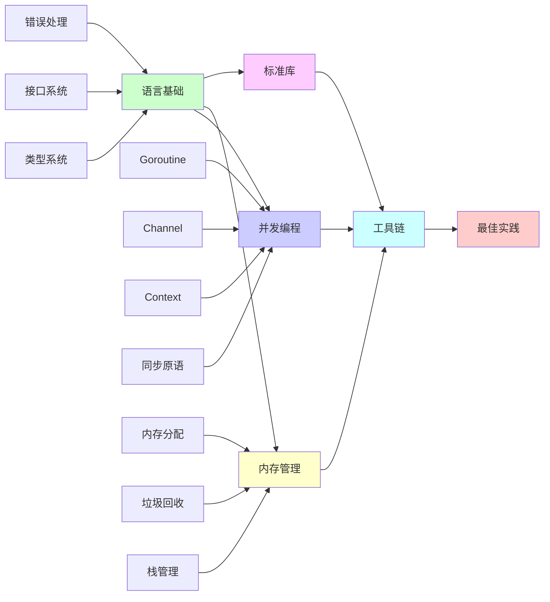

# Go 语言知识体系

本文档以思维导图的方式展示 Go 语言的知识体系结构。

## 知识体系总览

## 一、语言基础

### 1.1 基本语法
- ✅ 变量和常量
- ✅ 数据类型
- ✅ 运算符
- ✅ 控制流（if、for、switch）
- ✅ 函数定义

### 1.2 类型系统
- ✅ 基本类型
- ✅ 复合类型（数组、切片、映射、结构体）
- ⚠️ **缺失**：类型系统深入（类型别名、类型定义、类型转换规则）
- ⚠️ **缺失**：方法集规则
- ⚠️ **缺失**：类型嵌入和组合

### 1.3 数据结构
- ✅ map.md（映射）
- ⚠️ **缺失**：slice切片深入.md
- ⚠️ **缺失**：string字符串深入.md
- ⚠️ **缺失**：数组和切片的区别

### 1.4 函数和方法
- ⚠️ **缺失**：函数和方法.md
  - 函数作为一等公民
  - 方法定义和调用
  - 值接收者 vs 指针接收者
  - 方法集规则
  - 函数式编程

### 1.5 接口系统
- ⚠️ **缺失**：interface接口系统.md（**高优先级**）
  - interface 定义和实现
  - 空接口 interface{} 和 any
  - 类型断言和类型转换
  - 接口的底层实现（iface、eface）
  - 接口的方法集规则
  - 接口组合

### 1.6 错误处理
- ✅ panic.md
- ✅ golang常见异常.md
- ⚠️ **缺失**：error错误处理.md（**高优先级**）
  - error 接口
  - 错误创建和包装
  - errors.Is 和 errors.As
  - 错误处理最佳实践

### 1.7 特殊特性
- ✅ defer.md
- ✅ nil.md
- ✅ 闭包问题.md
- ✅ 泛型.md
- ✅ 汇编.md

### 1.8 指针和值语义
- ⚠️ **缺失**：指针和值语义.md
  - 指针的定义和使用
  - 值传递 vs 引用传递
  - 何时使用指针
  - 指针的性能考虑

## 二、并发编程

### 2.1 Goroutine
- ✅ MPG调度.md
- ✅ 协程调度管理源码分析.md
- ✅ golang-MPG-有限状态机.md
- ⚠️ **缺失**：goroutine 创建和管理
- ⚠️ **缺失**：goroutine 生命周期

### 2.2 Channel
- ⚠️ **缺失**：channel通道机制.md（**高优先级**）
  - channel 定义和创建
  - 发送和接收
  - 无缓冲和有缓冲 channel
  - channel 关闭
  - select 语句
  - channel 底层实现（hchan）
  - channel 常见模式

### 2.3 Context
- ⚠️ **缺失**：context上下文.md（**高优先级**）
  - context 创建
  - context 传播
  - context 取消机制
  - context 超时控制
  - context 在 HTTP 中的应用

### 2.4 同步原语
- ✅ sync包.md
- ✅ sync同步原语.md
- ⚠️ **缺失**：并发模式.md
  - 生产者-消费者模式
  - 扇入扇出模式
  - 工作池模式
  - 超时和取消模式

## 三、内存管理

### 3.1 内存分配
- ✅ 内存分配器.md

### 3.2 垃圾回收
- ✅ 垃圾回收器.md

### 3.3 栈管理
- ✅ 栈.md

### 3.4 运行时
- ✅ golang-系统监控sysmon.md
- ⚠️ **缺失**：runtime运行时.md
  - runtime 包的使用
  - GOMAXPROCS
  - 性能统计
  - 调用栈信息

## 四、标准库

### 4.1 常用包
- ⚠️ **缺失**：标准库常用包.md
  - strings、bytes、strconv
  - time
  - encoding/json、encoding/xml
  - io、os
  - path/filepath
  - sort
  - container（heap、list、ring）

### 4.2 网络编程
- ✅ golang的TCPSocket编程.md
- ✅ go-redis.md
- ⚠️ **缺失**：网络编程深入.md
  - HTTP 客户端和服务器
  - WebSocket
  - gRPC
  - 连接池和超时控制

### 4.3 数据库
- ⚠️ **缺失**：数据库操作.md
  - database/sql
  - 连接池管理
  - 事务处理
  - ORM 框架

## 五、工具链

### 5.1 编译和构建
- ✅ golang编译指示.md
- ✅ 编译指示.md
- ⚠️ **缺失**：编译和构建.md
  - go build
  - 交叉编译
  - 构建标签
  - 编译优化

### 5.2 包管理
- ⚠️ **缺失**：go-mod包管理.md（**中优先级**）
  - go mod 使用
  - 依赖管理
  - 版本控制
  - 私有模块

### 5.3 测试和调试
- ✅ 单元测试.md
- ✅ pprof.md

### 5.4 性能分析
- ✅ pprof.md
- ⚠️ **缺失**：性能优化.md
  - Benchmark 测试
  - 性能调优技巧
  - 常见性能陷阱

## 六、系统编程

### 6.1 系统调用
- ✅ golang调用syscall.md
- ✅ golang调用IPC.md

### 6.2 反射
- ⚠️ **缺失**：reflect反射机制.md
  - reflect 包使用
  - Type 和 Value
  - 反射调用方法
  - 反射修改值
  - 反射性能影响

## 七、最佳实践

### 7.1 代码规范
- ⚠️ **缺失**：Go最佳实践.md
  - 代码风格
  - 命名规范
  - 错误处理最佳实践
  - 并发编程最佳实践

### 7.2 设计模式
- ⚠️ **缺失**：设计模式.md
  - Go 语言中的设计模式
  - 单例、工厂、观察者等模式
  - 依赖注入
  - 中间件模式

## 知识体系关系图

## 学习路径建议

### 初级路径
1. 语言基础 → 类型系统 → 函数和方法
2. 错误处理 → 接口系统
3. 并发基础 → Goroutine → Channel

### 中级路径
1. Channel 深入 → Context → 同步原语
2. 内存管理 → 垃圾回收 → 性能优化
3. 标准库 → 网络编程 → 数据库操作

### 高级路径
1. 反射机制 → 汇编 → 运行时
2. 并发模式 → 设计模式
3. 最佳实践 → 性能调优

## 当前完成度统计

### 已完成（25个）
- 内存管理：3个 ✅
- 并发编程：5个 ✅
- 语言特性：6个 ✅
- 工具调试：4个 ✅
- 系统调用：3个 ✅
- 网络编程：2个 ✅
- 数据结构：1个 ✅
- 异常处理：1个 ✅

### 建议补充（20个）
- **高优先级**：4个（interface、channel、context、error）
- **中优先级**：13个
- **低优先级**：3个

## 总结

当前文档库已经覆盖了 Go 语言的核心内容，特别是在内存管理、并发编程和语言特性方面比较完善。

**建议优先补充的内容**：
1. interface接口系统.md（核心概念）
2. channel通道机制.md（并发核心）
3. context上下文.md（现代 Go 必备）
4. error错误处理.md（最佳实践）

这些内容对于深入理解和使用 Go 语言至关重要。

