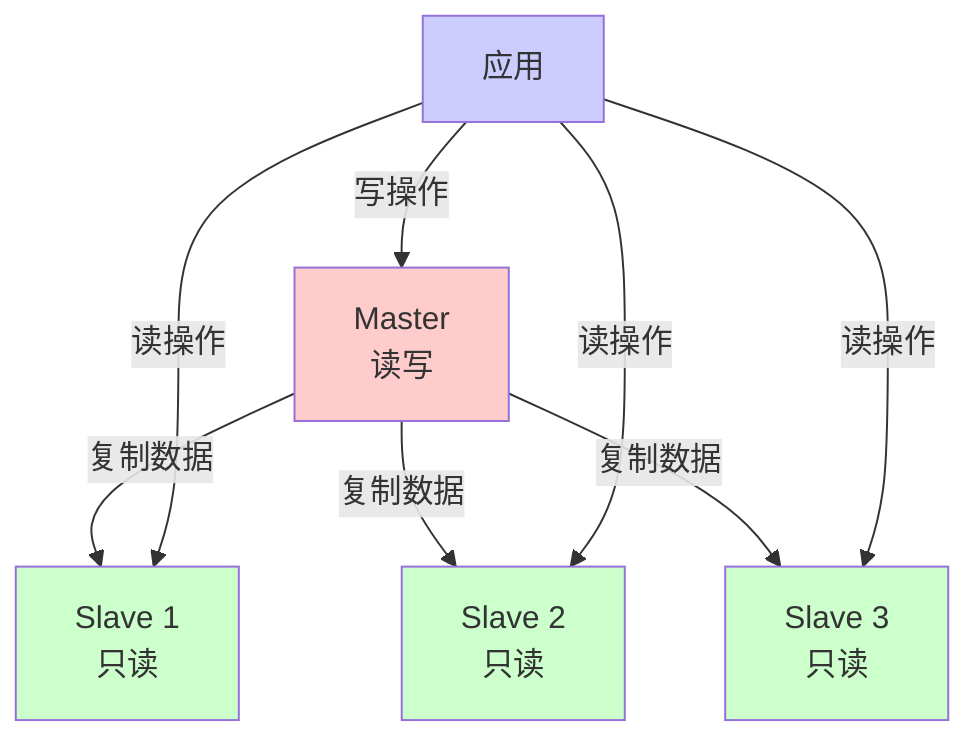
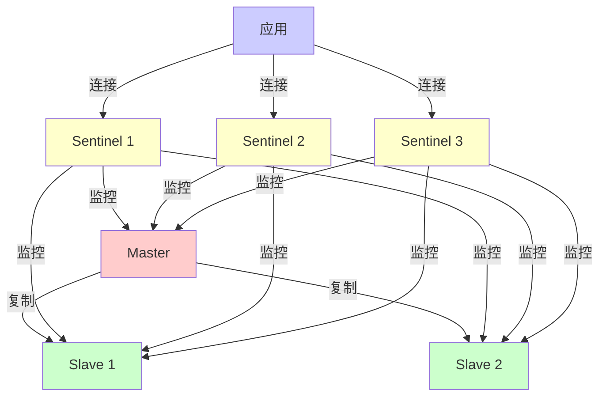
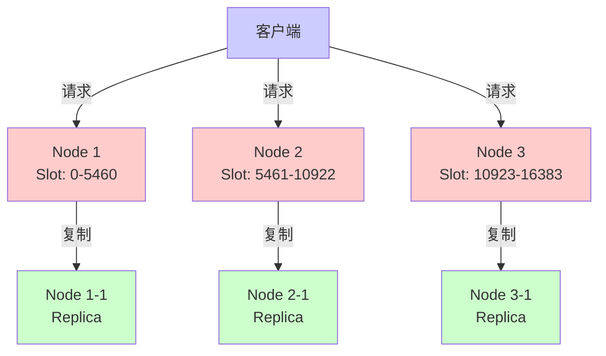
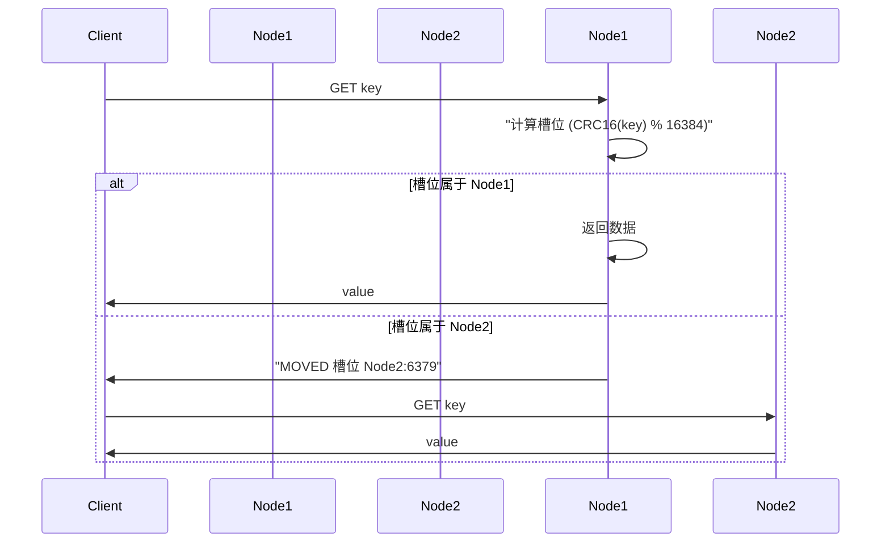
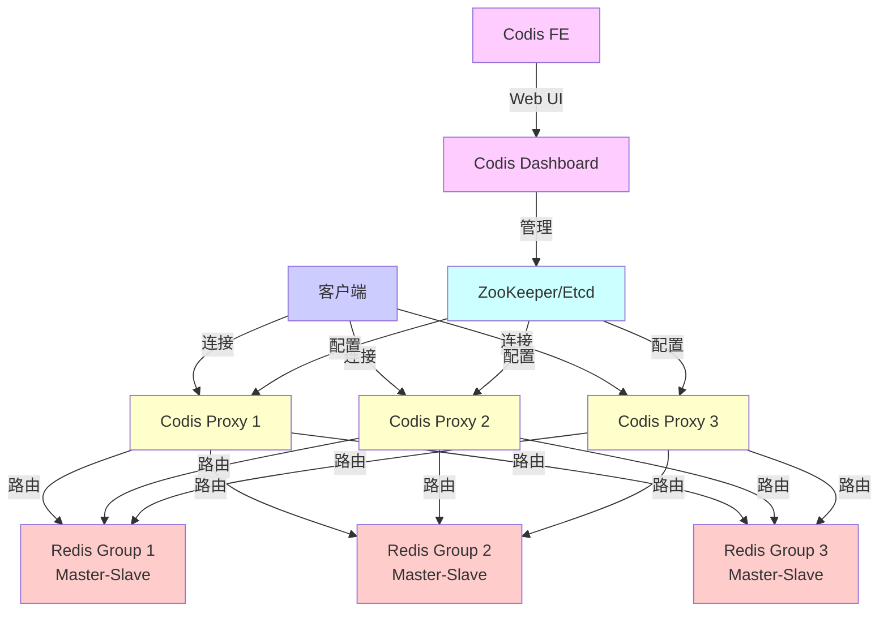
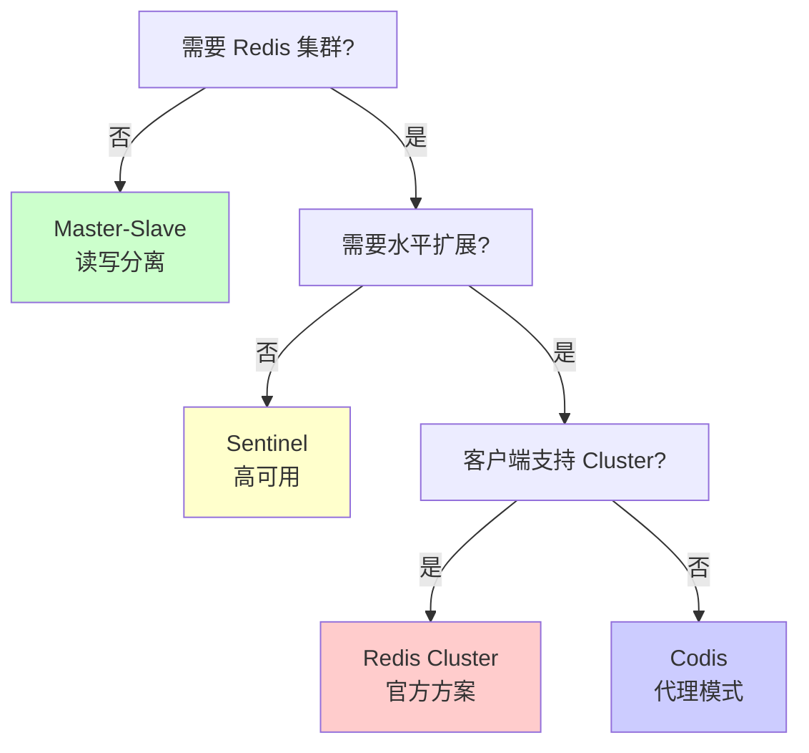

# Redis 集群方案概述

Redis 作为高性能的内存数据库，在生产环境中需要解决高可用、数据持久化、水平扩展等问题。本文档介绍四种主流的 Redis 集群方案：Master-Slave、Sentinel、Cluster 和 Codis。

## 方案对比

| 方案 | 高可用 | 自动故障转移 | 水平扩展 | 复杂度 | 适用场景 |
|------|--------|--------------|----------|--------|----------|
| Master-Slave | ❌ | ❌ | ❌ | 低 | 小规模应用，读写分离 |
| Sentinel | ✅ | ✅ | ❌ | 中 | 中小规模应用，高可用 |
| Cluster | ✅ | ✅ | ✅ | 高 | 大规模应用，水平扩展 |
| Codis | ✅ | ✅ | ✅ | 高 | 大规模应用，代理模式 |

---

# 一、Master-Slave（主从复制）

## 1.1 概述

Master-Slave 是 Redis 最基础的复制方案，通过 Redis 自带的主从复制功能实现数据备份和读写分离。一个 Master 可以有多个 Slave，Slave 从 Master 同步数据。

## 1.2 架构原理



### 复制流程

1. **全量复制**：Slave 首次连接或断开时间过长时，Master 执行 BGSAVE 生成 RDB 文件，发送给 Slave
2. **增量复制**：Slave 连接后，Master 将写命令写入复制缓冲区，Slave 接收并执行
3. **心跳检测**：Slave 定期向 Master 发送 REPLCONF ACK 确认复制进度

## 1.3 配置示例

### Master 配置（redis.conf）

```conf
# 启用 RDB 持久化
save 900 1
save 300 10
save 60 10000

# 启用 AOF 持久化（可选）
appendonly yes
appendfsync everysec

# 设置密码
requirepass master123
```

### Slave 配置（redis.conf）

```conf
# 指定 Master 地址
replicaof 192.168.1.100 6379

# Master 密码
masterauth master123

# 只读模式
replica-read-only yes

# 复制缓冲区大小
repl-backlog-size 1mb
```

### 命令行配置

```bash
# 在 Slave 上执行
redis-cli -h 192.168.1.101 -p 6379
> REPLICAOF 192.168.1.100 6379
> CONFIG SET masterauth master123
```

## 1.4 优缺点

### 优点
- ✅ 实现简单，配置方便
- ✅ 支持读写分离，提高读性能
- ✅ 数据备份，提高数据安全性
- ✅ 无需额外组件

### 缺点
- ❌ 无法自动故障转移，Master 宕机需要手动切换
- ❌ 不支持水平扩展，写性能受限于单机
- ❌ 数据延迟，Slave 数据可能落后于 Master
- ❌ 单点故障风险

## 1.5 使用场景

- 小规模应用，对高可用要求不高
- 读多写少的场景，需要读写分离
- 数据备份需求
- 作为其他高可用方案的基础

## 1.6 最佳实践

1. **持久化配置**：Master 和 Slave 都应启用持久化
2. **网络优化**：Master 和 Slave 部署在同一机房，减少网络延迟
3. **监控告警**：监控复制延迟（`INFO replication`）
4. **故障处理**：准备手动故障转移脚本

---

# 二、Sentinel（哨兵模式）

## 2.1 概述

Sentinel 是 Redis 官方提供的高可用解决方案，通过监控 Master 和 Slave 的状态，实现自动故障检测和故障转移。Sentinel 本身也是一个分布式系统，通常部署多个 Sentinel 节点。

## 2.2 架构原理



### 故障转移流程

1. **主观下线**：Sentinel 检测到 Master 无响应，标记为主观下线
2. **客观下线**：多个 Sentinel 确认 Master 下线，标记为客观下线
3. **选举 Leader**：Sentinel 之间选举 Leader 执行故障转移
4. **选择新 Master**：从 Slave 中选择一个作为新 Master
5. **切换配置**：更新其他 Slave 的配置，指向新 Master
6. **通知客户端**：通过发布订阅通知客户端新的 Master 地址

## 2.3 配置示例

### Sentinel 配置（sentinel.conf）

```conf
# 监控 Master，quorum 表示需要多少个 Sentinel 同意才认为 Master 下线
sentinel monitor mymaster 192.168.1.100 6379 2

# Master 密码
sentinel auth-pass mymaster master123

# 故障转移超时时间（毫秒）
sentinel down-after-milliseconds mymaster 5000

# 故障转移时，最多有多少个 Slave 同时对新 Master 进行同步
sentinel parallel-syncs mymaster 1

# 故障转移超时时间
sentinel failover-timeout mymaster 10000

# 日志文件
logfile /var/log/redis/sentinel.log

# 守护进程模式
daemonize yes
```

### 启动 Sentinel

```bash
# 启动 Sentinel
redis-sentinel /etc/redis/sentinel.conf

# 或使用 redis-server
redis-server /etc/redis/sentinel.conf --sentinel
```

### 客户端连接（Go 示例）

```go
package main

import (
    "github.com/go-redis/redis/v8"
    "context"
)

func main() {
    // 连接 Sentinel
    sentinelClient := redis.NewFailoverClient(&redis.FailoverOptions{
        MasterName:    "mymaster",
        SentinelAddrs: []string{
            "192.168.1.200:26379",
            "192.168.1.201:26379",
            "192.168.1.202:26379",
        },
        Password: "master123",
    })
    
    ctx := context.Background()
    val, err := sentinelClient.Get(ctx, "key").Result()
    if err != nil {
        panic(err)
    }
    println(val)
}
```

## 2.4 优缺点

### 优点
- ✅ 自动故障检测和故障转移
- ✅ 高可用性，Master 宕机自动切换
- ✅ 配置相对简单
- ✅ 官方支持，稳定可靠

### 缺点
- ❌ 不支持水平扩展，写性能受限于单机
- ❌ 故障转移期间可能有数据丢失
- ❌ 需要部署多个 Sentinel 节点
- ❌ 客户端需要支持 Sentinel 协议

## 2.5 使用场景

- 中小规模应用，需要高可用
- 对数据一致性要求不是特别严格
- 不需要水平扩展的场景
- 作为 Redis Cluster 的替代方案

## 2.6 最佳实践

1. **Sentinel 数量**：至少部署 3 个 Sentinel（推荐奇数个）
2. **网络隔离**：Sentinel 和 Redis 节点部署在不同机器
3. **监控告警**：监控 Sentinel 状态和故障转移事件
4. **客户端重试**：客户端实现自动重连和故障转移处理

---

# 三、Redis Cluster（集群模式）

## 3.1 概述

Redis Cluster 是 Redis 官方提供的分布式解决方案，通过数据分片（sharding）实现水平扩展。Cluster 采用无中心架构，每个节点都可以处理请求，数据分布在多个节点上。

## 3.2 架构原理



### 核心概念

1. **Hash Slot（哈希槽）**：Redis Cluster 将数据分为 16384 个槽，每个节点负责一部分槽
2. **数据分片**：使用 CRC16 算法计算 key 的哈希值，对 16384 取模得到槽位
3. **Gossip 协议**：节点之间通过 Gossip 协议交换信息，维护集群状态
4. **自动故障转移**：Master 节点宕机时，Slave 节点自动提升为 Master

### 数据路由



## 3.3 配置示例

### 节点配置（redis.conf）

```conf
# 启用集群模式
cluster-enabled yes

# 集群配置文件
cluster-config-file nodes-6379.conf

# 节点超时时间（毫秒）
cluster-node-timeout 15000

# 持久化
save 900 1
save 300 10
save 60 10000

# AOF
appendonly yes
appendfsync everysec

# 端口
port 6379

# 绑定地址
bind 0.0.0.0
```

### 创建集群

```bash
# 方式1：使用 redis-cli 创建（Redis 5.0+）
redis-cli --cluster create \
  192.168.1.100:6379 \
  192.168.1.101:6379 \
  192.168.1.102:6379 \
  192.168.1.103:6379 \
  192.168.1.104:6379 \
  192.168.1.105:6379 \
  --cluster-replicas 1

# 方式2：手动创建
# 1. 启动所有节点
# 2. 在节点上执行 CLUSTER MEET
redis-cli -h 192.168.1.100 -p 6379 CLUSTER MEET 192.168.1.101 6379
redis-cli -h 192.168.1.100 -p 6379 CLUSTER MEET 192.168.1.102 6379
# ... 添加其他节点

# 3. 分配槽位
redis-cli -h 192.168.1.100 -p 6379 CLUSTER ADDSLOTS {0..5460}
redis-cli -h 192.168.1.101 -p 6379 CLUSTER ADDSLOTS {5461..10922}
redis-cli -h 192.168.1.102 -p 6379 CLUSTER ADDSLOTS {10923..16383}
```

### 客户端连接（Go 示例）

```go
package main

import (
    "github.com/go-redis/redis/v8"
    "context"
)

func main() {
    // 连接 Redis Cluster
    clusterClient := redis.NewClusterClient(&redis.ClusterOptions{
        Addrs: []string{
            "192.168.1.100:6379",
            "192.168.1.101:6379",
            "192.168.1.102:6379",
        },
        Password: "password",
        // 自动发现其他节点
        ClusterSlots: func(ctx context.Context) ([]redis.ClusterSlot, error) {
            return nil, nil
        },
    })
    
    ctx := context.Background()
    
    // 设置值
    err := clusterClient.Set(ctx, "key", "value", 0).Err()
    if err != nil {
        panic(err)
    }
    
    // 获取值
    val, err := clusterClient.Get(ctx, "key").Result()
    if err != nil {
        panic(err)
    }
    println(val)
}
```

### 集群管理命令

```bash
# 查看集群信息
redis-cli -h 192.168.1.100 -p 6379 CLUSTER INFO

# 查看节点信息
redis-cli -h 192.168.1.100 -p 6379 CLUSTER NODES

# 查看槽位分配
redis-cli -h 192.168.1.100 -p 6379 CLUSTER SLOTS

# 添加节点
redis-cli --cluster add-node 192.168.1.106:6379 192.168.1.100:6379

# 删除节点
redis-cli --cluster del-node 192.168.1.100:6379 <node-id>

# 重新分配槽位
redis-cli --cluster reshard 192.168.1.100:6379
```

## 3.4 优缺点

### 优点
- ✅ 支持水平扩展，可以动态添加节点
- ✅ 高可用性，自动故障转移
- ✅ 无中心架构，性能好
- ✅ 官方支持，功能完善

### 缺点
- ❌ 配置复杂，运维成本高
- ❌ 不支持多 key 操作（除非在同一槽位）
- ❌ 客户端需要支持 Cluster 协议
- ❌ 数据迁移可能影响性能
- ❌ 批量操作受限

## 3.5 使用场景

- 大规模应用，需要水平扩展
- 数据量大，单机无法存储
- 高并发场景，需要分散负载
- 对多 key 操作要求不高的场景

## 3.6 最佳实践

1. **节点数量**：至少 6 个节点（3 主 3 从）
2. **槽位分配**：确保槽位均匀分布
3. **网络优化**：节点部署在同一机房，减少网络延迟
4. **监控告警**：监控集群状态、槽位分布、节点健康
5. **数据迁移**：在低峰期进行数据迁移
6. **客户端重试**：实现自动重试和故障转移

---

# 四、Codis

## 4.1 概述

Codis 是豌豆荚开源的 Redis 集群解决方案，采用代理模式，客户端连接 Codis Proxy，由 Proxy 负责路由和数据分片。Codis 支持动态扩容、自动故障转移等功能。

## 4.2 架构原理



### 核心组件

1. **Codis Proxy**：无状态代理，负责路由和转发请求
2. **Codis Dashboard**：集群管理组件，负责集群配置和故障转移
3. **Codis FE**：Web 管理界面
4. **ZooKeeper/Etcd**：存储集群配置和元数据
5. **Redis Group**：Redis 主从组，每个 Group 包含一个 Master 和多个 Slave

### 数据分片

Codis 使用 Pre-sharding 方式，将数据分为 1024 个 slot，每个 Redis Group 负责一部分 slot。

## 4.3 配置示例

### 安装 Codis

```bash
# 下载 Codis
wget https://github.com/CodisLabs/codis/releases/download/3.2.2/codis3.2.2-go1.9.2-linux.tar.gz
tar -xzf codis3.2.2-go1.9.2-linux.tar.gz
cd codis3.2.2-go1.9.2-linux

# 启动 ZooKeeper（或使用 Etcd）
# 假设 ZooKeeper 已安装并运行在 127.0.0.1:2181
```

### Dashboard 配置

```bash
# 启动 Dashboard
./bin/codis-dashboard --ncpu=4 --config=dashboard.toml \
  --log=dashboard.log --log-level=INFO
```

### Proxy 配置

```bash
# 启动 Proxy
./bin/codis-proxy --ncpu=4 --config=proxy.toml \
  --log=proxy.log --log-level=INFO
```

### 配置文件示例（dashboard.toml）

```toml
coordinator_name = "zookeeper"
coordinator_addr = "127.0.0.1:2181"

product_name = "codis-demo"
product_auth = ""

admin_addr = "0.0.0.0:18080"
```

### 配置文件示例（proxy.toml）

```toml
product_name = "codis-demo"
product_auth = ""

proxy_addr = "0.0.0.0:19000"
admin_addr = "0.0.0.0:11080"

jodis_addr = "127.0.0.1:2181"
jodis_timeout = "20s"
jodis_compatible = false
```

### 客户端连接（Go 示例）

```go
package main

import (
    "github.com/CodisLabs/codis/pkg/utils/redis"
    "context"
)

func main() {
    // 连接 Codis Proxy
    client := redis.NewClient(&redis.Options{
        Addr:     "192.168.1.200:19000",
        Password: "",
        DB:       0,
    })
    
    ctx := context.Background()
    
    // 设置值
    err := client.Set(ctx, "key", "value", 0).Err()
    if err != nil {
        panic(err)
    }
    
    // 获取值
    val, err := client.Get(ctx, "key").Result()
    if err != nil {
        panic(err)
    }
    println(val)
}
```

## 4.4 优缺点

### 优点
- ✅ 支持水平扩展，可以动态添加节点
- ✅ 高可用性，自动故障转移
- ✅ 客户端无需修改，使用标准 Redis 协议
- ✅ 提供 Web 管理界面，运维方便
- ✅ 支持数据迁移，不影响服务

### 缺点
- ❌ 需要额外的 Proxy 层，增加延迟
- ❌ 依赖 ZooKeeper/Etcd，增加系统复杂度
- ❌ 社区活跃度不如 Redis Cluster
- ❌ 多 key 操作受限（需要在同一 slot）

## 4.5 使用场景

- 大规模应用，需要水平扩展
- 客户端不支持 Redis Cluster 协议
- 需要 Web 管理界面
- 对延迟要求不是特别严格的场景

## 4.6 最佳实践

1. **Proxy 数量**：根据并发量部署多个 Proxy
2. **负载均衡**：使用负载均衡器分发请求到多个 Proxy
3. **监控告警**：监控 Proxy、Dashboard、Redis Group 状态
4. **数据迁移**：在低峰期进行数据迁移
5. **配置备份**：定期备份 ZooKeeper/Etcd 配置

---

# 五、方案选择建议

## 5.1 选择流程图



## 5.2 选择建议

### 小规模应用（< 10GB 数据）
- **推荐**：Master-Slave 或 Sentinel
- **理由**：配置简单，满足基本需求

### 中规模应用（10GB - 100GB 数据）
- **推荐**：Sentinel 或 Redis Cluster
- **理由**：需要高可用，可能不需要水平扩展

### 大规模应用（> 100GB 数据）
- **推荐**：Redis Cluster 或 Codis
- **理由**：需要水平扩展，支持动态扩容

### 特殊场景
- **客户端不支持 Cluster**：选择 Codis
- **需要 Web 管理界面**：选择 Codis
- **对延迟要求极高**：选择 Redis Cluster（无 Proxy 层）

## 5.3 迁移建议

### 从 Master-Slave 迁移到 Sentinel
1. 部署 Sentinel 节点
2. 配置 Sentinel 监控 Master
3. 客户端切换到 Sentinel 模式
4. 测试故障转移

### 从 Sentinel 迁移到 Cluster
1. 评估数据量和分片策略
2. 创建 Cluster 集群
3. 使用 `redis-cli --cluster import` 导入数据
4. 客户端切换到 Cluster 模式
5. 逐步切换流量

---

# 六、总结

## 6.1 方案对比总结

| 特性 | Master-Slave | Sentinel | Cluster | Codis |
|------|-------------|----------|---------|-------|
| **高可用** | ❌ | ✅ | ✅ | ✅ |
| **自动故障转移** | ❌ | ✅ | ✅ | ✅ |
| **水平扩展** | ❌ | ❌ | ✅ | ✅ |
| **配置复杂度** | 低 | 中 | 高 | 高 |
| **客户端要求** | 标准 | 支持 Sentinel | 支持 Cluster | 标准 |
| **运维成本** | 低 | 中 | 高 | 中 |
| **性能** | 中 | 中 | 高 | 中 |

## 6.2 推荐方案

- **小规模应用**：Master-Slave 或 Sentinel
- **中规模应用**：Sentinel
- **大规模应用**：Redis Cluster（优先）或 Codis

## 6.3 注意事项

1. **数据持久化**：所有方案都应启用持久化
2. **监控告警**：建立完善的监控体系
3. **备份策略**：定期备份数据
4. **故障演练**：定期进行故障转移演练
5. **性能测试**：上线前进行压力测试

## 6.4 参考资源

- [Redis 官方文档](https://redis.io/documentation)
- [Redis Cluster 规范](https://redis.io/topics/cluster-spec)
- [Codis 官方文档](https://github.com/CodisLabs/codis)
- [Redis Sentinel 文档](https://redis.io/topics/sentinel)