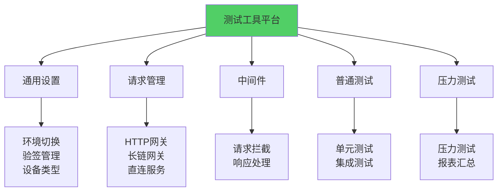
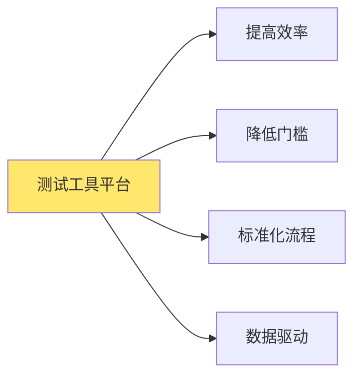
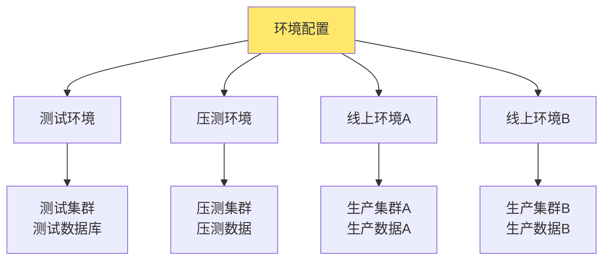
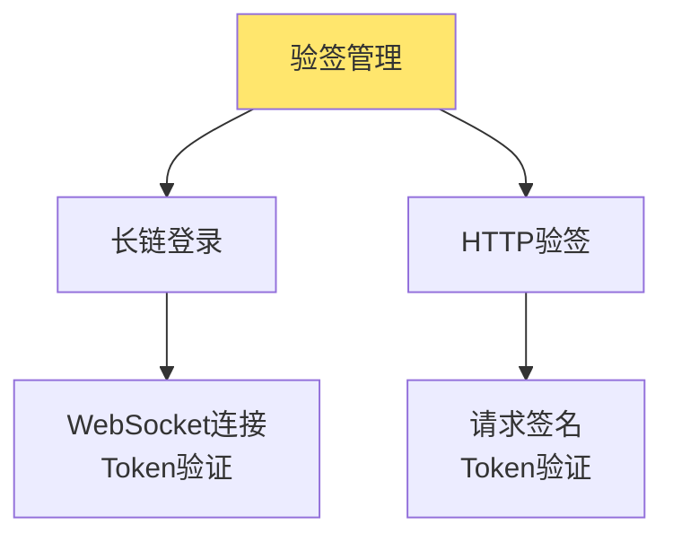
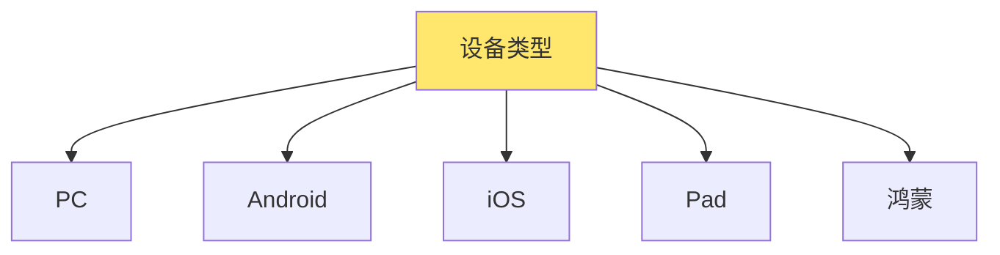
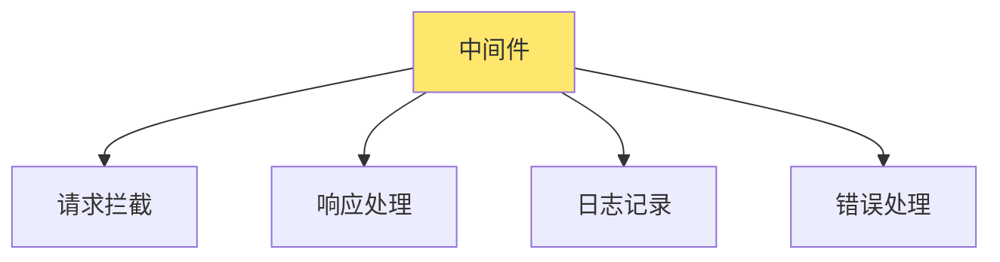
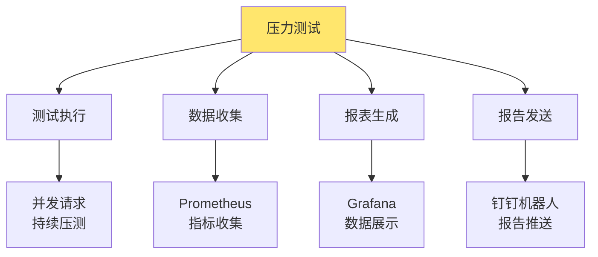

测试工具平台是用于简化测试流程、提高测试效率的集成化测试工具。通过统一的测试工具平台，可以快速切换环境、执行各种类型的测试、收集测试结果并生成报告。

# 测试工具平台概述

## 什么是测试工具平台？

测试工具平台是一个集成的测试工具系统，提供环境管理、请求发送、测试执行、结果收集和报告生成等功能，帮助测试人员高效完成各种测试任务。

**核心功能：**
- **环境管理**：快速切换不同环境，支持测试、压测、生产等多环境
- **请求管理**：支持多种请求方式，包括HTTP网关、长链网关、直连服务
- **测试执行**：执行各种类型的测试，包括单元测试、集成测试、压力测试
- **结果收集**：收集和展示测试结果，支持实时监控和历史查询
- **报告生成**：自动生成测试报告，支持多种格式和推送方式

## 测试工具平台的价值

**价值体现：**
- **提高效率**：自动化测试流程，减少人工操作
- **降低门槛**：简化测试操作，降低使用门槛
- **标准化流程**：统一的测试流程和规范
- **数据驱动**：基于测试数据做出决策

# 通用设置

通用设置提供测试环境的统一配置和管理功能，是测试工具平台的基础能力。

## 环境切换

环境切换功能允许测试人员快速在不同集群环境间切换，无需手动修改配置。

### 环境类型

测试工具平台支持多种环境类型：

**1. 测试环境（Test Environment）**
- 用于日常功能测试和开发自测
- 数据可以随时重置，不影响生产
- 配置相对宽松，便于调试

**2. 压测环境（Stress Test Environment）**
- 专门用于性能测试和压力测试
- 环境配置接近生产环境
- 数据量较大，用于模拟真实场景

**3. 线上环境A（Production Environment A）**
- 生产环境的一个集群
- 用于生产问题的复现和验证
- 需要谨慎操作，避免影响生产

**4. 线上环境B（Production Environment B）**
- 生产环境的另一个集群
- 支持多集群切换和对比测试
- 可用于灰度验证

### 环境配置结构

**环境配置包含：**
- **HTTP网关地址**：API网关的访问地址
- **长链网关地址**：WebSocket长链服务的地址
- **数据库地址**：数据库连接信息
- **Redis地址**：缓存服务地址
- **其他配置**：环境特定的配置参数

### 环境切换机制

环境切换采用配置中心或配置文件的方式，支持：

- **一键切换**：通过界面或命令快速切换环境
- **配置持久化**：切换后的环境配置自动保存
- **配置验证**：切换时验证环境配置的有效性
- **环境隔离**：不同环境的配置完全隔离，互不影响

### 环境切换最佳实践

1. **环境命名规范**：使用清晰的环境命名，如`test`、`stress`、`prod-a`、`prod-b`
2. **配置版本管理**：环境配置纳入版本管理，便于追溯和回滚
3. **权限控制**：生产环境切换需要权限验证，避免误操作
4. **环境监控**：切换后自动检查环境健康状态

## 验签管理

验签管理提供快速验签功能，支持长链登录和HTTP请求验签，简化认证流程。

### 验签类型

**1. 长链登录**
- 用于WebSocket长链连接的认证
- 通过登录接口获取Token
- Token用于后续长链消息的验证

**2. HTTP验签**
- 用于HTTP请求的签名验证
- 支持多种签名算法（MD5、SHA256等）
- 自动添加签名参数和Token

### 验签流程

**长链登录流程：**
1. 构建登录请求，包含用户ID、设备信息等
2. 对请求进行签名
3. 发送登录请求到长链网关
4. 接收并保存返回的Token
5. 后续长链消息使用Token进行验证

**HTTP验签流程：**
1. 提取请求参数（URL参数、Body参数）
2. 添加时间戳等系统参数
3. 对参数进行排序和拼接
4. 使用密钥进行签名计算
5. 将签名添加到请求中
6. 添加Token到请求头

### 验签配置

验签功能需要配置：
- **密钥管理**：不同环境使用不同的密钥
- **签名算法**：支持多种签名算法选择
- **Token管理**：Token的获取、刷新、过期处理
- **验签缓存**：缓存验签结果，提高效率

### 验签最佳实践

1. **密钥安全**：密钥存储在安全的地方，不硬编码
2. **Token刷新**：实现Token自动刷新机制
3. **验签失败处理**：验签失败时自动重试或提示
4. **验签日志**：记录验签过程，便于问题排查

## 设备类型切换

设备类型切换功能允许测试人员模拟不同设备的请求，验证不同设备类型的兼容性。

### 支持的设备类型

**1. PC（个人电脑）**
- 模拟桌面浏览器访问
- User-Agent为桌面浏览器标识
- 支持完整的Web功能

**2. Android（安卓）**
- 模拟Android移动设备
- 包含Android特定的请求头
- 支持移动端API版本

**3. iOS（苹果系统）**
- 模拟iPhone/iPad设备
- 包含iOS特定的请求头
- 支持iOS版本信息

**4. Pad（平板电脑）**
- 模拟平板设备访问
- 介于手机和PC之间的特性
- 支持触屏操作

**5. 鸿蒙（HarmonyOS）**
- 模拟鸿蒙系统设备
- 包含鸿蒙特定的标识
- 支持鸿蒙生态特性

### 设备配置内容

每个设备类型包含以下配置：
- **User-Agent**：设备标识字符串
- **请求头**：设备特定的HTTP头
- **App版本**：应用版本号（移动端）
- **系统版本**：操作系统版本
- **其他参数**：设备特定的其他参数

### 设备切换机制

设备类型切换通过修改请求头实现：
- **自动添加**：切换设备类型后，自动添加对应的请求头
- **请求覆盖**：设备配置的请求头会覆盖默认请求头
- **动态切换**：支持在测试过程中动态切换设备类型
- **配置持久化**：设备类型选择会保存，下次使用自动应用

### 设备类型测试场景

1. **兼容性测试**：验证不同设备类型的API兼容性
2. **功能测试**：测试设备特定功能
3. **性能测试**：对比不同设备类型的性能表现
4. **用户体验测试**：验证不同设备的用户体验

# 请求管理

请求管理提供多种请求方式，支持通过不同路径访问后端服务。

## 请求HTTP网关

通过HTTP网关发送请求是最常用的方式，网关提供统一入口、路由转发、负载均衡等功能。

### HTTP网关的优势

- **统一入口**：所有请求通过统一入口，简化客户端
- **路由转发**：根据路径自动路由到后端服务
- **负载均衡**：在多个服务实例间分发请求
- **横切关注点**：统一处理认证、限流、监控等

### HTTP网关请求流程

1. **构建请求**：根据测试需求构建HTTP请求
2. **添加设备信息**：根据选择的设备类型添加请求头
3. **验签处理**：自动进行HTTP验签，添加签名和Token
4. **发送请求**：通过HTTP网关发送请求
5. **处理响应**：接收并处理响应结果

### HTTP网关使用场景

- **API测试**：测试各种API接口
- **功能测试**：验证业务功能
- **集成测试**：测试服务间集成
- **回归测试**：验证功能回归

## 请求长链网关

长链网关提供WebSocket长连接服务，支持实时双向通信。

### 长链网关的特点

- **实时通信**：支持实时消息推送和接收
- **双向通信**：客户端和服务端都可以主动发送消息
- **连接保持**：保持长连接，减少连接建立开销
- **心跳机制**：通过心跳保持连接活跃

### 长链网关使用流程

1. **建立连接**：建立WebSocket连接到长链网关
2. **长链登录**：通过登录接口获取Token
3. **发送消息**：通过长连接发送消息
4. **接收消息**：接收服务端推送的消息
5. **关闭连接**：测试完成后关闭连接

### 长链网关使用场景

- **实时消息测试**：测试实时消息推送功能
- **通知测试**：测试各种通知功能
- **聊天测试**：测试聊天类功能
- **状态同步测试**：测试状态同步功能

## 请求直连HTTP服务

直连HTTP服务绕过网关，直接访问后端服务，用于调试和问题排查。

### 直连HTTP服务的优势

- **绕过网关**：直接访问服务，排除网关影响
- **问题定位**：便于定位是网关问题还是服务问题
- **性能测试**：测试服务本身的性能
- **调试方便**：便于调试和问题排查

### 直连HTTP服务使用场景

- **服务调试**：调试特定服务的功能
- **性能测试**：测试服务本身的性能
- **问题排查**：排查网关相关问题
- **开发测试**：开发阶段的本地测试

## 请求直连RPC服务

直连RPC服务直接调用RPC接口，支持gRPC等RPC协议。

### 直连RPC服务的特点

- **协议支持**：支持gRPC、Thrift等RPC协议
- **类型安全**：RPC调用类型安全
- **高性能**：RPC调用性能优于HTTP
- **服务发现**：支持服务发现机制

### 直连RPC服务使用场景

- **RPC接口测试**：测试RPC接口功能
- **服务间调用测试**：测试服务间RPC调用
- **性能对比**：对比RPC和HTTP性能
- **协议验证**：验证RPC协议实现

# 中间件

中间件提供请求拦截、响应处理等功能，可以扩展测试工具的能力。

## 中间件概述

## 中间件功能

### 1. 请求拦截

请求拦截可以在请求发送前进行修改：
- **参数修改**：修改请求参数
- **请求头修改**：添加或修改请求头
- **请求体修改**：修改请求体内容
- **URL重写**：重写请求URL

### 2. 响应处理

响应处理可以在收到响应后进行加工：
- **响应解析**：解析响应内容
- **响应转换**：转换响应格式
- **响应过滤**：过滤敏感信息
- **响应验证**：验证响应内容

### 3. 日志记录

日志记录中间件记录请求和响应：
- **请求日志**：记录请求详情
- **响应日志**：记录响应详情
- **性能日志**：记录请求耗时
- **错误日志**：记录错误信息

### 4. 错误处理

错误处理中间件处理请求错误：
- **自动重试**：失败请求自动重试
- **错误转换**：转换错误格式
- **错误记录**：记录错误详情
- **降级处理**：错误时的降级策略

## 中间件链

中间件可以组合成中间件链，按顺序执行：
- **链式执行**：中间件按顺序执行
- **灵活组合**：可以根据需要组合中间件
- **可配置**：中间件配置可以动态调整
- **可扩展**：支持自定义中间件

# 普通测试

普通测试包括单元测试和集成测试，是日常测试的主要方式。

## 单元测试

单元测试是对单个函数或方法进行测试，验证其功能是否正确。

### 单元测试的特点

- **粒度小**：测试单个函数或方法
- **速度快**：执行速度快，反馈及时
- **隔离性好**：测试之间相互隔离
- **覆盖率高**：可以覆盖各种边界情况

### 单元测试的步骤

1. **准备数据**：准备测试所需的输入数据
2. **执行测试**：调用被测试的函数或方法
3. **验证结果**：验证返回结果是否符合预期
4. **清理资源**：清理测试产生的资源

### 单元测试最佳实践

- **测试命名**：使用清晰的测试函数命名
- **测试组织**：按功能模块组织测试
- **Mock使用**：使用Mock隔离外部依赖
- **覆盖率**：保持较高的测试覆盖率

## 集成测试

集成测试是对多个组件协同工作进行测试，验证系统集成是否正确。

### 集成测试的特点

- **范围广**：测试多个组件的集成
- **更真实**：更接近真实使用场景
- **发现问题**：可以发现组件间的问题
- **验证流程**：验证完整的业务流程

### 集成测试的类型

**1. 服务集成测试**
- 测试多个服务的集成
- 验证服务间通信
- 测试服务协作

**2. 数据库集成测试**
- 测试数据库操作
- 验证数据一致性
- 测试事务处理

**3. 外部系统集成测试**
- 测试与外部系统的集成
- 验证接口兼容性
- 测试异常处理

### 集成测试最佳实践

- **测试环境**：使用独立的测试环境
- **数据准备**：准备测试数据
- **测试隔离**：每个测试独立执行
- **清理数据**：测试后清理测试数据

# 压力测试

压力测试是对系统在高负载下的表现进行测试，验证系统的性能和稳定性。

## 压力测试概述

## 压力测试类型

### 1. 负载测试（Load Testing）
- 测试系统在正常负载下的表现
- 验证系统是否满足性能需求
- 找出性能瓶颈

### 2. 压力测试（Stress Testing）
- 测试系统在极限负载下的表现
- 找出系统的最大承载能力
- 验证系统的稳定性

### 3. 容量测试（Capacity Testing）
- 测试系统能处理的最大负载
- 确定系统的容量规划
- 验证扩展能力

### 4. 稳定性测试（Stability Testing）
- 长时间运行测试
- 检查内存泄漏
- 验证系统稳定性

## 压力测试参数

压力测试需要配置以下参数：
- **并发用户数**：同时发送请求的用户数
- **请求速率**：每秒发送的请求数
- **测试时长**：压力测试持续的时间
- **目标URL**：压力测试的目标地址
- **请求类型**：GET、POST等请求类型

## 压力测试执行

压力测试执行过程：
1. **准备阶段**：准备测试环境和数据
2. **预热阶段**：逐步增加负载，预热系统
3. **压测阶段**：持续发送请求，收集指标
4. **冷却阶段**：逐步降低负载
5. **分析阶段**：分析收集的数据

## 报表汇总

压力测试完成后，需要汇总测试结果并生成报表。

### Prometheus数据收集

Prometheus用于收集和存储压力测试期间的性能指标。

**收集的指标包括：**
- **QPS（每秒请求数）**：系统处理请求的速率
- **响应时间**：请求的平均响应时间、P95、P99响应时间
- **错误率**：请求失败的比例
- **资源使用**：CPU、内存、网络等资源使用情况

**数据收集流程：**
1. **指标暴露**：应用暴露Prometheus格式的指标
2. **指标采集**：Prometheus定期采集指标
3. **数据存储**：指标存储到时序数据库
4. **数据查询**：通过PromQL查询指标数据

### Grafana数据展示

Grafana用于可视化展示压力测试的指标数据。

**展示内容：**
- **实时监控**：实时展示测试期间的指标变化
- **趋势分析**：展示指标的趋势变化
- **对比分析**：对比不同时间段的指标
- **告警展示**：展示告警信息

**仪表盘配置：**
- **QPS图表**：展示QPS的变化趋势
- **响应时间图表**：展示响应时间的分布
- **错误率图表**：展示错误率的变化
- **资源使用图表**：展示资源使用情况

### 钉钉机器人发送完成报告

压力测试完成后，通过钉钉机器人自动发送测试报告。

**报告内容：**
- **测试概况**：测试时间、并发用户数、总请求数等
- **性能指标**：QPS、响应时间、错误率等
- **资源使用**：CPU、内存等资源使用情况
- **问题汇总**：测试中发现的问题
- **建议措施**：针对问题的建议措施

**报告格式：**
- **Markdown格式**：使用Markdown格式，支持丰富的格式
- **表格展示**：使用表格展示数据
- **图表链接**：包含Grafana仪表盘的链接
- **附件支持**：支持发送详细的报告文件

**发送时机：**
- **测试完成**：压力测试完成后立即发送
- **定时发送**：支持定时发送报告
- **异常告警**：测试异常时发送告警

# 测试工具平台最佳实践

## 1. 环境管理

**环境隔离**
- 不同环境完全隔离，互不影响
- 环境配置独立管理
- 环境切换需要验证

**配置管理**
- 环境配置纳入版本管理
- 配置变更需要审批
- 定期检查配置有效性

**权限控制**
- 生产环境操作需要权限
- 记录环境切换操作日志
- 支持操作审计

## 2. 请求管理

**统一接口**
- 提供统一的请求接口
- 支持多种请求方式
- 接口使用简单直观

**错误处理**
- 请求失败自动重试
- 记录详细的错误信息
- 提供错误处理建议

**请求记录**
- 记录所有请求和响应
- 支持请求回放
- 便于问题排查

## 3. 测试执行

**并行执行**
- 支持并行执行多个测试
- 提高测试效率
- 合理控制并发数

**测试隔离**
- 每个测试独立执行
- 测试之间互不影响
- 支持测试清理

**结果持久化**
- 保存测试结果
- 支持历史查询
- 便于结果对比

## 4. 报告生成

**自动生成**
- 测试完成后自动生成报告
- 减少人工操作
- 提高效率

**多格式支持**
- 支持HTML、PDF、Markdown等格式
- 满足不同需求
- 便于分享和存档

**自动推送**
- 自动推送报告到指定渠道
- 支持邮件、钉钉、企业微信等
- 及时通知相关人员

## 5. 性能优化

**请求优化**
- 复用HTTP连接
- 使用连接池
- 减少网络开销

**数据收集优化**
- 采样收集指标
- 批量发送数据
- 减少系统开销

**报告生成优化**
- 异步生成报告
- 缓存报告数据
- 提高响应速度

# 总结

测试工具平台是提高测试效率的重要工具，通过统一的平台可以简化测试流程，提高测试质量。

**核心功能：**
1. **通用设置**：环境切换、验签管理、设备类型切换，提供测试基础能力
2. **请求管理**：HTTP网关、长链网关、直连服务，支持多种请求方式
3. **中间件**：请求拦截、响应处理，扩展测试工具能力
4. **普通测试**：单元测试、集成测试，覆盖日常测试需求
5. **压力测试**：压力测试执行、数据收集、报表生成，支持性能测试

**最佳实践：**
- 建立完善的环境管理体系，确保环境隔离和配置管理
- 提供统一的请求接口，简化测试操作
- 实现灵活的中间件机制，扩展测试能力
- 自动化测试执行和报告生成，提高效率
- 持续优化平台性能，提升用户体验

通过系统性的测试工具平台设计，可以大幅提高测试效率和质量，为产品质量保障提供有力支持。
