# 什么是 AI Agent

AI Agent（人工智能代理）是一种能够感知环境、做出决策并执行行动的智能系统。它通过大语言模型（LLM）作为"大脑"，结合工具使用、记忆管理和规划能力，实现自主完成任务的目标。

## AI Agent 的核心特征

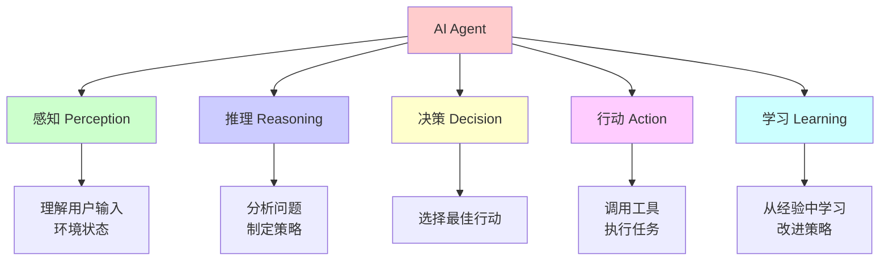

### 1. 自主性（Autonomy）

- **定义**：能够独立运行，无需人工干预
- **特点**：自主感知环境、做出决策、执行行动
- **示例**：自动完成复杂任务流程

### 2. 反应性（Reactivity）

- **定义**：能够感知环境变化并做出响应
- **特点**：实时响应外部事件
- **示例**：监控系统状态并自动处理异常

### 3. 主动性（Proactiveness）

- **定义**：能够主动采取行动实现目标
- **特点**：不被动等待，主动规划
- **示例**：主动发现并解决问题

### 4. 社会性（Social Ability）

- **定义**：能够与其他 Agent 或人类交互
- **特点**：协作、通信、协商
- **示例**：多 Agent 协作完成任务

## AI Agent vs 传统 AI

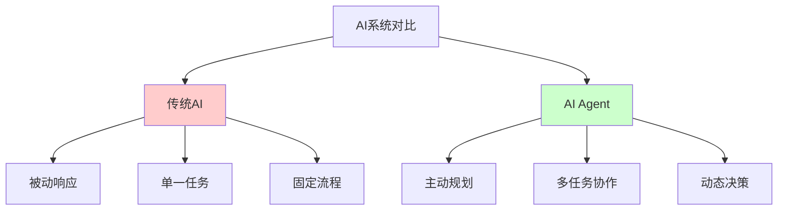

| 特性 | 传统 AI | AI Agent |
|------|---------|----------|
| **工作方式** | 被动响应 | 主动规划 |
| **任务范围** | 单一任务 | 多任务协作 |
| **决策能力** | 固定规则 | 动态决策 |
| **工具使用** | 无 | 可调用外部工具 |
| **记忆能力** | 无状态 | 长期记忆 |
| **学习能力** | 需要重新训练 | 从经验学习 |

## AI Agent 的组成

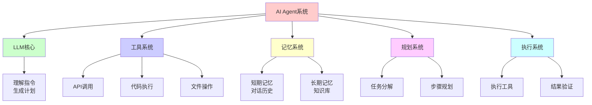

# AI Agent 能做什么

## 解决什么问题

### 1. 复杂任务自动化

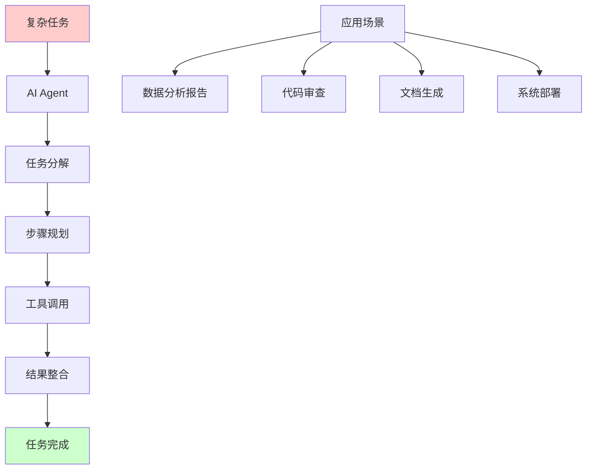

**问题**：传统自动化需要预先定义所有规则，难以处理复杂、动态的任务。

**解决**：AI Agent 可以理解任务意图，动态规划执行步骤，自动完成复杂任务。

### 2. 多步骤决策问题

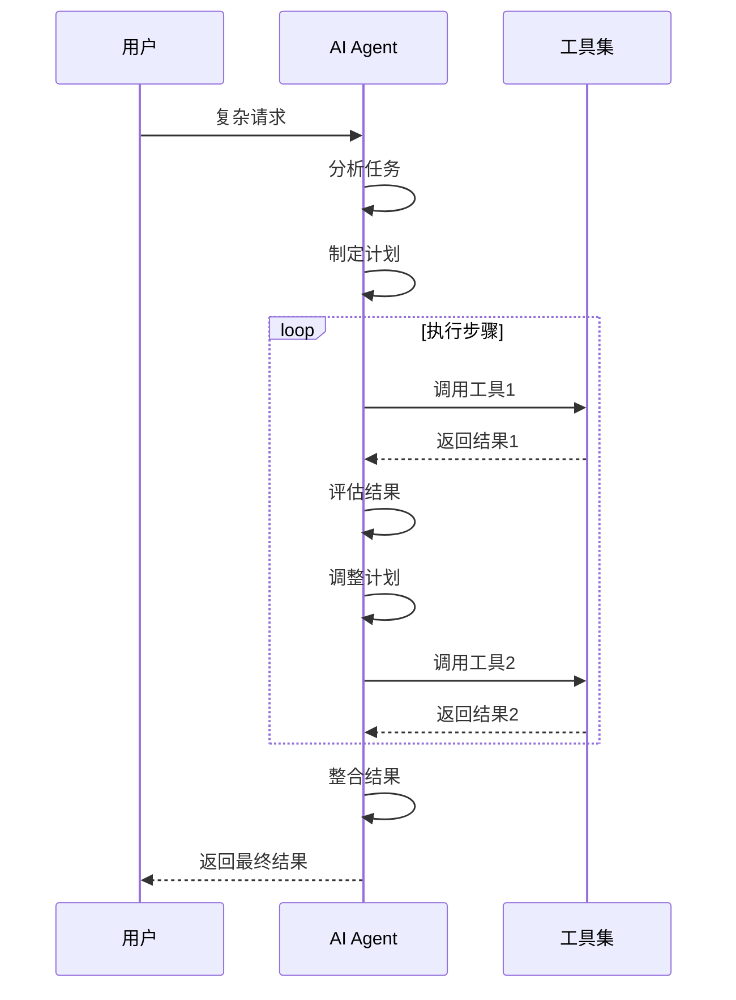

**问题**：需要多步骤决策和动态调整的任务。

**解决**：AI Agent 可以规划多步骤任务，根据中间结果动态调整策略。

### 3. 跨系统集成

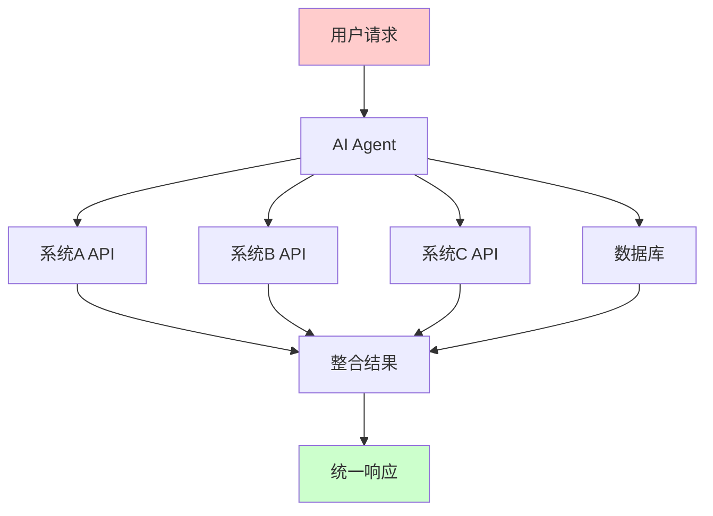

**问题**：需要整合多个系统、API 和数据库。

**解决**：AI Agent 可以作为统一接口，整合多个系统资源。

### 4. 智能助手和代理

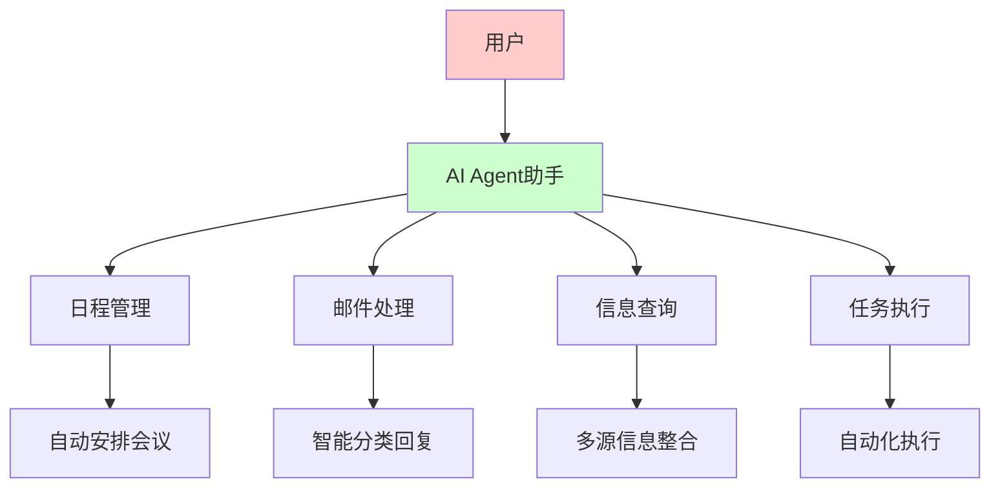

**问题**：需要智能理解用户意图并执行相应操作。

**解决**：AI Agent 可以理解自然语言指令，自动执行相应操作。

## 应用场景

### 1. 代码开发助手

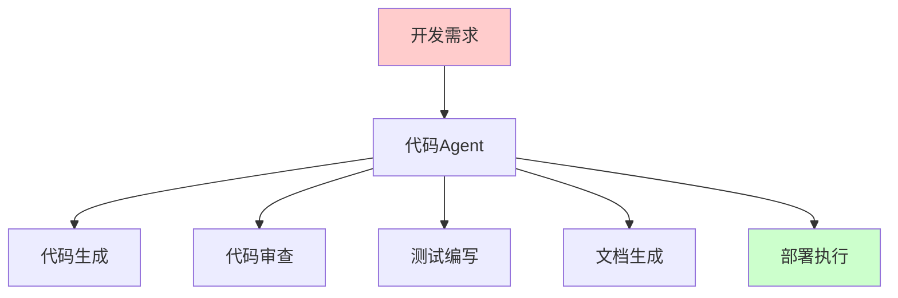

**功能**：
- 根据需求生成代码
- 代码审查和优化建议
- 自动编写测试用例
- 生成技术文档
- 自动化部署

### 2. 数据分析 Agent

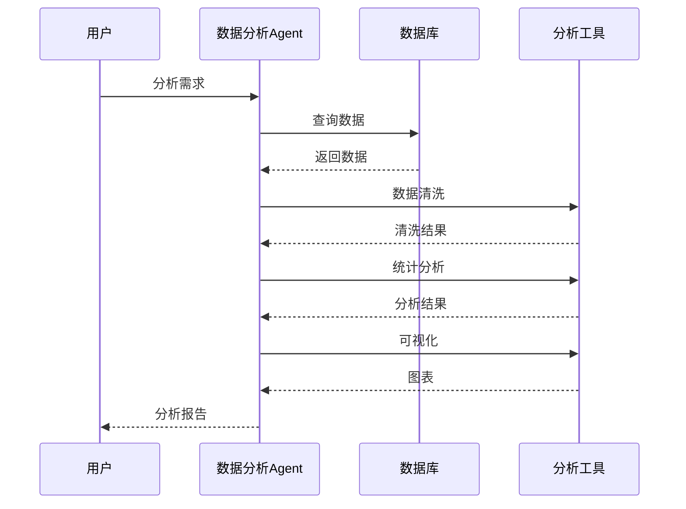

**功能**：
- 自动查询和分析数据
- 生成数据报告
- 创建可视化图表
- 发现数据洞察

### 3. 客户服务 Agent

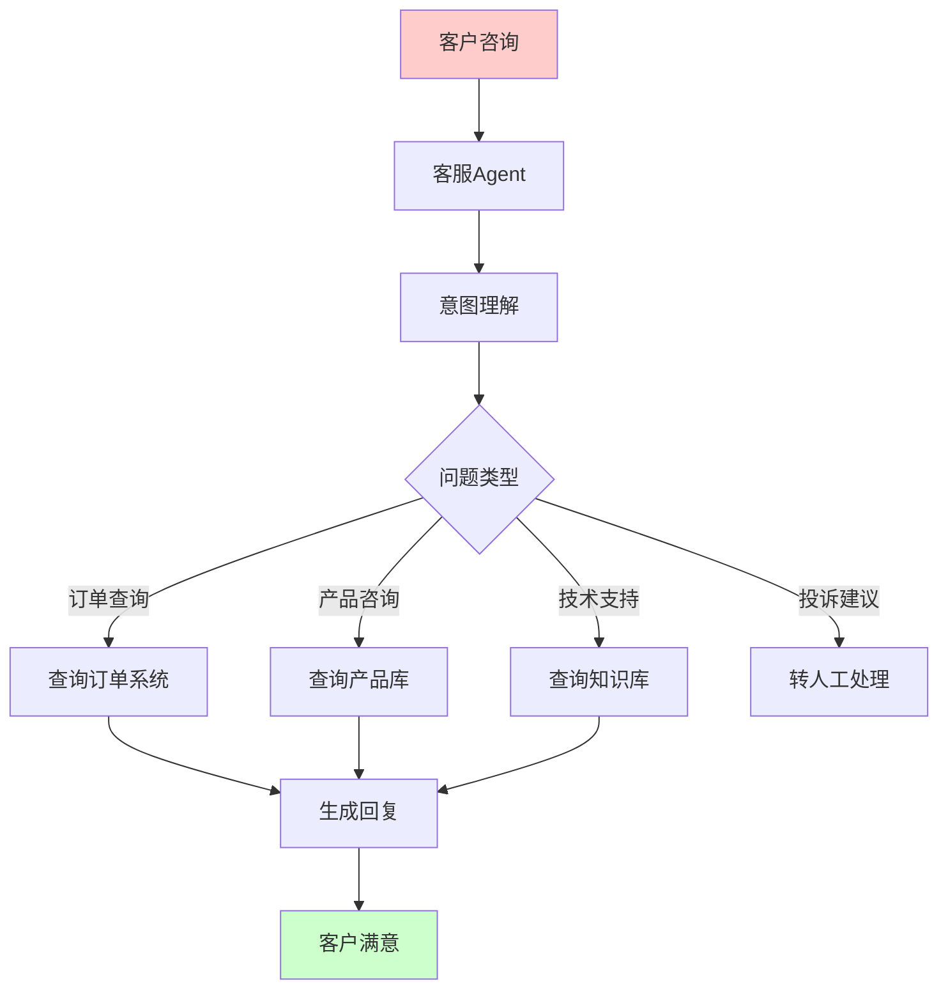

**功能**：
- 自动回答常见问题
- 查询订单、产品信息
- 提供技术支持
- 转接人工服务

### 4. 研究助手 Agent

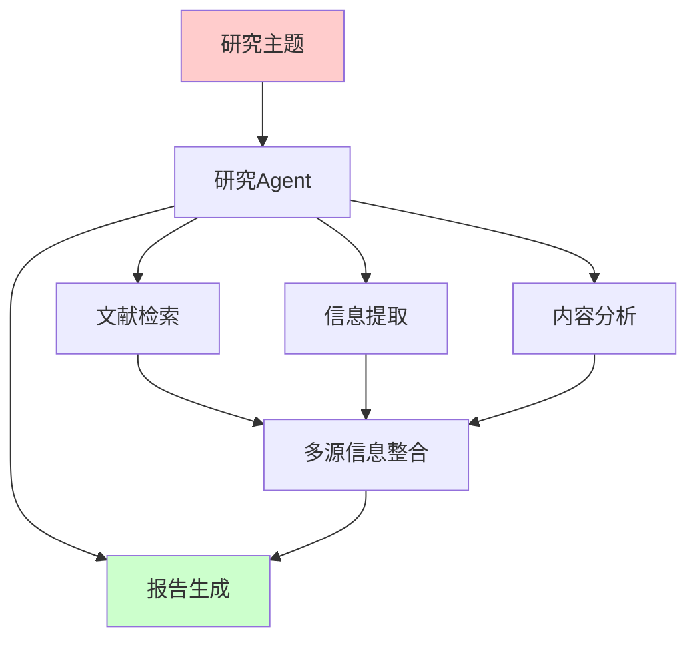

**功能**：
- 自动检索相关文献
- 提取关键信息
- 分析内容关联
- 生成研究报告

# AI Agent 架构

## 系统架构

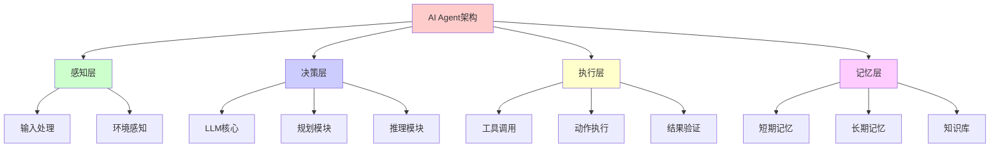

## 核心组件

### 1. LLM 核心（Brain）

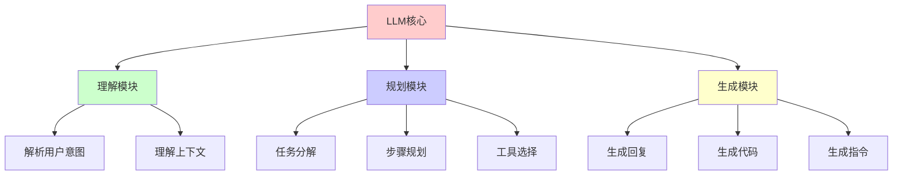

**功能**：
- 理解自然语言指令
- 生成执行计划
- 做出决策
- 生成响应

### 2. 工具系统（Tools）

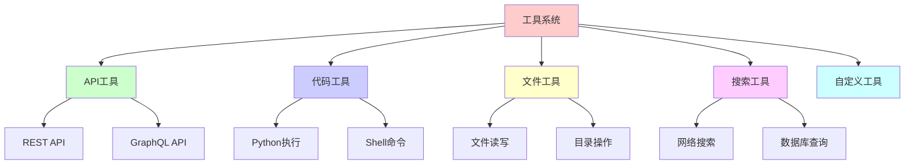

**工具类型**：
- **API 工具**：调用外部 API
- **代码工具**：执行代码
- **文件工具**：文件操作
- **搜索工具**：信息检索
- **自定义工具**：业务特定工具

### 3. 记忆系统（Memory）

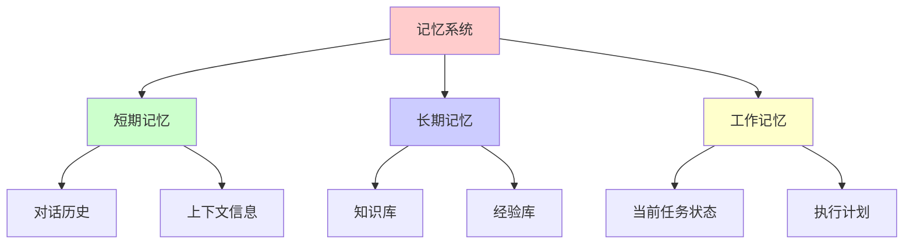

**记忆类型**：
- **短期记忆**：当前对话上下文
- **长期记忆**：持久化知识库
- **工作记忆**：任务执行状态

### 4. 规划系统（Planning）

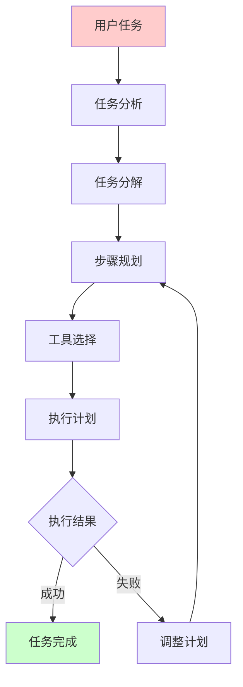

**规划流程**：
1. **任务分析**：理解任务目标
2. **任务分解**：将复杂任务分解为子任务
3. **步骤规划**：确定执行顺序
4. **工具选择**：选择合适的工具
5. **执行监控**：监控执行过程
6. **动态调整**：根据结果调整计划

### 5. 执行系统（Execution）

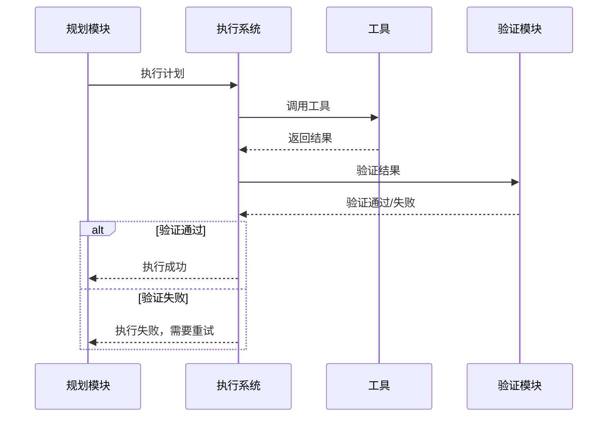

**执行流程**：
1. 接收执行计划
2. 调用相应工具
3. 验证执行结果
4. 处理错误和重试
5. 返回执行状态

## 工作流程

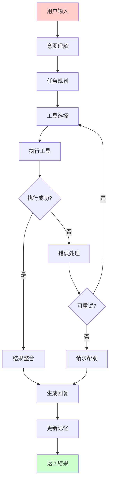

# 搭建 AI Agent

## 技术栈选择

### 1. 框架选择

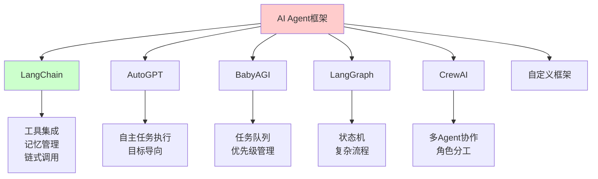

### 2. LLM 选择

| LLM | 特点 | 适用场景 |
|-----|------|---------|
| **GPT-4** | 能力强，成本高 | 复杂任务 |
| **GPT-3.5** | 性价比高 | 一般任务 |
| **Claude** | 安全性好 | 企业应用 |
| **Llama** | 开源免费 | 本地部署 |
| **Qwen** | 中文能力强 | 中文场景 |

## 基础 AI Agent 实现

### 使用 LangChain 实现

#### 1. 安装依赖

```bash
pip install langchain
pip install langchain-openai
pip install langchain-community
pip install langchain-experimental
```

#### 2. 简单 Agent 示例

```python
from langchain.agents import initialize_agent, AgentType
from langchain.llms import OpenAI
from langchain.tools import Tool
from langchain.utilities import SerpAPIWrapper

# 初始化 LLM
llm = OpenAI(temperature=0)

# 定义工具
search = SerpAPIWrapper()
tools = [
    Tool(
        name="Search",
        func=search.run,
        description="用于搜索最新信息，当需要查找当前事件、新闻或实时信息时使用"
    ),
    Tool(
        name="Calculator",
        func=lambda x: eval(x),
        description="用于执行数学计算，输入数学表达式字符串"
    )
]

# 创建 Agent
agent = initialize_agent(
    tools=tools,
    llm=llm,
    agent=AgentType.ZERO_SHOT_REACT_DESCRIPTION,
    verbose=True
)

# 使用 Agent
response = agent.run("搜索今天北京的天气，然后计算如果温度是25度，转换成华氏度是多少？")
print(response)
```

#### 3. 自定义工具 Agent

```python
from langchain.agents import AgentExecutor, create_react_agent
from langchain.prompts import PromptTemplate
from langchain.tools import Tool
from langchain_openai import ChatOpenAI
import requests
import json

# 定义自定义工具
def get_weather(city: str) -> str:
    """获取城市天气信息"""
    # 这里使用示例 API，实际使用时需要替换为真实的天气 API
    try:
        # 示例：使用 OpenWeatherMap API
        api_key = "your_api_key"
        url = f"http://api.openweathermap.org/data/2.5/weather?q={city}&appid={api_key}"
        response = requests.get(url)
        data = response.json()
        return f"{city}的天气: {data['weather'][0]['description']}, 温度: {data['main']['temp']}K"
    except Exception as e:
        return f"获取天气信息失败: {str(e)}"

def send_email(to: str, subject: str, body: str) -> str:
    """发送邮件"""
    # 实现邮件发送逻辑
    return f"邮件已发送到 {to}，主题: {subject}"

# 创建工具列表
tools = [
    Tool(
        name="GetWeather",
        func=get_weather,
        description="获取指定城市的天气信息。输入应该是城市名称，如'北京'或'Shanghai'"
    ),
    Tool(
        name="SendEmail",
        func=send_email,
        description="发送邮件。输入应该是JSON格式: {'to': 'email@example.com', 'subject': '主题', 'body': '内容'}"
    )
]

# 创建提示词模板
prompt = PromptTemplate.from_template("""
你是一个有用的AI助手，可以使用以下工具：

{tools}

使用以下格式回答：

Question: 输入的问题
Thought: 你应该思考要做什么
Action: 要采取的行动，应该是[{tool_names}]中的一个
Action Input: 行动的输入
Observation: 行动的结果
... (这个思考/行动/行动输入/观察可以重复N次)
Thought: 我现在知道最终答案了
Final Answer: 原始输入问题的最终答案

开始！

Question: {input}
Thought: {agent_scratchpad}
""")

# 初始化 LLM
llm = ChatOpenAI(temperature=0, model="gpt-3.5-turbo")

# 创建 Agent
agent = create_react_agent(llm, tools, prompt)

# 创建 Agent 执行器
agent_executor = AgentExecutor(
    agent=agent,
    tools=tools,
    verbose=True,
    handle_parsing_errors=True
)

# 使用 Agent
result = agent_executor.invoke({
    "input": "查询北京的天气，如果温度低于20度，发送邮件提醒我多穿衣服"
})
print(result["output"])
```

## 高级 AI Agent 实现

### 1. 带记忆的 Agent

```python
from langchain.memory import ConversationBufferMemory
from langchain.agents import initialize_agent, AgentType

# 创建记忆
memory = ConversationBufferMemory(
    memory_key="chat_history",
    return_messages=True
)

# 创建带记忆的 Agent
agent = initialize_agent(
    tools=tools,
    llm=llm,
    agent=AgentType.CONVERSATIONAL_REACT_DESCRIPTION,
    memory=memory,
    verbose=True
)

# 使用 Agent（可以记住之前的对话）
response1 = agent.run("我的名字是张三")
response2 = agent.run("我刚才告诉你我的名字是什么？")
```

### 2. 多 Agent 协作

```python
from langchain.agents import AgentExecutor
from langchain.agents import create_react_agent
from langchain.prompts import PromptTemplate

# 定义不同角色的 Agent
class ResearchAgent:
    """研究 Agent：负责信息检索和分析"""
    def __init__(self):
        self.tools = [search_tool]
        self.llm = ChatOpenAI(temperature=0)
        self.agent = self._create_agent()
    
    def _create_agent(self):
        prompt = PromptTemplate.from_template("""
        你是一个研究助手，负责搜索和分析信息。
        {tools}
        {input}
        """)
        return create_react_agent(self.llm, self.tools, prompt)
    
    def research(self, topic: str):
        executor = AgentExecutor(agent=self.agent, tools=self.tools)
        return executor.invoke({"input": f"研究主题: {topic}"})

class WritingAgent:
    """写作 Agent：负责内容生成"""
    def __init__(self):
        self.llm = ChatOpenAI(temperature=0.7)
    
    def write(self, topic: str, research_results: str):
        prompt = f"""
        基于以下研究结果，写一篇关于{topic}的文章：
        
        {research_results}
        
        请生成一篇结构清晰、内容丰富的文章。
        """
        return self.llm.invoke(prompt)

# 多 Agent 协作
research_agent = ResearchAgent()
writing_agent = WritingAgent()

# 协作完成任务
topic = "人工智能的发展趋势"
research_results = research_agent.research(topic)
article = writing_agent.write(topic, research_results["output"])
print(article)
```

### 3. 自主规划 Agent

```python
from langchain.agents import AgentExecutor
from langchain.schema import AgentAction, AgentFinish
from typing import List, Tuple

class PlanningAgent:
    """自主规划 Agent"""
    
    def __init__(self, tools, llm):
        self.tools = tools
        self.llm = llm
        self.plan = []
        self.current_step = 0
    
    def create_plan(self, goal: str) -> List[str]:
        """创建执行计划"""
        prompt = f"""
        目标: {goal}
        
        请将这个目标分解为具体的执行步骤，每步一行。
        只输出步骤，不要其他内容。
        """
        response = self.llm.invoke(prompt)
        steps = [step.strip() for step in response.content.split('\n') if step.strip()]
        self.plan = steps
        return steps
    
    def execute_plan(self, goal: str):
        """执行计划"""
        # 创建计划
        plan = self.create_plan(goal)
        print(f"执行计划: {plan}")
        
        results = []
        for i, step in enumerate(plan):
            print(f"\n执行步骤 {i+1}: {step}")
            
            # 为每个步骤创建 Agent
            step_agent = initialize_agent(
                tools=self.tools,
                llm=self.llm,
                agent=AgentType.ZERO_SHOT_REACT_DESCRIPTION,
                verbose=True
            )
            
            # 执行步骤
            result = step_agent.run(f"目标: {goal}\n当前步骤: {step}")
            results.append({
                "step": step,
                "result": result
            })
        
        return results

# 使用自主规划 Agent
tools = [search_tool, calculator_tool]
llm = ChatOpenAI(temperature=0)

agent = PlanningAgent(tools, llm)
results = agent.execute_plan("研究人工智能的最新发展，并写一份总结报告")
```

### 4. 带工具链的 Agent

```python
from langchain.chains import LLMChain
from langchain.prompts import PromptTemplate

class ToolChainAgent:
    """工具链 Agent：按顺序执行多个工具"""
    
    def __init__(self, tools, llm):
        self.tools = {tool.name: tool for tool in tools}
        self.llm = llm
    
    def execute_chain(self, task: str, tool_sequence: List[str]):
        """按顺序执行工具链"""
        context = {"task": task, "results": []}
        
        for tool_name in tool_sequence:
            if tool_name not in self.tools:
                continue
            
            tool = self.tools[tool_name]
            print(f"执行工具: {tool_name}")
            
            # 根据任务和之前的结果决定工具输入
            tool_input = self._determine_input(task, context, tool_name)
            result = tool.run(tool_input)
            
            context["results"].append({
                "tool": tool_name,
                "input": tool_input,
                "output": result
            })
        
        # 整合所有结果
        final_result = self._synthesize_results(task, context)
        return final_result
    
    def _determine_input(self, task: str, context: dict, tool_name: str) -> str:
        """确定工具输入"""
        prompt = PromptTemplate.from_template("""
        任务: {task}
        已执行的结果: {results}
        下一个要使用的工具: {tool_name}
        
        请确定这个工具的输入应该是什么。
        只输出输入内容，不要其他说明。
        """)
        chain = LLMChain(llm=self.llm, prompt=prompt)
        return chain.run(
            task=task,
            results=str(context["results"]),
            tool_name=tool_name
        )
    
    def _synthesize_results(self, task: str, context: dict) -> str:
        """整合结果"""
        prompt = PromptTemplate.from_template("""
        任务: {task}
        执行结果: {results}
        
        请整合所有执行结果，生成最终答案。
        """)
        chain = LLMChain(llm=self.llm, prompt=prompt)
        return chain.run(
            task=task,
            results=str(context["results"])
        )

# 使用工具链 Agent
tools = [search_tool, calculator_tool, email_tool]
agent = ToolChainAgent(tools, llm)

result = agent.execute_chain(
    task="搜索今天的天气，计算平均温度，然后发送邮件报告",
    tool_sequence=["Search", "Calculator", "SendEmail"]
)
```

## 完整 AI Agent 系统示例

### 项目结构

```
ai-agent-system/
├── agents/
│   ├── base_agent.py      # 基础 Agent 类
│   ├── research_agent.py  # 研究 Agent
│   └── task_agent.py      # 任务 Agent
├── tools/
│   ├── search_tool.py     # 搜索工具
│   ├── api_tool.py        # API 工具
│   └── file_tool.py       # 文件工具
├── memory/
│   ├── short_term.py      # 短期记忆
│   └── long_term.py       # 长期记忆
├── config.py              # 配置文件
├── main.py                # 主程序
└── requirements.txt       # 依赖
```

### 配置文件

```python
# config.py
import os
from dotenv import load_dotenv

load_dotenv()

class Config:
    # OpenAI 配置
    OPENAI_API_KEY = os.getenv("OPENAI_API_KEY")
    OPENAI_MODEL = "gpt-4"
    
    # Agent 配置
    MAX_ITERATIONS = 10
    TEMPERATURE = 0
    
    # 工具配置
    SEARCH_API_KEY = os.getenv("SEARCH_API_KEY")
    
    # 记忆配置
    MEMORY_MAX_TOKENS = 2000
    MEMORY_PERSIST_DIR = "./memory"
```

### 基础 Agent 类

```python
# agents/base_agent.py
from langchain.agents import AgentExecutor, create_react_agent
from langchain.prompts import PromptTemplate
from langchain_openai import ChatOpenAI
from typing import List, Dict, Any

class BaseAgent:
    """基础 Agent 类"""
    
    def __init__(
        self,
        name: str,
        tools: List,
        llm: ChatOpenAI,
        system_prompt: str = None
    ):
        self.name = name
        self.tools = tools
        self.llm = llm
        self.system_prompt = system_prompt or self._default_prompt()
        self.agent = self._create_agent()
        self.executor = AgentExecutor(
            agent=self.agent,
            tools=tools,
            verbose=True,
            max_iterations=10,
            handle_parsing_errors=True
        )
    
    def _default_prompt(self) -> str:
        """默认提示词"""
        return f"""
        你是一个有用的AI助手，名字是{self.name}。
        你可以使用以下工具来帮助用户：
        
        {{tools}}
        
        使用以下格式回答：
        
        Question: 输入的问题
        Thought: 你应该思考要做什么
        Action: 要采取的行动，应该是[{{tool_names}}]中的一个
        Action Input: 行动的输入
        Observation: 行动的结果
        ... (这个思考/行动/行动输入/观察可以重复N次)
        Thought: 我现在知道最终答案了
        Final Answer: 原始输入问题的最终答案
        
        开始！
        
        Question: {{input}}
        Thought: {{agent_scratchpad}}
        """
    
    def _create_agent(self):
        """创建 Agent"""
        prompt = PromptTemplate.from_template(self.system_prompt)
        return create_react_agent(self.llm, self.tools, prompt)
    
    def run(self, input_text: str) -> Dict[str, Any]:
        """运行 Agent"""
        result = self.executor.invoke({"input": input_text})
        return {
            "agent": self.name,
            "input": input_text,
            "output": result["output"],
            "intermediate_steps": result.get("intermediate_steps", [])
        }
    
    def stream(self, input_text: str):
        """流式运行 Agent"""
        for chunk in self.executor.stream({"input": input_text}):
            yield chunk
```

### 主程序

```python
# main.py
from agents.base_agent import BaseAgent
from tools.search_tool import create_search_tool
from tools.api_tool import create_api_tool
from langchain_openai import ChatOpenAI
from config import Config

def main():
    # 初始化 LLM
    llm = ChatOpenAI(
        temperature=Config.TEMPERATURE,
        model_name=Config.OPENAI_MODEL
    )
    
    # 创建工具
    tools = [
        create_search_tool(),
        create_api_tool(),
    ]
    
    # 创建 Agent
    agent = BaseAgent(
        name="Assistant",
        tools=tools,
        llm=llm,
        system_prompt="""
        你是一个智能助手，可以帮助用户完成各种任务。
        你可以搜索信息、调用API、处理文件等。
        始终以友好、专业的方式回答用户的问题。
        """
    )
    
    # 交互式使用
    print("AI Agent 已启动，输入 'exit' 退出")
    while True:
        user_input = input("\n用户: ")
        if user_input.lower() == 'exit':
            break
        
        try:
            result = agent.run(user_input)
            print(f"\n助手: {result['output']}")
        except Exception as e:
            print(f"错误: {str(e)}")

if __name__ == "__main__":
    main()
```

# AI Agent 最佳实践

## 1. 工具设计

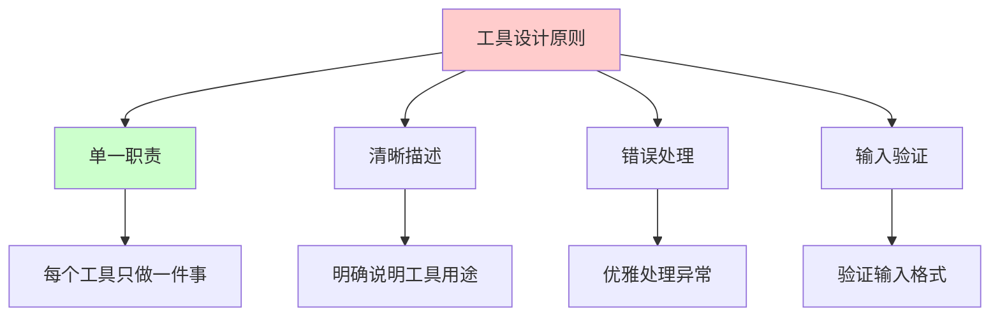

**建议**：
- 工具应该有清晰的名称和描述
- 工具应该处理错误情况
- 工具输入应该易于理解
- 工具输出应该结构化

## 2. 提示词工程

```mermaid
graph TB
    A[提示词设计] --> B[系统提示]
    A --> C[任务描述]
    A --> D[约束条件]
    A --> E[示例说明]
    
    B --> B1[定义Agent角色]
    C --> C2[明确任务目标]
    D --> D3[限制行为范围]
    E --> E4[提供示例]
    
    style A fill:#ffcccc
    style B fill:#ccffcc
```

**建议**：
- 明确 Agent 的角色和能力
- 提供清晰的指令格式
- 包含示例和约束
- 使用思维链（Chain of Thought）

## 3. 错误处理

```mermaid
flowchart TD
    A[执行工具] --> B{执行成功?}
    B -->|是| C[继续执行]
    B -->|否| D[错误类型判断]
    D --> E{可重试?}
    E -->|是| F[重试执行]
    E -->|否| G{可替代?}
    G -->|是| H[使用替代方案]
    G -->|否| I[返回错误信息]
    F --> B
    H --> C
    I --> J[记录错误]
    
    style A fill:#ffcccc
    style C fill:#ccffcc
    style I fill:#ffcccc
```

**建议**：
- 实现重试机制
- 提供替代方案
- 记录错误日志
- 优雅降级

## 4. 性能优化

```mermaid
graph TB
    A[性能优化] --> B[并行执行]
    A --> C[缓存结果]
    A --> D[限制迭代]
    A --> E[工具选择优化]
    
    B --> B1[同时执行独立任务]
    C --> C2[缓存常用查询]
    D --> D3[设置最大迭代次数]
    E --> E4[优先选择高效工具]
    
    style A fill:#ffcccc
    style B fill:#ccffcc
```

**建议**：
- 并行执行独立任务
- 缓存常用查询结果
- 限制最大迭代次数
- 优化工具选择策略

# 常见问题和解决方案

## 1. Agent 陷入循环

**问题**：Agent 重复执行相同操作。

**解决方案**：
- 设置最大迭代次数
- 检测重复操作
- 使用记忆避免重复

## 2. 工具选择错误

**问题**：Agent 选择了错误的工具。

**解决方案**：
- 改进工具描述
- 提供更好的示例
- 使用工具选择器

## 3. 执行超时

**问题**：Agent 执行时间过长。

**解决方案**：
- 设置超时限制
- 优化工具性能
- 并行执行任务

## 4. 结果不准确

**问题**：Agent 生成的结果不准确。

**解决方案**：
- 改进提示词
- 添加验证步骤
- 使用更好的 LLM

# AI Agent 应用案例

## 1. 代码开发 Agent

```mermaid
graph TB
    A[开发需求] --> B[代码Agent]
    B --> C[需求分析]
    C --> D[代码生成]
    D --> E[代码审查]
    E --> F[测试编写]
    F --> G[文档生成]
    G --> H[部署执行]
    
    style A fill:#ffcccc
    style H fill:#ccffcc
```

## 2. 数据分析 Agent

```mermaid
sequenceDiagram
    participant User as 用户
    participant Agent as 数据分析Agent
    participant DB as 数据库
    participant Viz as 可视化工具
    
    User->>Agent: 分析需求
    Agent->>DB: 查询数据
    DB-->>Agent: 返回数据
    Agent->>Agent: 数据清洗
    Agent->>Agent: 统计分析
    Agent->>Viz: 生成图表
    Viz-->>Agent: 返回图表
    Agent-->>User: 分析报告
```

## 3. 客户服务 Agent

```mermaid
graph TB
    A[客户咨询] --> B[客服Agent]
    B --> C[意图识别]
    C --> D{问题类型}
    D -->|订单| E[查询订单]
    D -->|产品| F[查询产品]
    D -->|技术| G[查询知识库]
    D -->|投诉| H[转人工]
    E --> I[生成回复]
    F --> I
    G --> I
    I --> J[客户满意]
    
    style A fill:#ffcccc
    style J fill:#ccffcc
```

# 总结

AI Agent 是一种强大的 AI 系统，具有以下特点：

## 核心优势

- **自主性**：能够独立完成任务
- **灵活性**：可以处理复杂、动态的任务
- **扩展性**：可以集成各种工具和服务
- **智能性**：能够理解和规划任务

## 关键组件

1. **LLM 核心**：理解和决策
2. **工具系统**：执行具体操作
3. **记忆系统**：保存上下文和经验
4. **规划系统**：制定执行计划
5. **执行系统**：执行和监控任务

## 适用场景

- 复杂任务自动化
- 多步骤决策问题
- 跨系统集成
- 智能助手和代理

理解 AI Agent 技术有助于：
- 构建智能自动化系统
- 提升 AI 应用能力
- 实现复杂任务自动化
- 开发智能助手应用

# 参考文献

- [LangChain Documentation](https://python.langchain.com/)
- [ReAct: Synergizing Reasoning and Acting in Language Models](https://arxiv.org/abs/2210.03629)
- [AutoGPT](https://github.com/Significant-Gravitas/AutoGPT)
- [BabyAGI](https://github.com/yoheinakajima/babyagi)
