# 什么是 RAG

RAG（Retrieval-Augmented Generation，检索增强生成）是一种结合信息检索和生成式 AI 的技术，通过从外部知识库检索相关信息来增强大语言模型（LLM）的生成能力。

## RAG 的核心思想

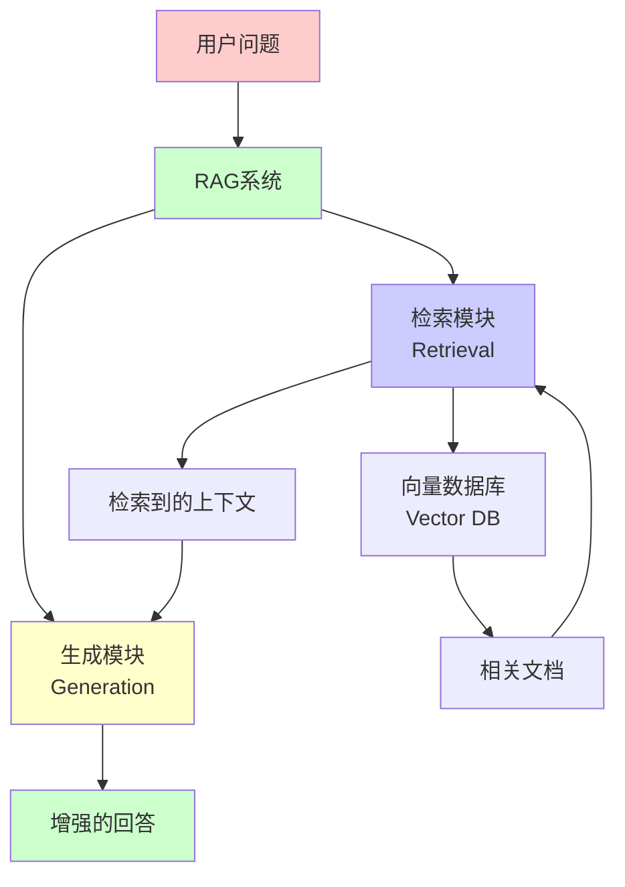

## RAG 解决的问题

### 1. 知识更新问题

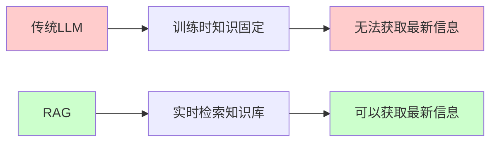

**问题**：LLM 的训练数据有截止日期，无法获取训练后的新信息。

**解决**：RAG 通过检索外部知识库，可以获取最新信息。

### 2. 知识准确性问题

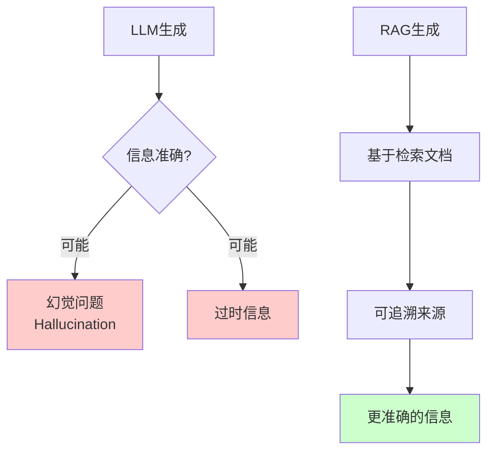

**问题**：LLM 可能产生幻觉（hallucination），生成不准确的信息。

**解决**：RAG 基于检索到的真实文档生成，可以追溯信息来源。

### 3. 领域知识问题

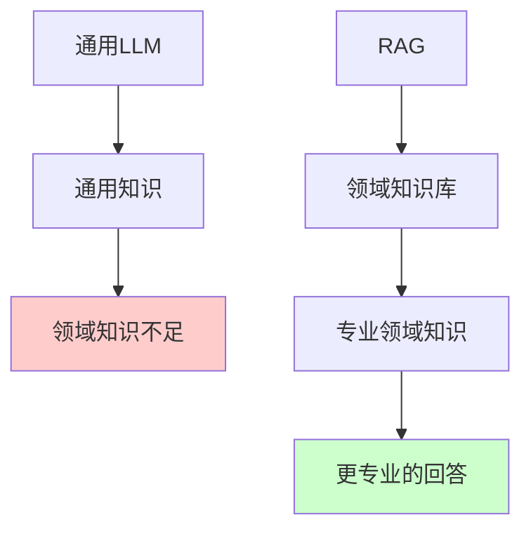

**问题**：通用 LLM 在特定领域知识不足。

**解决**：RAG 可以检索领域特定的知识库，提供专业回答。

## RAG 的工作原理

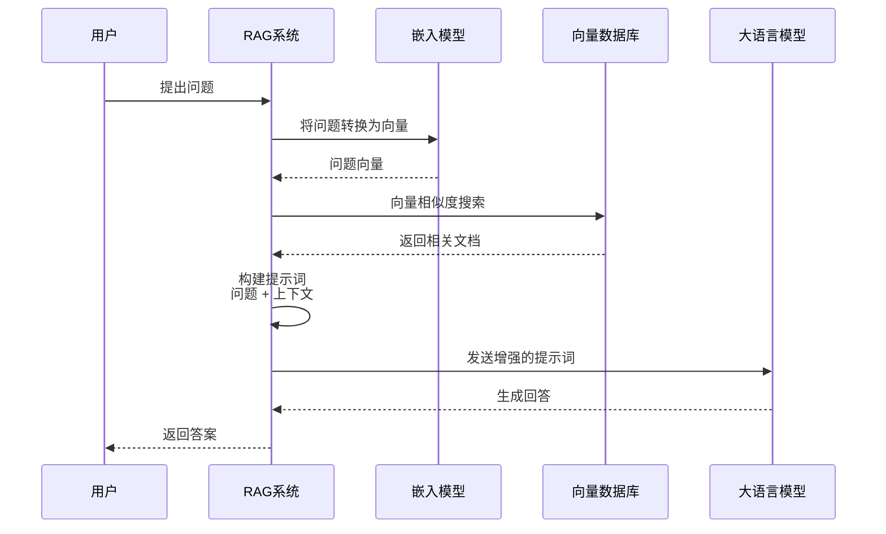

## RAG vs 传统 LLM

| 特性 | 传统 LLM | RAG |
|------|---------|-----|
| **知识来源** | 训练数据 | 训练数据 + 外部知识库 |
| **知识更新** | 需要重新训练 | 更新知识库即可 |
| **准确性** | 可能产生幻觉 | 基于真实文档 |
| **可追溯性** | 无法追溯 | 可以追溯来源 |
| **领域适应性** | 通用 | 可适配特定领域 |
| **成本** | 训练成本高 | 检索成本低 |

# RAG 能做什么

## 1. 智能问答系统

基于文档库的问答系统：

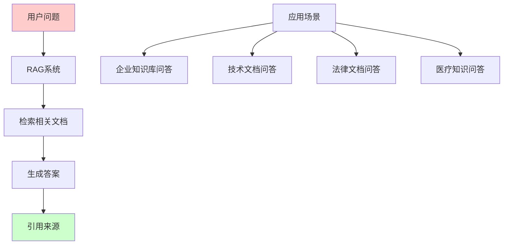

**应用场景**：
- 企业内部知识库问答
- 技术文档智能助手
- 法律条文查询系统
- 医疗知识问答

## 2. 文档摘要生成

基于检索的文档摘要：

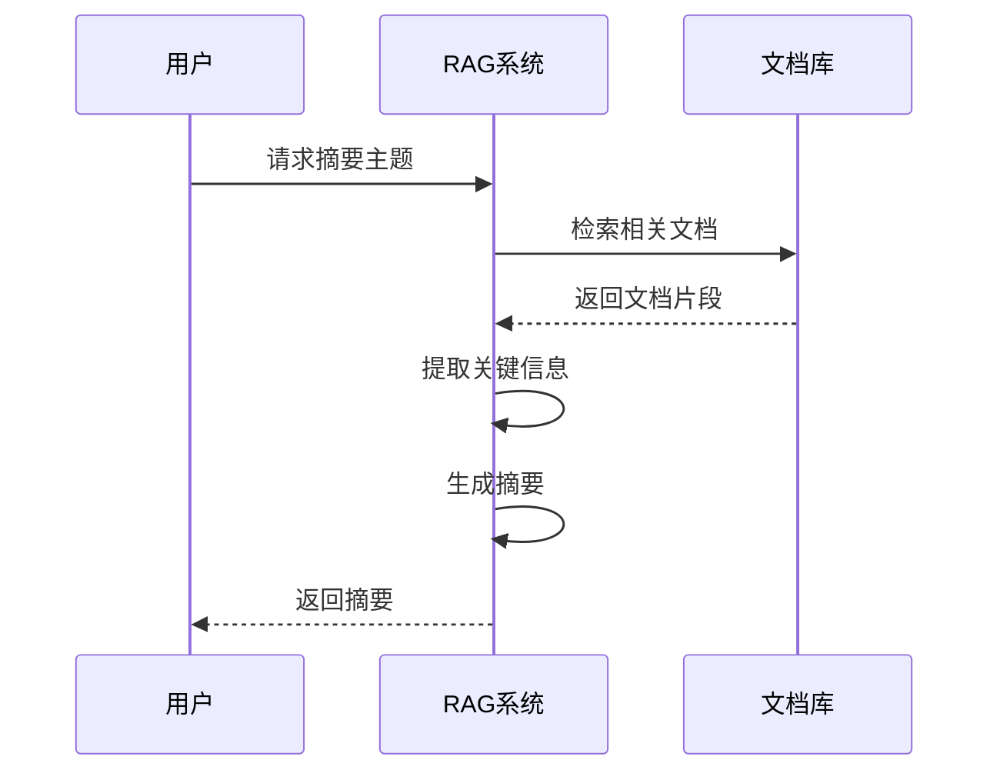

## 3. 代码助手

基于代码库的编程助手：

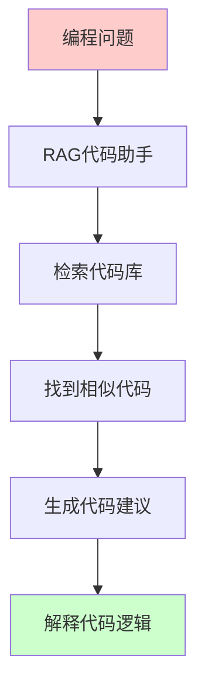

**功能**：
- 代码搜索和推荐
- 代码解释和文档生成
- 代码补全建议
- 错误诊断和修复建议

## 4. 内容创作辅助

基于知识库的内容创作：

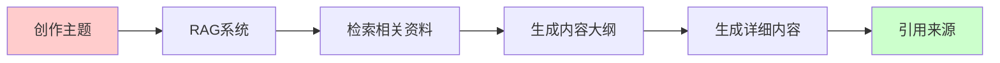

## 5. 多语言翻译增强

结合术语库的翻译：

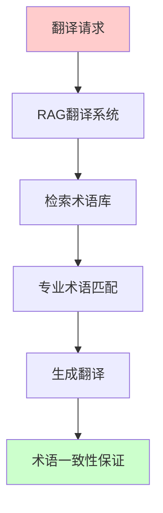

# RAG 架构

## 系统架构

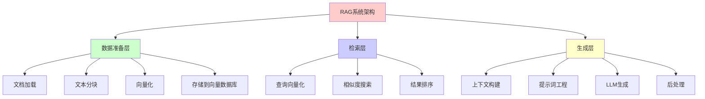

## 核心组件

### 1. 文档加载器（Document Loader）

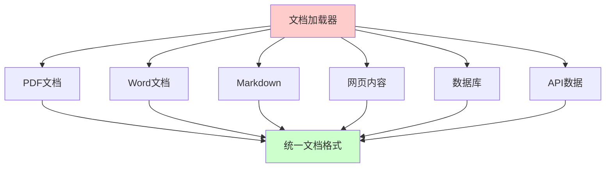

### 2. 文本分块（Text Chunking）

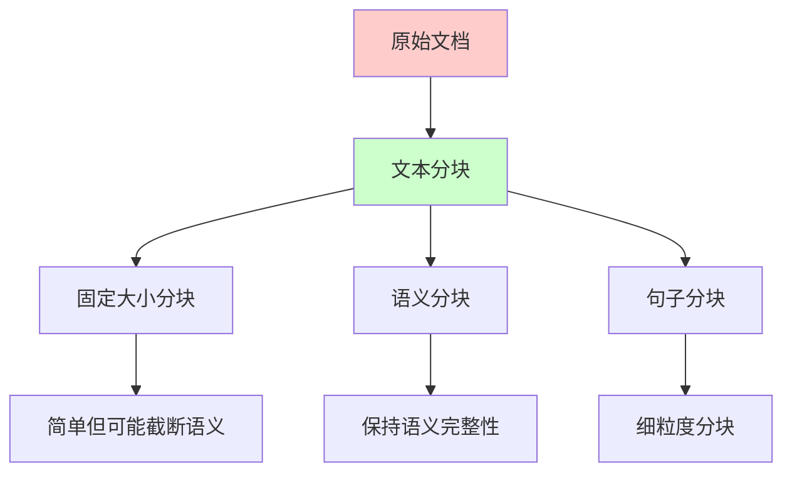

**分块策略**：
- **固定大小**：按字符数或 token 数分块
- **语义分块**：按段落或语义单元分块
- **重叠分块**：块之间有一定重叠，保持上下文

### 3. 向量化（Embedding）

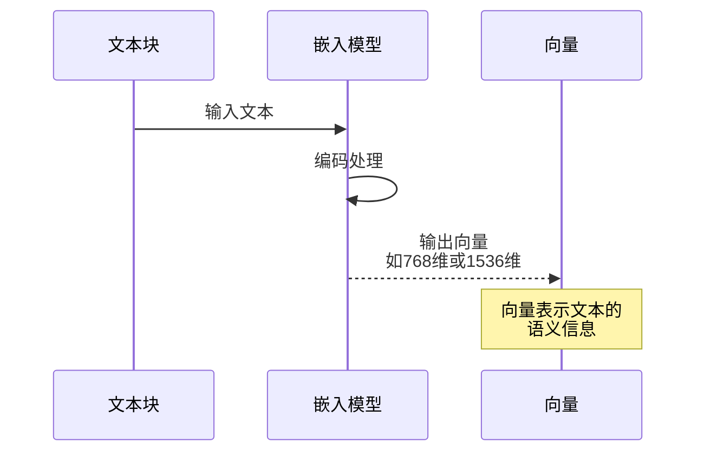

**嵌入模型**：
- **OpenAI**：text-embedding-ada-002, text-embedding-3-small/large
- **开源模型**：sentence-transformers, BGE, M3E
- **多语言模型**：multilingual-e5

### 4. 向量数据库（Vector Database）

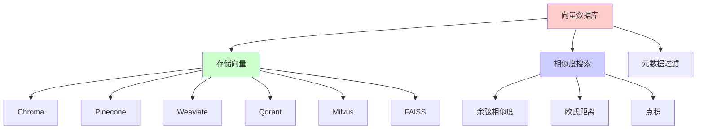

### 5. 检索器（Retriever）

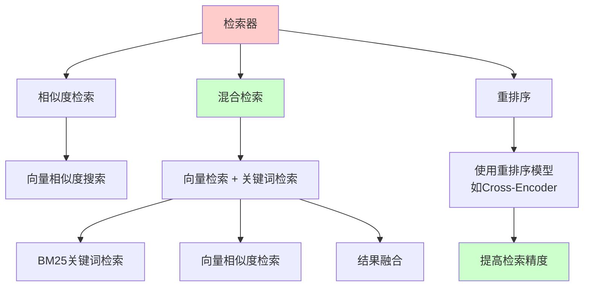

### 6. 生成器（Generator）

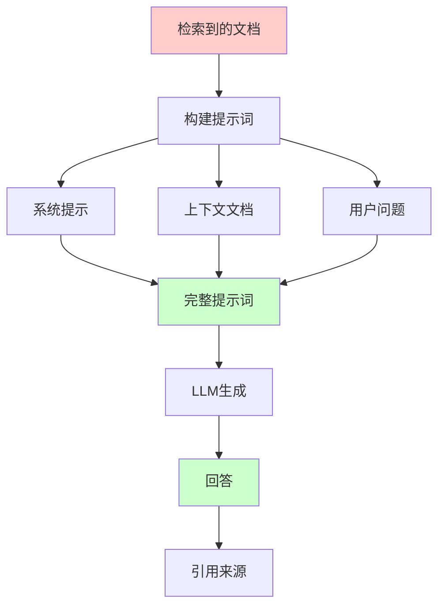

# 搭建 RAG

## 技术栈选择

### 1. 编程语言和框架

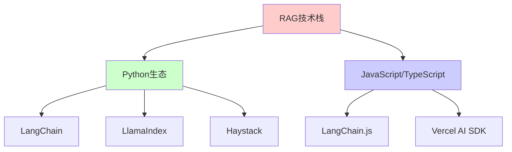

### 2. 组件选择

| 组件 | 选项 | 说明 |
|------|------|------|
| **嵌入模型** | OpenAI, Sentence-Transformers, BGE | 文本向量化 |
| **向量数据库** | Chroma, Pinecone, Weaviate, Qdrant | 向量存储和检索 |
| **LLM** | GPT-4, Claude, Llama, Qwen | 文本生成 |
| **框架** | LangChain, LlamaIndex | RAG 开发框架 |

## 基础 RAG 实现

### 使用 LangChain 实现

#### 1. 安装依赖

```bash
pip install langchain
pip install langchain-openai
pip install chromadb
pip install pypdf
```

#### 2. 完整示例

```python
from langchain.document_loaders import PyPDFLoader
from langchain.text_splitter import RecursiveCharacterTextSplitter
from langchain.embeddings import OpenAIEmbeddings
from langchain.vectorstores import Chroma
from langchain.chains import RetrievalQA
from langchain.llms import OpenAI
from langchain.prompts import PromptTemplate

# 1. 加载文档
loader = PyPDFLoader("document.pdf")
documents = loader.load()

# 2. 文本分块
text_splitter = RecursiveCharacterTextSplitter(
    chunk_size=1000,
    chunk_overlap=200,
    length_function=len,
)
chunks = text_splitter.split_documents(documents)

# 3. 向量化并存储
embeddings = OpenAIEmbeddings()
vectorstore = Chroma.from_documents(
    documents=chunks,
    embedding=embeddings,
    persist_directory="./chroma_db"
)

# 4. 创建检索器
retriever = vectorstore.as_retriever(
    search_type="similarity",
    search_kwargs={"k": 3}
)

# 5. 创建提示词模板
prompt_template = """使用以下上下文信息回答用户的问题。
如果你不知道答案，就说不知道，不要编造答案。

上下文:
{context}

问题: {question}

回答:"""

PROMPT = PromptTemplate(
    template=prompt_template,
    input_variables=["context", "question"]
)

# 6. 创建 RAG 链
qa_chain = RetrievalQA.from_chain_type(
    llm=OpenAI(temperature=0),
    chain_type="stuff",
    retriever=retriever,
    chain_type_kwargs={"prompt": PROMPT},
    return_source_documents=True
)

# 7. 查询
query = "文档的主要内容是什么？"
result = qa_chain({"query": query})

print(f"问题: {query}")
print(f"回答: {result['result']}")
print(f"来源: {result['source_documents']}")
```

### 使用 LlamaIndex 实现

```python
from llama_index import VectorStoreIndex, SimpleDirectoryReader
from llama_index.embeddings import OpenAIEmbedding
from llama_index.llms import OpenAI

# 1. 加载文档
documents = SimpleDirectoryReader("data").load_data()

# 2. 创建索引（自动处理分块和向量化）
index = VectorStoreIndex.from_documents(documents)

# 3. 创建查询引擎
query_engine = index.as_query_engine()

# 4. 查询
response = query_engine.query("文档的主要内容是什么？")
print(response)
```

## 高级 RAG 实现

### 1. 混合检索（Hybrid Search）

结合向量检索和关键词检索：

```python
from langchain.retrievers import BM25Retriever
from langchain.retrievers import EnsembleRetriever

# 向量检索器
vector_retriever = vectorstore.as_retriever(search_kwargs={"k": 5})

# BM25 关键词检索器
bm25_retriever = BM25Retriever.from_documents(chunks)
bm25_retriever.k = 5

# 混合检索器
ensemble_retriever = EnsembleRetriever(
    retrievers=[vector_retriever, bm25_retriever],
    weights=[0.5, 0.5]
)

# 使用混合检索器
qa_chain = RetrievalQA.from_chain_type(
    llm=llm,
    retriever=ensemble_retriever,
    return_source_documents=True
)
```

### 2. 重排序（Re-ranking）

使用重排序模型提高检索精度：

```python
from langchain.retrievers import ContextualCompressionRetriever
from langchain.retrievers.document_compressors import CrossEncoderReranker
from langchain.retrievers.document_compressors import LLMChainExtractor

# 基础检索器
base_retriever = vectorstore.as_retriever(search_kwargs={"k": 10})

# 重排序器
reranker = CrossEncoderReranker(model="cross-encoder/ms-marco-MiniLM-L-6-v2")

# 压缩检索器（重排序）
compression_retriever = ContextualCompressionRetriever(
    base_compressor=reranker,
    base_retriever=base_retriever
)

# 使用重排序检索器
qa_chain = RetrievalQA.from_chain_type(
    llm=llm,
    retriever=compression_retriever,
    return_source_documents=True
)
```

### 3. 多步骤检索（Multi-Step Retrieval）

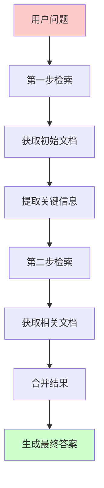

```python
from langchain.chains import RetrievalQA
from langchain.chains.question_answering import load_qa_chain

# 第一步：检索相关文档
initial_docs = vectorstore.similarity_search(query, k=5)

# 提取关键实体或概念
# ... 提取逻辑 ...

# 第二步：基于提取的信息再次检索
refined_query = f"{query} {extracted_entities}"
refined_docs = vectorstore.similarity_search(refined_query, k=3)

# 合并文档
all_docs = initial_docs + refined_docs

# 生成答案
qa_chain = load_qa_chain(llm, chain_type="stuff")
result = qa_chain.run(input_documents=all_docs, question=query)
```

### 4. 父文档检索（Parent Document Retrieval）

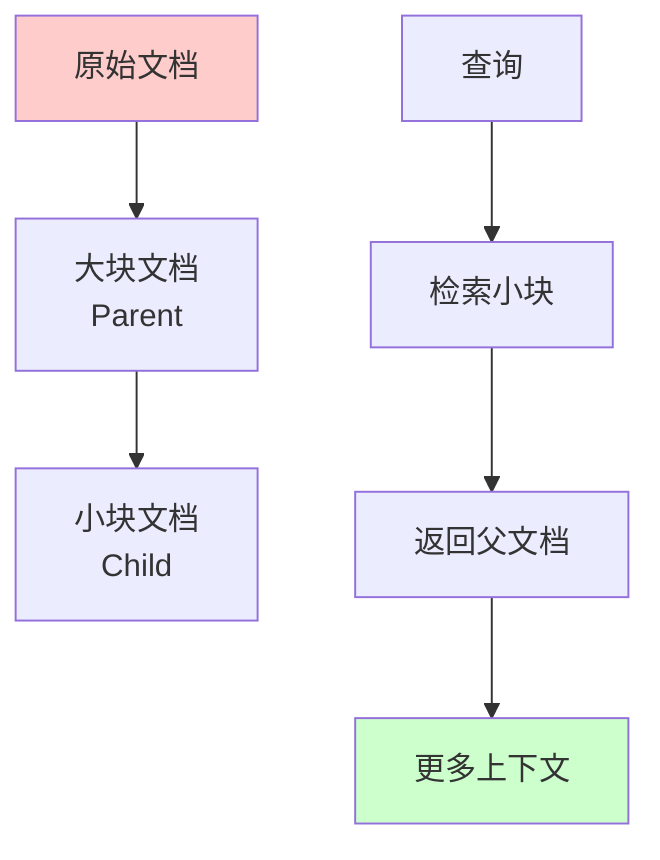

```python
from langchain.retrievers import ParentDocumentRetriever
from langchain.storage import InMemoryStore

# 创建父文档检索器
parent_splitter = RecursiveCharacterTextSplitter(chunk_size=2000)
child_splitter = RecursiveCharacterTextSplitter(chunk_size=400)

vectorstore = Chroma(collection_name="parent_documents")
store = InMemoryStore()

retriever = ParentDocumentRetriever(
    vectorstore=vectorstore,
    docstore=store,
    child_splitter=child_splitter,
    parent_splitter=parent_splitter,
)

# 添加文档
retriever.add_documents(documents)

# 检索（返回父文档）
docs = retriever.get_relevant_documents(query)
```

## 完整 RAG 系统示例

### 项目结构

```
rag-system/
├── data/              # 文档数据
├── chroma_db/         # 向量数据库
├── main.py           # 主程序
├── config.py         # 配置文件
└── requirements.txt  # 依赖
```

### 配置文件

```python
# config.py
import os
from dotenv import load_dotenv

load_dotenv()

class Config:
    # OpenAI 配置
    OPENAI_API_KEY = os.getenv("OPENAI_API_KEY")
    OPENAI_MODEL = "gpt-3.5-turbo"
    EMBEDDING_MODEL = "text-embedding-3-small"
    
    # 向量数据库配置
    VECTOR_DB_PATH = "./chroma_db"
    
    # 检索配置
    CHUNK_SIZE = 1000
    CHUNK_OVERLAP = 200
    TOP_K = 3
    
    # LLM 配置
    TEMPERATURE = 0
    MAX_TOKENS = 1000
```

### 主程序

```python
# main.py
from langchain.document_loaders import DirectoryLoader, PyPDFLoader
from langchain.text_splitter import RecursiveCharacterTextSplitter
from langchain.embeddings import OpenAIEmbeddings
from langchain.vectorstores import Chroma
from langchain.chains import RetrievalQA
from langchain.llms import OpenAI
from langchain.prompts import PromptTemplate
from config import Config

class RAGSystem:
    def __init__(self):
        self.embeddings = OpenAIEmbeddings(
            model=Config.EMBEDDING_MODEL
        )
        self.llm = OpenAI(
            temperature=Config.TEMPERATURE,
            model_name=Config.OPENAI_MODEL
        )
        self.vectorstore = None
        
    def load_documents(self, data_dir):
        """加载文档"""
        loader = DirectoryLoader(
            data_dir,
            glob="**/*.pdf",
            loader_cls=PyPDFLoader
        )
        documents = loader.load()
        return documents
    
    def split_documents(self, documents):
        """文本分块"""
        text_splitter = RecursiveCharacterTextSplitter(
            chunk_size=Config.CHUNK_SIZE,
            chunk_overlap=Config.CHUNK_OVERLAP,
            length_function=len,
        )
        chunks = text_splitter.split_documents(documents)
        return chunks
    
    def create_vectorstore(self, chunks):
        """创建向量数据库"""
        self.vectorstore = Chroma.from_documents(
            documents=chunks,
            embedding=self.embeddings,
            persist_directory=Config.VECTOR_DB_PATH
        )
        return self.vectorstore
    
    def load_vectorstore(self):
        """加载已有的向量数据库"""
        self.vectorstore = Chroma(
            persist_directory=Config.VECTOR_DB_PATH,
            embedding_function=self.embeddings
        )
        return self.vectorstore
    
    def create_qa_chain(self):
        """创建问答链"""
        retriever = self.vectorstore.as_retriever(
            search_type="similarity",
            search_kwargs={"k": Config.TOP_K}
        )
        
        prompt_template = """基于以下上下文信息回答问题。
如果你不知道答案，就说不知道，不要编造答案。

上下文:
{context}

问题: {question}

请提供详细、准确的回答，并引用相关来源:"""
        
        PROMPT = PromptTemplate(
            template=prompt_template,
            input_variables=["context", "question"]
        )
        
        qa_chain = RetrievalQA.from_chain_type(
            llm=self.llm,
            chain_type="stuff",
            retriever=retriever,
            chain_type_kwargs={"prompt": PROMPT},
            return_source_documents=True
        )
        
        return qa_chain
    
    def query(self, question):
        """查询"""
        qa_chain = self.create_qa_chain()
        result = qa_chain({"query": question})
        
        return {
            "answer": result["result"],
            "sources": [
                {
                    "content": doc.page_content,
                    "metadata": doc.metadata
                }
                for doc in result["source_documents"]
            ]
        }

# 使用示例
if __name__ == "__main__":
    rag = RAGSystem()
    
    # 首次运行：加载文档并创建向量数据库
    # documents = rag.load_documents("./data")
    # chunks = rag.split_documents(documents)
    # rag.create_vectorstore(chunks)
    
    # 后续运行：直接加载向量数据库
    rag.load_vectorstore()
    
    # 查询
    result = rag.query("文档的主要内容是什么？")
    print(f"回答: {result['answer']}")
    print(f"\n来源文档数量: {len(result['sources'])}")
    for i, source in enumerate(result['sources'], 1):
        print(f"\n来源 {i}:")
        print(f"内容: {source['content'][:200]}...")
        print(f"元数据: {source['metadata']}")
```

## 使用开源模型搭建 RAG

### 使用 Sentence-Transformers

```python
from sentence_transformers import SentenceTransformer
from langchain.embeddings import HuggingFaceEmbeddings
import chromadb

# 使用开源嵌入模型
embedding_model = SentenceTransformer('all-MiniLM-L6-v2')

# 或者使用 LangChain 封装
embeddings = HuggingFaceEmbeddings(
    model_name="sentence-transformers/all-MiniLM-L6-v2"
)

# 创建向量数据库
vectorstore = Chroma.from_documents(
    documents=chunks,
    embedding=embeddings,
    persist_directory="./chroma_db"
)
```

### 使用本地 LLM

```python
from langchain.llms import Ollama
from langchain.callbacks.manager import CallbackManager
from langchain.callbacks.streaming_stdout import StreamingStdOutCallbackHandler

# 使用 Ollama 运行本地 LLM
llm = Ollama(
    model="llama2",
    callback_manager=CallbackManager([StreamingStdOutCallbackHandler()])
)

# 创建 RAG 链
qa_chain = RetrievalQA.from_chain_type(
    llm=llm,
    retriever=retriever,
    return_source_documents=True
)
```

## RAG 优化技巧

### 1. 提示词优化

```python
# 优化的提示词模板
prompt_template = """你是一个专业的助手，基于提供的上下文信息回答问题。

上下文信息:
{context}

用户问题: {question}

要求:
1. 只基于上下文信息回答，不要使用外部知识
2. 如果上下文没有相关信息，明确说明
3. 回答要准确、详细
4. 引用具体的上下文片段

回答:"""
```

### 2. 分块策略优化

```python
# 语义感知分块
from langchain.text_splitter import SemanticChunker
from langchain.embeddings import OpenAIEmbeddings

embeddings = OpenAIEmbeddings()
text_splitter = SemanticChunker(
    embeddings=embeddings,
    breakpoint_threshold_type="percentile"
)
chunks = text_splitter.create_documents([text])
```

### 3. 检索优化

```python
# 使用 MMR（最大边际相关性）检索
retriever = vectorstore.as_retriever(
    search_type="mmr",
    search_kwargs={
        "k": 5,
        "fetch_k": 10,  # 先获取10个，再选择5个
        "lambda_mult": 0.5  # 多样性参数
    }
)
```

### 4. 元数据过滤

```python
# 带元数据过滤的检索
retriever = vectorstore.as_retriever(
    search_kwargs={
        "k": 3,
        "filter": {"source": "document.pdf", "page": 1}
    }
)
```

# RAG 最佳实践

## 1. 数据准备

```mermaid
flowchart TD
    A[原始文档] --> B[文档清理]
    B --> C[格式统一]
    C --> D[文本分块]
    D --> E[添加元数据]
    E --> F[向量化]
    F --> G[存储]
    
    style A fill:#ffcccc
    style G fill:#ccffcc
```

**建议**：
- 清理无关内容（页眉、页脚、水印等）
- 统一文档格式
- 合理设置分块大小（通常 500-1000 字符）
- 添加有意义的元数据（来源、日期、类型等）

## 2. 检索优化

```mermaid
graph TB
    A[检索优化] --> B[混合检索]
    A --> C[重排序]
    A --> D[元数据过滤]
    A --> E[查询扩展]
    
    B --> F[向量 + 关键词]
    C --> G[提高精度]
    D --> H[缩小范围]
    E --> I[同义词扩展]
    
    style A fill:#ffcccc
    style F fill:#ccffcc
    style G fill:#ccffcc
```

## 3. 生成优化

- **提示词工程**：设计清晰的提示词模板
- **上下文长度**：合理控制上下文长度
- **温度设置**：根据需求调整 temperature
- **流式输出**：使用流式输出提升用户体验

## 4. 评估和监控

```mermaid
graph TB
    A[RAG评估] --> B[检索评估]
    A --> C[生成评估]
    A --> D[端到端评估]
    
    B --> E[召回率<br/>Precision@K]
    B --> F[准确率<br/>MRR, NDCG]
    
    C --> G[答案准确性]
    C --> H[相关性]
    
    D --> I[用户满意度]
    D --> J[任务完成率]
    
    style A fill:#ffcccc
    style E fill:#ccffcc
    style G fill:#ccffcc
```

# 常见问题和解决方案

## 1. 检索不到相关文档

**问题**：检索结果不相关。

**解决方案**：
- 优化嵌入模型
- 使用混合检索
- 调整分块策略
- 使用查询扩展

## 2. 上下文过长

**问题**：检索到的文档太多，超出 LLM 上下文限制。

**解决方案**：
- 减少 top_k 数量
- 使用文档摘要
- 使用 Map-Reduce 方法
- 使用 Refine 方法

## 3. 生成质量差

**问题**：生成的答案不准确或不相关。

**解决方案**：
- 优化提示词
- 使用重排序提高检索质量
- 增加相关文档数量
- 使用更好的 LLM

## 4. 响应速度慢

**问题**：RAG 系统响应慢。

**解决方案**：
- 使用更快的嵌入模型
- 优化向量数据库查询
- 使用缓存
- 异步处理

# RAG 应用案例

## 1. 企业知识库问答

```mermaid
graph TB
    A[员工提问] --> B[企业RAG系统]
    B --> C[检索内部文档]
    C --> D[生成答案]
    D --> E[引用政策文档]
    
    style A fill:#ffcccc
    style E fill:#ccffcc
```

## 2. 代码助手

```mermaid
graph TB
    A[开发者提问] --> B[代码RAG系统]
    B --> C[检索代码库]
    C --> D[找到相似代码]
    D --> E[生成代码建议]
    
    style A fill:#ffcccc
    style E fill:#ccffcc
```

## 3. 法律文档分析

```mermaid
graph TB
    A[法律问题] --> B[法律RAG系统]
    B --> C[检索法律条文]
    C --> D[生成法律意见]
    D --> E[引用相关法条]
    
    style A fill:#ffcccc
    style E fill:#ccffcc
```

# 总结

RAG 是一种强大的技术，结合了信息检索和生成式 AI：

## 核心优势

- **知识更新**：可以获取最新信息
- **准确性**：基于真实文档生成
- **可追溯**：可以追溯信息来源
- **领域适配**：可以适配特定领域

## 关键组件

1. **文档加载和分块**
2. **向量化和存储**
3. **检索和排序**
4. **上下文构建和生成**

## 适用场景

- 智能问答系统
- 文档摘要生成
- 代码助手
- 内容创作辅助
- 多语言翻译

理解 RAG 技术有助于：
- 构建智能问答系统
- 增强 LLM 应用能力
- 提高信息检索效率
- 开发领域特定应用

# 参考文献

- [LangChain Documentation](https://python.langchain.com/)
- [LlamaIndex Documentation](https://www.llamaindex.ai/)
- [RAG Paper: Retrieval-Augmented Generation for Knowledge-Intensive NLP Tasks](https://arxiv.org/abs/2005.11401)
