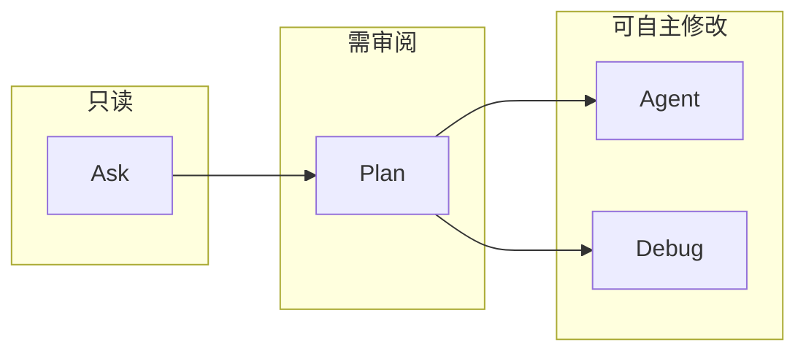

# Cursor 对话类型

Cursor 提供四种对话/代理模式：**Agent**、**Ask**、**Plan**、**Debug**。每种模式对应不同的权限、工具和能力，适用于不同的任务。本文说明各模式的区别、适用场景和切换方式。

## 四种模式对比

| 模式 | 权限 | 主要能力 | 工具范围 |
|------|------|----------|----------|
| **Agent** | 高（自主修改） | 自主探索、多文件编辑、执行命令、自动修错 | 全部工具 |
| **Ask** | 低（只读） | 搜索代码库、回答问题，不修改代码 | 仅搜索类工具 |
| **Plan** | 中（先计划后执行） | 先建计划、澄清问题，人工审阅后再执行 | 全部工具 |
| **Debug** | 高（含运行时） | 提出假设、插入日志、运行时分析、针对性修复 | 全部工具 + 调试服务器 |

---

## Agent

**适用场景**：复杂功能开发、跨文件重构、项目初始化、需要一次性改多处的任务。

Agent 会自主探索代码库、编辑多个文件、运行命令并修复错误，是默认的「全权限」模式。

### 能力要点

- 使用全部工具（读文件、搜索、编辑、终端等）
- 可开启 **Auto-run**：自动执行终端命令
- 可开启 **Auto-fix Errors**：自动根据错误信息尝试修复

### 何时用

- 需求明确、你希望 AI 直接改代码并跑通
- 跨文件统一改动（如统一错误处理、重命名、替换依赖）
- 搭建脚手架、加新模块等「多步骤但目标清晰」的任务

---

## Ask

**适用场景**：学习代码、理解项目、做方案前先摸底、不想被改任何文件时提问。

Ask 只做只读探索：搜索代码、读文件、给答案，**不会编辑代码或执行写操作**。

### 能力要点

- 仅使用搜索/读取类工具（如 codebase search、read file、grep）
- 不执行编辑、不运行终端命令
- 可开启 **Search Codebase**：自动查找相关文件

### 何时用

- 想先搞懂某段逻辑或项目结构再动手
- 需要方案建议、技术选型、实现思路，但暂不落地代码
- 不确定该不该改、改哪里时，先用 Ask 探路

---

## Plan

**适用场景**：需求不清晰、涉及多文件/多系统、想先审方案再执行的复杂功能。

Plan 会在写代码**之前**先分析代码库、提澄清问题，并生成一份可编辑的**实现计划**，你审阅（或修改）计划后再让 Agent 按计划执行。

### 工作流程

1. **分析与澄清**：Agent 分析代码库，并可能提出澄清问题
2. **生成计划**：创建一份实现计划（通常为 Markdown）
3. **审阅与编辑**：你在聊天或 Markdown 中审阅、修改计划
4. **执行**：确认后点击「构建该计划」，Agent 按计划执行

计划默认保存在主目录；可点击 **Save to workspace** 存到当前工作区，便于协作和文档化。

### 何时用

- 希望先审查整体架构和方案再动手
- 需求模糊、需要先探索再确定范围
- 涉及很多文件或多种可行方案，想先选一条清晰路径
- 简单小改或你已很熟的任务，可直接用 Agent，不必上 Plan

### 从计划重新开始

若执行结果和预期不符，不必在对话里一点点修补，可以：

1. 回滚已做改动  
2. 回到计划本身，把计划写得更具体、范围更清晰  
3. 再重新执行计划  

先想清楚「要做什么」，再交给 Agent「怎么做」，往往更省时、结果更干净。

---

## Debug

**适用场景**：难以复现的 Bug、回归问题、性能/内存问题、竞态或时序问题。

Debug 不会一上来就改代码，而是：提出假设 → 插入日志/埋点 → 让你复现 Bug → 通过运行在 Cursor 内的调试服务器收集日志 → 分析根因 → 再做**针对性修复**，最后清理埋点。

### 工作流程

1. **探索与假设**：Agent 查看相关文件，对潜在根因生成多个假设  
2. **添加埋点**：插入日志语句，将数据发到 Cursor 扩展内的本地调试服务器  
3. **复现 Bug**：你按步骤复现问题，确保捕获到真实运行时行为  
4. **分析日志**：Agent 根据收集到的日志识别真正根因  
5. **针对性修复**：基于证据做小范围、精准的修复  
6. **验证与清理**：你再次复现验证；确认后 Agent 移除埋点  

### 何时用

- **回归问题**：以前正常现在坏了，需要追踪「改了什么」  
- **性能/内存**：需要运行时 profiling 才能定位的问题  
- **竞态/时序**：依赖执行顺序或异步行为的问题  
- **能复现但原因不明**：现象清楚，但读代码看不出原因  

当普通 Agent 难以定位根因时，用 Debug 依赖**运行时证据**而不是猜测，更稳妥。

### 使用提示

- 说清**期望行为**和**实际行为**，便于 Agent 理解问题  
- 复现步骤尽量具体；必要时多次复现（尤其竞态类问题）  
- 严格按 Agent 给的步骤复现，以便日志对准真实场景  
- 提供错误信息、堆栈、环境等上下文，埋点和分析会更准  

---

## 切换方式

| 方式 | 说明 |
|------|------|
| **快捷键** | `Cmd+.`（Mac）或 `Ctrl+.`（Windows/Linux）快速切换模式 |
| **Plan 快捷** | 在输入框按 `Shift+Tab` 可切换到 Plan |
| **下拉菜单** | 在聊天输入框旁的模式选择器中选择 |
| **设置** | Settings 中可配置各模式快捷键和默认模型 |

---

## 使用建议

- **权限从低到高**：不确定时先用 **Ask** 探索 → 需要方案再 **Plan** → 方案确定后用 **Agent** 执行；需要运行时证据时用 **Debug**。  
- **简单任务**：小改、重命名、单文件修 bug，可直接 **Agent**。  
- **大改/多文件**：先 **Plan** 定范围和步骤，再执行，比在对话里反复纠偏更高效。  
- **怪 Bug/回归/性能**：优先考虑 **Debug**，再考虑直接让 Agent 改代码。  

---

## 参考

- [Cursor 官方：模式说明](https://cursor.com/cn/docs/agent/planning)  
- [Cursor 官方：Agent 工作原理](https://cursor.com/learn/agents.md)  
