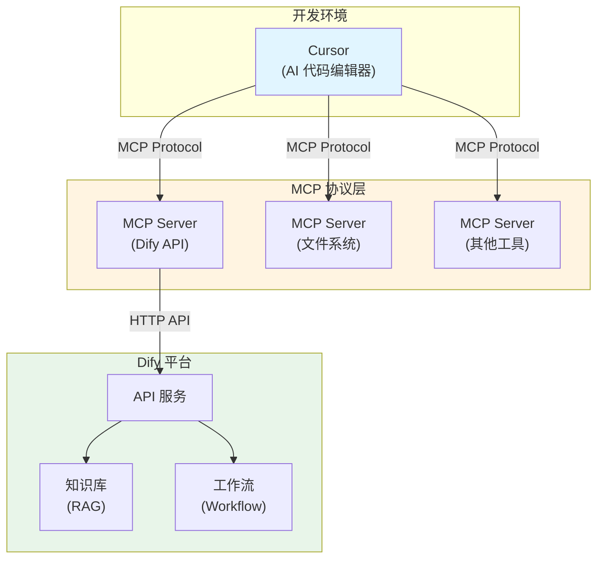
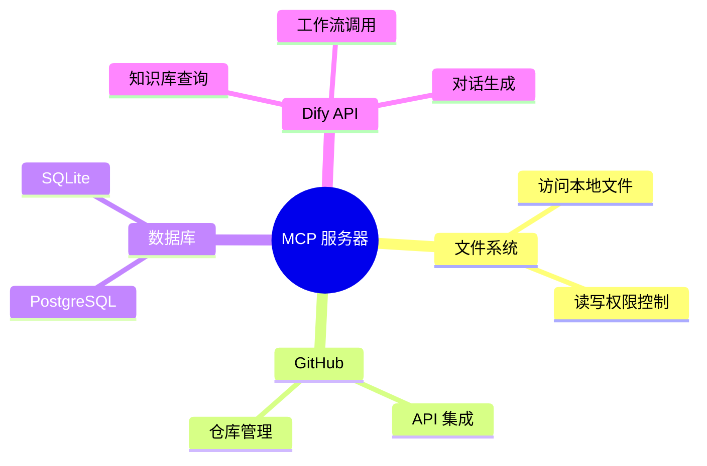
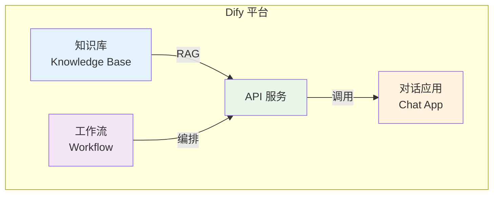
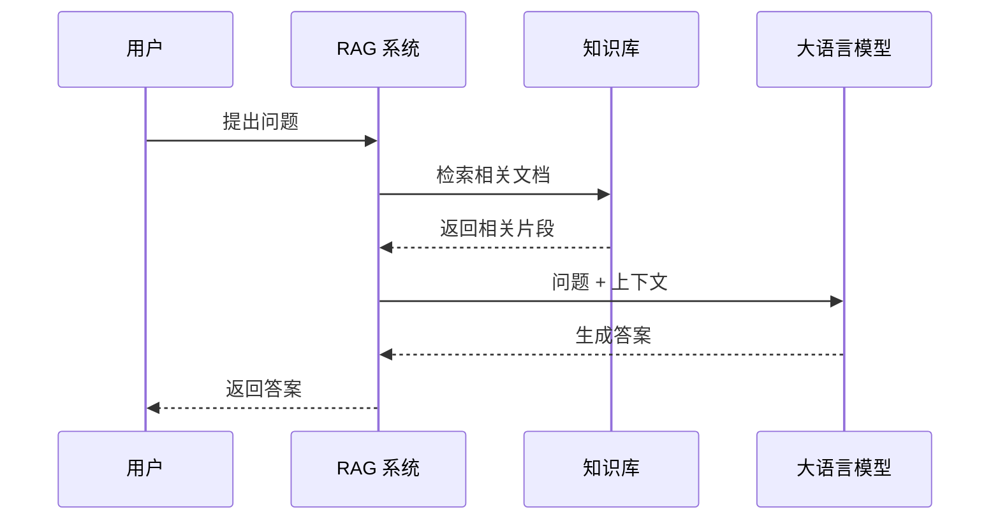
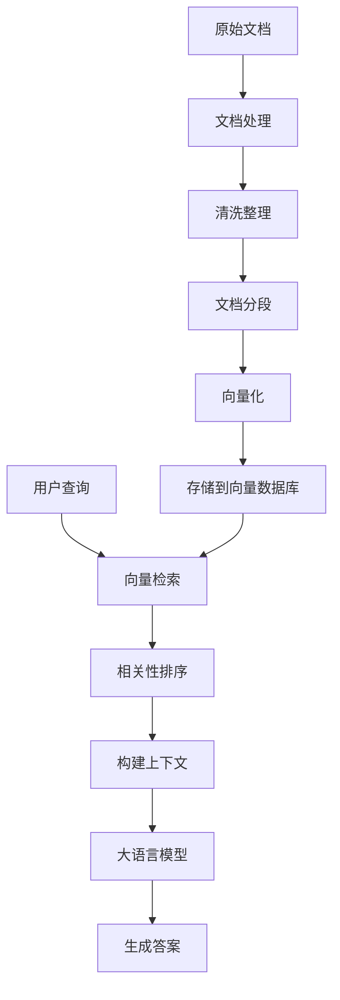
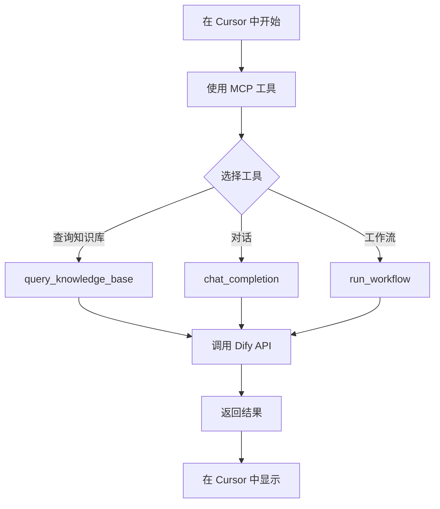
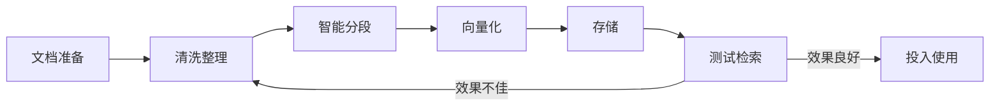

# MCP + Cursor + Dify 实践指南

本文将详细介绍如何将 MCP (Model Context Protocol)、Cursor 和 Dify 三者结合使用，构建一个强大的 AI 开发工作流。

## 整体架构



## 第一部分：Cursor 如何使用 MCP

### 什么是 MCP？

MCP (Model Context Protocol) 是 Anthropic 推出的开放协议，允许 AI 助手安全地访问外部工具和数据源。

### MCP 的核心优势

- **安全访问**：标准化的安全访问机制
- **扩展能力**：轻松集成各种外部服务
- **统一接口**：使用统一的协议规范

### 配置 MCP 服务器

#### 1. 配置文件位置

- **macOS**: `~/Library/Application Support/Cursor/User/globalStorage/rooveterinaryinc.roo-cline/settings/cline_mcp_settings.json`
- **Windows**: `%APPDATA%\Cursor\User\globalStorage\rooveterinaryinc.roo-cline\settings\cline_mcp_settings.json`
- **Linux**: `~/.config/Cursor/User/globalStorage/rooveterinaryinc.roo-cline/settings/cline_mcp_settings.json`

#### 2. 基础配置示例

```json
{
  "mcpServers": {
    "filesystem": {
      "command": "npx",
      "args": [
        "-y",
        "@modelcontextprotocol/server-filesystem",
        "/path/to/allowed/directory"
      ]
    }
  }
}
```

#### 3. 常用 MCP 服务器



## 第二部分：Dify 平台介绍

### 什么是 Dify？

Dify 是一个 LLM 应用开发平台，提供：
- **知识库管理**：基于 RAG 的知识检索
- **工作流编排**：可视化的工作流设计
- **API 服务**：RESTful API 接口
- **多模型支持**：支持多种大语言模型

### Dify 核心功能



### Dify 资源链接

- **官方文档**: [https://docs.dify.ai/zh-hans/introduction](https://docs.dify.ai/zh-hans/introduction)
- **GitHub**: [https://github.com/langgenius/dify/](https://github.com/langgenius/dify/)

## 第三部分：RAG 基础认知

### RAG 工作原理



### RAG 的关键要点

对于如何调用 Dify，需要对 RAG 有基本认知：

1. **知识整理**：RAG 不是简单投喂数据，需要对知识进行整理和清洗
2. **文档分段**：合理的文档分段策略直接影响检索效果
3. **检索机制**：RAG 只是帮你检索数据，最终由大模型处理
4. **上下文管理**：如何将检索到的内容有效传递给模型

### RAG 流程详解



## 第四部分：集成实践

### 创建 Dify MCP 服务器

#### 1. 项目初始化

```bash
mkdir dify-mcp-server
cd dify-mcp-server
npm init -y
npm install @modelcontextprotocol/sdk axios
```

#### 2. 创建服务器文件 (`dify-server.js`)

```javascript
#!/usr/bin/env node

import { Server } from '@modelcontextprotocol/sdk/server/index.js';
import { StdioServerTransport } from '@modelcontextprotocol/sdk/server/stdio.js';
import {
  CallToolRequestSchema,
  ListToolsRequestSchema,
} from '@modelcontextprotocol/sdk/types.js';
import axios from 'axios';

const DIFY_API_KEY = process.env.DIFY_API_KEY || '';
const DIFY_BASE_URL = process.env.DIFY_BASE_URL || 'https://api.dify.ai/v1';

const server = new Server(
  {
    name: 'dify-mcp-server',
    version: '0.1.0',
  },
  {
    capabilities: {
      tools: {},
    },
  }
);

// 列出可用工具
server.setRequestHandler(ListToolsRequestSchema, async () => ({
  tools: [
    {
      name: 'query_knowledge_base',
      description: '查询 Dify 知识库',
      inputSchema: {
        type: 'object',
        properties: {
          query: {
            type: 'string',
            description: '查询问题',
          },
          knowledge_base_id: {
            type: 'string',
            description: '知识库 ID',
          },
        },
        required: ['query', 'knowledge_base_id'],
      },
    },
    {
      name: 'chat_completion',
      description: '使用 Dify 进行对话',
      inputSchema: {
        type: 'object',
        properties: {
          message: {
            type: 'string',
            description: '用户消息',
          },
          conversation_id: {
            type: 'string',
            description: '对话 ID（可选）',
          },
        },
        required: ['message'],
      },
    },
    {
      name: 'run_workflow',
      description: '运行 Dify 工作流',
      inputSchema: {
        type: 'object',
        properties: {
          workflow_id: {
            type: 'string',
            description: '工作流 ID',
          },
          inputs: {
            type: 'object',
            description: '工作流输入参数',
          },
        },
        required: ['workflow_id'],
      },
    },
  ],
}));

// 处理工具调用
server.setRequestHandler(CallToolRequestSchema, async (request) => {
  const { name, arguments: args } = request.params;

  try {
    switch (name) {
      case 'query_knowledge_base': {
        const response = await axios.post(
          `${DIFY_BASE_URL}/datasets/${args.knowledge_base_id}/retrieve`,
          {
            query: args.query,
            top_k: 5,
          },
          {
            headers: {
              'Authorization': `Bearer ${DIFY_API_KEY}`,
              'Content-Type': 'application/json',
            },
          }
        );
        return {
          content: [
            {
              type: 'text',
              text: JSON.stringify(response.data, null, 2),
            },
          ],
        };
      }

      case 'chat_completion': {
        const response = await axios.post(
          `${DIFY_BASE_URL}/chat-messages`,
          {
            inputs: {},
            query: args.message,
            response_mode: 'blocking',
            conversation_id: args.conversation_id || '',
          },
          {
            headers: {
              'Authorization': `Bearer ${DIFY_API_KEY}`,
              'Content-Type': 'application/json',
            },
          }
        );
        return {
          content: [
            {
              type: 'text',
              text: response.data.answer || JSON.stringify(response.data, null, 2),
            },
          ],
        };
      }

      case 'run_workflow': {
        const response = await axios.post(
          `${DIFY_BASE_URL}/workflows/run`,
          {
            inputs: args.inputs || {},
          },
          {
            headers: {
              'Authorization': `Bearer ${DIFY_API_KEY}`,
              'Content-Type': 'application/json',
            },
            params: {
              user: 'mcp-user',
            },
          }
        );
        return {
          content: [
            {
              type: 'text',
              text: JSON.stringify(response.data, null, 2),
            },
          ],
        };
      }

      default:
        throw new Error(`未知工具: ${name}`);
    }
  } catch (error) {
    return {
      content: [
        {
          type: 'text',
          text: `错误: ${error.message}`,
        },
      ],
      isError: true,
    };
  }
});

// 启动服务器
async function main() {
  const transport = new StdioServerTransport();
  await server.connect(transport);
  console.error('Dify MCP 服务器已启动');
}

main().catch(console.error);
```

#### 3. 配置到 Cursor

在 Cursor 的 MCP 配置文件中添加：

```json
{
  "mcpServers": {
    "dify": {
      "command": "node",
      "args": [
        "/path/to/dify-mcp-server/dify-server.js"
      ],
      "env": {
        "DIFY_API_KEY": "your_dify_api_key",
        "DIFY_BASE_URL": "https://api.dify.ai/v1"
      }
    }
  }
}
```

### 使用流程



## 第五部分：最佳实践

### 1. 知识库管理



**关键要点**：
- 文档质量直接影响检索效果
- 分段策略需要根据文档类型调整
- 定期更新和维护知识库

### 2. 工作流设计

- **明确输入输出**：定义清晰的工作流接口
- **错误处理**：添加适当的错误处理机制
- **性能优化**：避免不必要的 API 调用

### 3. 安全考虑

- **API 密钥管理**：使用环境变量，不要硬编码
- **访问控制**：限制 MCP 服务器的访问范围
- **日志记录**：记录关键操作便于排查问题

## 第六部分：常见问题

### 1. MCP 服务器连接失败

**解决方案**：
- 检查配置文件路径是否正确
- 确认 Node.js 和依赖已正确安装
- 查看 Cursor 日志文件

### 2. Dify API 调用失败

**解决方案**：
- 验证 API 密钥是否正确
- 检查网络连接
- 确认 Dify 服务是否正常运行

### 3. RAG 检索效果不佳

**解决方案**：
- 优化文档分段策略
- 调整检索参数（top_k 等）
- 改进文档质量和结构

## 总结

通过结合 MCP、Cursor 和 Dify，我们可以：

- ✅ **扩展 Cursor 能力**：通过 MCP 访问 Dify 的知识库和工作流
- ✅ **提升开发效率**：在代码编辑器中直接查询知识库
- ✅ **构建智能应用**：利用 Dify 的 RAG 能力增强 AI 助手
- ✅ **统一工作流**：在一个环境中完成开发、查询、对话等操作

这个组合为 AI 辅助开发提供了强大的工具链，让开发者能够更高效地利用 AI 能力。
