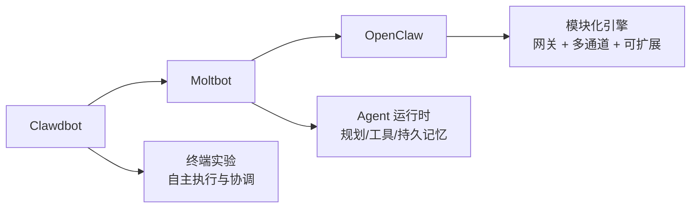
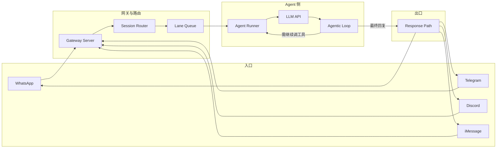

# 概述

**OpenClaw** 是一个开源的 **AI Agent 网关与运行时**，让你在**自己的机器或服务器**上运行一个统一的网关进程，把 WhatsApp、Telegram、Discord、iMessage 等聊天应用接到可执行任务的 AI 助手（如 Pi 等编码/对话 Agent）上。数据与逻辑都在你控制的硬件上，不依赖厂商云托管。

它**不是**“又一个聊天界面”，而是：

- **多通道网关**：一个 Gateway 同时服务多个聊天平台；
- **Agent 原生**：为“会规划、会调工具、有会话与记忆”的 Agent 设计，而不是简单的一问一答；
- **自托管**：开源（MIT）、本地或自有服务器部署，数据与配置由你掌控。

适合**开发者、自动化重度用户**，以及希望基于 Agent 能力做二次产品的人。

# 起源与演进

OpenClaw 的前身是一系列“能让 AI 真正干活”的试验：



- **Clawdbot**：早期实验，探索 AI 能否持续运行、观察环境、触发动作、协调工具，而不只是单次问答。
- **Moltbot**：引入“Agent 运行时”概念——可规划任务、选择工具、分步执行、在多次运行间保持记忆；支持 24/7 运行、Slack/Telegram/Discord、cron 等，但偏极客向。
- **OpenClaw**：在 Moltbot 基础上把 Agent 核心做成**可复用、可扩展的引擎**，并加上**多通道网关**，成为“一个进程对接多端、多 Agent”的统一入口。

因此，OpenClaw 既是**连接聊天应用与 Agent 的网关**，也代表一套**以规划、工具、长时任务为核心的 Agent 运行时**设计。

# 核心定位：三件事

从能力上看，OpenClaw 主要做三件事：

### 1. Agent 运行时

运行的是**会规划、会执行**的 AI Agent：对目标进行推理、拆成步骤、动态选择工具并执行，而不是简单的提示链。这是一套**执行循环**，而不是单次调用。

### 2. 工具抽象层

行为不写死在代码里，而是通过**工具**扩展：API、系统集成、定时任务、浏览器操作、自定义脚本等。每个工具显式、可审查、可授权，在灵活和可控之间取得平衡。

### 3. 长时运行的工作流引擎

面向“长期在线”的场景：按计划唤醒、响应事件、保持状态，在数小时、数天甚至数周内持续工作，因此常被部署在服务器或常开机器上。

# 整体架构与消息流

OpenClaw 采用**多阶段管道**：消息从某个聊天渠道进入，经网关、会话路由、Agent 运行器、Agentic Loop，再经响应路径回到对应渠道。



- **Gateway Server**：统一入口，负责会话、路由和通道连接，是“唯一事实来源”。
- **Session Router + Lane Queue**：把消息归到对应会话，并控制并发，避免多会话互相抢占或丢上下文。
- **Agent Runner**：在请求到达 LLM 前做准备——解析用哪个模型、组装系统提示（工具/技能/记忆）、加载会话历史；还有 **Context Window Guard** 负责在接近 token 上限时压缩上下文。
- **Agentic Loop**：收到 LLM 输出后，先判断是否包含**工具调用**；若有则执行工具、把结果再喂回 LLM，循环直到得到最终文本；若无则把回复交给 Response Path。正是这个循环让 OpenClaw 能**自动串联多步操作**，而不是每步都要用户再发一条消息。
- **Response Path**：把最终文本按流式拆成块，经 **Channel Adapter** 转成各平台格式，送回对应渠道。

# 关键能力

| 能力 | 说明 |
|------|------|
| **多通道网关** | 一个 Gateway 同时服务 WhatsApp、Telegram、Discord、iMessage 等 |
| **插件通道** | 通过扩展支持 Mattermost 等更多渠道 |
| **多 Agent 路由** | 按 Agent、工作区或发送者做会话隔离与路由 |
| **媒体支持** | 收发图片、音频、文档等 |
| **Web Control UI** | 浏览器控制台：聊天、配置、会话、节点管理 |
| **移动节点** | 配对 iOS/Android 节点，支持 Canvas、相机/屏幕、语音等流程 |

# 快速开始

**环境**：Node 22+，以及所选模型/提供方的 API Key。

```bash
# 安装
npm install -g openclaw@latest

# 引导配置并安装守护进程
openclaw onboard --install-daemon

# 登录通道（如 WhatsApp）并启动网关
openclaw channels login
openclaw gateway --port 18789
```

启动后可在浏览器打开 Control UI，默认：`http://127.0.0.1:18789/`。远程访问可配合 [Web surfaces](https://docs.openclaw.ai/web) 或 [Tailscale](https://docs.openclaw.ai/gateway/tailscale)。

**配置**（可选）位于 `~/.openclaw/openclaw.json`，可配置允许的联系人、群组 @ 规则等；不配置时通常使用内置的 Pi 二进制（RPC 模式）及按发送者隔离的会话。

# OpenClaw 命令行指令汇总

## 安装与快速启动

| 指令 | 说明 |
|------|------|
| `npm install -g openclaw@latest` | 全局安装最新版 OpenClaw |
| `openclaw onboard --install-daemon` | 引导式配置并安装守护进程 |
| `openclaw channels login` | 登录通道（如 WhatsApp、Telegram 等） |
| `openclaw gateway --port 18789` | 启动网关服务，指定端口（默认示例为 18789） |

**典型使用顺序**：安装 → 引导配置并安装守护进程 → 登录通道 → 启动网关。启动后 Control UI 默认地址：`http://127.0.0.1:18789/`。

---

## 核心指令

| 指令 | 说明 |
|------|------|
| `openclaw onboard` | 交互式引导配置（可配合 `--install-daemon` 安装守护进程） |
| `openclaw gateway` | 管理网关进程：启动、停止、重启、状态；可指定 `--port`、`--host` |
| `openclaw chat` | 向 Agent 发送消息，可指定格式、模型、上下文等 |
| `openclaw status` | 查看网关与系统状态 |
| `openclaw logs` | 查看网关日志，支持过滤与实时流式输出 |

### 使用说明

- **onboard**  
  - 直接运行 `openclaw onboard` 会进入交互式向导；加上 `--install-daemon` 可同时安装为系统守护进程，便于开机自启或后台常驻。
- **gateway**  
  - 语法：`openclaw gateway [start|stop|restart|status] [选项]`  
  - 常用选项：`--port <端口>`（默认 18789）、`--host <地址>`（默认 127.0.0.1）、`--daemon`（后台运行）。  
  - 示例：`openclaw gateway start --port 18789`、`openclaw gateway status`。
- **chat**  
  - 在终端里直接和 Agent 对话，可指定输出格式、模型、上下文长度等，适合调试或脚本调用。
- **status**  
  - 查看网关是否在跑、端口、基本健康状态，排错时先跑一次。
- **logs**  
  - 查看网关日志，支持按时间/级别过滤和实时滚动（类似 `tail -f`），便于排查连接、通道或 Agent 问题。

---

## Skills（技能）指令

| 指令 | 说明 |
|------|------|
| `openclaw skill list` | 列出已安装的技能 |
| `openclaw skill install <name\|path>` | 安装指定技能（名称或本地路径） |
| `openclaw skill remove <name>` | 卸载指定技能 |
| `openclaw skill test <name\|path>` | 测试技能（可不安装直接测） |
| `openclaw skill config <name>` | 查看或设置技能配置 |

### 使用说明

- **安装来源**：可从本地路径安装（如 `openclaw skill install ./my-skill`），或通过 ClawHub/市场安装（见下文 clawhub）。
- **技能目录**：默认安装到当前工作目录下的 `./skills`；若配置了 OpenClaw 工作区，则安装到该工作区的 `skills` 目录。可用环境变量 `CLAWHUB_WORKDIR` 或 `--workdir` 覆盖。
- **技能结构**：一个技能通常是一个目录，内含必需的 `SKILL.md`（描述与元数据），以及可选配置与脚本。
- **安装后验证**：安装后建议执行一次 `openclaw skill test <name>` 或在实际任务里做一次小范围试跑，确认权限与能力符合预期；可用 `openclaw skill list` 查看已安装列表。
- **config**：`openclaw skill config <skill-name>` 可查看或交互式设置该技能所需配置项（如 API Key、目标路径等）。

---

## 手动实现一个 Skill 并接入 OpenClaw

Skill 是扩展 Agent 能力的主要方式：一个 **目录** 里放一份 **SKILL.md**（给 LLM 的说明与元数据），再加可选的脚本或配置，即可被 OpenClaw 发现并注入到 Agent 的上下文中。

### 1. 技能是什么

- **必需**：目录内有一个 **SKILL.md**（或 skill.md），用 **YAML frontmatter + Markdown 正文** 描述技能做什么、何时用、用哪些工具。
- **可选**：`scripts/` 下的脚本、配置文件、依赖说明等；若技能需要执行代码，可在正文里指导 Agent 调用系统工具（如 `bash`）或声明自定义工具。

Agent 运行时会把已加载技能的 SKILL.md 内容纳入提示上下文，因此技能是**可读、可审、可版本管理**的“能力菜单”。

### 2. 创建技能目录

两种常见方式：

**方式 A：在工作区里直接建目录（推荐本地开发）**

```bash
# 默认工作区技能目录
mkdir -p ~/.openclaw/workspace/skills/my-skill
```

**方式 B：在任意路径建目录，用 CLI 安装**

```bash
mkdir -p /path/to/my-skill
# 之后用 openclaw skill install 安装到当前工作区（见下文）
```

### 3. 编写 SKILL.md

**最小示例**（仅必填元数据 + 简短说明）：

```markdown
---
name: my_skill
description: 一句话说明这个技能做什么。
---

# My Skill

当用户需要 XXX 时，使用 YYY 工具/步骤完成。具体做法：…
```

**常用 frontmatter 字段**：

| 字段 | 说明 |
|------|------|
| `name` | 技能标识，安装后以该名出现在 `skill list` 等 |
| `description` | 简短描述，便于 Agent 和用户理解用途 |
| `version` | 可选，版本号 |
| `author` | 可选，作者 |
| `metadata.openclaw.requires` | 可选，声明依赖（二进制、环境变量、配置等） |
| `metadata.openclaw.primaryEnv` | 可选，主要环境变量名（如 API Key） |
| `metadata.openclaw.install` | 可选，安装/依赖安装说明 |
| `permissions` | 可选，声明所需权限（如 `filesystem:read`、`network:outbound`） |
| `triggers` | 可选，触发方式（如关键词、cron 计划、webhook 路径） |

正文部分用 **Markdown** 写：在什么场景下用这个技能、建议用哪些工具、步骤与注意事项等，相当于给 LLM 的“使用手册”。若需用系统已有工具（如 `bash`、`browser`），在正文里说明即可；也可在 frontmatter 或正文中定义/引用自定义工具。

**稍完整示例**：

```markdown
---
name: daily_brief
description: 生成今日待办与天气摘要。
version: 1.0.0
metadata:
  openclaw:
    primaryEnv: OPENWEATHER_API_KEY
    requires: network
---

# Daily Brief Skill

当用户说「今日摘要」「今天有什么」时：

1. 调用天气 API（若已配置 OPENWEATHER_API_KEY）获取当地天气。
2. 结合用户历史待办或日历（若有权访问）生成简短摘要。
3. 用自然语言回复，控制在 3 句以内。
```

### 4. 安装并让 OpenClaw 加载

**从本地路径安装到当前工作区**：

```bash
openclaw skill install ./my-skill
# 或绝对路径
openclaw skill install /path/to/my-skill
```

安装后技能会出现在工作区的 `skills` 目录（受 `CLAWHUB_WORKDIR` 或 `--workdir` 影响），并纳入下次加载。

**不安装、仅从额外目录加载**：在 `~/.openclaw/openclaw.json` 的 `skills.load.extraDirs` 里加上你的技能目录，例如：

```json
{
  "skills": {
    "load": {
      "extraDirs": ["/path/to/my-skill-parent-dir"],
      "watch": true
    }
  }
}
```

**使新技能生效**：若开启了 `load.watch`，保存 SKILL.md 后下一轮 Agent 请求会自动发现；否则可重启网关或让 Agent “刷新 skills”。

### 5. 验证与配置

- **列出已安装技能**：`openclaw skill list`
- **测试（可不安装直接测）**：`openclaw skill test ./my-skill` 或 `openclaw skill test my_skill`
- **配置项/环境变量**：`openclaw skill config my_skill` 查看或交互设置（如 API Key）
- **和 Agent 对话验证**：`openclaw agent --message "用一下我的 XXX 技能"` 或通过 Control UI 发消息

若技能声明了 `metadata.openclaw.primaryEnv` 或配置项，可在 `openclaw.json` 的 `skills.entries["my_skill"]` 下配置 `apiKey`、`env`、`enabled` 等（参见 [Skills Config](https://docs.openclaw.ai/tools/skills-config)）。

### 6. 小结

| 步骤 | 操作 |
|------|------|
| 1 | 建目录，如 `~/.openclaw/workspace/skills/my-skill` 或任意路径 |
| 2 | 在目录内新建 `SKILL.md`，写 YAML frontmatter（至少 `name`、`description`）+ Markdown 使用说明 |
| 3 | 用 `openclaw skill install <path>` 安装，或在 `skills.load.extraDirs` 中配置目录 |
| 4 | 依赖 watch 或重启网关使新技能被加载 |
| 5 | 用 `openclaw skill list` / `openclaw skill test` / 与 Agent 对话验证 |

更多格式与发布方式可参考官方文档 [Creating Skills](https://docs.openclaw.ai/tools/creating-skills) 与 [ClawHub](https://clawhub.ai)。

---

## Channels（通道）指令

| 指令 | 说明 |
|------|------|
| `openclaw channels login` | 链接通道设备（如 WhatsApp 扫码登录） |
| `openclaw channels list` | 列出已配置的通道 |
| `openclaw channel add` | 添加通道 |
| `openclaw channel remove` | 移除通道 |
| `openclaw channel status` | 查看通道状态 |
| `openclaw channel reconnect` | 重连通道 |

### 使用说明

- **登录通道（如 WhatsApp）**  
  - 基本：`openclaw channels login --channel whatsapp`  
  - 多账号时指定账号：`openclaw channels login --channel whatsapp --account work`  
  - 执行后会生成二维码，用手机 WhatsApp（类似“链接设备”）扫码即可完成配对，无需 Meta Business 账号，适合个人或测试。
- **配置策略**：通道的允许联系人、群组规则等可在配置文件 `~/.openclaw/openclaw.json` 的 `channels` 下设置（如 `dmPolicy`、`allowFrom`、`groupPolicy`、`groupAllowFrom` 等）。
- **配对审批（若启用 pairing 模式）**  
  - 查看待审批：`openclaw pairing list whatsapp`  
  - 批准：`openclaw pairing approve whatsapp <CODE>`  
  - 配对请求通常 1 小时内有效，单通道待处理数一般有上限（如 3 个）。
- **建议**：生产或长期使用建议用专用号码，避免与个人号混用导致路由混乱。

---

## 其他常用指令

| 指令 | 说明 |
|------|------|
| `openclaw agent` | 向 Agent 发消息，可指定思考级别等 |
| `openclaw message send` | 通过通道发送消息 |
| `openclaw config` | 查看或修改配置 |
| `openclaw clawhub` | 与技能市场交互：搜索、安装、发布、浏览 |
| `openclaw security` | 安全审计与技能扫描 |

### 使用说明

- **agent**  
  - 与 `chat` 类似，面向“Agent”的入口，可指定思考深度、模型等，适合需要多步推理或工具调用的对话。
- **message send**  
  - 从命令行通过已配置的通道发消息，可配合脚本做通知或自动化。
- **config**  
  - 查看或修改当前使用的配置；配置文件默认路径为 `~/.openclaw/openclaw.json`。修改后一般需重启网关或重新加载才生效。
- **clawhub**  
  - 子命令示例：`openclaw clawhub search "关键词"` 搜索技能、`openclaw clawhub install <skill-name>` 从市场安装、`openclaw clawhub publish` / `browse` 发布或浏览。也可在浏览器打开 [clawhub.ai](https://clawhub.ai) 搜索后按页面说明用 CLI 安装。
- **security**  
  - 对已安装技能做安全扫描与审计，建议在安装第三方技能后定期执行。

---

## 排错与健康检查

排查时可按顺序使用：

1. `openclaw status` — 看网关与整体状态  
2. `openclaw health` — 健康检查  
3. `openclaw doctor` — 诊断常见环境与配置问题  

再根据报错类型检查 `openclaw gateway`、`openclaw node` / `openclaw nodes` 等。

---

## 全局常用参数

| 参数 | 说明 |
|------|------|
| `--version` | 打印版本号 |
| `--help` | 显示帮助（可接在任意子命令后，如 `openclaw gateway --help`） |
| `--config <文件>` | 使用指定配置文件 |
| `--verbose` | 详细输出 |
| `--quiet` | 减少非必要输出 |
| `--json` | 以 JSON 格式输出，便于脚本解析 |
| `--profile <名称>` | 使用隔离环境，状态目录为 `~/.openclaw-<名称>` |
| `--dev` | 开发模式，状态目录为 `~/.openclaw-dev`，默认端口会偏移 |
| `--no-color` | 关闭彩色输出 |

具体子命令的选项以 `openclaw <command> --help` 为准。

# 适用人群

- **开发者 / 工程师**：需要完全掌控 Agent、自托管、可扩展与执行过程透明。
- **自动化重度用户**：需要长期在线的 AI 助手、定时/事件驱动的工作流和真实任务执行，而不只是对话。
- **产品与平台构建者**：希望基于“Agent 引擎”做上层应用（如自己的 UI、看板或服务），而不从零实现 Agent 核心。

# 机器人等扩展方向

OpenClaw 本身是“任意 OS 上的 Agent 网关与运行时”，并非专为机器人设计；但社区已有人将其与**具身 AI / 机器人**结合：

- 通过自然语言发指令（如“把红色方块放进盒子”），由具身模型（如 Gemini Robotics-ER、Qwen VLM 等）理解并转为机器人动作。
- **ClawBody** 等桥接层把 OpenClaw 与实体硬件、MuJoCo 仿真连接，支持先在仿真里训练再部署到真机，形成“零代码/低代码机器人”的探索方向。

这类应用体现的是：OpenClaw 作为**可扩展的 Agent 运行时**，可以在网关与编码 Agent 之外，被接到更多“执行层”（包括机器人）上。

# 小结

- **OpenClaw** = 自托管 **多通道网关** + **Agent 运行时**（规划、工具、长时任务、会话与记忆）。
- 消息流：**聊天渠道 → Gateway → Session Router → Lane Queue → Agent Runner → LLM → Agentic Loop（可选多轮工具调用）→ Response Path → 渠道**。
- **Agentic Loop** 是它与“普通聊天机器人”的关键区别：能自动串联多步工具调用，直到任务结束再回复用户。
- 适合自托管、多通道、多 Agent 场景；机器人等是社区在引擎之上的扩展方向。

如需最新安装步骤与配置项，建议以官方文档为准：[docs.openclaw.ai](https://docs.openclaw.ai)。
