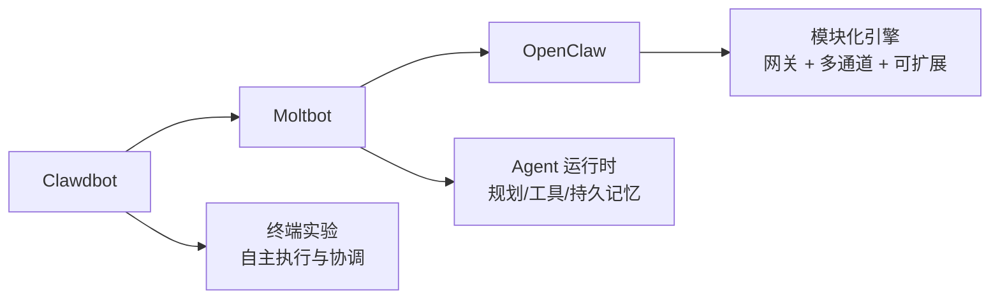
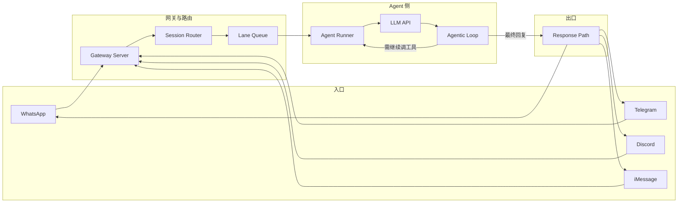

# 概述

**OpenClaw** 是一个开源的 **AI Agent 网关与运行时**，让你在**自己的机器或服务器**上运行一个统一的网关进程，把 WhatsApp、Telegram、Discord、iMessage 等聊天应用接到可执行任务的 AI 助手（如 Pi 等编码/对话 Agent）上。数据与逻辑都在你控制的硬件上，不依赖厂商云托管。

它**不是**“又一个聊天界面”，而是：

- **多通道网关**：一个 Gateway 同时服务多个聊天平台；
- **Agent 原生**：为“会规划、会调工具、有会话与记忆”的 Agent 设计，而不是简单的一问一答；
- **自托管**：开源（MIT）、本地或自有服务器部署，数据与配置由你掌控。

适合**开发者、自动化重度用户**，以及希望基于 Agent 能力做二次产品的人。

# 起源与演进

OpenClaw 的前身是一系列“能让 AI 真正干活”的试验：



- **Clawdbot**：早期实验，探索 AI 能否持续运行、观察环境、触发动作、协调工具，而不只是单次问答。
- **Moltbot**：引入“Agent 运行时”概念——可规划任务、选择工具、分步执行、在多次运行间保持记忆；支持 24/7 运行、Slack/Telegram/Discord、cron 等，但偏极客向。
- **OpenClaw**：在 Moltbot 基础上把 Agent 核心做成**可复用、可扩展的引擎**，并加上**多通道网关**，成为“一个进程对接多端、多 Agent”的统一入口。

因此，OpenClaw 既是**连接聊天应用与 Agent 的网关**，也代表一套**以规划、工具、长时任务为核心的 Agent 运行时**设计。

# 核心定位：三件事

从能力上看，OpenClaw 主要做三件事：

### 1. Agent 运行时

运行的是**会规划、会执行**的 AI Agent：对目标进行推理、拆成步骤、动态选择工具并执行，而不是简单的提示链。这是一套**执行循环**，而不是单次调用。

### 2. 工具抽象层

行为不写死在代码里，而是通过**工具**扩展：API、系统集成、定时任务、浏览器操作、自定义脚本等。每个工具显式、可审查、可授权，在灵活和可控之间取得平衡。

### 3. 长时运行的工作流引擎

面向“长期在线”的场景：按计划唤醒、响应事件、保持状态，在数小时、数天甚至数周内持续工作，因此常被部署在服务器或常开机器上。

# 整体架构与消息流

OpenClaw 采用**多阶段管道**：消息从某个聊天渠道进入，经网关、会话路由、Agent 运行器、Agentic Loop，再经响应路径回到对应渠道。



- **Gateway Server**：统一入口，负责会话、路由和通道连接，是“唯一事实来源”。
- **Session Router + Lane Queue**：把消息归到对应会话，并控制并发，避免多会话互相抢占或丢上下文。
- **Agent Runner**：在请求到达 LLM 前做准备——解析用哪个模型、组装系统提示（工具/技能/记忆）、加载会话历史；还有 **Context Window Guard** 负责在接近 token 上限时压缩上下文。
- **Agentic Loop**：收到 LLM 输出后，先判断是否包含**工具调用**；若有则执行工具、把结果再喂回 LLM，循环直到得到最终文本；若无则把回复交给 Response Path。正是这个循环让 OpenClaw 能**自动串联多步操作**，而不是每步都要用户再发一条消息。
- **Response Path**：把最终文本按流式拆成块，经 **Channel Adapter** 转成各平台格式，送回对应渠道。

# 关键能力

| 能力 | 说明 |
|------|------|
| **多通道网关** | 一个 Gateway 同时服务 WhatsApp、Telegram、Discord、iMessage 等 |
| **插件通道** | 通过扩展支持 Mattermost 等更多渠道 |
| **多 Agent 路由** | 按 Agent、工作区或发送者做会话隔离与路由 |
| **媒体支持** | 收发图片、音频、文档等 |
| **Web Control UI** | 浏览器控制台：聊天、配置、会话、节点管理 |
| **移动节点** | 配对 iOS/Android 节点，支持 Canvas、相机/屏幕、语音等流程 |

# 快速开始

**环境**：Node 22+，以及所选模型/提供方的 API Key。

```bash
# 安装
npm install -g openclaw@latest

# 引导配置并安装守护进程
openclaw onboard --install-daemon

# 登录通道（如 WhatsApp）并启动网关
openclaw channels login
openclaw gateway --port 18789
```

启动后可在浏览器打开 Control UI，默认：`http://127.0.0.1:18789/`。远程访问可配合 [Web surfaces](https://docs.openclaw.ai/web) 或 [Tailscale](https://docs.openclaw.ai/gateway/tailscale)。

**配置**（可选）位于 `~/.openclaw/openclaw.json`，可配置允许的联系人、群组 @ 规则等；不配置时通常使用内置的 Pi 二进制（RPC 模式）及按发送者隔离的会话。

# 适用人群

- **开发者 / 工程师**：需要完全掌控 Agent、自托管、可扩展与执行过程透明。
- **自动化重度用户**：需要长期在线的 AI 助手、定时/事件驱动的工作流和真实任务执行，而不只是对话。
- **产品与平台构建者**：希望基于“Agent 引擎”做上层应用（如自己的 UI、看板或服务），而不从零实现 Agent 核心。

# 机器人等扩展方向

OpenClaw 本身是“任意 OS 上的 Agent 网关与运行时”，并非专为机器人设计；但社区已有人将其与**具身 AI / 机器人**结合：

- 通过自然语言发指令（如“把红色方块放进盒子”），由具身模型（如 Gemini Robotics-ER、Qwen VLM 等）理解并转为机器人动作。
- **ClawBody** 等桥接层把 OpenClaw 与实体硬件、MuJoCo 仿真连接，支持先在仿真里训练再部署到真机，形成“零代码/低代码机器人”的探索方向。

这类应用体现的是：OpenClaw 作为**可扩展的 Agent 运行时**，可以在网关与编码 Agent 之外，被接到更多“执行层”（包括机器人）上。

# 小结

- **OpenClaw** = 自托管 **多通道网关** + **Agent 运行时**（规划、工具、长时任务、会话与记忆）。
- 消息流：**聊天渠道 → Gateway → Session Router → Lane Queue → Agent Runner → LLM → Agentic Loop（可选多轮工具调用）→ Response Path → 渠道**。
- **Agentic Loop** 是它与“普通聊天机器人”的关键区别：能自动串联多步工具调用，直到任务结束再回复用户。
- 适合自托管、多通道、多 Agent 场景；机器人等是社区在引擎之上的扩展方向。

如需最新安装步骤与配置项，建议以官方文档为准：[docs.openclaw.ai](https://docs.openclaw.ai)。
