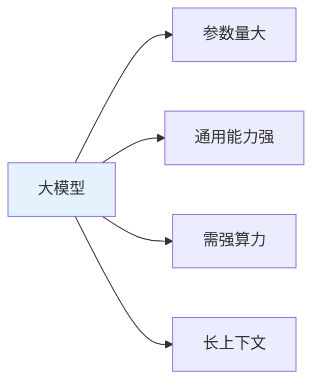
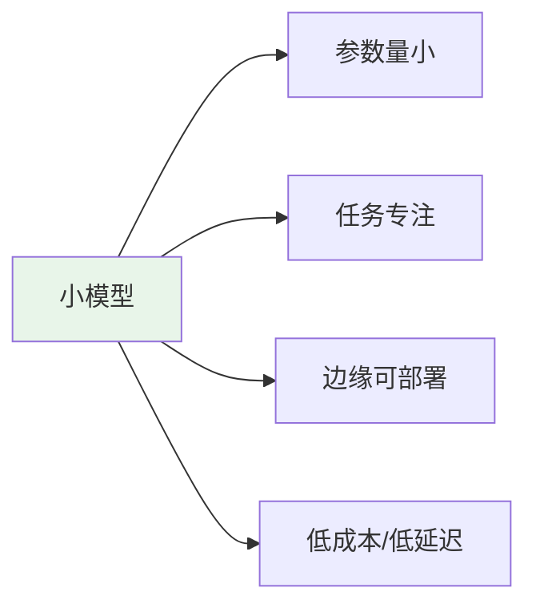
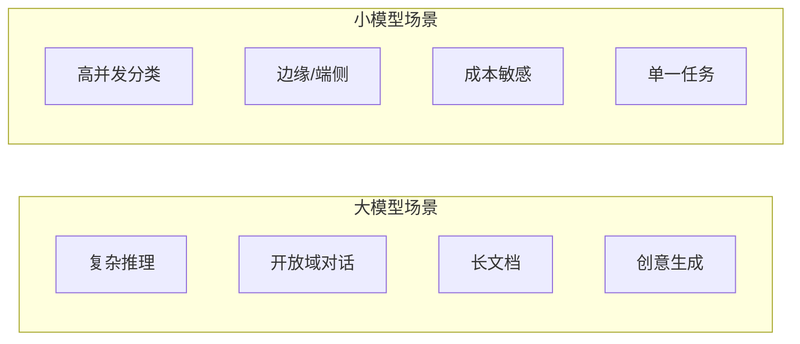

# 概述

在 AI 应用中，常按**参数规模与部署方式**把模型分为**大模型**和**小模型**。二者并非绝对界限，而是“大而通用”与“小而专用”的权衡：大模型能力全面、适合复杂任务；小模型轻量、适合高并发与边缘场景。本文介绍二者的定义、特点及典型使用场景。

# 什么是大模型

**大模型（Large Model）** 一般指参数量在**数亿到数千亿**级别的深度学习模型。在 NLP 领域常特指 **大语言模型（LLM，Large Language Model）**，如 GPT、Claude、Llama、Qwen、文心等。

## 主要特点

- **参数规模大**：通常从数亿（如 7B）到数百亿、数千亿（如 70B、千亿级），需要大量显存与算力训练和推理。
- **通用能力强**：在海量文本上预训练，具备语言理解、生成、推理、知识调用、多轮对话等综合能力，可零样本/少样本完成多种任务。
- **依赖云端或强算力**：推理往往需要 GPU 集群或云 API，延迟与成本相对较高。
- **长上下文**：多数支持较长上下文（数千到数十万 token），适合长文档、多轮对话、复杂指令。

# 什么是小模型

**小模型（Small Model）** 指参数量相对较小（常见为**几百万到几十亿**）、面向**特定任务或场景**优化过的模型。可以是“从零训练”的小网络，也可以是大模型**蒸馏、剪枝、量化**后得到的轻量版本。

## 主要特点

- **参数规模小**：从数百万到数十亿（如 0.5B、1B、3B、7B 等），显存与算力需求低。
- **任务聚焦**：多为分类、抽取、简单问答、关键词识别等单一或少量任务，或在特定领域微调。
- **易部署**：可在**边缘设备、手机、嵌入式**或单机 GPU 上运行，支持离线、低延迟。
- **成本与隐私**：推理成本低、数据可不出端，适合高并发、成本敏感、隐私要求高的场景。

# 大模型 vs 小模型对比

| 维度       | 大模型                     | 小模型                         |
|------------|----------------------------|--------------------------------|
| **参数量** | 数亿～数千亿               | 数百万～数十亿                 |
| **能力**   | 通用、多任务、强推理与生成  | 专用、单任务或少量任务         |
| **部署**   | 多为云端 / 大 GPU          | 边缘、端侧、单机均可           |
| **延迟**   | 相对较高                   | 可做到很低（毫秒级）           |
| **成本**   | 单次推理成本高             | 单次推理成本低                 |
| **上下文** | 通常支持长上下文           | 多数较短                       |
| **典型形态** | GPT、Claude、Llama、千问等 | 蒸馏模型、专用分类/抽取模型、TinyLlama 等 |

# 大模型的典型使用场景

- **复杂推理与规划**：多步推理、数学、代码生成、决策分析、Agent 规划等，需要“想得多、想得深”。
- **开放域对话与助手**：客服、陪练、教育助手、多轮问答，需要理解意图、兼顾上下文与知识。
- **长文档理解与生成**：阅读长报告、合同、论文后总结/问答；长文写作、润色、翻译。
- **知识密集型任务**：问答、检索增强（RAG）的“大脑”、综合多源信息给出答案。
- **创意与多样性**：文案、故事、头脑风暴、多方案生成，需要强语言与创意能力。
- **低代码/零样本能力**：通过提示完成多种任务，减少为每个任务单独训练小模型的成本。

# 小模型的典型使用场景

- **高并发、低延迟接口**：情感分析、意图分类、关键词/实体抽取、简单分类，要求毫秒级响应与高 QPS。
- **边缘与端侧**：手机、IoT、工业设备上的实时识别、语音唤醒、简单 NLU，数据不出端、可离线。
- **成本敏感**：广告/推荐中的粗排、反作弊、内容审核等，单次调用成本必须压得很低。
- **隐私与合规**：医疗、金融等敏感数据不宜上云，在本地或专网内用小模型做分类、脱敏、检索。
- **明确单一任务**：如只做垃圾邮件分类、只做命名实体识别、只做槽位填充，小模型足够且更稳、更省。
- **与大模型配合**：用小模型做路由（该不该调用大模型）、粗筛、预处理，大模型只处理“难例”，形成大小协同的 pipeline。

# 如何选择：大模型还是小模型？

- **任务复杂度高、需要强推理/多步/开放域** → 优先考虑大模型（或大模型 + RAG/工具）。
- **任务简单、指标明确、延迟与成本敏感** → 优先考虑小模型或蒸馏/量化后的小模型。
- **既要质量又要成本** → 可组合使用：小模型做筛选与预处理，大模型做复杂子集；或用小模型做第一轮，大模型做复核与改写。

# 小结

- **大模型**：参数量大、通用能力强、适合复杂推理、长上下文、开放域对话与创意任务；通常部署在云端，成本与延迟较高。
- **小模型**：参数量小、任务专注、易在边缘与端侧部署，适合高并发、低延迟、低成本、隐私敏感和单一明确任务。
- **选型**：按任务复杂度、延迟与成本约束、部署环境（云/边/端）来选；实践中常通过“小模型筛 + 大模型精”的 pipeline 兼顾效果与成本。
