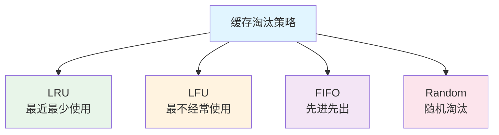
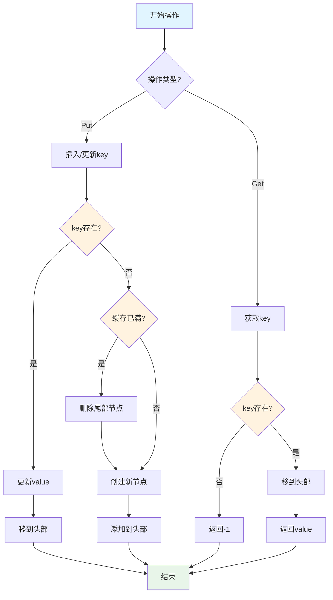

# LRU缓存详解

本文详细介绍 LRU（Least Recently Used，最近最少使用）缓存算法，包括其原理、实现方法和应用场景。

## 什么是 LRU？

LRU（Least Recently Used）是一种缓存淘汰策略，其核心思想是：**当缓存空间不足时，淘汰最近最少使用的数据**。

### LRU 的工作原理

1. **访问数据**：当访问某个数据时，将其移到缓存的最前面（标记为最近使用）
2. **添加数据**：当添加新数据时，如果缓存未满，直接添加；如果缓存已满，删除最久未使用的数据，然后添加新数据
3. **淘汰策略**：总是淘汰最久未使用的数据

### LRU 的特点

- **时间复杂度**：get 和 put 操作都是 O(1)
- **空间复杂度**：O(capacity)
- **适用场景**：需要快速访问最近使用的数据

### 缓存淘汰策略对比



## LRU 的数据结构设计

LRU 缓存通常使用 **哈希表 + 双向链表** 来实现：

- **哈希表**：提供 O(1) 的查找能力，key → node 的映射
- **双向链表**：维护访问顺序，最近使用的在头部，最久未使用的在尾部

### 数据结构图示

```
哈希表: {key1: node1, key2: node2, key3: node3}

双向链表: head <-> node1 <-> node2 <-> node3 <-> tail
         (最近使用)                    (最久未使用)
```

### 节点定义

```go
// LRUNode LRU缓存节点
type LRUNode struct {
    Key  int
    Val  int
    Prev *LRUNode
    Next *LRUNode
}
```

## LRU 实现

### 完整实现代码

```go
package main

import "fmt"

// LRUCache LRU缓存结构
type LRUCache struct {
    capacity int
    cache    map[int]*LRUNode
    head     *LRUNode // 虚拟头节点
    tail     *LRUNode // 虚拟尾节点
}

// LRUNode 双向链表节点
type LRUNode struct {
    Key  int
    Val  int
    Prev *LRUNode
    Next *LRUNode
}

// Constructor 创建LRU缓存
func Constructor(capacity int) *LRUCache {
    head := &LRUNode{Key: -1, Val: -1}
    tail := &LRUNode{Key: -1, Val: -1}
    head.Next = tail
    tail.Prev = head
    
    return &LRUCache{
        capacity: capacity,
        cache:    make(map[int]*LRUNode),
        head:     head,
        tail:     tail,
    }
}

// Get 获取值
func (lru *LRUCache) Get(key int) int {
    node, exists := lru.cache[key]
    if !exists {
        return -1
    }
    
    // 将节点移到头部（标记为最近使用）
    lru.moveToHead(node)
    return node.Val
}

// Put 插入或更新值
func (lru *LRUCache) Put(key int, value int) {
    // 如果key已存在，更新值并移到头部
    if node, exists := lru.cache[key]; exists {
        node.Val = value
        lru.moveToHead(node)
        return
    }
    
    // 如果缓存已满，删除尾部节点（最久未使用）
    if len(lru.cache) >= lru.capacity {
        lru.removeTail()
    }
    
    // 创建新节点并添加到头部
    newNode := &LRUNode{
        Key:  key,
        Val:  value,
        Prev: nil,
        Next: nil,
    }
    lru.addToHead(newNode)
    lru.cache[key] = newNode
}

// addToHead 将节点添加到头部
func (lru *LRUCache) addToHead(node *LRUNode) {
    node.Prev = lru.head
    node.Next = lru.head.Next
    lru.head.Next.Prev = node
    lru.head.Next = node
}

// removeNode 删除节点
func (lru *LRUCache) removeNode(node *LRUNode) {
    node.Prev.Next = node.Next
    node.Next.Prev = node.Prev
}

// moveToHead 将节点移到头部
func (lru *LRUCache) moveToHead(node *LRUNode) {
    lru.removeNode(node)
    lru.addToHead(node)
}

// removeTail 删除尾部节点（最久未使用）
func (lru *LRUCache) removeTail() *LRUNode {
    node := lru.tail.Prev
    lru.removeNode(node)
    delete(lru.cache, node.Key)
    return node
}

// 辅助方法：打印缓存内容（用于调试）
func (lru *LRUCache) Print() {
    fmt.Print("Cache: ")
    curr := lru.head.Next
    for curr != lru.tail {
        fmt.Printf("(%d:%d) ", curr.Key, curr.Val)
        curr = curr.Next
    }
    fmt.Println()
}

func main() {
    // 创建容量为2的LRU缓存
    lru := Constructor(2)
    
    lru.Put(1, 1)
    lru.Put(2, 2)
    lru.Print() // Cache: (2:2) (1:1)
    
    fmt.Println(lru.Get(1)) // 返回 1
    lru.Print() // Cache: (1:1) (2:2) - 1被移到头部
    
    lru.Put(3, 3) // 缓存已满，删除2，添加3
    lru.Print() // Cache: (3:3) (1:1)
    
    fmt.Println(lru.Get(2)) // 返回 -1（未找到）
    
    lru.Put(4, 4) // 缓存已满，删除1，添加4
    lru.Print() // Cache: (4:4) (3:3)
    
    fmt.Println(lru.Get(1)) // 返回 -1（未找到）
    fmt.Println(lru.Get(3)) // 返回 3
    fmt.Println(lru.Get(4)) // 返回 4
}
```

### 算法流程



## 复杂度分析

| 操作 | 时间复杂度 | 空间复杂度 |
|------|-----------|-----------|
| Get | O(1) | O(1) |
| Put | O(1) | O(1) |
| 总体 | O(1) | O(capacity) |

### 时间复杂度说明

- **Get 操作**：哈希表查找 O(1) + 双向链表移动 O(1) = O(1)
- **Put 操作**：哈希表查找 O(1) + 双向链表插入/删除 O(1) = O(1)

### 空间复杂度说明

- 哈希表：O(capacity)
- 双向链表：O(capacity)
- 总体：O(capacity)

## 实现细节

### 1. 虚拟头尾节点

使用虚拟头节点（head）和虚拟尾节点（tail）可以简化边界处理：

```go
head := &LRUNode{Key: -1, Val: -1}
tail := &LRUNode{Key: -1, Val: -1}
head.Next = tail
tail.Prev = head
```

**优势**：
- 不需要特殊处理头尾节点的插入和删除
- 代码更简洁，减少边界判断

### 2. 双向链表的优势

使用双向链表而不是单链表的原因：
- **删除节点**：在已知节点的情况下，双向链表可以 O(1) 删除
- **移动节点**：可以快速将节点从任意位置移到头部

### 3. 哈希表的作用

哈希表提供 O(1) 的查找能力：
- 快速判断 key 是否存在
- 快速获取对应的节点指针
- 快速删除节点

## LeetCode 经典题目

### LeetCode 146. LRU 缓存

**问题描述**：设计并实现一个 LRU 缓存。

```go
// 上述完整实现就是 LeetCode 146 的解答
```

### 测试用例

```go
func TestLRUCache() {
    lru := Constructor(2)
    
    lru.Put(1, 1)
    lru.Put(2, 2)
    assert(lru.Get(1) == 1)    // 返回 1
    
    lru.Put(3, 3)              // 该操作会使得关键字 2 作废
    assert(lru.Get(2) == -1)   // 返回 -1 (未找到)
    
    lru.Put(4, 4)              // 该操作会使得关键字 1 作废
    assert(lru.Get(1) == -1)   // 返回 -1 (未找到)
    assert(lru.Get(3) == 3)    // 返回 3
    assert(lru.Get(4) == 4)    // 返回 4
}
```

## LRU 变体

### 1. LRU-K

LRU-K 是 LRU 的改进版本，记录每个数据被访问的次数，只有当数据访问次数达到 K 次时，才将其加入缓存。

**特点**：
- 可以避免"缓存污染"（偶尔访问的数据不会被加入缓存）
- 实现更复杂，需要维护访问历史

### 2. 2Q (Two Queue)

2Q 算法使用两个队列：
- **A1 队列**：只访问一次的数据
- **Am 队列**：访问多次的数据（LRU）

**特点**：
- 更好地处理"冷数据"和"热数据"
- 实现相对复杂

## 应用场景

### 1. 操作系统

- **页面置换算法**：操作系统使用 LRU 来决定哪些内存页应该被换出
- **文件系统缓存**：缓存最近访问的文件

### 2. 数据库

- **查询缓存**：缓存最近执行的 SQL 查询结果
- **索引缓存**：缓存最近使用的索引页

### 3. Web 开发

- **HTTP 缓存**：浏览器和代理服务器使用 LRU 缓存
- **Session 管理**：管理用户会话，淘汰最久未活跃的会话
- **API 限流**：记录最近访问的 IP，实现限流

### 4. 分布式系统

- **Redis**：Redis 的 maxmemory-policy 支持 LRU 策略
- **Memcached**：使用 LRU 淘汰策略
- **CDN**：内容分发网络使用 LRU 缓存热点内容

### 5. 编程语言

- **Python**：`functools.lru_cache` 装饰器实现 LRU 缓存
- **Java**：`LinkedHashMap` 可以实现 LRU 缓存

## 其他缓存淘汰策略

### LFU (Least Frequently Used)

**原理**：淘汰访问频率最低的数据。

**实现**：需要维护每个数据的访问频率。

**适用场景**：访问模式相对稳定的场景。

```go
// LFU 缓存节点
type LFUNode struct {
    Key   int
    Val   int
    Freq  int  // 访问频率
    Prev  *LFUNode
    Next  *LFUNode
}
```

### FIFO (First In First Out)

**原理**：淘汰最早进入缓存的数据。

**实现**：使用队列即可。

**适用场景**：数据访问模式无明显规律。

### Random

**原理**：随机淘汰数据。

**实现**：随机选择一个数据淘汰。

**适用场景**：很少使用，主要用于对比实验。

## LRU vs 其他策略

| 策略 | 时间复杂度 | 空间复杂度 | 适用场景 |
|------|-----------|-----------|---------|
| LRU | O(1) | O(n) | 最近访问的数据更可能再次访问 |
| LFU | O(1) | O(n) | 访问频率高的数据更可能再次访问 |
| FIFO | O(1) | O(n) | 数据访问模式无明显规律 |
| Random | O(1) | O(n) | 很少使用 |

## 实现优化技巧

### 1. 使用 sync.RWMutex（并发安全）

```go
import "sync"

type ThreadSafeLRUCache struct {
    *LRUCache
    mu sync.RWMutex
}

func (c *ThreadSafeLRUCache) Get(key int) int {
    c.mu.Lock()
    defer c.mu.Unlock()
    return c.LRUCache.Get(key)
}

func (c *ThreadSafeLRUCache) Put(key, value int) {
    c.mu.Lock()
    defer c.mu.Unlock()
    c.LRUCache.Put(key, value)
}
```

### 2. 泛型实现（Go 1.18+）

```go
type LRUCache[K comparable, V any] struct {
    capacity int
    cache    map[K]*LRUNode[K, V]
    head     *LRUNode[K, V]
    tail     *LRUNode[K, V]
}

type LRUNode[K comparable, V any] struct {
    Key  K
    Val  V
    Prev *LRUNode[K, V]
    Next *LRUNode[K, V]
}
```

### 3. 使用 container/list（简化实现）

```go
import (
    "container/list"
    "sync"
)

type SimpleLRUCache struct {
    capacity int
    cache    map[int]*list.Element
    list     *list.List
    mu       sync.RWMutex
}

type entry struct {
    key int
    val int
}

func NewSimpleLRUCache(capacity int) *SimpleLRUCache {
    return &SimpleLRUCache{
        capacity: capacity,
        cache:    make(map[int]*list.Element),
        list:     list.New(),
    }
}

func (c *SimpleLRUCache) Get(key int) int {
    c.mu.Lock()
    defer c.mu.Unlock()
    
    if elem, ok := c.cache[key]; ok {
        c.list.MoveToFront(elem)
        return elem.Value.(*entry).val
    }
    return -1
}

func (c *SimpleLRUCache) Put(key, value int) {
    c.mu.Lock()
    defer c.mu.Unlock()
    
    if elem, ok := c.cache[key]; ok {
        elem.Value.(*entry).val = value
        c.list.MoveToFront(elem)
        return
    }
    
    if len(c.cache) >= c.capacity {
        back := c.list.Back()
        if back != nil {
            delete(c.cache, back.Value.(*entry).key)
            c.list.Remove(back)
        }
    }
    
    elem := c.list.PushFront(&entry{key: key, val: value})
    c.cache[key] = elem
}
```

## 总结

1. **LRU 核心思想**：淘汰最近最少使用的数据
2. **数据结构**：哈希表 + 双向链表
3. **时间复杂度**：Get 和 Put 都是 O(1)
4. **实现要点**：
   - 使用虚拟头尾节点简化操作
   - 哈希表提供快速查找
   - 双向链表维护访问顺序
5. **应用场景**：操作系统、数据库、Web 开发、分布式系统等
6. **变体**：LRU-K、2Q 等改进版本

LRU 缓存是一种非常实用的数据结构，在系统设计和算法面试中经常出现。掌握其原理和实现对于解决相关问题非常有帮助！
