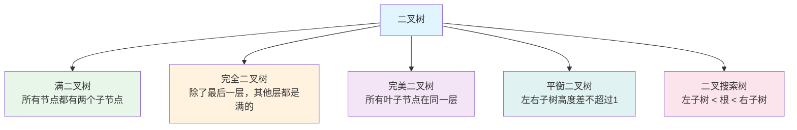
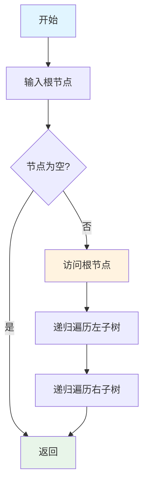
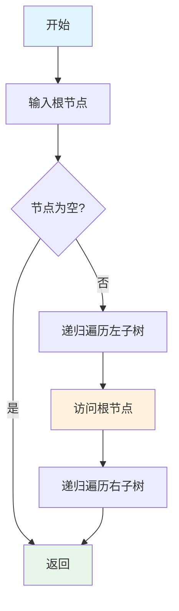
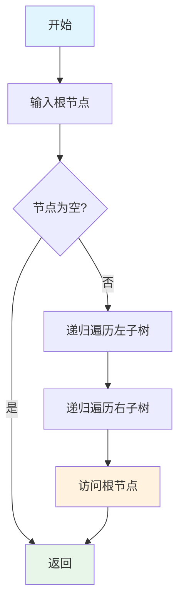
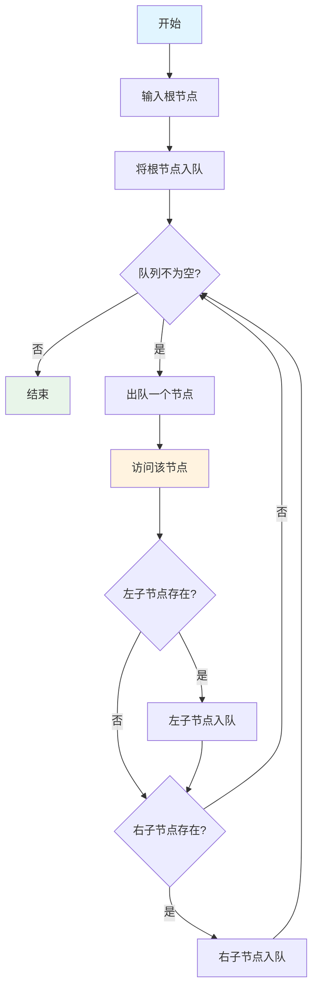
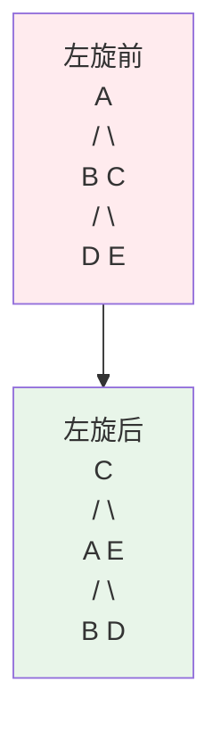
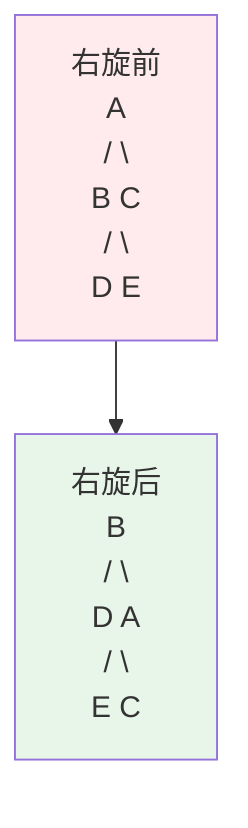

# 二叉树详解

本文详细介绍二叉树的相关知识，包括二叉树的基本概念、遍历方法、平衡二叉树和线索化等内容。

## 什么是二叉树？

二叉树（Binary Tree）是每个节点最多有两个子节点的树结构。通常子节点被称作"左子节点"和"右子节点"。

### 二叉树的特点

- 每个节点最多有两个子节点
- 左子树和右子树是有顺序的，不能颠倒
- 即使某个节点只有一个子节点，也要区分它是左子树还是右子树

### 二叉树的分类



### 二叉树节点定义

```go
// TreeNode 二叉树节点
type TreeNode struct {
    Val   int
    Left  *TreeNode
    Right *TreeNode
}
```

# 遍历

二叉树的遍历是指按照某种规则访问树中的每个节点，且每个节点只访问一次。主要有四种遍历方式：前序遍历、中序遍历、后序遍历和层序遍历。

## 前序遍历

### 算法原理

前序遍历（Preorder Traversal）的访问顺序是：**根节点 → 左子树 → 右子树**

### 算法流程



### 实现代码

```go
package main

import "fmt"

type TreeNode struct {
    Val   int
    Left  *TreeNode
    Right *TreeNode
}

// PreorderTraversal 前序遍历（递归）
func PreorderTraversal(root *TreeNode) []int {
    var result []int
    preorderHelper(root, &result)
    return result
}

func preorderHelper(node *TreeNode, result *[]int) {
    if node == nil {
        return
    }
    // 访问根节点
    *result = append(*result, node.Val)
    // 遍历左子树
    preorderHelper(node.Left, result)
    // 遍历右子树
    preorderHelper(node.Right, result)
}

// PreorderTraversalIterative 前序遍历（迭代）
func PreorderTraversalIterative(root *TreeNode) []int {
    if root == nil {
        return []int{}
    }
    
    var result []int
    stack := []*TreeNode{root}
    
    for len(stack) > 0 {
        // 弹出栈顶元素
        node := stack[len(stack)-1]
        stack = stack[:len(stack)-1]
        
        // 访问节点
        result = append(result, node.Val)
        
        // 先压入右子树，再压入左子树（保证左子树先出栈）
        if node.Right != nil {
            stack = append(stack, node.Right)
        }
        if node.Left != nil {
            stack = append(stack, node.Left)
        }
    }
    
    return result
}

func main() {
    // 构建示例树
    //       1
    //      / \
    //     2   3
    //    / \
    //   4   5
    root := &TreeNode{
        Val: 1,
        Left: &TreeNode{
            Val: 2,
            Left:  &TreeNode{Val: 4},
            Right: &TreeNode{Val: 5},
        },
        Right: &TreeNode{Val: 3},
    }
    
    fmt.Println("前序遍历（递归）:", PreorderTraversal(root))
    fmt.Println("前序遍历（迭代）:", PreorderTraversalIterative(root))
    // 输出: [1 2 4 5 3]
}
```

### 复杂度分析

- **时间复杂度**: O(n) - 需要访问每个节点一次
- **空间复杂度**: 
  - 递归: O(h) - h 为树的高度，递归栈的深度
  - 迭代: O(h) - 栈的最大深度

## 中序遍历

### 算法原理

中序遍历（Inorder Traversal）的访问顺序是：**左子树 → 根节点 → 右子树**

对于二叉搜索树，中序遍历可以得到有序序列。

### 算法流程



### 实现代码

```go
// InorderTraversal 中序遍历（递归）
func InorderTraversal(root *TreeNode) []int {
    var result []int
    inorderHelper(root, &result)
    return result
}

func inorderHelper(node *TreeNode, result *[]int) {
    if node == nil {
        return
    }
    // 遍历左子树
    inorderHelper(node.Left, result)
    // 访问根节点
    *result = append(*result, node.Val)
    // 遍历右子树
    inorderHelper(node.Right, result)
}

// InorderTraversalIterative 中序遍历（迭代）
func InorderTraversalIterative(root *TreeNode) []int {
    var result []int
    stack := []*TreeNode{}
    node := root
    
    for node != nil || len(stack) > 0 {
        // 一直向左走到底
        for node != nil {
            stack = append(stack, node)
            node = node.Left
        }
        
        // 弹出栈顶元素
        node = stack[len(stack)-1]
        stack = stack[:len(stack)-1]
        
        // 访问节点
        result = append(result, node.Val)
        
        // 转向右子树
        node = node.Right
    }
    
    return result
}
```

### 复杂度分析

- **时间复杂度**: O(n)
- **空间复杂度**: O(h)

### 应用场景

- **二叉搜索树排序**: 中序遍历二叉搜索树可以得到有序序列
- **表达式树求值**: 中序遍历表达式树可以得到中缀表达式

## 后序遍历

### 算法原理

后序遍历（Postorder Traversal）的访问顺序是：**左子树 → 右子树 → 根节点**

### 算法流程



### 实现代码

```go
// PostorderTraversal 后序遍历（递归）
func PostorderTraversal(root *TreeNode) []int {
    var result []int
    postorderHelper(root, &result)
    return result
}

func postorderHelper(node *TreeNode, result *[]int) {
    if node == nil {
        return
    }
    // 遍历左子树
    postorderHelper(node.Left, result)
    // 遍历右子树
    postorderHelper(node.Right, result)
    // 访问根节点
    *result = append(*result, node.Val)
}

// PostorderTraversalIterative 后序遍历（迭代）
func PostorderTraversalIterative(root *TreeNode) []int {
    if root == nil {
        return []int{}
    }
    
    var result []int
    stack := []*TreeNode{root}
    
    for len(stack) > 0 {
        node := stack[len(stack)-1]
        stack = stack[:len(stack)-1]
        
        // 将结果插入到开头（因为后序遍历是最后访问根节点）
        result = append([]int{node.Val}, result...)
        
        // 先压入左子树，再压入右子树
        if node.Left != nil {
            stack = append(stack, node.Left)
        }
        if node.Right != nil {
            stack = append(stack, node.Right)
        }
    }
    
    return result
}
```

### 复杂度分析

- **时间复杂度**: O(n)
- **空间复杂度**: O(h)

### 应用场景

- **删除树**: 后序遍历可以确保在删除父节点之前先删除子节点
- **计算目录大小**: 先计算子目录大小，再计算父目录大小
- **表达式树求值**: 后序遍历表达式树可以直接计算表达式的值

## 层序遍历

### 算法原理

层序遍历（Level Order Traversal）按照树的层次，从上到下、从左到右访问每个节点。通常使用队列来实现。

### 算法流程



### 实现代码

```go
// LevelOrderTraversal 层序遍历
func LevelOrderTraversal(root *TreeNode) []int {
    if root == nil {
        return []int{}
    }
    
    var result []int
    queue := []*TreeNode{root}
    
    for len(queue) > 0 {
        // 出队
        node := queue[0]
        queue = queue[1:]
        
        // 访问节点
        result = append(result, node.Val)
        
        // 将子节点入队
        if node.Left != nil {
            queue = append(queue, node.Left)
        }
        if node.Right != nil {
            queue = append(queue, node.Right)
        }
    }
    
    return result
}

// LevelOrderTraversalWithLevels 按层返回结果
func LevelOrderTraversalWithLevels(root *TreeNode) [][]int {
    if root == nil {
        return [][]int{}
    }
    
    var result [][]int
    queue := []*TreeNode{root}
    
    for len(queue) > 0 {
        levelSize := len(queue)
        level := []int{}
        
        // 处理当前层的所有节点
        for i := 0; i < levelSize; i++ {
            node := queue[0]
            queue = queue[1:]
            
            level = append(level, node.Val)
            
            if node.Left != nil {
                queue = append(queue, node.Left)
            }
            if node.Right != nil {
                queue = append(queue, node.Right)
            }
        }
        
        result = append(result, level)
    }
    
    return result
}
```

### 复杂度分析

- **时间复杂度**: O(n)
- **空间复杂度**: O(w) - w 为树的最大宽度

### 应用场景

- **打印树的结构**: 按层打印可以直观地看到树的结构
- **查找树的宽度**: 层序遍历可以找到树的最大宽度
- **Z字形遍历**: 在层序遍历基础上实现 Z 字形遍历

# 平衡二叉树

平衡二叉树（Balanced Binary Tree）是一种特殊的二叉树，它的左右子树的高度差不超过 1，这样可以保证树的高度为 O(log n)，从而保证各种操作的时间复杂度为 O(log n)。

## AVL树

### 算法原理

AVL 树（Adelson-Velsky and Landis Tree）是最早发明的自平衡二叉搜索树。在 AVL 树中，任何节点的两个子树的高度最大差别为 1。

### 平衡因子

平衡因子（Balance Factor）定义为：**左子树高度 - 右子树高度**

- 平衡因子 = -1, 0, 1：节点平衡
- 平衡因子 < -1：右子树过高，需要左旋
- 平衡因子 > 1：左子树过高，需要右旋

### 旋转操作

#### 左旋（Left Rotation）

当右子树过高时，进行左旋操作。



#### 右旋（Right Rotation）

当左子树过高时，进行右旋操作。



### 实现代码

```go
// AVLNode AVL树节点
type AVLNode struct {
    Val    int
    Left   *AVLNode
    Right  *AVLNode
    Height int // 节点高度
}

// getHeight 获取节点高度
func getHeight(node *AVLNode) int {
    if node == nil {
        return 0
    }
    return node.Height
}

// getBalanceFactor 获取平衡因子
func getBalanceFactor(node *AVLNode) int {
    if node == nil {
        return 0
    }
    return getHeight(node.Left) - getHeight(node.Right)
}

// max 返回两个数中的较大值
func max(a, b int) int {
    if a > b {
        return a
    }
    return b
}

// updateHeight 更新节点高度
func updateHeight(node *AVLNode) {
    node.Height = 1 + max(getHeight(node.Left), getHeight(node.Right))
}

// leftRotate 左旋
func leftRotate(x *AVLNode) *AVLNode {
    y := x.Right
    T2 := y.Left
    
    // 执行旋转
    y.Left = x
    x.Right = T2
    
    // 更新高度
    updateHeight(x)
    updateHeight(y)
    
    return y
}

// rightRotate 右旋
func rightRotate(y *AVLNode) *AVLNode {
    x := y.Left
    T2 := x.Right
    
    // 执行旋转
    x.Right = y
    y.Left = T2
    
    // 更新高度
    updateHeight(y)
    updateHeight(x)
    
    return x
}

// InsertAVL 插入节点到AVL树
func InsertAVL(root *AVLNode, val int) *AVLNode {
    // 1. 执行标准BST插入
    if root == nil {
        return &AVLNode{Val: val, Height: 1}
    }
    
    if val < root.Val {
        root.Left = InsertAVL(root.Left, val)
    } else if val > root.Val {
        root.Right = InsertAVL(root.Right, val)
    } else {
        return root // 不允许重复值
    }
    
    // 2. 更新节点高度
    updateHeight(root)
    
    // 3. 获取平衡因子
    balance := getBalanceFactor(root)
    
    // 4. 如果不平衡，进行旋转
    // 左左情况（需要右旋）
    if balance > 1 && val < root.Left.Val {
        return rightRotate(root)
    }
    
    // 右右情况（需要左旋）
    if balance < -1 && val > root.Right.Val {
        return leftRotate(root)
    }
    
    // 左右情况（先左旋再右旋）
    if balance > 1 && val > root.Left.Val {
        root.Left = leftRotate(root.Left)
        return rightRotate(root)
    }
    
    // 右左情况（先右旋再左旋）
    if balance < -1 && val < root.Right.Val {
        root.Right = rightRotate(root.Right)
        return leftRotate(root)
    }
    
    return root
}
```

### 复杂度分析

- **时间复杂度**: 
  - 查找: O(log n)
  - 插入: O(log n)
  - 删除: O(log n)
- **空间复杂度**: O(n)

### 应用场景

- **需要频繁查找的场景**: AVL 树保证 O(log n) 的查找时间
- **需要有序遍历的场景**: 中序遍历可以得到有序序列
- **数据库索引**: 某些数据库使用 AVL 树作为索引结构

## 红黑树

### 算法原理

红黑树（Red-Black Tree）是一种自平衡二叉搜索树，它通过颜色标记和旋转操作来保持平衡。红黑树比 AVL 树更宽松的平衡条件，使得插入和删除操作更高效。

### 红黑树的性质

1. **每个节点要么是红色，要么是黑色**
2. **根节点是黑色**
3. **所有叶子节点（NIL）都是黑色**
4. **如果一个节点是红色，那么它的两个子节点都是黑色**（不能有两个连续的红色节点）
5. **从任意节点到其每个叶子的所有简单路径都包含相同数目的黑色节点**（黑高相同）

### 实现代码

```go
// RBNode 红黑树节点
type RBNode struct {
    Val    int
    Color  string // "RED" 或 "BLACK"
    Left   *RBNode
    Right  *RBNode
    Parent *RBNode
}

const (
    RED   = "RED"
    BLACK = "BLACK"
)

// InsertRB 插入节点到红黑树
func InsertRB(root *RBNode, val int) *RBNode {
    // 标准BST插入
    node := insertBST(root, val)
    
    // 新插入的节点默认为红色
    node.Color = RED
    
    // 修复红黑树性质
    return fixInsertRB(node)
}

func insertBST(root *RBNode, val int) *RBNode {
    if root == nil {
        return &RBNode{Val: val, Color: RED}
    }
    
    if val < root.Val {
        root.Left = insertBST(root.Left, val)
        root.Left.Parent = root
    } else if val > root.Val {
        root.Right = insertBST(root.Right, val)
        root.Right.Parent = root
    }
    
    return root
}

// fixInsertRB 修复插入后的红黑树性质
func fixInsertRB(node *RBNode) *RBNode {
    var parent, grandparent, uncle *RBNode
    
    for node.Parent != nil && node.Parent.Color == RED {
        parent = node.Parent
        grandparent = parent.Parent
        
        if parent == grandparent.Left {
            uncle = grandparent.Right
            
            // Case 1: 叔叔节点是红色
            if uncle != nil && uncle.Color == RED {
                parent.Color = BLACK
                uncle.Color = BLACK
                grandparent.Color = RED
                node = grandparent
            } else {
                // Case 2: 叔叔节点是黑色，且当前节点是右子节点
                if node == parent.Right {
                    node = parent
                    node = leftRotateRB(node)
                }
                
                // Case 3: 叔叔节点是黑色，且当前节点是左子节点
                parent.Color = BLACK
                grandparent.Color = RED
                node = rightRotateRB(grandparent)
            }
        } else {
            // 对称情况
            uncle = grandparent.Left
            
            if uncle != nil && uncle.Color == RED {
                parent.Color = BLACK
                uncle.Color = BLACK
                grandparent.Color = RED
                node = grandparent
            } else {
                if node == parent.Left {
                    node = parent
                    node = rightRotateRB(node)
                }
                parent.Color = BLACK
                grandparent.Color = RED
                node = leftRotateRB(grandparent)
            }
        }
    }
    
    // 确保根节点是黑色
    for node.Parent != nil {
        node = node.Parent
    }
    node.Color = BLACK
    
    return node
}

func leftRotateRB(x *RBNode) *RBNode {
    y := x.Right
    x.Right = y.Left
    
    if y.Left != nil {
        y.Left.Parent = x
    }
    
    y.Parent = x.Parent
    
    if x.Parent == nil {
        // x 是根节点
    } else if x == x.Parent.Left {
        x.Parent.Left = y
    } else {
        x.Parent.Right = y
    }
    
    y.Left = x
    x.Parent = y
    
    return y
}

func rightRotateRB(y *RBNode) *RBNode {
    x := y.Left
    y.Left = x.Right
    
    if x.Right != nil {
        x.Right.Parent = y
    }
    
    x.Parent = y.Parent
    
    if y.Parent == nil {
        // y 是根节点
    } else if y == y.Parent.Left {
        y.Parent.Left = x
    } else {
        y.Parent.Right = x
    }
    
    x.Right = y
    y.Parent = x
    
    return x
}
```

### 复杂度分析

- **时间复杂度**: 
  - 查找: O(log n)
  - 插入: O(log n)
  - 删除: O(log n)
- **空间复杂度**: O(n)

### AVL树 vs 红黑树

| 特性 | AVL树 | 红黑树 |
|------|-------|--------|
| 平衡条件 | 严格平衡（高度差≤1） | 相对平衡（最长路径≤2倍最短路径） |
| 查找性能 | 更好（更平衡） | 稍差 |
| 插入/删除性能 | 较慢（需要更多旋转） | 更快（旋转次数少） |
| 应用场景 | 查找频繁的场景 | 插入/删除频繁的场景 |

### 应用场景

- **C++ STL**: `std::map` 和 `std::set` 使用红黑树实现
- **Java**: `TreeMap` 和 `TreeSet` 使用红黑树实现
- **Linux 内核**: 进程调度器使用红黑树
- **数据库索引**: MySQL 的 InnoDB 存储引擎使用红黑树

# 线索化

线索化（Threading）是在二叉树的基础上，利用空指针域存储前驱和后继节点的信息，从而可以不用递归或栈就能遍历二叉树。

## 线索二叉树节点

```go
// ThreadedNode 线索二叉树节点
type ThreadedNode struct {
    Val    int
    Left   *ThreadedNode
    Right  *ThreadedNode
    LTag   bool // true 表示左指针指向前驱，false 表示指向左子节点
    RTag   bool // true 表示右指针指向后继，false 表示指向右子节点
}
```

## 前序线索化

### 算法原理

前序线索化按照前序遍历的顺序，将空指针域指向前驱或后继节点。

### 实现代码

```go
var prev *ThreadedNode // 全局变量，记录前一个访问的节点

// PreorderThreading 前序线索化
func PreorderThreading(root *ThreadedNode) {
    prev = nil
    preorderThreadingHelper(root)
}

func preorderThreadingHelper(node *ThreadedNode) {
    if node == nil {
        return
    }
    
    // 处理当前节点
    if node.Left == nil {
        node.Left = prev
        node.LTag = true
    } else {
        node.LTag = false
    }
    
    if prev != nil && prev.Right == nil {
        prev.Right = node
        prev.RTag = true
    } else if prev != nil {
        prev.RTag = false
    }
    
    prev = node
    
    // 只有左子节点不是线索时才递归
    if !node.LTag {
        preorderThreadingHelper(node.Left)
    }
    if !node.RTag {
        preorderThreadingHelper(node.Right)
    }
}

// PreorderTraversalThreaded 前序遍历线索二叉树
func PreorderTraversalThreaded(root *ThreadedNode) []int {
    var result []int
    node := root
    
    for node != nil {
        result = append(result, node.Val)
        
        if !node.LTag {
            node = node.Left
        } else {
            node = node.Right
        }
    }
    
    return result
}
```

## 中序线索化

### 算法原理

中序线索化按照中序遍历的顺序，将空指针域指向前驱或后继节点。中序线索化是最常用的线索化方式。

### 实现代码

```go
// InorderThreading 中序线索化
func InorderThreading(root *ThreadedNode) {
    prev = nil
    inorderThreadingHelper(root)
}

func inorderThreadingHelper(node *ThreadedNode) {
    if node == nil {
        return
    }
    
    // 遍历左子树
    inorderThreadingHelper(node.Left)
    
    // 处理当前节点
    if node.Left == nil {
        node.Left = prev
        node.LTag = true
    } else {
        node.LTag = false
    }
    
    if prev != nil && prev.Right == nil {
        prev.Right = node
        prev.RTag = true
    } else if prev != nil {
        prev.RTag = false
    }
    
    prev = node
    
    // 遍历右子树
    inorderThreadingHelper(node.Right)
}

// InorderTraversalThreaded 中序遍历线索二叉树
func InorderTraversalThreaded(root *ThreadedNode) []int {
    var result []int
    node := root
    
    // 找到最左节点
    for node != nil && !node.LTag {
        node = node.Left
    }
    
    // 沿着线索遍历
    for node != nil {
        result = append(result, node.Val)
        
        if node.RTag {
            // 右指针是线索，直接访问后继
            node = node.Right
        } else {
            // 右指针指向右子树，找到右子树的最左节点
            node = node.Right
            for node != nil && !node.LTag {
                node = node.Left
            }
        }
    }
    
    return result
}
```

## 后序线索化

### 算法原理

后序线索化按照后序遍历的顺序，将空指针域指向前驱或后继节点。

### 实现代码

```go
// PostorderThreading 后序线索化
func PostorderThreading(root *ThreadedNode) {
    prev = nil
    postorderThreadingHelper(root)
}

func postorderThreadingHelper(node *ThreadedNode) {
    if node == nil {
        return
    }
    
    // 遍历左子树
    postorderThreadingHelper(node.Left)
    
    // 遍历右子树
    postorderThreadingHelper(node.Right)
    
    // 处理当前节点
    if node.Left == nil {
        node.Left = prev
        node.LTag = true
    } else {
        node.LTag = false
    }
    
    if prev != nil && prev.Right == nil {
        prev.Right = node
        prev.RTag = true
    } else if prev != nil {
        prev.RTag = false
    }
    
    prev = node
}

// PostorderTraversalThreaded 后序遍历线索二叉树
func PostorderTraversalThreaded(root *ThreadedNode) []int {
    var result []int
    node := root
    var prev *ThreadedNode
    
    for node != nil {
        // 找到最左节点
        for node.Left != nil && !node.LTag {
            node = node.Left
        }
        
        // 访问节点
        result = append(result, node.Val)
        prev = node
        
        // 移动到下一个节点
        if node.RTag {
            // 右指针是线索
            node = node.Right
        } else {
            // 右指针指向右子树
            if node.Right == prev {
                // 从右子树返回，继续向上
                node = node.Parent
            } else {
                node = node.Right
            }
        }
    }
    
    return result
}
```

### 复杂度分析

- **时间复杂度**: 
  - 线索化: O(n)
  - 遍历: O(n)
- **空间复杂度**: O(1) - 不需要额外的栈空间

### 应用场景

- **节省空间**: 利用空指针域，不需要额外的栈空间
- **提高遍历效率**: 可以 O(1) 时间找到前驱和后继
- **嵌入式系统**: 内存受限的场景

## 总结

1. **遍历方式**: 前序、中序、后序、层序各有不同的应用场景
2. **平衡二叉树**: AVL 树和红黑树都是自平衡二叉搜索树，各有优势
3. **线索化**: 利用空指针域存储前驱和后继信息，提高遍历效率
4. **实际应用**: 二叉树广泛应用于数据库索引、文件系统、表达式求值等领域

选择合适的二叉树结构和遍历方式可以显著提升程序性能！
