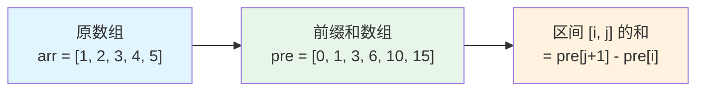
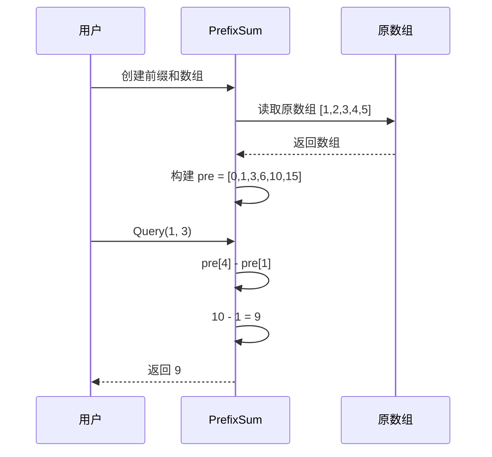

# 前缀和数组详解

前缀和数组（Prefix Sum Array）是一种预处理技术，通过预处理原数组，可以在 O(1) 时间内查询任意区间的和。

## 概念

前缀和数组是一种预处理技术，通过预处理原数组，可以在 O(1) 时间内查询任意区间的和。

## 工作原理



### 核心思想

- **预处理**: 构建前缀和数组 `pre[i] = arr[0] + arr[1] + ... + arr[i-1]`
- **查询**: 区间 `[i, j]` 的和 = `pre[j+1] - pre[i]`
- **时间复杂度**: 预处理 O(n)，查询 O(1)

## 实现示例

### Go 语言实现

```go
package main

import "fmt"

// PrefixSum 前缀和数组结构
type PrefixSum struct {
    pre []int // 前缀和数组，pre[i] 表示 arr[0...i-1] 的和
}

// NewPrefixSum 创建前缀和数组
func NewPrefixSum(arr []int) *PrefixSum {
    n := len(arr)
    pre := make([]int, n+1)
    
    // 构建前缀和数组
    for i := 0; i < n; i++ {
        pre[i+1] = pre[i] + arr[i]
    }
    
    return &PrefixSum{pre: pre}
}

// Query 查询区间 [l, r] 的和（闭区间）
func (ps *PrefixSum) Query(l, r int) int {
    if l < 0 || r >= len(ps.pre)-1 || l > r {
        return 0
    }
    // pre[r+1] 是 arr[0...r] 的和
    // pre[l] 是 arr[0...l-1] 的和
    // 所以 arr[l...r] 的和 = pre[r+1] - pre[l]
    return ps.pre[r+1] - ps.pre[l]
}

// Sum 查询从 0 到 index 的和
func (ps *PrefixSum) Sum(index int) int {
    if index < 0 || index >= len(ps.pre)-1 {
        return 0
    }
    return ps.pre[index+1]
}

func main() {
    // 示例：数组 [1, 2, 3, 4, 5]
    arr := []int{1, 2, 3, 4, 5}
    ps := NewPrefixSum(arr)
    
    fmt.Println("原数组:", arr)
    fmt.Println("前缀和数组:", ps.pre)
    
    // 查询区间 [1, 3] 的和，即 arr[1] + arr[2] + arr[3] = 2 + 3 + 4 = 9
    fmt.Println("区间 [1, 3] 的和:", ps.Query(1, 3)) // 输出: 9
    
    // 查询区间 [0, 4] 的和，即所有元素的和
    fmt.Println("区间 [0, 4] 的和:", ps.Query(0, 4)) // 输出: 15
    
    // 查询从 0 到 2 的和
    fmt.Println("从 0 到 2 的和:", ps.Sum(2)) // 输出: 6
}
```

### 执行流程示例



## 应用场景

1. **区间求和问题**: 多次查询数组的区间和
2. **子数组问题**: 查找满足条件的子数组
3. **二维前缀和**: 扩展到二维矩阵的区间求和

## 复杂度分析

- **空间复杂度**: O(n)
- **预处理时间复杂度**: O(n)
- **查询时间复杂度**: O(1)

