# 前缀和数组与差分数组详解

前缀和数组（Prefix Sum Array）和差分数组（Difference Array）是一对互补的数据结构，分别用于快速区间查询和快速区间更新。

## 目录

- [前缀和数组](#前缀和数组)
  - [概念](#概念)
  - [工作原理](#工作原理)
  - [实现示例](#实现示例)
  - [应用场景](#应用场景)
  - [前缀和变种](#前缀和变种)
  - [二维前缀和](#二维前缀和)
- [差分数组](#差分数组)
  - [概念](#概念-1)
  - [工作原理](#工作原理-1)
  - [实现示例](#实现示例-1)
  - [应用场景](#应用场景-1)
  - [二维差分](#二维差分)
- [实际应用问题](#实际应用问题)
- [前缀和与其他数据结构](#前缀和与其他数据结构)
- [最佳实践](#最佳实践)
- [总结](#总结)

# 前缀和数组

前缀和数组（Prefix Sum Array）是一种预处理技术，通过预处理原数组，可以在 O(1) 时间内查询任意区间的和。

## 概念

前缀和数组是一种预处理技术，通过预处理原数组，可以在 O(1) 时间内查询任意区间的和。

## 工作原理

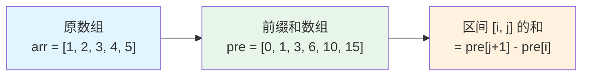

### 核心思想

- **预处理**: 构建前缀和数组 `pre[i] = arr[0] + arr[1] + ... + arr[i-1]`
- **查询**: 区间 `[i, j]` 的和 = `pre[j+1] - pre[i]`
- **时间复杂度**: 预处理 O(n)，查询 O(1)

### 构建过程

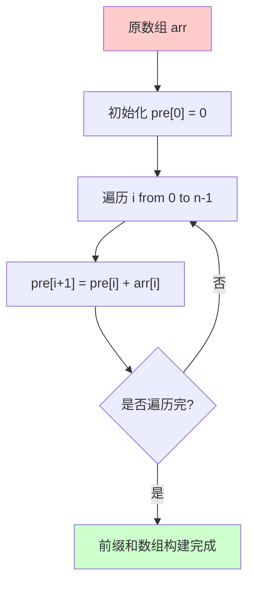

## 实现示例

### Go 语言实现

```go
package main

import "fmt"

// PrefixSum 前缀和数组结构
type PrefixSum struct {
    pre []int // 前缀和数组，pre[i] 表示 arr[0...i-1] 的和
}

// NewPrefixSum 创建前缀和数组
func NewPrefixSum(arr []int) *PrefixSum {
    n := len(arr)
    pre := make([]int, n+1)
    
    // 构建前缀和数组
    for i := 0; i < n; i++ {
        pre[i+1] = pre[i] + arr[i]
    }
    
    return &PrefixSum{pre: pre}
}

// Query 查询区间 [l, r] 的和（闭区间）
func (ps *PrefixSum) Query(l, r int) int {
    if l < 0 || r >= len(ps.pre)-1 || l > r {
        return 0
    }
    // pre[r+1] 是 arr[0...r] 的和
    // pre[l] 是 arr[0...l-1] 的和
    // 所以 arr[l...r] 的和 = pre[r+1] - pre[l]
    return ps.pre[r+1] - ps.pre[l]
}

// Sum 查询从 0 到 index 的和
func (ps *PrefixSum) Sum(index int) int {
    if index < 0 || index >= len(ps.pre)-1 {
        return 0
    }
    return ps.pre[index+1]
}

func main() {
    // 示例：数组 [1, 2, 3, 4, 5]
    arr := []int{1, 2, 3, 4, 5}
    ps := NewPrefixSum(arr)
    
    fmt.Println("原数组:", arr)
    fmt.Println("前缀和数组:", ps.pre)
    
    // 查询区间 [1, 3] 的和，即 arr[1] + arr[2] + arr[3] = 2 + 3 + 4 = 9
    fmt.Println("区间 [1, 3] 的和:", ps.Query(1, 3)) // 输出: 9
    
    // 查询区间 [0, 4] 的和，即所有元素的和
    fmt.Println("区间 [0, 4] 的和:", ps.Query(0, 4)) // 输出: 15
    
    // 查询从 0 到 2 的和
    fmt.Println("从 0 到 2 的和:", ps.Sum(2)) // 输出: 6
}
```

### 执行流程示例

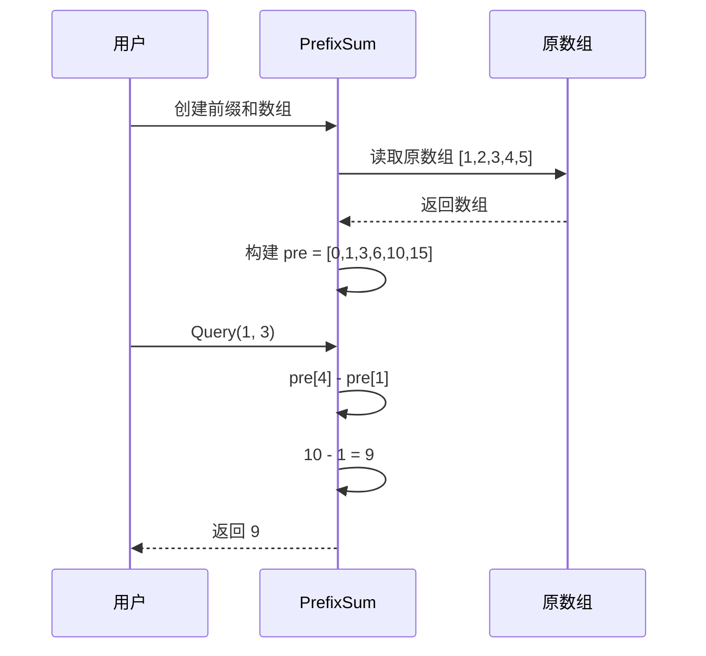

## 应用场景

### 1. 区间求和问题

多次查询数组的区间和，使用前缀和可以将每次查询的时间复杂度从 O(n) 降低到 O(1)。

**问题示例**：给定一个数组，多次查询区间 [l, r] 的和。

```go
// 不使用前缀和：每次查询 O(n)
func querySum(arr []int, l, r int) int {
    sum := 0
    for i := l; i <= r; i++ {
        sum += arr[i]
    }
    return sum
}

// 使用前缀和：每次查询 O(1)
func querySumWithPrefix(arr []int, l, r int) int {
    ps := NewPrefixSum(arr)
    return ps.Query(l, r)
}
```

### 2. 子数组问题

查找满足条件的子数组，如和等于目标值的子数组、最大子数组和等。

**示例**：找到所有和等于目标值的子数组

```go
func findSubarraysWithSum(arr []int, target int) [][]int {
    ps := NewPrefixSum(arr)
    result := [][]int{}
    
    // 使用哈希表记录前缀和出现的索引
    prefixMap := make(map[int][]int)
    prefixMap[0] = []int{-1} // 前缀和为0出现在索引-1（虚拟位置）
    
    for i := 0; i < len(arr); i++ {
        sum := ps.Sum(i) // arr[0...i] 的和
        
        // 如果 sum - target 存在，说明存在子数组和为 target
        if indices, ok := prefixMap[sum-target]; ok {
            for _, start := range indices {
                result = append(result, []int{start + 1, i})
            }
        }
        
        // 记录当前前缀和
        prefixMap[sum] = append(prefixMap[sum], i)
    }
    
    return result
}
```

### 3. 二维前缀和

扩展到二维矩阵的区间求和。

### 4. 其他应用

- 统计问题：统计满足条件的区间数量
- 滑动窗口：结合滑动窗口解决相关问题
- 动态规划：作为动态规划的优化技巧

## 复杂度分析

- **空间复杂度**: O(n)
- **预处理时间复杂度**: O(n)
- **查询时间复杂度**: O(1)

## 前缀和 vs 暴力查询

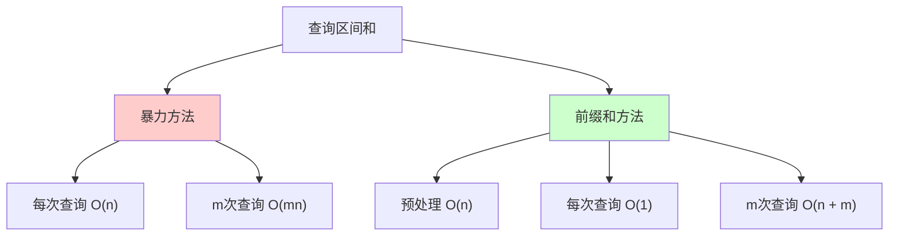

| 方法 | 预处理 | 单次查询 | m次查询 |
|------|--------|---------|---------|
| **暴力方法** | O(1) | O(n) | O(mn) |
| **前缀和方法** | O(n) | O(1) | O(n + m) |

当查询次数 m 较大时，前缀和方法的优势明显。

# 前缀和变种

## 数组左半部和右半部的差

### 问题描述

给定一个数组，对于每个位置 i，计算左半部（arr[0...i-1]）和右半部（arr[i+1...n-1]）的差。

### 解决方案

使用前缀和和后缀和（或两次前缀和）来解决。

```go
// 计算每个位置左右两部分的差
func leftRightDifference(arr []int) []int {
    n := len(arr)
    result := make([]int, n)
    
    // 前缀和：pre[i] 表示 arr[0...i-1] 的和
    pre := make([]int, n+1)
    for i := 0; i < n; i++ {
        pre[i+1] = pre[i] + arr[i]
    }
    
    // 后缀和：suf[i] 表示 arr[i+1...n-1] 的和
    suf := make([]int, n+1)
    for i := n - 1; i >= 0; i-- {
        suf[i] = suf[i+1] + arr[i]
    }
    
    // 计算每个位置的差
    for i := 0; i < n; i++ {
        leftSum := pre[i]        // arr[0...i-1] 的和
        rightSum := suf[i+1]     // arr[i+1...n-1] 的和
        result[i] = abs(leftSum - rightSum)
    }
    
    return result
}

func abs(x int) int {
    if x < 0 {
        return -x
    }
    return x
}

// 使用示例
func main() {
    arr := []int{10, 4, 8, 3}
    result := leftRightDifference(arr)
    fmt.Println("原数组:", arr)
    fmt.Println("左右差:", result)
    // 输出: [15, 1, 11, 22]
    // 解释:
    // i=0: |0 - (4+8+3)| = 15
    // i=1: |10 - (8+3)| = 1
    // i=2: |(10+4) - 3| = 11
    // i=3: |(10+4+8) - 0| = 22
}
```

### 可视化

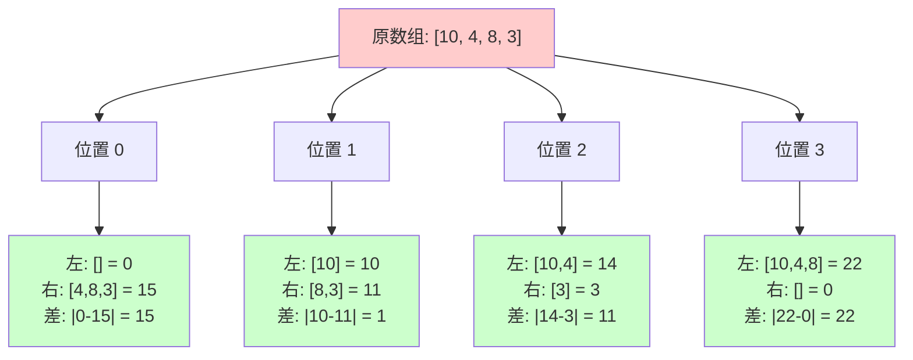

## 前缀积

类似前缀和，但计算的是乘积。

```go
// PrefixProduct 前缀积数组
type PrefixProduct struct {
    pre []int
}

func NewPrefixProduct(arr []int) *PrefixProduct {
    n := len(arr)
    pre := make([]int, n+1)
    pre[0] = 1
    
    for i := 0; i < n; i++ {
        pre[i+1] = pre[i] * arr[i]
    }
    
    return &PrefixProduct{pre: pre}
}

func (pp *PrefixProduct) Query(l, r int) int {
    if l < 0 || r >= len(pp.pre)-1 || l > r {
        return 1
    }
    // 注意：如果数组中有0，需要特殊处理
    return pp.pre[r+1] / pp.pre[l]
}
```

## 前缀异或

计算前缀异或和，用于解决异或相关问题。

```go
// PrefixXOR 前缀异或数组
type PrefixXOR struct {
    pre []int
}

func NewPrefixXOR(arr []int) *PrefixXOR {
    n := len(arr)
    pre := make([]int, n+1)
    
    for i := 0; i < n; i++ {
        pre[i+1] = pre[i] ^ arr[i]
    }
    
    return &PrefixXOR{pre: pre}
}

func (px *PrefixXOR) Query(l, r int) int {
    if l < 0 || r >= len(px.pre)-1 || l > r {
        return 0
    }
    // 异或的性质：a ^ a = 0
    return px.pre[r+1] ^ px.pre[l]
}
```

## 前缀最大值/最小值

记录前缀的最大值或最小值。

```go
package main

import (
    "fmt"
    "math"
)

// PrefixMax 前缀最大值数组
type PrefixMax struct {
    pre []int
}

func NewPrefixMax(arr []int) *PrefixMax {
    n := len(arr)
    pre := make([]int, n+1)
    pre[0] = math.MinInt
    
    for i := 0; i < n; i++ {
        pre[i+1] = max(pre[i], arr[i])
    }
    
    return &PrefixMax{pre: pre}
}

func (pm *PrefixMax) MaxTo(index int) int {
    if index < 0 || index >= len(pm.pre)-1 {
        return math.MinInt
    }
    return pm.pre[index+1]
}

func max(a, b int) int {
    if a > b {
        return a
    }
    return b
}
```

# 二维前缀和

二维前缀和用于快速计算矩阵中任意矩形区域的和。

## 概念

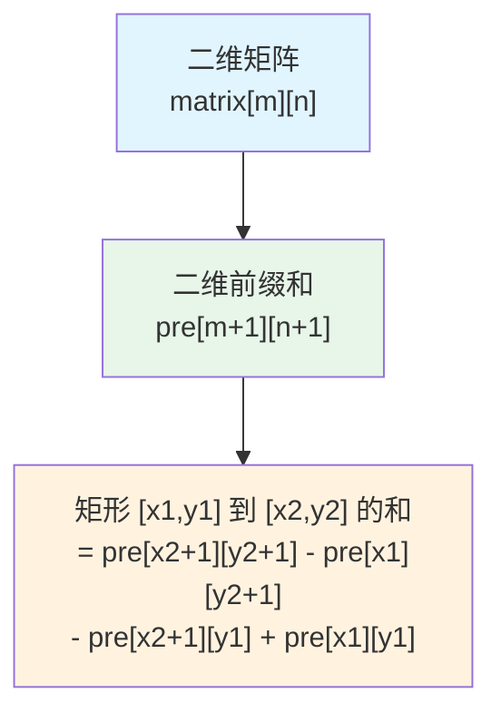

## 构建过程

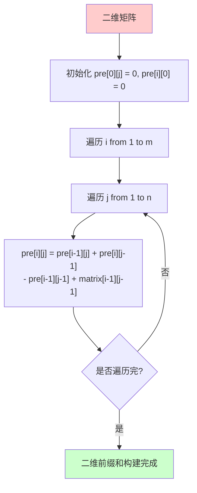

## 实现

```go
// PrefixSum2D 二维前缀和
type PrefixSum2D struct {
    pre [][]int // pre[i][j] 表示 matrix[0...i-1][0...j-1] 的和
}

func NewPrefixSum2D(matrix [][]int) *PrefixSum2D {
    m, n := len(matrix), len(matrix[0])
    pre := make([][]int, m+1)
    for i := range pre {
        pre[i] = make([]int, n+1)
    }
    
    // 构建二维前缀和
    for i := 1; i <= m; i++ {
        for j := 1; j <= n; j++ {
            // 容斥原理
            pre[i][j] = pre[i-1][j] + pre[i][j-1] - pre[i-1][j-1] + matrix[i-1][j-1]
        }
    }
    
    return &PrefixSum2D{pre: pre}
}

// Query 查询矩形 [x1, y1] 到 [x2, y2] 的和（闭区间）
func (ps *PrefixSum2D) Query(x1, y1, x2, y2 int) int {
    if x1 < 0 || y1 < 0 || x2 >= len(ps.pre)-1 || y2 >= len(ps.pre[0])-1 || x1 > x2 || y1 > y2 {
        return 0
    }
    // 容斥原理
    return ps.pre[x2+1][y2+1] - ps.pre[x1][y2+1] - ps.pre[x2+1][y1] + ps.pre[x1][y1]
}

// 使用示例
func main() {
    matrix := [][]int{
        {1, 2, 3},
        {4, 5, 6},
        {7, 8, 9},
    }
    
    ps := NewPrefixSum2D(matrix)
    
    // 查询矩形 [0,0] 到 [1,1] 的和
    // 即 matrix[0][0] + matrix[0][1] + matrix[1][0] + matrix[1][1]
    // = 1 + 2 + 4 + 5 = 12
    fmt.Println("矩形 [0,0] 到 [1,1] 的和:", ps.Query(0, 0, 1, 1)) // 输出: 12
}
```

## 可视化

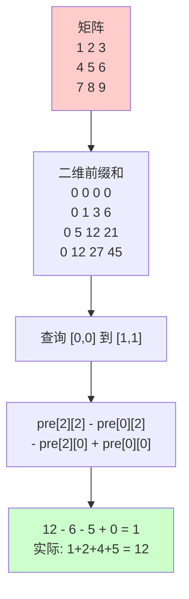

# 差分数组

差分数组是前缀和的逆操作，用于快速进行区间更新操作。

## 概念

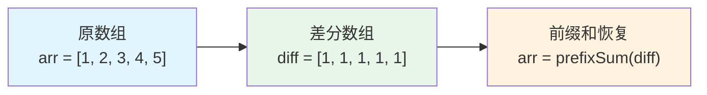

### 核心思想

- **差分数组**：`diff[i] = arr[i] - arr[i-1]`（i > 0），`diff[0] = arr[0]`
- **前缀和恢复**：对差分数组求前缀和可以得到原数组
- **区间更新**：对区间 [l, r] 加 val，只需更新 `diff[l] += val` 和 `diff[r+1] -= val`

## 工作原理

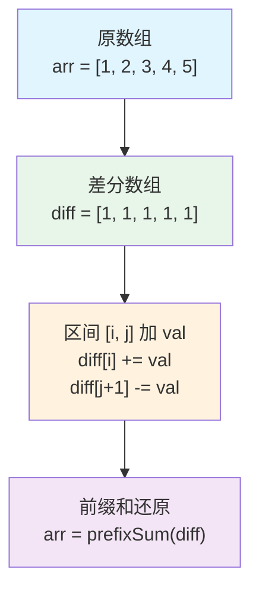

## 实现示例

### Go 语言实现

```go
package main

import "fmt"

// DifferenceArray 差分数组结构
type DifferenceArray struct {
    diff []int // 差分数组
    n    int   // 数组长度
}

// NewDifferenceArray 创建差分数组
func NewDifferenceArray(arr []int) *DifferenceArray {
    n := len(arr)
    diff := make([]int, n)
    
    // 构建差分数组
    diff[0] = arr[0]
    for i := 1; i < n; i++ {
        diff[i] = arr[i] - arr[i-1]
    }
    
    return &DifferenceArray{
        diff: diff,
        n:    n,
    }
}

// Update 对区间 [l, r] 的所有元素加 val（闭区间）
func (da *DifferenceArray) Update(l, r, val int) {
    if l < 0 || r >= da.n || l > r {
        return
    }
    
    // 差分数组的核心操作
    da.diff[l] += val
    if r+1 < da.n {
        da.diff[r+1] -= val
    }
}

// GetArray 通过前缀和还原原数组
func (da *DifferenceArray) GetArray() []int {
    arr := make([]int, da.n)
    arr[0] = da.diff[0]
    
    // 对差分数组求前缀和
    for i := 1; i < da.n; i++ {
        arr[i] = arr[i-1] + da.diff[i]
    }
    
    return arr
}

// GetValue 获取指定位置的值
func (da *DifferenceArray) GetValue(index int) int {
    if index < 0 || index >= da.n {
        return 0
    }
    
    // 计算前缀和
    val := da.diff[0]
    for i := 1; i <= index; i++ {
        val += da.diff[i]
    }
    
    return val
}

func main() {
    // 示例：数组 [1, 2, 3, 4, 5]
    arr := []int{1, 2, 3, 4, 5}
    da := NewDifferenceArray(arr)
    
    fmt.Println("原数组:", arr)
    fmt.Println("差分数组:", da.diff)
    
    // 对区间 [1, 3] 的所有元素加 2
    // 即 arr[1], arr[2], arr[3] 都加 2
    da.Update(1, 3, 2)
    fmt.Println("更新后差分数组:", da.diff)
    
    // 还原数组
    newArr := da.GetArray()
    fmt.Println("更新后数组:", newArr) // 输出: [1, 4, 5, 6, 5]
    
    // 再次对区间 [0, 2] 加 1
    da.Update(0, 2, 1)
    finalArr := da.GetArray()
    fmt.Println("最终数组:", finalArr) // 输出: [2, 5, 6, 6, 5]
}
```

### 更新流程示例

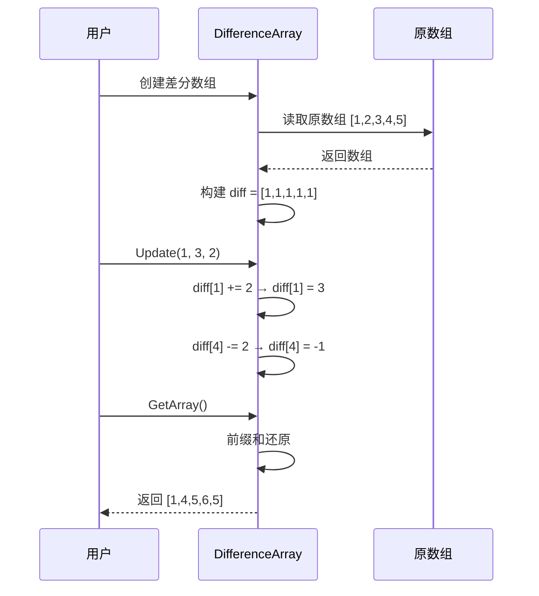

## 差分数组的优势

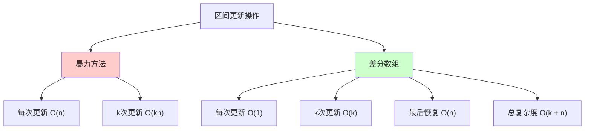

## 应用场景

### 1. 区间加法

对数组的多个区间进行加法操作，最后查询结果。

**问题示例**：给定一个数组，进行 k 次操作，每次对区间 [l, r] 的所有元素加 val，最后输出数组。

```go
func rangeAddition(arr []int, operations [][]int) []int {
    da := NewDifferenceArray(arr)
    
    // 执行所有区间更新操作
    for _, op := range operations {
        l, r, val := op[0], op[1], op[2]
        da.Update(l, r, val)
    }
    
    // 恢复最终数组
    return da.GetArray()
}

// 使用示例
func main() {
    arr := []int{1, 2, 3, 4, 5}
    operations := [][]int{
        {1, 3, 10},  // 区间 [1,3] 加 10
        {0, 2, 5},   // 区间 [0,2] 加 5
    }
    
    result := rangeAddition(arr, operations)
    fmt.Println("最终数组:", result)
    // 输出: [6, 17, 18, 14, 5]
}
```

### 2. 航班预订统计

记录每个航班的预订数量变化。

**问题描述**：有 n 个航班，编号从 1 到 n。给定一个航班预订表 bookings，其中 bookings[i] = [first, last, seats] 表示在航班 first 到 last（包含 first 和 last）的每个航班上预订了 seats 个座位。返回一个长度为 n 的数组 answer，其中 answer[i] 是航班 i+1 上预订的座位总数。

```go
func corpFlightBookings(bookings [][]int, n int) []int {
    // 初始化差分数组（从0开始，所以需要n+1长度）
    diff := make([]int, n+1)
    
    // 对每个预订进行区间更新
    for _, booking := range bookings {
        first, last, seats := booking[0], booking[1], booking[2]
        // 注意：题目中航班编号从1开始，数组索引从0开始
        diff[first-1] += seats
        if last < n {
            diff[last] -= seats
        }
    }
    
    // 通过前缀和还原数组
    answer := make([]int, n)
    answer[0] = diff[0]
    for i := 1; i < n; i++ {
        answer[i] = answer[i-1] + diff[i]
    }
    
    return answer
}
```

### 3. 会议室安排

统计每个时间段的会议数量。

**问题描述**：给定一系列会议的开始和结束时间，统计每个时间段的会议数量。

```go
func meetingCount(meetings [][]int, timeSlots int) []int {
    // 初始化差分数组
    diff := make([]int, timeSlots+1)
    
    // 对每个会议进行区间更新
    for _, meeting := range meetings {
        start, end := meeting[0], meeting[1]
        diff[start] += 1
        if end+1 < timeSlots {
            diff[end+1] -= 1
        }
    }
    
    // 通过前缀和还原数组
    result := make([]int, timeSlots)
    result[0] = diff[0]
    for i := 1; i < timeSlots; i++ {
        result[i] = result[i-1] + diff[i]
    }
    
    return result
}
```

## 复杂度分析

- **空间复杂度**: O(n)
- **构建时间复杂度**: O(n)
- **更新时间复杂度**: O(1)
- **查询时间复杂度**: O(n)（需要前缀和还原）

## 二维差分

扩展到二维矩阵的区间更新。

```go
// DifferenceArray2D 二维差分数组
type DifferenceArray2D struct {
    diff [][]int
}

func NewDifferenceArray2D(m, n int) *DifferenceArray2D {
    diff := make([][]int, m+2)
    for i := range diff {
        diff[i] = make([]int, n+2)
    }
    return &DifferenceArray2D{diff: diff}
}

// Update 对矩形 [x1, y1] 到 [x2, y2] 的所有元素加 val
func (da *DifferenceArray2D) Update(x1, y1, x2, y2, val int) {
    da.diff[x1+1][y1+1] += val
    da.diff[x1+1][y2+2] -= val
    da.diff[x2+2][y1+1] -= val
    da.diff[x2+2][y2+2] += val
}

// GetMatrix 通过二维前缀和恢复原矩阵
func (da *DifferenceArray2D) GetMatrix(m, n int) [][]int {
    matrix := make([][]int, m)
    for i := range matrix {
        matrix[i] = make([]int, n)
    }
    
    // 二维前缀和恢复
    for i := 1; i <= m; i++ {
        for j := 1; j <= n; j++ {
            da.diff[i][j] += da.diff[i-1][j] + da.diff[i][j-1] - da.diff[i-1][j-1]
            matrix[i-1][j-1] = da.diff[i][j]
        }
    }
    
    return matrix
}
```

# 实际应用问题

## 问题1：子数组和等于K

**问题描述**：给定一个整数数组和一个整数 k，找到所有和等于 k 的连续子数组的个数。

**解决方案**：使用前缀和 + 哈希表

```go
func subarraySum(nums []int, k int) int {
    ps := NewPrefixSum(nums)
    count := 0
    prefixMap := make(map[int]int)
    prefixMap[0] = 1 // 前缀和为0出现1次（虚拟位置）
    
    for i := 0; i < len(nums); i++ {
        sum := ps.Sum(i) // arr[0...i] 的和
        
        // 如果 sum - k 存在，说明存在子数组和为 k
        if cnt, ok := prefixMap[sum-k]; ok {
            count += cnt
        }
        
        // 记录当前前缀和
        prefixMap[sum]++
    }
    
    return count
}

// 使用示例
func main() {
    nums := []int{1, 1, 1}
    k := 2
    result := subarraySum(nums, k)
    fmt.Printf("和等于 %d 的子数组个数: %d\n", k, result) // 输出: 2
}
```

## 问题2：最大子数组和

**问题描述**：找到一个数组中和最大的连续子数组。

**解决方案**：使用前缀和 + 维护最小前缀和

```go
func maxSubArray(nums []int) int {
    ps := NewPrefixSum(nums)
    maxSum := nums[0]
    minPrefix := 0 // 最小前缀和
    
    for i := 0; i < len(nums); i++ {
        sum := ps.Sum(i) // arr[0...i] 的和
        
        // 当前最大子数组和 = 当前前缀和 - 最小前缀和
        maxSum = max(maxSum, sum-minPrefix)
        
        // 更新最小前缀和
        minPrefix = min(minPrefix, sum)
    }
    
    return maxSum
}

func max(a, b int) int {
    if a > b {
        return a
    }
    return b
}

func min(a, b int) int {
    if a < b {
        return a
    }
    return b
}
```

## 问题3：区间更新问题

**问题描述**：给定一个数组，进行多次区间更新操作，每次对区间 [l, r] 的所有元素加 val，最后输出数组。

**解决方案**：使用差分数组

```go
func rangeUpdate(arr []int, updates [][]int) []int {
    da := NewDifferenceArray(arr)
    
    for _, update := range updates {
        l, r, val := update[0], update[1], update[2]
        da.Update(l, r, val)
    }
    
    return da.GetArray()
}
```

## 问题4：二维区间求和

**问题描述**：给定一个二维矩阵，多次查询矩形区域的和。

**解决方案**：使用二维前缀和

```go
func matrixRangeSum(matrix [][]int, queries [][]int) []int {
    ps := NewPrefixSum2D(matrix)
    results := make([]int, len(queries))
    
    for i, query := range queries {
        x1, y1, x2, y2 := query[0], query[1], query[2], query[3]
        results[i] = ps.Query(x1, y1, x2, y2)
    }
    
    return results
}
```

# 前缀和与其他数据结构

## 前缀和 vs 线段树

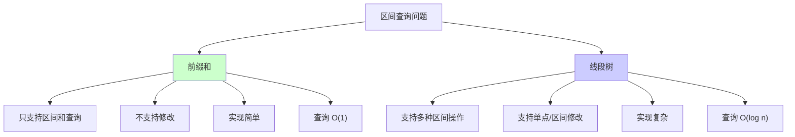

| 特性 | 前缀和 | 线段树 |
|------|--------|--------|
| **查询类型** | 区间和 | 区间和、最大值、最小值等 |
| **修改操作** | 不支持 | 支持单点/区间修改 |
| **查询复杂度** | O(1) | O(log n) |
| **空间复杂度** | O(n) | O(n) |
| **实现难度** | 简单 | 复杂 |

## 前缀和 vs 树状数组

| 特性 | 前缀和 | 树状数组 |
|------|--------|----------|
| **查询类型** | 区间和 | 区间和 |
| **修改操作** | 不支持 | 支持单点修改 |
| **查询复杂度** | O(1) | O(log n) |
| **空间复杂度** | O(n) | O(n) |
| **实现难度** | 简单 | 中等 |

## 前缀和 vs 差分数组

| 特性 | 前缀和 | 差分数组 |
|------|--------|----------|
| **主要用途** | 区间查询 | 区间更新 |
| **操作类型** | 查询区间和 | 更新区间值 |
| **查询复杂度** | O(1) | O(n)（需要还原） |
| **更新复杂度** | 不支持 | O(1) |
| **关系** | 差分数组的前缀和 = 原数组 | 原数组的差分 = 差分数组 |

# 最佳实践

## 1. 边界处理

```go
// 好的做法：在 Query 方法中检查边界
func (ps *PrefixSum) Query(l, r int) int {
    if l < 0 || r >= len(ps.pre)-1 || l > r {
        return 0 // 或返回错误
    }
    return ps.pre[r+1] - ps.pre[l]
}
```

## 2. 索引理解

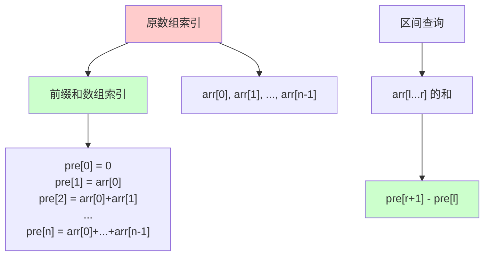

**关键点**：
- `pre[i]` 表示 `arr[0...i-1]` 的和
- 区间 `[l, r]` 的和 = `pre[r+1] - pre[l]`
- 从 0 到 i 的和 = `pre[i+1]`

## 3. 负数处理

如果数组中有负数，前缀和可能为负，需要注意：

```go
// 处理负数的情况
func (ps *PrefixSum) Query(l, r int) int {
    // 正常处理，负数不影响计算
    return ps.pre[r+1] - ps.pre[l]
}
```

## 4. 溢出处理

对于大数，注意整数溢出：

```go
// 使用 int64 避免溢出
type PrefixSum struct {
    pre []int64
}

func NewPrefixSum(arr []int) *PrefixSum {
    n := len(arr)
    pre := make([]int64, n+1)
    
    for i := 0; i < n; i++ {
        pre[i+1] = pre[i] + int64(arr[i])
    }
    
    return &PrefixSum{pre: pre}
}
```

## 5. 差分数组的边界处理

```go
// 差分数组更新时注意边界
func (da *DifferenceArray) Update(l, r, val int) {
    if l < 0 || r >= da.n || l > r {
        return
    }
    
    da.diff[l] += val
    // 注意：r+1 可能超出数组范围
    if r+1 < da.n {
        da.diff[r+1] -= val
    }
}
```

# 总结

前缀和数组和差分数组是一对互补的强大数据结构：

## 核心优势

### 前缀和数组
- **快速查询**：O(1) 时间查询区间和
- **简单实现**：代码简洁，易于理解
- **广泛应用**：适用于多种区间问题

### 差分数组
- **快速更新**：O(1) 时间进行区间更新
- **批量操作**：可以累积多次更新后统一还原
- **高效处理**：适合区间更新频繁的场景

## 关键要点

### 前缀和数组
1. **预处理**：O(n) 时间构建前缀和数组
2. **查询公式**：区间 [l, r] 的和 = `pre[r+1] - pre[l]`
3. **索引关系**：`pre[i]` 表示 `arr[0...i-1]` 的和

### 差分数组
1. **构建**：O(n) 时间构建差分数组
2. **更新公式**：区间 [l, r] 加 val：`diff[l] += val`, `diff[r+1] -= val`
3. **还原**：对差分数组求前缀和得到原数组

## 适用场景

### 前缀和数组
- 多次区间和查询
- 子数组问题
- 二维矩阵区间求和
- 结合其他技巧（哈希表、滑动窗口等）

### 差分数组
- 多次区间更新操作
- 航班预订统计
- 会议室安排
- 区间加法问题

## 扩展方向

- **二维前缀和/差分**：扩展到矩阵
- **前缀积/异或**：其他运算的前缀形式
- **动态前缀和**：结合树状数组或线段树
- **多维前缀和**：扩展到更高维度

## 互补关系

前缀和数组和差分数组是互逆操作：
- 对原数组求差分得到差分数组
- 对差分数组求前缀和得到原数组
- 前缀和用于快速查询，差分数组用于快速更新

理解前缀和数组和差分数组有助于：
- 优化区间查询和更新问题
- 解决子数组相关问题
- 掌握预处理技巧
- 提升算法解题能力

# 参考文献

- 《算法导论》
- LeetCode 前缀和与差分数组相关题目
- 《编程珠玑》

