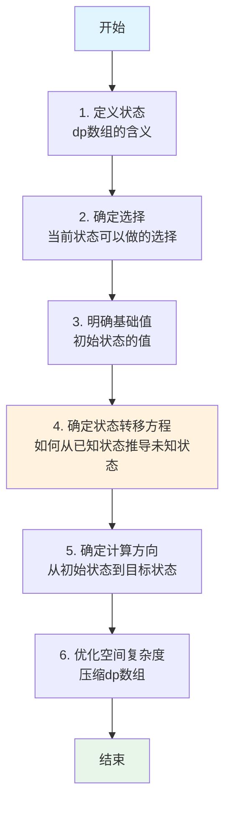

# 动态规划详解

动态规划（Dynamic Programming，DP）是一种通过把原问题分解为相对简单的子问题的方式来解决复杂问题的方法。动态规划常常适用于有重叠子问题和最优子结构性质的问题。

## 什么是动态规划？

动态规划根据具体情况动态地进行选择，即遍历所有状态，执行所有操作，从中选取最优方案。

### 核心思想

动态规划的核心思想是**维护状态量**，即状态转移方程。要想确定状态转移方程，需要先确定哪些是状态，这些状态可以进行哪些选择进行转移。

动态规划本质上就是穷举所有状态的情况，从中选出最优解。

### 基本框架

```
for 状态1 in 状态1的所有取值：
    for 状态2 in 状态2的所有取值：
        for ...
            dp[状态1][状态2][...] = 择优(选择1，选择2...)
```

## 动态规划的三个关键要素

### 1. 最优子结构（Optimal Substructure）

最优子结构是指问题的最优解包含子问题的最优解。换句话说，可以通过子问题的最优解来构造原问题的最优解。

**特点**：
- 不同的状态定义会导致不同的状态转移方程
- 更好的状态定义可以大幅减少计算量
- 子结构必须相互独立

**示例**：
在最短路径问题中，如果从 A 到 C 的最短路径经过 B，那么从 A 到 B 和从 B 到 C 的路径也必须是各自的最短路径。

### 2. 重叠子问题（Overlapping Subproblems）

重叠子问题是指在递归求解过程中，同一个子问题会被多次计算。

**解决方法**：
- **备忘录（Memoization）**：记录每个状态下的最优值，即 dp 表
- 根据后面的计算可以使用前面的计算结果，进而减少计算量
- 可根据实际使用已计算的数据来减少 dp 表的大小

**示例**：
在计算斐波那契数列时，`fib(5)` 需要计算 `fib(4)` 和 `fib(3)`，而 `fib(4)` 又需要计算 `fib(3)` 和 `fib(2)`，`fib(3)` 被重复计算了。

### 3. 状态转移方程（State Transition Equation）

状态转移方程描述了如何从已知状态推导出未知状态。

**确定步骤**：
1. 明确状态：定义 dp 数组的含义
2. 明确选择：当前状态可以做的选择
3. 明确基础值：初始状态的值
4. 确定计算方向：由初始状态一步一步推向目标值

## 动态规划解题步骤



### 详细步骤说明

1. **定义状态（明确 dp 数组的含义）**
   - 确定 dp 数组的维度和每个维度的含义
   - 例如：`dp[i][j]` 表示什么

2. **确定选择（明确选择）**
   - 分析当前状态可以做的选择
   - 例如：选或不选、走哪条路径

3. **明确基础值（初始状态）**
   - 确定初始状态的值
   - 例如：`dp[0] = 0` 或 `dp[0][0] = 1`

4. **确定状态转移方程**
   - 根据选择推导状态转移方程
   - 例如：`dp[i] = max(dp[i-1], dp[i-2] + nums[i])`

5. **确定计算方向**
   - 明确初始状态和目标状态
   - 确定是从前往后还是从后往前计算

6. **优化空间复杂度**
   - 分析是否可以压缩 dp 数组
   - 例如：二维压缩为一维，一维压缩为常数

## 经典问题分类

### 1. 线性 DP

线性 DP 是指状态转移沿着线性方向进行的动态规划。

**典型问题**：
- 斐波那契数列
- 爬楼梯问题
- 最长递增子序列（LIS）
- 最长公共子序列（LCS）
- 最大子数组和

### 2. 区间 DP

区间 DP 是指在一段区间上进行动态规划。

**典型问题**：
- 矩阵链乘法
- 回文子串
- 石子合并

### 3. 背包问题

背包问题是在给定限制条件下，选择物品使得价值最大。

**典型问题**：
- 0-1 背包
- 完全背包
- 多重背包
- 分组背包

### 4. 树形 DP

树形 DP 是在树结构上进行动态规划。

**典型问题**：
- 树的直径
- 树的最大独立集
- 树的最小支配集

### 5. 状态压缩 DP

状态压缩 DP 使用位运算来表示状态。

**典型问题**：
- 旅行商问题（TSP）
- 棋盘覆盖问题

## 经典问题示例

### 示例 1：斐波那契数列

#### 问题描述

计算第 n 个斐波那契数，其中 `F(0) = 0, F(1) = 1, F(n) = F(n-1) + F(n-2)`。

#### 递归解法（低效）

```go
func fib(n int) int {
    if n <= 1 {
        return n
    }
    return fib(n-1) + fib(n-2)
}
```

**时间复杂度**: O(2^n) - 存在大量重复计算

#### 动态规划解法

```go
package main

import "fmt"

// FibDP 动态规划解法
func FibDP(n int) int {
    if n <= 1 {
        return n
    }
    
    // dp[i] 表示第 i 个斐波那契数
    dp := make([]int, n+1)
    dp[0] = 0
    dp[1] = 1
    
    for i := 2; i <= n; i++ {
        dp[i] = dp[i-1] + dp[i-2]
    }
    
    return dp[n]
}

// FibDPOptimized 空间优化版本
func FibDPOptimized(n int) int {
    if n <= 1 {
        return n
    }
    
    // 只需要保存前两个状态
    prev2 := 0 // F(0)
    prev1 := 1 // F(1)
    
    for i := 2; i <= n; i++ {
        curr := prev1 + prev2
        prev2 = prev1
        prev1 = curr
    }
    
    return prev1
}

func main() {
    n := 10
    fmt.Printf("F(%d) = %d\n", n, FibDP(n))
    fmt.Printf("F(%d) = %d (优化版)\n", n, FibDPOptimized(n))
    // 输出: F(10) = 55
}
```

**时间复杂度**: O(n)  
**空间复杂度**: O(n) → O(1)（优化后）

### 示例 2：爬楼梯问题

#### 问题描述

假设你正在爬楼梯。需要 n 步才能到达楼顶。每次你可以爬 1 或 2 个台阶。你有多少种不同的方法可以爬到楼顶？

#### 状态定义

- `dp[i]`: 到达第 i 阶的方法数

#### 状态转移方程

```
dp[i] = dp[i-1] + dp[i-2]
```

#### 实现代码

```go
// ClimbStairs 爬楼梯问题
func ClimbStairs(n int) int {
    if n <= 2 {
        return n
    }
    
    // 空间优化版本
    prev2 := 1 // dp[0] = 1（到达第0阶有1种方法：不爬）
    prev1 := 2 // dp[1] = 2（到达第1阶有2种方法：1步或2步）
    
    for i := 3; i <= n; i++ {
        curr := prev1 + prev2
        prev2 = prev1
        prev1 = curr
    }
    
    return prev1
}
```

**时间复杂度**: O(n)  
**空间复杂度**: O(1)

### 示例 3：最长递增子序列（LIS）

#### 问题描述

给定一个整数数组，找到最长严格递增子序列的长度。

#### 状态定义

- `dp[i]`: 以 `nums[i]` 结尾的最长递增子序列的长度

#### 状态转移方程

```
dp[i] = max(dp[j] + 1) for all j < i and nums[j] < nums[i]
```

#### 实现代码

```go
// LengthOfLIS 最长递增子序列
func LengthOfLIS(nums []int) int {
    n := len(nums)
    if n == 0 {
        return 0
    }
    
    dp := make([]int, n)
    maxLen := 1
    
    // 初始化：每个元素本身就是一个长度为1的子序列
    for i := 0; i < n; i++ {
        dp[i] = 1
    }
    
    for i := 1; i < n; i++ {
        for j := 0; j < i; j++ {
            if nums[j] < nums[i] {
                if dp[j]+1 > dp[i] {
                    dp[i] = dp[j] + 1
                }
            }
        }
        if dp[i] > maxLen {
            maxLen = dp[i]
        }
    }
    
    return maxLen
}

func main() {
    nums := []int{10, 9, 2, 5, 3, 7, 101, 18}
    fmt.Println("最长递增子序列长度:", LengthOfLIS(nums))
    // 输出: 4 (子序列为 [2, 3, 7, 18])
}
```

**时间复杂度**: O(n²)  
**空间复杂度**: O(n)

**优化**：可以使用二分查找优化到 O(n log n)

### 示例 4：最大子数组和

#### 问题描述

给定一个整数数组，找到一个具有最大和的连续子数组（子数组最少包含一个元素），返回其最大和。

#### 状态定义

- `dp[i]`: 以 `nums[i]` 结尾的最大子数组和

#### 状态转移方程

```
dp[i] = max(nums[i], dp[i-1] + nums[i])
```

#### 实现代码

```go
// MaxSubArray 最大子数组和（Kadane算法）
func MaxSubArray(nums []int) int {
    n := len(nums)
    if n == 0 {
        return 0
    }
    
    // 空间优化：只需要保存前一个状态
    maxSum := nums[0]
    currSum := nums[0]
    
    for i := 1; i < n; i++ {
        // 如果当前和小于0，重新开始
        if currSum < 0 {
            currSum = nums[i]
        } else {
            currSum += nums[i]
        }
        
        if currSum > maxSum {
            maxSum = currSum
        }
    }
    
    return maxSum
}

func main() {
    nums := []int{-2, 1, -3, 4, -1, 2, 1, -5, 4}
    fmt.Println("最大子数组和:", MaxSubArray(nums))
    // 输出: 6 (子数组为 [4, -1, 2, 1])
}
```

**时间复杂度**: O(n)  
**空间复杂度**: O(1)

### 示例 5：最长公共子序列（LCS）

#### 问题描述

给定两个字符串，找到它们的最长公共子序列的长度。

#### 状态定义

- `dp[i][j]`: `text1[0:i]` 和 `text2[0:j]` 的最长公共子序列长度

#### 状态转移方程

```
if text1[i-1] == text2[j-1]:
    dp[i][j] = dp[i-1][j-1] + 1
else:
    dp[i][j] = max(dp[i-1][j], dp[i][j-1])
```

#### 实现代码

```go
// LongestCommonSubsequence 最长公共子序列
func LongestCommonSubsequence(text1, text2 string) int {
    m, n := len(text1), len(text2)
    dp := make([][]int, m+1)
    for i := range dp {
        dp[i] = make([]int, n+1)
    }
    
    for i := 1; i <= m; i++ {
        for j := 1; j <= n; j++ {
            if text1[i-1] == text2[j-1] {
                dp[i][j] = dp[i-1][j-1] + 1
            } else {
                dp[i][j] = max(dp[i-1][j], dp[i][j-1])
            }
        }
    }
    
    return dp[m][n]
}

func max(a, b int) int {
    if a > b {
        return a
    }
    return b
}

func main() {
    text1 := "abcde"
    text2 := "ace"
    fmt.Println("最长公共子序列长度:", LongestCommonSubsequence(text1, text2))
    // 输出: 3 (子序列为 "ace")
}
```

**时间复杂度**: O(m × n)  
**空间复杂度**: O(m × n)

**优化**：可以压缩到 O(min(m, n))

## 动态规划优化技巧

### 1. 空间优化

#### 滚动数组

当状态转移只依赖于前几个状态时，可以使用滚动数组减少空间复杂度。

```go
// 二维 → 一维
// 原：dp[i][j] = f(dp[i-1][j], dp[i][j-1])
// 优化：dp[j] = f(dp[j], dp[j-1])
```

#### 状态压缩

使用位运算压缩状态，适用于状态数量较少的情况。

```go
// 例如：dp[mask] 表示 mask 状态下的最优值
// mask 的每一位表示某个元素是否被选择
```

### 2. 时间优化

#### 记忆化搜索

将递归 + 备忘录的方式转换为自底向上的动态规划。

#### 单调队列/栈优化

对于某些特定的状态转移方程，可以使用单调队列或单调栈优化。

### 3. 状态定义优化

更好的状态定义可以：
- 减少状态数量
- 简化状态转移方程
- 降低空间复杂度

## 动态规划 vs 其他算法

### 动态规划 vs 贪心算法

| 特性 | 动态规划 | 贪心算法 |
|------|---------|---------|
| 选择 | 考虑所有可能的选择 | 只考虑当前最优选择 |
| 结果 | 全局最优解 | 局部最优解（可能不是全局最优） |
| 适用 | 有重叠子问题 | 有贪心选择性质 |

### 动态规划 vs 分治算法

| 特性 | 动态规划 | 分治算法 |
|------|---------|---------|
| 子问题 | 有重叠子问题 | 子问题相互独立 |
| 存储 | 需要存储子问题的解 | 不需要存储 |
| 适用 | 最优子结构 + 重叠子问题 | 问题可以分解为独立子问题 |

## 常见问题类型

### 1. 数组类问题

- 最大子数组和
- 最长递增子序列
- 打家劫舍
- 股票买卖

### 2. 字符串类问题

- 最长公共子序列
- 编辑距离
- 回文子串
- 正则表达式匹配

### 3. 树形问题

- 树的直径
- 树的最大路径和
- 树的着色问题

### 4. 背包问题

详见 [背包问题详解](./背包问题.md)

## 解题模板

### 模板 1：一维 DP

```go
func dp1D(n int) int {
    // 1. 定义状态
    dp := make([]int, n+1)
    
    // 2. 初始化
    dp[0] = baseCase
    
    // 3. 状态转移
    for i := 1; i <= n; i++ {
        dp[i] = transition(dp[i-1], ...)
    }
    
    return dp[n]
}
```

### 模板 2：二维 DP

```go
func dp2D(m, n int) int {
    // 1. 定义状态
    dp := make([][]int, m+1)
    for i := range dp {
        dp[i] = make([]int, n+1)
    }
    
    // 2. 初始化
    dp[0][0] = baseCase
    
    // 3. 状态转移
    for i := 1; i <= m; i++ {
        for j := 1; j <= n; j++ {
            dp[i][j] = transition(dp[i-1][j], dp[i][j-1], ...)
        }
    }
    
    return dp[m][n]
}
```

## 复杂度分析

### 时间复杂度

动态规划的时间复杂度通常是：
- **状态数量** × **每个状态的转移次数**

例如：
- 一维 DP：O(n)
- 二维 DP：O(m × n)
- 三维 DP：O(m × n × k)

### 空间复杂度

- **未优化**：O(状态数量)
- **滚动数组优化**：O(较小维度)
- **状态压缩**：O(1) 或 O(较小状态数)

## 总结

1. **核心思想**：通过维护状态量（dp 数组）和状态转移方程来解决问题

2. **三个关键要素**：
   - 最优子结构：问题的最优解包含子问题的最优解
   - 重叠子问题：同一个子问题会被多次计算
   - 状态转移方程：描述如何从已知状态推导未知状态

3. **解题步骤**：
   - 定义状态 → 确定选择 → 明确基础值 → 状态转移方程 → 计算方向 → 空间优化

4. **优化技巧**：
   - 空间优化：滚动数组、状态压缩
   - 时间优化：记忆化搜索、单调队列/栈

5. **适用场景**：
   - 最优化问题
   - 计数问题
   - 存在性问题

掌握动态规划需要大量的练习，通过解决不同类型的 DP 问题来培养状态定义和转移方程设计的能力！
