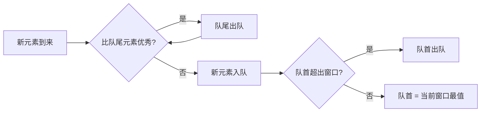

# 单调队列详解

单调队列（Monotone Queue）是一种特殊的双端队列（Deque），队列内元素保持单调递增或单调递减的性质。单调队列常用于解决**滑动窗口**中的最值问题，时间复杂度为 O(n)。

---

# 一、单调队列简介

## 1.1 定义

单调队列是一个双端队列，满足以下性质：

- **单调性**：队列中元素（从队首到队尾）保持单调递增或单调递减
- **双端操作**：可以从队首或队尾删除元素
- **时间复杂度**：每个元素最多入队、出队各一次，均摊 O(1)

## 1.2 核心思想

在维护队列单调性的同时：
- **队首元素**：保存当前窗口的最值（最大或最小）
- **新元素入队**：从队尾移除所有不如新元素"优秀"的元素
- **窗口滑动**：从队首移除已经不在窗口内的元素



## 1.3 与单调栈的区别

| 特性 | 单调栈 | 单调队列 |
|------|--------|----------|
| **数据结构** | 栈（单端） | 双端队列 |
| **操作** | 只能栈顶操作 | 队首队尾都可操作 |
| **应用场景** | 找左右第一个更大/更小元素 | 滑动窗口最值 |
| **时间复杂度** | O(n) | O(n) |

---

# 二、基本操作

## 2.1 单调递减队列（求最大值）

**维护规则**：从队首到队尾**递减**，队首元素最大。

```go
type MonotoneQueue struct {
    data []int  // 存储元素（可以是值或索引）
}

func NewMonotoneQueue() *MonotoneQueue {
    return &MonotoneQueue{data: make([]int, 0)}
}

// Push 从队尾入队（单调递减队列：求最大值）
func (q *MonotoneQueue) Push(val int) {
    // 移除所有比新元素小的队尾元素（保持递减性）
    for len(q.data) > 0 && q.data[len(q.data)-1] < val {
        q.data = q.data[:len(q.data)-1]
    }
    q.data = append(q.data, val)
}

// PopFront 从队首出队
func (q *MonotoneQueue) PopFront() {
    if len(q.data) > 0 {
        q.data = q.data[1:]
    }
}

// Front 获取队首元素（当前最大值）
func (q *MonotoneQueue) Front() int {
    return q.data[0]
}

// IsEmpty 判断队列是否为空
func (q *MonotoneQueue) IsEmpty() bool {
    return len(q.data) == 0
}
```

## 2.2 单调递增队列（求最小值）

**维护规则**：从队首到队尾**递增**，队首元素最小。

```go
// Push 从队尾入队（单调递增队列：求最小值）
func (q *MonotoneQueue) PushMin(val int) {
    // 移除所有比新元素大的队尾元素（保持递增性）
    for len(q.data) > 0 && q.data[len(q.data)-1] > val {
        q.data = q.data[:len(q.data)-1]
    }
    q.data = append(q.data, val)
}
```

---

# 三、经典问题：滑动窗口最大值

## 3.1 问题描述

给定数组 `nums` 和窗口大小 `k`，返回滑动窗口中每个位置的最大值。

**示例**：
```
输入: nums = [1,3,-1,-3,5,3,6,7], k = 3
输出: [3,3,5,5,6,7]

解释:
窗口位置               最大值
---------------       -----
[1  3  -1] -3  5  3  6  7       3
 1 [3  -1  -3] 5  3  6  7       3
 1  3 [-1  -3  5] 3  6  7       5
 1  3  -1 [-3  5  3] 6  7       5
 1  3  -1  -3 [5  3  6] 7       6
 1  3  -1  -3  5 [3  6  7]      7
```

## 3.2 暴力解法（O(n*k)）

```go
func maxSlidingWindowBrute(nums []int, k int) []int {
    n := len(nums)
    if n == 0 || k == 0 {
        return []int{}
    }
    
    result := make([]int, 0, n-k+1)
    for i := 0; i <= n-k; i++ {
        maxVal := nums[i]
        for j := i; j < i+k; j++ {
            if nums[j] > maxVal {
                maxVal = nums[j]
            }
        }
        result = append(result, maxVal)
    }
    return result
}
```

**时间复杂度**：O(n*k)  
**空间复杂度**：O(1)

## 3.3 单调队列解法（O(n)）

```go
func maxSlidingWindow(nums []int, k int) []int {
    n := len(nums)
    if n == 0 || k == 0 {
        return []int{}
    }
    
    result := make([]int, 0, n-k+1)
    deque := make([]int, 0) // 存储索引（单调递减）
    
    for i := 0; i < n; i++ {
        // 1. 移除超出窗口范围的队首元素
        for len(deque) > 0 && deque[0] < i-k+1 {
            deque = deque[1:]
        }
        
        // 2. 维护单调递减性：移除所有比当前元素小的队尾元素
        for len(deque) > 0 && nums[deque[len(deque)-1]] < nums[i] {
            deque = deque[:len(deque)-1]
        }
        
        // 3. 当前元素索引入队
        deque = append(deque, i)
        
        // 4. 窗口形成后，队首元素即为最大值
        if i >= k-1 {
            result = append(result, nums[deque[0]])
        }
    }
    
    return result
}
```

**时间复杂度**：O(n)，每个元素最多入队、出队各一次  
**空间复杂度**：O(k)，队列最多存储 k 个元素

## 3.4 执行过程演示

以 `nums = [1,3,-1,-3,5,3,6,7], k = 3` 为例：

```
i=0: nums[0]=1, deque=[0], 窗口未形成
i=1: nums[1]=3, deque=[1] (移除0), 窗口未形成
i=2: nums[2]=-1, deque=[1,2], 窗口[1,3,-1], max=nums[1]=3
i=3: nums[3]=-3, deque=[1,2,3], 窗口[3,-1,-3], max=nums[1]=3
i=4: nums[4]=5, deque=[4] (移除1,2,3), 窗口[-1,-3,5], max=nums[4]=5
i=5: nums[5]=3, deque=[4,5], 窗口[-3,5,3], max=nums[4]=5
i=6: nums[6]=6, deque=[6] (移除4,5), 窗口[5,3,6], max=nums[6]=6
i=7: nums[7]=7, deque=[7] (移除6), 窗口[3,6,7], max=nums[7]=7
```

---

# 四、变种问题

## 4.1 滑动窗口最小值

将单调递减队列改为单调递增队列即可。

```go
func minSlidingWindow(nums []int, k int) []int {
    n := len(nums)
    if n == 0 || k == 0 {
        return []int{}
    }
    
    result := make([]int, 0, n-k+1)
    deque := make([]int, 0)
    
    for i := 0; i < n; i++ {
        // 移除超出窗口的队首
        for len(deque) > 0 && deque[0] < i-k+1 {
            deque = deque[1:]
        }
        
        // 维护单调递增性：移除所有比当前元素大的队尾
        for len(deque) > 0 && nums[deque[len(deque)-1]] > nums[i] {
            deque = deque[:len(deque)-1]
        }
        
        deque = append(deque, i)
        
        if i >= k-1 {
            result = append(result, nums[deque[0]])
        }
    }
    
    return result
}
```

## 4.2 滑动窗口中位数

使用两个单调队列（一个递减、一个递增）分别维护较大和较小的一半元素。

## 4.3 滑动窗口最大值减最小值

```go
func maxMinusSlidingWindow(nums []int, k int) []int {
    n := len(nums)
    maxDeque := make([]int, 0) // 单调递减
    minDeque := make([]int, 0) // 单调递增
    result := make([]int, 0, n-k+1)
    
    for i := 0; i < n; i++ {
        // 维护最大值队列
        for len(maxDeque) > 0 && maxDeque[0] < i-k+1 {
            maxDeque = maxDeque[1:]
        }
        for len(maxDeque) > 0 && nums[maxDeque[len(maxDeque)-1]] < nums[i] {
            maxDeque = maxDeque[:len(maxDeque)-1]
        }
        maxDeque = append(maxDeque, i)
        
        // 维护最小值队列
        for len(minDeque) > 0 && minDeque[0] < i-k+1 {
            minDeque = minDeque[1:]
        }
        for len(minDeque) > 0 && nums[minDeque[len(minDeque)-1]] > nums[i] {
            minDeque = minDeque[:len(minDeque)-1]
        }
        minDeque = append(minDeque, i)
        
        if i >= k-1 {
            maxVal := nums[maxDeque[0]]
            minVal := nums[minDeque[0]]
            result = append(result, maxVal-minVal)
        }
    }
    
    return result
}
```

---

# 五、完整实现（泛型版）

Go 1.18+ 支持泛型，可以实现通用的单调队列。

```go
package main

import (
    "fmt"
    "golang.org/x/exp/constraints"
)

type MonotoneDeque[T constraints.Ordered] struct {
    data []T
    isMax bool  // true: 递减队列(求最大), false: 递增队列(求最小)
}

func NewMonotoneDeque[T constraints.Ordered](isMax bool) *MonotoneDeque[T] {
    return &MonotoneDeque[T]{
        data:  make([]T, 0),
        isMax: isMax,
    }
}

func (q *MonotoneDeque[T]) Push(val T) {
    if q.isMax {
        // 单调递减：移除所有比新元素小的队尾
        for len(q.data) > 0 && q.data[len(q.data)-1] < val {
            q.data = q.data[:len(q.data)-1]
        }
    } else {
        // 单调递增：移除所有比新元素大的队尾
        for len(q.data) > 0 && q.data[len(q.data)-1] > val {
            q.data = q.data[:len(q.data)-1]
        }
    }
    q.data = append(q.data, val)
}

func (q *MonotoneDeque[T]) PopFront() {
    if len(q.data) > 0 {
        q.data = q.data[1:]
    }
}

func (q *MonotoneDeque[T]) Front() T {
    return q.data[0]
}

func (q *MonotoneDeque[T]) IsEmpty() bool {
    return len(q.data) == 0
}

func (q *MonotoneDeque[T]) Size() int {
    return len(q.data)
}

// 滑动窗口最值（泛型版）
func SlidingWindowExtreme[T constraints.Ordered](nums []T, k int, isMax bool) []T {
    n := len(nums)
    if n == 0 || k == 0 {
        return []T{}
    }
    
    result := make([]T, 0, n-k+1)
    deque := make([]int, 0)
    
    for i := 0; i < n; i++ {
        // 移除超出窗口的队首
        for len(deque) > 0 && deque[0] < i-k+1 {
            deque = deque[1:]
        }
        
        // 维护单调性
        if isMax {
            // 递减队列
            for len(deque) > 0 && nums[deque[len(deque)-1]] < nums[i] {
                deque = deque[:len(deque)-1]
            }
        } else {
            // 递增队列
            for len(deque) > 0 && nums[deque[len(deque)-1]] > nums[i] {
                deque = deque[:len(deque)-1]
            }
        }
        
        deque = append(deque, i)
        
        if i >= k-1 {
            result = append(result, nums[deque[0]])
        }
    }
    
    return result
}

func main() {
    nums := []int{1, 3, -1, -3, 5, 3, 6, 7}
    k := 3
    
    maxResult := SlidingWindowExtreme(nums, k, true)
    fmt.Printf("滑动窗口最大值: %v\n", maxResult)  // [3 3 5 5 6 7]
    
    minResult := SlidingWindowExtreme(nums, k, false)
    fmt.Printf("滑动窗口最小值: %v\n", minResult)  // [-1 -3 -3 -3 3 3]
}
```

---

# 六、复杂度分析

## 6.1 时间复杂度

| 操作 | 均摊时间复杂度 | 说明 |
|------|----------------|------|
| **Push** | O(1) | 每个元素最多入队一次 |
| **PopFront** | O(1) | 每个元素最多出队一次 |
| **Front** | O(1) | 直接访问队首 |
| **总体** | O(n) | n 个元素，每个元素入队出队各一次 |

## 6.2 空间复杂度

- **最坏情况**：O(n)，所有元素单调递增/递减时
- **滑动窗口问题**：O(k)，队列最多存储 k 个元素

---

# 七、应用场景总结

## 7.1 适用场景

- **滑动窗口最值问题**：窗口大小固定，求每个窗口的最大/最小值
- **区间最值查询**：动态维护区间最值
- **带限制的最值**：如"最近 k 个元素中的最大值"

## 7.2 不适用场景

- **求中位数**：需要有序结构（堆、平衡树）
- **求和/平均值**：不需要单调队列，前缀和即可
- **需要随机访问**：单调队列只能访问队首

## 7.3 经典题目

1. **LeetCode 239**：滑动窗口最大值
2. **LeetCode 862**：和至少为 K 的最短子数组（单调队列 + 前缀和）
3. **LeetCode 1438**：绝对差不超过限制的最长连续子数组（双单调队列）
4. **LeetCode 918**：环形子数组的最大和（单调队列）

---

# 八、小结

- **单调队列**是维护滑动窗口最值的高效数据结构，时间复杂度 O(n)。
- **核心操作**：队尾入队时维护单调性、队首出队时检查窗口边界。
- **单调递减队列**：求最大值，队首最大；**单调递增队列**：求最小值，队首最小。
- **与单调栈区别**：单调队列是双端队列，可从队首队尾操作；单调栈只能栈顶操作。
- **实现技巧**：队列存储索引而非值，便于判断元素是否超出窗口。
- **泛型实现**：Go 1.18+ 可用泛型实现通用单调队列。
