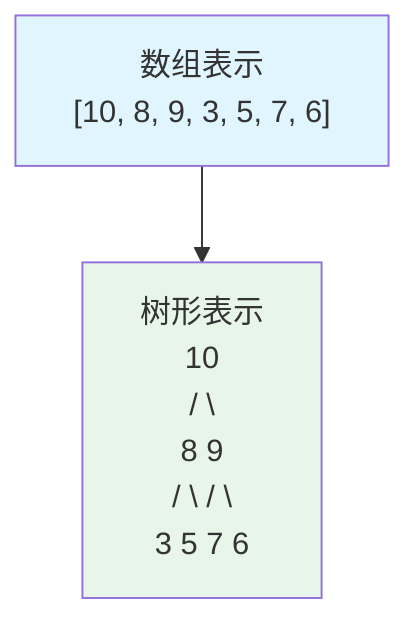
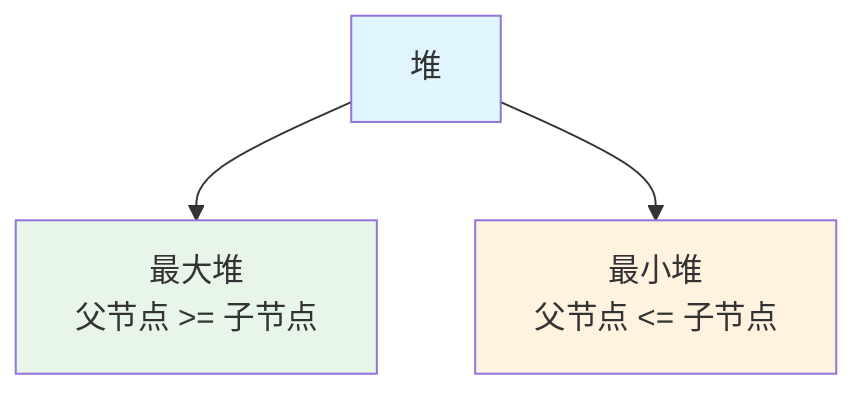
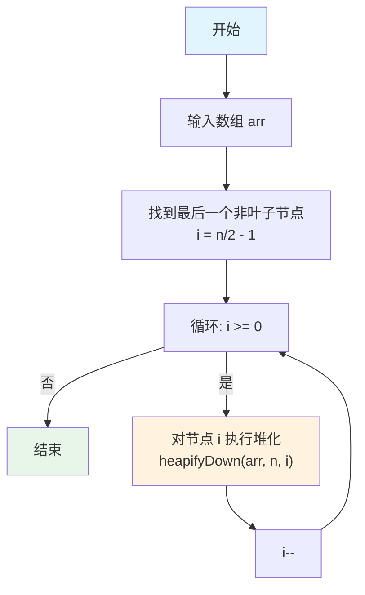
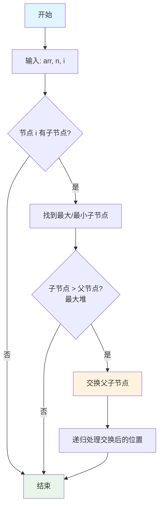
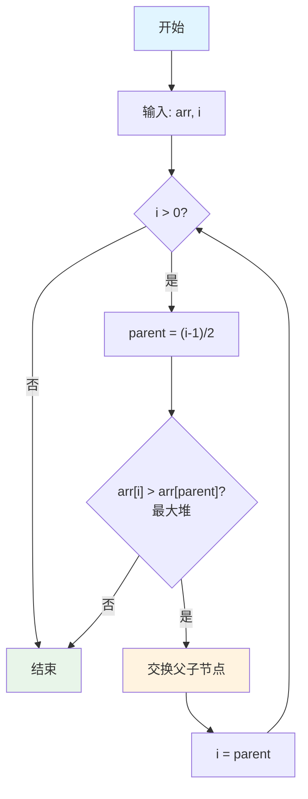
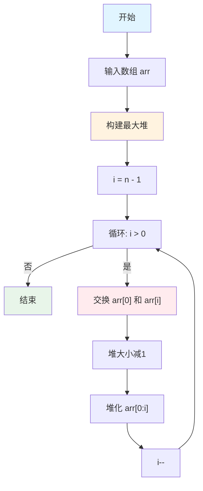

# 堆详解

本文详细介绍堆（Heap）这种数据结构，包括堆的定义、性质、操作、应用场景以及堆排序算法。

## 什么是堆

堆（Heap）是一种特殊的完全二叉树，它满足堆序性质（Heap Property）。

### 堆的定义

堆是一个完全二叉树，并且满足以下性质之一：
- **最大堆（Max Heap）**：父节点的值总是大于或等于其子节点的值
- **最小堆（Min Heap）**：父节点的值总是小于或等于其子节点的值

### 堆的性质

1. **完全二叉树**：堆是一棵完全二叉树，除了最后一层，其他层都是满的，最后一层从左到右填充
2. **堆序性质**：
   - 最大堆：`arr[parent(i)] >= arr[i]`
   - 最小堆：`arr[parent(i)] <= arr[i]`
3. **数组表示**：堆通常用数组表示，可以节省空间且访问高效

### 堆的数组表示

对于数组索引 `i` 的节点：
- **父节点索引**：`parent(i) = (i - 1) / 2`
- **左子节点索引**：`left(i) = 2*i + 1`
- **右子节点索引**：`right(i) = 2*i + 2`



### 堆的分类



### 堆的特点

- **堆顶元素**：最大堆的堆顶是最大值，最小堆的堆顶是最小值
- **部分有序**：堆只保证父节点和子节点的关系，不保证兄弟节点之间的关系
- **高效操作**：插入、删除、查找最值的时间复杂度都是 O(log n)

## 创建堆

创建堆（建堆）是将一个无序数组转换为堆的过程。有两种主要的建堆方法：

### 方法 1：自下而上建堆（Heapify Down）

从最后一个非叶子节点开始，自下而上、从右到左进行堆化。

#### 算法原理

1. 找到最后一个非叶子节点：`n/2 - 1`
2. 从该节点开始，向前遍历到根节点
3. 对每个节点执行下沉操作（Heapify Down）

#### 算法流程



#### 实现代码

```go
package main

import "fmt"

// BuildMaxHeap 构建最大堆（自下而上）
func BuildMaxHeap(arr []int) {
    n := len(arr)
    // 从最后一个非叶子节点开始，自下而上堆化
    for i := n/2 - 1; i >= 0; i-- {
        heapifyDown(arr, n, i)
    }
}

// BuildMinHeap 构建最小堆（自下而上）
func BuildMinHeap(arr []int) {
    n := len(arr)
    for i := n/2 - 1; i >= 0; i-- {
        heapifyDownMin(arr, n, i)
    }
}
```

**时间复杂度**: O(n) - 虽然看起来是 O(n log n)，但通过数学分析可以证明是 O(n)

### 方法 2：自上而下建堆（Heapify Up）

逐个插入元素，每次插入后执行上浮操作。

#### 算法原理

1. 从空堆开始
2. 逐个插入元素
3. 每次插入后，对插入的元素执行上浮操作（Heapify Up）

#### 实现代码

```go
// BuildMaxHeapTopDown 构建最大堆（自上而下）
func BuildMaxHeapTopDown(arr []int) []int {
    heap := make([]int, 0)
    for _, val := range arr {
        heap = append(heap, val)
        heapifyUp(heap, len(heap)-1)
    }
    return heap
}
```

**时间复杂度**: O(n log n)

### 两种方法对比

| 特性 | 自下而上 | 自上而下 |
|------|---------|---------|
| 时间复杂度 | O(n) | O(n log n) |
| 实现复杂度 | 较简单 | 较复杂 |
| 适用场景 | 已知所有元素 | 动态插入 |

**推荐使用自下而上建堆**，因为时间复杂度更低。

## 调整堆

调整堆是维护堆性质的核心操作，包括两种基本操作：**上浮（Heapify Up）**和**下沉（Heapify Down）**。

### 下沉操作（Heapify Down）

下沉操作用于修复违反堆性质的节点，通常用于删除操作或建堆过程。

#### 算法原理

1. 比较当前节点与其子节点
2. 如果不满足堆性质，与较大的子节点（最大堆）或较小的子节点（最小堆）交换
3. 递归或迭代处理交换后的位置

#### 算法流程



#### 实现代码

```go
// heapifyDown 下沉操作（最大堆）
func heapifyDown(arr []int, n, i int) {
    largest := i     // 假设当前节点最大
    left := 2*i + 1  // 左子节点索引
    right := 2*i + 2 // 右子节点索引
    
    // 如果左子节点存在且大于当前节点
    if left < n && arr[left] > arr[largest] {
        largest = left
    }
    
    // 如果右子节点存在且大于当前节点
    if right < n && arr[right] > arr[largest] {
        largest = right
    }
    
    // 如果最大值不是当前节点，交换并继续下沉
    if largest != i {
        arr[i], arr[largest] = arr[largest], arr[i]
        heapifyDown(arr, n, largest)
    }
}

// heapifyDownMin 下沉操作（最小堆）
func heapifyDownMin(arr []int, n, i int) {
    smallest := i
    left := 2*i + 1
    right := 2*i + 2
    
    if left < n && arr[left] < arr[smallest] {
        smallest = left
    }
    
    if right < n && arr[right] < arr[smallest] {
        smallest = right
    }
    
    if smallest != i {
        arr[i], arr[smallest] = arr[smallest], arr[i]
        heapifyDownMin(arr, n, smallest)
    }
}

// heapifyDownIterative 下沉操作（迭代版本）
func heapifyDownIterative(arr []int, n, i int) {
    for {
        largest := i
        left := 2*i + 1
        right := 2*i + 2
        
        if left < n && arr[left] > arr[largest] {
            largest = left
        }
        
        if right < n && arr[right] > arr[largest] {
            largest = right
        }
        
        if largest == i {
            break
        }
        
        arr[i], arr[largest] = arr[largest], arr[i]
        i = largest
    }
}
```

**时间复杂度**: O(log n)  
**空间复杂度**: O(1)（迭代版本）或 O(log n)（递归版本）

### 上浮操作（Heapify Up）

上浮操作用于修复违反堆性质的节点，通常用于插入操作。

#### 算法原理

1. 比较当前节点与其父节点
2. 如果不满足堆性质，与父节点交换
3. 继续向上比较，直到满足堆性质或到达根节点

#### 算法流程



#### 实现代码

```go
// heapifyUp 上浮操作（最大堆）
func heapifyUp(arr []int, i int) {
    for i > 0 {
        parent := (i - 1) / 2
        // 如果当前节点小于等于父节点，满足堆性质，退出
        if arr[i] <= arr[parent] {
            break
        }
        // 交换父子节点
        arr[i], arr[parent] = arr[parent], arr[i]
        i = parent
    }
}

// heapifyUpMin 上浮操作（最小堆）
func heapifyUpMin(arr []int, i int) {
    for i > 0 {
        parent := (i - 1) / 2
        if arr[i] >= arr[parent] {
            break
        }
        arr[i], arr[parent] = arr[parent], arr[i]
        i = parent
    }
}
```

**时间复杂度**: O(log n)  
**空间复杂度**: O(1)

## 堆的基本操作

### 插入元素

```go
// InsertMaxHeap 向最大堆插入元素
func InsertMaxHeap(heap *[]int, val int) {
    *heap = append(*heap, val)
    heapifyUp(*heap, len(*heap)-1)
}
```

### 删除堆顶元素

```go
// ExtractMax 从最大堆删除并返回最大值
func ExtractMax(heap *[]int) (int, bool) {
    if len(*heap) == 0 {
        return 0, false
    }
    
    max := (*heap)[0]
    n := len(*heap)
    
    // 将最后一个元素移到堆顶
    (*heap)[0] = (*heap)[n-1]
    *heap = (*heap)[:n-1]
    
    // 下沉操作
    if len(*heap) > 0 {
        heapifyDown(*heap, len(*heap), 0)
    }
    
    return max, true
}
```

### 获取堆顶元素

```go
// Peek 获取堆顶元素（不删除）
func Peek(heap []int) (int, bool) {
    if len(heap) == 0 {
        return 0, false
    }
    return heap[0], true
}
```

### 完整示例

```go
func main() {
    // 构建最大堆
    arr := []int{4, 10, 3, 5, 1, 8, 7}
    fmt.Println("原始数组:", arr)
    
    BuildMaxHeap(arr)
    fmt.Println("构建后的堆:", arr)
    // 输出: [10 5 8 4 1 3 7]
    
    // 插入元素
    InsertMaxHeap(&arr, 15)
    fmt.Println("插入15后:", arr)
    
    // 获取最大值
    max, _ := Peek(arr)
    fmt.Println("堆顶元素:", max)
    
    // 删除最大值
    max, _ = ExtractMax(&arr)
    fmt.Println("删除的最大值:", max)
    fmt.Println("删除后的堆:", arr)
}
```

## 堆排序

堆排序（Heap Sort）是利用堆这种数据结构设计的一种排序算法。

### 算法原理

1. **建堆**：将待排序数组构建成最大堆
2. **排序**：重复以下步骤直到堆为空：
   - 将堆顶元素（最大值）与数组末尾元素交换
   - 减小堆的大小
   - 对新的堆顶元素执行下沉操作

### 算法流程



### 实现代码

```go
// HeapSort 堆排序
func HeapSort(arr []int) {
    n := len(arr)
    if n <= 1 {
        return
    }
    
    // 第一步：构建最大堆
    BuildMaxHeap(arr)
    
    // 第二步：依次取出堆顶元素
    for i := n - 1; i > 0; i-- {
        // 将堆顶元素（最大值）移到末尾
        arr[0], arr[i] = arr[i], arr[0]
        
        // 重新堆化剩余元素（堆大小减1）
        heapifyDown(arr, i, 0)
    }
}

func main() {
    arr := []int{64, 34, 25, 12, 22, 11, 90}
    fmt.Println("排序前:", arr)
    HeapSort(arr)
    fmt.Println("排序后:", arr)
    // 输出: 排序前: [64 34 25 12 22 11 90]
    //      排序后: [11 12 22 25 34 64 90]
}
```

### 复杂度分析

- **时间复杂度**: 
  - 建堆: O(n)
  - 排序: O(n log n)
  - 总体: O(n log n)
- **空间复杂度**: O(1) - 原地排序
- **稳定性**: 不稳定排序

### 堆排序的特点

**优点**：
- 时间复杂度稳定为 O(n log n)
- 空间复杂度为 O(1)
- 不需要额外的辅助空间

**缺点**：
- 不稳定排序
- 对缓存不友好（访问模式不连续）
- 实际性能通常不如快速排序

## 优先队列

优先队列（Priority Queue）是堆的一个重要应用，它支持以下操作：
- `Insert(x)`: 插入元素
- `ExtractMax()` / `ExtractMin()`: 删除并返回最大/最小元素
- `Peek()`: 查看最大/最小元素（不删除）

### 实现优先队列

```go
// PriorityQueue 优先队列（最大堆实现）
type PriorityQueue struct {
    heap []int
}

// NewPriorityQueue 创建新的优先队列
func NewPriorityQueue() *PriorityQueue {
    return &PriorityQueue{heap: make([]int, 0)}
}

// Insert 插入元素
func (pq *PriorityQueue) Insert(val int) {
    pq.heap = append(pq.heap, val)
    heapifyUp(pq.heap, len(pq.heap)-1)
}

// ExtractMax 删除并返回最大值
func (pq *PriorityQueue) ExtractMax() (int, bool) {
    if len(pq.heap) == 0 {
        return 0, false
    }
    
    max := pq.heap[0]
    n := len(pq.heap)
    
    pq.heap[0] = pq.heap[n-1]
    pq.heap = pq.heap[:n-1]
    
    if len(pq.heap) > 0 {
        heapifyDown(pq.heap, len(pq.heap), 0)
    }
    
    return max, true
}

// Peek 查看最大值（不删除）
func (pq *PriorityQueue) Peek() (int, bool) {
    if len(pq.heap) == 0 {
        return 0, false
    }
    return pq.heap[0], true
}

// Size 返回队列大小
func (pq *PriorityQueue) Size() int {
    return len(pq.heap)
}

// IsEmpty 判断队列是否为空
func (pq *PriorityQueue) IsEmpty() bool {
    return len(pq.heap) == 0
}
```

## 堆的应用场景

### 1. 优先队列

- **任务调度**：按优先级调度任务
- **事件驱动系统**：按时间顺序处理事件
- **Dijkstra 算法**：用于最短路径算法

### 2. Top K 问题

找出数组中前 K 个最大或最小的元素。

```go
// FindTopK 找出前K个最大元素
func FindTopK(arr []int, k int) []int {
    if k <= 0 || k > len(arr) {
        return nil
    }
    
    // 使用最小堆，保持堆大小为K
    heap := make([]int, 0, k)
    
    for _, val := range arr {
        if len(heap) < k {
            heap = append(heap, val)
            heapifyUpMin(heap, len(heap)-1)
        } else if val > heap[0] {
            // 如果当前元素大于堆顶，替换堆顶
            heap[0] = val
            heapifyDownMin(heap, len(heap), 0)
        }
    }
    
    return heap
}
```

### 3. 堆排序

用于排序算法，时间复杂度 O(n log n)。

### 4. 中位数查找

使用两个堆（最大堆和最小堆）来维护中位数。

### 5. 合并K个有序链表

使用最小堆来高效合并多个有序链表。

```go
// ListNode 链表节点
type ListNode struct {
    Val  int
    Next *ListNode
}

// MergeKLists 合并K个有序链表
func MergeKLists(lists []*ListNode) *ListNode {
    if len(lists) == 0 {
        return nil
    }
    
    // 使用最小堆
    pq := NewMinHeapPriorityQueue()
    
    // 将所有链表的头节点加入堆
    for _, list := range lists {
        if list != nil {
            pq.Insert(list.Val, list)
        }
    }
    
    dummy := &ListNode{}
    curr := dummy
    
    for !pq.IsEmpty() {
        val, node, _ := pq.ExtractMin()
        curr.Next = node
        curr = curr.Next
        
        if node.Next != nil {
            pq.Insert(node.Next.Val, node.Next)
        }
    }
    
    return dummy.Next
}
```

## 复杂度总结

| 操作 | 时间复杂度 | 空间复杂度 |
|------|-----------|-----------|
| 建堆 | O(n) | O(1) |
| 插入 | O(log n) | O(1) |
| 删除堆顶 | O(log n) | O(1) |
| 查找堆顶 | O(1) | O(1) |
| 堆排序 | O(n log n) | O(1) |

## 堆 vs 其他数据结构

### 堆 vs 二叉搜索树

| 特性 | 堆 | 二叉搜索树 |
|------|-----|-----------|
| 查找最值 | O(1) | O(log n) |
| 查找任意值 | O(n) | O(log n) |
| 插入 | O(log n) | O(log n) |
| 删除 | O(log n) | O(log n) |
| 有序遍历 | 不支持 | 支持 |

### 堆 vs 排序数组

| 特性 | 堆 | 排序数组 |
|------|-----|---------|
| 查找最值 | O(1) | O(1) |
| 插入 | O(log n) | O(n) |
| 删除 | O(log n) | O(n) |
| 空间 | O(n) | O(n) |

## 总结

1. **堆的定义**：完全二叉树 + 堆序性质
2. **两种堆**：最大堆和最小堆
3. **核心操作**：上浮和下沉，时间复杂度都是 O(log n)
4. **建堆方法**：自下而上（O(n)）和自上而下（O(n log n)）
5. **堆排序**：时间复杂度 O(n log n)，空间复杂度 O(1)
6. **应用场景**：优先队列、Top K 问题、任务调度等

堆是一种非常重要的数据结构，在算法和实际应用中都有广泛的使用。掌握堆的实现和应用对于解决很多问题都非常有帮助！
