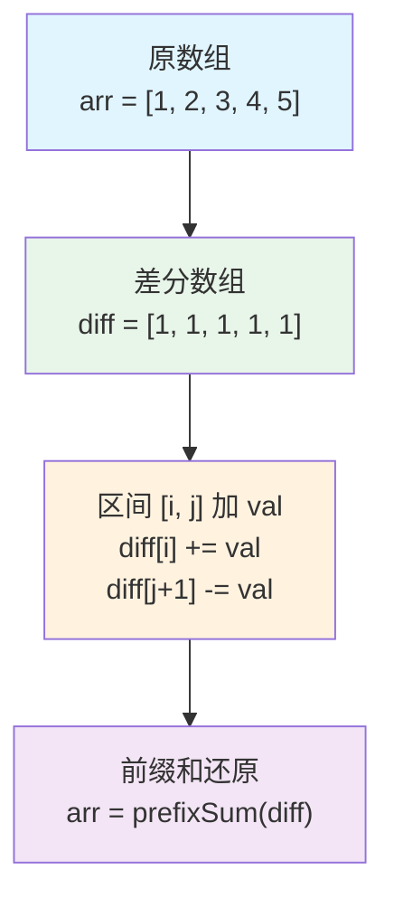
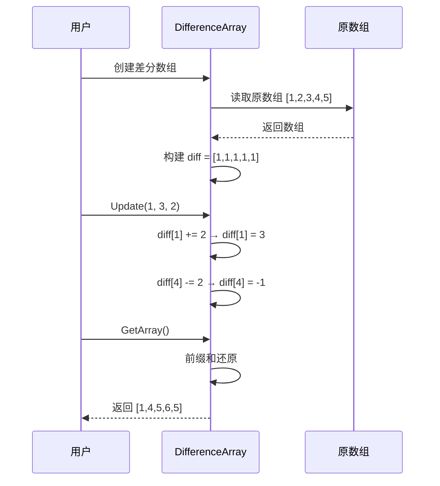

# 差分数组详解

差分数组（Difference Array）是前缀和数组的逆操作，用于快速对数组的某个区间进行增量更新。

## 概念

差分数组是前缀和数组的逆操作，用于快速对数组的某个区间进行增量更新。

## 工作原理



### 核心思想

- **差分数组**: `diff[i] = arr[i] - arr[i-1]`（i > 0），`diff[0] = arr[0]`
- **区间更新**: 对区间 `[l, r]` 加 `val`，只需更新 `diff[l] += val` 和 `diff[r+1] -= val`
- **还原数组**: 对差分数组求前缀和即可得到原数组

## 实现示例

### Go 语言实现

```go
package main

import "fmt"

// DifferenceArray 差分数组结构
type DifferenceArray struct {
    diff []int // 差分数组
    n    int   // 数组长度
}

// NewDifferenceArray 创建差分数组
func NewDifferenceArray(arr []int) *DifferenceArray {
    n := len(arr)
    diff := make([]int, n)
    
    // 构建差分数组
    diff[0] = arr[0]
    for i := 1; i < n; i++ {
        diff[i] = arr[i] - arr[i-1]
    }
    
    return &DifferenceArray{
        diff: diff,
        n:    n,
    }
}

// Update 对区间 [l, r] 的所有元素加 val（闭区间）
func (da *DifferenceArray) Update(l, r, val int) {
    if l < 0 || r >= da.n || l > r {
        return
    }
    
    // 差分数组的核心操作
    da.diff[l] += val
    if r+1 < da.n {
        da.diff[r+1] -= val
    }
}

// GetArray 通过前缀和还原原数组
func (da *DifferenceArray) GetArray() []int {
    arr := make([]int, da.n)
    arr[0] = da.diff[0]
    
    // 对差分数组求前缀和
    for i := 1; i < da.n; i++ {
        arr[i] = arr[i-1] + da.diff[i]
    }
    
    return arr
}

// GetValue 获取指定位置的值
func (da *DifferenceArray) GetValue(index int) int {
    if index < 0 || index >= da.n {
        return 0
    }
    
    // 计算前缀和
    val := da.diff[0]
    for i := 1; i <= index; i++ {
        val += da.diff[i]
    }
    
    return val
}

func main() {
    // 示例：数组 [1, 2, 3, 4, 5]
    arr := []int{1, 2, 3, 4, 5}
    da := NewDifferenceArray(arr)
    
    fmt.Println("原数组:", arr)
    fmt.Println("差分数组:", da.diff)
    
    // 对区间 [1, 3] 的所有元素加 2
    // 即 arr[1], arr[2], arr[3] 都加 2
    da.Update(1, 3, 2)
    fmt.Println("更新后差分数组:", da.diff)
    
    // 还原数组
    newArr := da.GetArray()
    fmt.Println("更新后数组:", newArr) // 输出: [1, 4, 5, 6, 5]
    
    // 再次对区间 [0, 2] 加 1
    da.Update(0, 2, 1)
    finalArr := da.GetArray()
    fmt.Println("最终数组:", finalArr) // 输出: [2, 5, 6, 6, 5]
}
```

### 更新流程示例



## 应用场景

1. **区间更新问题**: 多次对数组的某个区间进行增量更新
2. **航班预订统计**: 记录每个航班的预订数量变化
3. **会议室安排**: 统计每个时间段的会议数量

## 复杂度分析

- **空间复杂度**: O(n)
- **构建时间复杂度**: O(n)
- **更新时间复杂度**: O(1)
- **查询时间复杂度**: O(n)（需要前缀和还原）

