# 常见排序算法详解

本文详细介绍常见的排序算法，包括算法原理、实现代码、复杂度分析和应用场景。

## 排序算法分类

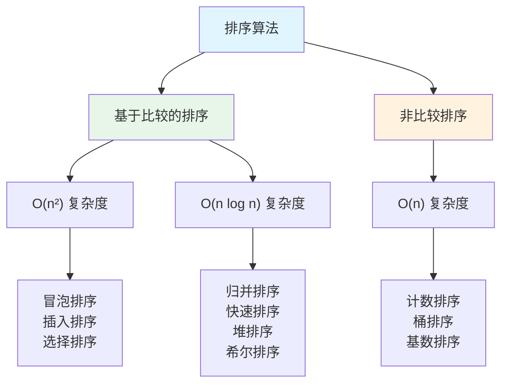

# 冒泡排序

## 算法原理

冒泡排序是一种简单的排序算法，它重复地遍历要排序的数列，一次比较两个元素，如果它们的顺序错误就把它们交换过来。

## 算法流程

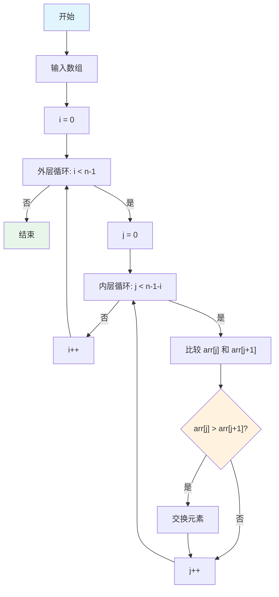

## 实现代码

```go
package main

import "fmt"

// BubbleSort 冒泡排序
func BubbleSort(arr []int) {
    n := len(arr)
    if n <= 1 {
        return
    }
    
    // 外层循环控制排序轮数
    for i := 0; i < n-1; i++ {
        swapped := false // 优化：如果本轮没有交换，说明已有序
        
        // 内层循环进行相邻元素比较
        for j := 0; j < n-1-i; j++ {
            if arr[j] > arr[j+1] {
                // 交换元素
                arr[j], arr[j+1] = arr[j+1], arr[j]
                swapped = true
            }
        }
        
        // 如果本轮没有交换，提前结束
        if !swapped {
            break
        }
    }
}

func main() {
    arr := []int{64, 34, 25, 12, 22, 11, 90}
    fmt.Println("排序前:", arr)
    BubbleSort(arr)
    fmt.Println("排序后:", arr)
    // 输出: 排序前: [64 34 25 12 22 11 90]
    //      排序后: [11 12 22 25 34 64 90]
}
```

## 复杂度分析

- **时间复杂度**: 
  - 最好情况: O(n) - 数组已有序
  - 平均情况: O(n²)
  - 最坏情况: O(n²) - 数组逆序
- **空间复杂度**: O(1) - 原地排序
- **稳定性**: 稳定排序

# 插入排序

## 算法原理

插入排序通过构建有序序列，对于未排序数据，在已排序序列中从后向前扫描，找到相应位置并插入。

## 算法流程

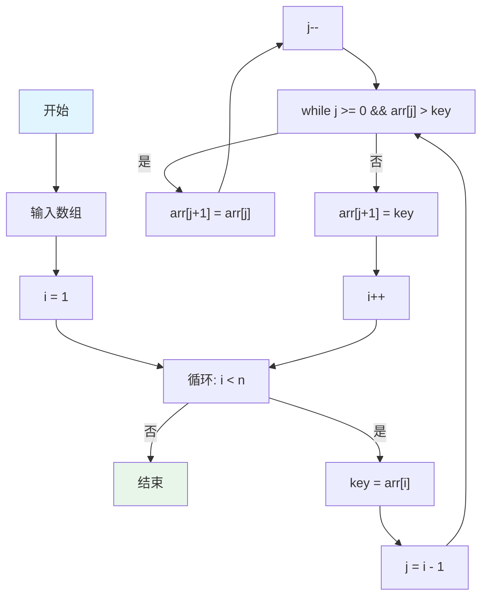

## 实现代码

```go
package main

import "fmt"

// InsertionSort 插入排序
func InsertionSort(arr []int) {
    n := len(arr)
    if n <= 1 {
        return
    }
    
    // 从第二个元素开始，逐个插入到已排序序列中
    for i := 1; i < n; i++ {
        key := arr[i] // 当前要插入的元素
        j := i - 1    // 已排序序列的最后一个索引
        
        // 将大于 key 的元素向后移动
        for j >= 0 && arr[j] > key {
            arr[j+1] = arr[j]
            j--
        }
        
        // 插入 key 到正确位置
        arr[j+1] = key
    }
}

func main() {
    arr := []int{64, 34, 25, 12, 22, 11, 90}
    fmt.Println("排序前:", arr)
    InsertionSort(arr)
    fmt.Println("排序后:", arr)
}
```

## 复杂度分析

- **时间复杂度**: 
  - 最好情况: O(n) - 数组已有序
  - 平均情况: O(n²)
  - 最坏情况: O(n²) - 数组逆序
- **空间复杂度**: O(1) - 原地排序
- **稳定性**: 稳定排序

## 应用场景

- 小规模数据排序
- 部分有序数组排序
- 作为其他排序算法的子过程（如快速排序的优化）

# 希尔排序

## 算法原理

希尔排序是插入排序的改进版本，通过将数组分成多个子序列，分别进行插入排序，然后逐步缩小间隔，最终完成排序。

## 算法流程

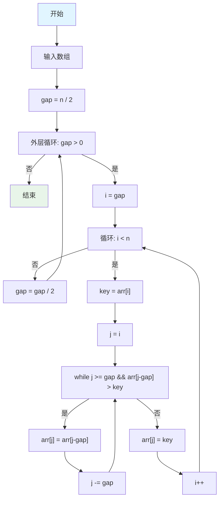

## 实现代码

```go
package main

import "fmt"

// ShellSort 希尔排序
func ShellSort(arr []int) {
    n := len(arr)
    if n <= 1 {
        return
    }
    
    // 初始间隔为数组长度的一半，逐步缩小
    for gap := n / 2; gap > 0; gap /= 2 {
        // 对每个子序列进行插入排序
        for i := gap; i < n; i++ {
            key := arr[i]
            j := i
            
            // 在子序列中进行插入排序
            for j >= gap && arr[j-gap] > key {
                arr[j] = arr[j-gap]
                j -= gap
            }
            
            arr[j] = key
        }
    }
}

func main() {
    arr := []int{64, 34, 25, 12, 22, 11, 90, 5, 77, 33}
    fmt.Println("排序前:", arr)
    ShellSort(arr)
    fmt.Println("排序后:", arr)
}
```

## 复杂度分析

- **时间复杂度**: 
  - 最好情况: O(n log n)
  - 平均情况: O(n^1.3) - 取决于间隔序列
  - 最坏情况: O(n²)
- **空间复杂度**: O(1) - 原地排序
- **稳定性**: 不稳定排序

# 归并排序

## 算法原理

归并排序采用分治法，将数组分成两半，分别排序，然后合并两个有序数组。

## 算法流程

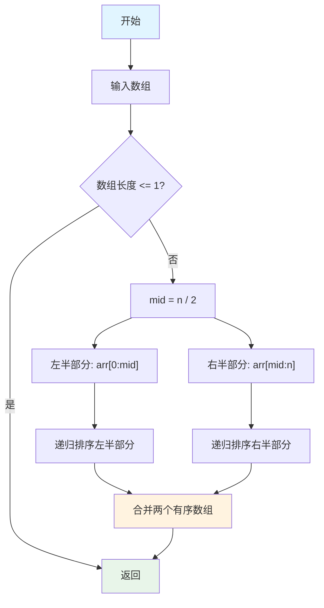

## 实现代码

```go
package main

import "fmt"

// MergeSort 归并排序
func MergeSort(arr []int) []int {
    n := len(arr)
    if n <= 1 {
        return arr
    }
    
    // 分割
    mid := n / 2
    left := MergeSort(arr[:mid])
    right := MergeSort(arr[mid:])
    
    // 合并
    return merge(left, right)
}

// merge 合并两个有序数组
func merge(left, right []int) []int {
    result := make([]int, 0, len(left)+len(right))
    i, j := 0, 0
    
    // 比较两个数组的元素，将较小的放入结果
    for i < len(left) && j < len(right) {
        if left[i] <= right[j] {
            result = append(result, left[i])
            i++
        } else {
            result = append(result, right[j])
            j++
        }
    }
    
    // 将剩余元素添加到结果
    result = append(result, left[i:]...)
    result = append(result, right[j:]...)
    
    return result
}

func main() {
    arr := []int{64, 34, 25, 12, 22, 11, 90}
    fmt.Println("排序前:", arr)
    sorted := MergeSort(arr)
    fmt.Println("排序后:", sorted)
}
```

## 复杂度分析

- **时间复杂度**: 
  - 最好/平均/最坏情况: O(n log n)
- **空间复杂度**: O(n) - 需要额外空间存储临时数组
- **稳定性**: 稳定排序

## 应用场景

- 需要稳定排序的场景
- 外部排序（处理大文件）
- 链表排序

# 堆排序

## 算法原理

堆排序利用堆这种数据结构，将数组构建成最大堆（或最小堆），然后依次取出堆顶元素。

## 算法流程

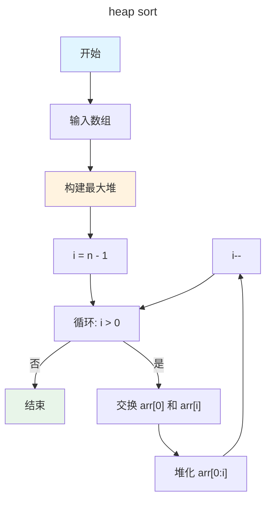

## 实现代码

```go
package main

import "fmt"

// HeapSort 堆排序
func HeapSort(arr []int) {
    n := len(arr)
    if n <= 1 {
        return
    }
    
    // 构建最大堆
    for i := n/2 - 1; i >= 0; i-- {
        heapify(arr, n, i)
    }
    
    // 依次取出堆顶元素
    for i := n - 1; i > 0; i-- {
        // 将堆顶元素（最大值）移到末尾
        arr[0], arr[i] = arr[i], arr[0]
        
        // 重新堆化剩余元素
        heapify(arr, i, 0)
    }
}

// heapify 堆化函数，维护最大堆性质
func heapify(arr []int, n, i int) {
    largest := i     // 假设当前节点最大
    left := 2*i + 1  // 左子节点
    right := 2*i + 2 // 右子节点
    
    // 如果左子节点存在且大于当前节点
    if left < n && arr[left] > arr[largest] {
        largest = left
    }
    
    // 如果右子节点存在且大于当前节点
    if right < n && arr[right] > arr[largest] {
        largest = right
    }
    
    // 如果最大值不是当前节点，交换并继续堆化
    if largest != i {
        arr[i], arr[largest] = arr[largest], arr[i]
        heapify(arr, n, largest)
    }
}

func main() {
    arr := []int{64, 34, 25, 12, 22, 11, 90}
    fmt.Println("排序前:", arr)
    HeapSort(arr)
    fmt.Println("排序后:", arr)
}
```

## 复杂度分析

- **时间复杂度**: 
  - 最好/平均/最坏情况: O(n log n)
- **空间复杂度**: O(1) - 原地排序
- **稳定性**: 不稳定排序

# 计数排序

## 算法原理

计数排序是一种非比较排序算法，适用于数据范围较小的整数排序。它统计每个元素出现的次数，然后根据统计结果输出排序后的序列。

## 算法流程

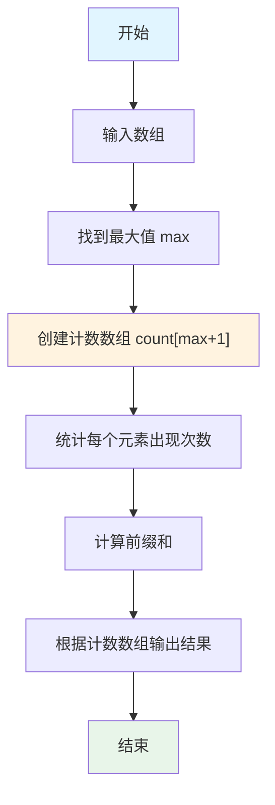

## 实现代码

```go
package main

import "fmt"

// CountingSort 计数排序
func CountingSort(arr []int) []int {
    n := len(arr)
    if n <= 1 {
        return arr
    }
    
    // 找到最大值
    max := arr[0]
    for i := 1; i < n; i++ {
        if arr[i] > max {
            max = arr[i]
        }
    }
    
    // 创建计数数组
    count := make([]int, max+1)
    
    // 统计每个元素出现次数
    for i := 0; i < n; i++ {
        count[arr[i]]++
    }
    
    // 计算前缀和（每个元素在输出数组中的位置）
    for i := 1; i <= max; i++ {
        count[i] += count[i-1]
    }
    
    // 构建输出数组
    output := make([]int, n)
    for i := n - 1; i >= 0; i-- {
        output[count[arr[i]]-1] = arr[i]
        count[arr[i]]--
    }
    
    return output
}

func main() {
    arr := []int{4, 2, 2, 8, 3, 3, 1}
    fmt.Println("排序前:", arr)
    sorted := CountingSort(arr)
    fmt.Println("排序后:", sorted)
    // 输出: 排序前: [4 2 2 8 3 3 1]
    //      排序后: [1 2 2 3 3 4 8]
}
```

## 复杂度分析

- **时间复杂度**: O(n + k)，其中 k 是数据范围
- **空间复杂度**: O(k) - 需要计数数组
- **稳定性**: 稳定排序（通过从后往前遍历保证）

## 应用场景

- 数据范围较小的整数排序
- 作为基数排序的子过程

# 快速排序

## 算法原理

快速排序采用分治法，选择一个基准元素，将数组分成两部分，小于基准的放在左边，大于基准的放在右边，然后递归排序两部分。

## 算法流程

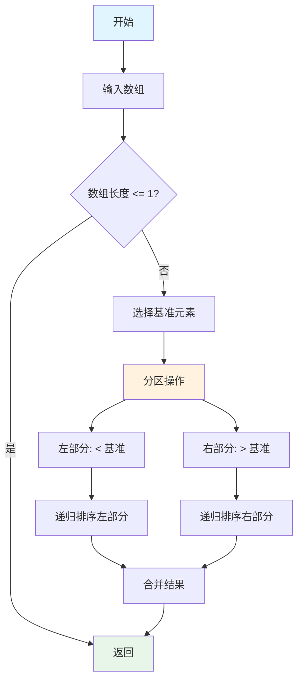

## 实现代码

```go
package main

import "fmt"

// QuickSort 快速排序
func QuickSort(arr []int, low, high int) {
    if low < high {
        // 分区操作，返回基准元素的最终位置
        pi := partition(arr, low, high)
        
        // 递归排序左部分
        QuickSort(arr, low, pi-1)
        
        // 递归排序右部分
        QuickSort(arr, pi+1, high)
    }
}

// partition 分区函数
func partition(arr []int, low, high int) int {
    pivot := arr[high] // 选择最后一个元素作为基准
    i := low - 1       // 小于基准的元素的索引
    
    for j := low; j < high; j++ {
        // 如果当前元素小于或等于基准
        if arr[j] <= pivot {
            i++
            arr[i], arr[j] = arr[j], arr[i]
        }
    }
    
    // 将基准放到正确位置
    arr[i+1], arr[high] = arr[high], arr[i+1]
    return i + 1
}

// QuickSortWrapper 快速排序包装函数
func QuickSortWrapper(arr []int) {
    QuickSort(arr, 0, len(arr)-1)
}

func main() {
    arr := []int{64, 34, 25, 12, 22, 11, 90}
    fmt.Println("排序前:", arr)
    QuickSortWrapper(arr)
    fmt.Println("排序后:", arr)
}
```

## 复杂度分析

- **时间复杂度**: 
  - 最好情况: O(n log n) - 每次分区都平衡
  - 平均情况: O(n log n)
  - 最坏情况: O(n²) - 每次分区都极不平衡
- **空间复杂度**: O(log n) - 递归调用栈
- **稳定性**: 不稳定排序

## 优化策略

- **三数取中**: 选择首、中、尾三个元素的中位数作为基准
- **小数组使用插入排序**: 当数组较小时，使用插入排序
- **三路快排**: 处理大量重复元素的情况

# 桶排序

## 算法原理

桶排序将数组分到有限数量的桶里，每个桶再个别排序（有可能再使用别的排序算法或是以递归方式继续使用桶排序进行排序）。

## 算法流程

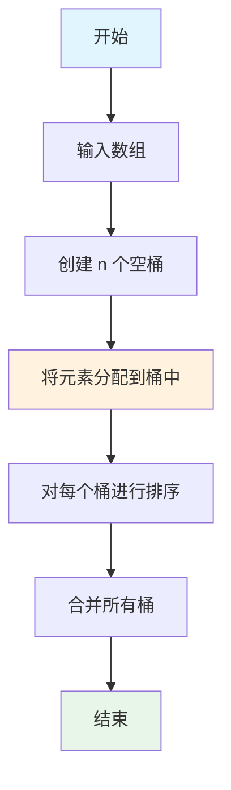

## 实现代码

```go
package main

import (
    "fmt"
    "sort"
)

// BucketSort 桶排序
func BucketSort(arr []int, bucketCount int) []int {
    n := len(arr)
    if n <= 1 {
        return arr
    }
    
    // 找到最大值和最小值
    min, max := arr[0], arr[0]
    for i := 1; i < n; i++ {
        if arr[i] < min {
            min = arr[i]
        }
        if arr[i] > max {
            max = arr[i]
        }
    }
    
    // 创建桶
    buckets := make([][]int, bucketCount)
    for i := range buckets {
        buckets[i] = make([]int, 0)
    }
    
    // 将元素分配到桶中
    bucketSize := float64(max-min+1) / float64(bucketCount)
    for i := 0; i < n; i++ {
        bucketIndex := int(float64(arr[i]-min) / bucketSize)
        if bucketIndex >= bucketCount {
            bucketIndex = bucketCount - 1
        }
        buckets[bucketIndex] = append(buckets[bucketIndex], arr[i])
    }
    
    // 对每个桶进行排序
    for i := 0; i < bucketCount; i++ {
        sort.Ints(buckets[i])
    }
    
    // 合并所有桶
    result := make([]int, 0, n)
    for i := 0; i < bucketCount; i++ {
        result = append(result, buckets[i]...)
    }
    
    return result
}

func main() {
    arr := []int{64, 34, 25, 12, 22, 11, 90, 5, 77, 33}
    fmt.Println("排序前:", arr)
    sorted := BucketSort(arr, 5)
    fmt.Println("排序后:", sorted)
}
```

## 复杂度分析

- **时间复杂度**: 
  - 最好情况: O(n + k) - k 是桶的数量
  - 平均情况: O(n + k)
  - 最坏情况: O(n²) - 所有元素在一个桶中
- **空间复杂度**: O(n + k)
- **稳定性**: 稳定排序（取决于桶内排序算法）

## 应用场景

- 数据分布均匀的浮点数排序
- 外部排序
- 作为基数排序的基础

# 基数排序

## 算法原理

基数排序是一种非比较排序算法，按照低位先排序，然后收集；再按照高位排序，然后再收集；依次类推，直到最高位。有时候有些属性是有优先级顺序的，先按低优先级排序，再按高优先级排序，最后的次序就是高优先级高的在前，高优先级相同的低优先级高的在前。

基数排序有两种实现方式：
- **LSD（Least Significant Digit）**: 从最低位开始排序
- **MSD（Most Significant Digit）**: 从最高位开始排序

## 算法流程

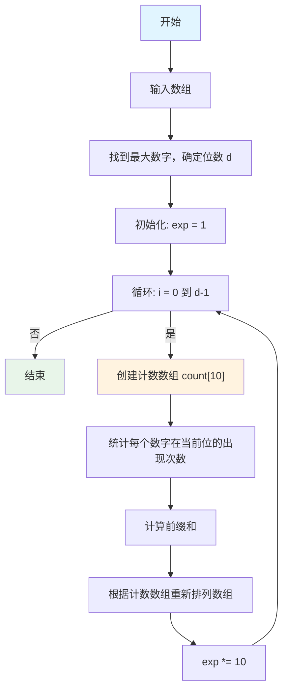

## 实现代码

```go
package main

import "fmt"

// RadixSort 基数排序（LSD 方式）
func RadixSort(arr []int) []int {
    n := len(arr)
    if n <= 1 {
        return arr
    }
    
    // 找到最大值，确定位数
    max := arr[0]
    for i := 1; i < n; i++ {
        if arr[i] > max {
            max = arr[i]
        }
    }
    
    // 从个位开始，对每一位进行计数排序
    for exp := 1; max/exp > 0; exp *= 10 {
        arr = countingSortByDigit(arr, exp)
    }
    
    return arr
}

// countingSortByDigit 根据指定位数进行计数排序
func countingSortByDigit(arr []int, exp int) []int {
    n := len(arr)
    output := make([]int, n)
    count := make([]int, 10) // 0-9 的计数数组
    
    // 统计当前位上每个数字的出现次数
    for i := 0; i < n; i++ {
        digit := (arr[i] / exp) % 10
        count[digit]++
    }
    
    // 计算前缀和，确定每个数字在输出数组中的位置
    for i := 1; i < 10; i++ {
        count[i] += count[i-1]
    }
    
    // 从后往前遍历，保证稳定性
    for i := n - 1; i >= 0; i-- {
        digit := (arr[i] / exp) % 10
        output[count[digit]-1] = arr[i]
        count[digit]--
    }
    
    return output
}

func main() {
    arr := []int{170, 45, 75, 90, 802, 24, 2, 66}
    fmt.Println("排序前:", arr)
    sorted := RadixSort(arr)
    fmt.Println("排序后:", sorted)
    // 输出: 排序前: [170 45 75 90 802 24 2 66]
    //      排序后: [2 24 45 66 75 90 170 802]
}
```

## 复杂度分析

- **时间复杂度**: O(d × (n + k))，其中 d 是位数，k 是基数（通常为 10）
  - 最好情况: O(d × n)
  - 平均情况: O(d × n)
  - 最坏情况: O(d × n)
- **空间复杂度**: O(n + k) - 需要计数数组和输出数组
- **稳定性**: 稳定排序（通过从后往前遍历保证）

## 算法示例

以数组 `[170, 45, 75, 90, 802, 24, 2, 66]` 为例：

**第1轮（个位）**:
- 按个位数字分组: `[170, 90, 802, 2]`, `[24]`, `[45, 75]`, `[66]`
- 收集: `[170, 90, 802, 2, 24, 45, 75, 66]`

**第2轮（十位）**:
- 按十位数字分组: `[2, 802]`, `[24, 45]`, `[66]`, `[170, 75]`, `[90]`
- 收集: `[2, 802, 24, 45, 66, 170, 75, 90]`

**第3轮（百位）**:
- 按百位数字分组: `[2, 24, 45, 66, 75, 90]`, `[170]`, `[802]`
- 收集: `[2, 24, 45, 66, 75, 90, 170, 802]`

## 应用场景

- **整数排序**: 特别适合非负整数排序
- **字符串排序**: 可以扩展到字符串排序（按字符排序）
- **多关键字排序**: 如按年、月、日排序日期
- **卡片排序**: 传统上用于卡片排序机
- **电话号码排序**: 按数字位排序
- **IP 地址排序**: 可以按 IP 地址的各个部分排序

## 优缺点

### 优点
- 时间复杂度为 O(d × n)，当 d 较小时效率很高
- 稳定排序
- 适合整数排序

### 缺点
- 需要额外的空间（O(n + k)）
- 只适用于整数或可以转换为整数的数据
- 当数据范围很大时，位数 d 会增加，效率下降

# 排序稳定性

## 什么是排序稳定性？

排序稳定性是指：如果两个元素的值相等，排序后它们的相对顺序是否保持不变。

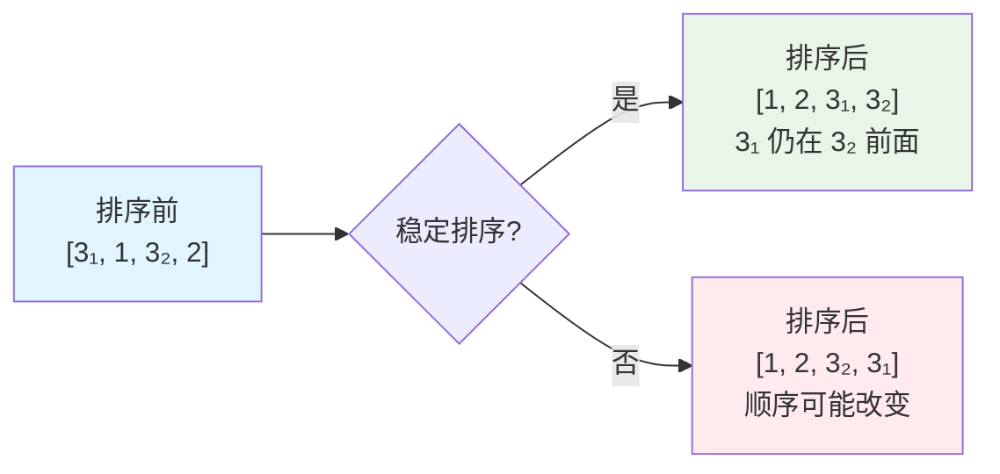

## 稳定性分类

### 稳定排序算法

- ✅ **冒泡排序**: 只交换相邻元素，相等元素不会交换
- ✅ **插入排序**: 相等元素不会移动
- ✅ **归并排序**: 合并时保持相等元素的相对顺序
- ✅ **计数排序**: 从后往前遍历保证稳定性
- ✅ **桶排序**: 取决于桶内排序算法
- ✅ **基数排序**: 从后往前遍历保证稳定性

### 不稳定排序算法

- ❌ **快速排序**: 分区时可能改变相等元素的顺序
- ❌ **堆排序**: 堆的调整可能改变相等元素的顺序
- ❌ **希尔排序**: 间隔插入可能改变顺序
- ❌ **选择排序**: 交换可能改变相等元素的顺序

## 稳定性对比表

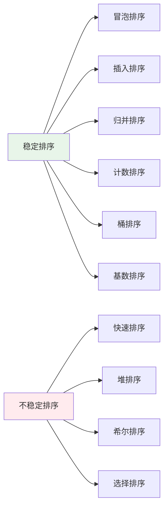

## 为什么稳定性重要？

1. **多关键字排序**: 先按次要关键字排序，再按主要关键字排序
2. **保持原有顺序**: 对于相等元素，保持它们在原数组中的相对顺序
3. **业务需求**: 某些业务场景要求稳定排序

# 算法对比总结

## 复杂度对比

| 算法 | 最好情况 | 平均情况 | 最坏情况 | 空间复杂度 | 稳定性 |
|------|---------|---------|---------|-----------|--------|
| 冒泡排序 | O(n) | O(n²) | O(n²) | O(1) | ✅ 稳定 |
| 插入排序 | O(n) | O(n²) | O(n²) | O(1) | ✅ 稳定 |
| 希尔排序 | O(n log n) | O(n^1.3) | O(n²) | O(1) | ❌ 不稳定 |
| 归并排序 | O(n log n) | O(n log n) | O(n log n) | O(n) | ✅ 稳定 |
| 堆排序 | O(n log n) | O(n log n) | O(n log n) | O(1) | ❌ 不稳定 |
| 快速排序 | O(n log n) | O(n log n) | O(n²) | O(log n) | ❌ 不稳定 |
| 计数排序 | O(n + k) | O(n + k) | O(n + k) | O(k) | ✅ 稳定 |
| 桶排序 | O(n + k) | O(n + k) | O(n²) | O(n + k) | ✅ 稳定 |
| 基数排序 | O(d × n) | O(d × n) | O(d × n) | O(n + k) | ✅ 稳定 |

## 选择建议

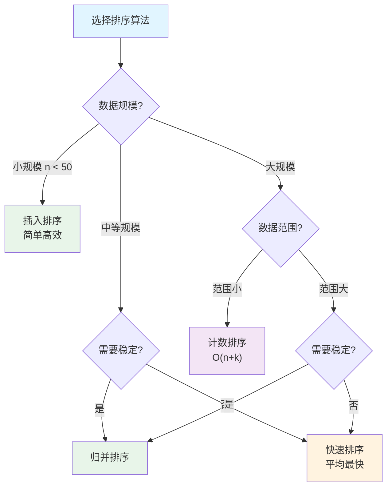

## 实际应用

- **Go 标准库**: `sort.Ints()` 使用快速排序（优化版）
- **小数组**: 使用插入排序
- **稳定需求**: 使用归并排序
- **整数排序**: 考虑计数排序、桶排序或基数排序

## 总结

1. **O(n²) 算法**: 冒泡、插入、选择 - 适合小规模数据
2. **O(n log n) 算法**: 归并、快速、堆 - 适合大规模数据
3. **O(n) 算法**: 计数、桶、基数 - 适合特定场景
4. **稳定性**: 根据业务需求选择稳定或不稳定算法
5. **实际应用**: Go 标准库的排序是经过高度优化的快速排序

选择合适的排序算法可以显著提升程序性能！
