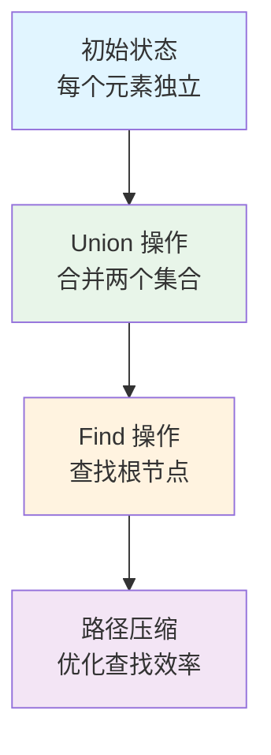
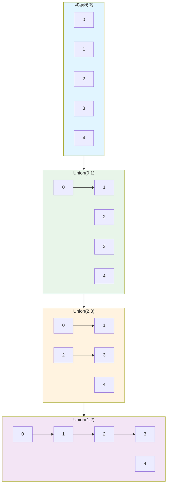
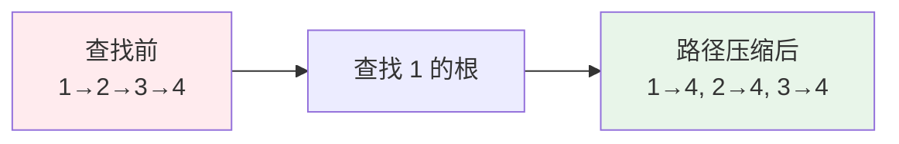
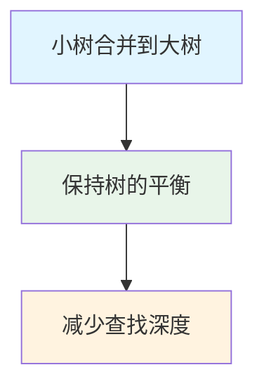

# 并查集详解

并查集（Union-Find Set）是一种树型的数据结构，用于处理一些不交集的合并及查询问题。

## 概念

并查集是一种树型的数据结构，用于处理一些不交集的合并及查询问题。

## 工作原理



### 核心思想

- **父节点数组**: `parent[i]` 表示元素 i 的父节点
- **路径压缩**: 在查找根节点时，将路径上的所有节点直接连接到根节点
- **按秩合并**: 将小树合并到大树下，保持树的平衡

## 实现示例

### Go 语言实现

```go
package main

import "fmt"

// UnionFind 并查集结构
type UnionFind struct {
    parent []int // parent[i] 表示 i 的父节点
    rank   []int // rank[i] 表示以 i 为根的树的深度（用于按秩合并）
    count  int   // 连通分量的数量
}

// NewUnionFind 创建并查集
func NewUnionFind(n int) *UnionFind {
    parent := make([]int, n)
    rank := make([]int, n)
    
    // 初始化：每个元素的父节点都是自己
    for i := 0; i < n; i++ {
        parent[i] = i
        rank[i] = 1
    }
    
    return &UnionFind{
        parent: parent,
        rank:   rank,
        count:  n, // 初始时有 n 个独立的集合
    }
}

// Find 查找元素 x 的根节点（带路径压缩）
func (uf *UnionFind) Find(x int) int {
    // 如果 x 不是根节点，递归查找并压缩路径
    if uf.parent[x] != x {
        uf.parent[x] = uf.Find(uf.parent[x]) // 路径压缩
    }
    return uf.parent[x]
}

// Union 合并元素 x 和 y 所在的集合（按秩合并）
func (uf *UnionFind) Union(x, y int) {
    rootX := uf.Find(x)
    rootY := uf.Find(y)
    
    // 如果已经在同一个集合中，直接返回
    if rootX == rootY {
        return
    }
    
    // 按秩合并：将深度小的树合并到深度大的树下
    if uf.rank[rootX] < uf.rank[rootY] {
        uf.parent[rootX] = rootY
    } else if uf.rank[rootX] > uf.rank[rootY] {
        uf.parent[rootY] = rootX
    } else {
        // 深度相等时，任意合并，并增加深度
        uf.parent[rootY] = rootX
        uf.rank[rootX]++
    }
    
    uf.count-- // 连通分量减 1
}

// Connected 判断元素 x 和 y 是否在同一个集合中
func (uf *UnionFind) Connected(x, y int) bool {
    return uf.Find(x) == uf.Find(y)
}

// Count 返回连通分量的数量
func (uf *UnionFind) Count() int {
    return uf.count
}

func main() {
    // 示例：有 5 个元素 0, 1, 2, 3, 4
    uf := NewUnionFind(5)
    
    fmt.Println("初始状态:")
    fmt.Printf("连通分量数量: %d\n", uf.Count()) // 输出: 5
    
    // 合并 0 和 1
    uf.Union(0, 1)
    fmt.Println("\n合并 0 和 1 后:")
    fmt.Printf("0 和 1 是否连通: %v\n", uf.Connected(0, 1)) // 输出: true
    fmt.Printf("连通分量数量: %d\n", uf.Count())              // 输出: 4
    
    // 合并 2 和 3
    uf.Union(2, 3)
    fmt.Println("\n合并 2 和 3 后:")
    fmt.Printf("2 和 3 是否连通: %v\n", uf.Connected(2, 3)) // 输出: true
    fmt.Printf("连通分量数量: %d\n", uf.Count())              // 输出: 3
    
    // 合并 1 和 2（间接合并了 0, 1, 2, 3）
    uf.Union(1, 2)
    fmt.Println("\n合并 1 和 2 后:")
    fmt.Printf("0 和 3 是否连通: %v\n", uf.Connected(0, 3)) // 输出: true
    fmt.Printf("连通分量数量: %d\n", uf.Count())              // 输出: 2
    
    // 4 仍然是独立的
    fmt.Printf("4 是否独立: %v\n", !uf.Connected(0, 4) && !uf.Connected(2, 4)) // 输出: true
}
```

### 合并过程示例



## 优化技巧

### 1. 路径压缩



### 2. 按秩合并



## 应用场景

1. **连通性问题**: 判断图中两个节点是否连通
2. **朋友圈问题**: 找出有多少个独立的朋友圈
3. **岛屿数量**: 计算二维矩阵中的连通区域数量
4. **最小生成树**: Kruskal 算法中使用并查集

## 复杂度分析

- **空间复杂度**: O(n)
- **初始化时间复杂度**: O(n)
- **Find 操作（带路径压缩）**: 平均 O(α(n))，其中 α 是阿克曼函数的反函数，实际应用中接近 O(1)
- **Union 操作（按秩合并）**: 平均 O(α(n))

## 完整应用示例：朋友圈问题

```go
package main

import "fmt"

// 问题：有 n 个人，给出 m 对朋友关系，问有多少个朋友圈？

func friendCircles(n int, relations [][]int) int {
    uf := NewUnionFind(n)
    
    // 合并所有朋友关系
    for _, relation := range relations {
        uf.Union(relation[0], relation[1])
    }
    
    // 返回连通分量的数量，即朋友圈的数量
    return uf.Count()
}

func main() {
    // 5 个人，朋友关系：0-1, 1-2, 3-4
    // 朋友圈：{0,1,2} 和 {3,4}，共 2 个
    relations := [][]int{
        {0, 1},
        {1, 2},
        {3, 4},
    }
    
    circles := friendCircles(5, relations)
    fmt.Printf("朋友圈数量: %d\n", circles) // 输出: 2
}
```

