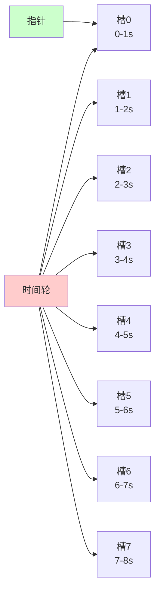
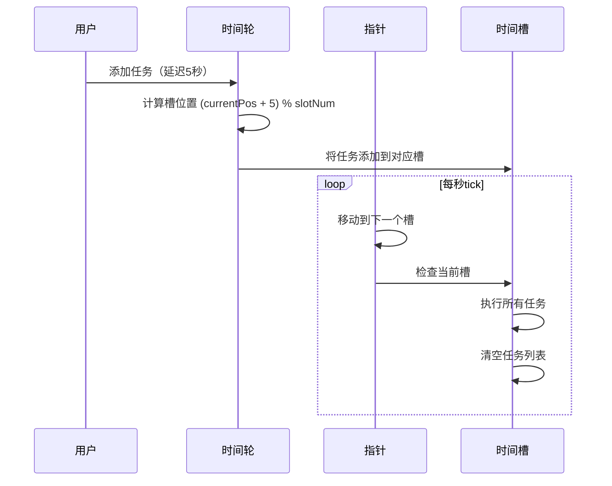
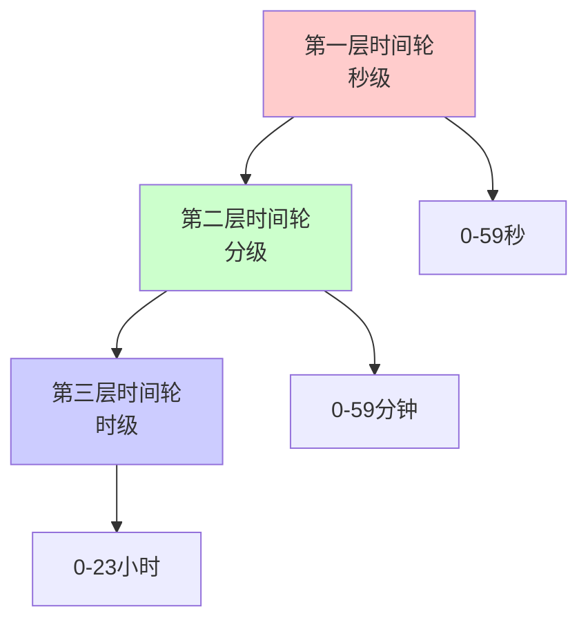
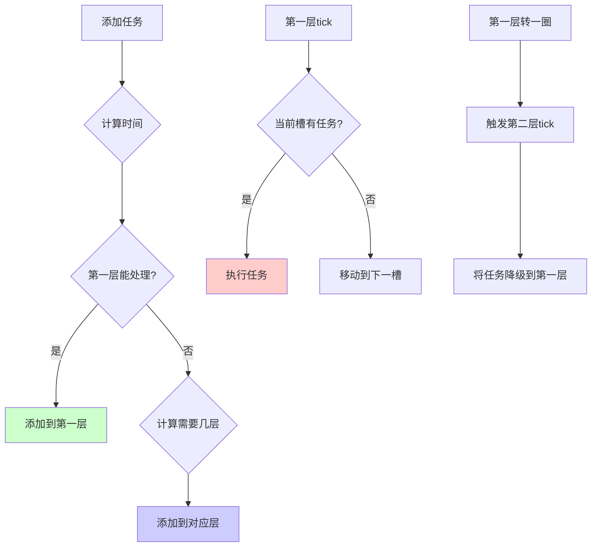
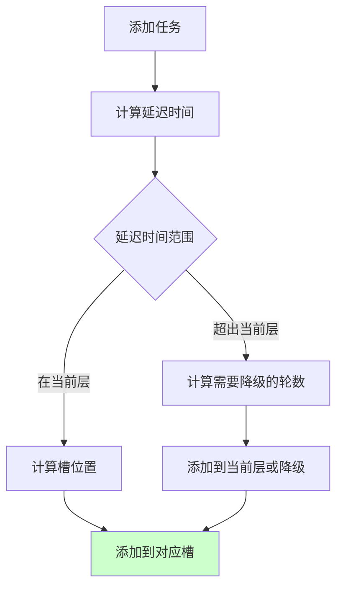
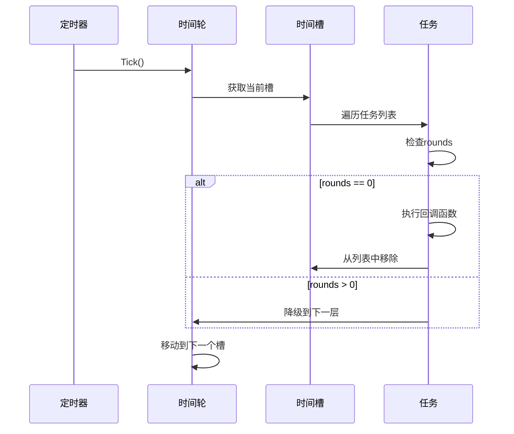
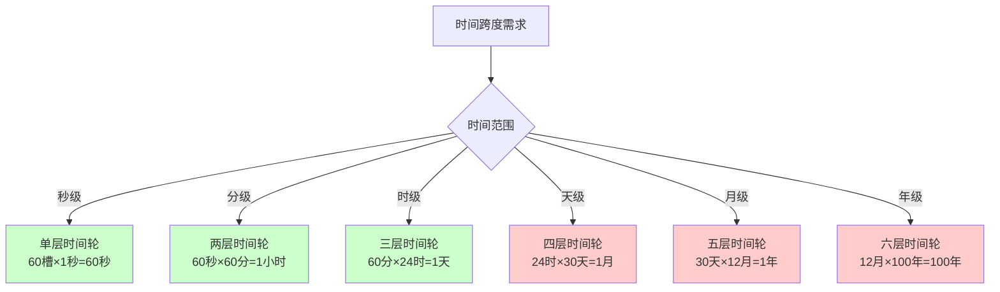
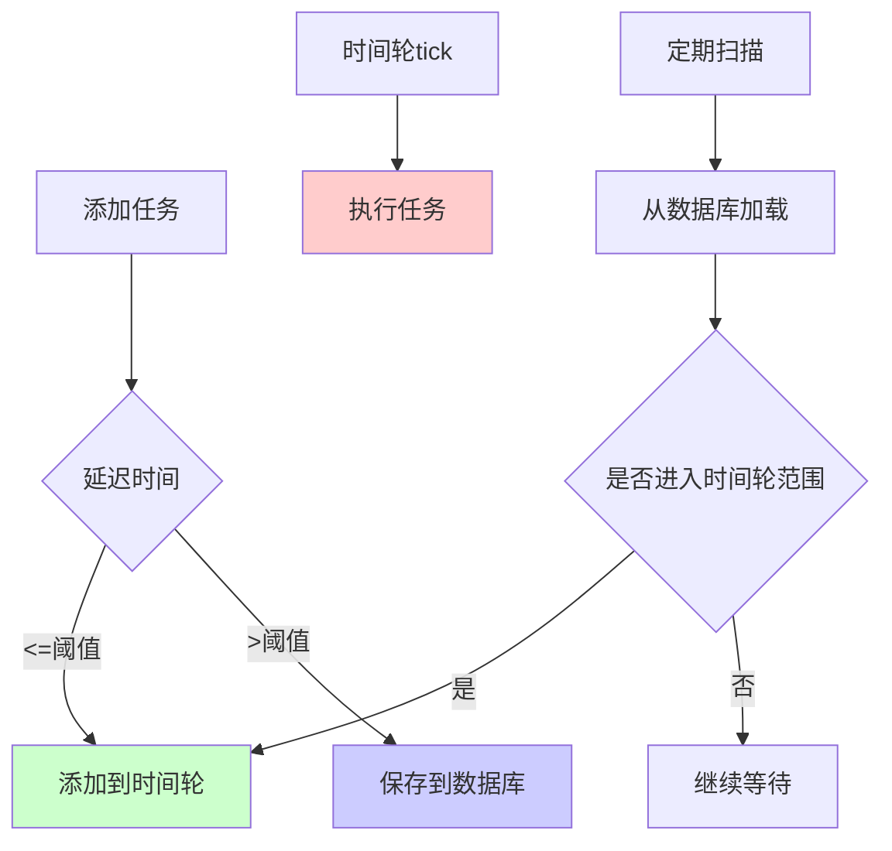
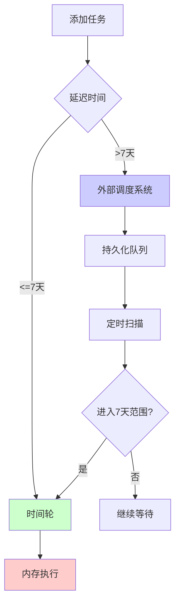
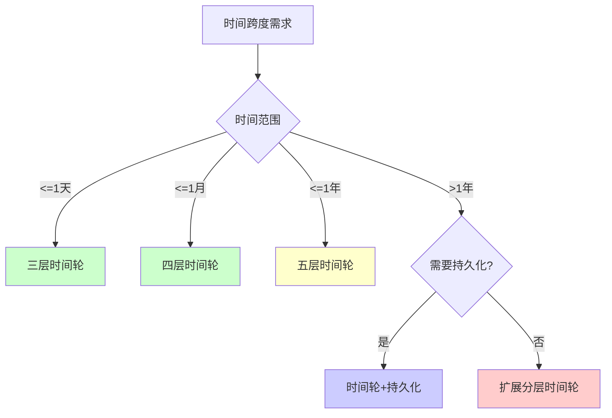

# 时间轮算法概述

时间轮（Time Wheel）是一种高效的定时器实现算法，广泛应用于定时任务调度、延迟消息处理、网络超时管理等场景。它将时间划分为多个时间槽（slot），每个槽对应一个时间间隔，通过轮询机制来管理和执行定时任务。

## 核心思想

时间轮的核心思想是将时间划分为多个时间槽，每个槽维护一个任务列表。通过指针的周期性移动，当指针指向某个槽时，执行该槽中的所有任务。

## 设计目标

1. **高效插入和删除**：O(1) 时间复杂度
2. **精确执行**：在指定时间执行任务
3. **内存效率**：合理使用内存空间
4. **支持大量定时器**：能够管理大量定时任务

## 应用场景

- **定时任务调度**：延迟执行、周期性任务
- **网络超时管理**：TCP 连接超时、请求超时
- **缓存过期**：Redis、Memcached 的过期键管理
- **游戏开发**：技能冷却、Buff 持续时间
- **消息队列**：延迟消息、死信队列

# 单层时间轮

## 基本结构

单层时间轮是最简单的时间轮实现，由一个循环数组和指针组成。



## 数据结构

```go
// 定时任务
type TimerTask struct {
    delay    int64  // 延迟时间（秒）
    callback func() // 回调函数
    next     *TimerTask
}

// 时间轮
type TimeWheel struct {
    slots      []*TimerTask  // 时间槽数组
    slotNum    int           // 槽数量
    currentPos int           // 当前指针位置
    tick       int64         // 时间间隔（秒）
    ticker     *time.Ticker  // 定时器
}
```

## 工作原理



## Go 实现

### 基础实现

```go
package main

import (
    "container/list"
    "fmt"
    "time"
)

// 定时任务
type Task struct {
    delay    time.Duration // 延迟时间
    callback func()        // 回调函数
    rounds   int           // 剩余轮数（用于多层时间轮）
}

// 单层时间轮
type SimpleTimeWheel struct {
    slots      []*list.List // 每个槽的任务列表
    slotNum    int         // 槽数量
    currentPos int         // 当前指针位置
    tick       time.Duration // 时间间隔
    ticker     *time.Ticker  // 定时器
    stop       chan bool     // 停止信号
}

// 创建时间轮
func NewSimpleTimeWheel(slotNum int, tick time.Duration) *SimpleTimeWheel {
    tw := &SimpleTimeWheel{
        slots:      make([]*list.List, slotNum),
        slotNum:    slotNum,
        currentPos: 0,
        tick:       tick,
        stop:       make(chan bool),
    }
    
    // 初始化每个槽
    for i := 0; i < slotNum; i++ {
        tw.slots[i] = list.New()
    }
    
    return tw
}

// 添加任务
func (tw *SimpleTimeWheel) AddTask(delay time.Duration, callback func()) error {
    if delay < tw.tick {
        return fmt.Errorf("delay must be >= tick")
    }
    
    // 计算槽位置
    pos := (tw.currentPos + int(delay/tw.tick)) % tw.slotNum
    
    // 创建任务
    task := &Task{
        delay:    delay,
        callback: callback,
    }
    
    // 添加到对应槽
    tw.slots[pos].PushBack(task)
    
    return nil
}

// 启动时间轮
func (tw *SimpleTimeWheel) Start() {
    tw.ticker = time.NewTicker(tw.tick)
    
    go func() {
        for {
            select {
            case <-tw.ticker.C:
                tw.tickHandler()
            case <-tw.stop:
                tw.ticker.Stop()
                return
            }
        }
    }()
}

// 停止时间轮
func (tw *SimpleTimeWheel) Stop() {
    close(tw.stop)
}

// tick 处理
func (tw *SimpleTimeWheel) tickHandler() {
    // 获取当前槽
    slot := tw.slots[tw.currentPos]
    
    // 执行当前槽的所有任务
    for e := slot.Front(); e != nil; {
        task := e.Value.(*Task)
        next := e.Next()
        
        // 执行任务
        go task.callback()
        
        // 移除任务
        slot.Remove(e)
        e = next
    }
    
    // 移动到下一个槽
    tw.currentPos = (tw.currentPos + 1) % tw.slotNum
}

// 使用示例
func main() {
    // 创建时间轮：8个槽，每1秒一个tick
    tw := NewSimpleTimeWheel(8, time.Second)
    
    // 添加任务
    tw.AddTask(2*time.Second, func() {
        fmt.Println("Task 1 executed after 2 seconds")
    })
    
    tw.AddTask(5*time.Second, func() {
        fmt.Println("Task 2 executed after 5 seconds")
    })
    
    // 启动时间轮
    tw.Start()
    
    // 运行10秒
    time.Sleep(10 * time.Second)
    
    // 停止时间轮
    tw.Stop()
}
```

## 单层时间轮的局限性

单层时间轮存在以下问题：

1. **时间范围有限**：只能表示 `slotNum * tick` 的时间范围
2. **精度限制**：时间精度受 tick 限制
3. **无法处理长时间延迟**：超过时间轮范围的延迟无法处理

例如：8个槽，每1秒一个tick，只能处理0-8秒的延迟任务。

# 多层时间轮（分层时间轮）

## 基本思想

多层时间轮通过多个时间轮组合，每个时间轮负责不同的时间粒度，从而支持更大的时间范围和更高的精度。



## 数据结构

```go
// 多层时间轮
type HierarchicalTimeWheel struct {
    wheels []*TimeWheel  // 多个时间轮
    levels int           // 层数
}

// 时间轮
type TimeWheel struct {
    slots      []*list.List
    slotNum    int
    currentPos int
    tick       time.Duration
    level      int  // 层级
    nextWheel  *TimeWheel  // 下一层时间轮
}
```

## 工作原理



## Go 实现

### 分层时间轮实现

```go
package main

import (
    "container/list"
    "fmt"
    "sync"
    "time"
)

// 定时任务
type TimerTask struct {
    delay    time.Duration
    callback func()
    rounds   int  // 剩余轮数
}

// 时间轮
type TimeWheel struct {
    slots      []*list.List
    slotNum    int
    currentPos int
    tick       time.Duration
    level      int
    nextWheel  *TimeWheel
    mu         sync.Mutex
}

// 创建时间轮
func NewTimeWheel(slotNum int, tick time.Duration, level int) *TimeWheel {
    tw := &TimeWheel{
        slots:      make([]*list.List, slotNum),
        slotNum:    slotNum,
        currentPos: 0,
        tick:       tick,
        level:      level,
    }
    
    for i := 0; i < slotNum; i++ {
        tw.slots[i] = list.New()
    }
    
    return tw
}

// 设置下一层时间轮
func (tw *TimeWheel) SetNextWheel(next *TimeWheel) {
    tw.nextWheel = next
}

// 添加任务
func (tw *TimeWheel) AddTask(delay time.Duration, callback func()) error {
    tw.mu.Lock()
    defer tw.mu.Unlock()
    
    // 计算总时间槽数
    totalSlots := int(delay / tw.tick)
    
    // 如果当前层可以处理
    if totalSlots < tw.slotNum {
        pos := (tw.currentPos + totalSlots) % tw.slotNum
        task := &TimerTask{
            delay:    delay,
            callback: callback,
            rounds:   0,
        }
        tw.slots[pos].PushBack(task)
        return nil
    }
    
    // 需要下一层处理
    if tw.nextWheel != nil {
        // 计算需要降级的轮数
        rounds := totalSlots / tw.slotNum
        remainingSlots := totalSlots % tw.slotNum
        
        if remainingSlots == 0 {
            // 正好是当前层的倍数，添加到下一层
            return tw.nextWheel.AddTask(delay, callback)
        }
        
        // 添加到当前层的最后一个槽
        pos := (tw.currentPos + remainingSlots) % tw.slotNum
        task := &TimerTask{
            delay:    delay,
            callback: callback,
            rounds:   rounds,
        }
        tw.slots[pos].PushBack(task)
        return nil
    }
    
    return fmt.Errorf("delay too large for time wheel")
}

// tick 处理
func (tw *TimeWheel) Tick() {
    tw.mu.Lock()
    defer tw.mu.Unlock()
    
    slot := tw.slots[tw.currentPos]
    
    // 处理当前槽的任务
    for e := slot.Front(); e != nil; {
        task := e.Value.(*TimerTask)
        next := e.Next()
        
        if task.rounds == 0 {
            // 执行任务
            go task.callback()
            slot.Remove(e)
        } else {
            // 降级到下一层
            task.rounds--
            if tw.nextWheel != nil {
                tw.nextWheel.AddTask(task.delay, task.callback)
            }
            slot.Remove(e)
        }
        
        e = next
    }
    
    // 移动到下一个槽
    tw.currentPos = (tw.currentPos + 1) % tw.slotNum
    
    // 如果转了一圈，触发下一层
    if tw.currentPos == 0 && tw.nextWheel != nil {
        tw.nextWheel.Tick()
    }
}

// 分层时间轮管理器
type HierarchicalTimeWheel struct {
    wheels []*TimeWheel
    ticker *time.Ticker
    stop   chan bool
    wg     sync.WaitGroup
}

// 创建分层时间轮
func NewHierarchicalTimeWheel() *HierarchicalTimeWheel {
    // 创建三层时间轮
    // 第一层：60个槽，每1秒一个tick（0-59秒）
    wheel1 := NewTimeWheel(60, time.Second, 1)
    
    // 第二层：60个槽，每1分钟一个tick（0-59分钟）
    wheel2 := NewTimeWheel(60, time.Minute, 2)
    
    // 第三层：24个槽，每1小时一个tick（0-23小时）
    wheel3 := NewTimeWheel(24, time.Hour, 3)
    
    // 设置层级关系
    wheel1.SetNextWheel(wheel2)
    wheel2.SetNextWheel(wheel3)
    
    return &HierarchicalTimeWheel{
        wheels: []*TimeWheel{wheel1, wheel2, wheel3},
        stop:   make(chan bool),
    }
}

// 添加任务
func (htw *HierarchicalTimeWheel) AddTask(delay time.Duration, callback func()) error {
    return htw.wheels[0].AddTask(delay, callback)
}

// 启动
func (htw *HierarchicalTimeWheel) Start() {
    htw.ticker = time.NewTicker(time.Second)
    
    htw.wg.Add(1)
    go func() {
        defer htw.wg.Done()
        for {
            select {
            case <-htw.ticker.C:
                htw.wheels[0].Tick()
            case <-htw.stop:
                htw.ticker.Stop()
                return
            }
        }
    }()
}

// 停止
func (htw *HierarchicalTimeWheel) Stop() {
    close(htw.stop)
    htw.wg.Wait()
}

// 使用示例
func main() {
    htw := NewHierarchicalTimeWheel()
    htw.Start()
    
    // 添加不同延迟的任务
    htw.AddTask(5*time.Second, func() {
        fmt.Println("Task 1: 5 seconds")
    })
    
    htw.AddTask(2*time.Minute, func() {
        fmt.Println("Task 2: 2 minutes")
    })
    
    htw.AddTask(1*time.Hour, func() {
        fmt.Println("Task 3: 1 hour")
    })
    
    time.Sleep(2 * time.Hour)
    htw.Stop()
}
```

# 时间轮的操作

## 添加任务



## 删除任务

```go
// 删除任务（需要维护任务ID）
type TimerTask struct {
    id       int64
    delay    time.Duration
    callback func()
    rounds   int
    element  *list.Element  // 保存链表元素引用
}

// 删除任务
func (tw *TimeWheel) RemoveTask(taskID int64) bool {
    tw.mu.Lock()
    defer tw.mu.Unlock()
    
    // 遍历所有槽查找任务
    for _, slot := range tw.slots {
        for e := slot.Front(); e != nil; e = e.Next() {
            task := e.Value.(*TimerTask)
            if task.id == taskID {
                slot.Remove(e)
                return true
            }
        }
    }
    
    return false
}
```

## 执行任务



# 大时间跨度的时间轮设计

当需要支持非常大的时间跨度（如几天、几周、几个月甚至几年）时，时间轮的设计需要特殊考虑。

## 问题分析

### 挑战

1. **内存占用**：多层时间轮需要大量内存
2. **层级过多**：需要很多层才能覆盖大时间范围
3. **精度损失**：高层时间轮的精度较低
4. **持久化需求**：长时间任务需要持久化存储

### 时间范围计算



## 解决方案

### 方案 1: 扩展分层时间轮

通过增加更多层级来支持大时间范围。

#### 设计思路

```go
// 支持大时间范围的分层时间轮
// 第一层：秒级（0-59秒）
// 第二层：分级（0-59分钟）
// 第三层：时级（0-23小时）
// 第四层：天级（0-30天）
// 第五层：月级（0-11个月）
// 第六层：年级（0-99年）
```

#### 实现代码

```go
// 大时间跨度时间轮
type ExtendedTimeWheel struct {
    wheels []*TimeWheel
    ticker *time.Ticker
    stop   chan bool
    wg     sync.WaitGroup
}

// 创建扩展时间轮（支持到年）
func NewExtendedTimeWheel() *ExtendedTimeWheel {
    // 第一层：秒级（60槽，1秒/槽）
    wheel1 := NewTimeWheel(60, time.Second, 1)
    
    // 第二层：分级（60槽，1分钟/槽）
    wheel2 := NewTimeWheel(60, time.Minute, 2)
    
    // 第三层：时级（24槽，1小时/槽）
    wheel3 := NewTimeWheel(24, time.Hour, 3)
    
    // 第四层：天级（30槽，1天/槽）
    wheel4 := NewTimeWheel(30, 24*time.Hour, 4)
    
    // 第五层：月级（12槽，1月/槽）
    wheel5 := NewTimeWheel(12, 30*24*time.Hour, 5)
    
    // 第六层：年级（100槽，1年/槽）
    wheel6 := NewTimeWheel(100, 365*24*time.Hour, 6)
    
    // 设置层级关系
    wheel1.SetNextWheel(wheel2)
    wheel2.SetNextWheel(wheel3)
    wheel3.SetNextWheel(wheel4)
    wheel4.SetNextWheel(wheel5)
    wheel5.SetNextWheel(wheel6)
    
    return &ExtendedTimeWheel{
        wheels: []*TimeWheel{wheel1, wheel2, wheel3, wheel4, wheel5, wheel6},
        stop:   make(chan bool),
    }
}

// 支持的时间范围：0 - 100年
// 内存占用：60 + 60 + 24 + 30 + 12 + 100 = 286个槽
```

#### 优缺点

**优点**：
- 支持非常大的时间范围
- 逻辑统一，易于理解

**缺点**：
- 内存占用较大
- 层级过多，实现复杂
- 高层精度较低

### 方案 2: 时间轮 + 持久化存储

对于超长时间跨度的任务，使用时间轮管理近期任务，持久化存储管理远期任务。

#### 设计思路



#### 实现代码

```go
// 带持久化的时间轮
type PersistentTimeWheel struct {
    timeWheel *HierarchicalTimeWheel
    storage   TaskStorage  // 持久化存储接口
    threshold time.Duration // 阈值（如7天）
    scanner   *time.Ticker  // 扫描器
    stop      chan bool
}

// 任务存储接口
type TaskStorage interface {
    Save(task *PersistentTask) error
    LoadBefore(deadline time.Time) ([]*PersistentTask, error)
    Delete(taskID string) error
}

// 持久化任务
type PersistentTask struct {
    ID       string
    ExecuteTime time.Time
    Callback func()
    Data     []byte  // 序列化的回调数据
}

// 创建带持久化的时间轮
func NewPersistentTimeWheel(storage TaskStorage, threshold time.Duration) *PersistentTimeWheel {
    return &PersistentTimeWheel{
        timeWheel: NewHierarchicalTimeWheel(),
        storage:   storage,
        threshold: threshold,
        scanner:   time.NewTicker(1 * time.Hour), // 每小时扫描一次
        stop:      make(chan bool),
    }
}

// 添加任务
func (ptw *PersistentTimeWheel) AddTask(delay time.Duration, callback func()) error {
    executeTime := time.Now().Add(delay)
    
    // 如果延迟时间小于阈值，添加到时间轮
    if delay <= ptw.threshold {
        return ptw.timeWheel.AddTask(delay, callback)
    }
    
    // 否则保存到持久化存储
    task := &PersistentTask{
        ID:         generateID(),
        ExecuteTime: executeTime,
        Callback:   callback,
        Data:       serializeCallback(callback),
    }
    
    return ptw.storage.Save(task)
}

// 启动扫描器
func (ptw *PersistentTimeWheel) StartScanner() {
    go func() {
        for {
            select {
            case <-ptw.scanner.C:
                ptw.scanAndLoad()
            case <-ptw.stop:
                ptw.scanner.Stop()
                return
            }
        }
    }()
}

// 扫描并加载任务
func (ptw *PersistentTimeWheel) scanAndLoad() {
    // 计算阈值时间（当前时间 + 阈值）
    thresholdTime := time.Now().Add(ptw.threshold)
    
    // 从存储中加载即将到期的任务
    tasks, err := ptw.storage.LoadBefore(thresholdTime)
    if err != nil {
        log.Printf("Failed to load tasks: %v", err)
        return
    }
    
    // 将任务添加到时间轮
    for _, task := range tasks {
        delay := time.Until(task.ExecuteTime)
        if delay > 0 {
            callback := deserializeCallback(task.Data)
            if err := ptw.timeWheel.AddTask(delay, callback); err == nil {
                // 从存储中删除
                ptw.storage.Delete(task.ID)
            }
        }
    }
}

// 停止
func (ptw *PersistentTimeWheel) Stop() {
    close(ptw.stop)
    ptw.timeWheel.Stop()
}
```

#### 存储实现示例

```go
// 基于数据库的存储实现
type DatabaseTaskStorage struct {
    db *sql.DB
}

func (dts *DatabaseTaskStorage) Save(task *PersistentTask) error {
    query := `INSERT INTO delayed_tasks (id, execute_time, data) VALUES (?, ?, ?)`
    _, err := dts.db.Exec(query, task.ID, task.ExecuteTime, task.Data)
    return err
}

func (dts *DatabaseTaskStorage) LoadBefore(deadline time.Time) ([]*PersistentTask, error) {
    query := `SELECT id, execute_time, data FROM delayed_tasks 
              WHERE execute_time <= ? ORDER BY execute_time ASC`
    rows, err := dts.db.Query(query, deadline)
    if err != nil {
        return nil, err
    }
    defer rows.Close()
    
    var tasks []*PersistentTask
    for rows.Next() {
        var task PersistentTask
        if err := rows.Scan(&task.ID, &task.ExecuteTime, &task.Data); err != nil {
            return nil, err
        }
        tasks = append(tasks, &task)
    }
    
    return tasks, nil
}

func (dts *DatabaseTaskStorage) Delete(taskID string) error {
    query := `DELETE FROM delayed_tasks WHERE id = ?`
    _, err := dts.db.Exec(query, taskID)
    return err
}
```

#### 优缺点

**优点**：
- 支持任意时间跨度
- 内存占用可控
- 支持系统重启恢复
- 可以持久化到数据库

**缺点**：
- 需要额外的存储系统
- 扫描加载有延迟
- 实现复杂度较高

### 方案 3: 时间轮 + 外部调度系统

对于超长时间跨度的任务，使用时间轮处理近期任务，外部调度系统（如 Cron、消息队列）处理远期任务。

#### 设计思路



#### 实现代码

```go
// 混合时间轮
type HybridTimeWheel struct {
    timeWheel    *HierarchicalTimeWheel
    scheduler    ExternalScheduler  // 外部调度器
    threshold    time.Duration
}

// 外部调度器接口
type ExternalScheduler interface {
    Schedule(taskID string, executeTime time.Time, callback func()) error
    Cancel(taskID string) error
}

// 添加任务
func (htw *HybridTimeWheel) AddTask(taskID string, delay time.Duration, callback func()) error {
    executeTime := time.Now().Add(delay)
    
    if delay <= htw.threshold {
        // 添加到时间轮
        return htw.timeWheel.AddTask(delay, callback)
    }
    
    // 添加到外部调度系统
    return htw.scheduler.Schedule(taskID, executeTime, func() {
        // 当任务接近执行时间时，从外部系统转移到时间轮
        remainingDelay := time.Until(executeTime)
        if remainingDelay <= htw.threshold {
            htw.timeWheel.AddTask(remainingDelay, callback)
            htw.scheduler.Cancel(taskID)
        }
    })
}
```

### 方案 4: 动态时间轮

根据实际任务分布动态调整时间轮结构。

#### 设计思路

```go
// 动态时间轮
type DynamicTimeWheel struct {
    wheels map[int]*TimeWheel  // 按层级索引
    maxLevel int
}

// 根据任务延迟动态创建层级
func (dtw *DynamicTimeWheel) AddTask(delay time.Duration, callback func()) error {
    // 计算需要的层级
    level := dtw.calculateLevel(delay)
    
    // 如果层级不存在，动态创建
    if _, exists := dtw.wheels[level]; !exists {
        dtw.wheels[level] = dtw.createWheel(level)
    }
    
    // 添加到对应层级
    return dtw.wheels[level].AddTask(delay, callback)
}

// 计算需要的层级
func (dtw *DynamicTimeWheel) calculateLevel(delay time.Duration) int {
    // 根据延迟时间计算层级
    // 例如：秒级=1，分级=2，时级=3，天级=4...
    base := time.Second
    level := 1
    
    for delay > base*60 {
        base *= 60
        level++
    }
    
    return level
}
```

## 方案对比

| 方案 | 时间范围 | 内存占用 | 实现复杂度 | 持久化 | 适用场景 |
|------|---------|---------|-----------|--------|---------|
| 扩展分层时间轮 | 100年 | 高 | 中 | 否 | 内存充足，需要统一管理 |
| 时间轮+持久化 | 无限制 | 低 | 高 | 是 | 需要持久化，支持重启 |
| 时间轮+外部调度 | 无限制 | 低 | 中 | 是 | 已有调度系统 |
| 动态时间轮 | 可扩展 | 中 | 高 | 否 | 任务分布不均匀 |

## 选择建议

### 根据时间跨度选择



### 根据业务需求选择

1. **内存充足 + 统一管理**：使用扩展分层时间轮
2. **需要持久化 + 支持重启**：使用时间轮+持久化
3. **已有调度系统**：使用时间轮+外部调度
4. **任务分布不均匀**：使用动态时间轮

## 实际应用案例

### 案例 1: 电商订单超时取消（30天）

```go
// 订单超时管理
type OrderTimeoutManager struct {
    timeWheel *PersistentTimeWheel
}

func (otm *OrderTimeoutManager) ScheduleOrderCancel(orderID string, timeoutDays int) {
    delay := time.Duration(timeoutDays) * 24 * time.Hour
    
    otm.timeWheel.AddTask(delay, func() {
        // 取消订单逻辑
        otm.cancelOrder(orderID)
    })
}
```

### 案例 2: 会员到期提醒（1年）

```go
// 会员到期管理
type MembershipManager struct {
    timeWheel *ExtendedTimeWheel
}

func (mm *MembershipManager) ScheduleExpiryReminder(memberID string, expiryDate time.Time) {
    delay := time.Until(expiryDate)
    
    // 提前7天提醒
    reminderDelay := delay - 7*24*time.Hour
    if reminderDelay > 0 {
        mm.timeWheel.AddTask(reminderDelay, func() {
            mm.sendReminder(memberID)
        })
    }
}
```

### 案例 3: 定时报表生成（按月）

```go
// 报表生成调度
type ReportScheduler struct {
    timeWheel *HybridTimeWheel
}

func (rs *ReportScheduler) ScheduleMonthlyReport(reportType string, month int) {
    // 计算下个月1号的时间
    nextMonth := time.Now().AddDate(0, 1, 0)
    executeTime := time.Date(nextMonth.Year(), nextMonth.Month(), 1, 0, 0, 0, 0, time.Local)
    delay := time.Until(executeTime)
    
    rs.timeWheel.AddTask("report-"+reportType, delay, func() {
        rs.generateReport(reportType)
    })
}
```

## 最佳实践

### 1. 合理设置阈值

```go
// 根据业务场景设置阈值
// 短期任务（<7天）：时间轮
// 长期任务（>7天）：持久化存储
const ShortTermThreshold = 7 * 24 * time.Hour
```

### 2. 定期扫描优化

```go
// 扫描频率根据任务密度调整
// 任务多：频繁扫描（如每小时）
// 任务少：低频扫描（如每天）
func (ptw *PersistentTimeWheel) optimizeScanInterval() {
    taskCount := ptw.getPendingTaskCount()
    
    if taskCount > 1000 {
        ptw.scanner.Reset(30 * time.Minute)  // 30分钟
    } else {
        ptw.scanner.Reset(2 * time.Hour)     // 2小时
    }
}
```

### 3. 批量加载优化

```go
// 批量加载任务，减少数据库查询
func (ptw *PersistentTimeWheel) scanAndLoad() {
    thresholdTime := time.Now().Add(ptw.threshold)
    
    // 批量加载，每次最多1000个
    batchSize := 1000
    offset := 0
    
    for {
        tasks, err := ptw.storage.LoadBatch(thresholdTime, batchSize, offset)
        if err != nil || len(tasks) == 0 {
            break
        }
        
        // 批量添加到时间轮
        for _, task := range tasks {
            // ...
        }
        
        offset += batchSize
    }
}
```

### 4. 监控和告警

```go
// 监控时间轮状态
type TimeWheelMonitor struct {
    taskCount    int64
    pendingTasks int64
    errorCount   int64
}

func (twm *TimeWheelMonitor) CheckHealth() {
    // 检查待执行任务数量
    if twm.pendingTasks > 10000 {
        alert("Too many pending tasks")
    }
    
    // 检查错误率
    if twm.errorCount > 100 {
        alert("High error rate in time wheel")
    }
}
```

# 时间轮的优化

## 1. 延迟执行优化

对于即将到期的任务，可以立即执行而不等待下一个tick：

```go
func (tw *TimeWheel) AddTask(delay time.Duration, callback func()) error {
    // 如果延迟小于一个tick，立即执行
    if delay < tw.tick {
        go callback()
        return nil
    }
    
    // 正常添加到时间轮
    // ...
}
```

## 2. 批量执行优化

将同一槽的任务批量执行，减少锁竞争：

```go
func (tw *TimeWheel) tickHandler() {
    tw.mu.Lock()
    slot := tw.slots[tw.currentPos]
    
    // 批量获取任务
    tasks := make([]*TimerTask, 0)
    for e := slot.Front(); e != nil; {
        task := e.Value.(*TimerTask)
        tasks = append(tasks, task)
        slot.Remove(e)
        e = slot.Front()
    }
    
    tw.currentPos = (tw.currentPos + 1) % tw.slotNum
    tw.mu.Unlock()
    
    // 批量执行任务（无锁）
    for _, task := range tasks {
        if task.rounds == 0 {
            go task.callback()
        } else {
            // 降级处理
        }
    }
}
```

## 3. 时间精度优化

使用更小的tick提高精度，但会增加CPU开销：

```go
// 高精度时间轮：每100ms一个tick
tw := NewTimeWheel(100, 100*time.Millisecond, 1)
```

## 4. 内存优化

使用对象池复用任务对象：

```go
var taskPool = sync.Pool{
    New: func() interface{} {
        return &TimerTask{}
    },
}

func (tw *TimeWheel) getTask() *TimerTask {
    return taskPool.Get().(*TimerTask)
}

func (tw *TimeWheel) putTask(task *TimerTask) {
    task.callback = nil
    task.rounds = 0
    taskPool.Put(task)
}
```

# 时间轮 vs 其他定时器实现

## 对比表

| 特性 | 时间轮 | 最小堆 | 红黑树 | 链表 |
|------|--------|--------|--------|------|
| 插入复杂度 | O(1) | O(log n) | O(log n) | O(n) |
| 删除复杂度 | O(1) | O(log n) | O(log n) | O(n) |
| 执行复杂度 | O(1) | O(log n) | O(log n) | O(1) |
| 内存占用 | 中等 | 低 | 中等 | 低 |
| 精度 | 受tick限制 | 高 | 高 | 高 |
| 适用场景 | 大量定时器 | 少量定时器 | 需要排序 | 简单场景 |

## 选择建议

- **大量定时器**：使用时间轮
- **少量定时器**：使用最小堆
- **需要排序**：使用红黑树
- **简单场景**：使用链表

# 实际应用案例

## 1. 网络超时管理

```go
// 连接超时管理
type ConnectionManager struct {
    timeWheel *TimeWheel
    connMap   map[int64]*Connection
}

func (cm *ConnectionManager) AddConnection(connID int64, timeout time.Duration) {
    cm.connMap[connID] = &Connection{ID: connID}
    
    // 添加超时任务
    cm.timeWheel.AddTask(timeout, func() {
        if conn, ok := cm.connMap[connID]; ok {
            conn.Close()
            delete(cm.connMap, connID)
        }
    })
}
```

## 2. 缓存过期管理

```go
// 缓存过期管理
type Cache struct {
    data      map[string]interface{}
    timeWheel *TimeWheel
    mu        sync.RWMutex
}

func (c *Cache) Set(key string, value interface{}, ttl time.Duration) {
    c.mu.Lock()
    c.data[key] = value
    c.mu.Unlock()
    
    // 添加过期任务
    c.timeWheel.AddTask(ttl, func() {
        c.mu.Lock()
        delete(c.data, key)
        c.mu.Unlock()
    })
}
```

## 3. 延迟消息队列

```go
// 延迟消息队列
type DelayQueue struct {
    timeWheel *TimeWheel
    messages  chan Message
}

func (dq *DelayQueue) PublishDelay(msg Message, delay time.Duration) {
    dq.timeWheel.AddTask(delay, func() {
        dq.messages <- msg
    })
}
```

# 时间轮的优缺点

## 优点

1. **高效插入删除**：O(1) 时间复杂度
2. **支持大量定时器**：可以管理大量定时任务
3. **内存效率**：固定内存占用
4. **实现简单**：逻辑清晰，易于实现

## 缺点

1. **时间精度受限**：受tick大小限制
2. **时间范围受限**：单层时间轮范围有限
3. **内存占用**：需要预分配槽空间
4. **不适合精确时间**：不适合需要精确时间的场景

# 最佳实践

## 1. 选择合适的tick

```go
// 根据业务需求选择tick
// 高精度场景：100ms
tw := NewTimeWheel(100, 100*time.Millisecond, 1)

// 一般场景：1秒
tw := NewTimeWheel(60, time.Second, 1)

// 低精度场景：1分钟
tw := NewTimeWheel(60, time.Minute, 1)
```

## 2. 使用分层时间轮

对于需要支持大时间范围的场景，使用分层时间轮：

```go
// 支持0-24小时的时间范围
htw := NewHierarchicalTimeWheel()
```

## 3. 处理任务执行时间

任务执行时间不应影响时间轮的精度：

```go
// 使用goroutine异步执行
go task.callback()
```

## 4. 错误处理

添加任务时进行参数校验：

```go
func (tw *TimeWheel) AddTask(delay time.Duration, callback func()) error {
    if delay < 0 {
        return fmt.Errorf("delay must be >= 0")
    }
    if callback == nil {
        return fmt.Errorf("callback cannot be nil")
    }
    // ...
}
```

# 总结

时间轮是一种高效的定时器实现算法：

## 核心特点

- **O(1) 复杂度**：插入、删除、执行都是 O(1)
- **支持大量定时器**：可以管理大量定时任务
- **固定内存**：内存占用可预测
- **实现简单**：逻辑清晰

## 适用场景

- 大量定时任务调度
- 网络超时管理
- 缓存过期管理
- 延迟消息处理

## 选择建议

- **大量定时器 + 精度要求不高**：使用时间轮
- **少量定时器 + 高精度**：使用最小堆
- **需要大时间范围**：使用分层时间轮

理解时间轮算法有助于：
- 设计高效的定时器系统
- 优化定时任务性能
- 选择合适的定时器实现
- 解决定时任务相关问题
