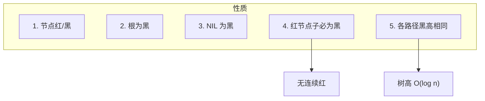
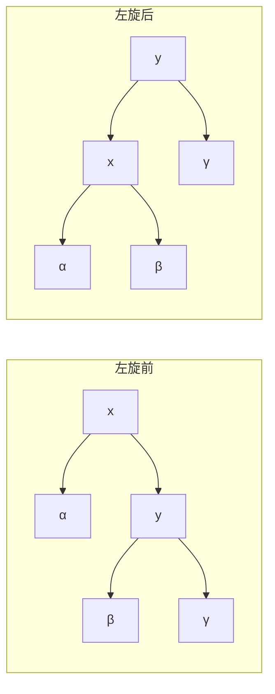
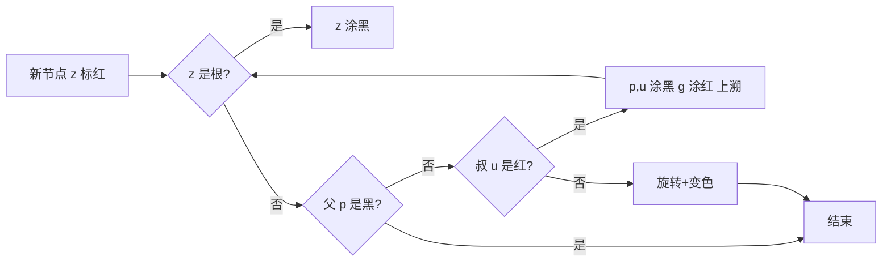

# 红黑树简介

红黑树（Red-Black Tree）是一种**自平衡二叉搜索树**（BST），通过为节点赋予颜色（红/黑）并约定若干约束，保证树高为 **O(log n)**，从而让查找、插入、删除都在 O(log n) 内完成。

在工程中广泛使用，例如：
- **Linux 内核**：进程调度、内存管理等用红黑树管理有序结构
- **Java**：`TreeMap`、`TreeSet` 底层实现
- **C++**：`std::map`、`std::set` 的常见实现

# 五条性质

红黑树满足以下性质（约定「叶子」指 NIL 空节点）：

1. **节点是红色或黑色**
2. **根是黑色**
3. **所有叶子（NIL）视为黑色**
4. **红色节点的两个子节点都是黑色**（即不能有连续红节点）
5. **从任意节点到其每个叶子的所有路径上，黑色节点数量相同**（黑高一致）

由性质 4 和 5 可推出：从根到叶子的最长路径不超过最短路径的 2 倍，从而树高 **h ≤ 2·log₂(n+1)**，即 O(log n)。



# 基本操作：旋转

旋转不改变 BST 的中序顺序，只改变局部结构，用于在插入/删除后恢复红黑性质。

## 左旋（Left Rotate）

以某节点 `x` 为轴，将其右子 `y` 提上来，`x` 变为 `y` 的左子；`y` 的原左子树变为 `x` 的右子树。



## 右旋（Right Rotate）

以某节点 `y` 为轴，将其左子 `x` 提上来，`y` 变为 `x` 的右子；`x` 的原右子树变为 `y` 的左子树。与左旋互为逆操作。

# 插入

插入分两步：
1. 按 BST 规则插入新节点，并**先标为红色**（这样不破坏性质 5，只可能破坏性质 2 或 4）。
2. 若违反「根为黑」或「无连续红」，则通过**变色 + 旋转**修复。

下面用「当前节点」指我们正在关注、可能违反性质的那个节点（新节点或因修复而上溯到的节点）。

## 插入后的情况划分

设新节点为 `z`，父节点为 `p`，叔节点为 `u`（父的兄弟），祖父为 `g`。

- **Case 1**：`z` 是根 → 涂黑即可。
- **Case 2**：`p` 是黑 → 不破坏性质，结束。
- **Case 3**：`p` 是红，则必有 `g` 为黑（根为黑）。看 `u`：
  - **Case 3a**：`u` 是红 → 将 `p`、`u` 涂黑，`g` 涂红，然后令「当前节点」= `g` 继续上溯。
  - **Case 3b**：`u` 是黑或 NIL → 通过旋转 + 变色统一到「当前节点在根或父为黑」：
    - 若 `z`、`p`、`g` 呈「左-左」或「右-右」：对 `g` 做一次单旋（`p` 在左则右旋，`p` 在右则左旋），并交换 `p` 与 `g` 的颜色。
    - 若呈「左-右」或「右-左」：先对 `p` 做一次单旋，变成「左-左」或「右-右」，再对 `g` 做单旋并变色。



# 删除

删除 BST 节点后，若被删节点是黑色，会减少该路径上的黑高，需要修复。思路：先按 BST 删除（可转化为「删只有一个子或无子的节点」），再用一个**替代节点**承担「少了一层黑」的代价，然后通过变色与旋转把这一层黑补回来。

- 若被删节点有一个子或无子：用其子或 NIL 替代，若替代点是黑则进入修复。
- 若被删节点有两个子：用后继（或前驱）的值覆盖当前节点，再删后继节点，转化为上述情况。

修复时以「当前节点」为参考（即替代被删位置的那个节点），若当前节点是红则涂黑即可；若是黑则需按兄弟及其子节点颜色分多种 Case 处理（兄弟为红则先旋转使兄弟为黑，再按兄弟为黑的情况处理；兄弟为黑时再分子节点是否有红等），通过旋转和变色最终恢复黑高。具体 Case 较多，可查阅《算法导论》或标准实现。

# 时间复杂度

| 操作     | 时间复杂度 |
|----------|------------|
| 查找     | O(log n)   |
| 插入     | O(log n)   |
| 删除     | O(log n)   |
| 旋转次数 | 插入最多 2 次，删除最多 3 次 |

# Golang 实现

以下实现红黑树：支持插入、查找；节点带颜色与左右子指针，NIL 用空指针表示（代码中不显式建 NIL 节点，判断时用 `nil`）。

```go
package main

import "fmt"

const (
    RED   = true
    BLACK = false
)

type RBNode struct {
    Val    int
    Color  bool // true=红 false=黑
    Left   *RBNode
    Right  *RBNode
    Parent *RBNode
}

type RBTree struct {
    Root *RBNode
}

func NewRBTree() *RBTree {
    return &RBTree{}
}

func (t *RBTree) isRed(n *RBNode) bool {
    return n != nil && n.Color == RED
}

func (t *RBTree) isBlack(n *RBNode) bool {
    return n == nil || n.Color == BLACK
}

// 左旋：以 x 为轴，把右子 y 提上来
func (t *RBTree) leftRotate(x *RBNode) {
    if x == nil || x.Right == nil {
        return
    }
    y := x.Right
    x.Right = y.Left
    if y.Left != nil {
        y.Left.Parent = x
    }
    y.Parent = x.Parent
    if x.Parent == nil {
        t.Root = y
    } else if x == x.Parent.Left {
        x.Parent.Left = y
    } else {
        x.Parent.Right = y
    }
    y.Left = x
    x.Parent = y
}

// 右旋：以 y 为轴，把左子 x 提上来
func (t *RBTree) rightRotate(y *RBNode) {
    if y == nil || y.Left == nil {
        return
    }
    x := y.Left
    y.Left = x.Right
    if x.Right != nil {
        x.Right.Parent = y
    }
    x.Parent = y.Parent
    if y.Parent == nil {
        t.Root = x
    } else if y == y.Parent.Left {
        y.Parent.Left = x
    } else {
        y.Parent.Right = x
    }
    x.Right = y
    y.Parent = x
}

// Insert 插入并修复红黑性质
func (t *RBTree) Insert(val int) {
    z := &RBNode{Val: val, Color: RED}
    var parent *RBNode
    cur := t.Root
    for cur != nil {
        parent = cur
        if val < cur.Val {
            cur = cur.Left
        } else {
            cur = cur.Right
        }
    }
    z.Parent = parent
    if parent == nil {
        t.Root = z
    } else if val < parent.Val {
        parent.Left = z
    } else {
        parent.Right = z
    }
    t.insertFixup(z)
}

func (t *RBTree) insertFixup(z *RBNode) {
    for z != nil && z != t.Root && t.isRed(z.Parent) {
        p := z.Parent
        g := p.Parent
        if p == g.Left {
            u := g.Right // 叔
            if t.isRed(u) {
                // Case 3a：叔红 → 父、叔涂黑，祖父涂红，上溯
                p.Color = BLACK
                u.Color = BLACK
                g.Color = RED
                z = g
            } else {
                if z == p.Right {
                    // 左-右 → 先对父左旋变成左-左
                    z = p
                    t.leftRotate(z)
                    p = z.Parent
                    g = p.Parent
                }
                // 左-左：祖父右旋，父与祖父换色
                p.Color = BLACK
                g.Color = RED
                t.rightRotate(g)
                z = p
            }
        } else {
            u := g.Left
            if t.isRed(u) {
                p.Color = BLACK
                u.Color = BLACK
                g.Color = RED
                z = g
            } else {
                if z == p.Left {
                    z = p
                    t.rightRotate(z)
                    p = z.Parent
                    g = p.Parent
                }
                p.Color = BLACK
                g.Color = RED
                t.leftRotate(g)
                z = p
            }
        }
    }
    t.Root.Color = BLACK
}

// Search 查找
func (t *RBTree) Search(val int) *RBNode {
    cur := t.Root
    for cur != nil && cur.Val != val {
        if val < cur.Val {
            cur = cur.Left
        } else {
            cur = cur.Right
        }
    }
    return cur
}

// InOrder 中序遍历（用于验证 BST 性质）
func (t *RBTree) InOrder(n *RBNode, result *[]int) {
    if n == nil {
        return
    }
    t.InOrder(n.Left, result)
    *result = append(*result, n.Val)
    t.InOrder(n.Right, result)
}

func main() {
    tree := NewRBTree()
    for _, v := range []int{7, 3, 18, 10, 22, 8, 11, 26} {
        tree.Insert(v)
    }
    var order []int
    tree.InOrder(tree.Root, &order)
    fmt.Println("中序:", order)           // 有序
    fmt.Println("根:", tree.Root.Val)     // 根为黑
    fmt.Println("查10:", tree.Search(10)) // 非 nil
}
```

# 与 AVL 的对比

| 特性       | 红黑树           | AVL 树           |
|------------|------------------|------------------|
| 平衡条件   | 黑高一致、无连续红 | 左右子树高度差 ≤1 |
| 树高       | 约 2·log₂(n+1)   | 严格 log₂(n) 量级 |
| 查找       | 略慢于 AVL       | 略快             |
| 插入/删除  | 旋转与变色更少   | 旋转可能更多     |
| 典型应用   | map、内核、STL   | 需要更强查找时   |

红黑树在保证 O(log n) 的前提下，插入和删除时调整更少，因此工程中常用作平衡 BST 的实现基础。
