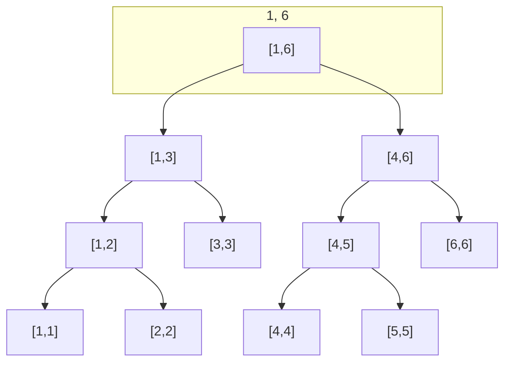
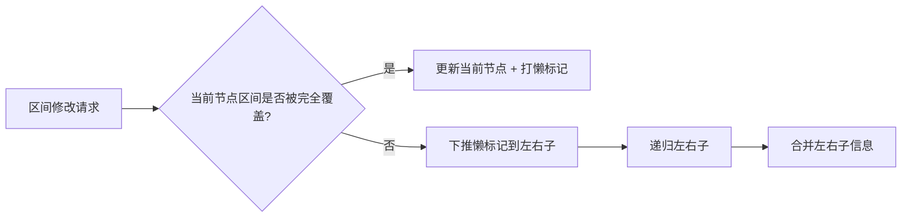

# 线段树简介

线段树（Segment Tree）是一种基于分治思想的二叉树数据结构，用于在**数组**上高效支持**区间查询**与**区间/单点修改**。

核心思想：将区间不断二分为左右子区间，每个节点代表一个区间，根节点代表整个数组区间，叶子节点代表单点。通过合并左右子区间的信息得到当前区间的信息，从而在 **O(log n)** 内完成区间查询与修改。

常见应用：
- **区间和/积**：查询与更新区间和、区间乘积
- **区间最值**：区间最大值、最小值
- **区间 GCD / 其他可合并信息**：满足结合律的运算均可

# 基本性质与结构

## 树结构

- **根节点**：表示整个数组区间 `[0, n-1]`
- **内部节点**：表示某个区间 `[l, r]`，左子表示 `[l, mid]`，右子表示 `[mid+1, r]`，其中 `mid = (l+r)/2`
- **叶子节点**：表示单点区间 `[l, l]`，对应原数组的一个元素



## 存储方式

线段树常用**数组**存储（堆式存储），下标从 1 开始较方便：
- 节点 `i` 的左子：`2*i`，右子：`2*i+1`
- 父节点：`i/2`

若区间长度为 `n`，开 **4n** 大小的数组即可安全覆盖所有节点。

## 时间复杂度

| 操作       | 时间复杂度 |
|------------|------------|
| 建树       | O(n)       |
| 单点修改   | O(log n)   |
| 单点/区间查询 | O(log n)   |
| 区间修改（含懒标记） | O(log n)   |

# Golang 实现

## 区间和 + 单点修改

以下实现：维护区间和，支持单点修改与区间和查询。

```go
package main

// SegmentTree 区间和线段树（单点修改）
type SegmentTree struct {
    tree []int // 线段树数组，下标从 1 开始
    n    int   // 原数组长度
}

// NewSegmentTree 建树 O(n)
func NewSegmentTree(nums []int) *SegmentTree {
    n := len(nums)
    st := &SegmentTree{
        tree: make([]int, 4*n),
        n:    n,
    }
    st.build(1, 0, n-1, nums)
    return st
}

func (st *SegmentTree) build(node, l, r int, nums []int) {
    if l == r {
        st.tree[node] = nums[l]
        return
    }
    mid := (l + r) / 2
    st.build(2*node, l, mid, nums)
    st.build(2*node+1, mid+1, r, nums)
    st.tree[node] = st.tree[2*node] + st.tree[2*node+1]
}

// Update 单点修改：将 index 位置改为 val
func (st *SegmentTree) Update(index, val int) {
    st.update(1, 0, st.n-1, index, val)
}

func (st *SegmentTree) update(node, l, r, index, val int) {
    if l == r {
        st.tree[node] = val
        return
    }
    mid := (l + r) / 2
    if index <= mid {
        st.update(2*node, l, mid, index, val)
    } else {
        st.update(2*node+1, mid+1, r, index, val)
    }
    st.tree[node] = st.tree[2*node] + st.tree[2*node+1]
}

// Query 区间查询：查询 [ql, qr] 的和
func (st *SegmentTree) Query(ql, qr int) int {
    return st.query(1, 0, st.n-1, ql, qr)
}

func (st *SegmentTree) query(node, l, r, ql, qr int) int {
    if qr < l || ql > r {
        return 0
    }
    if ql <= l && r <= qr {
        return st.tree[node]
    }
    mid := (l + r) / 2
    return st.query(2*node, l, mid, ql, qr) + st.query(2*node+1, mid+1, r, ql, qr)
}
```

## 区间和 + 区间修改（懒标记）

当需要**区间统一加/减**时，若每次暴力更新区间内每个叶子，复杂度会退化为 O(n)。使用**懒标记（Lazy Propagation）**：在“需要向下递归”时才把当前节点的修改下推，保证每次修改/查询只经过 O(log n) 层。

```go
// SegmentTreeLazy 带懒标记的区间和线段树（区间加）
type SegmentTreeLazy struct {
    sum  []int // 区间和
    lazy []int // 懒标记：该区间整体加了多少（尚未下传）
    n    int
}

func NewSegmentTreeLazy(nums []int) *SegmentTreeLazy {
    n := len(nums)
    st := &SegmentTreeLazy{
        sum:  make([]int, 4*n),
        lazy: make([]int, 4*n),
        n:    n,
    }
    st.build(1, 0, n-1, nums)
    return st
}

func (st *SegmentTreeLazy) build(node, l, r int, nums []int) {
    if l == r {
        st.sum[node] = nums[l]
        return
    }
    mid := (l + r) / 2
    st.build(2*node, l, mid, nums)
    st.build(2*node+1, mid+1, r, nums)
    st.sum[node] = st.sum[2*node] + st.sum[2*node+1]
}

// pushDown 将 node 的懒标记下推到左右子
func (st *SegmentTreeLazy) pushDown(node, l, r int) {
    if st.lazy[node] == 0 {
        return
    }
    mid := (l + r) / 2
    st.sum[2*node] += st.lazy[node] * (mid - l + 1)
    st.lazy[2*node] += st.lazy[node]
    st.sum[2*node+1] += st.lazy[node] * (r - mid)
    st.lazy[2*node+1] += st.lazy[node]
    st.lazy[node] = 0
}

// UpdateRange 区间 [ql, qr] 每个元素加 delta
func (st *SegmentTreeLazy) UpdateRange(ql, qr, delta int) {
    st.updateRange(1, 0, st.n-1, ql, qr, delta)
}

func (st *SegmentTreeLazy) updateRange(node, l, r, ql, qr, delta int) {
    if qr < l || ql > r {
        return
    }
    if ql <= l && r <= qr {
        st.sum[node] += delta * (r - l + 1)
        st.lazy[node] += delta
        return
    }
    st.pushDown(node, l, r)
    mid := (l + r) / 2
    st.updateRange(2*node, l, mid, ql, qr, delta)
    st.updateRange(2*node+1, mid+1, r, ql, qr, delta)
    st.sum[node] = st.sum[2*node] + st.sum[2*node+1]
}

// Query 查询 [ql, qr] 区间和
func (st *SegmentTreeLazy) Query(ql, qr int) int {
    return st.query(1, 0, st.n-1, ql, qr)
}

func (st *SegmentTreeLazy) query(node, l, r, ql, qr int) int {
    if qr < l || ql > r {
        return 0
    }
    if ql <= l && r <= qr {
        return st.sum[node]
    }
    st.pushDown(node, l, r)
    mid := (l + r) / 2
    return st.query(2*node, l, mid, ql, qr) + st.query(2*node+1, mid+1, r, ql, qr)
}
```

## 区间最值（以最大值为例）

只需把“合并”从加法改为取 max，单点/区间查询写法类似。

```go
// SegmentTreeMax 区间最大值线段树
type SegmentTreeMax struct {
    tree []int
    n    int
}

func NewSegmentTreeMax(nums []int) *SegmentTreeMax {
    n := len(nums)
    st := &SegmentTreeMax{tree: make([]int, 4*n), n: n}
    st.build(1, 0, n-1, nums)
    return st
}

func (st *SegmentTreeMax) build(node, l, r int, nums []int) {
    if l == r {
        st.tree[node] = nums[l]
        return
    }
    mid := (l + r) / 2
    st.build(2*node, l, mid, nums)
    st.build(2*node+1, mid+1, r, nums)
    st.tree[node] = max(st.tree[2*node], st.tree[2*node+1])
}

func (st *SegmentTreeMax) Update(index, val int) {
    st.update(1, 0, st.n-1, index, val)
}

func (st *SegmentTreeMax) update(node, l, r, index, val int) {
    if l == r {
        st.tree[node] = val
        return
    }
    mid := (l + r) / 2
    if index <= mid {
        st.update(2*node, l, mid, index, val)
    } else {
        st.update(2*node+1, mid+1, r, index, val)
    }
    st.tree[node] = max(st.tree[2*node], st.tree[2*node+1])
}

func (st *SegmentTreeMax) Query(ql, qr int) int {
    return st.query(1, 0, st.n-1, ql, qr)
}

func (st *SegmentTreeMax) query(node, l, r, ql, qr int) int {
    if qr < l || ql > r {
        return -1e9 // 视题目取负无穷或合适初值
    }
    if ql <= l && r <= qr {
        return st.tree[node]
    }
    mid := (l + r) / 2
    return max(st.query(2*node, l, mid, ql, qr), st.query(2*node+1, mid+1, r, ql, qr))
}

func max(a, b int) int {
    if a > b {
        return a
    }
    return b
}
```

# 懒标记小结



要点：
1. **修改时**：若当前区间被 `[ql, qr]` 完全包含，则只更新当前节点并打懒标记，不继续下推。
2. **查询或继续递归前**：若需要访问子节点，先对该节点执行 `pushDown`，再递归。
3. 懒标记含义与具体操作一致（如“区间加”则存加数；“区间赋值为 x”可存赋值与长度，下推时覆盖子区间）。

# 经典例题思路

| 问题           | 维护信息     | 修改方式     |
|----------------|--------------|--------------|
| 区间和 + 单点改 | 和           | 单点         |
| 区间和 + 区间加 | 和 + 懒标记  | 区间加       |
| 区间最值       | max/min      | 单点或配合懒标记 |
| 区间 GCD       | gcd          | 单点         |
| 区间染色/覆盖  | 颜色或覆盖标记 | 区间赋值 + 懒标记 |

# 与树状数组对比

| 特性         | 线段树           | 树状数组         |
|--------------|------------------|------------------|
| 区间查询     | 支持任意区间     | 通常前缀区间     |
| 区间修改     | 支持（懒标记）   | 需差分等技巧     |
| 空间         | 约 4n            | 约 n             |
| 实现难度     | 稍高             | 较低             |
| 适用         | 区间和/最值/GCD 等 | 前缀和、逆序对等 |

线段树是解决**区间可合并信息**的通用结构，掌握建树、单点/区间修改与懒标记下推后，即可应对多数区间查询与修改问题。
