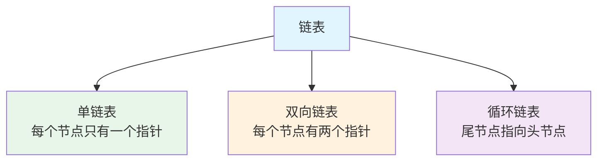
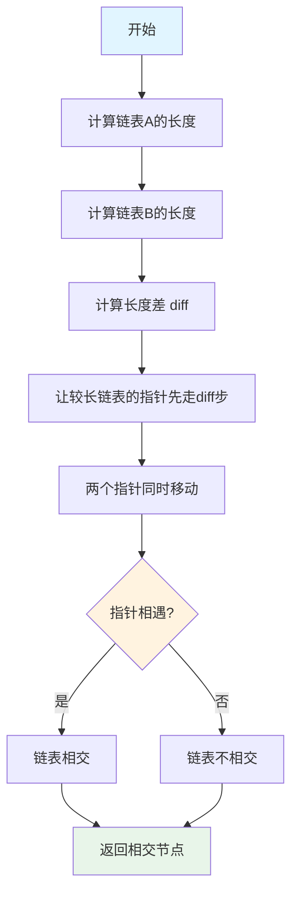
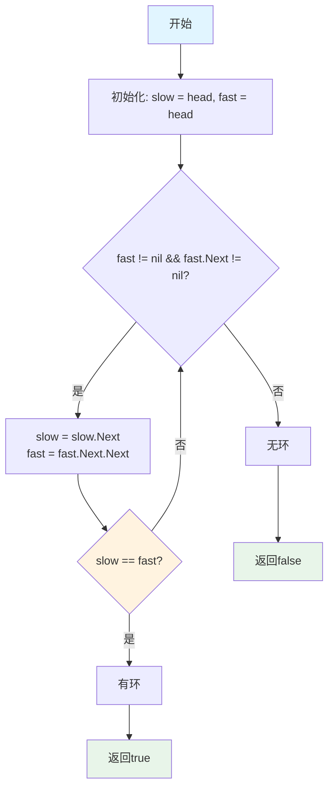
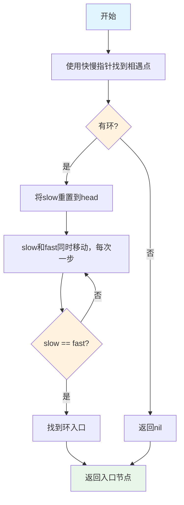
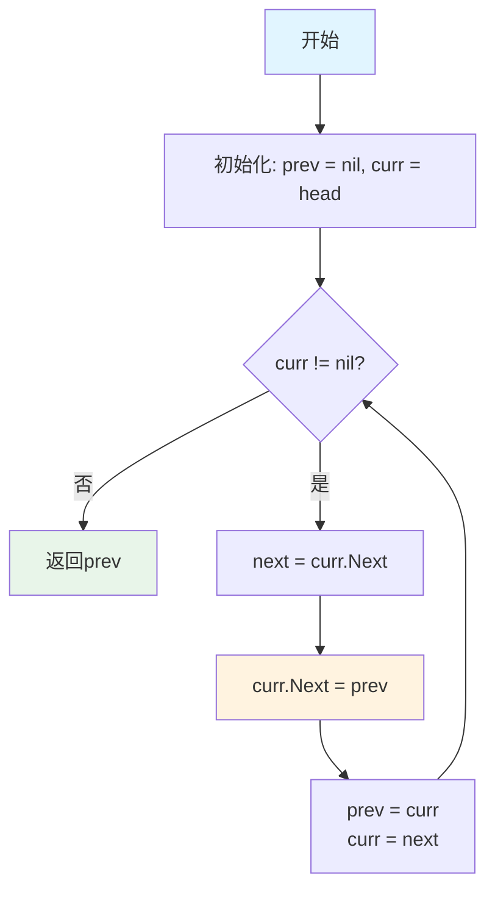
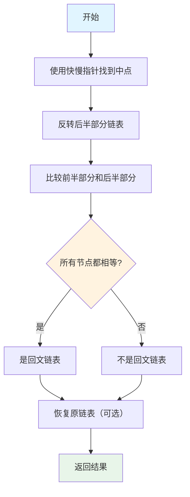
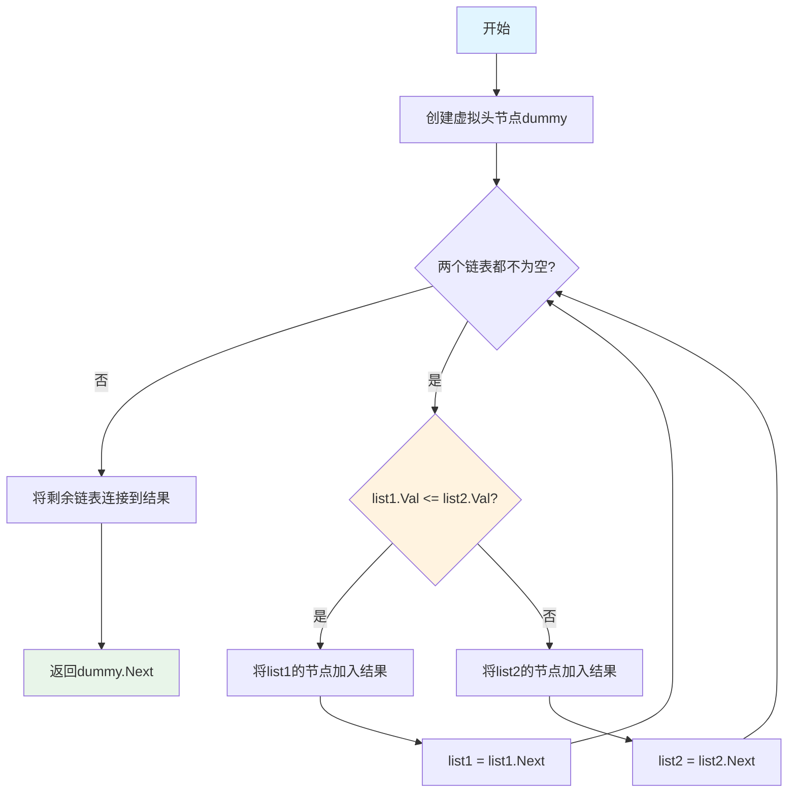

# 链表详解

本文详细介绍链表（Linked List）这种数据结构，包括单链表、双向链表的基本操作，以及链表相关的经典算法问题。

## 什么是链表？

链表是一种线性数据结构，通过指针将一系列节点连接起来。与数组不同，链表中的元素在内存中不是连续存储的。

### 链表的特点

- **动态大小**：可以根据需要动态分配内存
- **非连续存储**：节点在内存中不一定连续
- **插入/删除高效**：在已知位置插入或删除的时间复杂度为 O(1)
- **随机访问低效**：访问第 k 个元素需要 O(k) 时间

### 链表的分类



## 单链表

单链表（Singly Linked List）是最简单的链表形式，每个节点包含数据和指向下一个节点的指针。

### 节点定义

```go
// ListNode 单链表节点
type ListNode struct {
    Val  int
    Next *ListNode
}
```

### 基本操作

#### 1. 创建链表

```go
// NewListNode 创建新节点
func NewListNode(val int) *ListNode {
    return &ListNode{Val: val, Next: nil}
}

// CreateList 根据数组创建链表
func CreateList(vals []int) *ListNode {
    if len(vals) == 0 {
        return nil
    }
    
    head := NewListNode(vals[0])
    curr := head
    for i := 1; i < len(vals); i++ {
        curr.Next = NewListNode(vals[i])
        curr = curr.Next
    }
    return head
}
```

#### 2. 遍历链表

```go
// Traverse 遍历链表
func Traverse(head *ListNode) []int {
    var result []int
    curr := head
    for curr != nil {
        result = append(result, curr.Val)
        curr = curr.Next
    }
    return result
}
```

#### 3. 查找节点

```go
// FindNode 查找值为val的节点
func FindNode(head *ListNode, val int) *ListNode {
    curr := head
    for curr != nil {
        if curr.Val == val {
            return curr
        }
        curr = curr.Next
    }
    return nil
}

// GetNodeAt 获取第k个节点（从0开始）
func GetNodeAt(head *ListNode, k int) *ListNode {
    curr := head
    for i := 0; i < k && curr != nil; i++ {
        curr = curr.Next
    }
    return curr
}
```

#### 4. 插入节点

```go
// InsertAfter 在指定节点后插入
func InsertAfter(node *ListNode, val int) {
    if node == nil {
        return
    }
    newNode := NewListNode(val)
    newNode.Next = node.Next
    node.Next = newNode
}

// InsertAtHead 在链表头部插入
func InsertAtHead(head **ListNode, val int) {
    newNode := NewListNode(val)
    newNode.Next = *head
    *head = newNode
}
```

#### 5. 删除节点

```go
// DeleteNode 删除指定值的节点（只删除第一个）
func DeleteNode(head **ListNode, val int) bool {
    if *head == nil {
        return false
    }
    
    // 如果删除的是头节点
    if (*head).Val == val {
        *head = (*head).Next
        return true
    }
    
    curr := *head
    for curr.Next != nil {
        if curr.Next.Val == val {
            curr.Next = curr.Next.Next
            return true
        }
        curr = curr.Next
    }
    return false
}

// DeleteNodeAt 删除第k个节点（从0开始）
func DeleteNodeAt(head **ListNode, k int) bool {
    if k == 0 {
        if *head != nil {
            *head = (*head).Next
            return true
        }
        return false
    }
    
    curr := *head
    for i := 0; i < k-1 && curr != nil; i++ {
        curr = curr.Next
    }
    
    if curr == nil || curr.Next == nil {
        return false
    }
    
    curr.Next = curr.Next.Next
    return true
}
```

### 复杂度分析

| 操作 | 时间复杂度 | 空间复杂度 |
|------|-----------|-----------|
| 访问第k个元素 | O(k) | O(1) |
| 在头部插入 | O(1) | O(1) |
| 在尾部插入 | O(n) | O(1) |
| 在指定位置插入 | O(k) | O(1) |
| 删除节点 | O(n) | O(1) |
| 查找 | O(n) | O(1) |

## 双向链表

双向链表（Doubly Linked List）的每个节点包含两个指针，分别指向前一个节点和后一个节点。

### 节点定义

```go
// DoublyListNode 双向链表节点
type DoublyListNode struct {
    Val  int
    Prev *DoublyListNode
    Next *DoublyListNode
}
```

### 基本操作

#### 1. 创建双向链表

```go
// NewDoublyListNode 创建新节点
func NewDoublyListNode(val int) *DoublyListNode {
    return &DoublyListNode{Val: val, Prev: nil, Next: nil}
}

// CreateDoublyList 根据数组创建双向链表
func CreateDoublyList(vals []int) *DoublyListNode {
    if len(vals) == 0 {
        return nil
    }
    
    head := NewDoublyListNode(vals[0])
    curr := head
    for i := 1; i < len(vals); i++ {
        newNode := NewDoublyListNode(vals[i])
        curr.Next = newNode
        newNode.Prev = curr
        curr = newNode
    }
    return head
}
```

#### 2. 插入节点

```go
// InsertAfter 在指定节点后插入
func InsertAfter(node *DoublyListNode, val int) {
    if node == nil {
        return
    }
    newNode := NewDoublyListNode(val)
    newNode.Next = node.Next
    newNode.Prev = node
    if node.Next != nil {
        node.Next.Prev = newNode
    }
    node.Next = newNode
}

// InsertBefore 在指定节点前插入
func InsertBefore(node *DoublyListNode, val int) {
    if node == nil {
        return
    }
    newNode := NewDoublyListNode(val)
    newNode.Prev = node.Prev
    newNode.Next = node
    if node.Prev != nil {
        node.Prev.Next = newNode
    }
    node.Prev = newNode
}
```

#### 3. 删除节点

```go
// DeleteDoublyNode 删除指定节点
func DeleteDoublyNode(node *DoublyListNode) {
    if node == nil {
        return
    }
    
    if node.Prev != nil {
        node.Prev.Next = node.Next
    }
    if node.Next != nil {
        node.Next.Prev = node.Prev
    }
}
```

### 双向链表的优势

- **双向遍历**：可以从前往后或从后往前遍历
- **删除高效**：在已知节点的情况下，删除操作是 O(1)
- **插入灵活**：可以在节点前后插入

## 链表是否交叉

### 问题描述

判断两个单链表是否相交，如果相交，找出相交的起始节点。

### 算法原理

#### 方法 1：哈希表

使用哈希表存储第一个链表的所有节点，然后遍历第二个链表，检查是否有节点在哈希表中。

#### 方法 2：双指针（推荐）

1. 计算两个链表的长度
2. 让较长的链表先走 `|lenA - lenB|` 步
3. 两个指针同时移动，如果相遇则相交

#### 方法 3：连接链表

将两个链表首尾相连，如果相交，会形成环，问题转化为判断链表是否有环。

### 算法流程



### 实现代码

```go
// GetIntersectionNode 找到两个链表的相交节点
func GetIntersectionNode(headA, headB *ListNode) *ListNode {
    if headA == nil || headB == nil {
        return nil
    }
    
    // 计算两个链表的长度
    lenA := getLength(headA)
    lenB := getLength(headB)
    
    // 让较长的链表先走
    currA, currB := headA, headB
    if lenA > lenB {
        for i := 0; i < lenA-lenB; i++ {
            currA = currA.Next
        }
    } else {
        for i := 0; i < lenB-lenA; i++ {
            currB = currB.Next
        }
    }
    
    // 两个指针同时移动
    for currA != nil && currB != nil {
        if currA == currB {
            return currA
        }
        currA = currA.Next
        currB = currB.Next
    }
    
    return nil
}

// getLength 计算链表长度
func getLength(head *ListNode) int {
    length := 0
    curr := head
    for curr != nil {
        length++
        curr = curr.Next
    }
    return length
}

// GetIntersectionNodeHash 使用哈希表的方法
func GetIntersectionNodeHash(headA, headB *ListNode) *ListNode {
    visited := make(map[*ListNode]bool)
    
    // 遍历链表A，将所有节点加入哈希表
    curr := headA
    for curr != nil {
        visited[curr] = true
        curr = curr.Next
    }
    
    // 遍历链表B，查找相交节点
    curr = headB
    for curr != nil {
        if visited[curr] {
            return curr
        }
        curr = curr.Next
    }
    
    return nil
}
```

**时间复杂度**: O(m + n)，其中 m 和 n 是两个链表的长度  
**空间复杂度**: O(1)（双指针）或 O(m)（哈希表）

## 链表是否带环

### 问题描述

判断一个单链表是否有环（循环）。

### 算法原理：快慢指针（Floyd判圈算法）

使用两个指针，一个慢指针每次移动一步，一个快指针每次移动两步。如果链表有环，快慢指针最终会相遇。

### 算法流程



### 实现代码

```go
// HasCycle 判断链表是否有环
func HasCycle(head *ListNode) bool {
    if head == nil || head.Next == nil {
        return false
    }
    
    slow, fast := head, head
    
    for fast != nil && fast.Next != nil {
        slow = slow.Next
        fast = fast.Next.Next
        
        if slow == fast {
            return true
        }
    }
    
    return false
}
```

**时间复杂度**: O(n)  
**空间复杂度**: O(1)

## 环入口节点

### 问题描述

如果链表有环，找出环的入口节点。

### 算法原理

1. 使用快慢指针找到相遇点
2. 将一个指针重置到链表头部
3. 两个指针同时移动，每次移动一步，相遇点即为环入口

**数学证明**：
- 设链表头到环入口的距离为 a
- 环入口到相遇点的距离为 b
- 相遇点到环入口的距离为 c
- 快指针走过的距离：a + b + n(b + c)
- 慢指针走过的距离：a + b
- 因为快指针速度是慢指针的2倍：2(a + b) = a + b + n(b + c)
- 化简得：a = (n-1)(b+c) + c
- 这意味着从链表头到环入口的距离等于从相遇点到环入口的距离

### 算法流程



### 实现代码

```go
// DetectCycle 检测环并返回环入口节点
func DetectCycle(head *ListNode) *ListNode {
    if head == nil || head.Next == nil {
        return nil
    }
    
    // 第一步：找到相遇点
    slow, fast := head, head
    for fast != nil && fast.Next != nil {
        slow = slow.Next
        fast = fast.Next.Next
        if slow == fast {
            break
        }
    }
    
    // 如果没有环
    if fast == nil || fast.Next == nil {
        return nil
    }
    
    // 第二步：找到环入口
    slow = head
    for slow != fast {
        slow = slow.Next
        fast = fast.Next
    }
    
    return slow
}
```

**时间复杂度**: O(n)  
**空间复杂度**: O(1)

## 反转链表

### 问题描述

反转一个单链表。

### 算法原理

#### 方法 1：迭代法

使用三个指针：prev、curr、next，逐个反转节点。

#### 方法 2：递归法

递归地反转后面的链表，然后将当前节点连接到反转后的链表。

### 算法流程（迭代法）



### 实现代码

```go
// ReverseList 反转链表（迭代法）
func ReverseList(head *ListNode) *ListNode {
    var prev *ListNode
    curr := head
    
    for curr != nil {
        next := curr.Next
        curr.Next = prev
        prev = curr
        curr = next
    }
    
    return prev
}

// ReverseListRecursive 反转链表（递归法）
func ReverseListRecursive(head *ListNode) *ListNode {
    if head == nil || head.Next == nil {
        return head
    }
    
    // 递归反转后面的链表
    newHead := ReverseListRecursive(head.Next)
    
    // 将当前节点连接到反转后的链表
    head.Next.Next = head
    head.Next = nil
    
    return newHead
}

// ReverseListBetween 反转链表的指定区间（LeetCode 92）
func ReverseListBetween(head *ListNode, left int, right int) *ListNode {
    if head == nil || left == right {
        return head
    }
    
    dummy := &ListNode{Next: head}
    prev := dummy
    
    // 找到left的前一个节点
    for i := 0; i < left-1; i++ {
        prev = prev.Next
    }
    
    // 反转区间内的节点
    curr := prev.Next
    for i := 0; i < right-left; i++ {
        next := curr.Next
        curr.Next = next.Next
        next.Next = prev.Next
        prev.Next = next
    }
    
    return dummy.Next
}
```

**时间复杂度**: O(n)  
**空间复杂度**: O(1)（迭代）或 O(n)（递归）

## 判断是否是回文链表

### 问题描述

判断一个单链表是否为回文链表。

### 算法原理

#### 方法 1：转换为数组

将链表转换为数组，然后判断数组是否为回文。

#### 方法 2：快慢指针 + 反转（推荐）

1. 使用快慢指针找到链表中点
2. 反转后半部分链表
3. 比较前半部分和反转后的后半部分

### 算法流程



### 实现代码

```go
// IsPalindrome 判断链表是否为回文（方法1：转换为数组）
func IsPalindrome(head *ListNode) bool {
    var vals []int
    curr := head
    for curr != nil {
        vals = append(vals, curr.Val)
        curr = curr.Next
    }
    
    // 判断数组是否为回文
    left, right := 0, len(vals)-1
    for left < right {
        if vals[left] != vals[right] {
            return false
        }
        left++
        right--
    }
    return true
}

// IsPalindromeOptimized 判断链表是否为回文（方法2：快慢指针+反转）
func IsPalindromeOptimized(head *ListNode) bool {
    if head == nil || head.Next == nil {
        return true
    }
    
    // 找到链表中点
    slow, fast := head, head
    for fast.Next != nil && fast.Next.Next != nil {
        slow = slow.Next
        fast = fast.Next.Next
    }
    
    // 反转后半部分
    secondHalf := ReverseList(slow.Next)
    
    // 比较前半部分和后半部分
    p1, p2 := head, secondHalf
    isPalindrome := true
    for p2 != nil {
        if p1.Val != p2.Val {
            isPalindrome = false
            break
        }
        p1 = p1.Next
        p2 = p2.Next
    }
    
    // 恢复原链表（可选）
    slow.Next = ReverseList(secondHalf)
    
    return isPalindrome
}
```

**时间复杂度**: O(n)  
**空间复杂度**: O(n)（方法1）或 O(1)（方法2）

## 合并有序链表

### 问题描述

将两个有序链表合并为一个新的有序链表。

### 算法原理

使用双指针，比较两个链表的节点值，将较小的节点连接到结果链表。

### 算法流程



### 实现代码

```go
// MergeTwoLists 合并两个有序链表（迭代法）
func MergeTwoLists(list1 *ListNode, list2 *ListNode) *ListNode {
    dummy := &ListNode{}
    curr := dummy
    
    for list1 != nil && list2 != nil {
        if list1.Val <= list2.Val {
            curr.Next = list1
            list1 = list1.Next
        } else {
            curr.Next = list2
            list2 = list2.Next
        }
        curr = curr.Next
    }
    
    // 连接剩余部分
    if list1 != nil {
        curr.Next = list1
    } else {
        curr.Next = list2
    }
    
    return dummy.Next
}

// MergeTwoListsRecursive 合并两个有序链表（递归法）
func MergeTwoListsRecursive(list1 *ListNode, list2 *ListNode) *ListNode {
    if list1 == nil {
        return list2
    }
    if list2 == nil {
        return list1
    }
    
    if list1.Val <= list2.Val {
        list1.Next = MergeTwoListsRecursive(list1.Next, list2)
        return list1
    } else {
        list2.Next = MergeTwoListsRecursive(list1, list2.Next)
        return list2
    }
}

// MergeKLists 合并K个有序链表（LeetCode 23）
func MergeKLists(lists []*ListNode) *ListNode {
    if len(lists) == 0 {
        return nil
    }
    
    // 使用分治法
    return mergeKListsHelper(lists, 0, len(lists)-1)
}

func mergeKListsHelper(lists []*ListNode, left, right int) *ListNode {
    if left == right {
        return lists[left]
    }
    if left > right {
        return nil
    }
    
    mid := (left + right) / 2
    list1 := mergeKListsHelper(lists, left, mid)
    list2 := mergeKListsHelper(lists, mid+1, right)
    
    return MergeTwoLists(list1, list2)
}
```

**时间复杂度**: O(m + n)，其中 m 和 n 是两个链表的长度  
**空间复杂度**: O(1)（迭代）或 O(m + n)（递归）

## 其他经典问题

### 1. 删除链表的倒数第N个节点

```go
// RemoveNthFromEnd 删除链表的倒数第N个节点（LeetCode 19）
func RemoveNthFromEnd(head *ListNode, n int) *ListNode {
    dummy := &ListNode{Next: head}
    first, second := dummy, dummy
    
    // 让first先走n+1步
    for i := 0; i <= n; i++ {
        first = first.Next
    }
    
    // 两个指针同时移动
    for first != nil {
        first = first.Next
        second = second.Next
    }
    
    // 删除节点
    second.Next = second.Next.Next
    
    return dummy.Next
}
```

### 2. 两数相加

```go
// AddTwoNumbers 两数相加（LeetCode 2）
func AddTwoNumbers(l1 *ListNode, l2 *ListNode) *ListNode {
    dummy := &ListNode{}
    curr := dummy
    carry := 0
    
    for l1 != nil || l2 != nil || carry != 0 {
        sum := carry
        if l1 != nil {
            sum += l1.Val
            l1 = l1.Next
        }
        if l2 != nil {
            sum += l2.Val
            l2 = l2.Next
        }
        
        carry = sum / 10
        curr.Next = &ListNode{Val: sum % 10}
        curr = curr.Next
    }
    
    return dummy.Next
}
```

### 3. 旋转链表

```go
// RotateRight 旋转链表（LeetCode 61）
func RotateRight(head *ListNode, k int) *ListNode {
    if head == nil || head.Next == nil || k == 0 {
        return head
    }
    
    // 计算链表长度
    length := 1
    tail := head
    for tail.Next != nil {
        length++
        tail = tail.Next
    }
    
    // 计算实际需要旋转的步数
    k = k % length
    if k == 0 {
        return head
    }
    
    // 找到新的尾节点
    newTail := head
    for i := 0; i < length-k-1; i++ {
        newTail = newTail.Next
    }
    
    // 旋转
    newHead := newTail.Next
    newTail.Next = nil
    tail.Next = head
    
    return newHead
}
```

### 4. 交换相邻节点

```go
// SwapPairs 两两交换链表中的节点（LeetCode 24）
func SwapPairs(head *ListNode) *ListNode {
    dummy := &ListNode{Next: head}
    prev := dummy
    
    for prev.Next != nil && prev.Next.Next != nil {
        first := prev.Next
        second := prev.Next.Next
        
        // 交换
        prev.Next = second
        first.Next = second.Next
        second.Next = first
        
        prev = first
    }
    
    return dummy.Next
}
```

## 复杂度总结

| 操作 | 时间复杂度 | 空间复杂度 |
|------|-----------|-----------|
| 访问第k个元素 | O(k) | O(1) |
| 在头部插入 | O(1) | O(1) |
| 在尾部插入 | O(n) | O(1) |
| 删除节点 | O(n) | O(1) |
| 反转链表 | O(n) | O(1) |
| 判断回文 | O(n) | O(1) |
| 合并链表 | O(m+n) | O(1) |
| 判断是否有环 | O(n) | O(1) |

## 链表 vs 数组

| 特性 | 链表 | 数组 |
|------|------|------|
| 内存分配 | 动态 | 静态/动态 |
| 内存布局 | 非连续 | 连续 |
| 随机访问 | O(n) | O(1) |
| 插入/删除 | O(1)（已知位置） | O(n) |
| 缓存友好性 | 差 | 好 |
| 空间开销 | 每个节点需要额外指针 | 只需存储数据 |

## 应用场景

1. **实现栈和队列**：使用链表可以高效地实现栈和队列
2. **内存管理**：操作系统中的内存分配使用链表结构
3. **图算法**：图的邻接表表示使用链表
4. **LRU缓存**：使用双向链表实现LRU缓存
5. **多项式运算**：使用链表存储多项式的系数和指数

## 总结

1. **链表的特点**：动态大小、非连续存储、插入/删除高效
2. **基本操作**：创建、遍历、插入、删除
3. **经典问题**：
   - 反转链表
   - 判断回文
   - 检测环
   - 合并链表
   - 删除倒数第N个节点
4. **技巧**：
   - 使用虚拟头节点简化操作
   - 快慢指针解决环相关问题
   - 双指针解决相交问题

掌握链表的基本操作和经典算法对于解决很多问题都非常有帮助！
