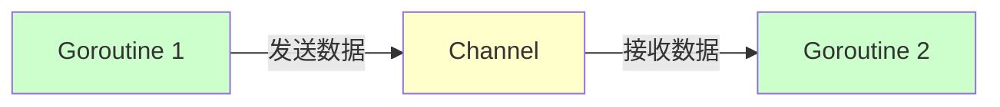
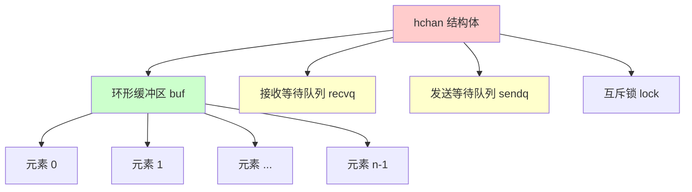
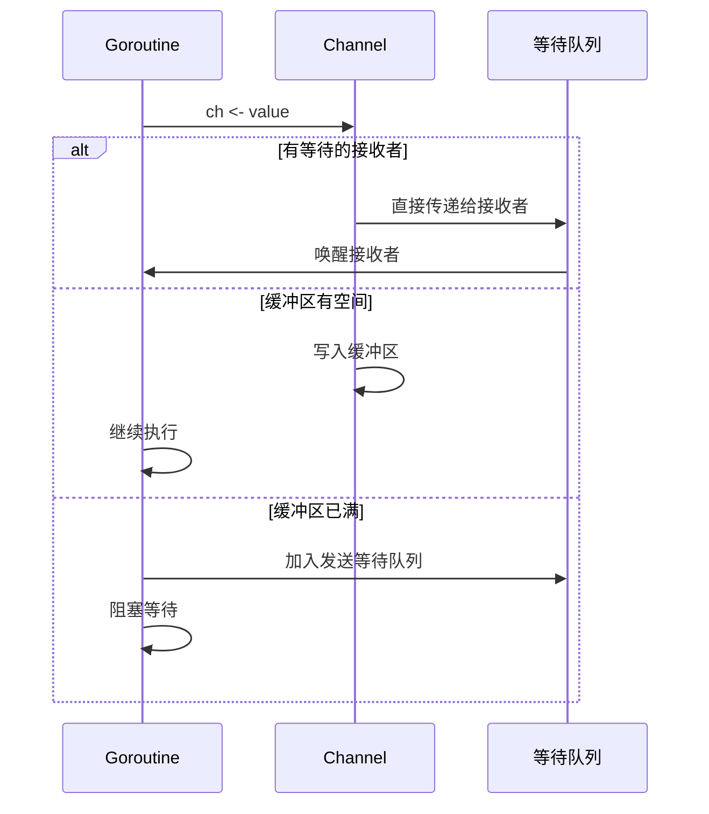
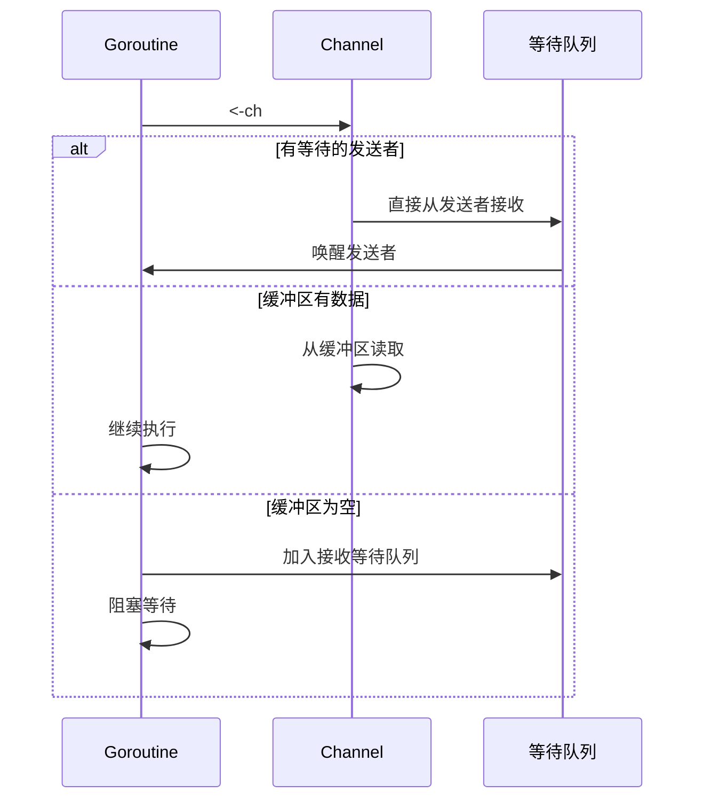

推荐阅读：[Go Channel Source Code](https://go.dev/src/runtime/chan.go)

# Channel 概述

Channel 是 Go 语言中用于 goroutine 之间通信的机制，是 Go 语言并发编程的核心组件之一。Channel 提供了一种类型安全、线程安全的方式来传递数据和同步执行。

## 设计理念

Channel 遵循 CSP（Communicating Sequential Processes）模型，核心思想是：**"不要通过共享内存来通信，而要通过通信来共享内存"**。



## Channel 的特点

- ✅ **类型安全**：编译时检查类型
- ✅ **线程安全**：多个 goroutine 可以安全地并发访问
- ✅ **阻塞机制**：自动处理阻塞和唤醒
- ✅ **同步原语**：可以用于同步多个 goroutine

---

# 基本用法

## Channel 的定义和创建

### 声明 Channel

```go
// 声明一个 channel（nil channel，不能直接使用）
var ch chan int

// 使用 make 创建 channel
ch := make(chan int)        // 无缓冲 channel
ch := make(chan int, 10)    // 有缓冲 channel，缓冲区大小为 10
```

### 无缓冲 Channel

无缓冲 channel 的容量为 0，发送和接收操作必须同时准备好，否则会阻塞。

```go
func main() {
    ch := make(chan int)  // 无缓冲 channel
    
    go func() {
        ch <- 42  // 发送数据，会阻塞直到有接收者
        fmt.Println("数据已发送")
    }()
    
    value := <-ch  // 接收数据，会阻塞直到有发送者
    fmt.Println("接收到数据:", value)
}
```

### 有缓冲 Channel

有缓冲 channel 有一个固定大小的缓冲区，只有当缓冲区满时发送才会阻塞，只有当缓冲区空时接收才会阻塞。

```go
func main() {
    ch := make(chan int, 3)  // 缓冲区大小为 3
    
    // 可以连续发送 3 个值而不阻塞
    ch <- 1
    ch <- 2
    ch <- 3
    
    // 第 4 个发送会阻塞，因为缓冲区已满
    // ch <- 4  // 这会阻塞
    
    // 接收数据
    fmt.Println(<-ch)  // 1
    fmt.Println(<-ch)  // 2
    fmt.Println(<-ch)  // 3
}
```

## 发送和接收操作

### 基本语法

```go
ch <- value    // 发送 value 到 channel
value := <-ch  // 从 channel 接收值
<-ch          // 接收值但丢弃（用于同步）
```

### 发送操作

```go
ch := make(chan int)

// 发送操作
ch <- 42

// 发送操作会阻塞的情况：
// 1. 无缓冲 channel：直到有接收者准备好
// 2. 有缓冲 channel：直到缓冲区有空间
```

### 接收操作

```go
ch := make(chan int)

// 方式1：接收值并赋值
value := <-ch

// 方式2：接收值并检查 channel 是否关闭
value, ok := <-ch
if !ok {
    fmt.Println("channel 已关闭")
}

// 方式3：只接收，丢弃值（用于同步）
<-ch
```

## Channel 的方向

Channel 可以是单向的（只发送或只接收），用于限制函数的行为。

```go
// 只发送 channel
func sendOnly(ch chan<- int) {
    ch <- 42
    // <-ch  // 编译错误：不能接收
}

// 只接收 channel
func receiveOnly(ch <-chan int) {
    value := <-ch
    // ch <- 42  // 编译错误：不能发送
}

// 双向 channel 可以转换为单向 channel
func main() {
    ch := make(chan int)
    go sendOnly(ch)
    go receiveOnly(ch)
}
```

---

# Channel 的关闭

## 关闭 Channel

使用 `close()` 函数关闭 channel。关闭 channel 后，不能再向 channel 发送数据，但可以继续接收已发送的数据。

```go
ch := make(chan int, 3)

ch <- 1
ch <- 2
ch <- 3

close(ch)  // 关闭 channel

// ch <- 4  // panic: send on closed channel
```

## 检测 Channel 是否关闭

接收操作可以返回两个值：接收到的值和 channel 是否已关闭的布尔值。

```go
ch := make(chan int)

go func() {
    ch <- 1
    ch <- 2
    close(ch)
}()

for {
    value, ok := <-ch
    if !ok {
        fmt.Println("channel 已关闭")
        break
    }
    fmt.Println("接收到:", value)
}
```

## 关闭 Channel 的原则

1. **只有发送者应该关闭 channel**，接收者不应该关闭
2. **不要关闭已关闭的 channel**，会导致 panic
3. **关闭 nil channel 会导致 panic**

```go
// 正确的关闭方式
func producer(ch chan<- int) {
    defer close(ch)  // 使用 defer 确保关闭
    for i := 0; i < 10; i++ {
        ch <- i
    }
}

func consumer(ch <-chan int) {
    for value := range ch {  // range 会自动检测关闭
        fmt.Println(value)
    }
}
```

---

# Select 语句

## Select 基本用法

`select` 语句用于在多个 channel 操作中选择一个执行，类似于 `switch`，但专门用于 channel。

```go
select {
case ch1 <- value1:
    // 成功发送到 ch1
case value2 := <-ch2:
    // 成功从 ch2 接收
case <-time.After(time.Second):
    // 超时
default:
    // 所有 case 都不满足时执行（非阻塞）
}
```

## Select 的阻塞行为

```go
// 阻塞 select：所有 case 都会阻塞，直到有一个就绪
select {
case ch1 <- 1:
    fmt.Println("发送到 ch1")
case value := <-ch2:
    fmt.Println("从 ch2 接收:", value)
}

// 非阻塞 select：使用 default
select {
case ch <- 1:
    fmt.Println("发送成功")
default:
    fmt.Println("发送失败，channel 已满")
}
```

## Select 的常见模式

### 1. 超时控制

```go
func main() {
    ch := make(chan string)
    
    go func() {
        time.Sleep(2 * time.Second)
        ch <- "结果"
    }()
    
    select {
    case result := <-ch:
        fmt.Println("收到结果:", result)
    case <-time.After(1 * time.Second):
        fmt.Println("超时")
    }
}
```

### 2. 取消操作

```go
func main() {
    done := make(chan struct{})
    
    go func() {
        // 执行长时间操作
        for {
            select {
            case <-done:
                fmt.Println("操作被取消")
                return
            default:
                // 执行工作
                time.Sleep(100 * time.Millisecond)
            }
        }
    }()
    
    time.Sleep(500 * time.Millisecond)
    close(done)  // 取消操作
    time.Sleep(100 * time.Millisecond)
}
```

### 3. 多路复用

```go
func main() {
    ch1 := make(chan int)
    ch2 := make(chan int)
    
    go func() {
        for i := 0; i < 5; i++ {
            ch1 <- i
            time.Sleep(100 * time.Millisecond)
        }
        close(ch1)
    }()
    
    go func() {
        for i := 10; i < 15; i++ {
            ch2 <- i
            time.Sleep(150 * time.Millisecond)
        }
        close(ch2)
    }()
    
    for {
        select {
        case v, ok := <-ch1:
            if !ok {
                ch1 = nil  // 禁用这个 case
            } else {
                fmt.Println("从 ch1 接收:", v)
            }
        case v, ok := <-ch2:
            if !ok {
                ch2 = nil  // 禁用这个 case
            } else {
                fmt.Println("从 ch2 接收:", v)
            }
        }
        
        if ch1 == nil && ch2 == nil {
            break
        }
    }
}
```

---

# Range 遍历 Channel

使用 `range` 可以遍历 channel，当 channel 关闭时，循环会自动结束。

```go
func main() {
    ch := make(chan int)
    
    go func() {
        for i := 0; i < 5; i++ {
            ch <- i
        }
        close(ch)  // 必须关闭，否则 range 会一直阻塞
    }()
    
    // range 会自动检测 channel 是否关闭
    for value := range ch {
        fmt.Println(value)
    }
    // 输出：0 1 2 3 4
}
```

## Range 的等价写法

```go
// 这两种写法等价
for value := range ch {
    fmt.Println(value)
}

// 等价于
for {
    value, ok := <-ch
    if !ok {
        break
    }
    fmt.Println(value)
}
```

---

# Channel 的底层实现

## hchan 结构体

Channel 的底层实现是 `hchan` 结构体，定义在 `runtime/chan.go` 中。

```go
type hchan struct {
    qcount   uint           // 队列中数据个数
    dataqsiz uint           // 环形队列的长度
    buf      unsafe.Pointer // 指向环形队列的指针
    elemsize uint16         // 元素大小
    closed   uint32         // 关闭标志
    elemtype *_type         // 元素类型
    sendx    uint           // 发送索引
    recvx    uint           // 接收索引
    recvq    waitq          // 接收等待队列
    sendq    waitq          // 发送等待队列
    
    lock mutex              // 互斥锁
}
```

### 关键字段说明

- **buf**：有缓冲 channel 的环形队列
- **qcount**：队列中元素数量
- **dataqsiz**：队列容量
- **sendx/recvx**：发送/接收索引
- **recvq/sendq**：等待接收/发送的 goroutine 队列
- **lock**：保护 channel 的互斥锁

## Channel 的内存布局



## 发送操作流程



## 接收操作流程



## 源码分析

### 发送操作（chansend）

```go
// runtime/chan.go
func chansend(c *hchan, ep unsafe.Pointer, block bool, callerpc uintptr) bool {
    // 1. 检查 channel 是否为 nil
    if c == nil {
        if !block {
            return false
        }
        gopark(...)  // 阻塞
    }
    
    // 2. 快速路径：非阻塞且缓冲区已满
    if !block && c.closed == 0 && full(c) {
        return false
    }
    
    lock(&c.lock)
    
    // 3. 检查 channel 是否已关闭
    if c.closed != 0 {
        unlock(&c.lock)
        panic("send on closed channel")
    }
    
    // 4. 如果有等待的接收者，直接传递
    if sg := c.recvq.dequeue(); sg != nil {
        send(c, sg, ep, func() { unlock(&c.lock) }, 3)
        return true
    }
    
    // 5. 如果缓冲区有空间，写入缓冲区
    if c.qcount < c.dataqsiz {
        qp := chanbuf(c, c.sendx)
        typedmemmove(c.elemtype, qp, ep)
        c.sendx++
        if c.sendx == c.dataqsiz {
            c.sendx = 0
        }
        c.qcount++
        unlock(&c.lock)
        return true
    }
    
    // 6. 阻塞等待
    if !block {
        unlock(&c.lock)
        return false
    }
    
    // 将当前 goroutine 加入发送等待队列
    gp := getg()
    mysg := acquireSudog()
    mysg.elem = ep
    mysg.waitlink = nil
    mysg.g = gp
    c.sendq.enqueue(mysg)
    gopark(chanparkcommit, unsafe.Pointer(&c.lock), waitReasonChanSend, traceEvGoBlockSend, 2)
    
    // 被唤醒后继续执行
    // ...
}
```

### 接收操作（chanrecv）

```go
// runtime/chan.go
func chanrecv(c *hchan, ep unsafe.Pointer, block bool) (selected, received bool) {
    // 1. 检查 channel 是否为 nil
    if c == nil {
        if !block {
            return
        }
        gopark(...)  // 阻塞
    }
    
    // 2. 快速路径：非阻塞且缓冲区为空
    if !block && empty(c) {
        if atomic.Load(&c.closed) == 0 {
            return
        }
        // channel 已关闭且为空
        if empty(c) {
            if ep != nil {
                typedmemclr(c.elemtype, ep)
            }
            return true, false
        }
    }
    
    lock(&c.lock)
    
    // 3. 检查 channel 是否已关闭且为空
    if c.closed != 0 && c.qcount == 0 {
        unlock(&c.lock)
        if ep != nil {
            typedmemclr(c.elemtype, ep)
        }
        return true, false
    }
    
    // 4. 如果有等待的发送者，直接从发送者接收
    if sg := c.sendq.dequeue(); sg != nil {
        recv(c, sg, ep, func() { unlock(&c.lock) }, 3)
        return true, true
    }
    
    // 5. 如果缓冲区有数据，从缓冲区读取
    if c.qcount > 0 {
        qp := chanbuf(c, c.recvx)
        if ep != nil {
            typedmemmove(c.elemtype, ep, qp)
        }
        typedmemclr(c.elemtype, qp)
        c.recvx++
        if c.recvx == c.dataqsiz {
            c.recvx = 0
        }
        c.qcount--
        unlock(&c.lock)
        return true, true
    }
    
    // 6. 阻塞等待
    if !block {
        unlock(&c.lock)
        return false, false
    }
    
    // 将当前 goroutine 加入接收等待队列
    gp := getg()
    mysg := acquireSudog()
    mysg.elem = ep
    mysg.waitlink = nil
    mysg.g = gp
    c.recvq.enqueue(mysg)
    gopark(chanparkcommit, unsafe.Pointer(&c.lock), waitReasonChanReceive, traceEvGoBlockRecv, 2)
    
    // 被唤醒后继续执行
    // ...
}
```

---

# Channel 的阻塞和非阻塞行为

## 阻塞行为

### 无缓冲 Channel

```go
// 发送操作会阻塞，直到有接收者
ch := make(chan int)
ch <- 1  // 阻塞，直到有接收者

// 接收操作会阻塞，直到有发送者
value := <-ch  // 阻塞，直到有发送者
```

### 有缓冲 Channel

```go
ch := make(chan int, 2)

ch <- 1  // 不阻塞
ch <- 2  // 不阻塞
ch <- 3  // 阻塞，缓冲区已满

value := <-ch  // 不阻塞，缓冲区有数据
value = <-ch   // 不阻塞
value = <-ch   // 阻塞，缓冲区为空
```

## 非阻塞操作

使用 `select` 的 `default` 分支可以实现非阻塞操作。

```go
// 非阻塞发送
select {
case ch <- value:
    fmt.Println("发送成功")
default:
    fmt.Println("发送失败，channel 已满")
}

// 非阻塞接收
select {
case value := <-ch:
    fmt.Println("接收成功:", value)
default:
    fmt.Println("接收失败，channel 为空")
}
```

## Nil Channel

对 nil channel 的操作会永远阻塞。

```go
var ch chan int  // nil channel

// 这些操作会永远阻塞
ch <- 1        // 阻塞
value := <-ch  // 阻塞
```

---

# Channel 的常见模式

## 1. 生产者-消费者模式

```go
func producer(ch chan<- int) {
    defer close(ch)
    for i := 0; i < 10; i++ {
        ch <- i
        time.Sleep(100 * time.Millisecond)
    }
}

func consumer(ch <-chan int) {
    for value := range ch {
        fmt.Println("消费:", value)
    }
}

func main() {
    ch := make(chan int, 5)
    go producer(ch)
    consumer(ch)
}
```

## 2. 工作池模式（Worker Pool）

```go
func worker(id int, jobs <-chan int, results chan<- int) {
    for job := range jobs {
        fmt.Printf("Worker %d 处理任务 %d\n", id, job)
        time.Sleep(time.Second)
        results <- job * 2
    }
}

func main() {
    jobs := make(chan int, 100)
    results := make(chan int, 100)
    
    // 启动 3 个 worker
    for w := 1; w <= 3; w++ {
        go worker(w, jobs, results)
    }
    
    // 发送任务
    for j := 1; j <= 5; j++ {
        jobs <- j
    }
    close(jobs)
    
    // 收集结果
    for r := 1; r <= 5; r++ {
        fmt.Println("结果:", <-results)
    }
}
```

## 3. 扇入模式（Fan-In）

将多个 channel 的数据合并到一个 channel。

```go
func fanIn(input1, input2 <-chan string) <-chan string {
    output := make(chan string)
    
    go func() {
        defer close(output)
        for {
            select {
            case msg := <-input1:
                output <- msg
            case msg := <-input2:
                output <- msg
            }
        }
    }()
    
    return output
}

func main() {
    ch1 := make(chan string)
    ch2 := make(chan string)
    
    go func() {
        for i := 0; i < 5; i++ {
            ch1 <- fmt.Sprintf("ch1-%d", i)
            time.Sleep(100 * time.Millisecond)
        }
        close(ch1)
    }()
    
    go func() {
        for i := 0; i < 5; i++ {
            ch2 <- fmt.Sprintf("ch2-%d", i)
            time.Sleep(150 * time.Millisecond)
        }
        close(ch2)
    }()
    
    for msg := range fanIn(ch1, ch2) {
        fmt.Println(msg)
    }
}
```

## 4. 扇出模式（Fan-Out）

将一个 channel 的数据分发到多个 channel。

```go
func fanOut(input <-chan int, outputs []chan<- int) {
    defer func() {
        for _, ch := range outputs {
            close(ch)
        }
    }()
    
    for value := range input {
        for _, ch := range outputs {
            ch <- value
        }
    }
}

func main() {
    input := make(chan int)
    outputs := make([]chan int, 3)
    
    for i := range outputs {
        outputs[i] = make(chan int)
        go func(id int, ch <-chan int) {
            for value := range ch {
                fmt.Printf("Worker %d 收到: %d\n", id, value)
            }
        }(i, outputs[i])
    }
    
    go func() {
        for i := 0; i < 10; i++ {
            input <- i
        }
        close(input)
    }()
    
    fanOut(input, outputs)
    time.Sleep(time.Second)
}
```

## 5. 管道模式（Pipeline）

将多个处理阶段串联起来。

```go
// 第一阶段：生成数字
func generate(nums ...int) <-chan int {
    out := make(chan int)
    go func() {
        for _, n := range nums {
            out <- n
        }
        close(out)
    }()
    return out
}

// 第二阶段：平方
func square(in <-chan int) <-chan int {
    out := make(chan int)
    go func() {
        for n := range in {
            out <- n * n
        }
        close(out)
    }()
    return out
}

// 第三阶段：打印
func print(in <-chan int) {
    for n := range in {
        fmt.Println(n)
    }
}

func main() {
    // 构建管道：generate -> square -> print
    numbers := generate(2, 3, 4)
    squared := square(numbers)
    print(squared)
}
```

## 6. 超时模式

```go
func doWork() <-chan string {
    result := make(chan string)
    go func() {
        defer close(result)
        time.Sleep(2 * time.Second)
        result <- "工作完成"
    }()
    return result
}

func main() {
    select {
    case result := <-doWork():
        fmt.Println(result)
    case <-time.After(1 * time.Second):
        fmt.Println("超时")
    }
}
```

## 7. 取消模式

```go
func worker(done <-chan struct{}) <-chan int {
    result := make(chan int)
    go func() {
        defer close(result)
        for i := 0; ; i++ {
            select {
            case <-done:
                return
            case result <- i:
                time.Sleep(100 * time.Millisecond)
            }
        }
    }()
    return result
}

func main() {
    done := make(chan struct{})
    result := worker(done)
    
    for i := 0; i < 5; i++ {
        fmt.Println(<-result)
    }
    
    close(done)  // 取消 worker
    time.Sleep(time.Second)
}
```

---

# Channel 与 Goroutine 的配合

## Goroutine 泄漏

未关闭的 channel 可能导致 goroutine 泄漏。

```go
// 错误示例：goroutine 泄漏
func leak() {
    ch := make(chan int)
    go func() {
        ch <- 1
    }()
    // 没有接收者，goroutine 永远阻塞
}

// 正确示例：使用 context 或 done channel
func noLeak() {
    ch := make(chan int)
    done := make(chan struct{})
    
    go func() {
        defer close(ch)
        for {
            select {
            case <-done:
                return
            case ch <- 1:
                time.Sleep(time.Second)
            }
        }
    }()
    
    // 使用 ch...
    
    close(done)  // 通知 goroutine 退出
    time.Sleep(100 * time.Millisecond)
}
```

## 等待多个 Goroutine 完成

```go
func main() {
    done := make(chan struct{})
    
    for i := 0; i < 10; i++ {
        go func(id int) {
            defer func() { done <- struct{}{} }()
            fmt.Printf("Goroutine %d 完成\n", id)
        }(i)
    }
    
    // 等待所有 goroutine 完成
    for i := 0; i < 10; i++ {
        <-done
    }
    fmt.Println("所有 goroutine 完成")
}
```

## 使用 sync.WaitGroup 替代

```go
import "sync"

func main() {
    var wg sync.WaitGroup
    
    for i := 0; i < 10; i++ {
        wg.Add(1)
        go func(id int) {
            defer wg.Done()
            fmt.Printf("Goroutine %d 完成\n", id)
        }(i)
    }
    
    wg.Wait()
    fmt.Println("所有 goroutine 完成")
}
```

---

# Channel 的性能考虑

## 性能特点

1. **无缓冲 channel**：同步通信，延迟低，但可能阻塞
2. **有缓冲 channel**：异步通信，吞吐量高，但占用内存
3. **Channel 操作有锁开销**：每次操作都需要获取锁

## 性能测试

```go
func BenchmarkUnbufferedChannel(b *testing.B) {
    ch := make(chan int)
    go func() {
        for i := 0; i < b.N; i++ {
            ch <- i
        }
        close(ch)
    }()
    for range ch {
    }
}

func BenchmarkBufferedChannel(b *testing.B) {
    ch := make(chan int, 100)
    go func() {
        for i := 0; i < b.N; i++ {
            ch <- i
        }
        close(ch)
    }()
    for range ch {
    }
}
```

## 优化建议

1. **合理选择缓冲区大小**：根据实际场景调整
2. **避免频繁创建 channel**：复用 channel
3. **使用 sync 包替代简单同步**：对于简单的同步，`sync.WaitGroup` 等可能更高效
4. **批量处理**：减少 channel 操作次数

---

# 最佳实践

## 1. 关闭 Channel 的原则

- ✅ 只有发送者应该关闭 channel
- ✅ 使用 `defer close(ch)` 确保关闭
- ✅ 接收者使用 `range` 或检查 `ok` 值

```go
func producer(ch chan<- int) {
    defer close(ch)  // 确保关闭
    for i := 0; i < 10; i++ {
        ch <- i
    }
}
```

## 2. 避免 Goroutine 泄漏

- ✅ 确保所有启动的 goroutine 都能退出
- ✅ 使用 `done` channel 或 `context` 控制 goroutine 生命周期
- ✅ 及时关闭不再使用的 channel

## 3. 合理使用缓冲

- ✅ 无缓冲 channel：用于同步
- ✅ 有缓冲 channel：用于异步通信，提高吞吐量
- ✅ 缓冲区大小：根据实际场景调整，不要过大

## 4. 使用 Select 处理多个 Channel

- ✅ 使用 `select` 处理多个 channel
- ✅ 使用 `nil` channel 禁用 case
- ✅ 使用 `default` 实现非阻塞操作

## 5. 错误处理

```go
func safeSend(ch chan<- int, value int) error {
    select {
    case ch <- value:
        return nil
    case <-time.After(time.Second):
        return fmt.Errorf("发送超时")
    }
}
```

---

# 常见问题和陷阱

## 1. 向已关闭的 Channel 发送数据

```go
ch := make(chan int)
close(ch)
ch <- 1  // panic: send on closed channel
```

## 2. 关闭已关闭的 Channel

```go
ch := make(chan int)
close(ch)
close(ch)  // panic: close of closed channel
```

## 3. 从 Nil Channel 接收数据

```go
var ch chan int  // nil
value := <-ch    // 永远阻塞
```

## 4. Range 遍历未关闭的 Channel

```go
ch := make(chan int)
go func() {
    for i := 0; i < 5; i++ {
        ch <- i
    }
    // 忘记关闭 channel
}()

for value := range ch {
    fmt.Println(value)
}
// range 会一直阻塞，等待更多数据
```

## 5. 死锁

```go
// 死锁示例
func main() {
    ch := make(chan int)
    ch <- 1      // 阻塞，等待接收者
    value := <-ch // 永远不会执行到这里
}
```

## 6. 竞态条件

虽然 channel 本身是线程安全的，但使用方式不当可能导致竞态条件。

```go
// 错误示例：竞态条件
var count int
ch := make(chan int)

go func() {
    for i := 0; i < 1000; i++ {
        ch <- 1
    }
}()

for i := 0; i < 1000; i++ {
    count += <-ch  // 可能有竞态条件
}
```

---

# 总结

Channel 是 Go 语言并发编程的核心组件，提供了类型安全、线程安全的通信机制。

## 关键要点

1. **Channel 类型**：无缓冲（同步）和有缓冲（异步）
2. **操作**：发送（`<-`）、接收（`<-`）、关闭（`close`）
3. **Select**：处理多个 channel 操作
4. **Range**：遍历 channel，自动检测关闭
5. **底层实现**：`hchan` 结构体，使用锁和等待队列
6. **常见模式**：生产者-消费者、工作池、扇入扇出、管道等

## 使用建议

- ✅ 遵循 CSP 模型：通过通信共享内存
- ✅ 合理选择缓冲大小
- ✅ 确保正确关闭 channel
- ✅ 避免 goroutine 泄漏
- ✅ 使用 select 处理多个 channel

## 参考资源

- [Go Channel Source Code](https://go.dev/src/runtime/chan.go)
- [Effective Go: Channels](https://go.dev/doc/effective_go#channels)
- [Go Concurrency Patterns](https://go.dev/blog/pipelines)
- [Go Blog: Advanced Go Concurrency Patterns](https://go.dev/blog/advanced-go-concurrency-patterns)
