推荐阅读：[runtime/panic.go](https://go.dev/src/runtime/panic.go)、[runtime/panic.go - defer](https://go.dev/src/runtime/panic.go)

# 概述

`defer`、`panic`、`recover` 是 Go 提供的延迟执行与异常恢复机制：

- **defer**：在当前函数返回前按 LIFO 顺序执行注册的函数，常用于清理资源；panic 时也会执行。
- **panic**：触发运行时异常，中断当前函数执行，转而去执行已注册的 defer，若未被 recover 则程序崩溃。
- **recover**：仅在 **defer 所调用的函数体内** 生效，用于恢复当前 goroutine 的 panic，使程序继续执行。

三者配合：panic 后只有 defer 会运行，因此 recover 必须写在 defer 里才能“接住” panic。

---

# defer

## 基本用法与语义

```go
func example() {
    defer fmt.Println("defer 1")
    defer fmt.Println("defer 2")
    fmt.Println("normal")
    // 输出：normal → defer 2 → defer 1（LIFO）
}
```

- 编译器将 `defer f(args)` 转为：注册阶段调用 `deferproc`，函数返回前插入 `deferreturn`。
- G 持有 defer 链表，新 defer 插在链表头，执行时从链表头取，实现 LIFO。

## 编译转换

Go 编译器会将 defer 语句转换为：**defer 注册**时调用 `deferproc`，**函数返回处**插入 `deferreturn`。返回值大于 0 表示发生 panic，用于 recover 机制。

### 编译器转换示例（概念）

```go
// 用户代码
func foo() {
    defer bar(1, 2)
    defer baz(x)
    // ...
    return
}

// 编译器展开后（概念，实际为 SSA/汇编）
func foo() {
    deferproc(16, &bar.fn)
    deferproc(8, &baz.fn)
    // ... 函数体 ...
    deferreturn()  // 每个 return 前都会插入
    return
}
// 执行时：先取链表头（baz），sp 匹配则执行 baz(x)，再取下一个（bar），再取到 sp 不匹配或 nil 则结束
```

## defer 链表结构

G 持有 defer 链表，新注册的 defer 插入链表头，执行时从链表头取，实现 LIFO。

## 核心结构体

```go
type funcval struct {
    fn uintptr  // 函数入口地址，后面可能紧跟闭包捕获变量（由编译器生成）
}

type _defer struct {
    siz     int32    // 参数和返回值共占字节数，空间紧跟 _defer 后
    started bool     // 是否已执行
    sp      uintptr  // 调用者函数栈指针，用于判断 defer 是否属于当前函数
    pc      uintptr  // deferproc 返回地址
    fn      *funcval // 注册函数指针
    _panic  *_panic  // 关联的 panic（panic 流程中设置）
    link    *_defer  // 链表下一个
    heap    bool     // 是否堆分配（Go 1.13+，false 表示栈上 _defer）
}

func add(p unsafe.Pointer, n uintptr) unsafe.Pointer {
    return unsafe.Pointer(uintptr(p) + n)
}

// G 中
type g struct {
    _defer *_defer  // defer 链表头
}
```

## 注册：deferproc / deferprocStack

```go
// deferproc 由编译器在遇到 defer 语句时插入调用；siz 为参数+返回值字节数，argp 指向调用者栈上参数区
func deferproc(siz int32, fn *funcval) {
    if getg().m.curg != getg() {
        throw("defer on system stack")
    }
    sp := getcallersp()
    argp := uintptr(unsafe.Pointer(&fn)) + unsafe.Sizeof(fn)
    d := newdefer(siz)
    if d._panic != nil {
        throw("deferproc: d.panic != nil after newdefer")
    }
    d.fn = fn
    d.pc = getcallerpc()
    d.sp = sp
    d.siz = siz
    d.started = false
    if siz > 0 {
        deferArgs := add(unsafe.Pointer(d), unsafe.Sizeof(*d))
        memmove(deferArgs, unsafe.Pointer(argp), uintptr(siz))
    }
    d.link = getg()._defer
    getg()._defer = d
    return0()
}

func newdefer(siz int32) *_defer {
    pp := getg().m.p.ptr()
    if pp.deferpool[siz] != nil {
        d := pp.deferpool[siz]
        pp.deferpool[siz] = d.link
        d.link = nil
        d.siz = siz
        d.heap = true
        return d
    }
    d := (*_defer)(mallocgc(unsafe.Sizeof(_defer{})+uintptr(siz), deferType, true))
    d.siz = siz
    d.heap = true
    return d
}

// 栈上 defer（Go 1.13+）
func deferprocStack(d *_defer) {
    d.started = false
    d.sp = getcallersp()
    d.pc = getcallerpc()
    d.heap = false
    d.link = getg()._defer
    getg()._defer = d
    return0()
}
```

## 执行：deferreturn

```go
// deferreturn 由编译器在函数每个返回路径前插入；只处理 d.sp == getcallersp() 的 defer
func deferreturn() {
    gp := getg()
    for {
        d := gp._defer
        if d == nil || d.sp != getcallersp() {
            break
        }
        if d.started {
            throw("deferreturn: already started")
        }
        d.started = true
        fn := d.fn
        argp := add(unsafe.Pointer(d), unsafe.Sizeof(*d))
        if d.siz > 0 {
            memmove(unsafe.Pointer(getcallersp()), argp, uintptr(d.siz))
        }
        gp._defer = d.link
        if d.heap {
            freedefer(d)
        }
        jmpdefer(fn, argp)  // 汇编：跳转 fn，返回时再次回到 deferreturn，实现循环
    }
}

func freedefer(d *_defer) {
    if !d.heap {
        return
    }
    siz := d.siz
    pp := getg().m.p.ptr()
    d.link = pp.deferpool[siz]
    pp.deferpool[siz] = d
}
```

## 闭包处理

若注册的函数有捕获列表（闭包），会创建闭包对象，将捕获变量堆分配并存入闭包结构。

## 执行完成判断

当前函数是否执行完所有 defer：看 defer 链表头节点的 `sp` 是否等于当前函数栈指针。

## 函数栈帧变化

- **栈上 defer（Go 1.13+）**：`_defer` 与参数空间在栈上，紧跟在局部变量后；G._defer 通过 link 指向栈上的 _defer。
- **堆上 defer（Go 1.12 及之前）**：`_defer` 在堆上，参数需从栈拷到堆，执行时再拷回栈。
- **栈指针 sp**：用于标识 defer 所属函数栈帧；deferreturn 只执行 `d.sp == getcallersp()` 的 defer。

### 栈上 defer 创建时的栈帧结构（Go 1.13+）

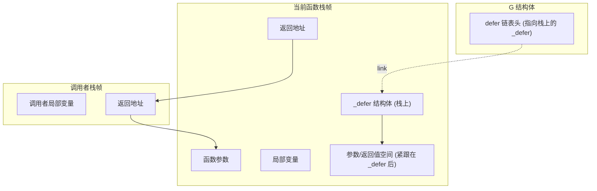

### 栈指针（sp）的作用

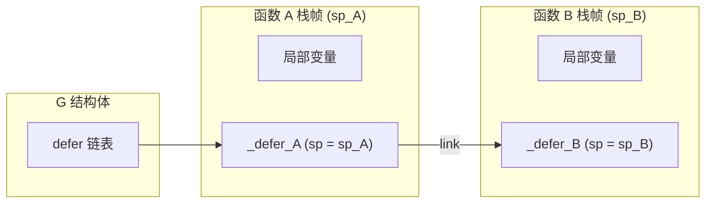

执行流程：函数 A 注册 _defer_A（sp = sp_A），再调用函数 B；B 注册 _defer_B（sp = sp_B）。B 返回时只执行 sp 匹配的 _defer_B；A 返回时执行 _defer_A。

### 栈帧内存布局对比：堆分配 vs 栈分配

**Go 1.12 及之前（堆分配）**：`_defer` 在堆上，参数需栈→堆→栈两次拷贝；G._defer 指向堆上的 _defer。

**Go 1.13+（栈分配）**：非循环、可静态确定的 defer 在栈上分配 `_defer`，参数紧跟其后，无拷贝；函数返回时栈帧（含 _defer）自动回收。

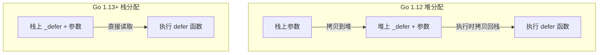

### 函数返回时栈帧的变化

函数返回前执行 defer 时，栈帧的变化过程：

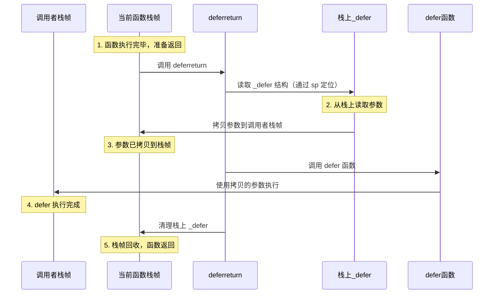

### 执行阶段的栈帧变化（步骤）

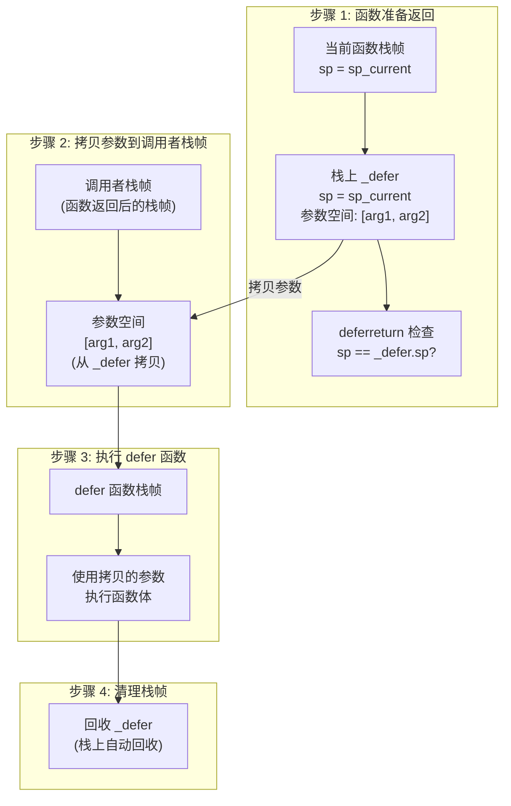

**说明**：参数从 `_defer` 后拷贝到调用者栈帧对应位置，再通过 `_defer.fn` 调用 defer 函数；执行完后栈帧（含栈上 _defer）自动回收。

## 注册阶段与执行阶段

- **注册**：defer 语句执行时触发 `deferproc`，参数拷到 `_defer` 后，插入 `G._defer` 链表头。
- **执行**：函数返回前（正常 return 或 panic）执行 `deferreturn`，按 sp 取当前函数的 defer，拷贝参数、调用 `fn`、回收；`jmpdefer` 使返回时再次回到 `deferreturn` 继续下一个。

## freedefer 与 defer 池

堆上分配的 `_defer` 执行完后归还到 P 的 `deferpool[siz]`，按 siz 分桶复用。

```go
// freedefer 将堆上分配的 _defer 归还到 P 的池中
func freedefer(d *_defer) {
    if !d.heap {
        return
    }
    siz := d.siz
    pp := getg().m.p.ptr()
    d.link = pp.deferpool[siz]
    pp.deferpool[siz] = d
}

// P 结构体中 defer 池（简化表示）
type p struct {
    // ...
    deferpool [numDeferSizes]*_defer  // 按 siz 分桶的 _defer 池
    // ...
}
```

## 流程图（defer）

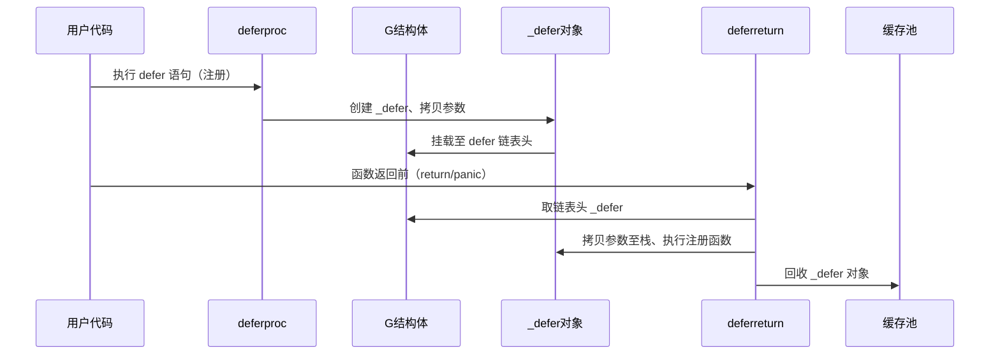

### defer 状态图

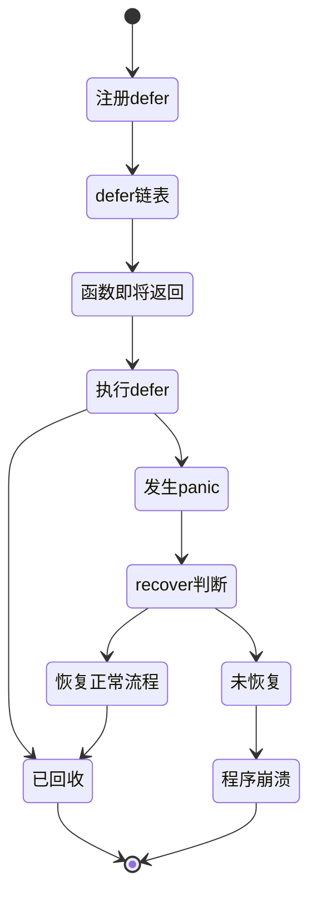

## 优化演进

- **Go 1.12 及之前**：所有 defer 堆分配，参数栈→堆→栈两次拷贝。
- **Go 1.13**：非循环、可静态确定的 defer 在栈上分配 `_defer`，参数在栈上，无拷贝；`heap` 字段区分栈/堆。
- **Go 1.14**：开放编码（open-coded）defer，≤8 个且非循环时在函数返回前直接内联执行，不创建 _defer；panic 时通过栈上 framepc/varp/fd 查找并执行未执行的开放编码 defer。

**开放编码 _defer 扩展字段**（与前述 _defer 可合并为同一结构）：

```go
type _defer struct {
    // ... 前述字段 ...
    openDefer bool         // 是否为开放编码
    fd        unsafe.Pointer // 指向 deferBits 位图（栈上），每位对应一个内联 defer
    varp      uintptr      // 创建时的 varp，用于 panic 时定位栈上 defer 数据
    framepc   uintptr      // 创建时的 PC，用于 panic 时识别栈帧
}
```

- **正常返回**：编译器在返回前生成代码，根据 `fd` 指向的 deferBits 逐位检查，若为 1 则执行对应序号的 defer 并清零该位。
- **panic 处理**：开放编码的 defer 未全部执行时，需通过栈扫描（varp、framepc、fd）找到未执行的开放编码 defer 并执行，再执行链表上的传统 defer；recover 语义不变。

## 小结（defer）

- 注册：`deferproc` / `deferprocStack` 将参数拷到 `_defer` 后插入 `G._defer` 链表头。
- 执行：`deferreturn` 按 sp 只处理当前函数的 defer，拷贝参数、调用 `fn`、回收；`jmpdefer` 实现循环。
- 栈上 defer 无堆分配；Go 1.14+ 开放编码 defer 不创建 _defer，在返回前直接内联执行（≤8 个、非循环）。避免循环里 defer；单函数 defer 数量尽量 ≤8 以利用开放编码。

---

# panic

## 基本用法与语义

```go
func example() {
    panic("something went wrong")
    // 后续代码不执行，转而去执行当前函数及上层的 defer
}
```

- panic 会立即停止当前函数执行，将新的 `_panic` 头插到 G 的 panic 链表，然后沿 defer 链表执行（LIFO）。
- 若某层 defer 里调用了 `recover()` 并返回非 nil，则当前 panic 被恢复，程序从“正常流程”继续；否则一直向上直到崩溃。

## panic 结构体与链表

```go
type _panic struct {
    argp      unsafe.Pointer // defer 参数相关
    arg       interface{}   // panic 的参数（即 panic(v) 的 v）
    link      *_panic       // 链表下一个，新 panic 头插
    recovered bool          // 是否已被 recover
    aborted   bool          // 是否被终止（如 defer 中又 panic）
}

// G 中
type g struct {
    _panic *_panic  // panic 链表头，最新 panic 在头
}
```

- 新 panic 头插，所以链表头是最新 panic；输出堆栈时从尾到头（从早到晚）。

### panic 链表结构图

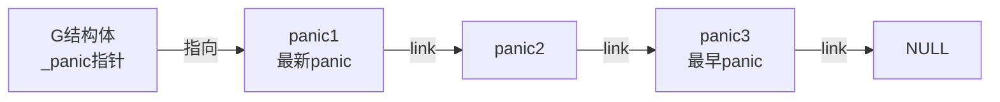

**说明**：新 panic 头插，链表头是最新 panic，链表尾是最早 panic；打印堆栈时从尾到头（从早到晚）。

## 执行流程概览

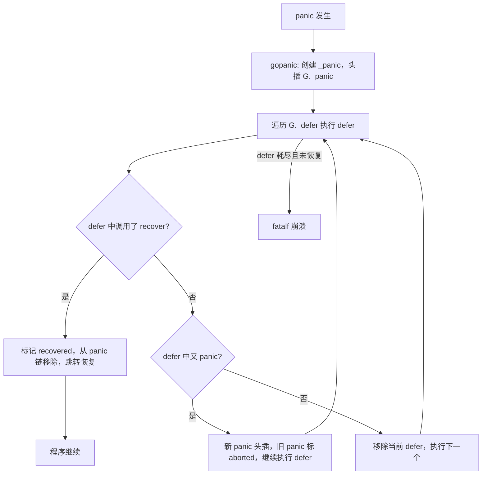

### panic 执行时序图

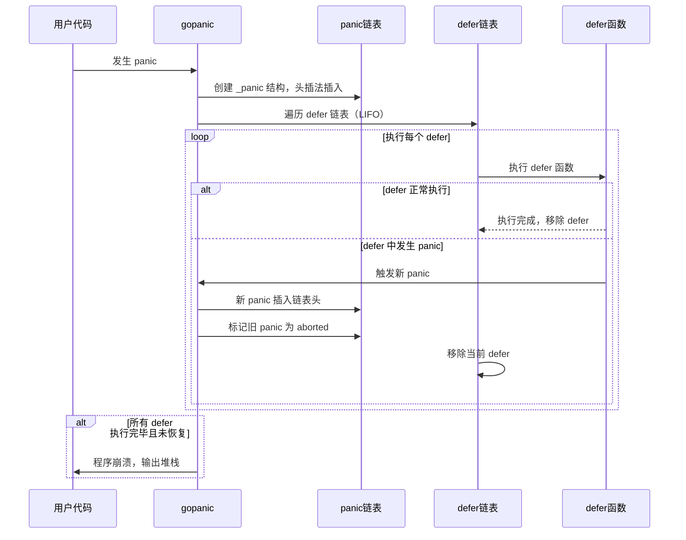

### panic 状态图

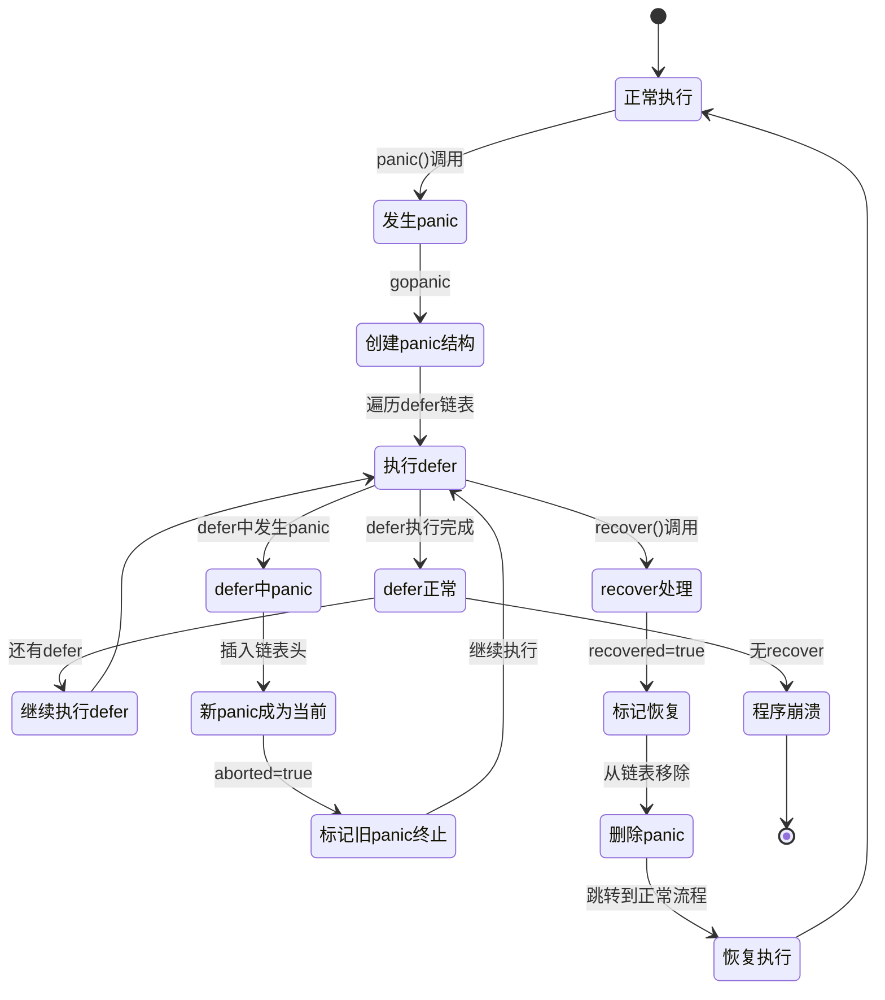

## 核心逻辑：gopanic

```go
func gopanic(e interface{}) {
    gp := getg()
    var p _panic
    p.arg = e
    p.link = gp._panic
    gp._panic = (*_panic)(noescape(unsafe.Pointer(&p)))

    for {
        d := gp._defer
        if d == nil {
            break  // 没有更多 defer，即将崩溃
        }
        if d.started {
            if d._panic != nil && d._panic.aborted {
                d._panic.aborted = false
            }
            d._panic = nil
            gp._defer = d.link
            freedefer(d)
            continue
        }
        d.started = true
        d._panic = (*_panic)(noescape(unsafe.Pointer(&p)))
        p.argp = unsafe.Pointer(getargp())
        // 调用 defer 函数（若其中调用 recover，会设置 p.recovered）
        reflectcall(nil, unsafe.Pointer(d.fn), deferArgs(d), uint32(d.siz), uint32(d.siz))
        d._panic = nil
        d.fn = nil
        gp._defer = d.link
        freedefer(d)
        if p.recovered {
            gp._panic = p.link
            if gp._panic != nil && gp._panic.goexit {
                goexit()
            }
            // 通过 sp/pc 跳转到恢复点，继续执行
            gorecover(p.argp)
            return
        }
    }
    fatalpanic(gp._panic)  // 未恢复，崩溃
}
```

- 每次执行 defer 前把当前 `_panic` 挂到 `d._panic`，defer 内若调用 `recover()`，会设置 `p.recovered = true` 并返回 panic 值。
- 若 `p.recovered` 为 true，则从链表摘下当前 panic，调用 `gorecover` 按保存的 sp/pc 跳转，恢复正常执行流。

## defer 中再次 panic

- 若在执行某个 defer 时又发生 panic，会再次进入 `gopanic`，新 `_panic` 头插。
- 当前正在执行的 defer 对应的旧 panic 会被标记为 `aborted`，该 defer 被移除，继续用新 panic 执行剩余 defer。

## panic 信息输出

- **输出顺序**：打印 panic 信息时从 panic 链表尾开始输出（即按 panic 发生顺序，从最早到最新）。
- **恢复标记**：若 panic 已被 recover，输出时会加上 `[recovered]` 标记。

```go
// 输出示例：defer 中先 recover 再 panic
panic: first panic
[recovered]
panic: second panic
```

---

# recover

## 基本用法与语义

```go
func example() {
    defer func() {
        if r := recover(); r != nil {
            fmt.Println("Recovered:", r)
        }
    }()
    panic("oops")
    // 程序不会崩溃，会打印 Recovered: oops
}
```

- `recover()` 只有在 **“被 defer 的函数”体内直接调用** 时才会返回当前 panic 的值，否则返回 `nil`。

## 为什么 recover 只能在 defer 中执行

1. **执行顺序**：panic 后当前函数后续代码都不会执行，只有已注册的 defer 会被执行。因此能观察到“正在 panic”且还会运行的代码只有 defer。
2. **语义**：运行时只在“从 panic 流程中执行 defer 函数”的上下文中，让 `recover()` 返回当前 G 的 panic 值；其它路径一律返回 `nil`。

所以必须把 `recover()` 写在 **defer 所调用的那个函数** 的函数体里。

### 时间顺序

```mermaid
flowchart TD
    A[正常执行] --> B[某行发生 panic]
    B --> C[当前函数内剩余代码被跳过]
    C --> D[开始执行当前函数的 defer]
    D --> E{某个 defer 里调用 recover()}
    E -->|是| F[捕获当前 panic，程序可恢复]
    E -->|否| G[继续向上执行上一层的 defer，直至崩溃]
```

### 简单对比：defer 里 vs 普通代码里

```go
// 无效：普通代码里调用 recover，无法捕获任何 panic
func noRecover() {
    if r := recover(); r != nil {
        fmt.Println("recovered", r)  // 不会执行
    }
    panic("oops")  // panic 后，上面的 recover 早已执行过了（返回 nil）
}

// 有效：在 defer 里调用 recover
func withDefer() {
    defer func() {
        if r := recover(); r != nil {
            fmt.Println("recovered", r)  // 会执行，输出 recovered oops
        }
    }()
    panic("oops")
}
```

## 为什么 defer recover() 和 defer func() { func() { recover() }() }() 无效

**规范要求**：recover 只有在“被某个 **deferred 函数直接调用**”时才会返回当前 panic 的值。“deferred 函数”指你通过 `defer` 注册的那个函数（如 `defer func() { ... }()` 里的匿名函数），而不是该函数内部调用的内置函数。

- **defer recover()**：被 defer 的是对 `recover` 的这一句调用本身，没有“另一个 deferred 函数在体内调用 recover”，不满足“被 deferred 函数**直接**调用”，`recover()` 返回 `nil`。
- **defer func() { func() { recover() }() }()**：被 defer 的是外层匿名函数，`recover()` 是在**内层**匿名函数里调用的，不是被 defer 的外层函数**直接**调用，同样返回 `nil`。中间多包一层函数调用就不算“直接调用”。

### 对比示例

```go
// 无效：defer 的是 recover 这一句调用本身
func bad() {
    defer recover()  // panic 时执行，但 recover() 返回 nil，panic 仍向上抛
    panic("oops")
}

// 有效：defer 的是匿名函数，recover 在该函数体内被直接调用
func good() {
    defer func() {
        _ = recover()  // 满足“被 deferred 函数直接调用”，可接住 panic
    }()
    panic("oops")
}
```

| 写法 | 谁直接调用了 recover | 是否生效 |
|------|----------------------|----------|
| `defer recover()` | 无 | 否 |
| `defer func() { func() { recover() }() }()` | 内层函数 | 否 |
| `defer func() { recover() }()` | 被 defer 的匿名函数 | 是 |

## 核心逻辑：gorecover

```go
func gorecover(argp uintptr) interface{} {
    gp := getg()
    p := gp._panic
    if p != nil && !p.recovered && argp == uintptr(p.argp) {
        p.recovered = true
        return p.arg
    }
    return nil
}
```

- 仅在当前 G 有 panic、且该 panic 未被恢复、且 `argp` 与创建该 panic 时的 argp 一致（即确实是在“对应”的 defer 调用栈中）时，标记 `recovered` 并返回 `p.arg`；否则返回 `nil`。
- `gopanic` 在每次执行 defer 后检查 `p.recovered`，若为 true 则摘下该 panic 并调用 `gorecover` 做栈恢复，程序从恢复点继续执行。

### recover 机制时序图

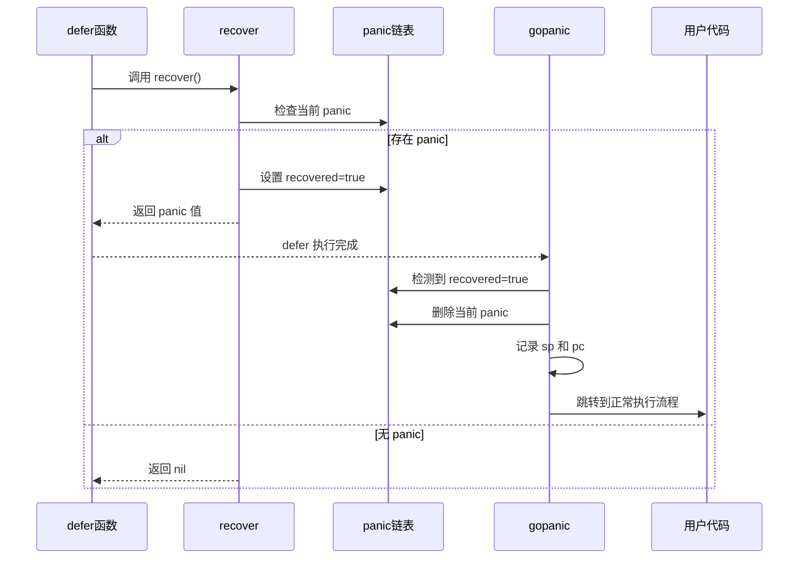

### recover 流程简图

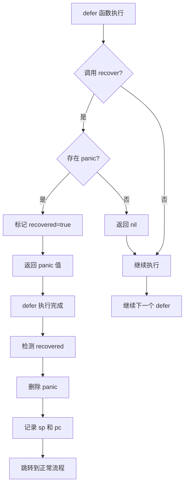

### recover 跳转：sp 与 pc

recover 后需要跳回“正常流程”，依赖 defer 记录的两个值：

- **sp**：调用 defer 函数的**调用者**的栈指针，用于恢复调用者的栈帧。
- **pc**：defer 注册时 `deferproc` 的返回地址，用于跳转到“defer 注册之后的下一句代码”，即 panic 发生前的正常执行点。

因此“恢复执行”的本质是：从 panic/defer 执行路径跳回原函数的某条指令（pc），并恢复对应栈帧（sp）。

**归纳**：recover 只能在 defer 中执行 = （1）执行顺序：panic 后只有 defer 会运行；（2）语义与实现：`recover()` 只有在“当前 G 正在 panic 且正在执行某个 deferred 函数的函数体”的上下文中、且由该函数体**直接**调用时，才会返回该 panic 的值；其它情况（包括 `defer recover()`、多包一层函数）一律返回 nil。

## recover 后又 panic

- 若在某个 defer 里先 `recover()` 再 `panic(...)`，等同于“defer 中发生 panic”：当前 defer 会被移除，新 panic 头插，继续执行剩余 defer。

---

# 三者联动与总结

## 联动关系

- **正常返回**：函数返回前执行 `deferreturn`，按 LIFO 执行当前函数的 defer，不涉及 panic/recover。
- **panic**：`gopanic` 创建 `_panic` 头插，然后按 G._defer 依次执行 defer；若某 defer 内**直接**调用 `recover()`，则 `gorecover` 标记恢复并返回 panic 值，`gopanic` 跳转恢复点，程序继续；否则 defer 耗尽后 `fatalpanic` 崩溃。
- **defer 中再 panic**：新 panic 头插，旧 panic 标 `aborted`，继续用新 panic 执行剩余 defer。
- **恢复后执行位置**：recover 成功后，程序从“发生 panic 的函数的**调用者**”继续执行（即带 recover 的 defer 返回后，控制流回到调用者），而不是从 panic 所在行继续执行。

## 最佳实践

1. **recover 只写在 defer 里**：且必须是被 defer 的那个函数的函数体里**直接**调用 `recover()`，不要 `defer recover()` 或再多包一层函数。
2. **合理使用 panic**：用于不可恢复的错误；可恢复的错误建议用 `error` 返回；避免滥用 panic。
3. **defer 尽量简单**：避免在 defer 里做重逻辑或再次 panic，以免掩盖问题。
4. **避免循环里 defer**：若需在循环中延迟逻辑，可提取到单独函数再 defer。
5. **及时处理 panic**：在可能发生 panic 的边界（如 HTTP handler、goroutine 入口）使用 defer + recover。
6. **记录错误信息**：在 recover 中记录 panic 值或堆栈，便于排查问题。
7. **单函数 defer 数量**：尽量 ≤8 个，以利用 Go 1.14+ 的开放编码优化。

## 注意事项

- panic/recover 只影响当前 goroutine，不能跨 goroutine 恢复。
- 未恢复的 panic 会导致程序崩溃并打印堆栈。
- 开放编码 defer（Go 1.14+）在 panic 时需通过栈扫描执行未执行的开放编码 defer，再执行链表上的 defer，recover 的语义不变。
