# 概述

`defer` 是 Go 语言提供的一种延迟执行机制，用于在当前函数执行结束之前执行另一个函数。defer 语句会在函数返回前按照后进先出（LIFO）的顺序执行。

# 基本用法

```go
func example() {
    defer fmt.Println("defer 1")
    defer fmt.Println("defer 2")
    fmt.Println("normal")
    // 输出：
    // normal
    // defer 2
    // defer 1
}
```

# 编译实现

## 编译转换

Go 编译器会将 defer 语句转换为以下形式：

1. **defer 注册**：调用 `deferproc` 函数进行 defer 函数注册
   - 返回值大于 0 表示发生 panic，用于 recover 机制
   
2. **defer 执行**：在函数返回处插入 `deferreturn` 函数调用

## defer 链表结构

G 结构体（goroutine 结构）持有 defer 链表，通过 `_defer` 指针指向 defer 链表。所有 defer 通过链表连接，新注册的 defer 会添加到链表头，执行时也是从头开始，实现后进先出（LIFO）的逻辑。

# defer 结构体

```go
type _defer struct {
    siz     int32    // 参数和返回值共占多少字节，具体空间会直接挂载在defer结构体后面，用于调用时快速赋值，执行时拷贝到调用者参数与返回值空间
    started bool    // 标记defer是否已经执行
    sp      uintptr // 调用者函数栈指针，用于判断函数自己注册的defer是否执行完毕
    pc      uintptr // 记录deferproc返回地址
    fn      *funcval // 注册函数指针
    _panic  *_panic // 关联panic信息
    link    *_defer // 用于挂载defer链表
}
```

## deferproc 函数

`deferproc` 函数用于注册 defer：

- **参数**：
  - `siz`：表示参数和返回值大小
  - `fn`：延迟执行函数指针

`deferproc` 函数会将栈上相应的值存储到 `_defer` 结构中。

## deferreturn 函数

`deferreturn` 执行时会将 defer 结构体中的参数拷贝到调用者栈帧上，然后通过注册的函数指针调用函数。

## 闭包处理

如果注册的函数拥有捕获列表（闭包），就会创建闭包对象，将捕获列表中的变量进行堆分配，存入闭包结构中。

## 执行完成判断

判断当前函数是否执行完所有 defer：检查 defer 链表头部节点的 `sp` 是否等于当前函数的栈指针。

## 函数栈帧变化

### 栈上 defer 创建时的栈帧结构

当在栈上创建 defer 时（Go 1.13+），栈帧结构如下：

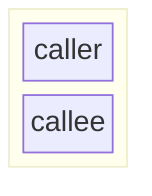


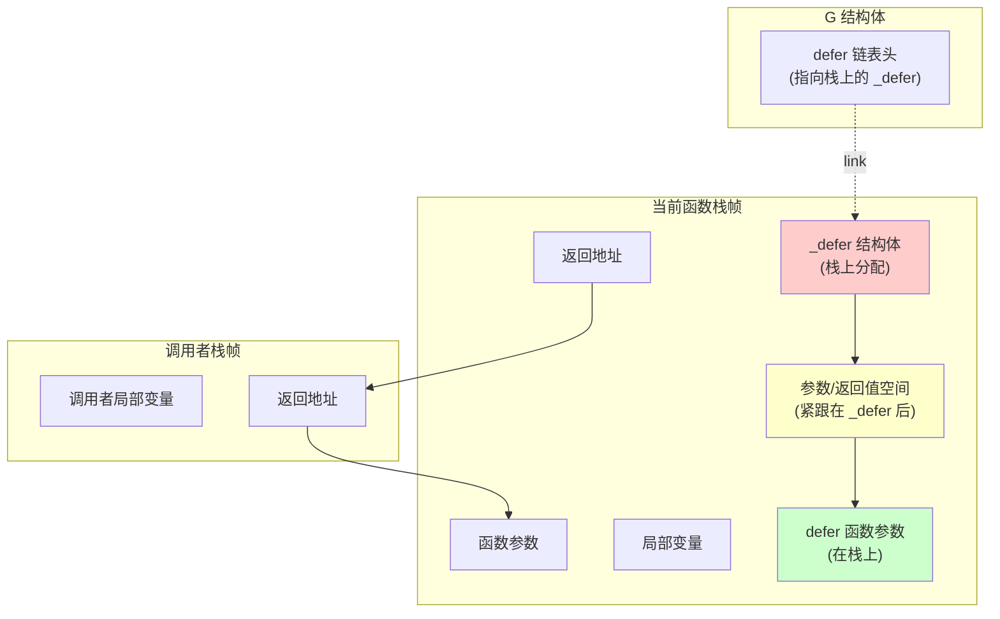

**说明**：
- `_defer` 结构体直接在栈上分配，紧跟在函数局部变量之后
- 参数和返回值空间直接挂载在 `_defer` 结构体后面
- defer 函数参数也在栈上，执行时直接使用，无需堆栈拷贝
- G 结构体的 defer 链表通过 `link` 指针指向栈上的 `_defer` 结构

### 函数返回时栈帧的变化

函数返回前执行 defer 时，栈帧的变化过程：

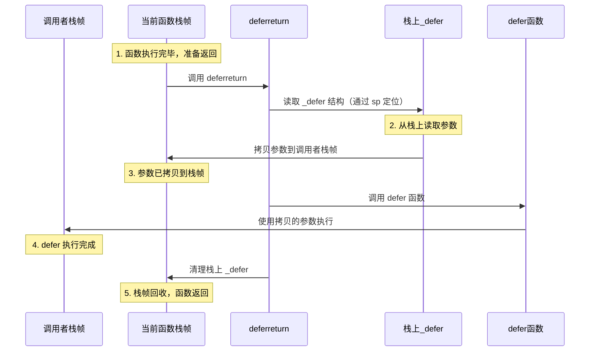

### 栈帧内存布局对比

#### Go 1.12 及之前（堆分配）

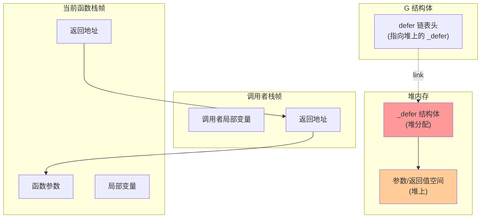

**特点**：
- `_defer` 在堆上分配，需要 GC 管理
- 参数需要从栈拷贝到堆，执行时再从堆拷贝回栈
- 两次拷贝带来性能开销

#### Go 1.13+（栈分配）

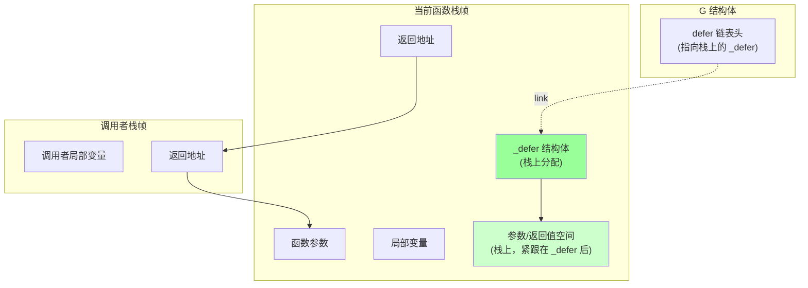

**特点**：
- `_defer` 在栈上分配，函数返回时自动回收
- 参数直接在栈上，执行时直接使用，无需拷贝
- 性能显著提升

### 栈指针（sp）的作用

`sp` 字段用于标识 defer 所属的函数栈帧：

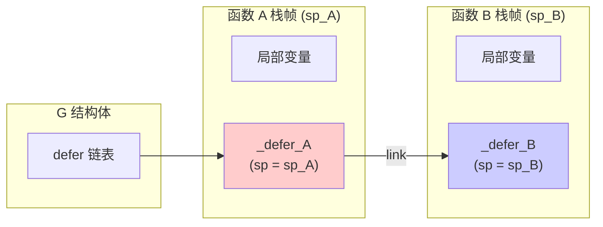

**执行流程**：
1. 函数 A 注册 `_defer_A`，`sp = sp_A`
2. 函数 A 调用函数 B
3. 函数 B 注册 `_defer_B`，`sp = sp_B`
4. 函数 B 返回时，执行 `_defer_B`（因为 `sp_B` 匹配）
5. 函数 A 返回时，执行 `_defer_A`（因为 `sp_A` 匹配）

通过比较 defer 链表头节点的 `sp` 和当前函数的栈指针，可以判断是否还有属于当前函数的 defer 需要执行。

# defer 执行流程

## 注册阶段

当执行 defer 语句时：

1. 触发 `deferproc`，复制参数和返回值内容至 `_defer` 结构体的内存区
2. 创建 `_defer` 对象，将其挂载到当前 G（goroutine）的 defer 链表头部
3. 若为闭包，还需将捕获的变量写入闭包对象

## 执行阶段

在函数返回前（正常 return 或发生 panic 时）：

1. 执行 `deferreturn`，在当前栈帧返回前，遍历并弹出 defer 链表的节点
2. 将 `_defer` 结构体中的参数/返回值内存区内容恢复到实际参数/返回值空间
3. 通过 `_defer.fn` 指向的函数指针进行实际调用
4. 若执行过程中出现 panic，进入 recover 机制

### 执行阶段的栈帧变化

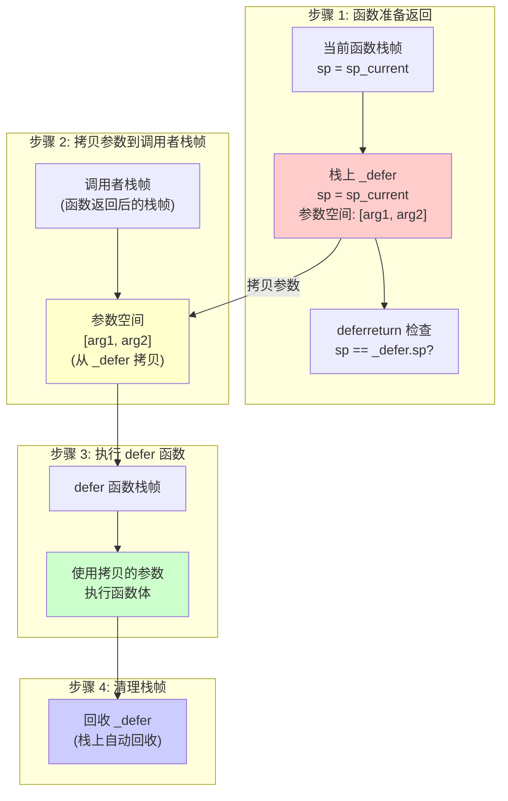

**详细说明**：

1. **参数拷贝**：`deferreturn` 将 `_defer` 结构体后面的参数空间内容拷贝到调用者栈帧的参数位置
2. **函数调用**：通过 `_defer.fn` 函数指针调用 defer 函数，参数已经在正确的位置
3. **栈帧回收**：defer 函数执行完成后，函数返回，整个栈帧（包括 `_defer`）自动回收

## 回收阶段

执行完毕的 `_defer` 对象被回收到全局缓存池，以便复用。

## 流程图

### 时序图

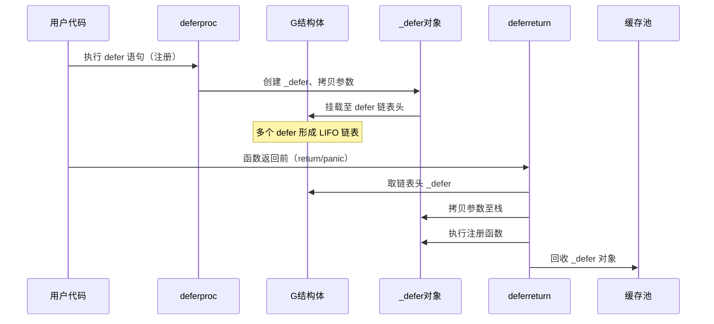

### 状态图

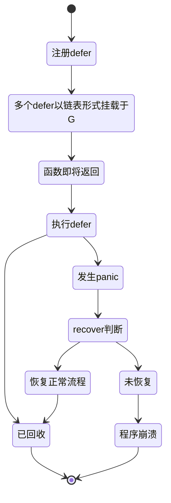

# 全局 defer 缓存池

全局 defer 缓存池用于快速申请和释放 `_defer` 结构，避免频繁的堆分配和回收，提高性能。

# 优化演进

## Go 1.12 及之前版本的问题

- 所有 defer 都在堆上分配
- 在创建和执行时需要来回拷贝参数，比较耗时
- 操作 defer 链表，寻址较慢

## Go 1.13 优化

**改进点**：
- 在栈上创建 defer 结构，将栈上的 defer 注册到 defer 链表中
- 减少了堆分配，提升性能
- 在 defer 结构体中新增 `heap` 字段标识是否是堆分配的 defer
- 执行时直接在栈上取值，减少了堆栈拷贝

**限制**：
- 不能适用于循环中的 defer（循环中的 defer 仍使用堆分配）

### 栈分配 vs 堆分配对比

#### 堆分配（Go 1.12 及之前）

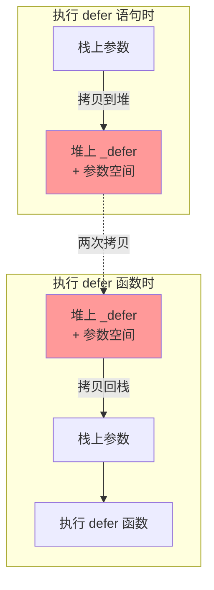

**性能开销**：
- 堆分配：需要 GC 管理
- 参数拷贝：栈 → 堆 → 栈（两次拷贝）

#### 栈分配（Go 1.13+）

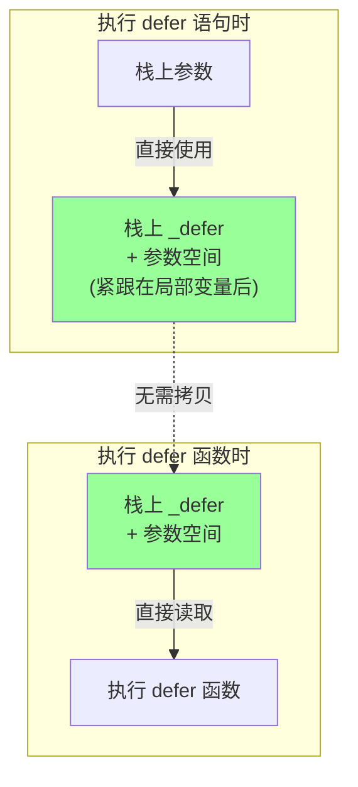

**性能优势**：
- 栈分配：函数返回时自动回收，无需 GC
- 参数使用：直接在栈上，无需拷贝

### 栈上 defer 的内存布局

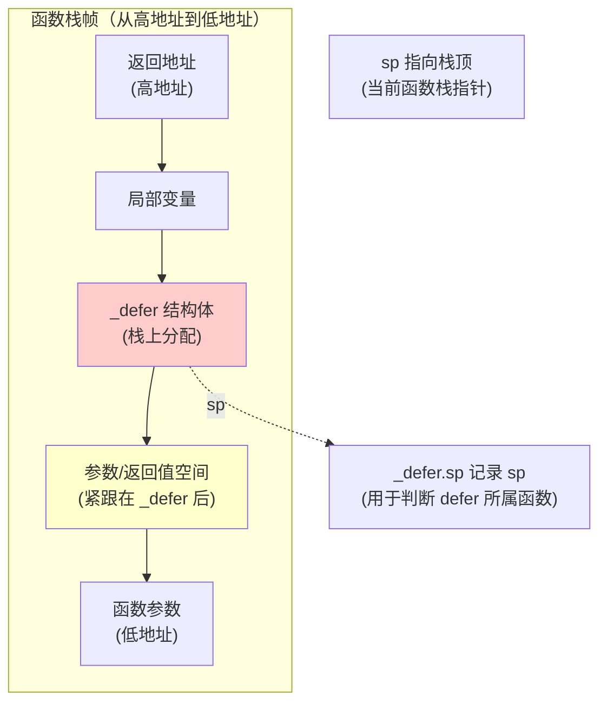

**关键点**：
- `_defer` 结构体直接分配在函数栈帧中
- 参数空间紧跟在 `_defer` 结构体后面，连续内存布局
- `_defer.sp` 记录创建时的栈指针，用于判断 defer 所属函数
- 函数返回时，整个栈帧（包括 `_defer`）自动回收

## Go 1.14 优化（开放编码）

**核心思想**：使用开放编码（open-coded defer）技术，将 defer 函数直接插入到函数返回前的执行代码中。

**新增字段**：
```go
type _defer struct {
    openDefer bool        // 是否是开放代码实现的defer
    fd        unsafe.Pointer // defer标记位图
    varp      uintptr     // 变量指针
    framepc   uintptr     // 帧程序计数器
}
```

**实现机制**：
- **编译阶段**：利用编译器将需要 defer 的函数直接插入到函数返回前的执行代码
- **标记位图**：利用 `df byte` 最多标记 8 个 defer，用 1 表示需要执行，0 表示不执行
- **执行阶段**：在执行延迟函数时需要判断 `df` 标记位，如果需要执行则将标志位置为 0，避免重复执行

**优势**：
- 不创建 defer 结构体，减少内存分配
- 直接在函数返回前执行，减少函数调用开销
- 性能显著提升

**限制**：
- 不适合循环中的 defer（循环中的 defer 仍使用堆分配）
- 不适合当前函数超过 8 个 defer 的函数（超过部分使用传统方式）

**panic 处理**：
为了让 panic 时能找到开放编码的函数，需要使用栈扫描的方式去执行，通过附加字段进行查找。

# 总结

## 执行流程总结

1. **defer 注册**：
   - 单 defer：可能使用开放编码优化
   - 多 defer：根据数量和场景选择优化策略
   - 循环 defer：无法优化，使用堆分配

2. **defer 执行**：
   - 开放编码：直接在返回前执行，通过位图标记
   - 传统方式：从 defer 链表头部开始执行
   - panic 场景：通过栈扫描找到未注册的 defer 进行执行

## 性能优化策略

- **栈分配**：对于非循环场景的 defer，优先在栈上分配
- **开放编码**：对于数量较少（≤8个）且非循环的 defer，直接内联执行
- **缓存池**：使用全局 defer 缓存池减少内存分配开销
- **循环 defer**：循环中的 defer 无法优化，仍使用堆分配和链表管理

## 最佳实践

1. 避免在循环中使用 defer，如果必须使用，考虑将 defer 逻辑提取到单独函数中
2. 单个函数中的 defer 数量尽量控制在 8 个以内，以充分利用开放编码优化
3. defer 函数尽量保持简单，避免复杂的计算逻辑
