# 概述

`defer` 是 Go 语言提供的一种延迟执行机制，用于在当前函数执行结束之前执行另一个函数。defer 语句会在函数返回前按照后进先出（LIFO）的顺序执行。

# 基本用法

```go
func example() {
    defer fmt.Println("defer 1")
    defer fmt.Println("defer 2")
    fmt.Println("normal")
    // 输出：
    // normal
    // defer 2
    // defer 1
}
```

# 编译实现

## 编译转换

Go 编译器会将 defer 语句转换为以下形式：

1. **defer 注册**：调用 `deferproc` 函数进行 defer 函数注册
   - 返回值大于 0 表示发生 panic，用于 recover 机制
   
2. **defer 执行**：在函数返回处插入 `deferreturn` 函数调用

### 编译器转换示例（概念）

```go
// 用户代码
func foo() {
    defer bar(1, 2)
    defer baz(x)
    // ...
    return
}

// 编译器展开后（概念，实际为 SSA/汇编）
func foo() {
    // 注册 defer：参数区在栈上，传 siz 和 fn
    deferproc(16, &bar.fn)   // bar 参数 1,2 共 16 字节（示例）
    deferproc(8, &baz.fn)     // baz 参数 x

    // ... 函数体 ...

    deferreturn()  // 每个 return 前都会插入
    return
}

// 执行时：先取链表头（baz），sp 匹配则执行 baz(x)，再取下一个（bar），执行 bar(1,2)，再取到 sp 不匹配或 nil 则结束
```

## defer 链表结构

G 结构体（goroutine 结构）持有 defer 链表，通过 `_defer` 指针指向 defer 链表。所有 defer 通过链表连接，新注册的 defer 会添加到链表头，执行时也是从头开始，实现后进先出（LIFO）的逻辑。

# defer 结构体

```go
// funcval 是 defer/闭包调用的函数“值”，实际调用时用 fn 指向的代码入口
type funcval struct {
    fn uintptr  // 函数入口地址
    // 后面可能紧跟闭包捕获的变量（不固定布局，由编译器生成）
}

type _defer struct {
    siz     int32    // 参数和返回值共占多少字节，具体空间会直接挂载在defer结构体后面，用于调用时快速赋值，执行时拷贝到调用者参数与返回值空间
    started bool     // 标记defer是否已经执行
    sp      uintptr  // 调用者函数栈指针，用于判断函数自己注册的defer是否执行完毕
    pc      uintptr  // 记录deferproc返回地址
    fn      *funcval // 注册函数指针
    _panic  *_panic  // 关联panic信息
    link    *_defer  // 用于挂载defer链表
    heap    bool     // 是否为堆分配（Go 1.13+，false 表示栈上 _defer）
}

// add 返回 p + n，用于指针运算（runtime 中有类似实现）
func add(p unsafe.Pointer, n uintptr) unsafe.Pointer {
    return unsafe.Pointer(uintptr(p) + n)
}
```

## G 与 defer 链表

```go
// G 结构体中与 defer 相关的字段
type g struct {
    // ...
    _defer *_defer  // defer 链表头，新注册的 defer 插在头部，执行时从头部取
    // ...
}

// 链表形态（LIFO）：
//   G._defer -> d3 -> d2 -> d1 -> nil
// 注册顺序：d1, d2, d3
// 执行顺序：d3, d2, d1
```

## deferproc 函数

`deferproc` 函数用于注册 defer：

- **参数**：
  - `siz`：表示参数和返回值大小
  - `fn`：延迟执行函数指针

`deferproc` 函数会将栈上相应的值存储到 `_defer` 结构中。

### deferproc 实现（简化）

```go
// deferproc 由编译器在遇到 defer 语句时插入调用
// 参数 siz 为 defer 函数参数+返回值占用的字节数，argp 指向调用者栈上参数区的起始地址
func deferproc(siz int32, fn *funcval) {
    if getg().m.curg != getg() {
        throw("defer on system stack")
    }
    // 获取调用者 SP，用于后续 deferreturn 判断是否为本函数的 defer
    sp := getcallersp()
    argp := uintptr(unsafe.Pointer(&fn)) + unsafe.Sizeof(fn)
    callerpc := getcallerpc()

    // 1. 获取或创建 _defer
    d := newdefer(siz)
    if d._panic != nil {
        throw("deferproc: d.panic != nil after newdefer")
    }

    // 2. 填写 _defer 字段
    d.fn = fn
    d.pc = callerpc
    d.sp = sp
    d.siz = siz
    d.started = false

    // 3. 将参数从调用者栈拷贝到 _defer 后面的内存（紧跟在 _defer 结构体之后）
    if siz > 0 {
        deferArgs := add(unsafe.Pointer(d), unsafe.Sizeof(*d))
        memmove(deferArgs, unsafe.Pointer(argp), uintptr(siz))
    }

    // 4. 插入到当前 G 的 defer 链表头（LIFO）
    d.link = getg()._defer
    getg()._defer = d

    return0()
}

// newdefer 从 P 的 defer 池获取或分配新的 _defer
func newdefer(siz int32) *_defer {
    var d *_defer
    pp := getg().m.p.ptr()

    // 优先从 P 的 defer 池取（同规格 siz）
    if pp.deferpool[siz] != nil {
        d = pp.deferpool[siz]
        pp.deferpool[siz] = d.link
        d.link = nil
    }

    if d == nil {
        // 池中没有，从堆分配（或栈上分配，见下）
        if siz <= 0 {
            d = (*_defer)(mallocgc(unsafe.Sizeof(_defer{}), deferType, true))
        } else {
            // 分配 _defer + 后面 siz 字节的参数区
            d = (*_defer)(mallocgc(unsafe.Sizeof(_defer{})+uintptr(siz), deferType, true))
        }
    }
    d.siz = siz
    d.heap = true  // 从池/堆来的为 true；栈上分配的会在 deferprocStack 里设为 false
    return d
}
```

## deferreturn 函数

`deferreturn` 执行时会将 defer 结构体中的参数拷贝到调用者栈帧上，然后通过注册的函数指针调用函数。

### deferreturn 实现（简化）

```go
// deferreturn 由编译器在函数每个返回路径前插入
// 不断从链表头取 defer 执行，直到遇到“不属于当前函数”的 defer（通过 sp 判断）为止
func deferreturn() {
    gp := getg()
    for {
        d := gp._defer
        if d == nil {
            break
        }
        // 只处理“当前函数”注册的 defer：创建时的栈指针要和当前一致
        if d.sp != getcallersp() {
            break
        }
        if d.started {
            throw("deferreturn: already started")
        }

        // 标记已开始执行，避免重复
        d.started = true

        // 获取 defer 函数参数区：紧跟在 _defer 结构体后面
        fn := d.fn
        argp := add(unsafe.Pointer(d), unsafe.Sizeof(*d))

        // 将参数拷贝到“当前栈帧中 defer 调用的参数槽”（由编译器约定位置）
        if d.siz > 0 {
            memmove(unsafe.Pointer(getcallersp()), argp, uintptr(d.siz))
        }

        // 从链表头移除
        gp._defer = d.link

        // 若为堆分配，归还到 P 的 defer 池
        if d.heap {
            freedefer(d)
        }

        // 调用 defer 函数（编译器会生成带参数/返回值的调用）
        jmpdefer(fn, argp)
    }
}

// jmpdefer 在汇编中实现：跳转到 fn，并调整栈帧，使 defer 函数返回时再次回到 deferreturn
// 这样可以实现“执行一个 defer → 回到 deferreturn → 取下一个 defer”的循环
```

### 栈上 defer：deferprocStack

Go 1.13+ 对“非循环、可静态确定”的 defer 在栈上分配 `_defer`，不经过 `deferproc`，而是 `deferprocStack`：

```go
// deferprocStack 由编译器为“栈上 defer”生成调用
// 调用前编译器已在栈上分配好 _defer + 参数区，并把指针传入
func deferprocStack(d *_defer) {
    gp := getg()
    d.started = false
    d.sp = getcallersp()
    d.pc = getcallerpc()
    d.heap = false  // 栈上分配

    // 插入到 G 的 defer 链表头
    d.link = gp._defer
    gp._defer = d
    return0()
}
```

## 闭包处理

如果注册的函数拥有捕获列表（闭包），就会创建闭包对象，将捕获列表中的变量进行堆分配，存入闭包结构中。

## 执行完成判断

判断当前函数是否执行完所有 defer：检查 defer 链表头部节点的 `sp` 是否等于当前函数的栈指针。

## 函数栈帧变化

### 栈上 defer 创建时的栈帧结构

当在栈上创建 defer 时（Go 1.13+），栈帧结构如下：

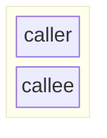
```mermaid
block
  block
    columns 1
    caller callee
  end
```


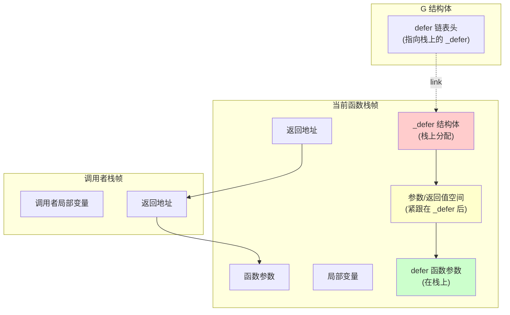
```mermaid
graph TB
    subgraph "调用者栈帧"
        A1[调用者局部变量]
        A2[返回地址]
    end
    
    subgraph "当前函数栈帧"
        B1[函数参数]
        B2[局部变量]
        B3[返回地址]
        B4["_defer 结构体<br/>(栈上分配)"]
        B5["参数/返回值空间<br/>(紧跟在 _defer 后)"]
        B6["defer 函数参数<br/>(在栈上)"]
    end
    
    subgraph "G 结构体"
        C1["defer 链表头<br/>(指向栈上的 _defer)"]
    end
    
    A2 --> B1
    B3 --> A2
    C1 -.->|link| B4
    B4 --> B5
    B5 --> B6
    
    style B4 fill:#ffcccc
    style B5 fill:#ffffcc
    style B6 fill:#ccffcc
```

**说明**：
- `_defer` 结构体直接在栈上分配，紧跟在函数局部变量之后
- 参数和返回值空间直接挂载在 `_defer` 结构体后面
- defer 函数参数也在栈上，执行时直接使用，无需堆栈拷贝
- G 结构体的 defer 链表通过 `link` 指针指向栈上的 `_defer` 结构

### 函数返回时栈帧的变化

函数返回前执行 defer 时，栈帧的变化过程：

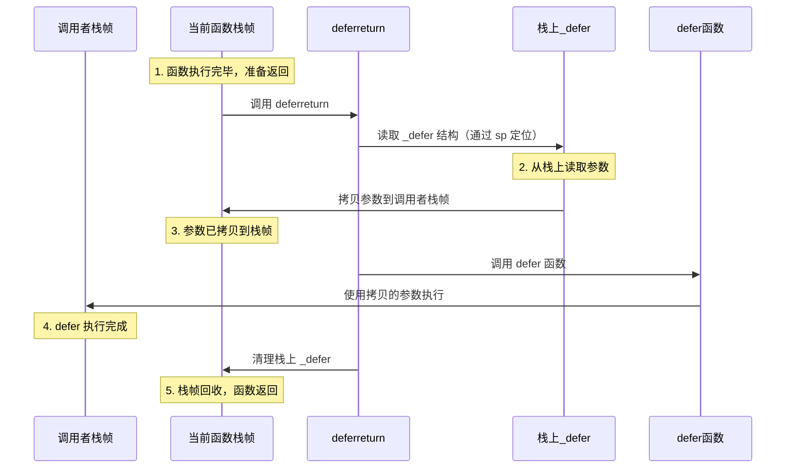
```mermaid
sequenceDiagram
    participant 调用者栈帧
    participant 当前函数栈帧
    participant deferreturn
    participant 栈上_defer
    participant defer函数

    Note over 当前函数栈帧: 1. 函数执行完毕，准备返回
    当前函数栈帧->>deferreturn: 调用 deferreturn
    deferreturn->>栈上_defer: 读取 _defer 结构（通过 sp 定位）
    Note over 栈上_defer: 2. 从栈上读取参数
    栈上_defer->>当前函数栈帧: 拷贝参数到调用者栈帧
    Note over 当前函数栈帧: 3. 参数已拷贝到栈帧
    deferreturn->>defer函数: 调用 defer 函数
    defer函数->>调用者栈帧: 使用拷贝的参数执行
    Note over 调用者栈帧: 4. defer 执行完成
    deferreturn->>当前函数栈帧: 清理栈上 _defer
    Note over 当前函数栈帧: 5. 栈帧回收，函数返回
```

### 栈帧内存布局对比

#### Go 1.12 及之前（堆分配）

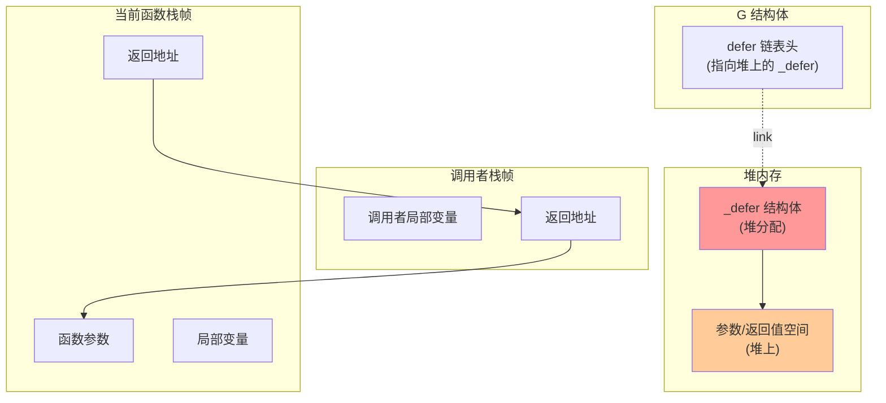
```mermaid
graph TB
    subgraph "调用者栈帧"
        A1[调用者局部变量]
        A2[返回地址]
    end
    
    subgraph "当前函数栈帧"
        B1[函数参数]
        B2[局部变量]
        B3[返回地址]
    end
    
    subgraph "堆内存"
        C1["_defer 结构体<br/>(堆分配)"]
        C2["参数/返回值空间<br/>(堆上)"]
    end
    
    subgraph "G 结构体"
        D1["defer 链表头<br/>(指向堆上的 _defer)"]
    end
    
    A2 --> B1
    B3 --> A2
    D1 -.->|link| C1
    C1 --> C2
    
    style C1 fill:#ff9999
    style C2 fill:#ffcc99
```

**特点**：
- `_defer` 在堆上分配，需要 GC 管理
- 参数需要从栈拷贝到堆，执行时再从堆拷贝回栈
- 两次拷贝带来性能开销

#### Go 1.13+（栈分配）

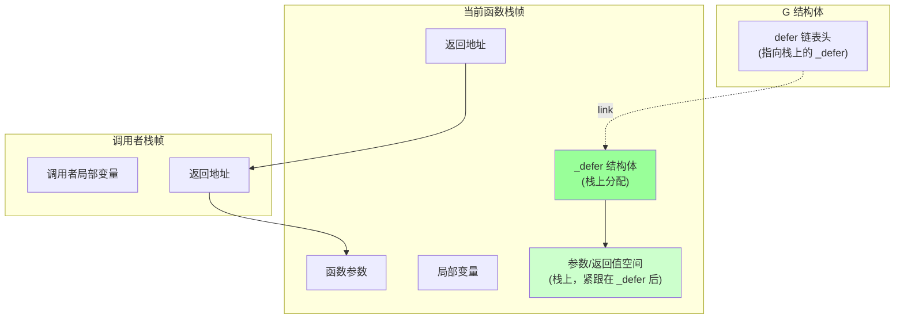
```mermaid
graph TB
    subgraph "调用者栈帧"
        A1[调用者局部变量]
        A2[返回地址]
    end
    
    subgraph "当前函数栈帧"
        B1[函数参数]
        B2[局部变量]
        B3[返回地址]
        B4["_defer 结构体<br/>(栈上分配)"]
        B5["参数/返回值空间<br/>(栈上，紧跟在 _defer 后)"]
    end
    
    subgraph "G 结构体"
        D1["defer 链表头<br/>(指向栈上的 _defer)"]
    end
    
    A2 --> B1
    B3 --> A2
    D1 -.->|link| B4
    B4 --> B5
    
    style B4 fill:#99ff99
    style B5 fill:#ccffcc
```

**特点**：
- `_defer` 在栈上分配，函数返回时自动回收
- 参数直接在栈上，执行时直接使用，无需拷贝
- 性能显著提升

### 栈指针（sp）的作用

`sp` 字段用于标识 defer 所属的函数栈帧：

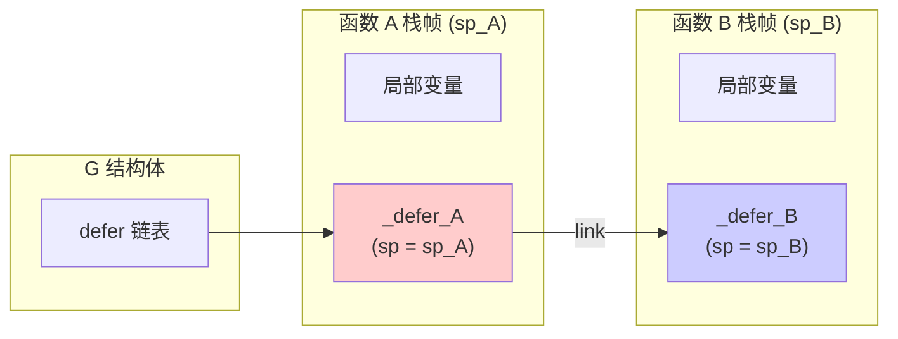
```mermaid
graph LR
    subgraph "函数 A 栈帧 (sp_A)"
        A1[局部变量]
        A2["_defer_A<br/>(sp = sp_A)"]
    end
    
    subgraph "函数 B 栈帧 (sp_B)"
        B1[局部变量]
        B2["_defer_B<br/>(sp = sp_B)"]
    end
    
    subgraph "G 结构体"
        C1["defer 链表"]
    end
    
    C1 --> A2
    A2 -->|link| B2
    
    style A2 fill:#ffcccc
    style B2 fill:#ccccff
```

**执行流程**：
1. 函数 A 注册 `_defer_A`，`sp = sp_A`
2. 函数 A 调用函数 B
3. 函数 B 注册 `_defer_B`，`sp = sp_B`
4. 函数 B 返回时，执行 `_defer_B`（因为 `sp_B` 匹配）
5. 函数 A 返回时，执行 `_defer_A`（因为 `sp_A` 匹配）

通过比较 defer 链表头节点的 `sp` 和当前函数的栈指针，可以判断是否还有属于当前函数的 defer 需要执行。

# defer 执行流程

## 注册阶段

当执行 defer 语句时：

1. 触发 `deferproc`，复制参数和返回值内容至 `_defer` 结构体的内存区
2. 创建 `_defer` 对象，将其挂载到当前 G（goroutine）的 defer 链表头部
3. 若为闭包，还需将捕获的变量写入闭包对象

## 执行阶段

在函数返回前（正常 return 或发生 panic 时）：

1. 执行 `deferreturn`，在当前栈帧返回前，遍历并弹出 defer 链表的节点
2. 将 `_defer` 结构体中的参数/返回值内存区内容恢复到实际参数/返回值空间
3. 通过 `_defer.fn` 指向的函数指针进行实际调用
4. 若执行过程中出现 panic，进入 recover 机制

### 执行阶段的栈帧变化

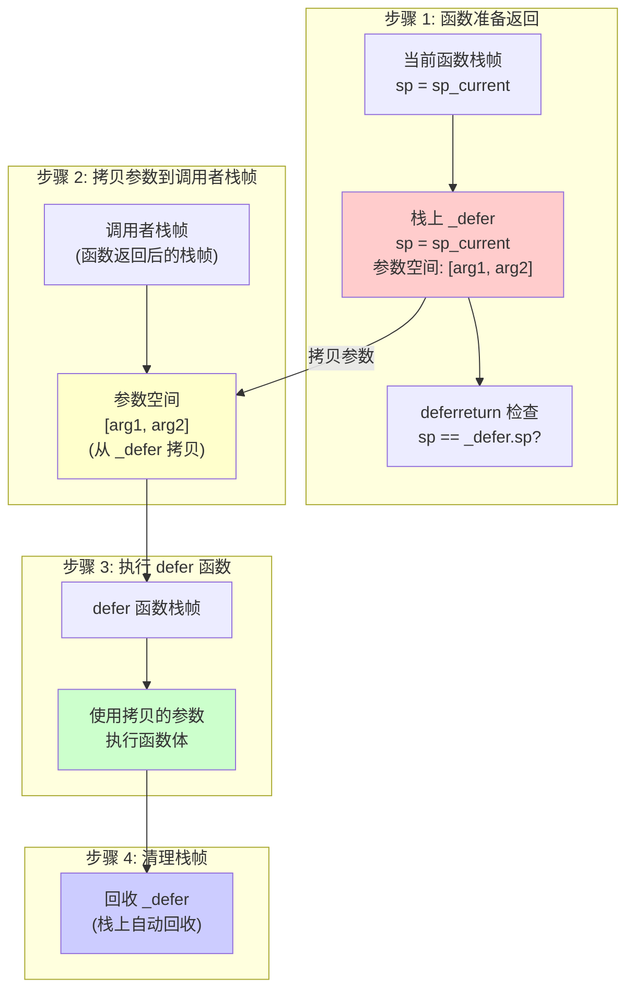
```mermaid
graph TB
    subgraph "步骤 1: 函数准备返回"
        A1["当前函数栈帧<br/>sp = sp_current"]
        A2["栈上 _defer<br/>sp = sp_current<br/>参数空间: [arg1, arg2]"]
        A3["deferreturn 检查<br/>sp == _defer.sp?"]
        A1 --> A2
        A2 --> A3
    end
    
    subgraph "步骤 2: 拷贝参数到调用者栈帧"
        B1["调用者栈帧<br/>(函数返回后的栈帧)"]
        B2["参数空间<br/>[arg1, arg2]<br/>(从 _defer 拷贝)"]
        A2 -->|拷贝参数| B2
        B1 --> B2
    end
    
    subgraph "步骤 3: 执行 defer 函数"
        C1["defer 函数栈帧"]
        C2["使用拷贝的参数<br/>执行函数体"]
        B2 --> C1
        C1 --> C2
    end
    
    subgraph "步骤 4: 清理栈帧"
        D1["回收 _defer<br/>(栈上自动回收)"]
        C2 --> D1
    end
    
    style A2 fill:#ffcccc
    style B2 fill:#ffffcc
    style C2 fill:#ccffcc
    style D1 fill:#ccccff
```

**详细说明**：

1. **参数拷贝**：`deferreturn` 将 `_defer` 结构体后面的参数空间内容拷贝到调用者栈帧的参数位置
2. **函数调用**：通过 `_defer.fn` 函数指针调用 defer 函数，参数已经在正确的位置
3. **栈帧回收**：defer 函数执行完成后，函数返回，整个栈帧（包括 `_defer`）自动回收

## 回收阶段

执行完毕的 `_defer` 对象被回收到当前 P 的 defer 缓存池，以便复用。

### freedefer 与 defer 池

```go
// freedefer 将堆上分配的 _defer 归还到 P 的池中
func freedefer(d *_defer) {
    if d.heap != true {
        return  // 栈上分配的由栈回收，不放入池
    }
    siz := d.siz
    pp := getg().m.p.ptr()

    // 按 siz 分类放入不同槽位，避免复用时空指针
    if pp.deferpool[siz] == nil {
        d.link = nil
    } else {
        d.link = pp.deferpool[siz]
    }
    pp.deferpool[siz] = d
}

// P 结构体中 defer 池（简化表示）
type p struct {
    // ...
    deferpool [numDeferSizes]*_defer  // 按 siz 分桶的 _defer 池
    // ...
}
```

## 流程图

### 时序图

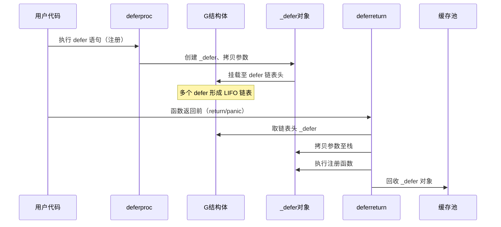
```mermaid
sequenceDiagram
    participant 用户代码
    participant deferproc
    participant G结构体
    participant _defer对象
    participant deferreturn
    participant 缓存池

    用户代码->>deferproc: 执行 defer 语句（注册）
    deferproc->>_defer对象: 创建 _defer、拷贝参数
    _defer对象->>G结构体: 挂载至 defer 链表头
    Note over G结构体: 多个 defer 形成 LIFO 链表
    用户代码->>deferreturn: 函数返回前（return/panic）
    deferreturn->>G结构体: 取链表头 _defer
    deferreturn->>_defer对象: 拷贝参数至栈
    deferreturn->>_defer对象: 执行注册函数
    deferreturn->>缓存池: 回收 _defer 对象
```

### 状态图

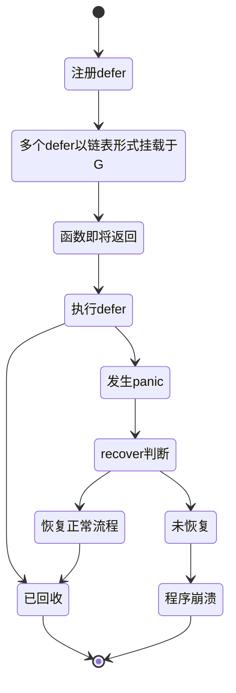
```mermaid
stateDiagram-v2
    [*] --> 注册defer
    注册defer --> defer链表
    defer链表 --> 函数即将返回
    函数即将返回 --> 执行defer
    执行defer --> 已回收
    执行defer --> 发生panic
    发生panic --> recover判断
    recover判断 --> 恢复正常流程
    recover判断 --> 未恢复
    恢复正常流程 --> 已回收
    未恢复 --> 程序崩溃
    已回收 --> [*]
    程序崩溃 --> [*]
    
    defer链表: 多个defer以链表形式挂载于G
```

# 为什么 recover 只能在 defer 中执行

`recover()` 只有在 **defer 所调用的函数体内** 执行时才会生效；在普通函数或 main 里直接调用 `recover()` 会返回 `nil`，无法“接住” panic。这是由 panic/recover 的执行顺序和运行时实现共同决定的。

## 1. panic 之后，正常代码路径不会再执行

一旦某处发生 `panic`：

- 当前函数会**立即停止**执行，不再执行 panic 之后的语句
- 运行时开始**沿调用栈向上**逐层执行各层已注册的 **defer**
- 若某层 defer 里调用了 `recover()` 且返回非 nil，则 panic 被“消化”，程序从该 defer 返回后继续按正常逻辑执行（例如从发生 panic 的函数的调用者继续）
- 若一直到栈顶都没有 recover，程序崩溃

因此，在“已经 panic 了”之后，**还能被执行的代码**只有**尚未执行完的 defer**。普通代码路径在 panic 点之后都不会再运行，所以把 `recover()` 写在普通代码里没有意义——要么还没 panic（recover 返回 nil），要么已经 panic 了但那段代码根本不会执行。

## 2. 只有 defer 运行在“panic 已发生但尚未向上传播”的窗口内

时间顺序可以简化为：

```mermaid
flowchart TD
    A[正常执行] --> B[某行发生 panic]
    B --> C[当前函数内剩余代码被跳过]
    C --> D[开始执行当前函数的 defer]
    D --> E{某个 defer 里调用 recover()}
    E -->|是| F[捕获当前 panic，程序可恢复]
    E -->|否| G[继续向上执行上一层的 defer，直至崩溃]
```


也就是说，**能观察到“当前 goroutine 正在 panic”的、且还会被执行的代码，只有 defer**。运行时只在执行 defer 时检查当前 G 是否处于 panic 状态，并只在此时让 `recover()` 返回该 panic 的值。所以“在 defer 里调用 recover”不是风格建议，而是**唯一能生效的调用位置**。

## 3. 简单对比：defer 里 vs 普通代码里

```go
// 无效：普通代码里调用 recover，无法捕获任何 panic
func noRecover() {
    if r := recover(); r != nil {
        fmt.Println("recovered", r)  // 不会执行
    }
    panic("oops")  // 这里 panic 后，上面的 recover 早已执行过了（返回 nil）
}

// 有效：在 defer 里调用 recover，可以捕获同一函数内之后的 panic
func withDefer() {
    defer func() {
        if r := recover(); r != nil {
            fmt.Println("recovered", r)  // 会执行，输出 recovered oops
        }
    }()
    panic("oops")  // panic 后，会先执行上面的 defer，其中 recover 生效
}
```

## 4. 为什么 `defer recover()` 不会生效

若写成 `defer recover()`，panic 同样**不会被接住**，原因在于语言规范对 recover 的约束。

### 规范要求：“被 defer 的函数”体内直接调用

Go 规范规定：**recover 只有在“被某个 deferred 函数直接调用”时才会返回当前 panic 的值**。这里的“deferred 函数”指的是你通过 `defer` 注册的**那个函数**（例如 `defer func() { ... }()` 里的匿名函数），而不是该函数内部调用的内置函数。

- 正确写法：`defer func() { recover() }()`  
  - 被 defer 的是**匿名函数**；执行时进入该函数体，在体内**直接调用** `recover()`，满足“被 deferred 函数直接调用”，recover 生效。
- 错误写法：`defer recover()`  
  - 被 defer 的是**对 `recover` 的这一句调用**，即“deferred 的调用”本身就是 `recover`，并没有“另一个”deferred 函数在**自己的函数体里**去调用 recover。因此不满足“recover 被某个 deferred 函数直接调用”，运行时会让 `recover()` 返回 `nil`，panic 不会被消化。

可以简单记：**recover 必须出现在“你 defer 的那个函数”的函数体内**，而不能是“你 defer 的就是 recover 这一句调用”。

### 对比示例

```go
// 无效：defer 的是 recover 这一句调用本身，没有“外层 deferred 函数”在体内调用 recover
func bad() {
    defer recover()  // panic 时这里会执行，但 recover() 返回 nil，panic 仍会继续向上抛
    panic("oops")
}

// 有效：defer 的是匿名函数，recover 在该函数体内被直接调用
func good() {
    defer func() {
        _ = recover()  // 满足“被 deferred 函数直接调用”，可接住 panic
    }()
    panic("oops")
}
```

### 为什么 `defer func() { func() { recover() }() }()` 也不能捕获 panic

规范里要求的是 **“被 deferred 函数**直接**调用”**，强调 **直接**：`recover()` 必须出现在你 defer 的那个函数的**函数体内**，由该函数**自己**调用，而不能是“deferred 函数再去调另一个函数，在那个函数里调用 recover”。

```go
defer func() {
    func() {
        recover()  // 这里调用 recover 的是“内层匿名函数”，不是“被 defer 的外层匿名函数”
    }()
}()
```

- **被 defer 的**是**外层**匿名函数。
- 执行时：先进入外层函数体，外层函数体里**唯一**做的事是**调用内层匿名函数**；`recover()` 是在**内层函数**的函数体里被调用的。
- 因此，**直接**调用 `recover()` 的是内层函数，而不是被 defer 的外层函数。不满足“recover 被 deferred 函数直接调用”，`recover()` 会返回 `nil`，panic 不会被接住。

可以记：**中间多包一层函数调用就不算“直接调用”**——只要调用链是 `deferred 函数 → 其他函数 → recover()`，就不符合规范。

### 小结

| 写法 | 谁直接调用了 recover | 是否“被 deferred 函数直接调用” | 是否生效 |
|------|----------------------|--------------------------------|----------|
| `defer recover()` | 无（deferred 的就是这次调用本身） | 否 | 否 |
| `defer func() { func() { recover() }() }()` | 内层匿名函数 | 否（是内层在调用，不是 deferred 的外层） | 否 |
| `defer func() { recover() }()` | 被 defer 的匿名函数 | 是 | 是 |

因此：**要接住 panic，必须在你 defer 的那个函数的函数体里“直接”调用 `recover()`**，不能多包一层 `func() { ... }()` 或其它函数再在里面调 recover。

## 5. 运行时层面的约束（概念）

- 每个 G 有一个 `_panic` 链表，发生 panic 时会把当前 panic 挂上去
- `recover()` 的语义是：**若当前 G 正在 panic，则取链表头部的 panic，并把它从“未恢复”状态里摘掉**
- 运行时只在**从 panic 流程中调用 defer 函数**的那条路径上，把“当前 G 正在 panic”这一状态暴露给用户代码；普通执行路径上不会处于“正在 panic”状态，所以 `recover()` 会直接返回 nil

因此，**recover 只能在 defer 中执行**可以归纳为两点：

1. **执行顺序**：panic 后只有 defer 还会被运行，所以只有写在 defer 里的代码有机会在“已 panic”之后执行。
2. **语义与实现**：`recover()` 只有在“当前 G 正在 panic 且正在执行 **某个 deferred 函数的函数体**”的上下文中、且由该函数体**直接调用**时，才会返回该 panic 的值；其它情况（包括 `defer recover()`）一律返回 nil。

# 全局 defer 缓存池

全局 defer 缓存池用于快速申请和释放 `_defer` 结构，避免频繁的堆分配和回收，提高性能。

# 优化演进

## Go 1.12 及之前版本的问题

- 所有 defer 都在堆上分配
- 在创建和执行时需要来回拷贝参数，比较耗时
- 操作 defer 链表，寻址较慢

## Go 1.13 优化

**改进点**：
- 在栈上创建 defer 结构，将栈上的 defer 注册到 defer 链表中
- 减少了堆分配，提升性能
- 在 defer 结构体中新增 `heap` 字段标识是否是堆分配的 defer
- 执行时直接在栈上取值，减少了堆栈拷贝

**限制**：
- 不能适用于循环中的 defer（循环中的 defer 仍使用堆分配）

### 栈分配 vs 堆分配对比

#### 堆分配（Go 1.12 及之前）

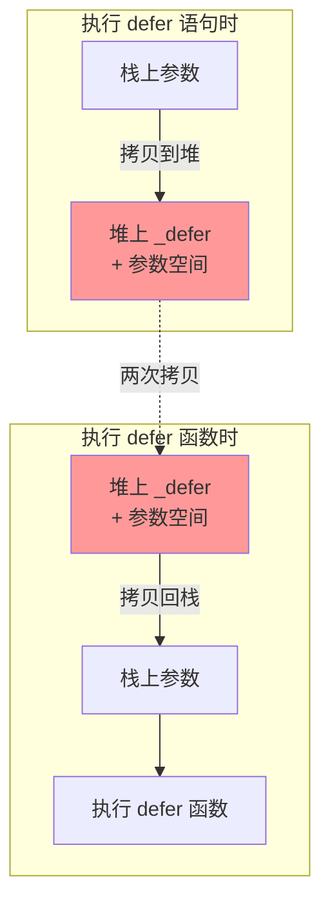
```mermaid
graph TB
    subgraph "执行 defer 语句时"
        A1[栈上参数] -->|拷贝到堆| A2["堆上 _defer<br/>+ 参数空间"]
    end
    
    subgraph "执行 defer 函数时"
        B1["堆上 _defer<br/>+ 参数空间"] -->|拷贝回栈| B2[栈上参数]
        B2 --> B3[执行 defer 函数]
    end
    
    A2 -.->|两次拷贝| B1
    
    style A2 fill:#ff9999
    style B1 fill:#ff9999
```

**性能开销**：
- 堆分配：需要 GC 管理
- 参数拷贝：栈 → 堆 → 栈（两次拷贝）

#### 栈分配（Go 1.13+）

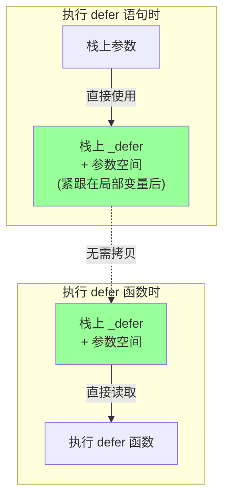
```mermaid
graph TB
    subgraph "执行 defer 语句时"
        A1[栈上参数] -->|直接使用| A2["栈上 _defer<br/>+ 参数空间<br/>(紧跟在局部变量后)"]
    end
    
    subgraph "执行 defer 函数时"
        B1["栈上 _defer<br/>+ 参数空间"] -->|直接读取| B2[执行 defer 函数]
    end
    
    A2 -.->|无需拷贝| B1
    
    style A2 fill:#99ff99
    style B1 fill:#99ff99
```

**性能优势**：
- 栈分配：函数返回时自动回收，无需 GC
- 参数使用：直接在栈上，无需拷贝

### 栈上 defer 的内存布局

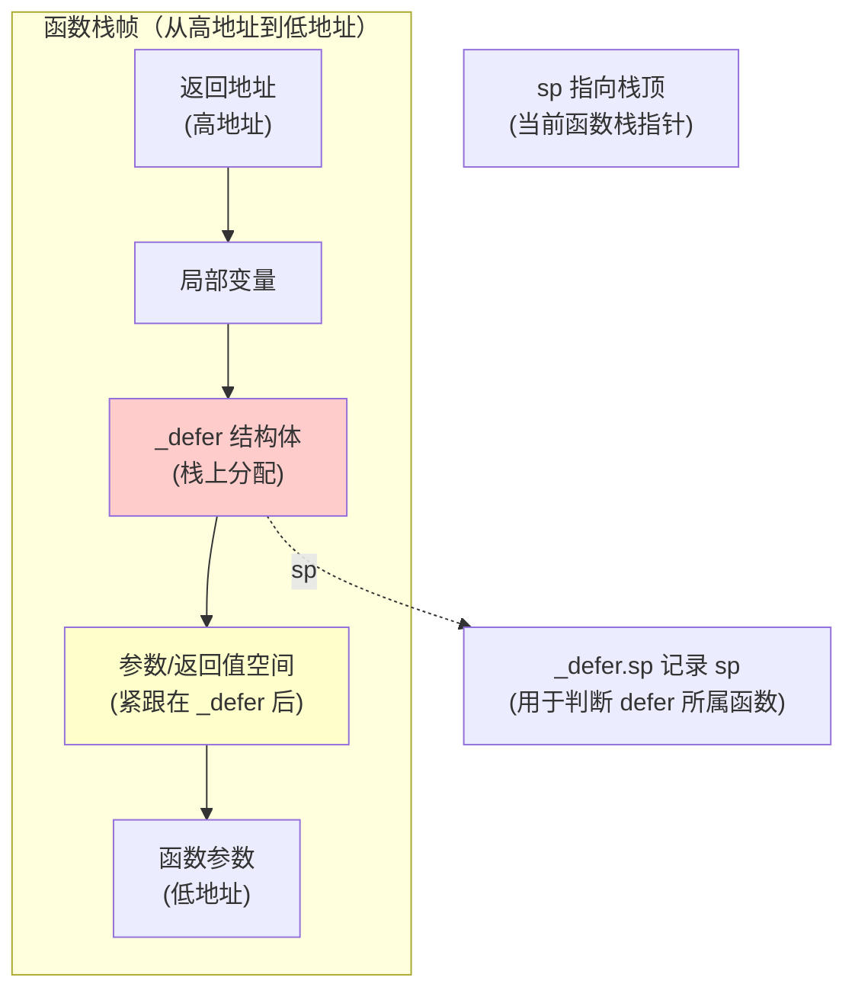
```mermaid
graph TB
    subgraph "函数栈帧（从高地址到低地址）"
        direction TB
        F1["返回地址<br/>(高地址)"]
        F2["局部变量"]
        F3["_defer 结构体<br/>(栈上分配)"]
        F4["参数/返回值空间<br/>(紧跟在 _defer 后)"]
        F5["函数参数<br/>(低地址)"]
    end
    
    F1 --> F2
    F2 --> F3
    F3 --> F4
    F4 --> F5
    
    style F3 fill:#ffcccc
    style F4 fill:#ffffcc
    
    Note1["sp 指向栈顶<br/>(当前函数栈指针)"]
    Note2["_defer.sp 记录 sp<br/>(用于判断 defer 所属函数)"]
    
    F3 -.->|sp| Note2
```

**关键点**：
- `_defer` 结构体直接分配在函数栈帧中
- 参数空间紧跟在 `_defer` 结构体后面，连续内存布局
- `_defer.sp` 记录创建时的栈指针，用于判断 defer 所属函数
- 函数返回时，整个栈帧（包括 `_defer`）自动回收

## Go 1.14 优化（开放编码）

**核心思想**：使用开放编码（open-coded defer）技术，将 defer 函数直接插入到函数返回前的执行代码中。

**新增字段**：
```go
type _defer struct {
    openDefer bool        // 是否是开放代码实现的defer
    fd        unsafe.Pointer // defer标记位图
    varp      uintptr     // 变量指针
    framepc   uintptr     // 帧程序计数器
}
```

**实现机制**：
- **编译阶段**：利用编译器将需要 defer 的函数直接插入到函数返回前的执行代码
- **标记位图**：利用 `df byte` 最多标记 8 个 defer，用 1 表示需要执行，0 表示不执行
- **执行阶段**：在执行延迟函数时需要判断 `df` 标记位，如果需要执行则将标志位置为 0，避免重复执行

**优势**：
- 不创建 defer 结构体，减少内存分配
- 直接在函数返回前执行，减少函数调用开销
- 性能显著提升

**限制**：
- 不适合循环中的 defer（循环中的 defer 仍使用堆分配）
- 不适合当前函数超过 8 个 defer 的函数（超过部分使用传统方式）

**panic 处理**：
为了让 panic 时能找到开放编码的函数，需要使用栈扫描的方式去执行，通过附加字段进行查找。

### 开放编码 defer 的实现（简化）

```go
// 编译器为“开放编码”的 defer 生成：
// 1. 在函数末尾插入多个 defer 调用（按 LIFO 顺序），并用一个位图记录“哪些需要执行”
// 2. 一个 _defer 结构（或等效数据）保存 framepc、varp、fd 等，用于 panic 时栈上查找

// 开放编码的 _defer 扩展字段（与前面 _defer 可合并为同一结构）
type _defer struct {
    // ... 前述字段 ...
    openDefer bool         // 是否为开放编码
    fd         unsafe.Pointer // 指向 deferBits 位图（栈上）
    varp       uintptr      // 创建时的 varp，用于定位栈上 defer 数据
    framepc    uintptr      // 创建时的 PC，用于 panic 时识别栈帧
}

// deferBits 是栈上的一个字节，每位对应一个内联的 defer：1 表示待执行，0 表示已执行或未使用
// 最多 8 个 defer，所以用一个 byte
const deferBitsSize = 8

// 正常返回路径：编译器生成的代码类似
//   deferreturnOpenCoded()
// 内部会根据 fd 指向的 deferBits 逐位检查，若为 1 则执行对应序号的 defer 并清零该位
func deferreturnOpenCoded() {
    gp := getg()
    d := gp._defer
    if d == nil || !d.openDefer {
        return
    }
    fn := d.fn
    deferBits := *(*uint8)(d.fd)
    for i := uint8(0); i < deferBitsSize; i++ {
        if deferBits&(1<<i) == 0 {
            continue
        }
        // 执行第 i 个开放编码的 defer（编译器会生成每个 defer 的调用）
        // 执行完后将对应位清零
        deferBits &^= 1 << i
        *(*uint8)(d.fd) = deferBits
        // 调用第 i 个 defer 函数（实际由编译器内联的 switch/call 完成）
        runOpenDeferFrame(gp, d, i)
        d = gp._defer
        if d == nil || !d.openDefer {
            return
        }
        deferBits = *(*uint8)(d.fd)
    }
    gp._defer = d.link
    freedefer(d)
}

// panic 时：需要执行“尚未执行”的开放编码 defer，通过栈上保存的 framepc/varp/fd 找到
// 并顺序执行，再执行链表上的普通 defer
func runOpenDeferFrame(gp *g, d *_defer, idx int) {
    // 根据 d.varp、d.framepc 定位到栈帧，再根据 fd 和 idx 调用对应 defer 函数
    // 实际实现为汇编/编译器生成的调用
}
```

# 总结

## 执行流程总结

1. **defer 注册**：
   - 单 defer：可能使用开放编码优化
   - 多 defer：根据数量和场景选择优化策略
   - 循环 defer：无法优化，使用堆分配

2. **defer 执行**：
   - 开放编码：直接在返回前执行，通过位图标记
   - 传统方式：从 defer 链表头部开始执行
   - panic 场景：通过栈扫描找到未注册的 defer 进行执行

## 性能优化策略

- **栈分配**：对于非循环场景的 defer，优先在栈上分配
- **开放编码**：对于数量较少（≤8个）且非循环的 defer，直接内联执行
- **缓存池**：使用全局 defer 缓存池减少内存分配开销
- **循环 defer**：循环中的 defer 无法优化，仍使用堆分配和链表管理

## 最佳实践

1. 避免在循环中使用 defer，如果必须使用，考虑将 defer 逻辑提取到单独函数中
2. 单个函数中的 defer 数量尽量控制在 8 个以内，以充分利用开放编码优化
3. defer 函数尽量保持简单，避免复杂的计算逻辑
