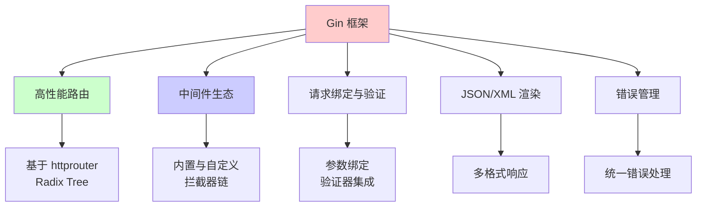
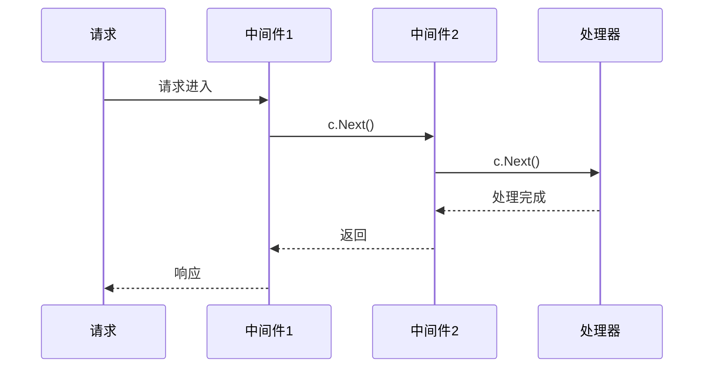
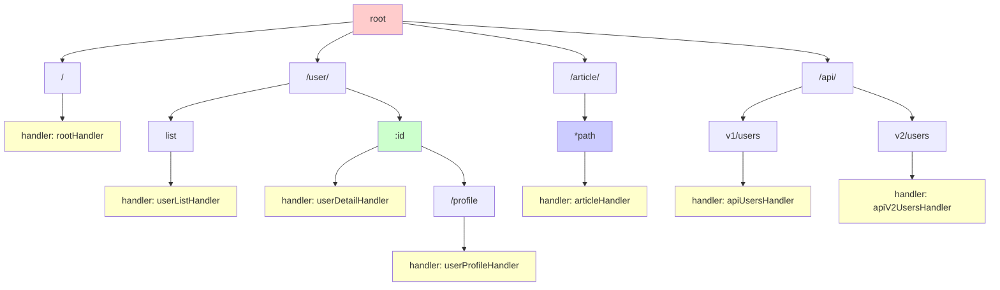
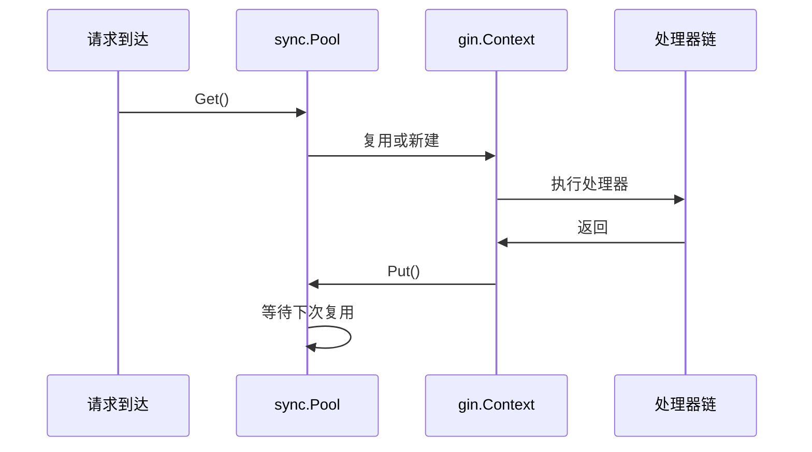
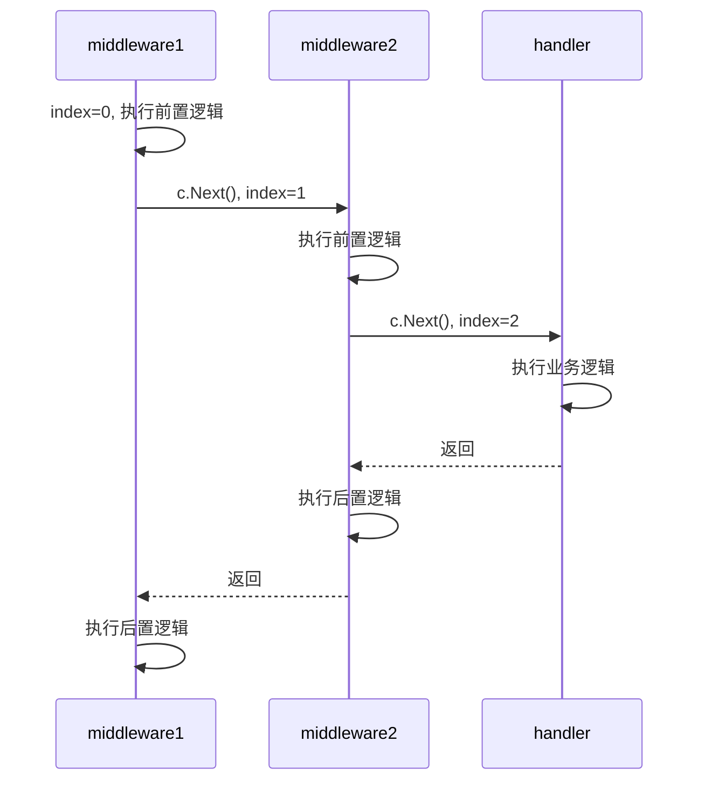
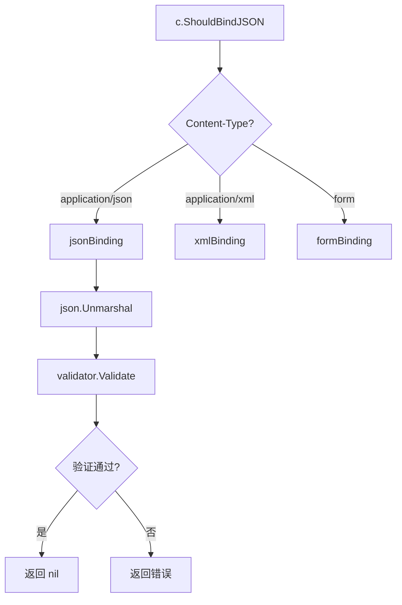

推荐阅读：[Gin GitHub](https://github.com/gin-gonic/gin) | [Gin 官方文档](https://gin-gonic.com/)

# Gin 框架概述

Gin 是 Go 语言中最流行的 Web 框架之一，以高性能、简洁的 API 和丰富的中间件生态著称。基于 httprouter，Gin 的路由性能极佳，适用于构建 RESTful API、微服务和 Web 应用。

## 核心特性



## 性能优势

- **路由**：使用 Radix Tree（基数树）匹配路由，时间复杂度 O(log n)
- **内存分配**：复用对象池（`sync.Pool`），减少 GC 压力
- **零反射**：核心路径不使用反射，性能更优

---

# 一、快速开始

## 1.1 安装

```bash
go get -u github.com/gin-gonic/gin
```

## 1.2 第一个 Gin 应用

```go
package main

import (
    "net/http"
    "github.com/gin-gonic/gin"
)

func main() {
    // 创建默认 Gin 引擎（带 Logger 和 Recovery 中间件）
    r := gin.Default()

    // 定义路由
    r.GET("/ping", func(c *gin.Context) {
        c.JSON(http.StatusOK, gin.H{
            "message": "pong",
        })
    })

    // 启动服务，监听 8080
    r.Run(":8080")
}
```

**访问**：`curl http://localhost:8080/ping` 返回 `{"message":"pong"}`

## 1.3 不使用默认中间件

```go
// 创建不带中间件的引擎
r := gin.New()
// 手动添加需要的中间件
r.Use(gin.Logger())
r.Use(gin.Recovery())
```

---

# 二、路由

## 2.1 HTTP 方法

Gin 支持所有标准 HTTP 方法：

```go
r.GET("/get", getHandler)
r.POST("/post", postHandler)
r.PUT("/put", putHandler)
r.DELETE("/delete", deleteHandler)
r.PATCH("/patch", patchHandler)
r.HEAD("/head", headHandler)
r.OPTIONS("/options", optionsHandler)
```

## 2.2 路径参数

```go
// 命名参数（:name）
r.GET("/user/:id", func(c *gin.Context) {
    id := c.Param("id")
    c.JSON(200, gin.H{"user_id": id})
})

// 通配符（*path）
r.GET("/files/*filepath", func(c *gin.Context) {
    path := c.Param("filepath")  // 如 /files/a/b/c.txt，path = "/a/b/c.txt"
    c.String(200, "Path: %s", path)
})
```

## 2.3 路由组（Router Group）

```go
// API 路由组
api := r.Group("/api")
{
    api.GET("/users", listUsers)
    api.GET("/users/:id", getUser)
    api.POST("/users", createUser)
}

// 嵌套路由组
v1 := r.Group("/api/v1")
{
    users := v1.Group("/users")
    {
        users.GET("", listUsers)
        users.POST("", createUser)
    }
}
```

## 2.4 路由冲突与优先级

Gin 基于 Radix Tree，路由按注册顺序与静态优先级匹配：

- **静态路由** > **命名参数** > **通配符**
- 同类型路由按注册顺序匹配

```go
r.GET("/user/new", newUserPage)    // 静态路由，优先级高
r.GET("/user/:id", getUser)        // 命名参数，次优先
r.GET("/*any", catchAll)           // 通配符，最低优先
```

---

# 三、中间件

## 3.1 内置中间件

```go
// Logger：打印请求日志
r.Use(gin.Logger())

// Recovery：捕获 panic 并返回 500
r.Use(gin.Recovery())
```

## 3.2 自定义中间件

```go
// 计时中间件
func TimerMiddleware() gin.HandlerFunc {
    return func(c *gin.Context) {
        start := time.Now()
        
        c.Next()  // 执行后续处理器
        
        duration := time.Since(start)
        log.Printf("Request took %v", duration)
    }
}

r.Use(TimerMiddleware())
```

## 3.3 中间件执行流程



## 3.4 中间件作用域

```go
// 全局中间件
r.Use(globalMiddleware())

// 路由组中间件
auth := r.Group("/admin", authMiddleware())
{
    auth.GET("/dashboard", dashboard)
}

// 单个路由中间件
r.GET("/special", middleware1(), middleware2(), handler)
```

## 3.5 中间件中止请求

```go
func AuthMiddleware() gin.HandlerFunc {
    return func(c *gin.Context) {
        token := c.GetHeader("Authorization")
        if token == "" {
            c.JSON(401, gin.H{"error": "Unauthorized"})
            c.Abort()  // 中止后续处理器
            return
        }
        c.Next()
    }
}
```

---

# 四、请求处理

## 4.1 查询参数（Query String）

```go
// GET /user?name=Alice&age=30
r.GET("/user", func(c *gin.Context) {
    name := c.Query("name")              // "Alice"
    age := c.DefaultQuery("age", "18")   // 默认值 "18"
    city := c.Query("city")              // ""（不存在）
    
    c.JSON(200, gin.H{
        "name": name,
        "age":  age,
        "city": city,
    })
})
```

## 4.2 表单数据（Form）

```go
// POST /login（application/x-www-form-urlencoded）
r.POST("/login", func(c *gin.Context) {
    username := c.PostForm("username")
    password := c.DefaultPostForm("password", "")
    
    c.JSON(200, gin.H{
        "username": username,
        "password": password,
    })
})
```

## 4.3 JSON 请求体

```go
type User struct {
    Name  string `json:"name" binding:"required"`
    Email string `json:"email" binding:"required,email"`
    Age   int    `json:"age" binding:"gte=0,lte=130"`
}

r.POST("/user", func(c *gin.Context) {
    var user User
    if err := c.ShouldBindJSON(&user); err != nil {
        c.JSON(400, gin.H{"error": err.Error()})
        return
    }
    c.JSON(200, user)
})
```

## 4.4 文件上传

### 单文件上传

```go
r.POST("/upload", func(c *gin.Context) {
    file, err := c.FormFile("file")
    if err != nil {
        c.JSON(400, gin.H{"error": err.Error()})
        return
    }
    
    // 保存文件
    dst := "./uploads/" + file.Filename
    if err := c.SaveUploadedFile(file, dst); err != nil {
        c.JSON(500, gin.H{"error": err.Error()})
        return
    }
    
    c.JSON(200, gin.H{"filename": file.Filename})
})
```

### 多文件上传

```go
r.POST("/upload-multiple", func(c *gin.Context) {
    form, _ := c.MultipartForm()
    files := form.File["files"]
    
    for _, file := range files {
        c.SaveUploadedFile(file, "./uploads/"+file.Filename)
    }
    
    c.JSON(200, gin.H{"count": len(files)})
})
```

## 4.5 路径与查询参数绑定

```go
type UserQuery struct {
    ID   string `uri:"id" binding:"required"`
    Name string `form:"name"`
    Age  int    `form:"age" binding:"gte=0"`
}

r.GET("/user/:id", func(c *gin.Context) {
    var query UserQuery
    if err := c.ShouldBindUri(&query); err != nil {
        c.JSON(400, gin.H{"error": err.Error()})
        return
    }
    if err := c.ShouldBindQuery(&query); err != nil {
        c.JSON(400, gin.H{"error": err.Error()})
        return
    }
    c.JSON(200, query)
})
```

---

# 五、响应

## 5.1 JSON 响应

```go
// gin.H 是 map[string]interface{} 的简写
r.GET("/json", func(c *gin.Context) {
    c.JSON(200, gin.H{
        "message": "success",
        "data":    []string{"a", "b", "c"},
    })
})

// 结构体响应
type Response struct {
    Code int    `json:"code"`
    Msg  string `json:"msg"`
}
r.GET("/struct", func(c *gin.Context) {
    c.JSON(200, Response{Code: 0, Msg: "ok"})
})
```

## 5.2 XML 响应

```go
r.GET("/xml", func(c *gin.Context) {
    c.XML(200, gin.H{"message": "success"})
})
```

## 5.3 HTML 模板

```go
// 加载模板
r.LoadHTMLGlob("templates/*")

r.GET("/index", func(c *gin.Context) {
    c.HTML(200, "index.html", gin.H{
        "title": "Home",
    })
})
```

## 5.4 文件下载

```go
r.GET("/download", func(c *gin.Context) {
    c.File("./files/example.pdf")
})

// 强制下载（设置 Content-Disposition）
r.GET("/download2", func(c *gin.Context) {
    c.FileAttachment("./files/example.pdf", "document.pdf")
})
```

## 5.5 重定向

```go
// HTTP 重定向
r.GET("/redirect", func(c *gin.Context) {
    c.Redirect(http.StatusMovedPermanently, "https://example.com")
})

// 路由重定向（内部）
r.GET("/test", func(c *gin.Context) {
    c.Request.URL.Path = "/test2"
    r.HandleContext(c)
})
```

## 5.6 流式响应（SSE）

```go
r.GET("/stream", func(c *gin.Context) {
    c.Header("Content-Type", "text/event-stream")
    c.Header("Cache-Control", "no-cache")
    c.Header("Connection", "keep-alive")
    
    for i := 0; i < 10; i++ {
        c.SSEvent("message", gin.H{"count": i})
        c.Writer.Flush()
        time.Sleep(time.Second)
    }
})
```

---

# 六、数据验证

Gin 使用 `validator` 库做字段验证，支持结构体标签。

## 6.1 常用验证规则

```go
type RegisterForm struct {
    Username string `binding:"required,min=3,max=20"`
    Email    string `binding:"required,email"`
    Age      int    `binding:"required,gte=18,lte=100"`
    Password string `binding:"required,min=6"`
}

r.POST("/register", func(c *gin.Context) {
    var form RegisterForm
    if err := c.ShouldBindJSON(&form); err != nil {
        c.JSON(400, gin.H{"error": err.Error()})
        return
    }
    c.JSON(200, gin.H{"message": "success"})
})
```

## 6.2 自定义验证器

```go
import "github.com/go-playground/validator/v10"

// 自定义验证函数
func validateUsername(fl validator.FieldLevel) bool {
    username := fl.Field().String()
    // 只允许字母数字下划线
    matched, _ := regexp.MatchString(`^[a-zA-Z0-9_]+$`, username)
    return matched
}

func main() {
    r := gin.Default()
    
    // 注册自定义验证器
    if v, ok := binding.Validator.Engine().(*validator.Validate); ok {
        v.RegisterValidation("username", validateUsername)
    }
    
    // 使用
    type User struct {
        Name string `binding:"required,username"`
    }
}
```

## 6.3 多种绑定模式

| 方法 | 说明 |
|------|------|
| `Bind` | 自动根据 Content-Type 选择绑定器，验证失败返回 400 |
| `ShouldBind` | 同上，但不自动返回错误，需手动处理 |
| `BindJSON` | 强制绑定 JSON |
| `ShouldBindJSON` | 同上，不自动返回错误 |
| `BindQuery` | 绑定查询参数 |
| `BindUri` | 绑定路径参数 |

---

# 七、错误处理

## 7.1 错误收集

```go
r.GET("/error", func(c *gin.Context) {
    c.Error(errors.New("database error"))
    c.Error(errors.New("cache error"))
    
    // 获取错误列表
    errs := c.Errors
    c.JSON(500, gin.H{"errors": errs.Errors()})
})
```

## 7.2 统一错误处理中间件

```go
func ErrorHandler() gin.HandlerFunc {
    return func(c *gin.Context) {
        c.Next()
        
        // 检查是否有错误
        if len(c.Errors) > 0 {
            err := c.Errors.Last()
            c.JSON(500, gin.H{
                "error": err.Error(),
            })
        }
    }
}

r.Use(ErrorHandler())
```

## 7.3 自定义错误类型

```go
type AppError struct {
    Code    int    `json:"code"`
    Message string `json:"message"`
}

func (e *AppError) Error() string {
    return e.Message
}

func ErrorMiddleware() gin.HandlerFunc {
    return func(c *gin.Context) {
        c.Next()
        
        if len(c.Errors) > 0 {
            err := c.Errors.Last().Err
            if appErr, ok := err.(*AppError); ok {
                c.JSON(appErr.Code, appErr)
            } else {
                c.JSON(500, gin.H{"error": err.Error()})
            }
        }
    }
}
```

---

# 八、认证与授权

## 8.1 基础认证（Basic Auth）

```go
// 内置中间件
authorized := r.Group("/admin", gin.BasicAuth(gin.Accounts{
    "admin": "secret",
    "user":  "password",
}))

authorized.GET("/dashboard", func(c *gin.Context) {
    user := c.MustGet(gin.AuthUserKey).(string)
    c.JSON(200, gin.H{"user": user})
})
```

## 8.2 JWT 认证

```go
import "github.com/golang-jwt/jwt/v4"

var jwtSecret = []byte("my-secret-key")

// 生成 Token
func GenerateToken(userID string) (string, error) {
    claims := jwt.MapClaims{
        "user_id": userID,
        "exp":     time.Now().Add(time.Hour * 24).Unix(),
    }
    token := jwt.NewWithClaims(jwt.SigningMethodHS256, claims)
    return token.SignedString(jwtSecret)
}

// JWT 中间件
func JWTMiddleware() gin.HandlerFunc {
    return func(c *gin.Context) {
        tokenString := c.GetHeader("Authorization")
        if tokenString == "" {
            c.JSON(401, gin.H{"error": "Missing token"})
            c.Abort()
            return
        }
        
        token, err := jwt.Parse(tokenString, func(t *jwt.Token) (interface{}, error) {
            return jwtSecret, nil
        })
        
        if err != nil || !token.Valid {
            c.JSON(401, gin.H{"error": "Invalid token"})
            c.Abort()
            return
        }
        
        claims := token.Claims.(jwt.MapClaims)
        c.Set("user_id", claims["user_id"])
        c.Next()
    }
}

// 使用
r.POST("/login", loginHandler)
protected := r.Group("/api", JWTMiddleware())
{
    protected.GET("/profile", profileHandler)
}
```

---

# 九、性能优化

## 9.1 对象池复用

Gin 内部使用 `sync.Pool` 复用 `gin.Context`，减少 GC 压力。

## 9.2 并发限制

```go
// 限制并发请求数
func MaxAllowed(n int) gin.HandlerFunc {
    sem := make(chan struct{}, n)
    return func(c *gin.Context) {
        sem <- struct{}{}
        defer func() { <-sem }()
        c.Next()
    }
}

r.Use(MaxAllowed(100))
```

## 9.3 响应压缩

```go
import "github.com/gin-contrib/gzip"

r.Use(gzip.Gzip(gzip.DefaultCompression))
```

## 9.4 优雅关闭

```go
srv := &http.Server{
    Addr:    ":8080",
    Handler: r,
}

go func() {
    if err := srv.ListenAndServe(); err != nil && err != http.ErrServerClosed {
        log.Fatalf("listen: %s\n", err)
    }
}()

// 监听信号
quit := make(chan os.Signal, 1)
signal.Notify(quit, syscall.SIGINT, syscall.SIGTERM)
<-quit

ctx, cancel := context.WithTimeout(context.Background(), 5*time.Second)
defer cancel()
if err := srv.Shutdown(ctx); err != nil {
    log.Fatal("Server forced to shutdown:", err)
}
```

---

# 十、完整示例：RESTful API

```go
package main

import (
    "net/http"
    "github.com/gin-gonic/gin"
)

type User struct {
    ID    int    `json:"id"`
    Name  string `json:"name" binding:"required"`
    Email string `json:"email" binding:"required,email"`
}

var users = []User{
    {ID: 1, Name: "Alice", Email: "alice@example.com"},
    {ID: 2, Name: "Bob", Email: "bob@example.com"},
}

func main() {
    r := gin.Default()
    
    // CORS 中间件
    r.Use(func(c *gin.Context) {
        c.Writer.Header().Set("Access-Control-Allow-Origin", "*")
        c.Next()
    })
    
    api := r.Group("/api/v1")
    {
        // 获取所有用户
        api.GET("/users", func(c *gin.Context) {
            c.JSON(200, users)
        })
        
        // 获取单个用户
        api.GET("/users/:id", func(c *gin.Context) {
            id := c.Param("id")
            for _, user := range users {
                if user.ID == atoi(id) {
                    c.JSON(200, user)
                    return
                }
            }
            c.JSON(404, gin.H{"error": "User not found"})
        })
        
        // 创建用户
        api.POST("/users", func(c *gin.Context) {
            var user User
            if err := c.ShouldBindJSON(&user); err != nil {
                c.JSON(400, gin.H{"error": err.Error()})
                return
            }
            user.ID = len(users) + 1
            users = append(users, user)
            c.JSON(201, user)
        })
        
        // 更新用户
        api.PUT("/users/:id", func(c *gin.Context) {
            id := c.Param("id")
            var input User
            if err := c.ShouldBindJSON(&input); err != nil {
                c.JSON(400, gin.H{"error": err.Error()})
                return
            }
            
            for i, user := range users {
                if user.ID == atoi(id) {
                    users[i].Name = input.Name
                    users[i].Email = input.Email
                    c.JSON(200, users[i])
                    return
                }
            }
            c.JSON(404, gin.H{"error": "User not found"})
        })
        
        // 删除用户
        api.DELETE("/users/:id", func(c *gin.Context) {
            id := c.Param("id")
            for i, user := range users {
                if user.ID == atoi(id) {
                    users = append(users[:i], users[i+1:]...)
                    c.JSON(204, nil)
                    return
                }
            }
            c.JSON(404, gin.H{"error": "User not found"})
        })
    }
    
    r.Run(":8080")
}

func atoi(s string) int {
    i, _ := strconv.Atoi(s)
    return i
}
```

---

# 十一、最佳实践

## 11.1 项目结构

```text
project/
├── main.go                # 入口
├── handlers/              # 处理器
│   ├── user.go
│   └── auth.go
├── middlewares/           # 中间件
│   ├── auth.go
│   └── logger.go
├── models/                # 数据模型
│   └── user.go
├── routes/                # 路由定义
│   └── routes.go
├── config/                # 配置
│   └── config.go
└── utils/                 # 工具函数
    └── response.go
```

## 11.2 统一响应格式

```go
type Response struct {
    Code int         `json:"code"`
    Msg  string      `json:"msg"`
    Data interface{} `json:"data,omitempty"`
}

func Success(c *gin.Context, data interface{}) {
    c.JSON(200, Response{Code: 0, Msg: "success", Data: data})
}

func Error(c *gin.Context, code int, msg string) {
    c.JSON(200, Response{Code: code, Msg: msg})
}
```

## 11.3 环境配置

```go
// 根据环境切换模式
if os.Getenv("ENV") == "production" {
    gin.SetMode(gin.ReleaseMode)
} else {
    gin.SetMode(gin.DebugMode)
}
```

## 11.4 日志记录

```go
// 自定义日志格式
r.Use(gin.LoggerWithFormatter(func(param gin.LogFormatterParams) string {
    return fmt.Sprintf("[%s] %s %s %d %s\n",
        param.TimeStamp.Format("2006-01-02 15:04:05"),
        param.Method,
        param.Path,
        param.StatusCode,
        param.Latency,
    )
}))
```

---

# 十二、底层实现原理

## 12.1 Engine 核心结构

Gin 的核心是 `Engine` 结构体，承载路由树、中间件链和配置。

```go
// gin/gin.go（简化版）
type Engine struct {
    RouterGroup                    // 内嵌根路由组
    
    pool             sync.Pool     // Context 对象池
    trees            methodTrees   // 每个 HTTP 方法对应一棵路由树
    
    // 配置
    MaxMultipartMemory int64
    RedirectTrailingSlash bool
    RedirectFixedPath bool
    HandleMethodNotAllowed bool
    
    // 其他字段...
}

type methodTrees []methodTree

type methodTree struct {
    method string
    root   *node  // Radix Tree 根节点
}
```

**关键点**：
- `sync.Pool` 复用 `gin.Context` 对象，减少 GC 压力
- `trees` 为每个 HTTP 方法（GET/POST 等）维护独立的 Radix Tree
- `RouterGroup` 内嵌，使 `Engine` 自身可作为根路由组

## 12.2 路由树（Radix Tree）

Gin 使用 **Radix Tree（基数树）** 存储路由，实现高效匹配。

### Radix Tree 示例结构

假设注册了以下路由：
```go
r.GET("/", rootHandler)
r.GET("/user/list", userListHandler)
r.GET("/user/:id", userDetailHandler)
r.GET("/user/:id/profile", userProfileHandler)
r.GET("/article/*path", articleHandler)
r.GET("/api/v1/users", apiUsersHandler)
r.GET("/api/v2/users", apiV2UsersHandler)
```

**Radix Tree 结构**（简化展示）：



**节点类型说明**：
- **静态节点**（红色）：完全匹配路径，如 `/user/list`
- **参数节点**（绿色）：以 `:` 开头，如 `:id`，匹配单个路径段
- **通配符节点**（蓝色）：以 `*` 开头，如 `*path`，匹配剩余所有路径
- **处理器节点**（黄色）：叶子节点，存储处理器链

**路径压缩示例**：

```text
原始路由:
  /api/v1/users
  /api/v2/users

压缩后的 Radix Tree:
  /api/
    ├─ v1/users [handler]
    └─ v2/users [handler]

而不是:
  /
    └─ a
        └─ p
            └─ i
                └─ /
                    └─ v
                        ├─ 1 ...
                        └─ 2 ...
```

**匹配优先级**：
1. **静态路径** > **参数路径** > **通配符路径**
2. 如 `/user/list` 优先于 `/user/:id`

### Radix Tree 节点结构

```go
// gin/tree.go（简化版）
type node struct {
    path      string        // 当前节点路径片段
    indices   string        // 子节点首字符索引（加速查找）
    wildChild bool          // 是否有通配符子节点
    nType     nodeType      // 节点类型（static/param/catchAll）
    priority  uint32        // 优先级（访问频率）
    children  []*node       // 子节点
    handlers  HandlersChain // 处理器链（叶子节点）
    fullPath  string        // 完整路径（用于错误信息）
}

type nodeType uint8

const (
    static nodeType = iota  // 静态路径，如 /user/list
    root                    // 根节点
    param                   // 参数节点，如 :id
    catchAll                // 通配符节点，如 *filepath
)
```

### 路由注册过程

```go
// 注册路由 GET /user/:id
func (engine *Engine) GET(path string, handlers ...HandlerFunc) {
    engine.addRoute("GET", path, handlers)
}

func (engine *Engine) addRoute(method, path string, handlers HandlersChain) {
    // 1. 获取或创建该 HTTP 方法的路由树
    root := engine.trees.get(method)
    if root == nil {
        root = new(node)
        engine.trees = append(engine.trees, methodTree{method: method, root: root})
    }
    
    // 2. 将路径插入 Radix Tree
    root.addRoute(path, handlers)
}
```

### 路由匹配过程

```go
// 请求 GET /user/123
func (engine *Engine) handleHTTPRequest(c *Context) {
    // 1. 获取 HTTP 方法对应的路由树
    t := engine.trees
    for i, tl := 0, len(t); i < tl; i++ {
        if t[i].method != httpMethod {
            continue
        }
        root := t[i].root
        
        // 2. 在 Radix Tree 中查找路径
        value := root.getValue(path, c.Params, unescape)
        if value.handlers != nil {
            c.handlers = value.handlers
            c.Params = value.params
            c.fullPath = value.fullPath
            c.Next()  // 执行处理器链
            return
        }
    }
    
    // 3. 未找到路由，返回 404
    c.handlers = engine.allNoRoute
    c.Next()
}
```

**时间复杂度**：O(log n)，n 为路由数量

## 12.3 Context 对象池

Gin 使用 `sync.Pool` 复用 `gin.Context` 对象，避免频繁分配与回收。

```go
// gin/gin.go
func (engine *Engine) ServeHTTP(w http.ResponseWriter, req *http.Request) {
    // 从对象池获取 Context
    c := engine.pool.Get().(*Context)
    c.writermem.reset(w)
    c.Request = req
    c.reset()
    
    // 处理请求
    engine.handleHTTPRequest(c)
    
    // 归还到对象池
    engine.pool.Put(c)
}
```

**流程**：



**优势**：
- 减少内存分配
- 降低 GC 压力
- 提升吞吐量

## 12.4 中间件链执行机制

Gin 的中间件通过 `HandlersChain`（`[]HandlerFunc`）实现，采用**索引递进**方式执行。

```go
// gin/context.go
type Context struct {
    handlers HandlersChain
    index    int8  // 当前执行到的处理器索引
    // ...
}

func (c *Context) Next() {
    c.index++
    for c.index < int8(len(c.handlers)) {
        c.handlers[c.index](c)
        c.index++
    }
}

func (c *Context) Abort() {
    c.index = abortIndex  // 127，跳过后续处理器
}
```

### 执行示例

```go
r.Use(middleware1, middleware2)
r.GET("/test", handler)

// HandlersChain: [middleware1, middleware2, handler]
```

**执行流程**：



**代码示例**：

```go
func middleware1(c *gin.Context) {
    fmt.Println("M1 前")
    c.Next()  // 调用下一个处理器
    fmt.Println("M1 后")
}

func middleware2(c *gin.Context) {
    fmt.Println("M2 前")
    c.Next()
    fmt.Println("M2 后")
}

func handler(c *gin.Context) {
    fmt.Println("Handler")
}

// 输出顺序：
// M1 前
// M2 前
// Handler
// M2 后
// M1 后
```

## 12.5 参数绑定机制

Gin 通过反射与结构体标签实现请求参数到结构体的自动绑定。

```go
// gin/binding/binding.go（简化版）
type Binding interface {
    Name() string
    Bind(*http.Request, interface{}) error
}

var (
    JSON          = jsonBinding{}
    XML           = xmlBinding{}
    Form          = formBinding{}
    Query         = queryBinding{}
    FormPost      = formPostBinding{}
    FormMultipart = formMultipartBinding{}
)

// JSON 绑定实现
type jsonBinding struct{}

func (jsonBinding) Bind(req *http.Request, obj interface{}) error {
    decoder := json.NewDecoder(req.Body)
    if err := decoder.Decode(obj); err != nil {
        return err
    }
    return validate(obj)  // 调用 validator 库验证
}
```

### 绑定流程



### 验证标签处理

```go
type User struct {
    Name string `json:"name" binding:"required,min=3"`
    Age  int    `json:"age" binding:"gte=0,lte=130"`
}

// validator 库解析 binding 标签并执行验证
// required: 非空
// min=3: 最小长度 3
// gte=0: 大于等于 0
```

## 12.6 路由组实现

路由组通过**路径前缀累加**与**中间件继承**实现。

```go
// gin/routergroup.go（简化版）
type RouterGroup struct {
    Handlers HandlersChain  // 该组的中间件
    basePath string         // 路径前缀
    engine   *Engine        // 指向 Engine
    root     bool           // 是否根组
}

func (group *RouterGroup) Group(relativePath string, handlers ...HandlerFunc) *RouterGroup {
    return &RouterGroup{
        Handlers: group.combineHandlers(handlers),  // 合并父组中间件
        basePath: group.calculateAbsolutePath(relativePath),  // 累加路径
        engine:   group.engine,
    }
}

func (group *RouterGroup) GET(relativePath string, handlers ...HandlerFunc) {
    // 计算完整路径：basePath + relativePath
    absolutePath := group.calculateAbsolutePath(relativePath)
    // 合并中间件：父组中间件 + 当前处理器
    handlers = group.combineHandlers(handlers)
    // 注册到 Engine
    group.engine.addRoute("GET", absolutePath, handlers)
}
```

### 路由组示例

```go
api := r.Group("/api", middleware1)
{
    v1 := api.Group("/v1", middleware2)
    {
        v1.GET("/users", handler)  // 路径: /api/v1/users
                                    // 中间件: [middleware1, middleware2, handler]
    }
}
```

## 12.7 性能优化点

### 1. 零拷贝路径存储

```go
// 路径字符串直接存在 node 中，避免额外分配
type node struct {
    path string  // 共享底层字节数组
}
```

### 2. 子节点快速索引

```go
// indices 存储子节点首字符，加速查找
type node struct {
    indices string  // 如 "ul" 表示子节点首字符为 'u' 和 'l'
    children []*node
}

// 查找时通过首字符快速定位
func (n *node) findChild(c byte) *node {
    for i := 0; i < len(n.indices); i++ {
        if n.indices[i] == c {
            return n.children[i]
        }
    }
    return nil
}
```

### 3. 优先级调整

```go
// 访问频率高的路由优先匹配
type node struct {
    priority uint32  // 每次访问 +1
}

// 插入时按 priority 排序子节点
```

---

# 十三、小结

- **Gin** 是高性能、简洁的 Go Web 框架，基于 httprouter 与 Radix Tree 实现快速路由。
- **路由**：支持 RESTful 路由、路径参数、通配符、路由组。
- **中间件**：可全局、分组或单路由级别应用，通过 `c.Next()` 实现拦截器链。
- **请求与响应**：支持 JSON/Form/Query/File 绑定，多种响应格式（JSON/XML/HTML/文件/重定向）。
- **验证**：集成 `validator` 库，支持结构体标签与自定义验证器。
- **底层实现**：Engine 核心、Radix Tree 路由匹配、Context 对象池、中间件链索引递进、参数绑定与验证、路由组前缀累加。
- **性能优化**：sync.Pool 复用、零拷贝路径、子节点索引、优先级调整。
- **实践**：合理组织项目结构、统一响应格式、环境配置、日志记录、优雅关闭与性能优化。
