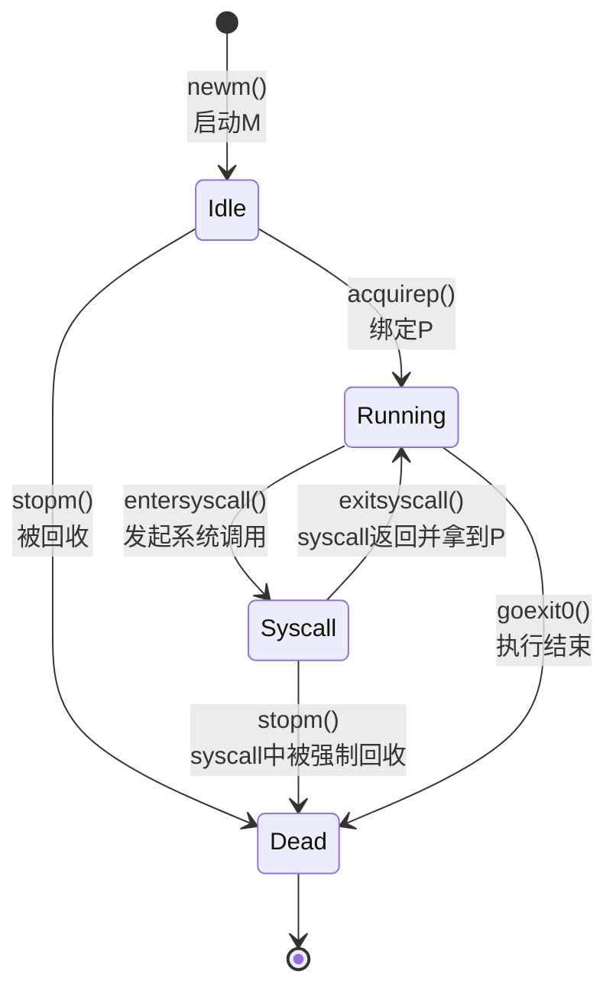
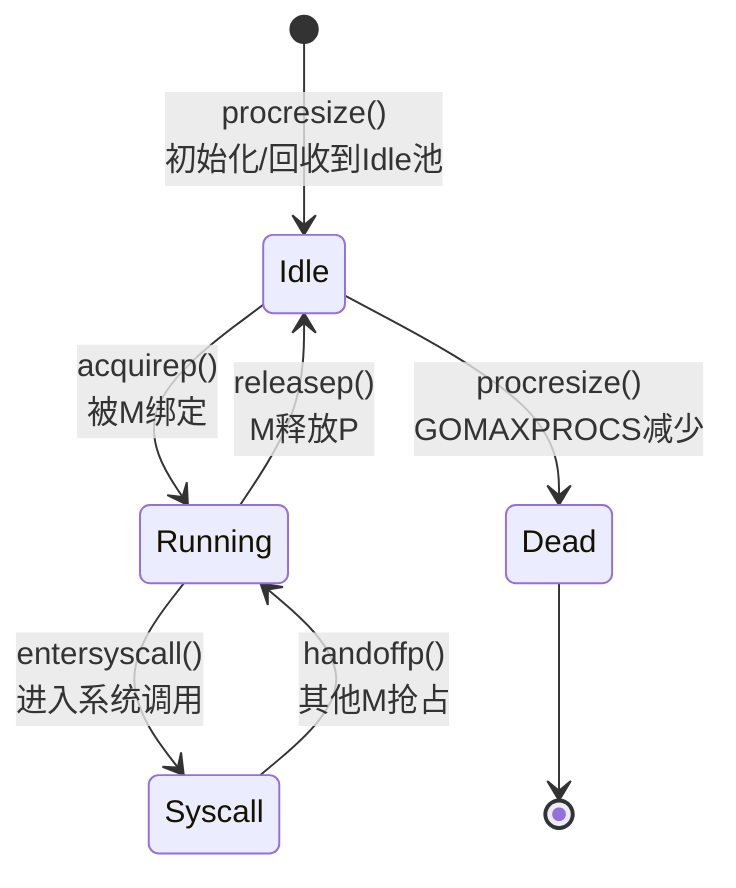
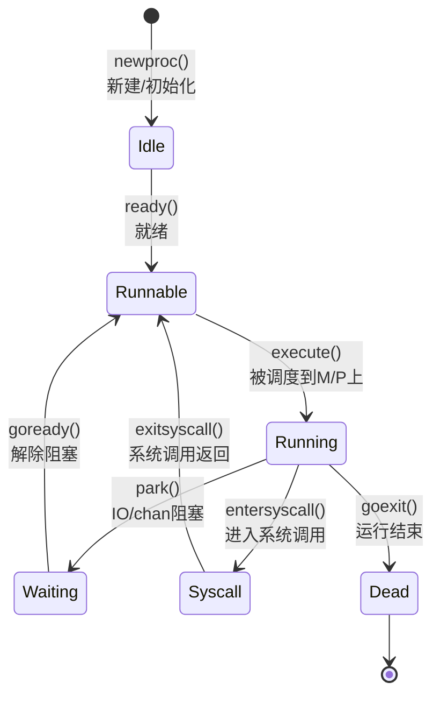

# golang MPG 有限状态机简介

Golang 的运行时调度器（Scheduler）中，将协程（goroutine）的调度和执行建模为有限状态机，将涉及到 M（Machine，内核线程）、P（Processor，调度器的调度资源）、G（Goroutine，协程）三种核心对象。它们的状态变化按有限状态机方式驱动，实现高效协作。

下图描述了 MPG 的关系（见官方 Sched 源码注释，有经典状态图）。

去掉了 cgo 和 GC 的相关状态转化，以下是三者的常见状态机：

---

# M（Machine）状态机

M 代表一个操作系统线程，主要用于执行 Go 代码。M 的主要状态有：

- _Idle_（空闲）
- _Runnable_（可运行/待分配 P）
- _Running_（正在运行，已和 P 绑定）
- _Syscall_（正在执行系统调用）
- _Dead_（已退出）

状态流转关键点：

- M 启动时是 Idle，调度分配到 P 后变为 Running。
- M 进入系统调用时状态转为 Syscall，此时不参与 Go 代码的调度；系统调用返回后需重新绑定 P 后恢复 Running。
- M 可被回收为 Dead。

流程例子：

1. 创建/唤醒线程（Idle）→ 绑定调度器 P（Running）→ 执行 Go 代码。
2. Running 执行 syscall（Syscall）→ syscall 返回后尝试重新获取 P（Running）。
3. 没有可用任务 / 被回收（Dead）。

## M（Machine）状态转换流程（Mermaid）

**状态转换函数说明：**
- `newm()`: 创建新的 M 线程，初始状态为 Idle
- `acquirep()`: M 从空闲 P 列表获取 P，绑定后进入 Running 状态
- `entersyscall()`: M 进入系统调用，状态转为 Syscall，释放 P
- `exitsyscall()`: 系统调用返回，尝试重新获取 P，成功则进入 Running
- `stopm()`: 停止 M，将 M 状态设为 Dead，可能被回收
- `goexit0()`: G 执行完毕，M 可能进入空闲或退出

---

# P（Processor）状态机

P 表示调度器调度资源，是 M 执行 G 的上下文。P 的主要状态：

- _Idle_（空闲）
- _Runnable_（可运行、与 M 绑定）
- _Running_（正和某个 M 绑定执行任务）
- _Syscall_（被 M 进入 syscall 暂时挂起）
- _Dead_（被回收）

状态关键流程：

- 程序启动初始化 N 个 P，P 空闲时位于 Idle 列表。
- M 获取 P 后，P 变为 Running。
- M 进入 syscall，P 会被其它 M 夺走。
- 当 GOMAXPROCS 调整数减少时，多余的 P 会回收成 Dead。

## P（Processor）状态转换流程（Mermaid）

**状态转换函数说明：**
- `procresize()`: 调整 P 的数量，初始化 P 或回收多余的 P
- `acquirep()`: M 从空闲列表获取 P，P 状态转为 Running
- `entersyscall()`: M 进入系统调用，P 被释放，状态转为 Syscall
- `handoffp()`: 当 M 进入系统调用时，P 被其他 M 抢占，状态转为 Running
- `releasep()`: M 释放 P，将 P 放回空闲列表，状态转为 Idle
- `pidleget()`: 从空闲 P 列表获取 P（内部调用）
- `pidleput()`: 将 P 放回空闲列表（内部调用）

---

# G（Goroutine）状态机

G 代表 Go 协程，也是调度的最小单位。状态包括：

- _Idle_（空闲，未运行）
- _Runnable_（可就绪，等待调度）
- _Running_（正在 M/P 上执行）
- _Syscall_（进入 syscall，挂起等待）
- _Waiting_（被阻塞，等信号/定时器/chan 等）
- _Dead_（退出，被回收）

G 状态流转举例：

1. 创建协程时，G 为 Idle → 放入可运行队列变为 Runnable。
2. 被 M/P 调度后 Running，运行完成后 Dead。
3. 阻塞（如 chan recv）则 Waiting，等待事件恢复后重变为 Runnable。
4. 执行 syscall 时则 Syscall，完成后变 Running 或 Runnable。

## G（Goroutine）状态转换流程（Mermaid）

**状态转换函数说明：**
- `newproc()`: 创建新的 G，初始状态为 Idle
- `ready()`: 将 G 放入可运行队列（本地或全局），状态转为 Runnable
- `execute()`: M 执行 G，G 状态转为 Running
- `park()`: G 被阻塞（如 chan 操作、锁等待），状态转为 Waiting
- `goready()`: 唤醒被阻塞的 G，将其放入可运行队列，状态转为 Runnable
- `entersyscall()`: G 进入系统调用，状态转为 Syscall，M 可能释放 P
- `exitsyscall()`: 系统调用返回，G 状态转为 Runnable，等待重新调度
- `goexit()`: G 执行完毕，状态转为 Dead，可能被回收

---

## 整体 MPG 协作图示意

- M 获取 P 执行 G
- M 从全局/本地可运行队列取 G 执行
- G 执行被阻塞/进入 syscall，会释放 M 或 P
- 状态变迁由调度组件通过原子操作与锁维护

---

# 状态转换函数详解

## M（Machine）相关函数

| 函数名 | 功能说明 | 位置 |
|--------|---------|------|
| `newm()` | 创建新的 M 线程，调用 `newm1()` 创建系统线程，初始状态为 Idle | runtime/proc.go |
| `acquirep()` | M 从空闲 P 列表获取 P，绑定后进入 Running 状态，开始执行 G | runtime/proc.go |
| `releasep()` | M 释放 P，将 P 放回空闲列表，M 可能进入 Idle 状态 | runtime/proc.go |
| `handoffp()` | 将 P 移交给其他 M，用于系统调用返回后的 P 重新分配 | runtime/proc.go |
| `stopm()` | 停止 M，将 M 状态设为 Dead，M 进入休眠或退出 | runtime/proc.go |
| `entersyscall()` | M 进入系统调用，释放 P，状态转为 Syscall | runtime/proc.go |
| `exitsyscall()` | 系统调用返回，尝试重新获取 P，成功则进入 Running | runtime/proc.go |
| `startm()` | 启动一个空闲的 M 或创建新的 M 来执行 P | runtime/proc.go |

## P（Processor）相关函数

| 函数名 | 功能说明 | 位置 |
|--------|---------|------|
| `procresize()` | 调整 P 的数量，初始化 P 或回收多余的 P，用于 GOMAXPROCS 调整 | runtime/proc.go |
| `acquirep()` | M 从空闲列表获取 P，P 状态转为 Running | runtime/proc.go |
| `releasep()` | M 释放 P，将 P 放回空闲列表，状态转为 Idle | runtime/proc.go |
| `pidleget()` | 从空闲 P 列表获取 P（内部函数） | runtime/proc.go |
| `pidleput()` | 将 P 放回空闲列表（内部函数） | runtime/proc.go |
| `handoffp()` | 当 M 进入系统调用时，P 被其他 M 抢占，状态转为 Running | runtime/proc.go |
| `entersyscall()` | M 进入系统调用，P 被释放，状态转为 Syscall | runtime/proc.go |

## G（Goroutine）相关函数

| 函数名 | 功能说明 | 位置 |
|--------|---------|------|
| `newproc()` | 创建新的 G，调用 `newproc1()` 创建协程结构体，初始状态为 Idle | runtime/proc.go |
| `ready()` | 将 G 放入可运行队列（本地 runq 或全局 runq），状态转为 Runnable | runtime/proc.go |
| `execute()` | M 执行 G，G 状态转为 Running，开始执行用户代码 | runtime/proc.go |
| `park()` | G 被阻塞（如 chan 操作、锁等待、select 阻塞），状态转为 Waiting | runtime/proc.go |
| `goready()` | 唤醒被阻塞的 G，将其放入可运行队列，状态转为 Runnable | runtime/proc.go |
| `goexit()` | G 执行完毕，调用 `goexit1()` 清理资源，状态转为 Dead | runtime/proc.go |
| `goexit0()` | G 退出后的清理工作，将 G 放回空闲列表，M 继续调度其他 G | runtime/proc.go |
| `entersyscall()` | G 进入系统调用，状态转为 Syscall，M 可能释放 P | runtime/proc.go |
| `exitsyscall()` | 系统调用返回，G 状态转为 Runnable，等待重新调度 | runtime/proc.go |
| `findrunnable()` | M 查找可运行的 G，从本地队列、全局队列、网络轮询器获取 | runtime/proc.go |
| `runqput()` | 将 G 放入运行队列（本地或全局） | runtime/proc.go |
| `runqget()` | 从运行队列获取 G | runtime/proc.go |

## 调度器核心函数

| 函数名 | 功能说明 | 位置 |
|--------|---------|------|
| `schedule()` | 调度器的核心函数，M 获取 P 后调用，查找并执行 G | runtime/proc.go |
| `findrunnable()` | 查找可运行的 G，按优先级从本地队列、全局队列、网络轮询器获取 | runtime/proc.go |
| `wakep()` | 唤醒空闲的 M 或创建新的 M 来执行 P | runtime/proc.go |
| `stopTheWorld()` | 停止所有 M，用于 GC 等场景 | runtime/proc.go |
| `startTheWorld()` | 恢复所有 M，继续执行 | runtime/proc.go |

---

**参考：**

- Go 源码 runtime/proc.go
- Go官方文档与调度器注释
- 《Go 语言实现原理》专栏