推荐阅读：[Go Map Source Code](https://go.dev/src/runtime/map.go)

# Golang Map 内部实现详解

Go 语言的 map 是基于哈希表实现的，采用拉链法解决哈希冲突。本文详细分析 map 的内部结构和实现机制。

## 核心数据结构关系

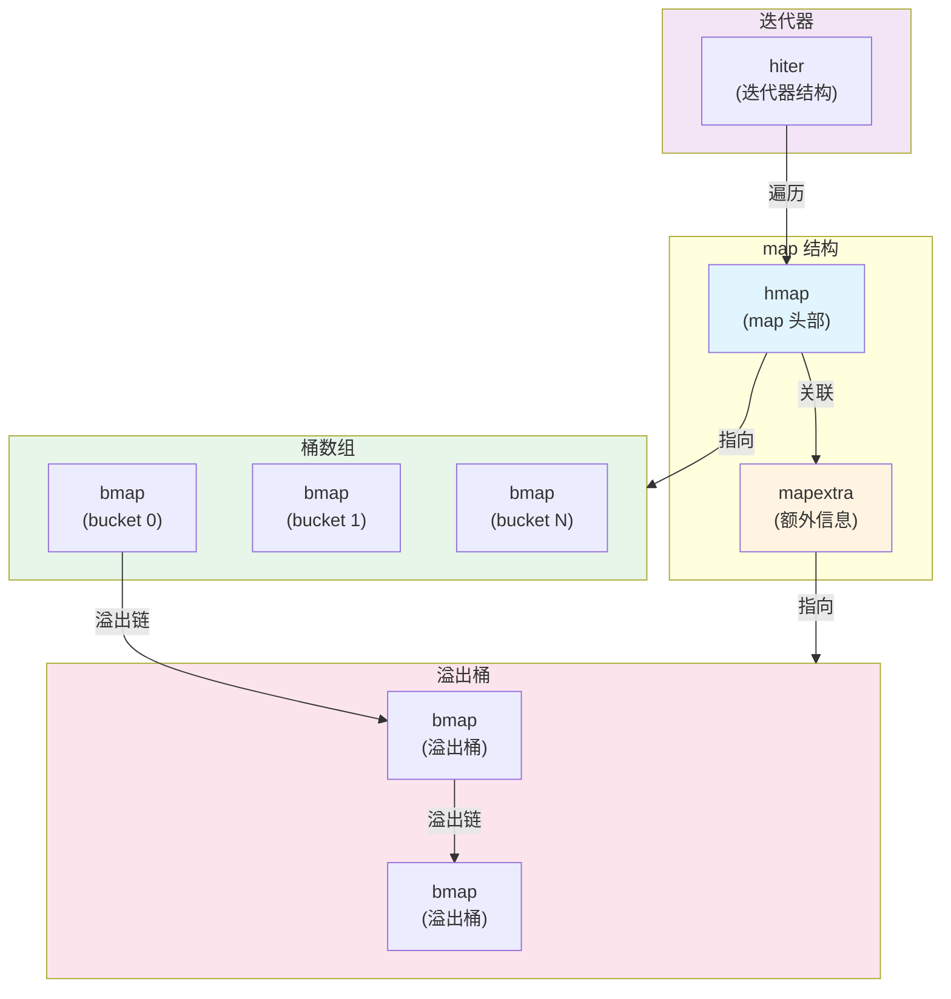

# 结构体详解

## hmap (map 头部结构)

`hmap` 是 map 的核心结构，存储 map 的元数据和状态信息。

### 结构定义

```go
type hmap struct {
    count     int    // map 中元素的数量
    flags     uint8  // 状态标志位
    B         uint8  // 桶数组大小的对数 (2^B 个桶)
    noverflow uint16 // 溢出桶的大概数量
    
    hash0     uint32 // 哈希种子
    
    buckets    unsafe.Pointer // 指向桶数组的指针
    oldbuckets unsafe.Pointer // 扩容时指向旧桶数组
    
    nevacuate  uintptr // 扩容进度计数器
    
    extra *mapextra // 额外信息
}
```

### 字段说明

- **count**: 当前 map 中键值对的数量
- **flags**: 状态标志，如 `iterator`（正在迭代）、`oldIterator`（旧桶正在迭代）、`hashWriting`（正在写入）
- **B**: 桶数组大小的对数，实际桶数量为 `2^B`
- **noverflow**: 溢出桶的近似数量
- **hash0**: 哈希函数的随机种子，用于减少哈希碰撞
- **buckets**: 指向当前桶数组的指针
- **oldbuckets**: 扩容时指向旧桶数组，用于渐进式扩容
- **nevacuate**: 扩容时已迁移的桶数量
- **extra**: 指向额外信息的指针

### 内存布局

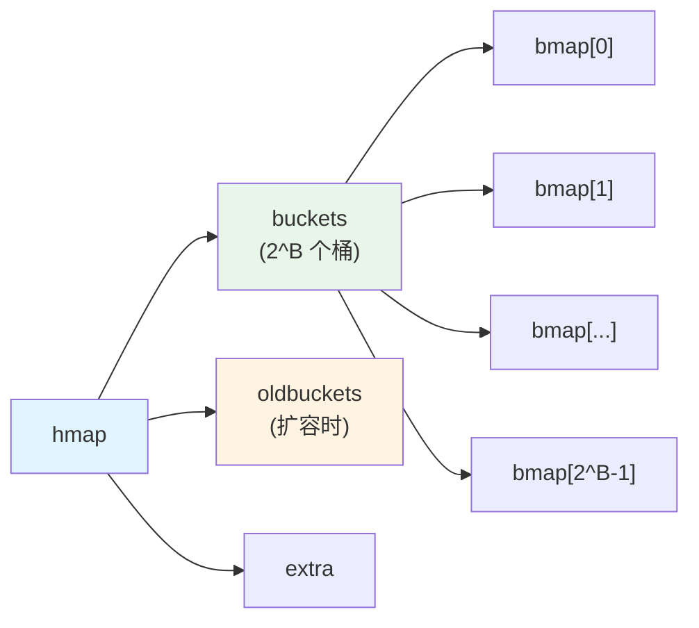

## mapextra (额外信息)

`mapextra` 存储 map 的额外信息，主要用于优化和扩容。

### 结构定义

```go
type mapextra struct {
    overflow    *[]*bmap  // 溢出桶列表
    oldoverflow *[]*bmap  // 扩容时的旧溢出桶
    
    nextOverflow *bmap    // 预分配的溢出桶
}
```

### 字段说明

- **overflow**: 指向溢出桶数组的指针，存储所有溢出桶
- **oldoverflow**: 扩容时指向旧溢出桶数组
- **nextOverflow**: 指向下一个可用的预分配溢出桶

### 作用

- **溢出桶管理**: 当桶满时，使用溢出桶存储额外的键值对
- **扩容优化**: 在扩容过程中管理新旧溢出桶
- **内存预分配**: 预分配一些溢出桶，减少分配次数

## bmap (桶结构)

`bmap` 是哈希桶的基本单元，每个桶可以存储 8 个键值对。

### 结构定义

```go
type bmap struct {
    tophash [bucketCnt]uint8  // 存储每个 key 的哈希值高 8 位
    // 注意：以下字段在编译时动态生成
    // keys     [bucketCnt]keyType
    // values   [bucketCnt]valueType
    // overflow *bmap           // 溢出桶指针
}
```

### 字段说明

- **tophash**: 数组，存储 8 个键的哈希值高 8 位，用于快速比较
- **keys**: 8 个键的数组（编译时生成）
- **values**: 8 个值的数组（编译时生成）
- **overflow**: 指向溢出桶的指针，形成链表

### 内存布局

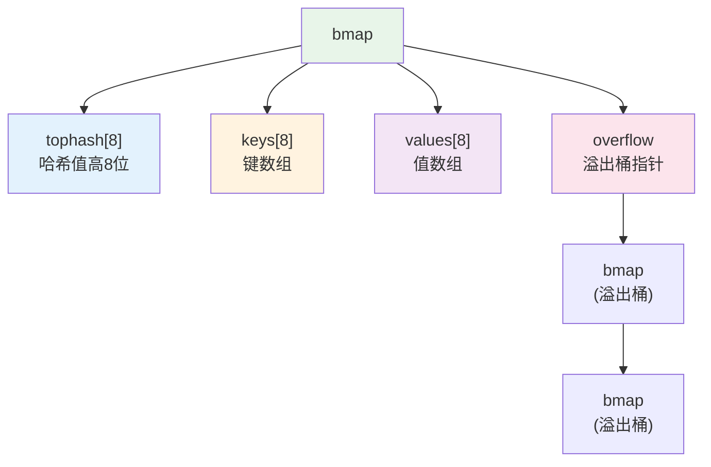

### 查找流程

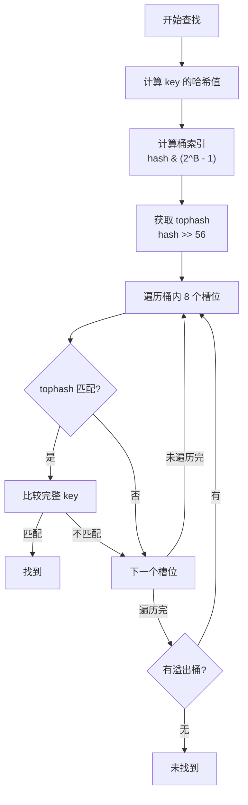

## hiter (迭代器结构)

`hiter` 用于遍历 map，支持随机顺序迭代。

### 结构定义

```go
type hiter struct {
    key         unsafe.Pointer // 当前键的指针
    value       unsafe.Pointer // 当前值的指针
    t           *maptype       // map 类型信息
    h           *hmap          // 指向 map 的指针
    buckets     unsafe.Pointer // 当前遍历的桶数组
    bptr        *bmap          // 当前桶指针
    overflow    *[]*bmap       // 溢出桶数组
    oldoverflow *[]*bmap       // 旧溢出桶数组
    startBucket uintptr        // 起始桶索引
    offset      uint8          // 桶内偏移
    wrapped     bool           // 是否已遍历一圈
    B           uint8          // 桶数组大小的对数
    bucket      uintptr        // 当前桶索引
    bucketIdx   uintptr        // 桶内索引
    bucketCnt   uintptr        // 桶内元素计数
    oldbucket   uintptr        // 旧桶索引（扩容时）
    oldbucketIdx uintptr       // 旧桶内索引
    evacuate    bool           // 是否在扩容
}
```

### 字段说明

- **key/value**: 当前迭代的键值对指针
- **h**: 指向 map 的指针
- **buckets**: 当前遍历的桶数组
- **startBucket**: 随机起始桶，保证迭代的随机性
- **offset**: 桶内的起始偏移，保证随机性
- **wrapped**: 标记是否已经遍历完所有桶

### 迭代流程

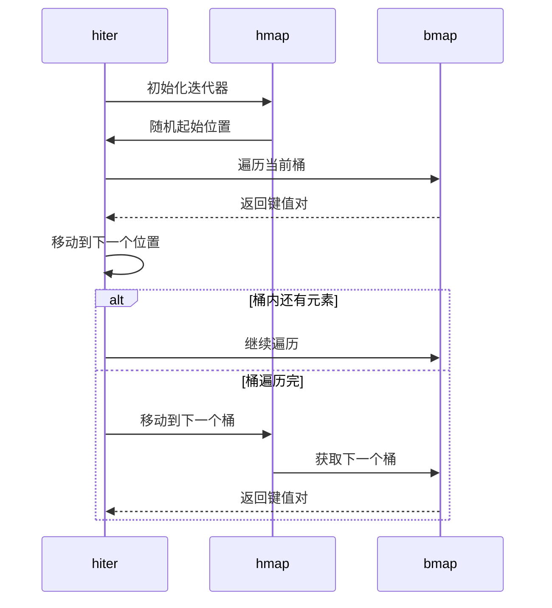

## evacDst (扩容目标)

`evacDst` 用于扩容时记录数据迁移的目标位置。

### 结构定义

```go
type evacDst struct {
    b *bmap          // 目标桶
    i int            // 桶内索引
    k unsafe.Pointer // 键指针
    v unsafe.Pointer // 值指针
}
```

### 字段说明

- **b**: 目标桶指针
- **i**: 桶内的槽位索引
- **k/v**: 键值对的指针

### 作用

在扩容过程中，`evacDst` 用于记录每个键值对应该迁移到新桶数组的哪个位置。

# 函数实现分析

## makemap (创建 map)

创建并初始化一个新的 map。

### 实现逻辑

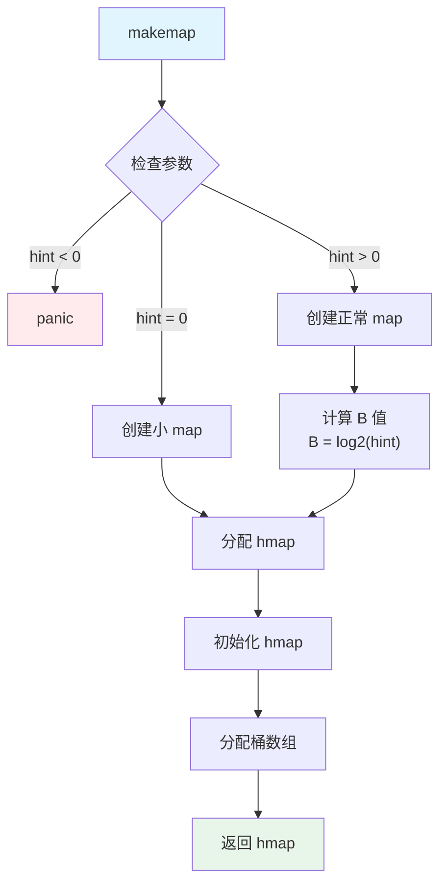

### 关键步骤

1. **参数检查**: 验证 hint（预期元素数量）是否合法
2. **计算桶数量**: `B = log2(hint)`，实际桶数为 `2^B`
3. **分配内存**: 分配 `hmap` 结构和桶数组
4. **初始化**: 设置哈希种子、标志位等

### 代码要点

- 如果 hint 为 0，创建小 map，延迟分配桶数组
- 如果 hint > 0，预分配桶数组，减少扩容次数
- 使用 `makeBucketArray` 分配桶数组

## makeBucketArray (创建桶数组)

分配并初始化桶数组。

### 实现逻辑

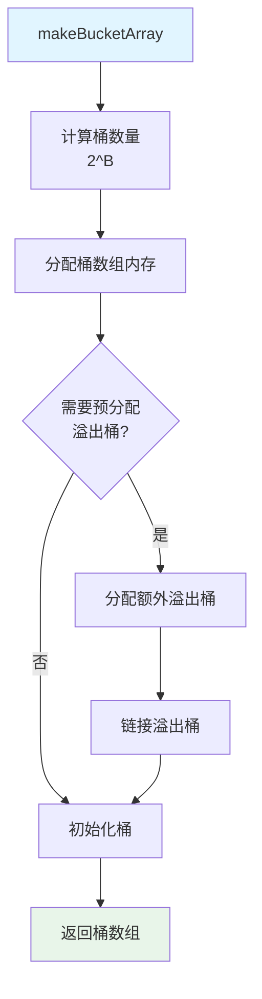

### 关键步骤

1. **计算大小**: 根据 B 值计算需要的桶数量
2. **内存分配**: 分配桶数组内存
3. **预分配溢出桶**: 如果 B >= 4，预分配一些溢出桶
4. **初始化**: 将所有桶的 tophash 初始化为 0

## mapaccess1 (访问 map - 单值返回)

根据 key 查找对应的 value（单值返回版本）。

### 实现逻辑

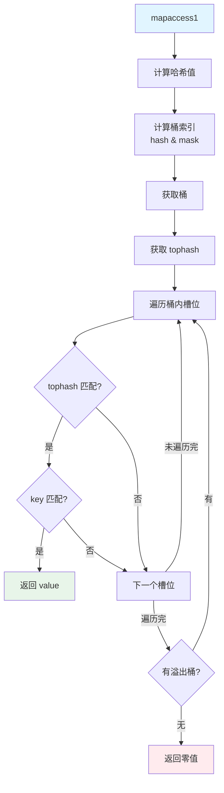

### 关键步骤

1. **哈希计算**: `hash := alg.hash(key, uintptr(h.hash0))`
2. **桶定位**: `bucket := hash & bucketMask(h.B)`
3. **tophash 比较**: 先比较 tophash，快速过滤
4. **key 比较**: tophash 匹配后再比较完整 key
5. **溢出桶**: 如果当前桶未找到，遍历溢出桶链表

### 优化点

- **tophash 预过滤**: 先比较 8 位 tophash，避免完整 key 比较
- **内存对齐**: keys 和 values 分开存储，提高缓存命中率

## mapassign (赋值操作)

向 map 中插入或更新键值对。

### 实现逻辑

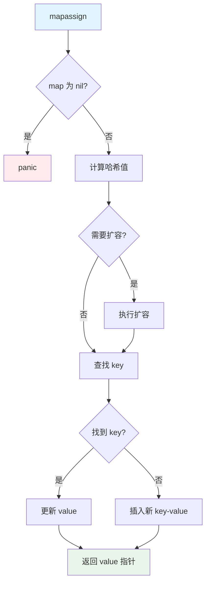

### 关键步骤

1. **检查 nil**: 如果 map 为 nil，panic
2. **哈希计算**: 计算 key 的哈希值
3. **扩容检查**: 检查是否需要扩容
4. **查找位置**: 查找 key 是否存在
5. **更新或插入**: 如果存在则更新，否则插入新键值对

### 扩容触发条件

- `count > bucketCnt * 2^B * 6.5` (负载因子 > 6.5)
- 溢出桶过多

## mapdelete (删除操作)

从 map 中删除指定的键值对。

### 实现逻辑

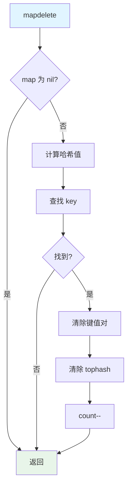

### 关键步骤

1. **查找 key**: 使用类似 `mapaccess1` 的逻辑查找
2. **清除数据**: 将 tophash 设为 `emptyOne` 或 `emptyRest`
3. **更新计数**: `h.count--`
4. **优化**: 如果删除后桶为空，可以尝试合并溢出桶

### tophash 状态

- `emptyRest`: 该槽位及之后都为空
- `emptyOne`: 该槽位为空，但后面可能有数据

## mapiterinit (初始化迭代器)

初始化 map 迭代器，设置随机起始位置。

### 实现逻辑

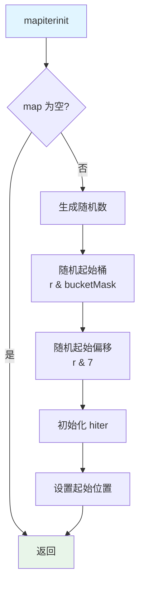

### 关键步骤

1. **随机起始桶**: `it.startBucket = r & bucketMask(h.B)`
2. **随机起始偏移**: `it.offset = uint8(r >> h.B & (bucketCnt - 1))`
3. **初始化字段**: 设置迭代器的各种字段
4. **处理扩容**: 如果 map 正在扩容，需要处理新旧桶

### 随机性保证

- 使用随机起始位置，保证每次迭代顺序不同
- 避免攻击者通过迭代顺序推断 map 内部结构

## mapiternext (迭代下一个元素)

获取迭代器的下一个键值对。

### 实现逻辑

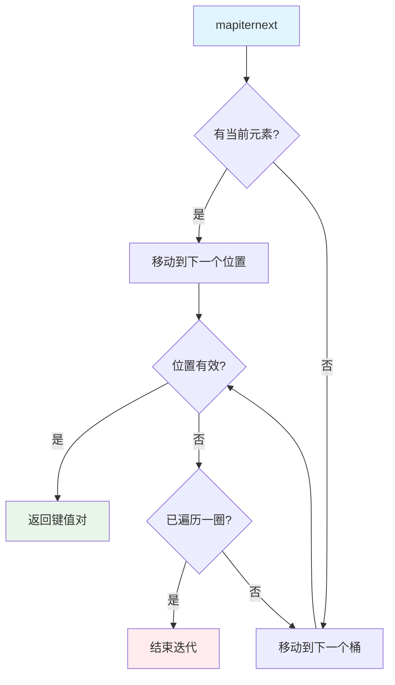

### 关键步骤

1. **当前位置**: 从当前桶的当前偏移开始
2. **跳过空槽**: 跳过 tophash 为空的槽位
3. **处理溢出桶**: 如果当前桶遍历完，遍历溢出桶
4. **移动到下一桶**: 桶遍历完后，移动到下一个桶
5. **检查结束**: 如果回到起始位置，迭代结束

## mapclear (清空 map)

清空 map 中的所有键值对。

### 实现逻辑

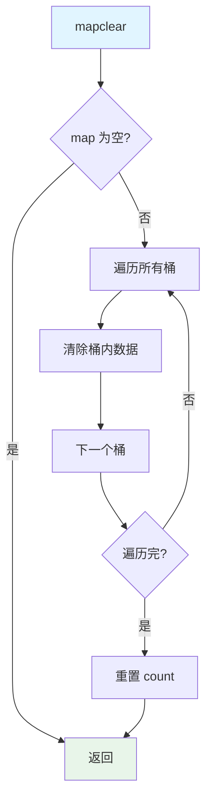

### 关键步骤

1. **遍历所有桶**: 包括溢出桶
2. **清除数据**: 将 tophash 设为 `emptyRest`
3. **重置计数**: `h.count = 0`
4. **保留结构**: 不清除桶数组，保留内存以便重用

## hashGrow (触发扩容)

当 map 需要扩容时，分配新的桶数组。

### 实现逻辑

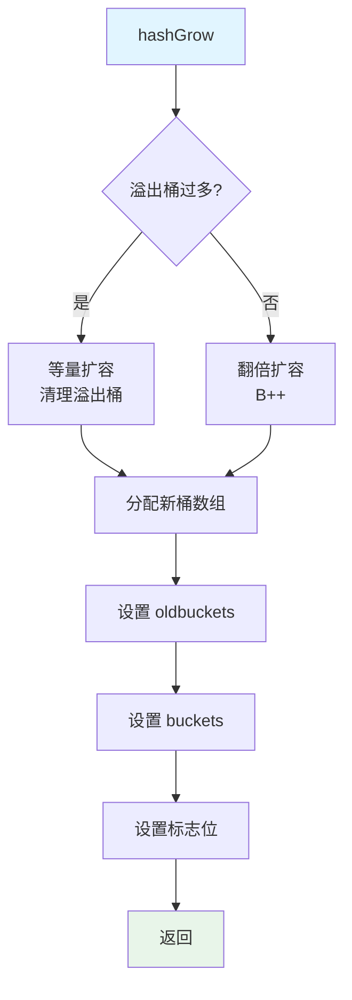

### 扩容类型

1. **等量扩容**: 溢出桶过多时，重新分配相同大小的桶数组，清理溢出桶
2. **翻倍扩容**: 元素数量过多时，桶数量翻倍（B++）

### 关键步骤

1. **判断扩容类型**: 根据溢出桶数量决定
2. **分配新桶数组**: 分配 `2^(B+1)` 或 `2^B` 个桶
3. **设置指针**: `h.oldbuckets = h.buckets`, `h.buckets = newbuckets`
4. **渐进式迁移**: 不立即迁移，在后续操作中逐步迁移

## growWork (执行扩容工作)

在 map 操作过程中执行部分扩容工作。

### 实现逻辑

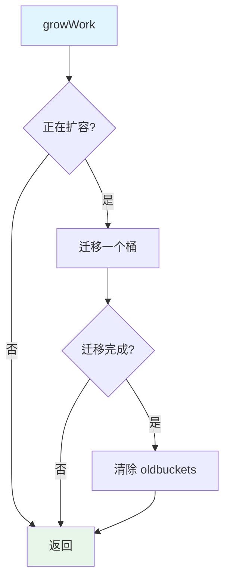

### 渐进式扩容

- **分散成本**: 将扩容成本分散到多次操作中
- **每次迁移**: 每次操作迁移 1-2 个桶
- **避免阻塞**: 避免一次性迁移造成长时间阻塞

## evacuate (迁移桶)

将旧桶数组中的键值对迁移到新桶数组。

### 实现逻辑

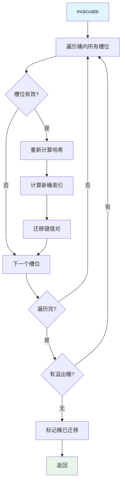

### 关键步骤

1. **遍历桶**: 遍历桶内所有有效槽位
2. **重新哈希**: 对每个 key 重新计算哈希值
3. **新位置**: 根据新哈希值计算在新桶数组中的位置
4. **迁移数据**: 将键值对复制到新位置
5. **处理溢出桶**: 递归处理溢出桶

### 迁移策略

- **X 方向**: 迁移到相同索引的桶（等量扩容）
- **Y 方向**: 迁移到索引 + 旧桶数量的桶（翻倍扩容）

## advanceEvacuationMark (推进迁移标记)

推进扩容迁移的进度标记。

### 实现逻辑

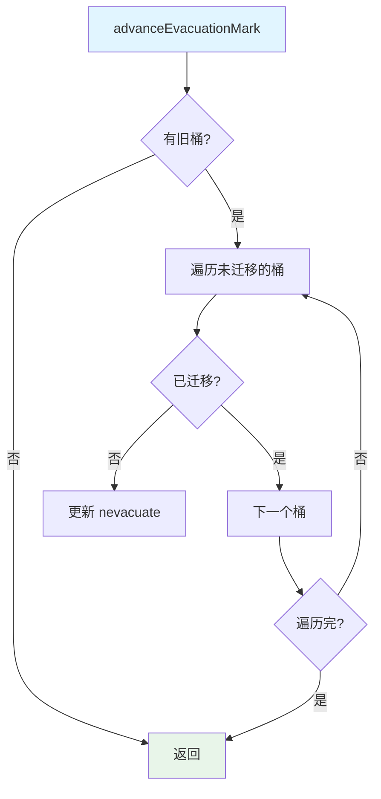

### 作用

- **进度跟踪**: 跟踪扩容迁移的进度
- **优化查找**: 在查找时，如果旧桶已迁移，直接在新桶中查找
- **清理时机**: 当所有桶迁移完成后，可以清理旧桶数组

## reflect 相关函数

Go 的反射包提供了访问 map 内部结构的函数。

### 主要函数

- **Value.MapKeys()**: 获取 map 的所有 key
- **Value.MapIndex()**: 根据 key 获取 value
- **Value.MapRange()**: 返回 map 的迭代器

### 实现原理

反射函数最终调用 runtime 包中的底层函数，如 `mapiterinit` 和 `mapiternext`。

# 总结

Go map 的实现特点：

1. **哈希表 + 拉链法**: 使用哈希表存储，拉链法解决冲突
2. **渐进式扩容**: 扩容时逐步迁移，避免阻塞
3. **内存优化**: keys 和 values 分开存储，提高缓存效率
4. **并发安全**: 写入时检测并发，panic 保护
5. **随机迭代**: 迭代顺序随机，保证安全性

理解 map 的内部实现有助于：
- 优化 map 的使用方式
- 理解 map 的性能特征
- 避免常见的并发问题
- 更好地使用 map 进行开发
