推荐阅读：[Go Map Source Code](https://go.dev/src/runtime/map.go)

# Golang Map 内部实现详解

Go 语言的 map 是基于哈希表实现的，采用拉链法解决哈希冲突。本文详细分析 map 的内部结构和实现机制。

## 核心数据结构关系

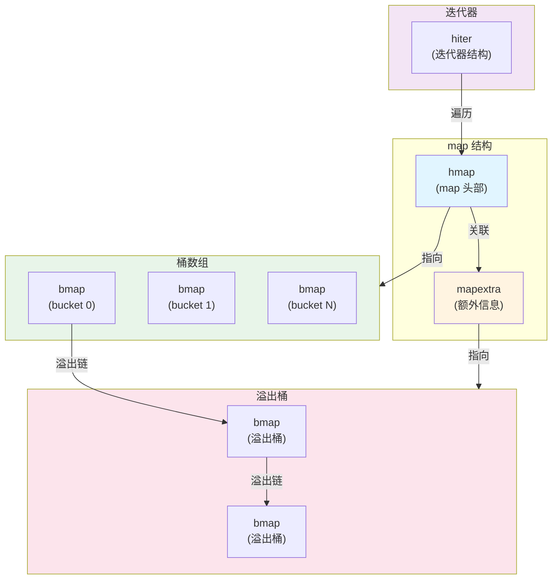
```mermaid
graph TB
    subgraph Map["map 结构"]
        H["hmap<br/>(map 头部)"]
        E["mapextra<br/>(额外信息)"]
    end
    
    subgraph Buckets["桶数组"]
        B1["bmap<br/>(bucket 0)"]
        B2["bmap<br/>(bucket 1)"]
        B3["bmap<br/>(bucket N)"]
    end
    
    subgraph Overflow["溢出桶"]
        O1["bmap<br/>(溢出桶)"]
        O2["bmap<br/>(溢出桶)"]
    end
    
    subgraph Iterator["迭代器"]
        I["hiter<br/>(迭代器结构)"]
    end
    
    H -->|指向| Buckets
    H -->|关联| E
    E -->|指向| Overflow
    B1 -->|溢出链| O1
    O1 -->|溢出链| O2
    I -->|遍历| H
    
    style H fill:#e1f5ff
    style E fill:#fff4e1
    style Buckets fill:#e8f5e9
    style Overflow fill:#fce4ec
    style Iterator fill:#f3e5f5
```

# 结构体详解

## hmap (map 头部结构)

`hmap` 是 map 的核心结构，存储 map 的元数据和状态信息。

### 结构定义

```go
type hmap struct {
    count     int    // map 中元素的数量
    flags     uint8  // 状态标志位
    B         uint8  // 桶数组大小的对数 (2^B 个桶)
    noverflow uint16 // 溢出桶的大概数量
    
    hash0     uint32 // 哈希种子
    
    buckets    unsafe.Pointer // 指向桶数组的指针
    oldbuckets unsafe.Pointer // 扩容时指向旧桶数组
    
    nevacuate  uintptr // 扩容进度计数器
    
    extra *mapextra // 额外信息
}
```

### 字段说明

- **count**: 当前 map 中键值对的数量
- **flags**: 状态标志，如 `iterator`（正在迭代）、`oldIterator`（旧桶正在迭代）、`hashWriting`（正在写入）
- **B**: 桶数组大小的对数，实际桶数量为 `2^B`
- **noverflow**: 溢出桶的近似数量
- **hash0**: 哈希函数的随机种子，用于减少哈希碰撞
- **buckets**: 指向当前桶数组的指针
- **oldbuckets**: 扩容时指向旧桶数组，用于渐进式扩容
- **nevacuate**: 扩容时已迁移的桶数量
- **extra**: 指向额外信息的指针

### 内存布局

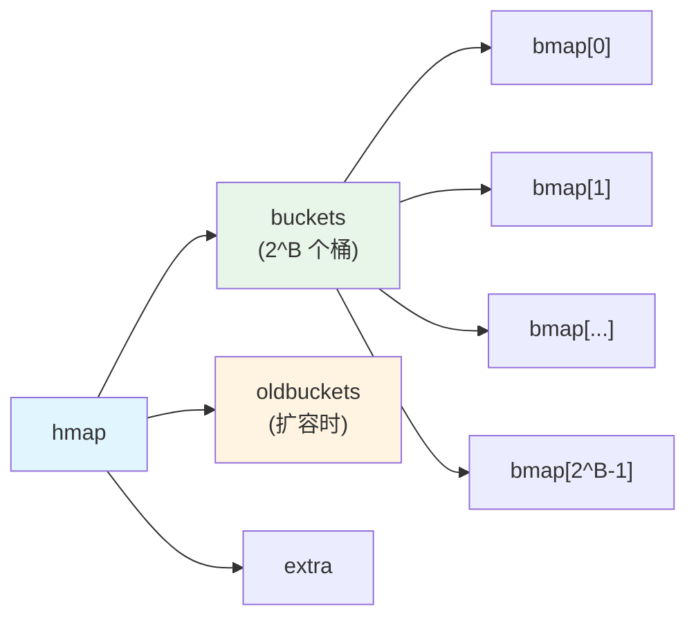
```mermaid
graph LR
    H["hmap"] --> B["buckets<br/>(2^B 个桶)"]
    H --> O["oldbuckets<br/>(扩容时)"]
    H --> E["extra"]
    
    B --> B1["bmap[0]"]
    B --> B2["bmap[1]"]
    B --> B3["bmap[...]"]
    B --> B4["bmap[2^B-1]"]
    
    style H fill:#e1f5ff
    style B fill:#e8f5e9
    style O fill:#fff4e1
```

## mapextra (额外信息)

`mapextra` 存储 map 的额外信息，主要用于优化和扩容。

### 结构定义

```go
type mapextra struct {
    overflow    *[]*bmap  // 溢出桶列表
    oldoverflow *[]*bmap  // 扩容时的旧溢出桶
    
    nextOverflow *bmap    // 预分配的溢出桶
}
```

### 字段说明

- **overflow**: 指向溢出桶数组的指针，存储所有溢出桶
- **oldoverflow**: 扩容时指向旧溢出桶数组
- **nextOverflow**: 指向下一个可用的预分配溢出桶

### 作用

- **溢出桶管理**: 当桶满时，使用溢出桶存储额外的键值对
- **扩容优化**: 在扩容过程中管理新旧溢出桶
- **内存预分配**: 预分配一些溢出桶，减少分配次数

## bmap (桶结构)

`bmap` 是哈希桶的基本单元，每个桶可以存储 8 个键值对。

### 结构定义

```go
type bmap struct {
    tophash [bucketCnt]uint8  // 存储每个 key 的哈希值高 8 位
    // 注意：以下字段在编译时动态生成
    // keys     [bucketCnt]keyType
    // values   [bucketCnt]valueType
    // overflow *bmap           // 溢出桶指针
}
```

### 字段说明

- **tophash**: 数组，存储 8 个键的哈希值高 8 位，用于快速比较
- **keys**: 8 个键的数组（编译时生成）
- **values**: 8 个值的数组（编译时生成）
- **overflow**: 指向溢出桶的指针，形成链表

### 内存布局

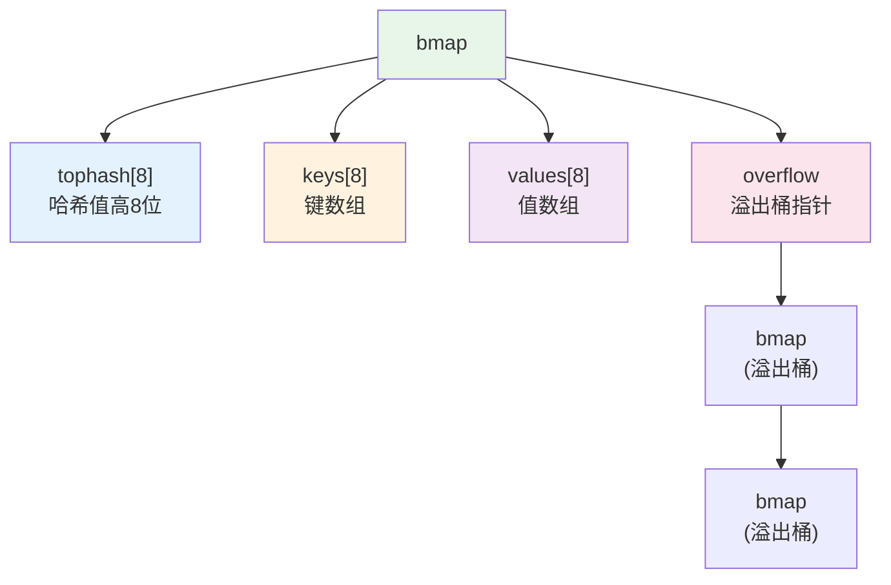
```mermaid
graph TB
    B["bmap"] --> T["tophash[8]<br/>哈希值高8位"]
    B --> K["keys[8]<br/>键数组"]
    B --> V["values[8]<br/>值数组"]
    B --> O["overflow<br/>溢出桶指针"]
    
    O --> O1["bmap<br/>(溢出桶)"]
    O1 --> O2["bmap<br/>(溢出桶)"]
    
    style B fill:#e8f5e9
    style T fill:#e3f2fd
    style K fill:#fff3e0
    style V fill:#f3e5f5
    style O fill:#fce4ec
```

### 查找流程

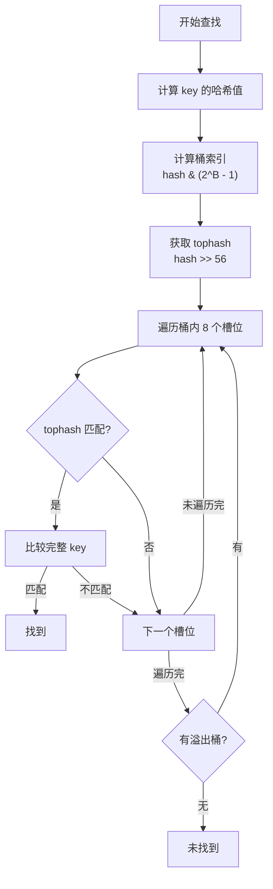
```mermaid
flowchart TD
    Start["开始查找"] --> Hash["计算 key 的哈希值"]
    Hash --> Index["计算桶索引<br/>hash & (2^B - 1)"]
    Index --> TopHash["获取 tophash<br/>hash >> 56"]
    TopHash --> Loop["遍历桶内 8 个槽位"]
    Loop --> Match{tophash 匹配?}
    Match -->|是| Compare["比较完整 key"]
    Match -->|否| Next["下一个槽位"]
    Compare -->|匹配| Found["找到"]
    Compare -->|不匹配| Next
    Next -->|未遍历完| Loop
    Next -->|遍历完| Overflow{有溢出桶?}
    Overflow -->|有| Loop
    Overflow -->|无| NotFound["未找到"]
```

## hiter (迭代器结构)

`hiter` 用于遍历 map，支持随机顺序迭代。

### 结构定义

```go
type hiter struct {
    key         unsafe.Pointer // 当前键的指针
    value       unsafe.Pointer // 当前值的指针
    t           *maptype       // map 类型信息
    h           *hmap          // 指向 map 的指针
    buckets     unsafe.Pointer // 当前遍历的桶数组
    bptr        *bmap          // 当前桶指针
    overflow    *[]*bmap       // 溢出桶数组
    oldoverflow *[]*bmap       // 旧溢出桶数组
    startBucket uintptr        // 起始桶索引
    offset      uint8          // 桶内偏移
    wrapped     bool           // 是否已遍历一圈
    B           uint8          // 桶数组大小的对数
    bucket      uintptr        // 当前桶索引
    bucketIdx   uintptr        // 桶内索引
    bucketCnt   uintptr        // 桶内元素计数
    oldbucket   uintptr        // 旧桶索引（扩容时）
    oldbucketIdx uintptr       // 旧桶内索引
    evacuate    bool           // 是否在扩容
}
```

### 字段说明

- **key/value**: 当前迭代的键值对指针
- **h**: 指向 map 的指针
- **buckets**: 当前遍历的桶数组
- **startBucket**: 随机起始桶，保证迭代的随机性
- **offset**: 桶内的起始偏移，保证随机性
- **wrapped**: 标记是否已经遍历完所有桶

### 迭代流程

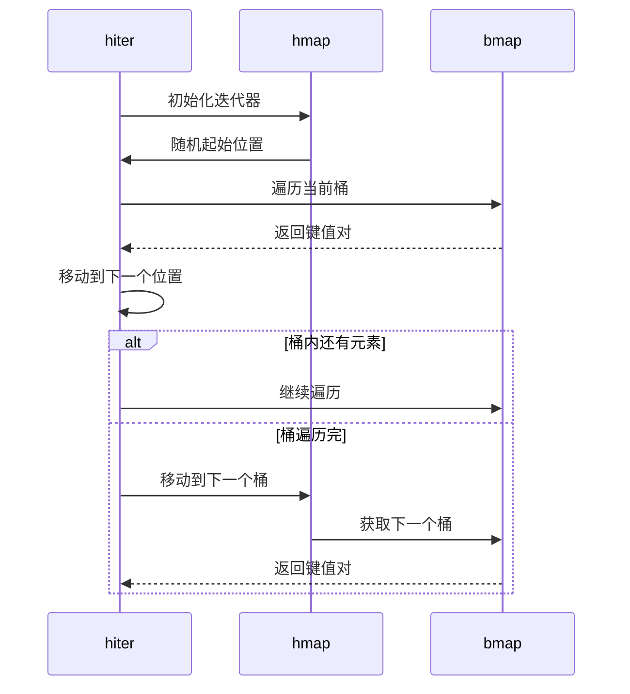
```mermaid
sequenceDiagram
    participant I as hiter
    participant M as hmap
    participant B as bmap
    
    I->>M: 初始化迭代器
    M->>I: 随机起始位置
    I->>B: 遍历当前桶
    B-->>I: 返回键值对
    I->>I: 移动到下一个位置
    alt 桶内还有元素
        I->>B: 继续遍历
    else 桶遍历完
        I->>M: 移动到下一个桶
        M->>B: 获取下一个桶
        B-->>I: 返回键值对
    end
```

## evacDst (扩容目标)

`evacDst` 用于扩容时记录数据迁移的目标位置。

### 结构定义

```go
type evacDst struct {
    b *bmap          // 目标桶
    i int            // 桶内索引
    k unsafe.Pointer // 键指针
    v unsafe.Pointer // 值指针
}
```

### 字段说明

- **b**: 目标桶指针
- **i**: 桶内的槽位索引
- **k/v**: 键值对的指针

### 作用

在扩容过程中，`evacDst` 用于记录每个键值对应该迁移到新桶数组的哪个位置。

# 函数实现分析

## makemap (创建 map)

创建并初始化一个新的 map。

### 实现逻辑

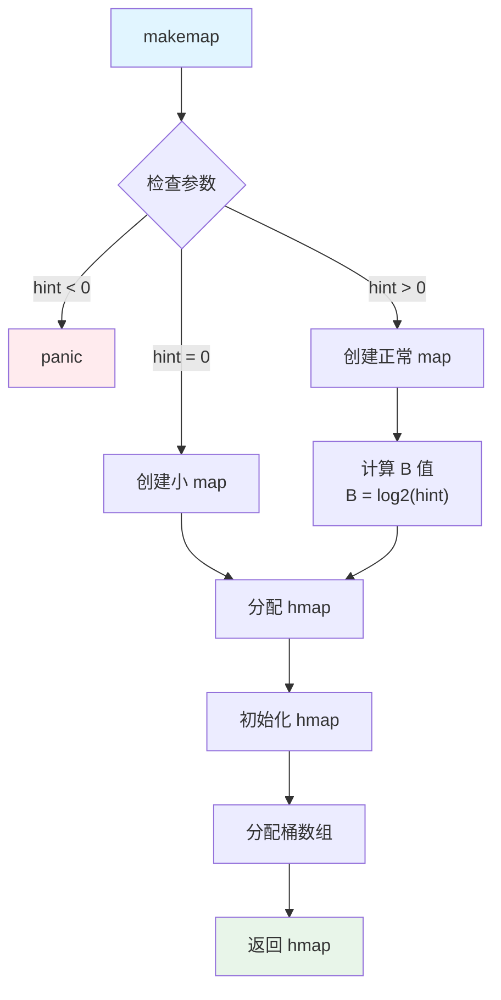
```mermaid
flowchart TD
    Start["makemap"] --> Check{检查参数}
    Check -->|hint < 0| Error["panic"]
    Check -->|hint = 0| Small["创建小 map"]
    Check -->|hint > 0| Normal["创建正常 map"]
    
    Small --> Alloc["分配 hmap"]
    Normal --> Calc["计算 B 值<br/>B = log2(hint)"]
    Calc --> Alloc
    
    Alloc --> Init["初始化 hmap"]
    Init --> Buckets["分配桶数组"]
    Buckets --> Return["返回 hmap"]
    
    style Start fill:#e1f5ff
    style Error fill:#ffebee
    style Return fill:#e8f5e9
```

### 关键步骤

1. **参数检查**: 验证 hint（预期元素数量）是否合法
2. **计算桶数量**: `B = log2(hint)`，实际桶数为 `2^B`
3. **分配内存**: 分配 `hmap` 结构和桶数组
4. **初始化**: 设置哈希种子、标志位等

### 代码要点

- 如果 hint 为 0，创建小 map，延迟分配桶数组
- 如果 hint > 0，预分配桶数组，减少扩容次数
- 使用 `makeBucketArray` 分配桶数组

### makemap 实现（简化）

```go
const (
    bucketCntBits = 3
    bucketCnt     = 1 << bucketCntBits  // 8
    loadFactorNum = 13
    loadFactorDen = 2  // 负载因子约 6.5
)

func makemap(t *maptype, hint int, h *hmap) *hmap {
    if hint < 0 || hint > int(maxSliceCap(t.bucket.size)) {
        hint = 0
    }

    if h == nil {
        h = new(hmap)
    }
    h.hash0 = fastrand()

    B := uint8(0)
    for overLoadFactor(hint, B) {
        B++
    }
    h.B = B

    if h.B != 0 {
        var nextOverflow *bmap
        h.buckets, nextOverflow = makeBucketArray(t, h.B, nil)
        if nextOverflow != nil {
            h.extra = new(mapextra)
            h.extra.nextOverflow = nextOverflow
        }
    }
    return h
}

// overLoadFactor 判断 count 是否超过 2^B 桶的负载因子阈值
func overLoadFactor(count int, B uint8) bool {
    return count > bucketCnt && uintptr(count) > loadFactorNum*(bucketShift(B)/loadFactorDen)
}

func bucketShift(b uint8) uintptr {
    return uintptr(1) << (b & (sys.PtrSize*8 - 1))
}

// maptype 由编译器生成，包含 key/value 类型、hasher、bucket 大小等
// dataOffset 为 bmap 中 keys 相对 bmap 的偏移（tophash 之后）
```

## makeBucketArray (创建桶数组)

分配并初始化桶数组。

### 实现逻辑

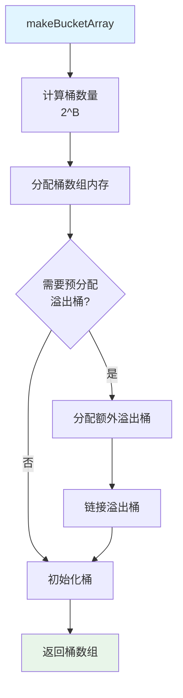
```mermaid
flowchart TD
    Start["makeBucketArray"] --> Calc["计算桶数量<br/>2^B"]
    Calc --> Alloc["分配桶数组内存"]
    Alloc --> PreAlloc{需要预分配<br/>溢出桶?}
    PreAlloc -->|是| Extra["分配额外溢出桶"]
    PreAlloc -->|否| Init
    Extra --> Link["链接溢出桶"]
    Link --> Init["初始化桶"]
    Init --> Return["返回桶数组"]
    
    style Start fill:#e1f5ff
    style Return fill:#e8f5e9
```

### 关键步骤

1. **计算大小**: 根据 B 值计算需要的桶数量
2. **内存分配**: 分配桶数组内存
3. **预分配溢出桶**: 如果 B >= 4，预分配一些溢出桶
4. **初始化**: 将所有桶的 tophash 初始化为 0

### makeBucketArray 实现（简化）

```go
func makeBucketArray(t *maptype, b uint8, dirtyalloc unsafe.Pointer) (buckets unsafe.Pointer, nextOverflow *bmap) {
    base := bucketShift(b)
    nbuckets := base
    if b >= 4 {
        nbuckets += bucketShift(b - 4)  // 预分配若干溢出桶
    }

    if dirtyalloc == nil {
        buckets = newarray(t.bucket, int(nbuckets))
    } else {
        buckets = dirtyalloc
    }

    if b >= 4 {
        last := (*bmap)(add(buckets, (nbuckets-1)*uintptr(t.bucketsize)))
        last.setoverflow(t, (*bmap)(buckets))  // 最后一个桶的 overflow 指向第一块预分配溢出区
    }
    return buckets, nextOverflow
}
```

## mapaccess1 (访问 map - 单值返回)

根据 key 查找对应的 value（单值返回版本）。

### 实现逻辑

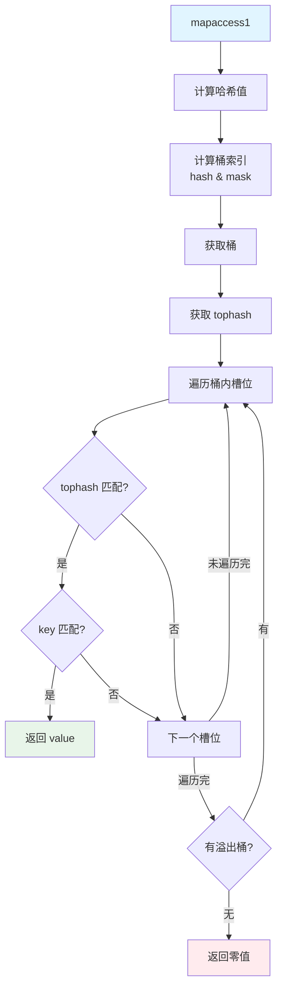
```mermaid
flowchart TD
    Start["mapaccess1"] --> Hash["计算哈希值"]
    Hash --> Index["计算桶索引<br/>hash & mask"]
    Index --> Bucket["获取桶"]
    Bucket --> TopHash["获取 tophash"]
    TopHash --> Loop["遍历桶内槽位"]
    Loop --> Match{tophash 匹配?}
    Match -->|是| KeyMatch{key 匹配?}
    Match -->|否| Next["下一个槽位"]
    KeyMatch -->|是| Found["返回 value"]
    KeyMatch -->|否| Next
    Next -->|未遍历完| Loop
    Next -->|遍历完| Overflow{有溢出桶?}
    Overflow -->|有| Loop
    Overflow -->|无| NotFound["返回零值"]
    
    style Start fill:#e1f5ff
    style Found fill:#e8f5e9
    style NotFound fill:#ffebee
```

### 关键步骤

1. **哈希计算**: `hash := alg.hash(key, uintptr(h.hash0))`
2. **桶定位**: `bucket := hash & bucketMask(h.B)`
3. **tophash 比较**: 先比较 tophash，快速过滤
4. **key 比较**: tophash 匹配后再比较完整 key
5. **溢出桶**: 如果当前桶未找到，遍历溢出桶链表

### 优化点

- **tophash 预过滤**: 先比较 8 位 tophash，避免完整 key 比较
- **内存对齐**: keys 和 values 分开存储，提高缓存命中率

### mapaccess1 实现（简化）

```go
const (
    emptyRest  = 0  // 该槽位及之后都为空
    emptyOne   = 1  // 该槽位为空
    evacuatedX = 2  // 已迁移到新桶前半部分
    evacuatedY = 3  // 已迁移到新桶后半部分
    minTopHash = 4  // tophash 最小值，0/1/2/3 为特殊含义
)

func mapaccess1(t *maptype, h *hmap, key unsafe.Pointer) unsafe.Pointer {
    if h == nil || h.count == 0 {
        return unsafe.Pointer(&zeroVal[0])
    }
    if h.flags&hashWriting != 0 {
        throw("concurrent map read and map write")
    }
    hash := t.hasher(key, uintptr(h.hash0))
    m := bucketMask(h.B)
    b := (*bmap)(add(h.buckets, (hash&m)*uintptr(t.bucketsize)))
    top := tophash(hash)

    if h.oldbuckets != nil {
        if !h.sameSizeGrow() {
            m >>= 1  // 旧桶数量为一半
        }
        oldb := (*bmap)(add(h.oldbuckets, (hash&m)*uintptr(t.bucketsize)))
        if !evacuated(oldb) {
            b = oldb  // 若旧桶未迁移，在旧桶中查找
        }
    }

    for ; b != nil; b = b.overflow(t) {
        for i := uintptr(0); i < bucketCnt; i++ {
            if b.tophash[i] != top {
                if b.tophash[i] == emptyRest {
                    break
                }
                continue
            }
            k := add(unsafe.Pointer(b), dataOffset+i*uintptr(t.keysize))
            if t.indirectkey() {
                k = *((*unsafe.Pointer)(k))
            }
            if t.key.equal(key, k) {
                v := add(unsafe.Pointer(b), dataOffset+bucketCnt*uintptr(t.keysize)+i*uintptr(t.valuesize))
                if t.indirectvalue() {
                    v = *((*unsafe.Pointer)(v))
                }
                return v
            }
        }
    }
    return unsafe.Pointer(&zeroVal[0])
}

func bucketMask(b uint8) uintptr {
    return bucketShift(b) - 1
}

func tophash(hash uintptr) uint8 {
    top := uint8(hash >> (sys.PtrSize*8 - 8))
    if top < minTopHash {
        top += minTopHash
    }
    return top
}
```

## mapassign (赋值操作)

向 map 中插入或更新键值对。

### 实现逻辑

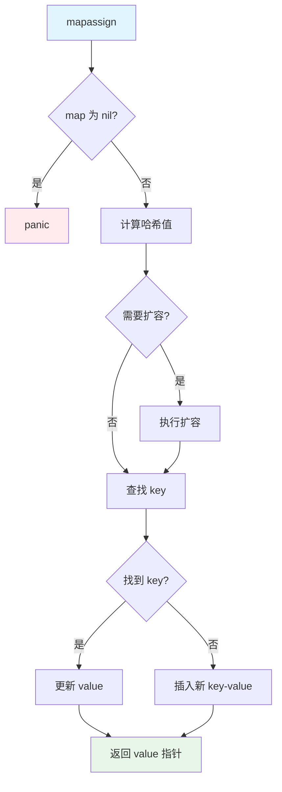
```mermaid
flowchart TD
    Start["mapassign"] --> Check{map 为 nil?}
    Check -->|是| Panic["panic"]
    Check -->|否| Hash["计算哈希值"]
    Hash --> Grow{需要扩容?}
    Grow -->|是| GrowWork["执行扩容"]
    Grow -->|否| Find["查找 key"]
    GrowWork --> Find
    Find --> Found{找到 key?}
    Found -->|是| Update["更新 value"]
    Found -->|否| Insert["插入新 key-value"]
    Update --> Return
    Insert --> Return["返回 value 指针"]
    
    style Start fill:#e1f5ff
    style Panic fill:#ffebee
    style Return fill:#e8f5e9
```

### 关键步骤

1. **检查 nil**: 如果 map 为 nil，panic
2. **哈希计算**: 计算 key 的哈希值
3. **扩容检查**: 检查是否需要扩容
4. **查找位置**: 查找 key 是否存在
5. **更新或插入**: 如果存在则更新，否则插入新键值对

### 扩容触发条件

- `count > bucketCnt * 2^B * 6.5` (负载因子 > 6.5)
- 溢出桶过多

### mapassign 实现（简化）

```go
func mapassign(t *maptype, h *hmap, key unsafe.Pointer) unsafe.Pointer {
    if h == nil {
        panic("assignment to nil map")
    }
    if h.flags&hashWriting != 0 {
        throw("concurrent map writes")
    }
    hash := t.hasher(key, uintptr(h.hash0))
    h.flags ^= hashWriting

    if h.buckets == nil {
        h.buckets = newobject(t.bucket)
    }

again:
    bucket := hash & bucketMask(h.B)
    if h.growing() {
        growWork(t, h, bucket)
    }
    b := (*bmap)(add(h.buckets, bucket*uintptr(t.bucketsize)))
    top := tophash(hash)

    var inserti *uint8
    var insertk unsafe.Pointer
    var insertv unsafe.Pointer
bucketloop:
    for {
        for i := uintptr(0); i < bucketCnt; i++ {
            if b.tophash[i] != top {
                if isEmpty(b.tophash[i]) && inserti == nil {
                    inserti = &b.tophash[i]
                    insertk = add(unsafe.Pointer(b), dataOffset+i*uintptr(t.keysize))
                    insertv = add(unsafe.Pointer(b), dataOffset+bucketCnt*uintptr(t.keysize)+i*uintptr(t.valuesize))
                }
                if b.tophash[i] == emptyRest {
                    break bucketloop
                }
                continue
            }
            k := add(unsafe.Pointer(b), dataOffset+i*uintptr(t.keysize))
            if t.indirectkey() {
                k = *((*unsafe.Pointer)(k))
            }
            if !t.key.equal(key, k) {
                continue
            }
            // 已存在，更新 value
            v := add(unsafe.Pointer(b), dataOffset+bucketCnt*uintptr(t.keysize)+i*uintptr(t.valuesize))
            if t.indirectvalue() {
                v = *((*unsafe.Pointer)(v))
            }
            h.flags &^= hashWriting
            return v
        }
        ovf := b.overflow(t)
        if ovf == nil {
            break
        }
        b = ovf
    }

    if !h.growing() && (overLoadFactor(h.count+1, h.B) || tooManyOverflowBuckets(h.noverflow, h.B)) {
        hashGrow(t, h)
        goto again
    }

    if inserti == nil {
        newb := h.newoverflow(t, b)
        inserti = &newb.tophash[0]
        insertk = add(unsafe.Pointer(newb), dataOffset)
        insertv = add(insertk, bucketCnt*uintptr(t.keysize))
    }

    if t.indirectkey() {
        kmem := newobject(t.key)
        *(*unsafe.Pointer)(insertk) = kmem
        insertk = kmem
    }
    if t.indirectvalue() {
        vmem := newobject(t.elem)
        *(*unsafe.Pointer)(insertv) = vmem
        insertv = vmem
    }
    typedmemmove(t.key, insertk, key)
    *inserti = top
    h.count++
    h.flags &^= hashWriting
    return insertv
}
```

## mapdelete (删除操作)

从 map 中删除指定的键值对。

### 实现逻辑

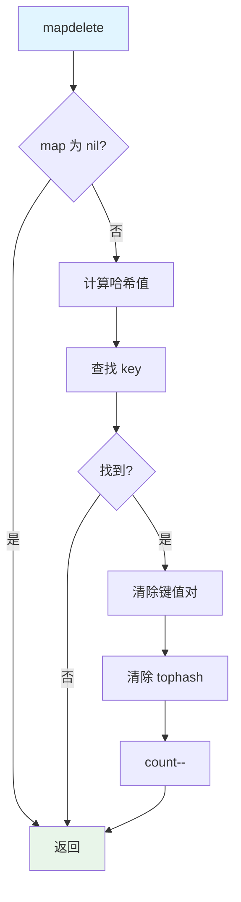
```mermaid
flowchart TD
    Start["mapdelete"] --> Check{map 为 nil?}
    Check -->|是| Return
    Check -->|否| Hash["计算哈希值"]
    Hash --> Find["查找 key"]
    Find --> Found{找到?}
    Found -->|否| Return
    Found -->|是| Clear["清除键值对"]
    Clear --> TopHash["清除 tophash"]
    TopHash --> Count["count--"]
    Count --> Return["返回"]
    
    style Start fill:#e1f5ff
    style Return fill:#e8f5e9
```

### 关键步骤

1. **查找 key**: 使用类似 `mapaccess1` 的逻辑查找
2. **清除数据**: 将 tophash 设为 `emptyOne` 或 `emptyRest`
3. **更新计数**: `h.count--`
4. **优化**: 如果删除后桶为空，可以尝试合并溢出桶

### tophash 状态

- `emptyRest`: 该槽位及之后都为空
- `emptyOne`: 该槽位为空，但后面可能有数据

### mapdelete 实现（简化）

```go
func mapdelete(t *maptype, h *hmap, key unsafe.Pointer) {
    if h == nil || h.count == 0 {
        return
    }
    if h.flags&hashWriting != 0 {
        throw("concurrent map writes")
    }

    hash := t.hasher(key, uintptr(h.hash0))
    h.flags ^= hashWriting
    bucket := hash & bucketMask(h.B)
    if h.growing() {
        growWork(t, h, bucket)
    }
    b := (*bmap)(add(h.buckets, bucket*uintptr(t.bucketsize)))
    top := tophash(hash)

search:
    for ; b != nil; b = b.overflow(t) {
        for i := uintptr(0); i < bucketCnt; i++ {
            if b.tophash[i] != top {
                if b.tophash[i] == emptyRest {
                    break search
                }
                continue
            }
            k := add(unsafe.Pointer(b), dataOffset+i*uintptr(t.keysize))
            k2 := k
            if t.indirectkey() {
                k2 = *((*unsafe.Pointer)(k2))
            }
            if !t.key.equal(key, k2) {
                continue
            }
            // 清除 key/value（若为指针则置 nil）
            if t.indirectkey() {
                *(*unsafe.Pointer)(k) = nil
            }
            if t.indirectvalue() {
                v := add(unsafe.Pointer(b), dataOffset+bucketCnt*uintptr(t.keysize)+i*uintptr(t.valuesize))
                *(*unsafe.Pointer)(v) = nil
            }
            b.tophash[i] = emptyOne
            h.count--
            // 若该槽位之后全为空，可向前回溯设为 emptyRest 以加速查找
            goto search
        }
    }
    h.flags &^= hashWriting
}
```

## mapiterinit (初始化迭代器)

初始化 map 迭代器，设置随机起始位置。

### 实现逻辑

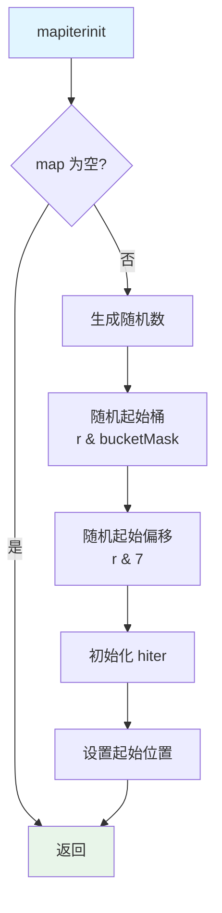
```mermaid
flowchart TD
    Start["mapiterinit"] --> Check{map 为空?}
    Check -->|是| Return
    Check -->|否| Random["生成随机数"]
    Random --> StartBucket["随机起始桶<br/>r & bucketMask"]
    StartBucket --> StartOffset["随机起始偏移<br/>r & 7"]
    StartOffset --> Init["初始化 hiter"]
    Init --> Set["设置起始位置"]
    Set --> Return["返回"]
    
    style Start fill:#e1f5ff
    style Return fill:#e8f5e9
```

### 关键步骤

1. **随机起始桶**: `it.startBucket = r & bucketMask(h.B)`
2. **随机起始偏移**: `it.offset = uint8(r >> h.B & (bucketCnt - 1))`
3. **初始化字段**: 设置迭代器的各种字段
4. **处理扩容**: 如果 map 正在扩容，需要处理新旧桶

### mapiterinit 与 mapiternext 实现（简化）

```go
func mapiterinit(t *maptype, h *hmap, it *hiter) {
    it.t = t
    it.h = h
    it.B = h.B
    it.buckets = h.buckets
    r := uintptr(fastrand())
    it.startBucket = r & bucketMask(h.B)
    it.offset = uint8(r >> (64 - 8 - h.B)) & (bucketCnt - 1)
    it.bucket = it.startBucket
    it.wrapped = false
    it.bptr = nil
    if h.oldbuckets != nil {
        it.oldbucket = uintptr(r & bucketMask(h.B-1))
    }
    mapiternext(it)
}

func mapiternext(it *hiter) {
    h := it.h
    if h.flags&hashWriting != 0 {
        throw("concurrent map iteration and map write")
    }
    t := it.t
    bucket := it.bucket
    b := it.bptr
    i := it.i
    bucketCnt := uintptr(bucketCnt)

next:
    if b == nil {
        if bucket == it.startBucket && it.wrapped {
            it.key = nil
            it.value = nil
            return  // 遍历结束
        }
        if h.oldbuckets != nil && bucket < h.oldbucketmask() {
            oldbucket := bucket
            b = (*bmap)(add(h.oldbuckets, oldbucket*uintptr(t.bucketsize)))
            if !evacuated(b) {
                it.bucket = bucket
                it.bptr = b
                it.i = 0
                goto next
            }
        }
        b = (*bmap)(add(h.buckets, bucket*uintptr(t.bucketsize)))
        bucket++
        if bucket == bucketShift(it.B) {
            bucket = 0
            it.wrapped = true
        }
        i = 0
    }
    for i < bucketCnt {
        offi := (i + it.offset) & (bucketCnt - 1)
        if isEmpty(b.tophash[offi]) || b.tophash[offi] == evacuatedEmpty {
            i++
            continue
        }
        k := add(unsafe.Pointer(b), dataOffset+offi*uintptr(t.keysize))
        v := add(unsafe.Pointer(b), dataOffset+bucketCnt*uintptr(t.keysize)+offi*uintptr(t.valuesize))
        if t.indirectkey() {
            k = *((*unsafe.Pointer)(k))
        }
        if t.indirectvalue() {
            v = *((*unsafe.Pointer)(v))
        }
        it.key = k
        it.value = v
        it.bucket = bucket
        it.bptr = b
        it.i = i + 1
        return
    }
    b = b.overflow(t)
    i = 0
    goto next
}
```

### 随机性保证

- 使用随机起始位置，保证每次迭代顺序不同
- 避免攻击者通过迭代顺序推断 map 内部结构

## mapiternext (迭代下一个元素)

获取迭代器的下一个键值对。

### 实现逻辑

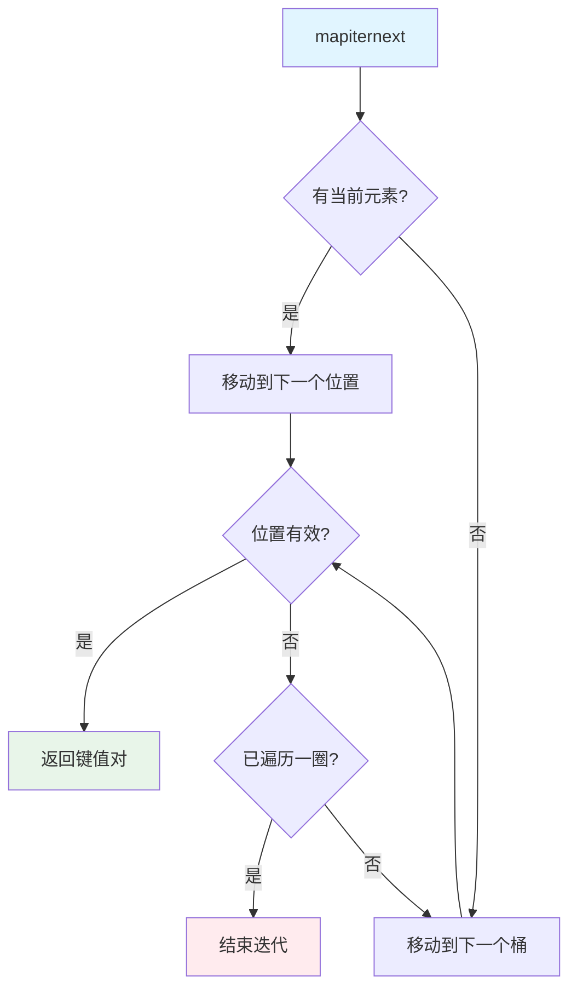
```mermaid
flowchart TD
    Start["mapiternext"] --> Check{有当前元素?}
    Check -->|是| Next["移动到下一个位置"]
    Check -->|否| Bucket["移动到下一个桶"]
    Next --> Valid{位置有效?}
    Bucket --> Valid
    Valid -->|是| Return["返回键值对"]
    Valid -->|否| Wrapped{已遍历一圈?}
    Wrapped -->|是| End["结束迭代"]
    Wrapped -->|否| Bucket
    
    style Start fill:#e1f5ff
    style Return fill:#e8f5e9
    style End fill:#ffebee
```

### 关键步骤

1. **当前位置**: 从当前桶的当前偏移开始
2. **跳过空槽**: 跳过 tophash 为空的槽位
3. **处理溢出桶**: 如果当前桶遍历完，遍历溢出桶
4. **移动到下一桶**: 桶遍历完后，移动到下一个桶
5. **检查结束**: 如果回到起始位置，迭代结束

## mapclear (清空 map)

清空 map 中的所有键值对。

### 实现逻辑

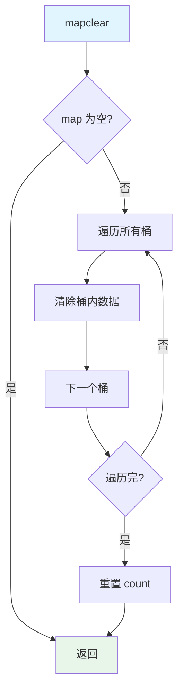
```mermaid
flowchart TD
    Start["mapclear"] --> Check{map 为空?}
    Check -->|是| Return
    Check -->|否| Loop["遍历所有桶"]
    Loop --> Clear["清除桶内数据"]
    Clear --> Next["下一个桶"]
    Next --> Done{遍历完?}
    Done -->|否| Loop
    Done -->|是| Reset["重置 count"]
    Reset --> Return["返回"]
    
    style Start fill:#e1f5ff
    style Return fill:#e8f5e9
```

### 关键步骤

1. **遍历所有桶**: 包括溢出桶
2. **清除数据**: 将 tophash 设为 `emptyRest`
3. **重置计数**: `h.count = 0`
4. **保留结构**: 不清除桶数组，保留内存以便重用

## hashGrow (触发扩容)

当 map 需要扩容时，分配新的桶数组。

### 实现逻辑

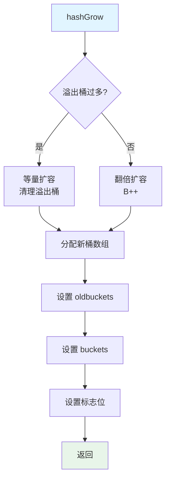
```mermaid
flowchart TD
    Start["hashGrow"] --> Check{溢出桶过多?}
    Check -->|是| SameSize["等量扩容<br/>清理溢出桶"]
    Check -->|否| Double["翻倍扩容<br/>B++"]
    SameSize --> Alloc["分配新桶数组"]
    Double --> Alloc
    Alloc --> Set["设置 oldbuckets"]
    Set --> Set2["设置 buckets"]
    Set2 --> Flags["设置标志位"]
    Flags --> Return["返回"]
    
    style Start fill:#e1f5ff
    style Return fill:#e8f5e9
```

### 扩容类型

1. **等量扩容**: 溢出桶过多时，重新分配相同大小的桶数组，清理溢出桶
2. **翻倍扩容**: 元素数量过多时，桶数量翻倍（B++）

### 关键步骤

1. **判断扩容类型**: 根据溢出桶数量决定
2. **分配新桶数组**: 分配 `2^(B+1)` 或 `2^B` 个桶
3. **设置指针**: `h.oldbuckets = h.buckets`, `h.buckets = newbuckets`
4. **渐进式迁移**: 不立即迁移，在后续操作中逐步迁移

## growWork (执行扩容工作)

在 map 操作过程中执行部分扩容工作。

### 实现逻辑

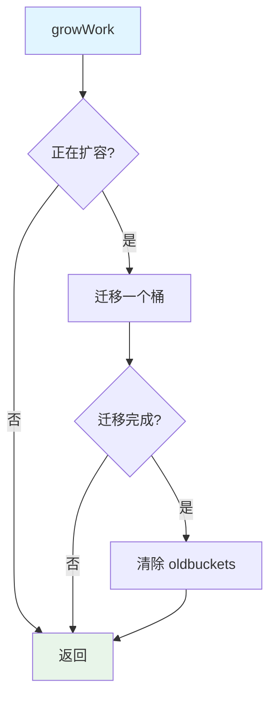
```mermaid
flowchart TD
    Start["growWork"] --> Check{正在扩容?}
    Check -->|否| Return
    Check -->|是| Evacuate["迁移一个桶"]
    Evacuate --> Check2{迁移完成?}
    Check2 -->|否| Return
    Check2 -->|是| Clear["清除 oldbuckets"]
    Clear --> Return["返回"]
    
    style Start fill:#e1f5ff
    style Return fill:#e8f5e9
```

### 渐进式扩容

- **分散成本**: 将扩容成本分散到多次操作中
- **每次迁移**: 每次操作迁移 1-2 个桶
- **避免阻塞**: 避免一次性迁移造成长时间阻塞

### hashGrow 与 growWork 实现（简化）

```go
func hashGrow(t *maptype, h *hmap) {
    bigger := uint8(1)
    if !overLoadFactor(h.count+1, h.B) {
        bigger = 0  // 等量扩容，仅整理溢出桶
        h.flags |= sameSizeGrow
    }
    oldbuckets := h.buckets
    newbuckets, nextOverflow := makeBucketArray(t, h.B+bigger, nil)
    h.buckets = newbuckets
    h.oldbuckets = oldbuckets
    h.nevacuate = 0
    h.noverflow = 0
    if h.extra != nil {
        h.extra.oldoverflow = h.extra.overflow
        h.extra.overflow = nil
        h.extra.nextOverflow = nextOverflow
    }
}

func growWork(t *maptype, h *hmap, bucket uintptr) {
    evacuate(t, h, bucket&h.oldbucketmask())
    if h.growing() {
        evacuate(t, h, h.nevacuate)
    }
}
```

## evacuate (迁移桶)

将旧桶数组中的键值对迁移到新桶数组。

### 实现逻辑

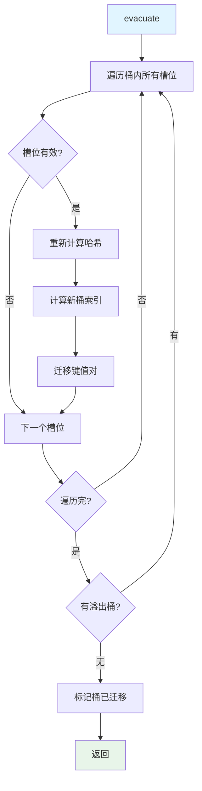
```mermaid
flowchart TD
    Start["evacuate"] --> Loop["遍历桶内所有槽位"]
    Loop --> Valid{槽位有效?}
    Valid -->|否| Next
    Valid -->|是| Hash["重新计算哈希"]
    Hash --> NewIndex["计算新桶索引"]
    NewIndex --> Move["迁移键值对"]
    Move --> Next["下一个槽位"]
    Next --> Done{遍历完?}
    Done -->|否| Loop
    Done -->|是| Overflow{有溢出桶?}
    Overflow -->|有| Loop
    Overflow -->|无| Mark["标记桶已迁移"]
    Mark --> Return["返回"]
    
    style Start fill:#e1f5ff
    style Return fill:#e8f5e9
```

### 关键步骤

1. **遍历桶**: 遍历桶内所有有效槽位
2. **重新哈希**: 对每个 key 重新计算哈希值
3. **新位置**: 根据新哈希值计算在新桶数组中的位置
4. **迁移数据**: 将键值对复制到新位置
5. **处理溢出桶**: 递归处理溢出桶

### 迁移策略

- **X 方向**: 迁移到相同索引的桶（等量扩容）
- **Y 方向**: 迁移到索引 + 旧桶数量的桶（翻倍扩容）

### evacuate 实现（简化）

```go
func evacuate(t *maptype, h *hmap, oldbucket uintptr) {
    b := (*bmap)(add(h.oldbuckets, oldbucket*uintptr(t.bucketsize)))
    newbit := h.noldbuckets()
    if !evacuated(b) {
        var xy [2]evacDst
        x := &xy[0]
        x.b = (*bmap)(add(h.buckets, oldbucket*uintptr(t.bucketsize)))
        x.k = add(unsafe.Pointer(x.b), dataOffset)
        x.v = add(x.k, bucketCnt*uintptr(t.keysize))

        if !h.sameSizeGrow() {
            y := &xy[1]
            y.b = (*bmap)(add(h.buckets, (oldbucket+newbit)*uintptr(t.bucketsize)))
            y.k = add(unsafe.Pointer(y.b), dataOffset)
            y.v = add(y.k, bucketCnt*uintptr(t.keysize))
        }

        for ; b != nil; b = b.overflow(t) {
            k := add(unsafe.Pointer(b), dataOffset)
            v := add(k, bucketCnt*uintptr(t.keysize))
            for i := 0; i < bucketCnt; i, k, v = i+1, add(k, uintptr(t.keysize)), add(v, uintptr(t.valuesize)) {
                top := b.tophash[i]
                if isEmpty(top) {
                    b.tophash[i] = evacuatedEmpty
                    continue
                }
                var useY uint8
                if !h.sameSizeGrow() {
                    hash := t.hasher(k, uintptr(h.hash0))
                    if hash&newbit != 0 {
                        useY = 1
                    }
                }
                dst := &xy[useY]
                if dst.i == bucketCnt {
                    dst.b = h.newoverflow(t, dst.b)
                    dst.i = 0
                    dst.k = add(unsafe.Pointer(dst.b), dataOffset)
                    dst.v = add(dst.k, bucketCnt*uintptr(t.keysize))
                }
                dst.b.tophash[dst.i&(bucketCnt-1)] = top
                typedmemmove(t.key, dst.k, k)
                typedmemmove(t.elem, dst.v, v)
                dst.i++
                dst.k = add(dst.k, uintptr(t.keysize))
                dst.v = add(dst.v, uintptr(t.valuesize))
                b.tophash[i] = evacuatedX + useY
            }
        }
    }

    if oldbucket == h.nevacuate {
        advanceEvacuationMark(h, t, newbit)
    }
}

// h.growing() 为 h.oldbuckets != nil；h.sameSizeGrow() 为等量扩容标志
// h.noldbuckets() 返回旧桶数量；bucketEvacuated 判断某旧桶是否已迁移

func advanceEvacuationMark(h *hmap, t *maptype, newbit uintptr) {
    h.nevacuate++
    stop := h.nevacuate + 1024
    if stop > newbit {
        stop = newbit
    }
    for h.nevacuate != stop && bucketEvacuated(t, h, h.nevacuate) {
        h.nevacuate++
    }
    if h.nevacuate == newbit {
        h.oldbuckets = nil
        if h.extra != nil {
            h.extra.oldoverflow = nil
        }
        h.flags &^= sameSizeGrow
    }
}
```

## advanceEvacuationMark (推进迁移标记)

推进扩容迁移的进度标记。

### 实现逻辑

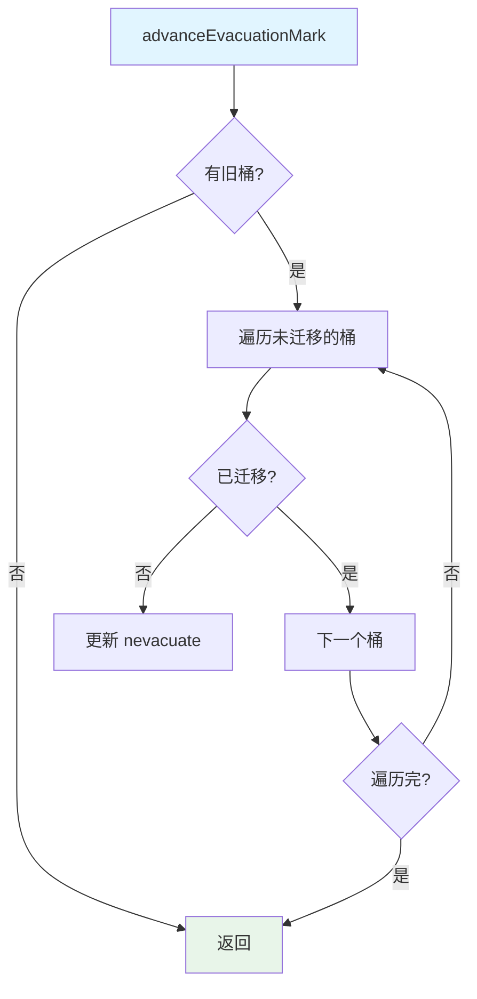
```mermaid
flowchart TD
    Start["advanceEvacuationMark"] --> Check{有旧桶?}
    Check -->|否| Return
    Check -->|是| Loop["遍历未迁移的桶"]
    Loop --> Evacuated{已迁移?}
    Evacuated -->|是| Next["下一个桶"]
    Evacuated -->|否| Update["更新 nevacuate"]
    Next --> Done{遍历完?}
    Done -->|否| Loop
    Done -->|是| Return["返回"]
    
    style Start fill:#e1f5ff
    style Return fill:#e8f5e9
```

### 作用

- **进度跟踪**: 跟踪扩容迁移的进度
- **优化查找**: 在查找时，如果旧桶已迁移，直接在新桶中查找
- **清理时机**: 当所有桶迁移完成后，可以清理旧桶数组

## reflect 相关函数

Go 的反射包提供了访问 map 内部结构的函数。

### 主要函数

- **Value.MapKeys()**: 获取 map 的所有 key
- **Value.MapIndex()**: 根据 key 获取 value
- **Value.MapRange()**: 返回 map 的迭代器

### 实现原理

反射函数最终调用 runtime 包中的底层函数，如 `mapiterinit` 和 `mapiternext`。

# 总结

Go map 的实现特点：

1. **哈希表 + 拉链法**: 使用哈希表存储，拉链法解决冲突
2. **渐进式扩容**: 扩容时逐步迁移，避免阻塞
3. **内存优化**: keys 和 values 分开存储，提高缓存效率
4. **并发安全**: 写入时检测并发，panic 保护
5. **随机迭代**: 迭代顺序随机，保证安全性

理解 map 的内部实现有助于：
- 优化 map 的使用方式
- 理解 map 的性能特征
- 避免常见的并发问题
- 更好地使用 map 进行开发
