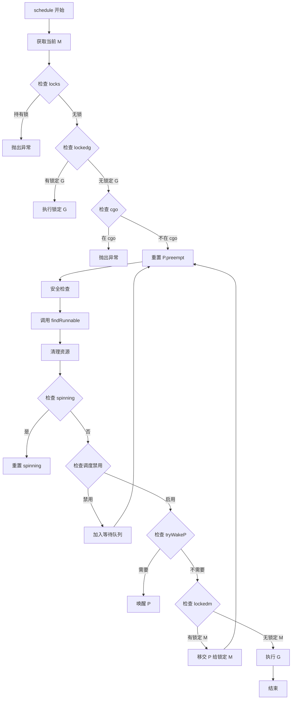
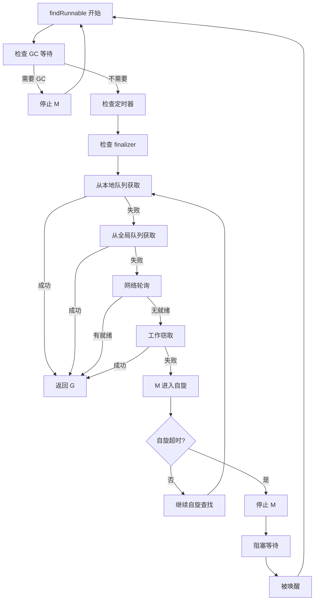

# 概述

`schedule` 函数是 Go 语言运行时调度器的核心函数，负责为当前 M（机器线程）选择一个可运行的 G（goroutine）并执行它。这个函数在以下场景被调用：

1. **goroutine 主动让出**：当 goroutine 调用 `runtime.Gosched()` 时
2. **系统调用返回**：当 goroutine 从系统调用返回时
3. **goroutine 执行完成**：当 goroutine 执行完毕需要调度新的 goroutine 时
4. **抢占调度**：当 goroutine 运行时间过长被抢占时

是的，`schedule` 函数一定是在 **g0（machine g，调度专用 goroutine）栈上执行**的。

### 详细解释

每个 M 都有一个特殊的 goroutine —— `g0`，这块栈专用于运行时调度相关的函数，比如 `schedule`、`newproc`、`mstart` 等。  
`g0` 的作用是：**避免在运行用户代码（普通 G 栈）时进行调度、抢占等低层操作，防止栈混乱**。

#### 为什么 schedule 必须在 g0 栈上？

- **调度安全性**：调度器不能运行在用户 goroutine 的栈上，否则切换 goroutine 时会破坏当前 G 的栈状态。
- **支持任意 goroutine 切换**：调度发生时，M 已经脱离了原本的 G，必须用自己专属的 g0 作为执行上下文。
- **防止死锁/栈溢出**：调度相关的底层操作要依赖固定栈（g0），而不是任意 G 的可增长栈，规避栈混用的风险。

#### 代码实现体现

Go runtime 设计时，所有涉及切换、调度、系统调用的函数会主动切到 g0 上：

- 在 runtime/proc.go 中，`schedule`（以及 `sysmon`、搓堆栈相关的核心调度逻辑）是明确在 g0 上执行的。
- `gopark`、`goschedImpl`、`exitsyscall` 等底层调度操作，源码中都有注释 `must run on g0 stack`。

#### 举例

```go
// runtime/proc.go

func schedule() {
    // 必须保证此时在 g0 栈上
    // ...
}
```

- 在需要进入 `schedule` 时，runtime 通常会通过 `mcall(schedtick)` 或相关机制，将当前上下文切到 g0，然后再执行调度。

---

**结论**：  
`schedule` 函数始终在 g0（调度专用 goroutine）的栈上执行，**绝不会在普通 goroutine 的栈上执行**。  
这保证了调度过程的安全与高效，是 Go runtime 调度器设计的核心原则之一。
### 切换到 g0 栈不会导致栈溢出吗？

不会。切换到 g0（调度栈）上执行调度相关函数**不会造成栈溢出**，原因如下：

1. **g0 是每个 M 的专用调度栈**  
   g0 的栈分配初始就比普通 goroutine 大（通常是 8KB 或 16KB），专供调度、系统调用等底层操作使用，不参与普通 goroutine 的栈增长和递归调用。

2. **schedule/gopark 等只会在 g0 上运行**  
   调度过程是**脱离普通用户 G 的栈环境**，每次需要调度时都通过特殊指令或 `mcall` 等机制跳到 g0 上。因此不会和用户协程的栈“嵌套”，不会无限增长。

3. **g0 的栈只会用来跑调度代码，流程短小**  
   调度函数（如 schedule）逻辑清晰，不涉及大量递归和深层调用，栈消耗极为有限，即使并发极高也只和系统线程数有关。

4. **切换回来时恢复到各自 G 的用户栈**  
   切走时用户 G 的栈会完整保留，调度完成后再切回去，只要每层调度和切换的栈足够用，不会堆叠生长。

**打个比方**：g0 就像每个操作系统线程自己的一块“管理工作台”，只用来处理线程自己的调度工序，始终自给自足不存在溢出问题。

#### 进一步延伸

- **汇编级切换**  
  `schedule` 等调度函数的调用前，通常由 `mcall` 或底层汇编主动切换 SP（栈指针）到 g0 栈头，从此刻起所有后续的函数调用都只“长”在这块专门的 g0 栈上。
- **协程切换与栈溢出的区别**  
  Go 的 goroutine 用户栈可以自动伸缩并遇到增长瓶颈时抛出“stack overflow”。而 g0 栈是固定（且较大）的，并只负责极小范围的 runtime 管理逻辑，**不会因频繁 schedule 调度产生无尽嵌套或栈空间耗尽问题**。

**结论：**  
每次切到 g0 执行 schedule 及类似调度逻辑，不会产生递归栈溢出！这也是 g0 设计的根本目的。


# 函数整体流程



# 核心数据结构

## M (Machine)

```go
type m struct {
    g0          *g           // 调度器使用的 goroutine
    curg        *g           // 当前执行的 goroutine
    p           puintptr     // 绑定的 P
    nextp       puintptr     // 下一个要绑定的 P
    oldp        puintptr     // 系统调用前的 P
    locks       int32        // 锁计数
    lockedg     guintptr     // 锁定的 goroutine
    incgo       bool         // 是否在 cgo 调用中
    spinning    bool         // 是否在自旋
    // ... 其他字段
}
```

## P (Processor)

```go
type p struct {
    runnext     guintptr     // 下一个要运行的 G（高优先级）
    runqhead    uint32       // 本地运行队列头
    runqtail    uint32       // 本地运行队列尾
    runq        [256]guintptr // 本地运行队列
    preempt     bool         // 抢占标志
    // ... 其他字段
}
```

## G (Goroutine)

```go
type g struct {
    stack       stack        // 栈信息
    sched       gobuf        // 调度上下文（PC、SP 等）
    m           *m           // 绑定的 M
    atomicstatus uint32      // 状态
    lockedm     muintptr     // 锁定的 M
    preempt     bool         // 抢占标志
    // ... 其他字段
}
```

## schedt (全局调度器)

`schedt` 是全局调度器结构，管理所有 M、P、G 的全局状态和队列。

```go
// runtime/runtime2.go

type schedt struct {
    // 全局可执行队列
    lock mutex
    runq     gQueue  // 全局可执行队列
    runqsize int32   // 全局可执行队列大小
    
    // M 相关
    midle        muintptr // 空闲 M 链表
    nmidle       int32    // 空闲 M 数量
    nmidlelocked int32    // 锁定的空闲 M 数量
    mnext        int64    // 下一个 M ID
    maxmcount    int32    // M 的最大数量（默认 10000）
    nmsys        int32    // 系统 M 数量
    nmfreed      int64    // 释放的 M 数量
    
    // P 相关
    pidle     puintptr // 空闲 P 链表
    npidle    uint32   // 空闲 P 数量
    nmspinning uint32  // 自旋 M 数量
    
    // G 相关
    goidgen   uint64   // 下一个 G ID
    ngsys     uint32   // 系统 G 数量
    
    // GC 相关
    gcwaiting  uint32 // GC 等待标志
    stopwait   int32
    stopnote   note
    sysmonwait uint32
    sysmonnote note
    
    // 网络轮询相关
    lastpoll   uint64   // 最后一次网络轮询时间
    pollUntil  uint64   // 网络轮询截止时间
    
    // 安全点相关
    safePointFn   func(*p)
    safePointWait int32
    safePointNote note
    
    profilehz int32
}
```

**关键字段说明**：
- `runq`: 全局可执行队列，当本地队列满时，G 会被放入全局队列
- `midle`: 空闲 M 链表，用于复用 M
- `pidle`: 空闲 P 链表，用于复用 P
- `goidgen`: 用于生成唯一的 G ID
- `gcwaiting`: GC 等待标志，当 GC 需要停止所有 M 时设置
- `nmspinning`: 自旋 M 数量，用于控制自旋 M 的数量

## sudog (等待队列元素)

`sudog` 表示等待队列中的一个元素，用于在 channel 操作、select 语句等场景中等待的 goroutine。

```go
// runtime/runtime2.go

type sudog struct {
    // 以下字段受 hchan.lock 保护
    g          *g
    next       *sudog
    prev       *sudog
    elem       unsafe.Pointer // 数据元素指针
    acquiretime int64         // 获取时间
    releasetime int64         // 释放时间
    ticket      uint32        // 票号
    
    // 以下字段不受锁保护
    isSelect bool   // 是否在 select 语句中
    success  bool   // 操作是否成功
    
    parent   *sudog // semaRoot 二叉树
    waitlink *sudog // g.waiting 链表
    waittail *sudog // semaRoot
    c        *hchan // 关联的 channel
}
```

**关键字段说明**：
- `g`: 等待的 goroutine
- `elem`: 数据元素指针，用于 channel 传递数据
- `c`: 关联的 channel
- `next/prev`: 双向链表指针，用于在等待队列中链接
- `isSelect`: 是否在 select 语句中
- `success`: 操作是否成功

**使用场景**：
- Channel 发送/接收操作时，如果 channel 已满/空，G 会创建 sudog 加入等待队列
- Select 语句中，每个 case 对应一个 sudog
- 条件变量等待时，也会使用 sudog

## gobuf (调度上下文)

`gobuf` 保存 goroutine 的调度上下文，包括寄存器状态，用于 goroutine 的切换和恢复。

```go
// runtime/runtime2.go

type gobuf struct {
    sp   uintptr // 栈指针（Stack Pointer）
    pc   uintptr // 程序计数器（Program Counter）
    g    guintptr // 关联的 goroutine
    ctxt unsafe.Pointer // 上下文
    ret   uintptr // 返回值
    lr    uintptr // 链接寄存器（ARM 架构）
    bp    uintptr // 基址指针（x86 架构）
}
```

**关键字段说明**：
- `sp`: 栈指针，保存 goroutine 的栈顶位置
- `pc`: 程序计数器，保存 goroutine 的下一条指令地址
- `g`: 关联的 goroutine
- `bp`: 基址指针，用于函数调用栈帧
- `ctxt`: 上下文信息，用于调试和追踪

**调度切换过程**：
1. **保存上下文**：当 G 被调度出去时，将当前寄存器状态保存到 `g.sched`
2. **恢复上下文**：当 G 被调度执行时，从 `g.sched` 恢复寄存器状态
3. **栈切换**：切换到 G 的栈空间

## stack (栈空间)

`stack` 表示 goroutine 的栈空间，定义了栈的边界。

```go
// runtime/runtime2.go

type stack struct {
    lo uintptr // 栈低地址（起始地址）
    hi uintptr // 栈高地址（结束地址）
}
```

**关键字段说明**：
- `lo`: 栈的低地址（起始地址），栈从低地址向高地址增长
- `hi`: 栈的高地址（结束地址），栈的结束位置

**栈的特点**：
- 每个 goroutine 都有独立的栈空间
- g0 拥有较大的栈（通常 8KB 或更大），用于执行调度代码
- 用户 goroutine 的栈初始大小为 2KB，可以动态增长（最大 1GB）
- 栈溢出检查通过 `stackguard0` 和 `stackguard1` 实现

# 核心逻辑

## findRunnable

`findRunnable` 是调度器的核心查找函数，负责找到下一个可运行的 goroutine。如果找不到，会阻塞直到有 G 可用。

### 核心流程



**查找优先级顺序**：
1. **本地运行队列**：优先从当前 P 的 `runnext` 和本地队列获取
2. **全局运行队列**：如果本地队列为空，从全局队列获取
3. **网络轮询器**：检查是否有网络 I/O 就绪的 G
4. **工作窃取**：从其他 P 的本地队列窃取 G
5. **定时器**：检查是否有定时器到期
6. **GC worker**：如果有 GC 工作，运行 GC worker
7. **阻塞等待**：如果都找不到，M 进入休眠，等待被唤醒

### runqget (从本地队列获取)

```go
// runtime/proc.go

func runqget(_p_ *p) (gp *g, inheritTime bool) {
    // 先检查 runnext（高优先级）
    for {
        next := _p_.runnext
        if next == 0 {
            break
        }
        if _p_.runnext.cas(next, 0) {
            return next.ptr(), true
        }
    }
    
    // 从本地队列获取
    for {
        h := atomic.LoadAcq(&_p_.runqhead)
        t := _p_.runqtail
        if t == h {
            return nil, false
        }
        gp := _p_.runq[h%uint32(len(_p_.runq))].ptr()
        if atomic.CasRel(&_p_.runqhead, h, h+1) {
            return gp, false
        }
    }
}
```

**实现要点**：
- 优先检查 `runnext`，这是高优先级的 G
- 使用无锁队列（lock-free queue）实现，通过 CAS 操作保证并发安全
- `inheritTime` 表示是否继承时间片

#### globrunqgetbatch (从全局队列批量获取)

```go
// runtime/proc.go

func globrunqget(_p_ *p, max int32) *g {
    if sched.runqsize == 0 {
        return nil
    }
    
    n := sched.runqsize/gomaxprocs + 1
    if n > sched.runqsize {
        n = sched.runqsize
    }
    if max > 0 && n > max {
        n = max
    }
    if n > int32(len(_p_.runq))/2 {
        n = int32(len(_p_.runq)) / 2
    }
    
    sched.runqsize -= n
    
    gp := sched.runq.pop()
    n--
    for ; n > 0; n-- {
        gp1 := sched.runq.pop()
        runqput(_p_, gp1, false)
    }
    return gp
}
```

**实现要点**：
- 根据全局队列大小和 P 数量计算应该获取的 G 数量
- 批量获取后，将多余的 G 放入本地队列
- 最多获取本地队列容量的一半，避免本地队列过载

### netpoll (网络轮询)

```go
// runtime/netpoll_epoll.go (Linux)

func netpoll(delay int64) gList {
    var events [128]epollevent
    n := epollwait(epfd, &events[0], int32(len(events)), waitms)
    
    var toRun gList
    for i := int32(0); i < n; i++ {
        ev := &events[i]
        var mode int32
        if ev.events&(_EPOLLIN|_EPOLLRDHUP|_EPOLLHUP|_EPOLLERR) != 0 {
            mode += 'r'
        }
        if ev.events&(_EPOLLOUT|_EPOLLHUP|_EPOLLERR) != 0 {
            mode += 'w'
        }
        if mode != 0 {
            pd := *(**pollDesc)(unsafe.Pointer(&ev.data))
            netpollready(&toRun, pd, mode)
        }
    }
    return toRun
}
```

**实现要点**：
- 使用 epoll（Linux）或 kqueue（BSD）等系统调用检查网络 I/O
- 将就绪的网络事件对应的 G 加入可执行列表
- 非阻塞调用，不会长时间阻塞

### injectglist (注入 G 列表)

```go
// runtime/proc.go

func injectglist(glist *gList) {
    if glist.empty() {
        return
    }
    
    lock(&sched.lock)
    var n int32
    for n = 0; !glist.empty(); n++ {
        gp := glist.pop()
        casgstatus(gp, _Gwaiting, _Grunnable)
        globrunqput(gp)
    }
    unlock(&sched.lock)
    
    for ; n != 0 && sched.npidle != 0; n-- {
        startm(nil, false)
    }
}
```

**实现要点**：
- 将 G 列表中的 G 状态从 `_Gwaiting` 转为 `_Grunnable`
- 将 G 放入全局队列
- 如果有空闲 P，尝试唤醒 M 来处理这些 G

### stealWork (工作窃取)

```go
// runtime/proc.go

func stealWork(now int64) (gp *g, inheritTime bool, rnow, pollUntil int64, ranTimer bool) {
    pp := getg().m.p.ptr()
    
    ranTimer = false
    
    const stealTries = 4
    for i := 0; i < stealTries; i++ {
        stealTimersOrRunNextG := i == stealTries-1
        
        for enum := stealOrder.start(fastrand()); !enum.done(); enum.next() {
            if sched.gcwaiting != 0 {
                return nil, false, now, pollUntil, ranTimer
            }
            p2 := allp[enum.position()]
            if pp == p2 {
                continue
            }
            
            // 尝试从 p2 窃取
            if stealTimersOrRunNextG {
                if tnow, w, ran := checkTimers(p2, now); w != 0 && (pollUntil == 0 || w < pollUntil) {
                    pollUntil = w
                }
                if ran {
                    ranTimer = true
                }
            }
            
            // 尝试窃取 runnext
            if gp := p2.runnext; gp != 0 && p2.runnext.cas(gp, 0) {
                return gp.ptr(), false, now, pollUntil, ranTimer
            }
            
            // 尝试从本地队列窃取一半
            if n := runqsteal(pp, p2, stealTimersOrRunNextG); n != 0 {
                return runqget(pp), false, now, pollUntil, ranTimer
            }
        }
    }
    
    return nil, false, now, pollUntil, ranTimer
}
```

**实现要点**：
- 随机选择目标 P，避免所有 M 窃取同一个 P
- 优先窃取 `runnext`（高优先级 G）
- 从目标 P 的本地队列窃取一半的 G
- 最多尝试 4 次，每次遍历所有 P

### findRunnableGCWorker (查找 GC Worker)

```go
// runtime/mgc.go

func (c *gcControllerState) findRunnableGCWorker(_p_ *p) *g {
    if !gcBlackenEnabled {
        return nil
    }
    
    node, _ := c.gcBgMarkWorkerPool.pop()
    if node == nil {
        return nil
    }
    
    _p_.gcBgMarkWorker.set(node.ptr())
    _p_.gcMarkWorkerMode = gcMarkWorkerDedicatedMode
    
    gp := node.ptr().gp
    casgstatus(gp, _Gwaiting, _Grunnable)
    if trace.enabled {
        traceGoUnpark(gp, 0)
    }
    return gp
}
```

**实现要点**：
- 从 GC worker 池中获取一个 worker
- 将 worker 绑定到当前 P
- 将 worker 状态转为可运行

### ready (将 G 转为可运行)

```go
// runtime/proc.go

func ready(gp *g, traceskip int, next bool) {
    if trace.enabled {
        traceGoUnpark(gp, traceskip)
    }
    
    status := readgstatus(gp)
    
    // 标记为可运行
    casgstatus(gp, _Gwaiting, _Grunnable)
    runqput(_g_.m.p.ptr(), gp, next)
    if atomic.Load(&sched.npidle) != 0 && atomic.Load(&sched.nmspinning) == 0 {
        wakep()
    }
}
```

**实现要点**：
- 将 G 状态从 `_Gwaiting` 转为 `_Grunnable`
- 将 G 放入当前 P 的运行队列
- 如果有空闲 P，尝试唤醒 M

### pidleput (将 P 放入空闲列表)

```go
// runtime/proc.go

func pidleput(_p_ *p) {
    if !runqempty(_p_) {
        throw("pidleput: P has non-empty run queue")
    }
    
    _p_.link = sched.pidle
    sched.pidle.set(_p_)
    atomic.Xadd(&sched.npidle, 1)
}
```

**实现要点**：
- 检查 P 的本地队列是否为空
- 将 P 加入空闲链表
- 增加空闲 P 计数

### M 自旋机制

当 M 找不到可运行的 G 时，会进入自旋状态，持续查找工作。

**自旋条件**：
- 有空闲的 P
- 全局队列有 G 或网络轮询可能有就绪的 G
- 自旋 M 数量未超过限制（`gomaxprocs`）

**自旋过程**：
1. 设置 `m.spinning = true`
2. 增加全局自旋计数 `sched.nmspinning`
3. 持续尝试从全局队列、网络轮询、其他 P 获取 G
4. 如果超时（通常 1ms），退出自旋

**自旋超时后**：
- 调用 `stopm` 停止 M
- M 进入休眠，等待被唤醒

### stopm (停止 M)

```go
// runtime/proc.go

func stopm() {
    _g_ := getg()
    
    if _g_.m.locks != 0 {
        throw("stopm holding locks")
    }
    if _g_.m.p != 0 {
        throw("stopm holding p")
    }
    if _g_.m.spinning {
        throw("stopm spinning")
    }
    
    lock(&sched.lock)
    mput(_g_.m)
    unlock(&sched.lock)
    mPark()
}
```

**实现要点**：
- 检查 M 状态，确保可以安全停止
- 将 M 放入空闲链表
- 调用 `mPark()` 使 M 进入休眠
- M 会阻塞在 `park` 上，等待被唤醒

## resetspinning

`resetspinning` 重置 M 的自旋状态，并在需要时启动新的自旋 M。

```go
// runtime/proc.go

func resetspinning() {
    _g_ := getg()
    if !_g_.m.spinning {
        throw("resetspinning: not a spinning m")
    }
    _g_.m.spinning = false
    _g_.m.p.ptr().schedtick++
    if int32(atomic.Xadd(&sched.nmspinning, -1)) < 0 {
        throw("resetspinning: negative nmspinning")
    }
    
    // 如果需要，启动新的自旋 M
    if sched.nmspinning.Load() < int32(gomaxprocs) && sched.runqsize > 0 {
		wakep()
	}
}
```

**实现要点**：
- 清除 M 的自旋标志
- 减少全局自旋计数
- 如果自旋 M 数量不足且全局队列有 G，尝试唤醒新的 M

## wakep

`wakep` 尝试唤醒一个空闲的 M 或创建新的 M 来处理工作。

```go
// runtime/proc.go

func wakep() {
    // 如果有空闲的 P 和自旋的 M，唤醒一个自旋 M
    if atomic.Load(&sched.npidle) != 0 && atomic.Load(&sched.nmspinning) != 0 {
        if !atomic.Cas(&sched.nmspinning, 1, 0) {
            return
        }
        mp := wakep()
        if mp != nil {
            notewakeup(&mp.park)
        }
        return
    }
    
    // 尝试获取一个空闲 P
    _p_ := pidleget()
    if _p_ == nil {
        return
    }
    
    // 尝试获取一个空闲 M
    mp := mget()
    if mp == nil {
        // 没有空闲 M，创建新的 M
        newm(nil, _p_, -1)
        return
    }
    
    // 唤醒空闲 M
    mp.nextp.set(_p_)
    notewakeup(&mp.park)
}
```

**实现要点**：
- 优先唤醒自旋的 M（如果存在）
- 如果没有自旋 M，尝试获取空闲 P 和空闲 M
- 如果没有空闲 M，创建新的 M
- 通过 `notewakeup` 唤醒休眠的 M

## execute

`execute` 是调度的最后一步，实际执行找到的 goroutine。

```go
// runtime/proc.go

func execute(gp *g, inheritTime bool) {
    _g_ := getg()
    
    // 设置当前 G
    _g_.m.curg = gp
    gp.m = _g_.m
    
    // 切换状态
    casgstatus(gp, _Grunnable, _Grunning)
    gp.waitsince = 0
    gp.preempt = false
    gp.stackguard0 = gp.stack.lo + _StackGuard
    if !inheritTime {
        _g_.m.p.ptr().schedtick++
    }
    
    // 切换到 G 的栈和上下文
    gogo(&gp.sched)
}
```

**实现要点**：
- 设置当前 M 的 `curg` 为要执行的 G
- 将 G 状态从 `_Grunnable` 转为 `_Grunning`
- 重置抢占标志和等待时间
- 调用 `gogo`（汇编实现）切换到 G 的栈和上下文
- `gogo` 会恢复 G 的寄存器状态（PC、SP 等），开始执行 G 的代码

**gogo 汇编实现**（简化）：
```asm
// runtime/asm_amd64.s

TEXT runtime·gogo(SB), NOSPLIT, $0-8
    MOVQ    buf+0(FP), BX    // 获取 gobuf
    MOVQ    gobuf_g(BX), DX
    MOVQ    0(DX), CX         // 确保 g != nil
    get_tls(CX)
    MOVQ    DX, g(CX)         // 设置 TLS 中的 g
    MOVQ    gobuf_sp(BX), SP  // 恢复 SP
    MOVQ    gobuf_ret(BX), AX // 恢复返回值
    MOVQ    gobuf_ctxt(BX), DX
    MOVQ    gobuf_bp(BX), BP  // 恢复 BP
    MOVQ    gobuf_pc(BX), BX  // 恢复 PC
    JMP     BX                // 跳转到 PC，开始执行
```

**执行后的流程**：
- G 执行完成后，会调用 `goexit`，最终再次调用 `schedule`
- 形成调度循环，持续为 M 分配新的 G

### execute为什么不会栈溢出

很多读者看到 `execute` 这个函数里直接调用了 `gogo(&gp.sched)`，表面上看起来是递归地在一个函数中反复调用自己，因为 `G` 运行结束后最终又会回到调度器，再次调用 `execute`，似乎会层层递归导致栈溢出。但实际上，**Go 的调度循环绝不会造成栈溢出**。原因如下：

1. **gogo切换的是协程上下文，而不是函数递归调用**

   `gogo` 是用汇编实现的底层函数，功能是完全**切换当前 CPU 寄存器、程序计数器（PC）、栈指针（SP）到另一个 goroutine 的上下文**，本质上是 “切走” 当前 G，恢复另一个 G 执行环境。这样，当 `gogo` 跳转（JMP）到目标 G 的执行点时，**当前的函数调用栈已经彻底“丢弃”了，不会留在调用链上**，所以不存在递归嵌套的问题。

2. **线程栈在切换上下文时被复用**

   Go 的 runtime 通过 manual stack switching，当前栈帧会被遗弃，切换到下一个 G 所维护的独立栈空间，G 结束后，再切回新的 G 的栈。因此，同一个 M 线程的调用栈不会因为不断调度 execute 而膨胀。

3. **协程之间是并发的，每个G有自己的栈**

   每个 G 有一块独立管理的栈空间，调度时不会不断向调用栈上压入新的 `execute` 调用帧，由于栈总是回到 G 本身的栈顶，调度链不会堆积。

4. **gogo的实现采用JMP，无函数嵌套开销**

   在底层实现上，`gogo` 不使用 call 指令，而是用 `JMP` 直接跳转到新 G 的代码入口——这样会**抛弃当前函数执行栈帧**，而不是继续在上层递归，所以根本没有一般意义上的递归栈溢出的风险。

**总结**：  
虽然调度循环依赖于 `execute -> gogo -> goexit -> schedule -> execute...` 的链条，但依托 `gogo` 的上下文切换跳跃，实际上过程中不会增大调用栈，不会发生栈溢出问题。

可以参考经典“协程上下文切换仅更换寄存器和栈指针”的原理：

- `gogo` 恢复目标 G 的 SP/PC，相当于重新开始该 G 的执行流
- 当前线程的调用栈帧不会被层层堆积
- 底层以跳转而非递归调用方式实现切换

因此，Go 的 execute 调度循环设计**不会导致栈溢出**。


# 总结

`schedule` 函数及其相关的核心逻辑构成了 Go 语言调度器的基础：

1. **findRunnable**：通过多级查找策略（本地队列 → 全局队列 → 网络轮询 → 工作窃取）高效找到可运行的 G
2. **工作窃取**：平衡各 P 的工作负载，提高 CPU 利用率
3. **自旋机制**：快速响应新创建的 G，减少延迟
4. **网络轮询**：高效处理网络 I/O，避免阻塞
5. **execute**：通过汇编实现高效的上下文切换

整个调度系统通过精心设计的算法和数据结构，实现了高效的 goroutine 调度，支撑了 Go 语言的高并发特性。

