Go 语言的 timer 管理是运行时系统的重要组成部分，负责管理所有的定时器（Timer）和周期定时器（Ticker）。理解 Go timer 的内部实现机制，对于编写高性能的 Go 程序至关重要。

# Timer 概述

## 什么是 Timer？

Timer 是 Go 语言提供的定时器功能，用于在指定的时间后执行某个操作。Go 提供了两种定时器：

1. **Timer**：单次定时器，在指定时间后触发一次
2. **Ticker**：周期定时器，每隔指定时间触发一次

## Go 1.23+ 重要变化

### 1. GC 可以回收未过期的 Timer

**之前（Go 1.22 及更早）**：
- 未过期或未停止的 timer 不会被 GC 回收
- 需要显式调用 `Stop()` 来帮助 GC 回收

**现在（Go 1.23+）**：
- GC 可以自动回收未引用的 timer，即使它们还未过期或停止
- `Stop()` 方法不再需要用于帮助 GC 回收（但仍可用于停止 timer）

```go
// Go 1.23+ 中，这个 timer 可以被 GC 回收
func example() {
    timer := time.NewTimer(10 * time.Second)
    // 即使没有调用 Stop()，如果 timer 不再被引用，GC 可以回收它
    <-timer.C
}
```

### 2. Channel 从异步变为同步

**之前（Go 1.22 及更早）**：
- Timer 的 channel 是异步的（缓冲容量为 1）
- 可能在 `Stop()` 或 `Reset()` 返回后仍收到过期的时间值

**现在（Go 1.23+）**：
- Timer 的 channel 是同步的（无缓冲，容量为 0）
- 消除了在 `Stop()` 或 `Reset()` 后收到过期值的可能性
- 如果程序在 `Stop()` 返回后从 `t.C` 接收，保证会阻塞而不是收到过期值

```go
// Go 1.23+ 中，这个代码是安全的
func example() {
    timer := time.NewTimer(5 * time.Second)
    
    go func() {
        time.Sleep(2 * time.Second)
        if timer.Stop() {
            // 保证后续的 <-timer.C 会阻塞，不会收到过期值
        }
    }()
    
    <-timer.C  // 安全，不会收到过期值
}
```

### 3. GODEBUG 设置

可以通过 `GODEBUG=asynctimerchan=1` 恢复 Go 1.22 的行为：
- 未过期的 timer 不会被 GC 回收
- Channel 使用缓冲容量

```bash
# 恢复旧行为
GODEBUG=asynctimerchan=1 go run main.go
```

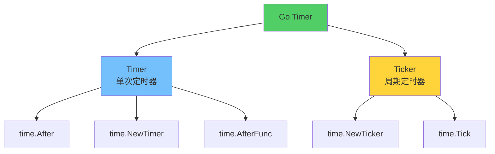

## Timer 的基本使用

### Timer 使用示例

```go
package main

import (
    "fmt"
    "time"
)

func main() {
    // 方式1: 使用 time.After
    select {
    case <-time.After(2 * time.Second):
        fmt.Println("2秒后执行")
    }
    
    // 方式2: 使用 time.NewTimer
    timer := time.NewTimer(3 * time.Second)
    <-timer.C
    fmt.Println("3秒后执行")
    
    // 方式3: 使用 time.AfterFunc
    time.AfterFunc(1*time.Second, func() {
        fmt.Println("1秒后执行回调函数")
    })
    
    time.Sleep(2 * time.Second) // 等待回调执行
}
```

### Ticker 使用示例

```go
package main

import (
    "fmt"
    "time"
)

func main() {
    // 创建周期定时器
    ticker := time.NewTicker(1 * time.Second)
    defer ticker.Stop()
    
    // 方式1: 使用 for range
    go func() {
        for t := range ticker.C {
            fmt.Println("Tick at", t)
        }
    }()
    
    // 方式2: 使用 select
    go func() {
        for {
            select {
            case <-ticker.C:
                fmt.Println("Tick")
            case <-done:
                return
            }
        }
    }()
    
    time.Sleep(5 * time.Second)
}
```

# Timer 的内部实现

## Timer 数据结构

Go 的 timer 在运行时使用以下数据结构（Go 1.23+）：

```go
// runtime/time.go

type timer struct {
    // mu 保护所有字段的读写（除了下面注明的例外）
    mu mutex
    
    // astate 是状态位的原子副本，用于快速路径决策
    astate atomic.Uint8
    
    // state 状态位
    state uint8
    
    // isChan 表示 timer 是否有 channel（不可变，无需锁即可读取）
    isChan bool
    
    // isFake 表示 timer 是否使用假时间（不可变，无需锁即可读取）
    isFake bool
    
    // blocked 阻塞在此 timer channel 上的 goroutine 数量
    blocked uint32
    
    // rand 随机化同一时刻 timer 的顺序（仅在 isFake 时设置）
    rand uint32
    
    // when 定时器触发时间（纳秒时间戳）
    when int64
    
    // period 触发间隔（用于 Ticker，period > 0 表示周期性）
    period int64
    
    // f 回调函数，当 timer 触发时调用 f(arg, seq, delay)
    f func(arg any, seq uintptr, delay int64)
    
    // arg 和 seq 是客户端指定的不透明参数
    arg any
    seq uintptr
    
    // ts 指向包含此 timer 的 timers 集合
    ts *timers
    
    // sendLock 保护 timer channel 上的发送操作
    // 当 debug.asynctimerchan.Load() != 0 时不使用（Go 1.23+ 异步模式）
    sendLock mutex
    
    // isSending 用于处理运行 channel timer 和停止/重置 timer 之间的竞态
    isSending atomic.Int32
}
```

### Timer 状态位标志

Go 使用位标志来管理 timer 状态：

```go
// runtime/time.go

const (
    // timerHeaped 表示 timer 存储在某个 P 的堆中
    timerHeaped uint8 = 1 << iota
    
    // timerModified 表示 t.when 已被修改
    // 但堆中的 heap[i].when 条目仍需更新
    timerModified
    
    // timerZombie 表示 timer 已被停止
    // 但仍存在于某个 P 的堆中
    timerZombie
)
```

### Timer 状态转换

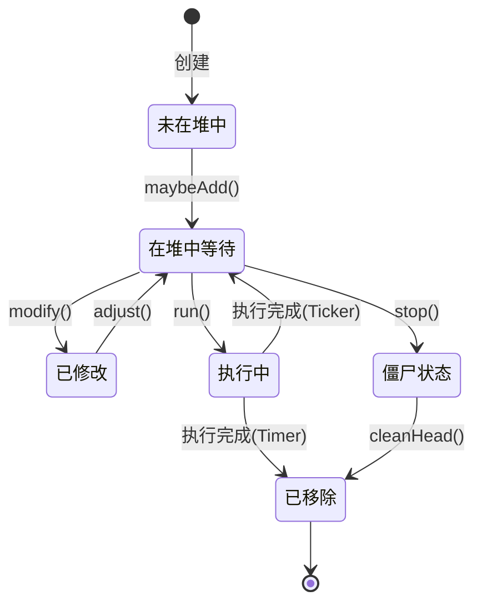

## Timer 的存储结构

Go 使用**最小堆（Min Heap）**来管理所有的 timer，每个 P（Processor）维护一个 timer 堆。

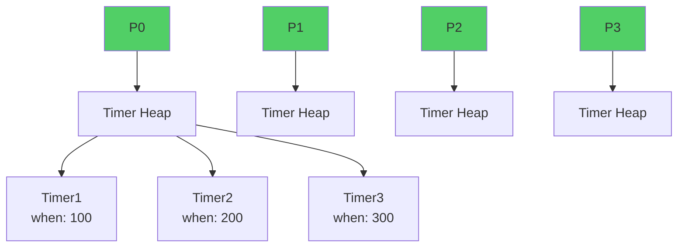

### Timer 堆结构

每个 P 维护一个 `timers` 结构来管理 timer 堆：

```go
// runtime/time.go

// timers 是每个 P 的 timer 集合
type timers struct {
    // mu 保护 timers；timers 是每个 P 的，但调度器可以访问其他 P 的 timers
    mu mutex
    
    // heap 是 timer 集合，按 heap[i].when 排序
    // 必须持有锁才能访问
    heap []timerWhen
    
    // len 是 len(heap) 的原子副本
    len atomic.Uint32
    
    // zombies 是堆中标记为删除的 timer 数量
    zombies atomic.Int32
    
    // raceCtx 是执行 timer 函数时使用的 race context
    raceCtx uintptr
    
    // minWhenHeap 是最小的 heap[i].when 值（= heap[0].when）
    // wakeTime 方法使用 minWhenHeap 和 minWhenModified 来确定下一个唤醒时间
    minWhenHeap atomic.Int64
    
    // minWhenModified 是具有 timerModified 位的 timer 的最小 when 下界
    minWhenModified atomic.Int64
}

// timerWhen 是堆中的元素，包含 timer 指针和 when 时间
type timerWhen struct {
    timer *timer
    when  int64
}
```

### P 结构中的 timers

```go
// runtime/runtime2.go

type p struct {
    // ... 其他字段
    
    // timers 是此 P 的 timer 堆
    timers timers
}
```

## 为什么 timers 在 P 中还需要加锁？

虽然 `timers` 是每个 P 独立维护的，但 Go 运行时仍然需要加锁来保护 timer 堆的并发访问。主要原因如下：

### 1. 调度器可以访问其他 P 的 timers

虽然每个 P 有自己的 timer 堆，但调度器（scheduler）在特定场景下需要访问其他 P 的 timers：

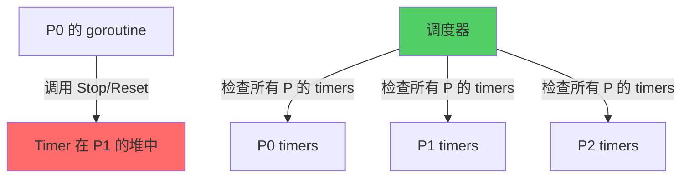

**典型场景**：
- **系统监控（sysmon）**：需要检查所有 P 的 timer 来确定下次唤醒时间
- **P 销毁**：当 P 被销毁时，需要将其 timers 迁移到其他 P
- **Timer 迁移**：timer 可能在不同 P 之间迁移

```go
// runtime/time.go

// timeSleepUntil 返回下次 timer 应该触发的时间
// 这会被 sysmon 和 checkdead 调用
func timeSleepUntil() int64 {
    next := int64(maxWhen)
    
    // 需要访问所有 P 的 timers
    lock(&allpLock)
    for _, pp := range allp {
        if pp == nil {
            continue
        }
        // 访问其他 P 的 timers，需要加锁
        if w := pp.timers.wakeTime(); w != 0 {
            next = min(next, w)
        }
    }
    unlock(&allpLock)
    
    return next
}
```

### 2. Timer 操作可能跨 P 执行

Timer 的 `Stop()` 和 `Reset()` 操作可能在创建 timer 的 P 之外执行：

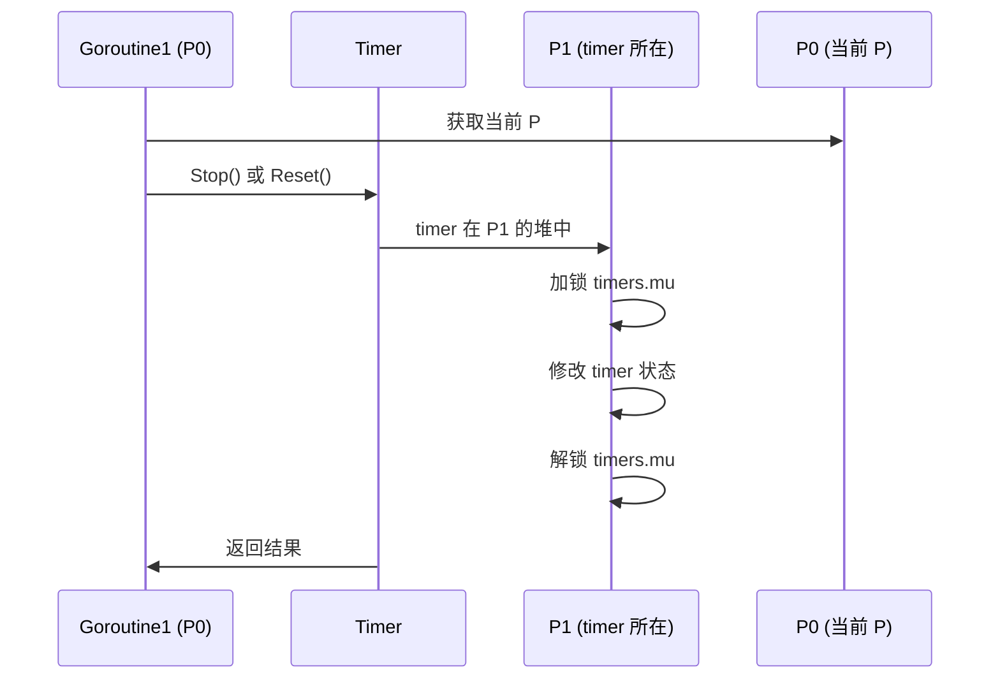

**代码示例**：

```go
// runtime/time.go

// maybeAdd 可能将 timer 添加到当前 P 的堆中
// 但 timer 可能原本属于另一个 P
func (t *timer) maybeAdd() {
    mp := acquirem()
    var ts *timers
    
    // 获取当前 P（可能与创建 timer 时的 P 不同）
    if t.isFake {
        ts = &getg().bubble.timers
    } else {
        ts = &mp.p.ptr().timers  // 当前 P 的 timers
    }
    
    ts.lock()  // 必须加锁，因为可能与其他 goroutine 并发访问
    // ... 操作堆
    ts.unlock()
    releasem(mp)
}
```

### 3. Goroutine 可能在不同 P 上执行

由于 Go 的 M:N 调度模型，goroutine 可能在不同的 P 之间迁移：

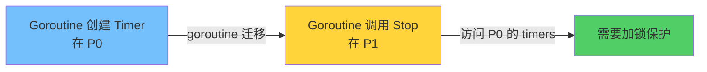

**场景示例**：

```go
func example() {
    // 在 P0 上创建 timer
    timer := time.NewTimer(5 * time.Second)
    
    go func() {
        // 这个 goroutine 可能在 P1 上执行
        time.Sleep(2 * time.Second)
        
        // Stop 操作需要访问 P0 的 timers 堆
        // 必须加锁保护
        timer.Stop()
    }()
}
```

### 4. 堆结构的并发修改

Timer 堆是一个复杂的数据结构，需要保证操作的原子性：

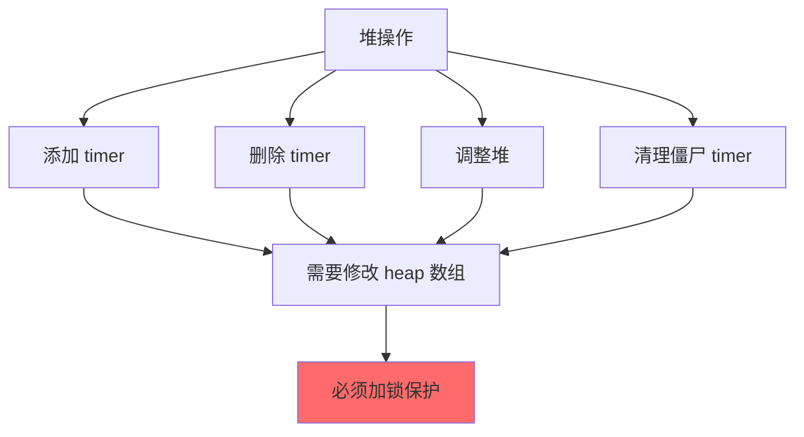

**并发问题示例**：

```go
// 如果没有锁保护，可能出现以下竞态条件：

// Goroutine 1: 添加 timer
ts.heap = append(ts.heap, timerWhen{t, when})  // 修改数组
ts.siftUp(len(ts.heap) - 1)                     // 调整堆

// Goroutine 2: 同时删除 timer（没有锁的情况下）
ts.heap[0] = ts.heap[len(ts.heap)-1]           // 可能覆盖上面的修改
ts.heap = ts.heap[:len(ts.heap)-1]            // 数组长度不一致
```

### 5. Timer 状态的一致性

Timer 的状态修改和堆操作需要保持一致性：

```go
// runtime/time.go

// adjust 方法需要同时修改多个 timer 的状态和堆结构
func (ts *timers) adjust(now int64, force bool) {
    ts.lock()  // 必须加锁
    
    // 遍历堆中的所有 timer
    for i := 0; i < len(ts.heap); i++ {
        t := ts.heap[i].timer
        t.lock()  // 锁定单个 timer
        
        // 修改 timer 状态和堆结构
        if t.state&timerZombie != 0 {
            // 从堆中移除
            ts.heap[i] = ts.heap[len(ts.heap)-1]
            ts.heap = ts.heap[:len(ts.heap)-1]
        }
        
        t.unlock()
    }
    
    ts.unlock()
}
```

### 锁的设计考虑

虽然需要加锁，但 Go 通过以下方式优化性能：

1. **每个 P 独立的锁**：减少锁竞争范围
2. **快速路径优化**：使用原子操作（`astate`、`len`）避免频繁加锁
3. **延迟调整**：批量处理 timer 修改，减少锁持有时间
4. **僵尸清理**：延迟清理已停止的 timer，避免频繁堆操作

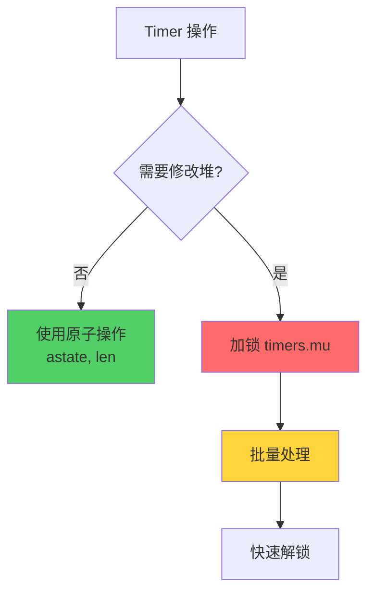

### 总结

虽然 `timers` 是每个 P 独立维护的，但需要加锁的原因包括：

1. ✅ **调度器跨 P 访问**：sysmon 等需要检查所有 P 的 timers
2. ✅ **Timer 跨 P 操作**：Stop/Reset 可能在创建 timer 的 P 之外执行
3. ✅ **Goroutine 迁移**：goroutine 可能在不同 P 之间迁移
4. ✅ **堆结构保护**：堆操作需要保证原子性
5. ✅ **状态一致性**：timer 状态和堆结构需要保持一致

通过每个 P 独立的锁和优化策略，Go 在保证正确性的同时，最大程度减少了锁竞争。

## Timer 的添加流程

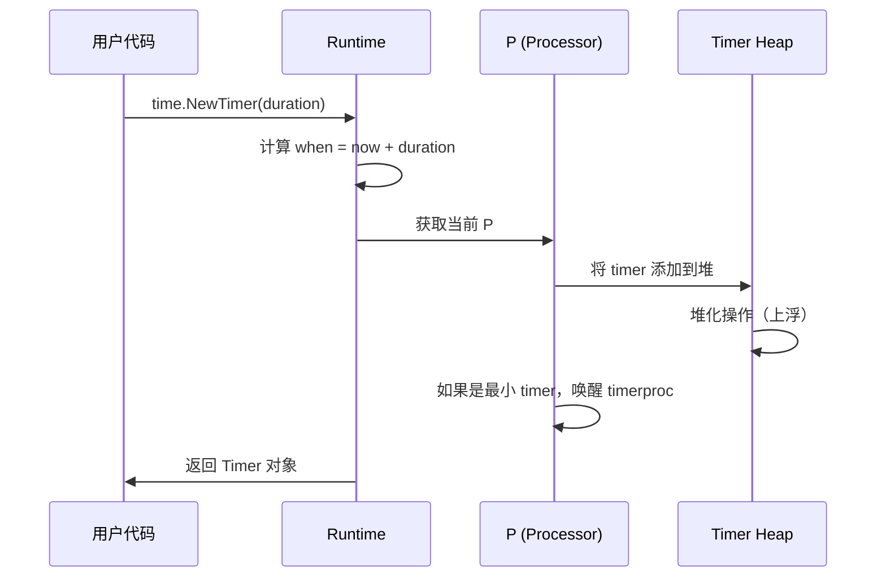

### 添加 Timer 的代码流程

```go
// runtime/time.go

// maybeAdd 将 t 添加到本地 timers 堆（如果需要）
func (t *timer) maybeAdd() {
    // 获取当前 M 和 P，确保添加到正确的 P
    mp := acquirem()
    var ts *timers
    if t.isFake {
        bubble := getg().bubble
        if bubble == nil {
            throw("invalid timer: fake time but no syncgroup")
        }
        ts = &bubble.timers
    } else {
        ts = &mp.p.ptr().timers
    }
    
    ts.lock()
    ts.cleanHead()  // 清理堆头部的僵尸 timer
    t.lock()
    
    when := int64(0)
    wake := false
    if t.needsAdd() {
        if t.isFake {
            // 重新随机化 timer 顺序
            t.rand = cheaprand()
        }
        t.state |= timerHeaped
        when = t.when
        wakeTime := ts.wakeTime()
        wake = wakeTime == 0 || when < wakeTime
        ts.addHeap(t)
    }
    t.unlock()
    ts.unlock()
    releasem(mp)
    
    if wake {
        wakeNetPoller(when)
    }
}

// addHeap 将 t 添加到 timers 堆
func (ts *timers) addHeap(t *timer) {
    assertWorldStoppedOrLockHeld(&ts.mu)
    
    // 确保网络轮询器已启动
    if netpollInited.Load() == 0 {
        netpollGenericInit()
    }
    
    if t.ts != nil {
        throw("ts set in timer")
    }
    t.ts = ts
    ts.heap = append(ts.heap, timerWhen{t, t.when})
    ts.siftUp(len(ts.heap) - 1)
    if t == ts.heap[0].timer {
        ts.updateMinWhenHeap()
    }
}

// needsAdd 报告 t 是否需要添加到 timers 堆
func (t *timer) needsAdd() bool {
    assertLockHeld(&t.mu)
    need := t.state&timerHeaped == 0 && 
            t.when > 0 && 
            (!t.isChan || t.blocked > 0)
    return need
}
```

## Timer 的触发机制

### Timer 检查流程

Go 不再使用独立的 timerproc goroutine，而是通过 `check` 方法在调度过程中检查并触发到期的 timer：

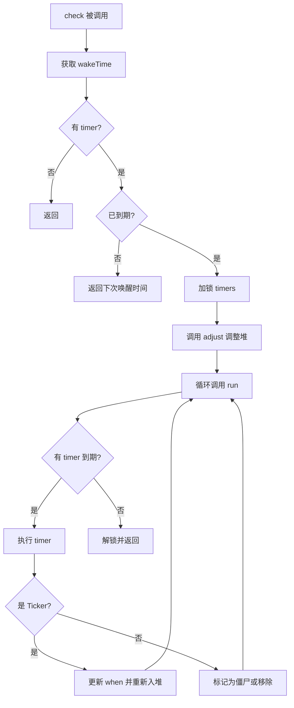

### Timer 触发代码

```go
// runtime/time.go

// check 运行 ts 中已就绪的 timer
// 返回当前时间、下次 timer 运行时间、是否运行了 timer
func (ts *timers) check(now int64, bubble *synctestBubble) (rnow, pollUntil int64, ran bool) {
    // 获取下次唤醒时间
    next := ts.wakeTime()
    if next == 0 {
        return now, 0, false
    }
    
    if now == 0 {
        now = nanotime()
    }
    
    // 如果还没到时间，且不需要清理僵尸 timer，直接返回
    zombies := ts.zombies.Load()
    force := ts == &getg().m.p.ptr().timers && 
             int(zombies) > int(ts.len.Load())/4
    
    if now < next && !force {
        return now, next, false
    }
    
    ts.lock()
    if len(ts.heap) > 0 {
        // 调整堆（处理已修改的 timer）
        ts.adjust(now, false)
        
        // 循环运行到期的 timer
        for len(ts.heap) > 0 {
            if tw := ts.run(now, bubble); tw != 0 {
                if tw > 0 {
                    pollUntil = tw
                }
                break
            }
            ran = true
        }
        
        // 如果需要，强制清理僵尸 timer
        force = ts == &getg().m.p.ptr().timers && 
                int(ts.zombies.Load()) > int(ts.len.Load())/4
        if force {
            ts.adjust(now, true)
        }
    }
    ts.unlock()
    
    return now, pollUntil, ran
}

// run 检查 ts 的第一个 timer，如果已就绪则运行它
func (ts *timers) run(now int64, bubble *synctestBubble) int64 {
    assertLockHeld(&ts.mu)
    
Redo:
    if len(ts.heap) == 0 {
        return -1
    }
    
    tw := ts.heap[0]
    t := tw.timer
    
    // 快速路径：检查是否需要调整
    if t.astate.Load()&(timerModified|timerZombie) == 0 && tw.when > now {
        return tw.when
    }
    
    t.lock()
    if t.updateHeap() {
        // 堆被更新，重新检查
        t.unlock()
        goto Redo
    }
    
    if t.when > now {
        // 还没到期
        t.unlock()
        return t.when
    }
    
    // 到期了，执行
    t.unlockAndRun(now, bubble)
    assertLockHeld(&ts.mu)
    return 0
}

// unlockAndRun 解锁并运行 timer
func (t *timer) unlockAndRun(now int64, bubble *synctestBubble) {
    assertLockHeld(&t.mu)
    if t.ts != nil {
        assertLockHeld(&t.ts.mu)
    }
    
    f := t.f
    arg := t.arg
    seq := t.seq
    delay := now - t.when
    
    // 计算下次触发时间（如果是 Ticker）
    var next int64
    if t.period > 0 {
        next = t.when + t.period*(1+delay/t.period)
        if next < 0 {
            next = maxWhen
        }
    } else {
        next = 0
    }
    
    ts := t.ts
    t.when = next
    if t.state&timerHeaped != 0 {
        t.state |= timerModified
        if next == 0 {
            t.state |= timerZombie
            t.ts.zombies.Add(1)
        }
        t.updateHeap()
    }
    
    t.unlock()
    if ts != nil {
        ts.unlock()
    }
    
    // 执行回调函数
    f(arg, seq, delay)
    
    if ts != nil {
        ts.lock()
    }
}
```

## Timer 的取消机制

### Stop 操作

```go
// time/sleep.go

func (t *Timer) Stop() bool {
    if !t.initTimer {
        panic("time: Stop called on uninitialized Timer")
    }
    return stopTimer(t)
}
```

```go
// runtime/time.go

// stop 停止 timer t
// 它可能在另一个 P 上，所以我们不能真正从 timers 堆中移除它
// 只能标记为已停止，它会在适当的时候被拥有它的 P 移除
func (t *timer) stop() bool {
    async := debug.asynctimerchan.Load() != 0
    
    if !async && t.isChan {
        lock(&t.sendLock)
    }
    
    t.lock()
    
    if async {
        t.maybeRunAsync()
    }
    
    // 如果 timer 在堆中，标记为已修改和僵尸
    if t.state&timerHeaped != 0 {
        t.state |= timerModified
        if t.state&timerZombie == 0 {
            t.state |= timerZombie
            t.ts.zombies.Add(1)
        }
    }
    
    pending := t.when > 0
    t.when = 0
    
    if !async && t.isChan {
        // 停止任何带有过期值的未来发送
        t.seq++
        
        // 如果当前有发送正在进行，返回 true
        if t.period == 0 && t.isSending.Load() > 0 {
            pending = true
        }
    }
    t.unlock()
    
    if !async && t.isChan {
        unlock(&t.sendLock)
        if timerchandrain(t.hchan()) {
            pending = true
        }
    }
    
    return pending
}
```

### Reset 操作

```go
// time/sleep.go

func (t *Timer) Reset(d Duration) bool {
    if !t.initTimer {
        panic("time: Reset called on uninitialized Timer")
    }
    w := when(d)
    return resetTimer(t, w, 0)
}
```

```go
// runtime/time.go

// reset 重置 timer 触发时间
func (t *timer) reset(when, period int64) bool {
    return t.modify(when, period, nil, nil, 0)
}

// modify 修改现有 timer
func (t *timer) modify(when, period int64, f func(any, uintptr, int64), arg any, seq uintptr) bool {
    if when <= 0 {
        throw("timer when must be positive")
    }
    if period < 0 {
        throw("timer period must be non-negative")
    }
    
    async := debug.asynctimerchan.Load() != 0
    
    if !async && t.isChan {
        lock(&t.sendLock)
    }
    
    t.lock()
    if async {
        t.maybeRunAsync()
    }
    
    oldPeriod := t.period
    t.period = period
    if f != nil {
        t.f = f
        t.arg = arg
        t.seq = seq
    }
    
    wake := false
    pending := t.when > 0
    t.when = when
    
    if t.state&timerHeaped != 0 {
        t.state |= timerModified
        if t.state&timerZombie != 0 {
            // 在堆中但标记为删除（通过 Stop）
            // 取消标记，因为它已被 Reset 并将再次运行
            t.ts.zombies.Add(-1)
            t.state &^= timerZombie
        }
        // 对应的 heap[i].when 稍后更新
        if min := t.ts.minWhenModified.Load(); min == 0 || when < min {
            wake = true
            t.astate.Store(t.state)
            t.ts.updateMinWhenModified(when)
        }
    }
    
    add := t.needsAdd()
    
    if !async && t.isChan {
        t.seq++
        if oldPeriod == 0 && t.isSending.Load() > 0 {
            pending = true
        }
    }
    t.unlock()
    
    if !async && t.isChan {
        if timerchandrain(t.hchan()) {
            pending = true
        }
        unlock(&t.sendLock)
    }
    
    if add {
        t.maybeAdd()
    }
    if wake {
        wakeNetPoller(when)
    }
    
    return pending
}
```

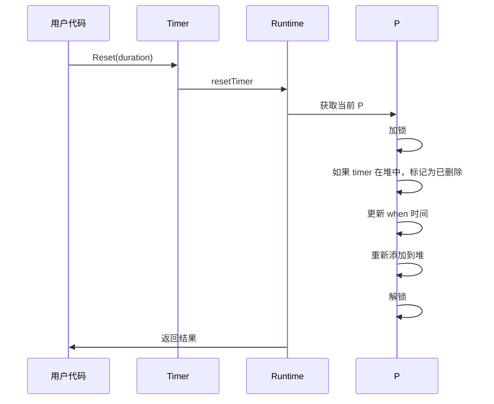

# Timer 堆的实现

## 最小堆特性

Go 的 timer 堆是一个**最小堆**，具有以下特性：

1. **堆顶元素最小**：堆顶的 timer 是最早触发的
2. **完全二叉树**：使用数组实现
3. **堆序性质**：父节点的 `when` 值小于等于子节点

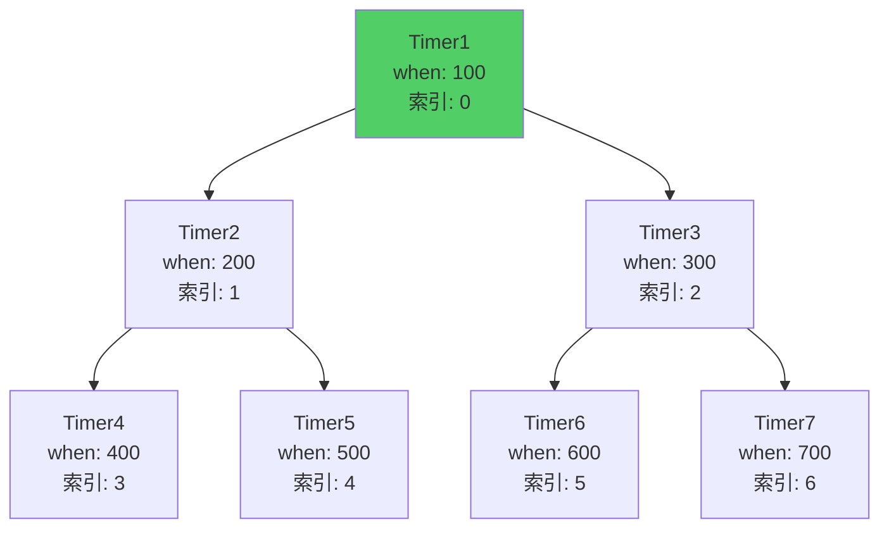

### 堆的数组表示

```
索引:  0    1    2    3    4    5    6
值:  [100, 200, 300, 400, 500, 600, 700]
```

## 堆操作

### 上浮（Sift Up）

当添加新 timer 时，需要上浮以维持堆序：

```go
// runtime/time.go

const timerHeapN = 4  // 四叉堆

// siftUp 通过向上移动将位置 i 的 timer 放在堆的正确位置
func (ts *timers) siftUp(i int) {
    heap := ts.heap
    if i >= len(heap) {
        badTimer()
    }
    tw := heap[i]
    if tw.when <= 0 {
        badTimer()
    }
    for i > 0 {
        p := int(uint(i-1) / timerHeapN)  // 父节点
        if !tw.less(heap[p]) {
            break
        }
        heap[i] = heap[p]
        i = p
    }
    if heap[i].timer != tw.timer {
        heap[i] = tw
    }
}

// less 报告 tw 是否小于 other
func (tw timerWhen) less(other timerWhen) bool {
    switch {
    case tw.when < other.when:
        return true
    case tw.when > other.when:
        return false
    default:
        // 当 timer 在同一时刻触发时，使用每个 timer 的随机值来排序
        // 我们只为使用假时间的 timer 设置随机值
        return tw.timer.rand < other.timer.rand
    }
}
```

### 下沉（Sift Down）

当删除堆顶 timer 时，需要下沉以维持堆序：

```go
// runtime/time.go

// siftDown 通过向下移动将位置 i 的 timer 放在堆的正确位置
func (ts *timers) siftDown(i int) {
    heap := ts.heap
    n := len(heap)
    if i >= n {
        badTimer()
    }
    if i*timerHeapN+1 >= n {
        return
    }
    tw := heap[i]
    if tw.when <= 0 {
        badTimer()
    }
    for {
        leftChild := i*timerHeapN + 1
        if leftChild >= n {
            break
        }
        w := tw
        c := -1
        for j, tw := range heap[leftChild:min(leftChild+timerHeapN, n)] {
            if tw.less(w) {
                w = tw
                c = leftChild + j
            }
        }
        if c < 0 {
            break
        }
        heap[i] = heap[c]
        i = c
    }
    if heap[i].timer != tw.timer {
        heap[i] = tw
    }
}
```

### 四叉堆 vs 二叉堆

Go 使用**四叉堆**而不是二叉堆，原因：

1. **减少堆高度**：四叉堆的高度约为二叉堆的一半
2. **减少比较次数**：虽然每次比较的子节点更多，但总体比较次数更少
3. **更好的缓存局部性**：访问模式更友好

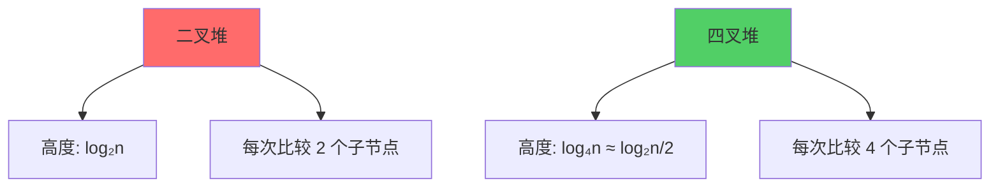

# Timer 的调度优化

## Timer 调整机制

当 timer 被修改（Reset）或停止（Stop）时，Go 使用延迟调整机制来优化性能：

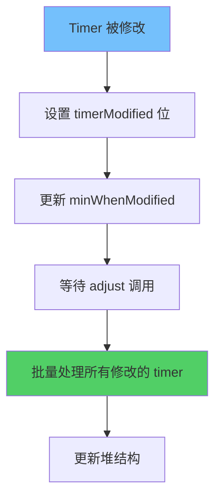

### Timer 调整代码

```go
// runtime/time.go

// adjust 查找 ts.heap 中任何已修改为更早运行的 timer
// 并将它们放在堆中的正确位置
func (ts *timers) adjust(now int64, force bool) {
    assertLockHeld(&ts.mu)
    
    // 如果还没到达最早修改 timer 的时间，不做任何事
    // 这可以加速大量 timer 来回调整的程序
    if !force {
        first := ts.minWhenModified.Load()
        if first == 0 || first > now {
            return
        }
    }
    
    // 更新 minWhenHeap 以包含 minWhenModified 的信息
    ts.minWhenHeap.Store(ts.wakeTime())
    ts.minWhenModified.Store(0)
    
    changed := false
    for i := 0; i < len(ts.heap); i++ {
        tw := &ts.heap[i]
        t := tw.timer
        
        // 快速路径：不需要调整
        if t.astate.Load()&(timerModified|timerZombie) == 0 {
            continue
        }
        
        t.lock()
        switch {
        case t.state&timerZombie != 0:
            // 从堆中移除僵尸 timer
            ts.zombies.Add(-1)
            t.state &^= timerHeaped | timerZombie | timerModified
            n := len(ts.heap)
            ts.heap[i] = ts.heap[n-1]
            ts.heap[n-1] = timerWhen{}
            ts.heap = ts.heap[:n-1]
            t.ts = nil
            i--
            changed = true
            
        case t.state&timerModified != 0:
            // 更新 when 值
            tw.when = t.when
            t.state &^= timerModified
            changed = true
        }
        t.unlock()
    }
    
    if changed {
        ts.initHeap()  // 重新建立堆序
    }
    ts.updateMinWhenHeap()
}
```

## Timer 与 Netpoller 集成

Go 的 timer 系统与网络轮询器（netpoller）紧密集成，使用操作系统提供的高效 I/O 多路复用机制（epoll/kqueue/IOCP）来实现精确的定时唤醒。

### Netpoller 概述

Netpoller 是 Go 运行时的一个关键组件，它将异步操作系统 I/O 转换为阻塞的 goroutine 接口。它运行在自己的线程中，接收来自执行网络 I/O 的 goroutine 的事件。

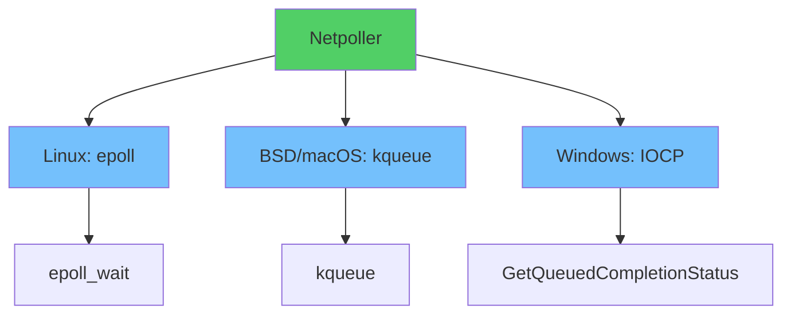

### Timer 如何与 Netpoller 结合

#### 1. 唤醒机制

当 timer 需要等待时，通过 `wakeNetPoller()` 通知 netpoller：

```go
// runtime/time.go

// wakeNetPoller 唤醒 netpoller（如果它正在等待）
// 如果 when 在将来，netpoller 会在 when 时间唤醒
func wakeNetPoller(when int64) {
    if atomic.Load64(&sched.lastpoll) == 0 {
        // 如果 netpoller 未初始化，初始化它
        netpollGenericInit()
    }
    
    // 计算需要等待的时间
    delta := when - nanotime()
    if delta < 0 {
        delta = 0
    }
    
    // 通知 netpoller 新的唤醒时间
    netpollBreak()
}
```

#### 2. Netpoller 等待流程

Netpoller 在等待网络事件时，会同时等待 timer 触发：

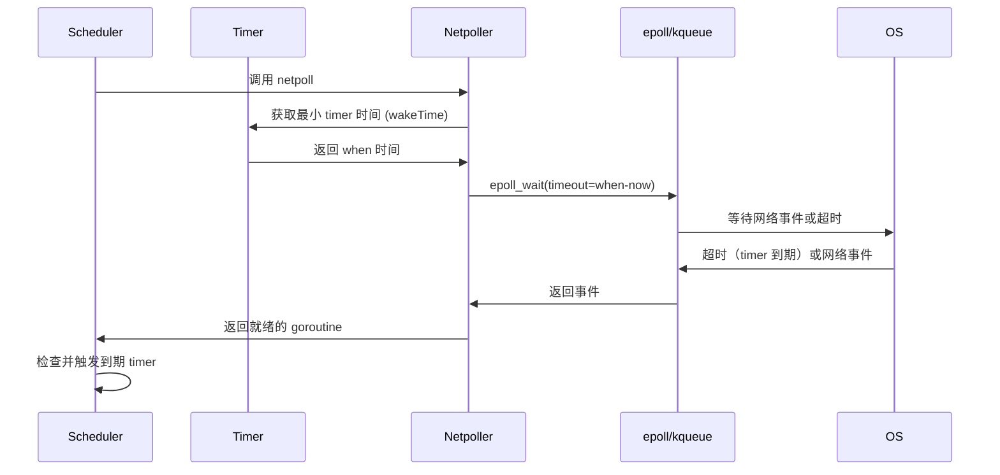

#### 3. 统一事件循环

Timer 和网络 I/O 共享同一个事件循环：

```go
// runtime/proc.go

// findrunnable 查找可运行的 goroutine
func findrunnable() (gp *g, inheritTime bool) {
    // ... 其他逻辑
    
    // 检查 timer
    now, pollUntil, _ := checkTimers(pp, 0)
    
    // 如果还有 timer 要触发，计算等待时间
    if pollUntil != 0 && pollUntil < now {
        pollUntil = now
    }
    
    // 调用 netpoll，同时等待网络事件和 timer
    if netpollinited() && (atomic.Load(&netpollWaiters) > 0 || pollUntil != 0) {
        list := netpoll(pollUntil)  // 传入 timer 的等待时间
        if !list.empty() {
            // 处理网络事件
        }
    }
    
    // 再次检查 timer（可能在 netpoll 期间到期）
    now, pollUntil, ran := checkTimers(pp, now)
    
    // ... 其他逻辑
}
```

#### 4. Netpoll 实现

Netpoll 使用平台特定的实现，同时处理网络事件和 timer 超时：

```go
// runtime/netpoll_epoll.go (Linux)

func netpoll(delay int64) gList {
    if epfd == -1 {
        return gList{}
    }
    
    var events [128]epollevent
    var waitms int32
    if delay < 0 {
        waitms = -1  // 无限等待
    } else if delay == 0 {
        waitms = 0   // 不等待
    } else {
        waitms = int32(delay / 1e6)  // 转换为毫秒
    }
    
    // 调用 epoll_wait，等待网络事件或超时
    n := epollwait(epfd, &events[0], int32(len(events)), waitms)
    
    if n < 0 {
        if n != -_EINTR {
            return gList{}
        }
        // 被中断，可能是 timer 唤醒
        return gList{}
    }
    
    var toRun gList
    for i := int32(0); i < n; i++ {
        ev := &events[i]
        if ev.events == 0 {
            continue
        }
        
        // 处理网络事件
        if *(**uintptr)(unsafe.Pointer(&ev.data)) == &netpollBreakRd {
            // 这是 timer 唤醒信号
            continue
        }
        
        // 唤醒等待网络 I/O 的 goroutine
        // ...
    }
    
    return toRun
}
```

#### 5. Timer 检查时机

Timer 在以下时机被检查：

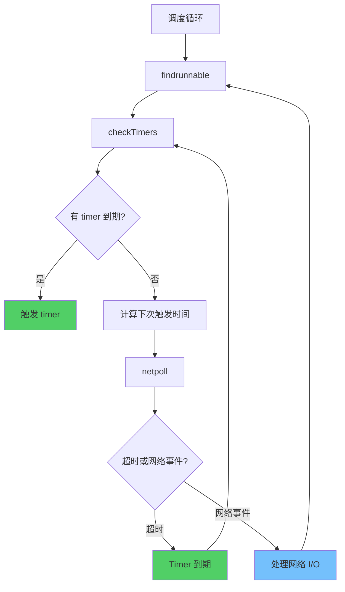

**代码流程**：

```go
// runtime/proc.go

// checkTimers 检查并运行到期的 timer
func checkTimers(pp *p, now int64) (rnow, pollUntil int64, ran bool) {
    if atomic.Load(&pp.deletedTimers) == 0 &&
        atomic.Load(&pp.numTimers) == 0 {
        return now, 0, false
    }
    
    // 检查并运行到期的 timer
    rnow, pollUntil, ran = pp.timers.check(now, nil)
    
    return rnow, pollUntil, ran
}
```

### 集成优势

#### 1. 精确唤醒

操作系统内核会在精确时间唤醒 netpoller，无需轮询：

```go
// 操作系统会在 when 时间精确唤醒
epoll_wait(epfd, events, maxevents, timeout)  // timeout = when - now
```

#### 2. 减少 CPU 占用

不需要轮询检查 timer 是否到期，CPU 可以用于其他工作：

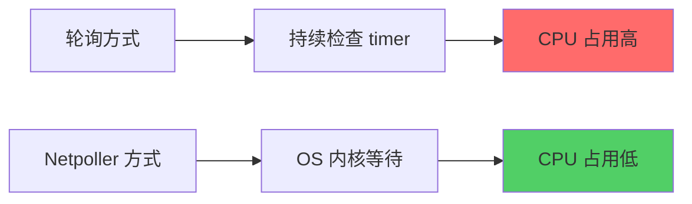

#### 3. 统一事件循环

Timer 和网络 I/O 使用同一个事件循环，减少线程和上下文切换：

```go
// 一次系统调用同时等待：
// 1. 网络 I/O 事件
// 2. Timer 到期
epoll_wait(epfd, events, maxevents, timer_timeout)
```

#### 4. 高效调度

当 timer 到期或网络事件就绪时，可以立即调度相关的 goroutine：

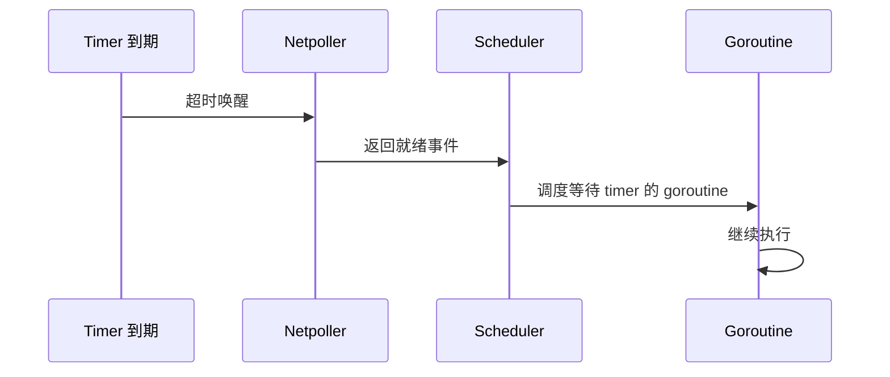

### 完整集成流程

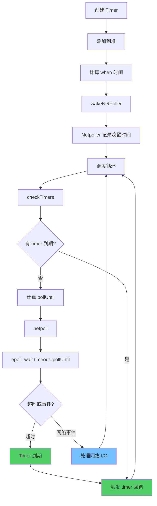

### 代码示例

#### Timer 添加时唤醒 Netpoller

```go
// runtime/time.go

func (t *timer) maybeAdd() {
    // ... 添加到堆
    
    wakeTime := ts.wakeTime()
    wake := wakeTime == 0 || when < wakeTime
    
    if wake {
        wakeNetPoller(when)  // 通知 netpoller 新的唤醒时间
    }
}
```

#### 调度时检查 Timer

```go
// runtime/proc.go

func findrunnable() (gp *g, inheritTime bool) {
    // 检查 timer
    now, pollUntil, ran := checkTimers(pp, 0)
    
    // 如果 timer 已运行，可能已经找到了可运行的 goroutine
    if ran {
        // 继续查找
    }
    
    // 调用 netpoll，传入 timer 的等待时间
    if netpollinited() && pollUntil != 0 {
        list := netpoll(pollUntil)
        // 处理网络事件和 timer 超时
    }
}
```

### 平台特定实现

不同平台使用不同的 I/O 多路复用机制：

| 平台 | 机制 | 系统调用 |
|------|------|---------|
| **Linux** | epoll | `epoll_wait()` |
| **BSD/macOS** | kqueue | `kevent()` |
| **Windows** | IOCP | `GetQueuedCompletionStatusEx()` |

所有实现都支持传入超时时间，从而实现 timer 的精确唤醒。

### 总结

Timer 与 Netpoller 的集成实现了：

1. ✅ **精确唤醒**：操作系统内核在精确时间唤醒
2. ✅ **低 CPU 占用**：无需轮询，CPU 可用于其他工作
3. ✅ **统一事件循环**：Timer 和网络 I/O 共享同一事件循环
4. ✅ **高效调度**：Timer 到期时立即调度相关 goroutine
5. ✅ **跨平台支持**：使用各平台最优的 I/O 多路复用机制

这种设计使得 Go 的 timer 系统既精确又高效，能够处理大量并发 timer 而不会显著影响系统性能。

# Timer 的性能特性

## 时间复杂度

| 操作 | 时间复杂度 | 说明 |
|------|-----------|------|
| **添加 Timer** | O(log n) | 堆插入和上浮 |
| **删除 Timer** | O(log n) | 堆删除和下沉 |
| **触发 Timer** | O(log n) | 删除堆顶元素 |
| **查找最小 Timer** | O(1) | 直接访问堆顶 |

## 空间复杂度

- **每个 Timer**：约 80 字节（包含 runtime.timer 结构）
- **堆存储**：O(n)，n 为 timer 数量
- **每个 P**：维护一个独立的 timer 堆

## 性能优化建议

### 1. 避免频繁创建 Timer

```go
// ❌ 不好：每次循环都创建新 Timer
func badExample() {
    for {
        <-time.After(1 * time.Second)
        doSomething()
    }
}

// ✅ 好：复用 Ticker
func goodExample() {
    ticker := time.NewTicker(1 * time.Second)
    defer ticker.Stop()
    
    for {
        <-ticker.C
        doSomething()
    }
}
```

### 2. Stop Timer（Go 1.23+ 变化）

**Go 1.23+**：GC 可以自动回收未引用的 timer，`Stop()` 主要用于停止 timer 而不是帮助 GC。

```go
// Go 1.23+：即使不调用 Stop，GC 也可以回收未引用的 timer
func example1() {
    timer := time.NewTimer(10 * time.Second)
    // 如果 timer 不再被引用，GC 可以回收它
    <-timer.C
}

// 仍然需要 Stop 来停止 timer（如果需要提前取消）
func example2() {
    timer := time.NewTimer(10 * time.Second)
    defer timer.Stop()  // 如果需要提前取消
    
    select {
    case <-timer.C:
        // 处理
    case <-done:
        // 取消时自动 Stop
    }
}

// Go 1.22 及更早：需要 Stop 来帮助 GC
func oldExample() {
    timer := time.NewTimer(10 * time.Second)
    defer timer.Stop()  // 必须调用以帮助 GC 回收
    <-timer.C
}
```

### 3. 使用 Context 超时

```go
// ✅ 推荐：使用 Context
func goodExample(ctx context.Context) {
    ctx, cancel := context.WithTimeout(ctx, 5*time.Second)
    defer cancel()
    
    select {
    case <-ctx.Done():
        // 超时处理
    case result := <-ch:
        // 正常处理
    }
}
```

### 4. 批量处理 Timer

```go
// ✅ 好：批量处理减少 Timer 数量
func batchProcess(items []Item) {
    ticker := time.NewTicker(100 * time.Millisecond)
    defer ticker.Stop()
    
    batch := make([]Item, 0, 100)
    
    for {
        select {
        case item := <-itemChan:
            batch = append(batch, item)
            if len(batch) >= 100 {
                processBatch(batch)
                batch = batch[:0]
            }
        case <-ticker.C:
            if len(batch) > 0 {
                processBatch(batch)
                batch = batch[:0]
            }
        }
    }
}
```

# Timer 的常见问题

## 1. Timer 泄漏

### 问题描述

忘记 Stop Timer 会导致内存泄漏：

```go
func leakExample() {
    for i := 0; i < 1000; i++ {
        go func() {
            timer := time.NewTimer(10 * time.Second)
            <-timer.C
            // 忘记 Stop
        }()
    }
}
```

### 解决方案

```go
func fixedExample() {
    for i := 0; i < 1000; i++ {
        go func() {
            timer := time.NewTimer(10 * time.Second)
            defer timer.Stop()  // 确保清理
            
            select {
            case <-timer.C:
                // 处理
            case <-done:
                return  // 提前退出时自动 Stop
            }
        }()
    }
}
```

## 2. Timer 精度问题

### 问题描述

Timer 的精度受系统调度影响，不保证精确：

```go
// Timer 可能不会在精确时间触发
timer := time.NewTimer(100 * time.Millisecond)
<-timer.C  // 实际可能延迟几毫秒
```

### 解决方案

```go
// 对于高精度需求，使用 time.Sleep 或调整系统时钟精度
// 但要注意，Go 的 timer 精度通常足够（毫秒级）
```

## 3. Timer Reset 的竞态条件

### 问题描述

在 Timer 触发后 Reset 可能导致问题：

```go
timer := time.NewTimer(1 * time.Second)
go func() {
    <-timer.C
    timer.Reset(1 * time.Second)  // 可能有问题
}()
```

### 解决方案

```go
timer := time.NewTimer(1 * time.Second)
go func() {
    for {
        <-timer.C
        // 处理逻辑
        if !timer.Stop() {
            <-timer.C  // 清空 channel
        }
        timer.Reset(1 * time.Second)
    }
}()
```

## 4. 大量 Timer 的性能问题

### 问题描述

创建大量 Timer 会导致堆操作开销大：

```go
// 创建 10000 个 Timer
for i := 0; i < 10000; i++ {
    time.AfterFunc(time.Duration(i)*time.Millisecond, func() {
        // 处理
    })
}
```

### 解决方案

```go
// 使用时间轮或批量处理
type TimeWheel struct {
    // 实现时间轮算法
}

// 或者使用单个 Timer + 优先级队列
```

# Timer 的最佳实践

## 1. 使用 defer 确保清理

```go
func example() {
    timer := time.NewTimer(5 * time.Second)
    defer timer.Stop()  // 确保清理
    
    // 使用 timer
}
```

## 2. 使用 Context 管理超时

```go
func example(ctx context.Context) {
    ctx, cancel := context.WithTimeout(ctx, 5*time.Second)
    defer cancel()
    
    select {
    case <-ctx.Done():
        return ctx.Err()
    case result := <-ch:
        return result
    }
}
```

## 3. 合理选择 Timer 类型

```go
// 单次延迟：使用 Timer
timer := time.NewTimer(5 * time.Second)

// 周期性任务：使用 Ticker
ticker := time.NewTicker(1 * time.Second)
defer ticker.Stop()

// 简单延迟：使用 time.After（注意内存泄漏）
select {
case <-time.After(5 * time.Second):
    // 处理
}
```

## 4. 避免在循环中创建 Timer

```go
// ❌ 不好
for {
    <-time.After(1 * time.Second)
    doSomething()
}

// ✅ 好
ticker := time.NewTicker(1 * time.Second)
defer ticker.Stop()
for {
    <-ticker.C
    doSomething()
}
```

## 5. 监控 Timer 数量

```go
import (
    "runtime"
    "time"
)

func monitorTimers() {
    ticker := time.NewTicker(5 * time.Second)
    defer ticker.Stop()
    
    for {
        <-ticker.C
        var m runtime.MemStats
        runtime.ReadMemStats(&m)
        // 监控内存使用，间接反映 Timer 数量
        log.Printf("NumGC: %d, Alloc: %d", m.NumGC, m.Alloc)
    }
}
```

# Timer 与 Goroutine 调度

## Timer 触发时的调度

当 Timer 触发时，会唤醒等待的 goroutine：

```mermaid
sequenceDiagram
    participant T as Timer
    participant G as Goroutine
    participant S as Scheduler
    
    T->>T: 到期触发
    T->>G: 发送到 channel
    G->>S: 从阻塞状态唤醒
    S->>G: 调度执行
    G->>G: 继续执行
```

## Timer 与 Select 语句

```go
select {
case <-timer.C:
    // Timer 触发
case <-otherChan:
    // 其他 channel 就绪
case <-ctx.Done():
    // Context 取消
}
```

当多个 case 同时就绪时，Go 会随机选择一个，但 Timer 的 case 可能不会被选中（如果其他 case 也就绪）。

# 总结

Go 的 Timer 管理是一个精心设计的系统：

## 核心要点

1. **堆管理**：使用四叉最小堆管理 Timer，O(log n) 时间复杂度
2. **分片存储**：每个 P 维护独立的 Timer 堆，减少锁竞争
3. **精确触发**：与 Netpoller 集成，使用系统调用精确等待
4. **延迟调整**：使用 timerModified 位和 minWhenModified 优化批量调整
5. **僵尸清理**：延迟清理已停止的 timer，减少堆操作开销
6. **Go 1.23+ 改进**：
   - GC 可以回收未过期的 timer
   - Channel 从异步（缓冲）变为同步（无缓冲），消除过期值
   - 异步 timer channel 模式（asynctimerchan）

## 性能特性

- **添加/删除**：O(log n)
- **查找最小**：O(1)
- **内存开销**：每个 Timer 约 80 字节
- **精度**：通常为毫秒级

## 最佳实践

1. **及时 Stop**：避免 Timer 泄漏
2. **复用 Ticker**：避免频繁创建 Timer
3. **使用 Context**：更好的超时管理
4. **监控数量**：避免创建过多 Timer

理解 Go Timer 的内部实现，有助于编写更高效、更可靠的 Go 程序。
