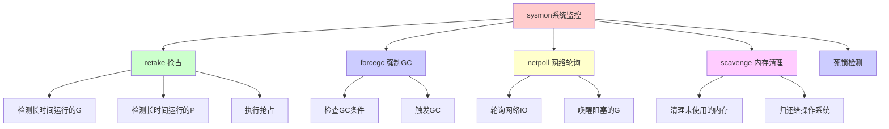
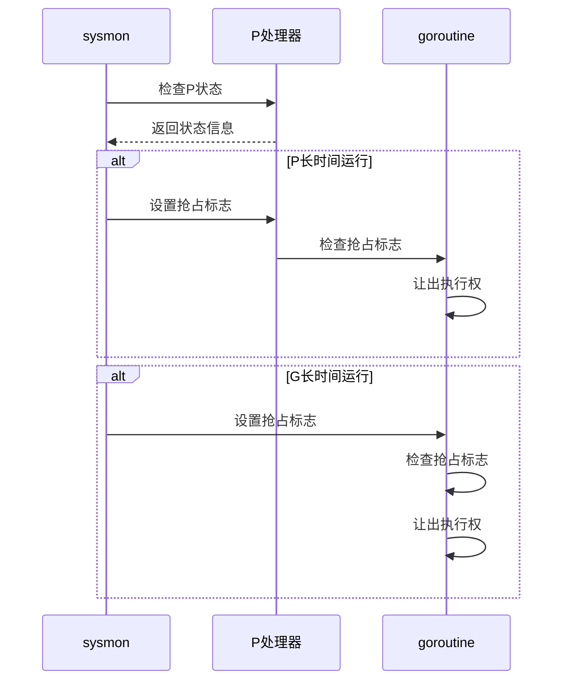
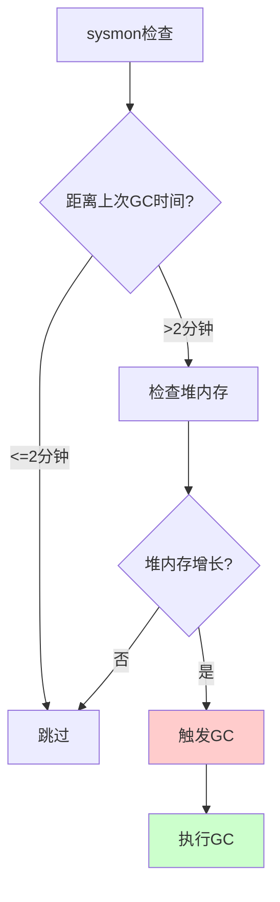
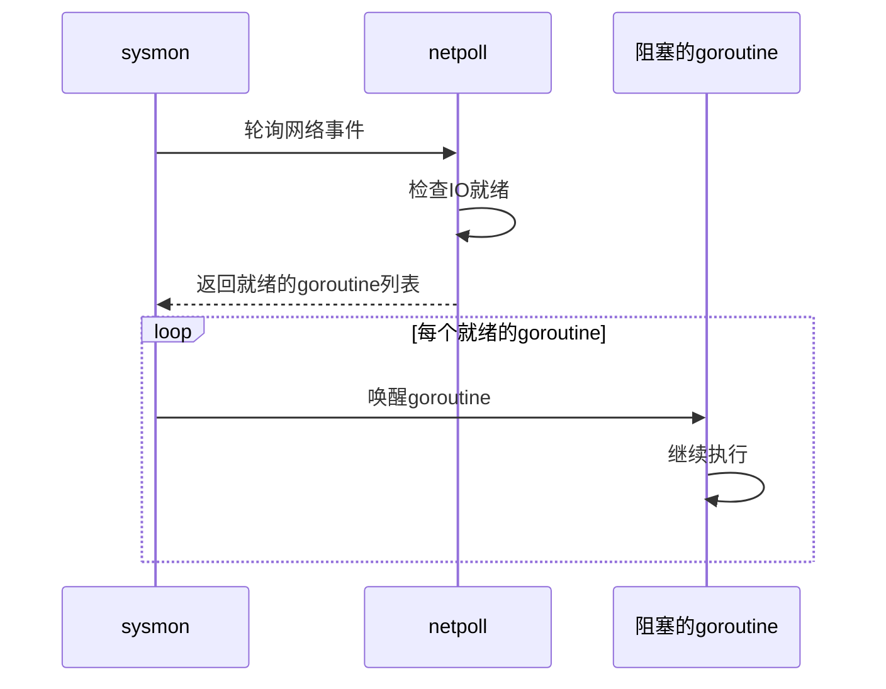
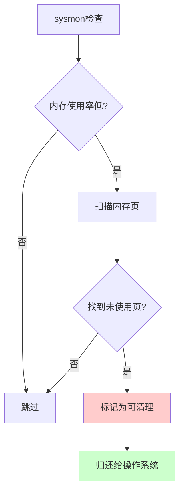
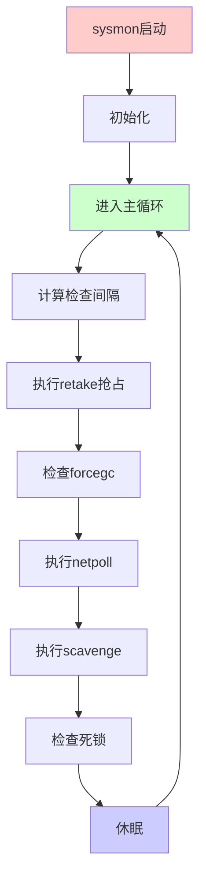
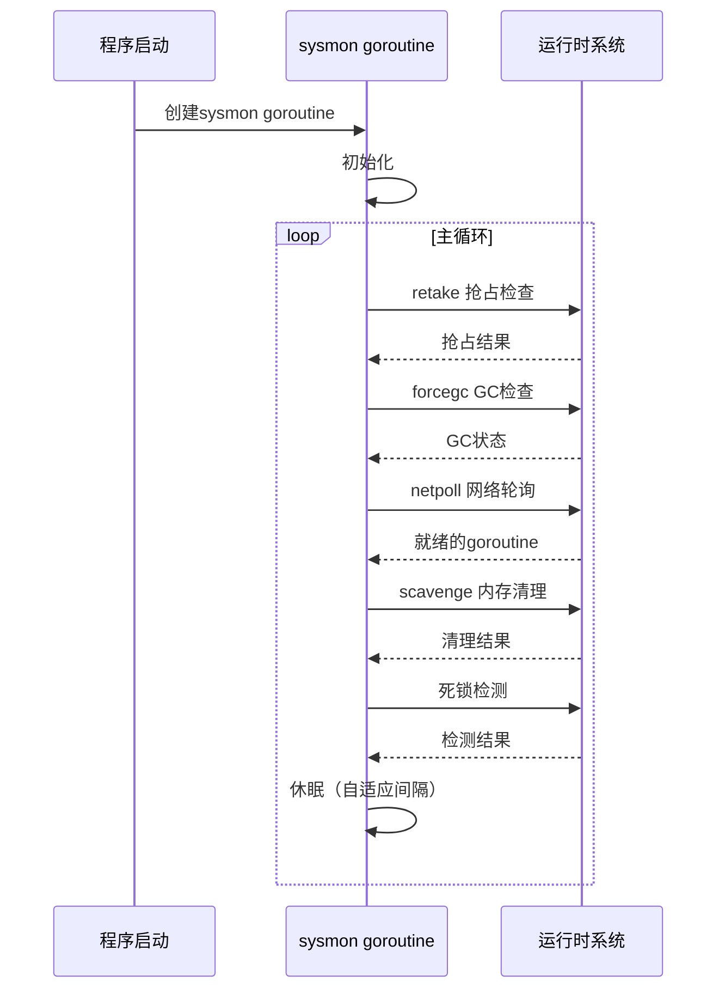

推荐阅读：[Go Runtime Sysmon](https://go.dev/src/runtime/proc.go)

# sysmon 概述

`sysmon`（System Monitor）是 Go 运行时系统中的一个后台监控 goroutine，负责系统级别的监控和管理任务。它在程序启动时创建，独立于用户 goroutine 运行，持续监控和优化运行时系统的状态。

## 设计目标

1. **系统监控**：监控 goroutine 和 P 的状态
2. **性能优化**：检测和回收长时间运行的 goroutine
3. **资源管理**：触发 GC、网络轮询等系统任务
4. **异常检测**：检测死锁、长时间阻塞等问题

## sysmon 的特点

- **独立运行**：在独立的 goroutine 中运行
- **后台执行**：不影响用户 goroutine 的执行
- **周期性检查**：定期执行各种监控任务
- **自适应间隔**：根据系统负载调整检查间隔

# sysmon 的主要功能

## 功能概览



## 1. retake - 抢占调度

`retake` 是 sysmon 最重要的功能之一，负责检测和抢占长时间运行的 goroutine 和 P。

### 工作原理



### 抢占条件

1. **P 长时间运行**：P 运行时间超过 10ms
2. **G 长时间运行**：goroutine 运行时间超过 10ms
3. **系统调用阻塞**：P 在系统调用中阻塞

### 代码示例

```go
// runtime/proc.go (简化)
func retake(now int64) uintptr {
    n := 0
    
    // 遍历所有 P
    for i := 0; i < len(allp); i++ {
        _p_ := allp[i]
        if _p_ == nil {
            continue
        }
        
        pd := &_p_.syscalltick
        s := _p_.status
        
        // 检查 P 是否在系统调用中
        if s == _Psyscall {
            // P 在系统调用中超过 20ms，需要抢占
            if now-pd.syscallwhen > 20*1000*1000 {
                // 抢占 P
                if atomic.Cas(&_p_.status, s, _Pidle) {
                    // 将 P 交给其他 M
                    handoffp(_p_)
                }
            }
        }
        
        // 检查 G 是否长时间运行
        if s == _Prunning {
            t := int64(_p_.schedtick)
            if int64(pd.schedtick) != t {
                pd.schedtick = uint32(t)
                pd.schedwhen = now
                continue
            }
            // G 运行超过 10ms，需要抢占
            if now-pd.schedwhen > 10*1000*1000 {
                // 抢占 G
                preemptone(_p_)
            }
        }
    }
    
    return uintptr(n)
}
```

### 抢占标志

```go
// runtime/proc.go (简化)
func preemptone(_p_ *p) bool {
    mp := _p_.m.ptr()
    if mp == nil || mp == getg().m {
        return false
    }
    gp := mp.curg
    if gp == nil || gp == mp.g0 {
        return false
    }
    
    // 设置抢占标志
    gp.preempt = true
    gp.stackguard0 = stackPreempt
    
    return true
}
```

## 2. forcegc - 强制 GC

`forcegc` 负责在必要时强制触发垃圾回收。

### 工作原理



### GC 触发条件

1. **时间条件**：距离上次 GC 超过 2 分钟
2. **内存条件**：堆内存持续增长
3. **手动触发**：调用 `runtime.GC()`

### 代码示例

```go
// runtime/proc.go (简化)
var forcegcperiod int64 = 2 * 60 * 1e9  // 2分钟

func sysmon() {
    lastgc := int64(atomic.Load64(&memstats.last_gc))
    
    for {
        now := nanotime()
        
        // 检查是否需要强制 GC
        if lastgc != 0 && now-lastgc > forcegcperiod {
            // 触发 GC
            gcTrigger{kind: gcTriggerTime, now: now}.test()
        }
        
        // 其他监控任务...
        usleep(delay)
    }
}
```

## 3. netpoll - 网络轮询

`netpoll` 负责轮询网络 IO 事件，唤醒阻塞在网络操作上的 goroutine。

### 工作原理



### 网络轮询的作用

1. **唤醒阻塞的 G**：网络 IO 就绪时唤醒等待的 goroutine
2. **提高并发**：及时处理网络事件
3. **减少延迟**：快速响应网络事件

### 代码示例

```go
// runtime/proc.go (简化)
func sysmon() {
    for {
        // 网络轮询
        if netpollinited() {
            list := netpoll(0)  // 非阻塞轮询
            if !list.empty() {
                // 将就绪的 goroutine 加入运行队列
                injectglist(&list)
            }
        }
        
        // 其他监控任务...
        usleep(delay)
    }
}
```

## 4. scavenge - 内存清理

`scavenge` 负责清理未使用的内存，将其归还给操作系统。

### 工作原理



### 内存清理条件

1. **内存使用率低**：系统内存使用率低于阈值
2. **空闲内存多**：有大量未使用的内存页
3. **系统压力小**：系统负载较低

### 代码示例

```go
// runtime/mheap.go (简化)
func sysmon() {
    for {
        // 检查是否需要清理内存
        if shouldScavenge() {
            // 清理内存
            mheap_.scavenge()
        }
        
        // 其他监控任务...
        usleep(delay)
    }
}

func shouldScavenge() bool {
    // 检查内存使用情况
    // 如果空闲内存多，返回 true
    return getFreeMemory() > threshold
}
```

## 5. 死锁检测

sysmon 还负责检测可能的死锁情况。

### 死锁检测条件

1. **所有 P 空闲**：所有 P 都没有可运行的 G
2. **所有 G 阻塞**：所有 goroutine 都在等待
3. **长时间无进展**：系统长时间没有进展

### 代码示例

```go
// runtime/proc.go (简化)
func sysmon() {
    for {
        // 检查死锁
        if checkdead() {
            // 检测到死锁，输出错误信息
            throw("all goroutines are asleep - deadlock!")
        }
        
        // 其他监控任务...
        usleep(delay)
    }
}

func checkdead() bool {
    // 检查所有 P 是否都空闲
    // 检查所有 G 是否都阻塞
    // 如果满足死锁条件，返回 true
    return allPIdle() && allGBlocked()
}
```

# sysmon 的工作流程

## 主循环



## 检查间隔

sysmon 使用自适应间隔，根据系统负载调整检查频率：

```go
// runtime/proc.go (简化)
func sysmon() {
    delay := uint32(0)
    
    for {
        // 根据系统负载调整间隔
        if idle == 0 {  // 系统繁忙
            delay = 20  // 20微秒
        } else if delay < 10*1000 {  // 系统空闲
            delay *= 2  // 增加间隔
        }
        
        // 执行监控任务
        retake(now)
        // ...
        
        // 休眠
        usleep(delay)
    }
}
```

## 完整工作流程



# sysmon 的启动

## 启动时机

sysmon 在程序启动时由 `runtime.main()` 创建：

```go
// runtime/proc.go (简化)
func main() {
    // ... 初始化代码 ...
    
    // 启动 sysmon
    systemstack(func() {
        newm(sysmon, nil, -1)
    })
    
    // ... 其他初始化 ...
}
```

## 启动代码

```go
// runtime/proc.go (简化)
func sysmon() {
    lock(&sched.lock)
    sched.nmsys++
    unlock(&sched.lock)
    
    // 设置 sysmon 的 M
    // sysmon 运行在独立的 M 上
    
    for {
        // 主循环
        // ...
    }
}
```

# sysmon 的关键参数

## 时间参数

| 参数 | 值 | 说明 |
|------|-----|------|
| 抢占检查间隔 | 20μs - 10ms | 自适应调整 |
| P 抢占阈值 | 20ms | P 在系统调用中超过此时间被抢占 |
| G 抢占阈值 | 10ms | G 运行超过此时间被抢占 |
| 强制 GC 间隔 | 2分钟 | 距离上次 GC 超过此时间触发 |
| 网络轮询间隔 | 20μs - 10ms | 自适应调整 |

## 内存参数

| 参数 | 说明 |
|------|------|
| 内存清理阈值 | 根据系统内存使用率决定 |
| 空闲内存阈值 | 超过此值触发内存清理 |

# sysmon 的影响

## 对性能的影响

1. **抢占调度**：确保公平调度，避免 goroutine 长时间占用 CPU
2. **GC 触发**：及时回收内存，避免内存泄漏
3. **网络响应**：及时处理网络事件，提高并发性能
4. **内存管理**：清理未使用内存，减少内存占用

## 对用户体验的影响

1. **响应性**：抢占确保系统响应及时
2. **稳定性**：GC 和内存清理保证系统稳定
3. **性能**：网络轮询提高并发性能

# sysmon 的监控和调试

## 查看 sysmon 状态

### 使用 runtime 包

```go
package main

import (
    "fmt"
    "runtime"
    "time"
)

func main() {
    // 查看 goroutine 数量
    fmt.Printf("Goroutines: %d\n", runtime.NumGoroutine())
    
    // 查看 GC 统计
    var m runtime.MemStats
    runtime.ReadMemStats(&m)
    fmt.Printf("GC次数: %d\n", m.NumGC)
    fmt.Printf("GC暂停时间: %v\n", time.Duration(m.PauseTotalNs))
}
```

### 使用 pprof

```bash
# 查看 goroutine 信息
go tool pprof http://localhost:6060/debug/pprof/goroutine

# 查看堆内存信息
go tool pprof http://localhost:6060/debug/pprof/heap
```

### 使用 trace

```go
package main

import (
    "os"
    "runtime/trace"
)

func main() {
    f, _ := os.Create("trace.out")
    trace.Start(f)
    defer trace.Stop()
    
    // 你的代码
}
```

## 调试 sysmon

### 启用调试输出

```bash
# 设置环境变量查看调试信息
GODEBUG=schedtrace=1000,scheddetail=1 go run main.go
```

### 输出示例

```
SCHED 1000ms: gomaxprocs=4 idleprocs=0 threads=5 spinningthreads=0 idlethreads=3 runqueue=0 [0 0 0 0]
```

**字段说明**：
- `gomaxprocs`：P 的数量
- `idleprocs`：空闲的 P 数量
- `threads`：M 的数量
- `spinningthreads`：自旋的 M 数量
- `idlethreads`：空闲的 M 数量
- `runqueue`：全局运行队列长度

# sysmon 的最佳实践

## 1. 理解抢占机制

- **抢占是正常的**：sysmon 会定期抢占长时间运行的 goroutine
- **不要依赖执行时间**：goroutine 可能随时被抢占
- **使用 channel 通信**：不要依赖抢占来同步

## 2. 优化长时间运行的任务

```go
// ❌ 不好：长时间运行的任务可能被抢占
func bad() {
    for i := 0; i < 1000000; i++ {
        // 长时间计算
        compute()
    }
}

// ✅ 好：定期让出 CPU
func good() {
    for i := 0; i < 1000000; i++ {
        compute()
        if i%1000 == 0 {
            runtime.Gosched()  // 让出 CPU
        }
    }
}
```

## 3. 监控系统状态

- **定期检查**：使用 pprof 和 trace 监控系统状态
- **关注指标**：关注 goroutine 数量、GC 频率、内存使用
- **及时优化**：发现问题及时优化

## 4. 避免死锁

- **使用超时**：为阻塞操作设置超时
- **检查死锁**：sysmon 会检测死锁，但最好避免
- **使用 context**：使用 context 控制 goroutine 生命周期

# 总结

sysmon 是 Go 运行时系统的重要组成部分，负责：

## 核心功能

1. **retake 抢占**：确保公平调度，避免 goroutine 长时间占用 CPU
2. **forcegc 强制 GC**：及时触发垃圾回收，避免内存泄漏
3. **netpoll 网络轮询**：及时处理网络事件，提高并发性能
4. **scavenge 内存清理**：清理未使用内存，减少内存占用
5. **死锁检测**：检测可能的死锁情况

## 关键特点

- **独立运行**：在独立的 goroutine 中运行
- **后台执行**：不影响用户 goroutine
- **自适应间隔**：根据系统负载调整检查频率
- **持续监控**：持续监控和优化系统状态

## 重要性

sysmon 对 Go 程序的性能和稳定性至关重要：

- **公平调度**：确保所有 goroutine 都能得到执行机会
- **内存管理**：及时回收内存，避免内存泄漏
- **网络性能**：及时处理网络事件，提高并发性能
- **系统稳定**：检测和解决系统问题

理解 sysmon 的工作原理，有助于：
- 编写高性能的 Go 程序
- 调试性能问题
- 优化系统资源使用
- 理解 Go 运行时的行为
