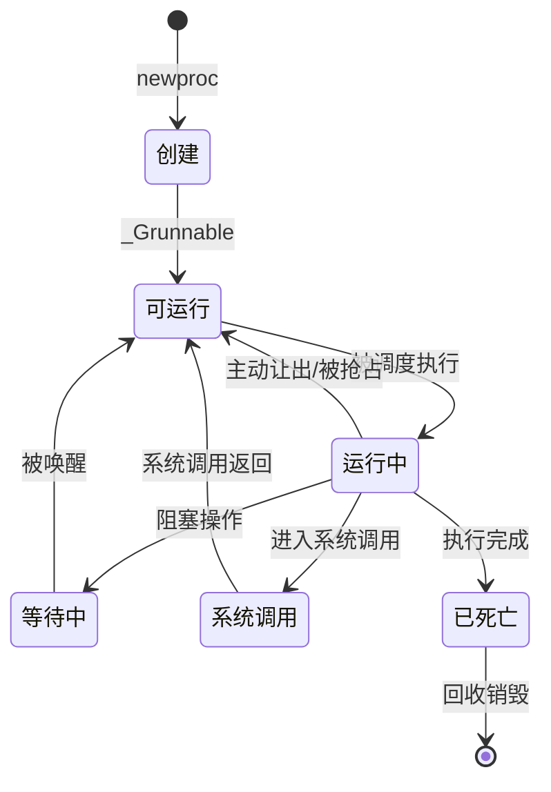
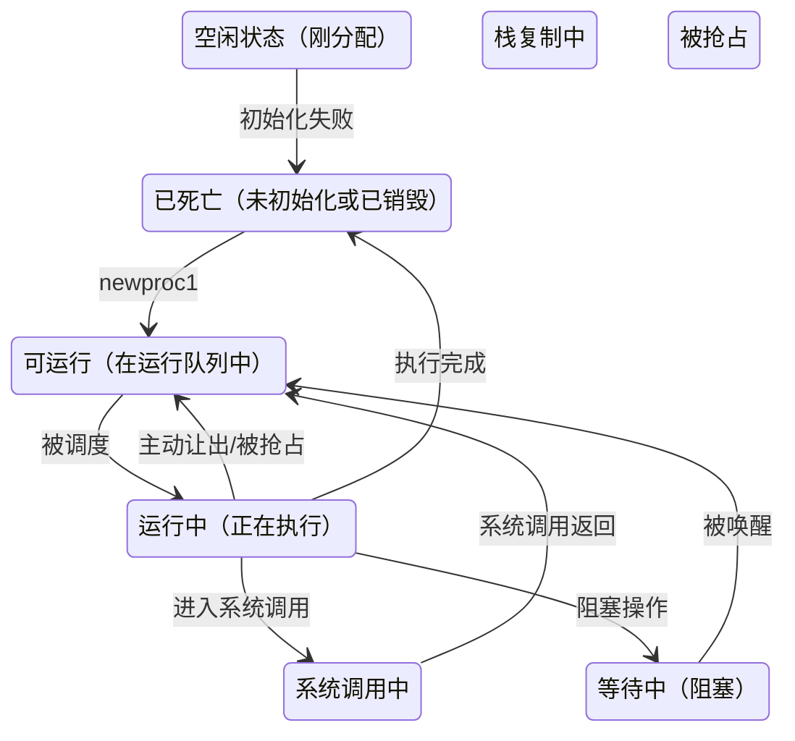
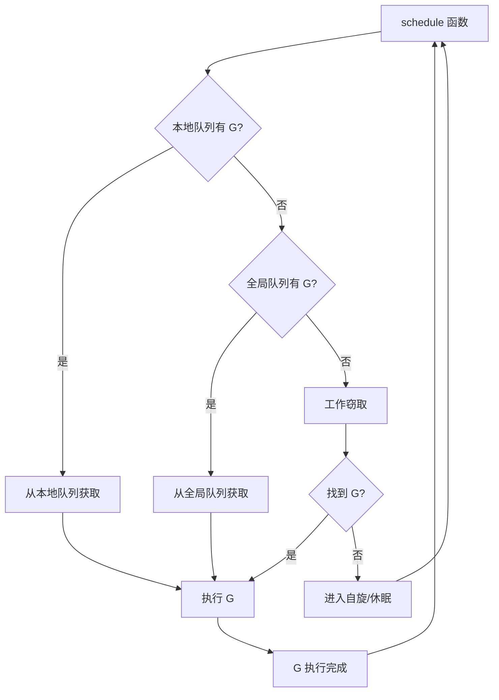
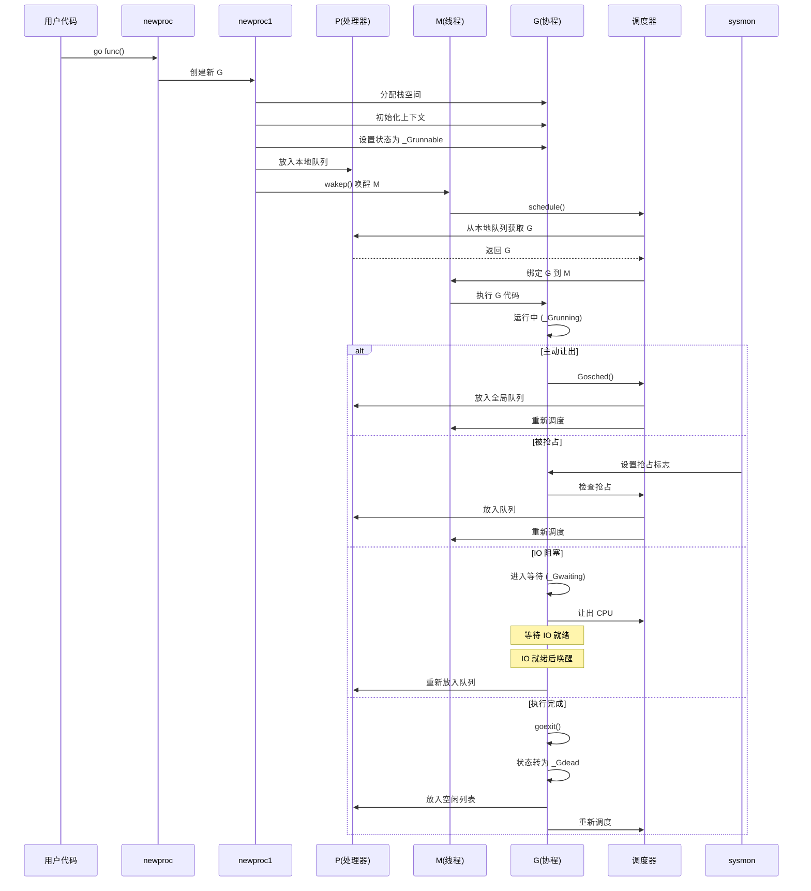

本文描述 Go 协程（goroutine）从创建到销毁的完整生命周期，包括创建、运行、调度、回收和销毁等各个阶段。

# 协程生命周期概览

协程的一生可以概括为以下几个阶段：



# 创建协程

协程的创建通过 `go` 关键字触发，底层调用 `runtime.newproc` 函数。

## newproc 函数

```go
// runtime/proc.go

func newproc(siz int32, fn *funcval) {
    argp := add(unsafe.Pointer(&fn), sys.PtrSize)
    gp := getg()
    pc := getcallerpc()
    systemstack(func() {
        newg := newproc1(fn, argp, siz, gp, pc)
        
        _p_ := getg().m.p.ptr()
        runqput(_p_, newg, true)
        
        if mainStarted {
            wakep() // 尝试唤醒或创建新的 M
        }
    })
}
```

**主要流程**：
1. 获取当前 goroutine 和调用者 PC
2. 在系统栈上调用 `newproc1` 创建新的 goroutine
3. 将新创建的 goroutine 放入当前 P 的本地运行队列
4. 如果主函数已启动，尝试唤醒或创建新的 M 来执行

## newproc1 函数

`newproc1` 是实际创建 goroutine 的函数：

```go
// runtime/proc.go

func newproc1(fn *funcval, argp unsafe.Pointer, narg int32, callergp *g, callerpc uintptr) *g {
    _g_ := getg()
    
    acquirem() // 禁止抢占
    siz := narg
    siz = (siz + 7) &^ 7 // 对齐到 8 字节
    
    _p_ := _g_.m.p.ptr()
    newg := gfget(_p_) // 从 P 的空闲 G 列表中获取
    if newg == nil {
        // 没有空闲的 G，创建新的
        newg = malg(_StackMin) // 创建最小栈的 G
        casgstatus(newg, _Gidle, _Gdead)
        allgadd(newg) // 添加到全局 G 列表
    }
    
    // 初始化栈空间
    totalSize := 4*sys.RegSize + uintptr(siz) + sys.MinFrameSize
    totalSize += -totalSize & (sys.SpAlign - 1)
    sp := newg.stack.hi - totalSize
    spArg := sp
    
    // 复制参数到新栈
    if narg > 0 {
        memmove(unsafe.Pointer(spArg), argp, uintptr(narg))
    }
    
    // 初始化调度上下文
    memclrNoHeapPointers(unsafe.Pointer(&newg.sched), unsafe.Sizeof(newg.sched))
    newg.sched.sp = sp
    newg.stktopsp = sp
    newg.sched.pc = funcPC(goexit) + sys.PCQuantum // 返回地址设置为 goexit
    newg.sched.g = guintptr(unsafe.Pointer(newg))
    gostartcallfn(&newg.sched, fn) // 设置函数入口
    
    newg.gopc = callerpc
    newg.ancestors = saveAncestors(callergp)
    newg.startpc = fn.fn
    
    // 分配 goroutine ID
    if _p_.goidcache == _p_.goidcacheend {
        _p_.goidcache = atomic.Xadd64(&sched.goidgen, _GoidCacheBatch)
        _p_.goidcache -= _GoidCacheBatch - 1
        _p_.goidcacheend = _p_.goidcache + _GoidCacheBatch
    }
    newg.goid = int64(_p_.goidcache)
    _p_.goidcache++
    
    // 状态转换为可运行
    casgstatus(newg, _Gdead, _Grunnable)
    
    releasem(_g_.m)
    
    return newg
}
```

**关键步骤**：

1. **获取或创建 G**：
   - 优先从 P 的空闲 G 列表（`gFree`）中获取，实现 G 的复用
   - 如果没有空闲的 G，调用 `malg` 创建新的 G，并分配最小栈空间（2KB）

2. **初始化栈空间**：
   - 计算所需栈大小（参数大小 + 帧大小）
   - 从高地址向低地址分配栈空间
   - 将函数参数复制到新栈上

3. **设置调度上下文**：
   - `sched.pc`：设置为 `goexit` 函数地址，当 goroutine 执行完成后会调用此函数
   - `sched.sp`：栈指针
   - 通过 `gostartcallfn` 设置实际的函数入口地址

4. **分配 goroutine ID**：
   - 从 P 的 ID 缓存中获取，如果缓存用完则批量从全局分配

5. **状态转换**：
   - 从 `_Gdead` 转换为 `_Grunnable`，表示可以调度执行

## 协程状态

协程在生命周期中会经历以下状态：



# 运行协程

协程创建后会被放入运行队列，等待被调度执行。

## 调配资源

协程要运行，需要绑定 M（内核线程）和 P（处理器）。

### 绑定M

M 是执行 goroutine 的内核线程。M 的绑定过程：

1. **获取空闲 M**：
   - 从全局空闲 M 列表（`sched.midle`）中获取
   - 如果没有空闲的 M，创建新的 M

2. **绑定 P**：
   - M 必须绑定 P 才能执行 G
   - 从空闲 P 列表（`sched.pidle`）中获取 P
   - 如果所有 P 都被占用，M 会进入自旋状态等待

3. **执行调度循环**：
   - M 绑定 P 后，进入调度循环（`schedule` 函数）
   - 从 P 的本地队列获取 G 执行

### 绑定P

P 是管理 goroutine 执行资源的处理器：

1. **P 的状态**：
   - `_Pidle`：空闲状态，没有绑定 M
   - `_Prunning`：运行状态，已绑定 M 并执行 G
   - `_Psyscall`：系统调用状态，M 进入系统调用时 P 处于此状态
   - `_Pgcstop`：GC 停止状态
   - `_Pdead`：已死亡状态

2. **P 的本地队列**：
   - 每个 P 维护一个本地运行队列（`runq`），最多 256 个 G
   - 还有一个高优先级的 `runnext`，用于立即执行下一个 G

3. **工作窃取（Work Stealing）**：
   - 当 P 的本地队列为空时，会从全局队列或其他 P 的队列中"偷取" G
   - 这避免了全局锁，提高了并发性能

## 调度

调度是协程运行的核心机制，决定哪个协程在哪个 M 上执行。

### 调度流程



**schedule 函数核心逻辑**：

```go
// runtime/proc.go

func schedule() {
    _g_ := getg()
    
    // ... 省略一些检查 ...
    
top:
    pp := _g_.m.p.ptr()
    pp.preempt = false
    
    // 1. 检查是否有待执行的 runnext
    if next, _ := runqget(pp); next != 0 {
        return next
    }
    
    // 2. 从本地队列获取
    if gp, inheritTime := runqget(pp); gp != 0 {
        return gp
    }
    
    // 3. 从全局队列获取
    if sched.runqsize != 0 {
        lock(&sched.lock)
        gp := globrunqget(pp, 0)
        unlock(&sched.lock)
        if gp != 0 {
            return gp
        }
    }
    
    // 4. 工作窃取
    if gp := findrunnable(); gp != 0 {
        return gp
    }
    
    // 5. 没有可执行的 G，进入休眠或自旋
    stopm()
    goto top
}
```

### 主动让出调度

协程可以主动让出 CPU，让其他协程执行。

#### runtime.Gosched

`runtime.Gosched` 让当前 goroutine 主动让出 CPU：

```go
// runtime/proc.go

func Gosched() {
    checkTimeouts()
    mcall(gosched_m)
}

func gosched_m(gp *g) {
    goschedImpl(gp)
}

func goschedImpl(gp *g) {
    status := readgstatus(gp)
    if status&^_Gscan != _Grunning {
        dumpgstatus(gp)
        throw("bad g status")
    }
    casgstatus(gp, _Grunning, _Grunnable)
    dropg()
    lock(&sched.lock)
    globrunqput(gp)
    unlock(&sched.lock)
    schedule()
}
```

**流程**：
1. 将当前 G 的状态从 `_Grunning` 改为 `_Grunnable`
2. 解除 G 与 M 的绑定（`dropg`）
3. 将 G 放入全局运行队列
4. 调用 `schedule` 重新调度

#### gopark

`gopark` 是 Go 运行时中用于将 goroutine 从运行状态切换到等待状态的核心函数。当 goroutine 需要进行阻塞操作（如 channel 操作、定时器等待、同步原语等）时，都会调用 `gopark` 来让出 CPU。

**函数签名**：

```go
// runtime/proc.go

func gopark(unlockf func(*g, unsafe.Pointer) bool, lock unsafe.Pointer, reason waitReason, traceEv byte, traceskip int)
```

**参数说明**：
- `unlockf`：解锁函数，当 goroutine 被唤醒时，如果条件满足会调用此函数尝试解锁
- `lock`：需要解锁的锁对象
- `reason`：等待原因（如 `waitReasonChanSend`、`waitReasonChanReceive`、`waitReasonSleep` 等）
- `traceEv`：跟踪事件类型
- `traceskip`：跟踪跳过的帧数

**执行流程**：

```go
// runtime/proc.go

func gopark(unlockf func(*g, unsafe.Pointer) bool, lock unsafe.Pointer, reason waitReason, traceEv byte, traceskip int) {
    if reason != waitReasonSleep {
        checkTimeouts() // 检查定时器
    }
    mp := acquirem()
    gp := mp.curg
    status := readgstatus(gp)
    if status != _Grunning && status != _Gscanrunning {
        throw("gopark: bad g status")
    }
    
    // 保存等待相关参数到 M
    mp.waitlock = lock
    mp.waitunlockf = unlockf
    gp.waitreason = reason
    mp.waittraceev = traceEv
    mp.waittraceskip = traceskip
    releasem(mp)
    
    // 切换到 g0 栈执行 park_m
    mcall(park_m)
}
```

**park_m 函数**：

`park_m` 是实际执行 park 操作的函数，运行在 g0 栈上：

```go
// runtime/proc.go

func park_m(gp *g) {
    _g_ := getg() // 当前是 g0
    
    // 1. 状态转换：_Grunning -> _Gwaiting
    casgstatus(gp, _Grunning, _Gwaiting)
    
    // 2. 解除 G 与 M 的绑定
    dropg()
    
    // 3. 尝试调用解锁函数
    if fn := _g_.m.waitunlockf; fn != nil {
        ok := fn(gp, _g_.m.waitlock)
        _g_.m.waitunlockf = nil
        _g_.m.waitlock = nil
        if !ok {
            // 解锁成功，说明条件已满足，直接执行
            casgstatus(gp, _Gwaiting, _Grunnable)
            execute(gp, true) // 立即执行 gp
            return
        }
    }
    
    // 4. 进入下一次调度
    schedule()
}
```

**关键步骤**：

1. **状态转换**：将 G 的状态从 `_Grunning` 转换为 `_Gwaiting`
2. **解除绑定**：调用 `dropg()` 解除 G 与 M 的绑定
3. **尝试解锁**：如果提供了 `unlockf` 函数，尝试调用它
   - 如果解锁成功（返回 false），说明条件已满足，立即将 G 状态改为 `_Grunnable` 并执行
   - 如果解锁失败（返回 true），说明需要等待，进入调度
4. **重新调度**：调用 `schedule()` 让 M 执行其他 G

#### goready

`goready` 是与 `gopark` 对应的唤醒函数，用于将处于 `_Gwaiting` 状态的 goroutine 唤醒并设置为 `_Grunnable`：

```go
// runtime/proc.go

func goready(gp *g, traceskip int) {
    systemstack(func() {
        ready(gp, traceskip, true)
    })
}

func ready(gp *g, traceskip int, next bool) {
    status := readgstatus(gp)
    
    _g_ := getg()
    mp := acquirem()
    
    // 检查状态必须是 _Gwaiting
    if status&^_Gscan != _Gwaiting {
        dumpgstatus(gp)
        throw("bad g->status in ready")
    }
    
    // 状态转换：_Gwaiting -> _Grunnable
    casgstatus(gp, _Gwaiting, _Grunnable)
    
    // 放入当前 P 的本地运行队列
    runqput(_g_.m.p.ptr(), gp, next)
    
    // 尝试唤醒或创建 M 来执行
    wakep()
    
    releasem(mp)
}
```

**流程**：
1. 检查 G 的状态必须是 `_Gwaiting`
2. 将状态从 `_Gwaiting` 转换为 `_Grunnable`
3. 将 G 放入当前 P 的本地运行队列（`next=true` 表示高优先级，放入 `runnext`）
4. 调用 `wakep()` 尝试唤醒空闲的 M 或创建新的 M

#### gopark 的使用场景

`gopark` 在 Go 运行时中被广泛使用，主要场景包括：

1. **Channel 操作**：
   - 当 channel 发送或接收阻塞时，调用 `gopark` 等待
   - 将 G 包装成 `sudog` 加入 channel 的等待队列
   - 当条件满足时，通过 `goready` 唤醒

2. **定时器**：
   - `time.Sleep` 会创建定时器并调用 `gopark`
   - 定时器到期后通过 `goready` 唤醒

3. **同步原语**：
   - `sync.Mutex`、`sync.RWMutex`、`sync.Cond` 等都会使用 `gopark`
   - 当锁被占用时，调用 `gopark` 等待
   - 锁释放时通过 `goready` 唤醒等待的 G

4. **网络 IO**：
   - 网络操作未就绪时，通过 `gopark` 等待
   - IO 就绪后通过 epoll/kqueue 机制唤醒

#### gopark 与 Gosched 的区别

| 特性 | gopark | Gosched |
|------|--------|---------|
| 状态转换 | `_Grunning` → `_Gwaiting` | `_Grunning` → `_Grunnable` |
| 是否可被调度 | 否，需要被唤醒 | 是，立即可被调度 |
| 使用场景 | 阻塞操作（channel、锁等） | 主动让出 CPU |
| 唤醒方式 | 需要调用 `goready` | 自动进入调度队列 |
| 等待原因 | 有明确的等待原因 | 无等待原因 |

**总结**：`gopark` 是 Go 运行时实现阻塞操作的核心机制，它让 goroutine 能够高效地等待各种条件，避免了忙等待，提高了 CPU 利用率。

### 被抢占

为了防止某个协程长时间占用 CPU，Go 实现了抢占式调度。

#### 超时抢占

`sysmon`（系统监控线程）会定期检查运行时间过长的 G：

```go
// runtime/proc.go

func sysmon() {
    // ...
    for {
        // ...
        // 检查运行时间过长的 G
        if retake(now) != 0 {
            idle = 0
        } else {
            idle++
        }
        // ...
    }
}

func retake(now int64) uint32 {
    // ...
    for _, _p_ := range allp {
        if _p_.status != _Prunning {
            continue
        }
        pd := &_p_.sysmontick
        s := _p_.status
        sysretake := false
        if s == _Prunning || s == _Psyscall {
            // 检查运行时间
            t := int64(_p_.schedtick)
            if int64(pd.schedtick) != t {
                pd.schedtick = uint32(t)
                pd.schedwhen = now
            } else if pd.schedwhen+forcePreemptNS <= now {
                // 运行时间超过 10ms，设置抢占标志
                preemptone(_p_)
                sysretake = true
            }
        }
        // ...
    }
    return uint32(n)
}
```

**抢占机制**：

1. **异步抢占（Go 1.14+）**：
   - 通过信号（SIGURG）实现异步抢占
   - 在函数调用时检查抢占标志
   - 如果被抢占，保存上下文并让出 CPU

2. **同步抢占（旧版本）**：
   - 在栈增长时检查抢占标志
   - 在函数调用时检查抢占标志

3. **抢占标志**：
   - G 的 `preempt` 字段表示需要被抢占
   - P 的 `preempt` 字段表示需要进入调度

#### 栈增长抢占

在栈增长时也会检查抢占：

```go
// runtime/stack.go

func newstack() {
    // ...
    gp := _g_.m.curg
    preempt := atomic.Loaduintptr(&gp.stackguard0) == stackPreempt
    
    if preempt {
        // 被抢占，保存上下文并让出
        goschedPreempt(gp)
    }
    // ...
}
```

# 回收协程

当协程执行完成后，不会立即销毁，而是进入回收流程以便复用。

## 回收队列

协程执行完成后会调用 `goexit` 函数：

```go
// runtime/proc.go

func goexit1() {
    if raceenabled {
        racegoend()
    }
    if trace.enabled {
        traceGoEnd()
    }
    mcall(goexit0)
}

func goexit0(gp *g) {
    _g_ := getg()
    _g_.m.curg = nil
    casgstatus(gp, _Grunning, _Gdead)
    gcController.addScannableStackWork(-int64(gp.stack.hi-gp.stack.lo))
    
    // 清理 G
    dropg()
    gfput(_g_.m.p.ptr(), gp) // 放入 P 的空闲 G 列表
    schedule()
}
```

**回收流程**：

1. **状态转换**：从 `_Grunning` 转为 `_Gdead`
2. **清理资源**：
   - 解除 G 与 M 的绑定
   - 清理栈相关的 GC 统计
3. **放入空闲列表**：调用 `gfput` 将 G 放入 P 的空闲 G 列表（`gFree`）
4. **重新调度**：调用 `schedule` 继续执行其他 G

## 空闲G列表

每个 P 维护一个空闲 G 列表：

```go
// runtime/runtime2.go

type p struct {
    // ...
    gFree struct {
        gList
        n int32
    }
    // ...
}
```

**复用机制**：

1. **获取空闲 G**：`gfget` 从 P 的空闲列表中获取
2. **放回空闲列表**：`gfput` 将 G 放回空闲列表
3. **限制数量**：空闲列表最多保存 64 个 G，多余的会被释放

这样可以避免频繁创建和销毁 G，提高性能。

# 销毁协程

协程的销毁发生在以下情况：

1. **空闲列表溢出**：当空闲 G 列表超过限制时，多余的 G 会被释放
2. **程序退出**：所有 G 都会被清理
3. **栈收缩**：如果 G 的栈过大，可能会被释放并重新分配

## 栈释放

```go
// runtime/stack.go

func stackfree(stk stack) {
    // 释放栈内存
    v := unsafe.Pointer(stk.lo)
    n := stk.hi - stk.lo
    if n == 0 {
        return
    }
    // 调用内存分配器释放
    // ...
}
```

## 全局清理

程序退出时会清理所有 G：

```go
// runtime/proc.go

func goexit1() {
    // ...
    // 如果是最后一个 G，执行清理
    if atomic.Xadd(&sched.ngsys, -1) == 0 {
        // 清理所有资源
    }
}
```

# 完整生命周期流程图



# 总结

协程的生命周期包括：

1. **创建阶段**：通过 `newproc` 创建，分配栈空间，初始化上下文，状态为 `_Grunnable`
2. **运行阶段**：被调度执行，绑定 M 和 P，状态为 `_Grunning`
3. **调度阶段**：可能主动让出、被抢占或阻塞等待
4. **回收阶段**：执行完成后放入空闲列表，状态为 `_Gdead`，等待复用
5. **销毁阶段**：空闲列表溢出或程序退出时释放资源

这种设计实现了高效的协程复用，避免了频繁创建和销毁的开销，是 Go 高并发性能的重要基础。
