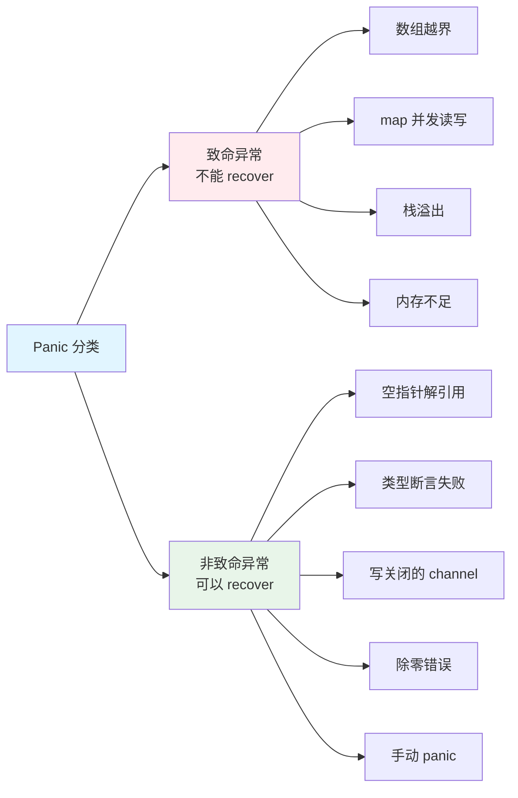
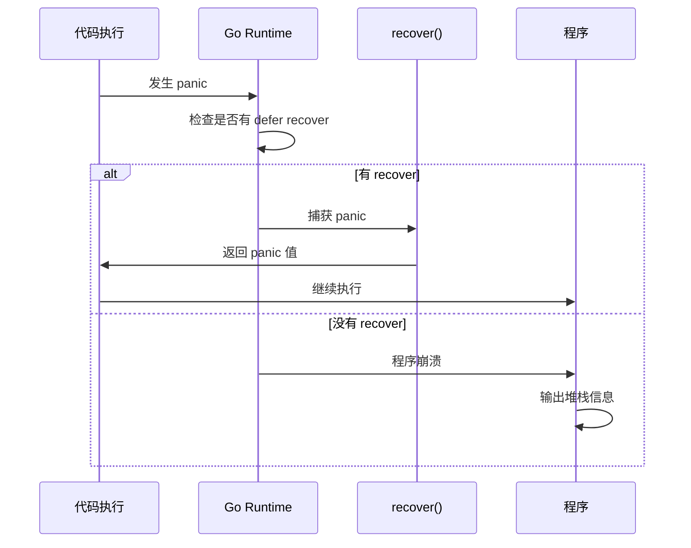
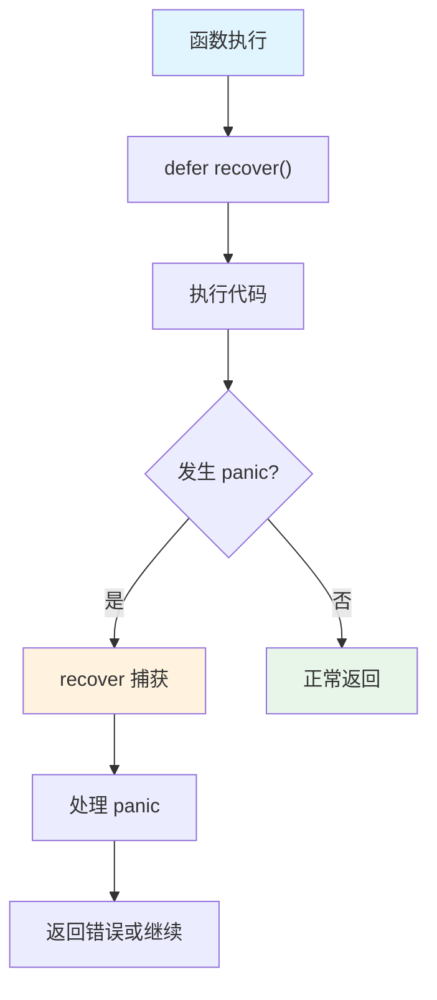
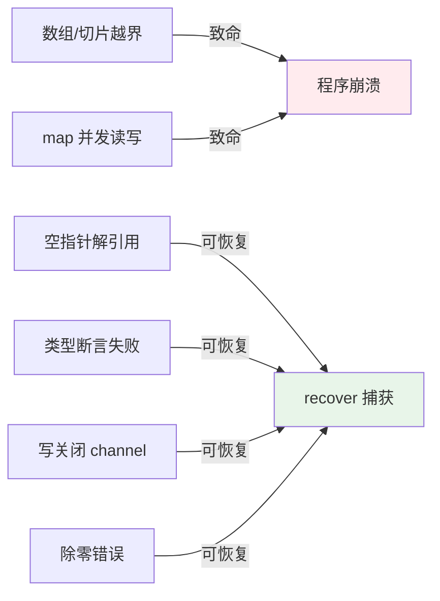

# Golang 常见 Panic 详解

Go 语言中的 panic 是一种异常机制，用于处理程序无法继续执行的错误情况。本文详细介绍常见的 panic 场景、原因和解决方案。

## Panic 分类



## Panic 处理流程



# 致命异常

致命异常指的是 Go 运行时（runtime）直接 throw 的异常，这种异常**不能使用 recover 捕获**，程序会直接崩溃。

## 数组越界

### Panic 原因

访问数组或切片时，索引超出有效范围。

### 示例代码

```go
package main

import "fmt"

func main() {
    // 示例 1: 数组越界
    arr := [3]int{1, 2, 3}
    fmt.Println(arr[3]) // panic: runtime error: index out of range [3] with length 3
    
    // 示例 2: 切片越界
    slice := []int{1, 2, 3}
    fmt.Println(slice[5]) // panic: runtime error: index out of range [5] with length 3
    
    // 示例 3: 字符串索引越界
    str := "hello"
    fmt.Println(str[10]) // panic: runtime error: index out of range [10] with length 5
}
```

### 错误信息

```text
panic: runtime error: index out of range [3] with length 3

goroutine 1 [running]:
main.main()
    /path/to/file.go:8 +0x1a
```

### 如何避免

```go
package main

import "fmt"

func safeAccess(arr []int, index int) (int, error) {
    if index < 0 || index >= len(arr) {
        return 0, fmt.Errorf("index %d out of range [0:%d]", index, len(arr))
    }
    return arr[index], nil
}

func main() {
    arr := []int{1, 2, 3}
    
    // 安全访问
    if val, err := safeAccess(arr, 3); err != nil {
        fmt.Println("错误:", err)
    } else {
        fmt.Println("值:", val)
    }
}
```

## Map 并发读写

### Panic 原因

多个 goroutine 同时对 map 进行读写操作，Go 的 map 不是并发安全的。

### 示例代码

```go
package main

import (
    "sync"
    "time"
)

func main() {
    m := make(map[int]int)
    
    // 并发写入
    go func() {
        for i := 0; i < 1000; i++ {
            m[i] = i // 可能 panic: concurrent map writes
        }
    }()
    
    go func() {
        for i := 0; i < 1000; i++ {
            m[i] = i * 2 // 可能 panic: concurrent map writes
        }
    }()
    
    // 并发读取
    go func() {
        for i := 0; i < 1000; i++ {
            _ = m[i] // 可能 panic: concurrent map iteration and map write
        }
    }()
    
    time.Sleep(1 * time.Second)
}
```

### 错误信息

```text
fatal error: concurrent map writes

goroutine 18 [running]:
runtime.throw(0x10a8b5e, 0x15)
    /usr/local/go/src/runtime/panic.go:774 +0x72 fp=0xc00002e758 sp=0xc00002e728 pc=0x1028d92
runtime.mapassign_fast64(0x109a1e0, 0xc000088180, 0x0, 0x0)
    /usr/local/go/src/runtime/map_fast64.go:101 +0x1f5 fp=0xc00002e798 sp=0xc00002e758 pc=0x100f5b5
```

### 解决方案

#### 方案 1: 使用 sync.Mutex

```go
package main

import (
    "sync"
    "time"
)

type SafeMap struct {
    mu sync.RWMutex
    m  map[int]int
}

func NewSafeMap() *SafeMap {
    return &SafeMap{
        m: make(map[int]int),
    }
}

func (sm *SafeMap) Set(key, value int) {
    sm.mu.Lock()
    defer sm.mu.Unlock()
    sm.m[key] = value
}

func (sm *SafeMap) Get(key int) (int, bool) {
    sm.mu.RLock()
    defer sm.mu.RUnlock()
    val, ok := sm.m[key]
    return val, ok
}

func main() {
    sm := NewSafeMap()
    
    // 并发安全写入
    var wg sync.WaitGroup
    for i := 0; i < 10; i++ {
        wg.Add(1)
        go func(id int) {
            defer wg.Done()
            for j := 0; j < 100; j++ {
                sm.Set(id*100+j, j)
            }
        }(i)
    }
    wg.Wait()
}
```

#### 方案 2: 使用 sync.Map

```go
package main

import (
    "sync"
    "time"
)

func main() {
    var m sync.Map
    
    // 并发安全操作
    go func() {
        for i := 0; i < 1000; i++ {
            m.Store(i, i)
        }
    }()
    
    go func() {
        for i := 0; i < 1000; i++ {
            m.Store(i, i*2)
        }
    }()
    
    go func() {
        for i := 0; i < 1000; i++ {
            m.Load(i)
        }
    }()
    
    time.Sleep(1 * time.Second)
}
```

### 检测并发读写

使用 `go run -race` 或 `go test -race` 可以检测并发问题：

```bash
go run -race main.go
```

# 非致命异常

非致命异常指的是 Go 运行时或者代码层级调用 `panic` 函数产生的异常，这种异常**能够使用 recover 捕获**。

## 空指针解引用

### Panic 原因

对 nil 指针进行解引用操作（访问字段或调用方法）。

### 示例代码

```go
package main

import "fmt"

type Person struct {
    Name string
    Age  int
}

func main() {
    var p *Person
    
    // panic: runtime error: invalid memory address or nil pointer dereference
    fmt.Println(p.Name) // 空指针解引用
    
    // panic: runtime error: invalid memory address or nil pointer dereference
    p.SayHello() // 调用 nil 指针的方法
}

func (p *Person) SayHello() {
    fmt.Printf("Hello, I'm %s\n", p.Name)
}
```

### 错误信息

```text
panic: runtime error: invalid memory address or nil pointer dereference
[signal SIGSEGV: segmentation violation code=0x1 addr=0x0 pc=0x10a8b5e]

goroutine 1 [running]:
main.main()
    /path/to/file.go:12 +0x1a
```

### 解决方案

```go
package main

import "fmt"

func safeAccess(p *Person) {
    if p == nil {
        fmt.Println("Person 指针为 nil")
        return
    }
    fmt.Println("Name:", p.Name)
}

func main() {
    var p *Person
    safeAccess(p) // 安全访问
    
    // 或者使用 defer recover
    defer func() {
        if r := recover(); r != nil {
            fmt.Println("捕获到 panic:", r)
        }
    }()
    
    fmt.Println(p.Name) // 会被 recover 捕获
}
```

## 类型断言失败

### Panic 原因

使用类型断言时，如果断言失败且没有使用 `ok` 接收返回值，会触发 panic。

### 示例代码

```go
package main

import "fmt"

func main() {
    var i interface{} = "hello"
    
    // 方式 1: 不使用 ok，失败会 panic
    s := i.(int) // panic: interface conversion: interface {} is string, not int
    
    // 方式 2: 使用 ok，安全
    if s, ok := i.(int); ok {
        fmt.Println("是 int 类型:", s)
    } else {
        fmt.Println("不是 int 类型")
    }
    
    // 方式 3: 类型 switch
    switch v := i.(type) {
    case int:
        fmt.Println("是 int:", v)
    case string:
        fmt.Println("是 string:", v)
    default:
        fmt.Println("未知类型")
    }
}
```

### 错误信息

```text
panic: interface conversion: interface {} is string, not int

goroutine 1 [running]:
main.main()
    /path/to/file.go:8 +0x1a
```

### 安全使用

```go
package main

import "fmt"

func safeTypeAssert(i interface{}) {
    // 使用 ok 模式
    if s, ok := i.(string); ok {
        fmt.Println("是 string:", s)
    } else {
        fmt.Println("不是 string 类型")
    }
    
    // 使用类型 switch
    switch v := i.(type) {
    case string:
        fmt.Println("string:", v)
    case int:
        fmt.Println("int:", v)
    default:
        fmt.Println("其他类型")
    }
}
```

## 写关闭的 Channel

### Panic 原因

向已关闭的 channel 写入数据会触发 panic。

### 示例代码

```go
package main

import "time"

func main() {
    ch := make(chan int, 1)
    
    // 关闭 channel
    close(ch)
    
    // panic: send on closed channel
    ch <- 1 // 向已关闭的 channel 写入
}
```

### 错误信息

```text
panic: send on closed channel

goroutine 1 [running]:
main.main()
    /path/to/file.go:10 +0x1a
```

### 解决方案

```go
package main

import (
    "fmt"
    "sync"
)

func safeChannelWrite(ch chan int, value int) error {
    defer func() {
        if r := recover(); r != nil {
            fmt.Println("捕获到 panic:", r)
        }
    }()
    
    select {
    case ch <- value:
        return nil
    default:
        return fmt.Errorf("channel 已满或已关闭")
    }
}

func main() {
    ch := make(chan int, 1)
    close(ch)
    
    // 安全写入
    if err := safeChannelWrite(ch, 1); err != nil {
        fmt.Println("错误:", err)
    }
}
```

### 最佳实践

```go
package main

import (
    "context"
    "fmt"
    "time"
)

func producer(ctx context.Context, ch chan<- int) {
    defer close(ch) // 确保关闭 channel
    
    for i := 0; i < 10; i++ {
        select {
        case <-ctx.Done():
            return
        case ch <- i:
            fmt.Printf("发送: %d\n", i)
        }
    }
}

func consumer(ch <-chan int) {
    for val := range ch {
        fmt.Printf("接收: %d\n", val)
    }
}

func main() {
    ch := make(chan int, 5)
    ctx, cancel := context.WithTimeout(context.Background(), 2*time.Second)
    defer cancel()
    
    go producer(ctx, ch)
    consumer(ch)
}
```

## 除零错误

### Panic 原因

整数除以零会触发 panic。

### 示例代码

```go
package main

import "fmt"

func main() {
    a, b := 10, 0
    
    // panic: runtime error: integer divide by zero
    result := a / b
    fmt.Println(result)
}
```

### 错误信息

```text
panic: runtime error: integer divide by zero

goroutine 1 [running]:
main.main()
    /path/to/file.go:8 +0x1a
```

### 解决方案

```go
package main

import (
    "errors"
    "fmt"
)

func safeDivide(a, b int) (int, error) {
    if b == 0 {
        return 0, errors.New("除数不能为零")
    }
    return a / b, nil
}

func main() {
    result, err := safeDivide(10, 0)
    if err != nil {
        fmt.Println("错误:", err)
    } else {
        fmt.Println("结果:", result)
    }
}
```

## 手动 Panic

### 使用场景

代码中主动调用 `panic()` 函数，通常用于处理不应该发生的错误情况。

### 示例代码

```go
package main

import "fmt"

func processUser(userID int) {
    if userID <= 0 {
        panic("用户 ID 必须大于 0")
    }
    fmt.Printf("处理用户 %d\n", userID)
}

func main() {
    defer func() {
        if r := recover(); r != nil {
            fmt.Printf("捕获到 panic: %v\n", r)
        }
    }()
    
    processUser(0) // 触发 panic
    fmt.Println("这行不会执行")
}
```

### 最佳实践

```go
package main

import (
    "errors"
    "fmt"
)

// 推荐：返回错误而不是 panic
func processUserSafe(userID int) error {
    if userID <= 0 {
        return errors.New("用户 ID 必须大于 0")
    }
    fmt.Printf("处理用户 %d\n", userID)
    return nil
}

// 仅在无法恢复的情况下使用 panic
func mustProcessUser(userID int) {
    if userID <= 0 {
        panic(fmt.Sprintf("无效的用户 ID: %d", userID))
    }
    // 处理逻辑
}

func main() {
    // 方式 1: 返回错误（推荐）
    if err := processUserSafe(0); err != nil {
        fmt.Println("错误:", err)
    }
    
    // 方式 2: 使用 panic + recover
    defer func() {
        if r := recover(); r != nil {
            fmt.Println("恢复:", r)
        }
    }()
    mustProcessUser(0)
}
```

# Panic 和 Recover 机制

## Recover 使用



## 完整示例

```go
package main

import (
    "fmt"
    "runtime"
)

func safeOperation() (err error) {
    defer func() {
        if r := recover(); r != nil {
            // 获取 panic 信息
            err = fmt.Errorf("panic recovered: %v", r)
            
            // 打印堆栈信息
            buf := make([]byte, 4096)
            n := runtime.Stack(buf, false)
            fmt.Printf("堆栈信息:\n%s\n", buf[:n])
        }
    }()
    
    // 可能触发 panic 的操作
    arr := []int{1, 2, 3}
    fmt.Println(arr[10]) // 数组越界
    
    return nil
}

func main() {
    if err := safeOperation(); err != nil {
        fmt.Println("操作失败:", err)
    } else {
        fmt.Println("操作成功")
    }
}
```

## Recover 注意事项

1. **必须在 defer 中调用**: recover 只能在 defer 函数中生效
2. **只能捕获当前 goroutine**: recover 不能捕获其他 goroutine 的 panic
3. **调用栈限制**: recover 只能捕获当前函数及其调用栈中的 panic

### 错误示例

```go
// ❌ 错误：recover 不在 defer 中
func wrong() {
    if r := recover(); r != nil { // 无效
        fmt.Println(r)
    }
    panic("test")
}

// ✅ 正确：recover 在 defer 中
func correct() {
    defer func() {
        if r := recover(); r != nil { // 有效
            fmt.Println(r)
        }
    }()
    panic("test")
}
```

# 常见 Panic 场景总结

## 场景对比



## 预防措施

### 1. 数组/切片访问

```go
// ✅ 使用边界检查
if index >= 0 && index < len(arr) {
    val = arr[index]
}

// ✅ 使用 range 遍历
for i, v := range arr {
    // 安全访问
}
```

### 2. Map 并发安全

```go
// ✅ 使用 sync.Mutex
var mu sync.RWMutex
mu.Lock()
m[key] = value
mu.Unlock()

// ✅ 使用 sync.Map
var m sync.Map
m.Store(key, value)
```

### 3. 指针使用

```go
// ✅ 检查 nil
if p != nil {
    p.DoSomething()
}

// ✅ 使用 defer recover
defer func() {
    if r := recover(); r != nil {
        // 处理
    }
}()
```

### 4. 类型断言

```go
// ✅ 使用 ok 模式
if val, ok := i.(Type); ok {
    // 使用 val
}

// ✅ 使用类型 switch
switch v := i.(type) {
case Type:
    // 使用 v
}
```

### 5. Channel 操作

```go
// ✅ 检查 channel 状态
select {
case ch <- value:
    // 成功
default:
    // channel 已满或关闭
}

// ✅ 使用 context 控制
ctx, cancel := context.WithCancel(context.Background())
defer cancel()
```

# 调试技巧

## 1. 获取堆栈信息

```go
package main

import (
    "fmt"
    "runtime"
)

func printStack() {
    buf := make([]byte, 4096)
    n := runtime.Stack(buf, true)
    fmt.Printf("堆栈信息:\n%s\n", buf[:n])
}

func main() {
    defer func() {
        if r := recover(); r != nil {
            fmt.Println("Panic:", r)
            printStack()
        }
    }()
    
    panic("测试 panic")
}
```

## 2. 使用 race detector

```bash
# 检测并发问题
go run -race main.go
go test -race ./...
```

## 3. 使用 pprof 分析

```go
import _ "net/http/pprof"

func main() {
    go func() {
        log.Println(http.ListenAndServe("localhost:6060", nil))
    }()
    // 你的代码
}
```

# 总结

## 关键要点

1. **致命异常**: 数组越界、map 并发读写等，无法 recover
2. **非致命异常**: 空指针、类型断言等，可以 recover
3. **预防为主**: 通过边界检查、nil 检查等方式预防 panic
4. **合理使用**: panic 应该用于无法恢复的错误，一般情况返回 error

## 最佳实践

- ✅ **优先返回 error**: 使用 error 处理可预期的错误
- ✅ **边界检查**: 访问数组、切片前检查索引
- ✅ **nil 检查**: 使用指针前检查是否为 nil
- ✅ **并发安全**: 使用 sync.Mutex 或 sync.Map 保护共享资源
- ✅ **defer recover**: 在需要的地方使用 defer recover 捕获 panic
- ✅ **避免 panic**: 尽量使用 error 而不是 panic

理解这些常见的 panic 场景，可以帮助我们编写更健壮的 Go 程序！
