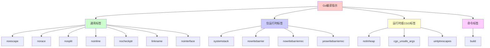
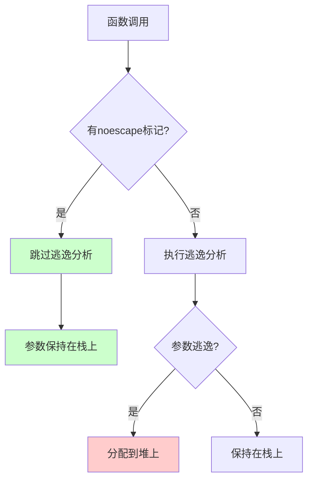
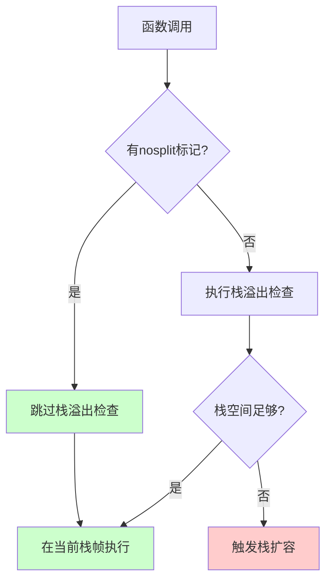
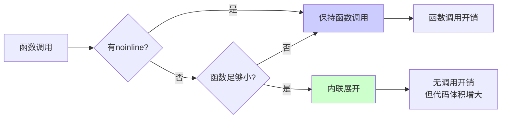
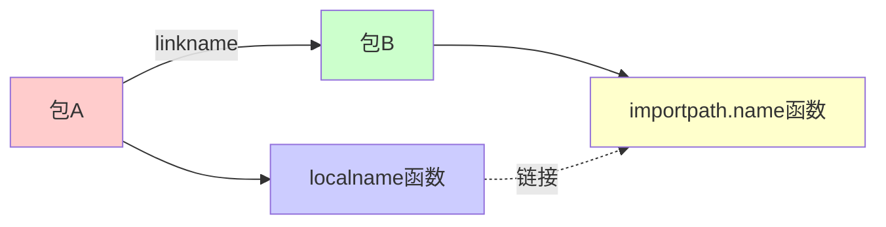
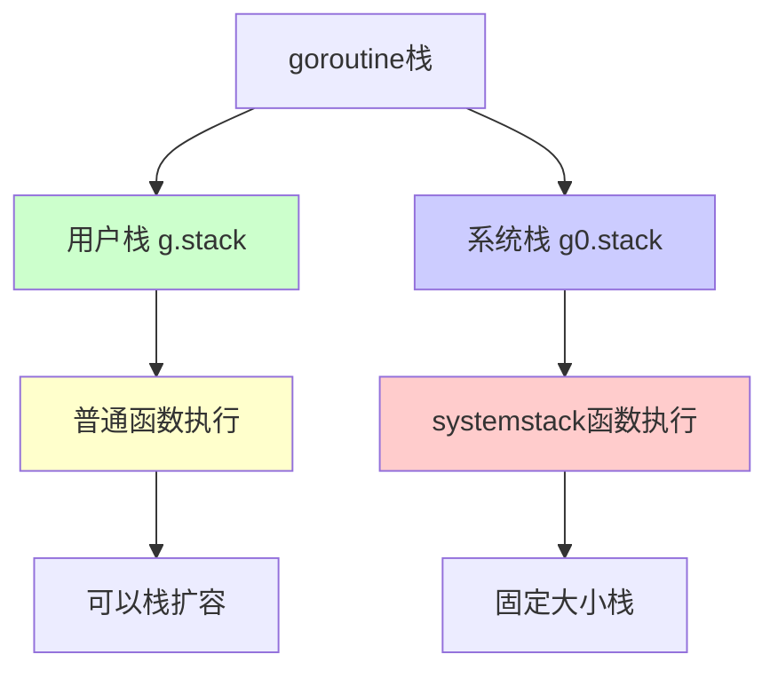
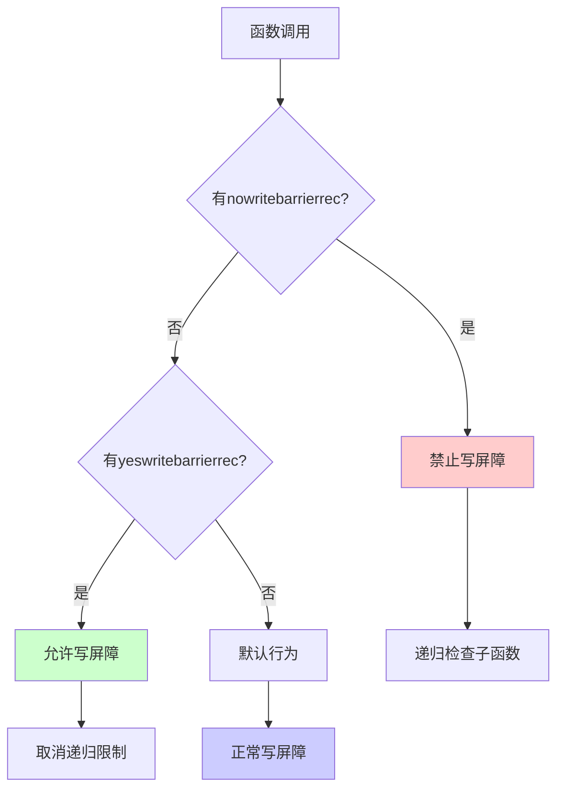
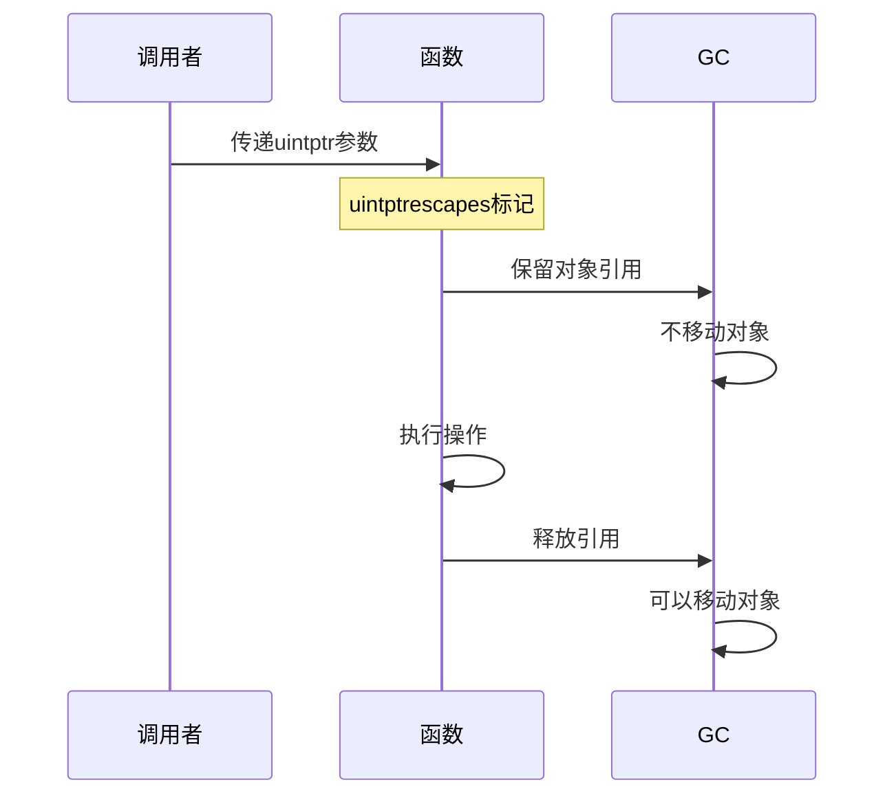
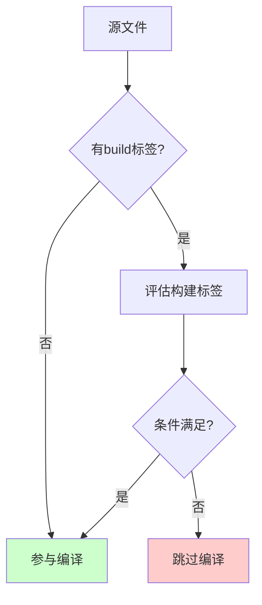
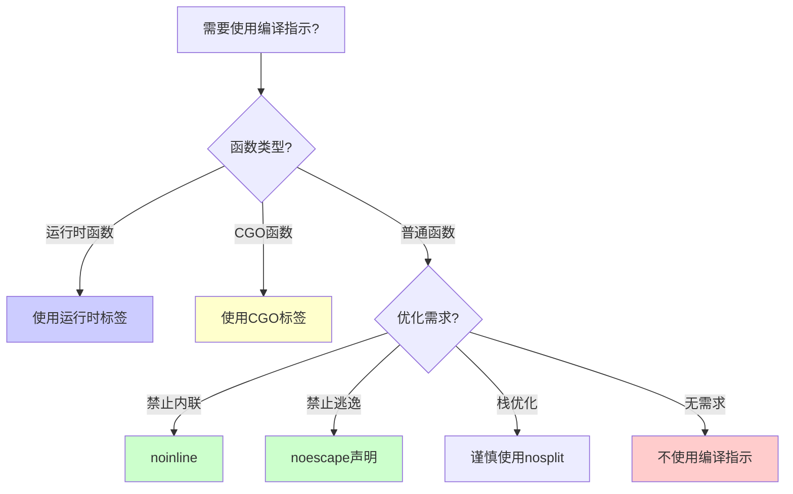

# 编译指示概述

编译指示（Compiler Directives）是 Go 语言提供的一种在编译时指导编译器行为的机制。通过在函数或类型声明前添加 `//go:` 开头的注释，可以控制编译器的优化、代码生成和运行时行为。

## 基本语法

```go
//go:directive_name
func functionName() {
    // 函数体
}
```

**重要规则**：
- 编译指示必须紧邻函数或类型声明之前
- 只能有一个空行分隔
- 必须以 `//go:` 开头
- 大小写敏感

## 编译指示分类



## 编译器源码中的定义

```go
// cmd/compile/internal/gc/lex.go

const (
	// Func pragmas.
	Nointerface    PragmaFlag = 1 << iota
	Noescape                  // func parameters don't escape
	Norace                    // func must not have race detector annotations
	Nosplit                   // func should not execute on separate stack
	Noinline                  // func should not be inlined
	NoCheckPtr                // func should not be instrumented by checkptr
	CgoUnsafeArgs             // treat a pointer to one arg as a pointer to them all
	UintptrEscapes            // pointers converted to uintptr escape

	// Runtime-only func pragmas.
	// See ../../../../runtime/README.md for detailed descriptions.
	Systemstack        // func must run on system stack
	Nowritebarrier     // emit compiler error instead of write barrier
	Nowritebarrierrec  // error on write barrier in this or recursive callees
	Yeswritebarrierrec // cancels Nowritebarrierrec in this function and callees

	// Runtime and cgo type pragmas
	NotInHeap // values of this type must not be heap allocated

	// Go command pragmas
	GoBuildPragma
)
```

# 通用标签

## noescape

`//go:noescape` 告诉编译器函数的参数不会逃逸到堆上，只能用于**只有声明没有实现**的函数（通常是汇编实现或外部函数）。

### 作用

- 禁止参数逃逸分析
- 优化函数调用性能
- 只能用于函数声明，不能用于函数实现

### 使用场景

- 原子操作函数
- 底层系统调用封装
- 性能关键的函数声明

### 示例

```go
//go:noescape
func Xadd(ptr *uint32, delta int32) uint32

// 错误示例：不能用于有实现的函数
//go:noescape
func Add(a, b int) int {
    return a + b  // ❌ 编译错误：noescape 只能用于声明
}
```

### 工作原理



## norace

`//go:norace` 告诉编译器跳过该函数的竞态检测（race detector）检查。

### 作用

- 禁用竞态检测器对该函数的检查
- 减少运行时开销
- 用于确定无竞态条件的函数

### 使用场景

- 信号处理函数
- 在特殊栈上运行的函数（如 g0 栈）
- 确定无并发访问的函数

### 示例

```go
//go:norace
func badsignal(sig uintptr, c *sigctxt) {
    // 处理错误信号
    // 在没有 m 或 g 的外部堆栈上运行，所以没有竞争
}

//go:norace
func signalM(mp *m, sig int) {
    // 向 M 发送信号，确定无竞态
}
```

### 注意事项

- 必须确保函数确实无竞态条件
- 错误使用可能导致难以发现的并发 bug
- 主要用于运行时内部函数

## nosplit

`//go:nosplit` 告诉编译器该函数不应该进行栈溢出检查，函数必须在当前栈帧中执行，不能切换到更大的栈。

### 作用

- 禁用栈溢出检查
- 函数必须在当前栈上执行
- 隐含 `nocheckptr`

### 使用场景

- 在 g0 栈上执行的函数
- 栈溢出检查函数本身
- 需要精确控制栈使用的底层函数

### 示例

```go
//go:nosplit
func newproc(siz int32, fn *funcval) {
    // 创建新 goroutine
    // 在 g0 栈上执行，不需要栈溢出检测
}

//go:nosplit
func stackcheck() {
    // 栈检查函数本身不能进行栈检查
}
```

### 工作原理



### 注意事项

- 函数必须确保不会导致栈溢出
- 主要用于运行时和底层系统函数
- 错误使用可能导致栈溢出崩溃

## noinline

`//go:noinline` 告诉编译器不要内联该函数，即使它很小。

### 作用

- 禁止函数内联优化
- 保持函数调用边界
- 用于调试和性能分析

### 使用场景

- 需要保持函数调用栈的函数
- 调试时需要看到函数边界
- 性能分析时需要精确的函数调用信息
- 原子操作函数（需要精确的调用语义）

### 示例

```go
//go:noinline
func Load(ptr *uint32) uint32 {
    return *ptr
}

//go:noinline
func debugFunc() {
    // 调试函数，需要看到调用栈
}

// 对比：没有 noinline 的函数可能被内联
func Add(a, b int) int {
    return a + b  // 可能被内联
}
```

### 内联 vs 非内联



## nocheckptr

`//go:nocheckptr` 告诉编译器跳过该函数的指针检查（checkptr 检测）。

### 作用

- 禁用 `-d=checkptr` 检查
- 用于需要不安全指针操作的函数
- `nosplit` 隐含 `nocheckptr`

### 使用场景

- 使用 `unsafe.Pointer` 的函数
- 需要绕过指针检查的底层操作
- 确定安全的指针操作

### 示例

```go
//go:nocheckptr
func unsafePointerOperation(ptr unsafe.Pointer) {
    // 不安全的指针操作
    // 确定是安全的，跳过检查
}

//go:nosplit  // 隐含 nocheckptr
func runtimeFunction() {
    // ...
}
```

## linkname

`//go:linkname` 用于链接两个函数，允许将包内的未导出函数链接到另一个包的函数。

### 作用

- 创建函数之间的链接
- 允许访问未导出的函数
- 需要导入 `unsafe` 包

### 语法

```go
//go:linkname localname importpath.name
```

### 使用场景

- 运行时内部函数链接
- 跨包的函数链接
- 访问标准库未导出函数

### 示例

```go
import _ "unsafe" // for go:linkname

//go:linkname time_now time.now
func time_now() (sec int64, nsec int32, mono int64) {
    sec, nsec = walltime()
    return sec, nsec, nanotime()
}

// 将 runtime/timestub.go 的 time_now() 链接到 time/time.go 的 time.now()
```

### 工作原理



### 注意事项

- 需要导入 `unsafe` 包
- 函数签名必须匹配
- 主要用于标准库内部
- 使用不当可能导致链接错误

## nointerface

`//go:nointerface` 告诉编译器该类型不应该实现接口（仅在启用字段跟踪时有效）。

### 作用

- 禁止类型实现接口
- 仅在 `-fieldtrack` 启用时有效
- 用于防止意外的接口实现

### 使用场景

- 需要明确禁止接口实现的类型
- 字段跟踪场景

### 示例

```go
//go:nointerface
type InternalType struct {
    // 不应该实现接口
}
```

# 仅运行时可用标签

这些标签主要用于 Go 运行时内部，普通代码不应使用。

## systemstack

`//go:systemstack` 表示函数必须在系统栈（g0 栈）上运行。

### 作用

- 强制函数在系统栈上执行
- 必须通过 `systemstack()` 调用
- 用于需要系统栈的运行时函数

### 使用场景

- 创建新 goroutine
- 需要系统栈的运行时操作
- 栈切换相关的函数

### 示例

```go
// 调用方式
systemstack(func() {
    newg := newproc1(fn, argp, siz, gp, pc) // 创建新g
})

//go:systemstack
func newproc1(fn *funcval, argp unsafe.Pointer, narg int32, callergp *g, callerpc uintptr) *g {
    // 必须在系统栈上运行
    // ...
}
```

### 系统栈 vs 用户栈



### 注意事项

- 只能通过 `systemstack()` 调用
- 函数不能直接调用
- 主要用于运行时内部

## nowritebarrier

`//go:nowritebarrier` 告诉编译器如果该函数中有写屏障，应该报错而不是插入写屏障。

### 作用

- 禁止写屏障
- 用于不能有写屏障的函数
- 编译器会检查并报错

### 使用场景

- GC 相关的函数
- 在特定阶段不能有写屏障的函数
- 运行时内部函数

### 示例

```go
//go:nowritebarrier
func gcFunction() {
    // 不能有写屏障
    // 编译器会检查并报错
}
```

## nowritebarrierrec

`//go:nowritebarrierrec` 表示该函数及其递归调用的函数中都不能有写屏障。

### 作用

- 禁止函数及其递归调用中的写屏障
- 隐含 `nowritebarrier`
- 编译器会递归检查

### 使用场景

- 需要在整个调用链中禁止写屏障的函数
- GC 相关函数

### 示例

```go
//go:nowritebarrierrec
func gcMarkFunction() {
    // 该函数及其调用的函数都不能有写屏障
    helperFunction()  // 也不能有写屏障
}
```

## yeswritebarrierrec

`//go:yeswritebarrierrec` 取消 `nowritebarrierrec` 的限制，允许该函数及其调用链中有写屏障。

### 作用

- 取消 `nowritebarrierrec` 限制
- 允许写屏障
- 用于在受限调用链中恢复写屏障

### 使用场景

- 在 `nowritebarrierrec` 调用链中需要写屏障的函数
- 恢复写屏障能力

### 示例

```go
//go:nowritebarrierrec
func parentFunction() {
    // 不能有写屏障
    childFunction()  // 调用子函数
}

//go:yeswritebarrierrec
func childFunction() {
    // 取消限制，可以有写屏障
    // 执行需要写屏障的操作
}
```

### 写屏障控制流程



# 运行时或 CGO 标签

## notinheap

`//go:notinheap` 表示该类型的值不能分配在堆上，只能分配在栈上或全局变量区域。

### 作用

- 禁止堆分配
- 类型值不在 GC 管理范围内
- 用于运行时内部数据结构

### 使用场景

- 运行时内部数据结构（如 mcache, mspan）
- 不在 GC 管理范围内的类型
- 需要精确内存管理的类型

### 示例

```go
//go:notinheap
type mcache struct {
    // mcache 不是由 GC 内存分配的
    // 需要标记为 notinheap
    nextSample uintptr
    local_scan uintptr
    // ...
}

//go:notinheap
type mspan struct {
    // mspan 也不在堆上分配
    // ...
}
```

### 内存分配位置


### 注意事项

- 不能作为接口值
- 不能作为 channel 元素类型
- 主要用于运行时内部

## cgo_unsafe_args

`//go:cgo_unsafe_args` 告诉 CGO 将指向一个参数的指针视为指向所有参数的指针。

### 作用

- CGO 参数处理优化
- 隐含 `nocheckptr`
- 用于 CGO 函数调用

### 使用场景

- CGO 函数调用
- 需要优化 CGO 参数传递

### 示例

```go
//go:cgo_unsafe_args
func cgoFunction(ptr *C.int) {
    // CGO 函数
    // 参数处理优化
}
```

## uintptrescapes

`//go:uintptrescapes` 表示下一个声明的函数中，任何 `uintptr` 参数可能是由指针转换而来的，需要保留引用的对象直到调用完成。

### 作用

- 保留 uintptr 引用的对象
- 防止 GC 移动对象
- 用于系统调用

### 使用场景

- Windows 系统调用
- 需要将指针转换为 uintptr 的场景
- DLL 调用

### 示例

```go
//go:uintptrescapes
func syscallFunction(ptr uintptr) {
    // ptr 可能是由指针转换而来的
    // 需要保留引用的对象直到调用完成
    // 用于 syscall/dll_windows.go
}
```

### 工作原理



# 命令标签

## build

`//go:build` 是构建约束（build constraint），用于控制文件是否参与编译。

### 语法

```go
//go:build tags
```

### 构建标签

- **操作系统**：`linux`, `windows`, `darwin`, `freebsd` 等
- **架构**：`amd64`, `arm64`, `386` 等
- **编译器**：`gc`, `gccgo`
- **其他**：`cgo`, `race`, `msan` 等

### 逻辑运算符

- `&&`：与
- `||`：或
- `!`：非
- `,`：与（同 `&&`）

### 示例

```go
//go:build linux && amd64
// 只在 Linux amd64 平台编译

package main

//go:build windows || darwin
// Windows 或 macOS 平台

//go:build !cgo
// 不使用 CGO 时编译

//go:build go1.18
// Go 1.18 及以上版本

//go:build (linux && 386) || (windows && amd64)
// Linux 386 或 Windows amd64
```

### 对比：旧式构建标签

```go
// +build linux,amd64  // 旧式（仍支持但不推荐）

//go:build linux && amd64  // 新式（推荐）
```

### 构建约束流程



### 常见构建标签组合

| 标签 | 说明 |
|------|------|
| `//go:build linux` | Linux 系统 |
| `//go:build windows` | Windows 系统 |
| `//go:build darwin` | macOS 系统 |
| `//go:build amd64` | AMD64 架构 |
| `//go:build arm64` | ARM64 架构 |
| `//go:build cgo` | 启用 CGO |
| `//go:build !cgo` | 禁用 CGO |
| `//go:build race` | 启用竞态检测 |
| `//go:build go1.18` | Go 1.18+ |
| `//go:build linux && amd64` | Linux AMD64 |
| `//go:build windows \|\| darwin` | Windows 或 macOS |

### 使用场景

- 平台特定代码
- 条件编译
- 功能开关
- 版本兼容

# 编译指示使用指南

## 选择原则



## 最佳实践

### 1. 谨慎使用

- 大多数情况下不需要编译指示
- 只在确实需要时使用
- 理解每个指示的含义和影响

### 2. 文档说明

```go
//go:noinline
// 禁止内联以保持函数调用栈，用于性能分析
func debugFunction() {
    // ...
}
```

### 3. 测试验证

- 使用编译指示后要测试
- 验证性能影响
- 确保功能正确性

### 4. 避免滥用

```go
// ❌ 错误：不必要的 noinline
//go:noinline
func simpleAdd(a, b int) int {
    return a + b
}

// ✅ 正确：让编译器决定
func simpleAdd(a, b int) int {
    return a + b
}
```

## 常见错误

### 1. noescape 用于有实现的函数

```go
// ❌ 错误
//go:noescape
func add(a, b int) int {
    return a + b  // 编译错误
}

// ✅ 正确：只能用于声明
//go:noescape
func add(a, b int) int
```

### 2. 误用运行时标签

```go
// ❌ 错误：普通代码不应使用
//go:systemstack
func myFunction() {
    // 普通代码不能使用 systemstack
}

// ✅ 正确：只在运行时内部使用
```

### 3. 构建标签语法错误

```go
// ❌ 错误：旧式语法
// +build linux amd64

// ✅ 正确：新式语法
//go:build linux && amd64
```

## 性能影响

| 编译指示 | 性能影响 | 使用场景 |
|---------|---------|---------|
| `noinline` | 可能降低性能（增加调用开销） | 调试、性能分析 |
| `noescape` | 可能提升性能（减少堆分配） | 底层函数声明 |
| `nosplit` | 可能提升性能（减少栈检查） | 运行时函数 |
| `norace` | 减少运行时开销 | 确定无竞态的函数 |

# 总结

Go 编译指示提供了细粒度的编译器控制能力，但应该谨慎使用：

## 关键要点

1. **通用标签**：可用于普通代码，但需谨慎
   - `noescape`：只能用于函数声明
   - `noinline`：用于调试和性能分析
   - `nosplit`：主要用于运行时函数
   - `norace`：确保无竞态条件

2. **运行时标签**：仅用于运行时内部
   - `systemstack`：系统栈执行
   - `nowritebarrier*`：写屏障控制

3. **构建标签**：条件编译
   - `//go:build`：控制文件编译

4. **最佳实践**：
   - 理解每个指示的含义
   - 只在必要时使用
   - 添加文档说明
   - 测试验证效果

## 使用建议

- **普通开发**：通常不需要编译指示
- **性能优化**：在性能分析后谨慎使用
- **运行时开发**：理解运行时标签的含义
- **跨平台**：使用构建标签处理平台差异

编译指示是强大的工具，但需要深入理解其影响才能正确使用。
