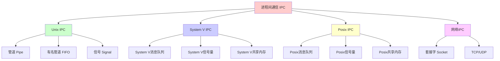
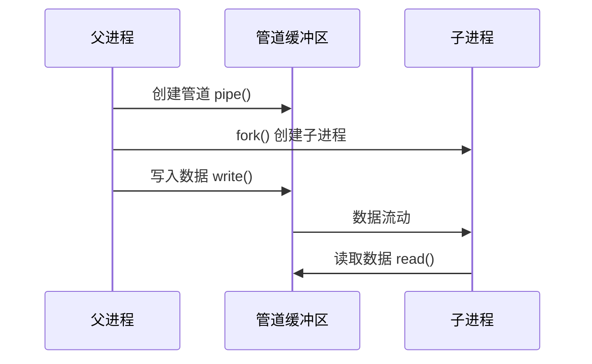
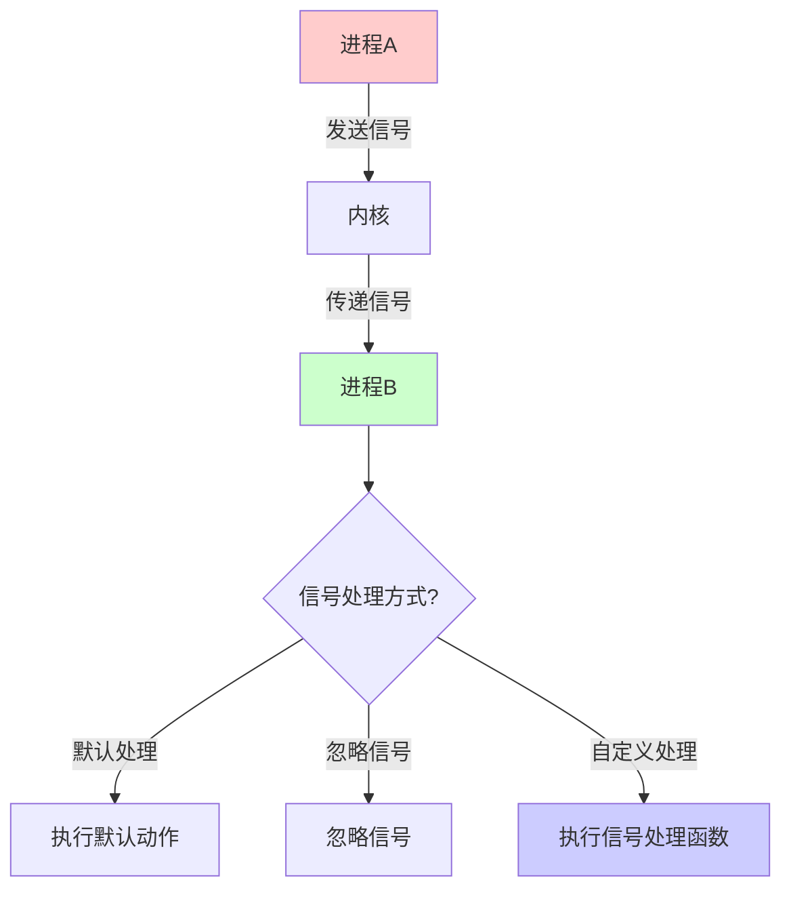
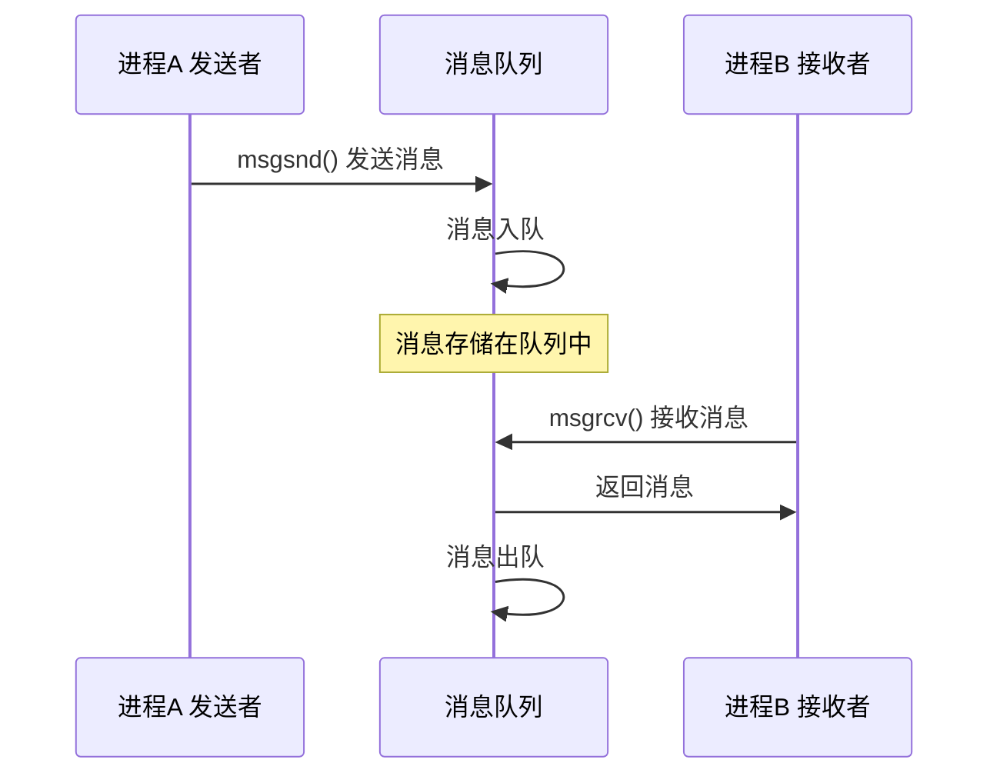
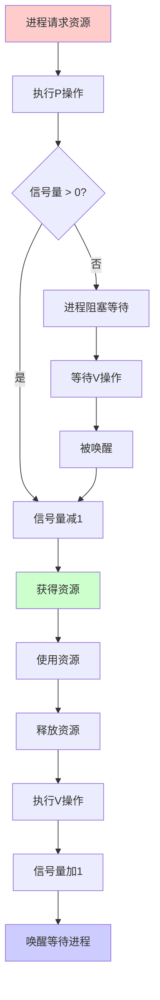
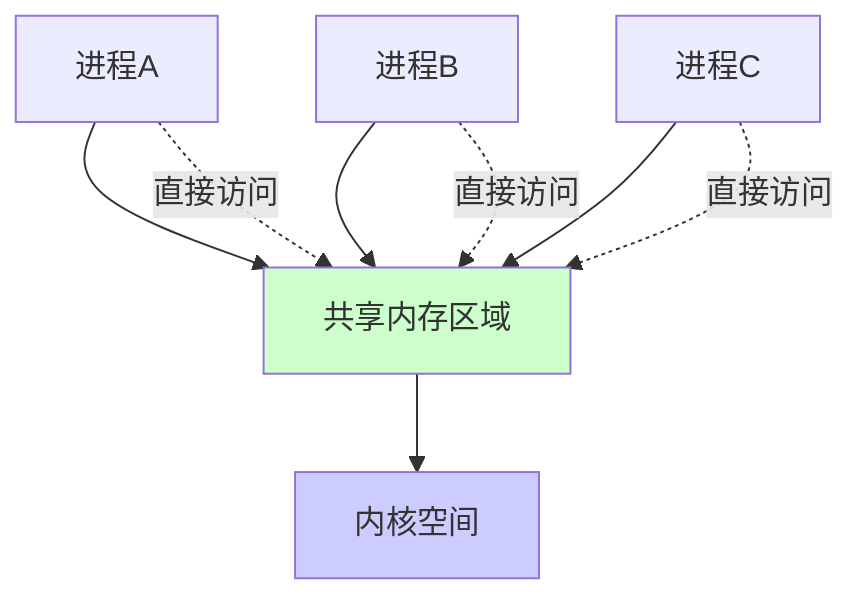
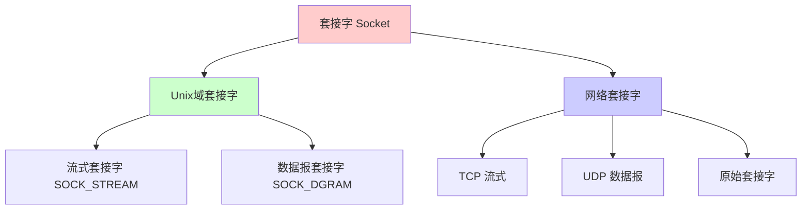
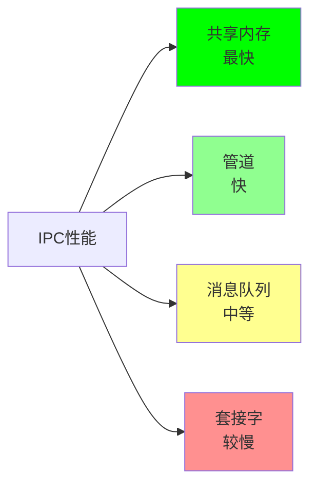
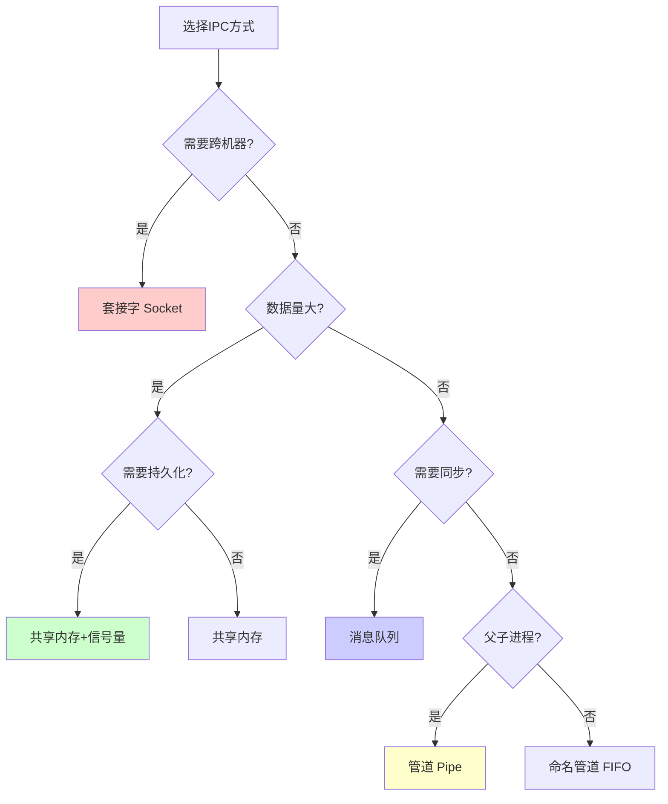

# 简介

进程间通信（IPC，Inter-Process Communication）指至少两个进程或线程间传送数据或信号的一些技术或方法。

## IPC 分类



## IPC 特点

- **生命周期**：IPC 的生命周期都与内核相同，除非显式删除
- **权限控制**：大多数 IPC 机制都支持权限控制
- **性能差异**：不同 IPC 方式的性能差异很大

## IPC 性能对比

| IPC 方式 | 速度 | 容量 | 持久性 | 适用场景 |
|---------|------|------|--------|---------|
| 管道 | 快 | 小 | 无 | 父子进程通信 |
| 消息队列 | 中 | 中 | 有 | 进程间消息传递 |
| 共享内存 | 最快 | 大 | 有 | 大数据量传输 |
| 信号量 | - | - | 有 | 同步控制 |
| 套接字 | 慢 | 大 | 无 | 网络通信 |

# 管道（Pipe）

管道（Pipe）是一种半双工的通信方式，数据只能单向流动，且只能在具有亲缘关系的进程间使用。

## 特点

- **单向通信**：数据只能在一个方向上流动
- **亲缘关系**：只能用于父子进程或兄弟进程之间
- **缓冲区限制**：管道有固定大小的缓冲区（通常 64KB）
- **阻塞读写**：当管道满时写操作阻塞，空时读操作阻塞

## 工作原理



## Go 实现示例

### 匿名管道

```go
package main

import (
    "fmt"
    "io"
    "os"
    "os/exec"
)

func main() {
    // 创建管道
    reader, writer, err := os.Pipe()
    if err != nil {
        panic(err)
    }
    
    // 创建子进程
    cmd := exec.Command("cat")
    cmd.Stdin = reader
    cmd.Stdout = os.Stdout
    
    // 启动子进程
    if err := cmd.Start(); err != nil {
        panic(err)
    }
    
    // 父进程写入数据
    go func() {
        defer writer.Close()
        for i := 0; i < 10; i++ {
            fmt.Fprintf(writer, "Message %d\n", i)
        }
    }()
    
    // 等待子进程结束
    cmd.Wait()
}
```

### 命名管道（FIFO）

```go
package main

import (
    "fmt"
    "os"
    "syscall"
)

func main() {
    fifoPath := "/tmp/myfifo"
    
    // 创建 FIFO
    err := syscall.Mkfifo(fifoPath, 0666)
    if err != nil && !os.IsExist(err) {
        panic(err)
    }
    
    // 打开 FIFO 进行写入
    file, err := os.OpenFile(fifoPath, os.O_WRONLY, os.ModeNamedPipe)
    if err != nil {
        panic(err)
    }
    defer file.Close()
    
    // 写入数据
    fmt.Fprintf(file, "Hello from FIFO\n")
}
```

## 使用场景

- 父子进程间的简单数据传递
- 命令行工具链（如 `ls | grep`）
- 进程间单向数据流

## 注意事项

- 管道是阻塞的，需要协调读写操作
- 管道缓冲区有限，不适合大数据量传输
- 命名管道需要文件系统支持

# 信号（Signal）

信号是 Unix/Linux 系统中用于进程间通信的一种机制，用于通知进程发生了某种事件。

## 常见信号

| 信号 | 值 | 说明 | 默认动作 |
|------|-----|------|---------|
| SIGHUP | 1 | 挂起信号 | 终止 |
| SIGINT | 2 | 中断信号（Ctrl+C） | 终止 |
| SIGQUIT | 3 | 退出信号 | 终止+核心转储 |
| SIGKILL | 9 | 强制终止 | 终止 |
| SIGTERM | 15 | 终止信号 | 终止 |
| SIGUSR1 | 10 | 用户自定义信号1 | 终止 |
| SIGUSR2 | 12 | 用户自定义信号2 | 终止 |

## 信号处理流程



## Go 实现示例

```go
package main

import (
    "fmt"
    "os"
    "os/signal"
    "syscall"
    "time"
)

func main() {
    // 创建信号通道
    sigChan := make(chan os.Signal, 1)
    
    // 注册要捕获的信号
    signal.Notify(sigChan, syscall.SIGINT, syscall.SIGTERM, syscall.SIGUSR1)
    
    // 启动工作 goroutine
    go func() {
        for {
            fmt.Println("Working...")
            time.Sleep(1 * time.Second)
        }
    }()
    
    // 等待信号
    sig := <-sigChan
    fmt.Printf("Received signal: %v\n", sig)
    
    // 清理工作
    fmt.Println("Cleaning up...")
    time.Sleep(1 * time.Second)
    fmt.Println("Exiting...")
}
```

### 发送信号

```go
package main

import (
    "fmt"
    "os"
    "syscall"
)

func main() {
    // 获取进程 PID（这里假设是 12345）
    pid := 12345
    process, err := os.FindProcess(pid)
    if err != nil {
        panic(err)
    }
    
    // 发送 SIGTERM 信号
    err = process.Signal(syscall.SIGTERM)
    if err != nil {
        panic(err)
    }
    
    fmt.Printf("Sent SIGTERM to process %d\n", pid)
}
```

## 使用场景

- 优雅关闭程序（SIGTERM）
- 重新加载配置（SIGHUP）
- 进程间通知（SIGUSR1/SIGUSR2）
- 调试和监控

## 注意事项

- SIGKILL 和 SIGSTOP 不能被捕获或忽略
- 信号处理函数应该是可重入的
- 信号可能丢失，不适合用于关键数据传递

# 消息队列（Message Queue）

消息队列是消息的链接表，存储在系统内核中。有足够权限的进程可以向队列中添加消息，被赋予读权限的进程则可以读走队列中的消息。

## 特点

- **异步通信**：发送者和接收者不需要同时存在
- **消息格式**：支持结构化消息
- **优先级**：可以设置消息优先级
- **持久性**：消息队列在内核中持久存在

## 消息队列工作流程



## Go 实现示例

### System V 消息队列

```go
package main

import (
    "fmt"
    "syscall"
    "unsafe"
)

const (
    IPC_CREAT  = 00001000
    IPC_EXCL   = 00002000
    MSGMAX     = 8192
)

type msgbuf struct {
    mtype int64
    mtext [MSGMAX]byte
}

func main() {
    key := 1234
    msgflg := IPC_CREAT | 0666
    
    // 创建消息队列
    msqid, _, errno := syscall.Syscall(syscall.SYS_MSGGET, 
        uintptr(key), uintptr(msgflg), 0)
    if errno != 0 {
        panic(fmt.Sprintf("msgget failed: %v", errno))
    }
    
    // 发送消息
    msg := msgbuf{
        mtype: 1,
        mtext: [MSGMAX]byte{},
    }
    copy(msg.mtext[:], []byte("Hello from message queue"))
    
    _, _, errno = syscall.Syscall6(syscall.SYS_MSGSND,
        uintptr(msqid),
        uintptr(unsafe.Pointer(&msg)),
        uintptr(len("Hello from message queue")),
        0, 0, 0)
    if errno != 0 {
        panic(fmt.Sprintf("msgsnd failed: %v", errno))
    }
    
    fmt.Printf("Message sent to queue %d\n", msqid)
}
```

### 使用第三方库（推荐）

```go
package main

import (
    "fmt"
    "github.com/zeromq/goczmq"
)

func main() {
    // 创建 ZMQ 推送套接字（发送者）
    pusher, err := goczmq.NewPush("inproc://example")
    if err != nil {
        panic(err)
    }
    defer pusher.Destroy()
    
    // 创建 ZMQ 拉取套接字（接收者）
    puller, err := goczmq.NewPull("inproc://example")
    if err != nil {
        panic(err)
    }
    defer puller.Destroy()
    
    // 发送消息
    message := []byte("Hello from ZMQ")
    err = pusher.Send(message, goczmq.FlagNone)
    if err != nil {
        panic(err)
    }
    
    // 接收消息
    received, err := puller.Recv()
    if err != nil {
        panic(err)
    }
    
    fmt.Printf("Received: %s\n", string(received))
}
```

## 使用场景

- 进程间异步消息传递
- 解耦生产者和消费者
- 需要消息持久化的场景
- 多对多通信模式

## 注意事项

- 消息队列有大小限制
- 需要手动管理消息队列的生命周期
- 消息可能丢失（取决于实现）

# 信号量（Semaphore）

信号量的本质是一种数据操作锁，用来负责数据操作过程中的互斥、同步等功能。信号量用来管理临界资源，它本身只是一种外部资源的标识，不具有数据交换功能。

## 信号量操作

信号量通过 PV 操作来控制：
- **P 操作**（wait/sleep/down）：减少信号量，如果信号量为 0 则阻塞
- **V 操作**（signal/wake-up/up）：增加信号量，唤醒等待的进程

## PV 操作流程



## Go 实现示例

### System V 信号量

```go
package main

import (
    "fmt"
    "syscall"
    "unsafe"
)

const (
    IPC_CREAT  = 00001000
    IPC_EXCL   = 00002000
    GETVAL     = 12
    SETVAL     = 16
    SEM_UNDO   = 0x1000
)

type sembuf struct {
    sem_num  uint16
    sem_op   int16
    sem_flg  int16
}

func main() {
    key := 5678
    semflg := IPC_CREAT | 0666
    
    // 创建信号量集（包含1个信号量）
    semid, _, errno := syscall.Syscall(syscall.SYS_SEMGET,
        uintptr(key), uintptr(1), uintptr(semflg))
    if errno != 0 {
        panic(fmt.Sprintf("semget failed: %v", errno))
    }
    
    // 初始化信号量值为1
    arg := uintptr(1)
    _, _, errno = syscall.Syscall(syscall.SYS_SEMCTL,
        uintptr(semid), 0, SETVAL, arg)
    if errno != 0 {
        panic(fmt.Sprintf("semctl SETVAL failed: %v", errno))
    }
    
    // P 操作（获取资源）
    sbuf := sembuf{
        sem_num: 0,
        sem_op:  -1,
        sem_flg: SEM_UNDO,
    }
    _, _, errno = syscall.Syscall(syscall.SYS_SEMOP,
        uintptr(semid), uintptr(unsafe.Pointer(&sbuf)), 1)
    if errno != 0 {
        panic(fmt.Sprintf("semop P failed: %v", errno))
    }
    
    fmt.Println("Critical section")
    
    // V 操作（释放资源）
    sbuf.sem_op = 1
    _, _, errno = syscall.Syscall(syscall.SYS_SEMOP,
        uintptr(semid), uintptr(unsafe.Pointer(&sbuf)), 1)
    if errno != 0 {
        panic(fmt.Sprintf("semop V failed: %v", errno))
    }
    
    fmt.Println("Released")
}
```

### 使用 Go 标准库 sync

```go
package main

import (
    "fmt"
    "sync"
    "time"
)

var (
    semaphore = make(chan struct{}, 3) // 允许3个并发
    wg        sync.WaitGroup
)

func worker(id int) {
    defer wg.Done()
    
    // P 操作：获取信号量
    semaphore <- struct{}{}
    defer func() { <-semaphore }() // V 操作：释放信号量
    
    fmt.Printf("Worker %d: Working...\n", id)
    time.Sleep(2 * time.Second)
    fmt.Printf("Worker %d: Done\n", id)
}

func main() {
    // 启动10个worker，但只有3个能并发执行
    for i := 1; i <= 10; i++ {
        wg.Add(1)
        go worker(i)
    }
    
    wg.Wait()
    fmt.Println("All workers completed")
}
```

## 使用场景

- 控制并发访问数量
- 实现互斥锁
- 同步多个进程
- 资源池管理

## 注意事项

- 避免死锁（确保 P 和 V 操作配对）
- 注意信号量的初始值设置
- System V 信号量需要手动清理

# 共享内存（Shared Memory）

共享内存是最高效的 IPC 方式，因为数据不需要在进程间复制，而是直接映射到多个进程的地址空间。

## 工作原理



## 特点

- **最高性能**：数据不需要复制，直接访问
- **大容量**：可以共享大量数据
- **需要同步**：需要配合信号量或锁使用
- **持久性**：共享内存区域在内核中持久存在

## Go 实现示例

### System V 共享内存

```go
package main

import (
    "fmt"
    "syscall"
    "unsafe"
)

const (
    IPC_CREAT  = 00001000
    IPC_EXCL   = 00002000
    SHM_RDONLY = 010000
)

func main() {
    key := 9999
    size := 4096 // 4KB
    shmflg := IPC_CREAT | 0666
    
    // 创建共享内存
    shmid, _, errno := syscall.Syscall(syscall.SYS_SHMGET,
        uintptr(key), uintptr(size), uintptr(shmflg))
    if errno != 0 {
        panic(fmt.Sprintf("shmget failed: %v", errno))
    }
    
    // 附加共享内存到当前进程
    shmaddr, _, errno := syscall.Syscall(syscall.SYS_SHMAT,
        uintptr(shmid), 0, 0)
    if errno != 0 {
        panic(fmt.Sprintf("shmat failed: %v", errno))
    }
    
    // 将共享内存转换为字节切片
    shmBytes := (*[4096]byte)(unsafe.Pointer(shmaddr))
    
    // 写入数据
    message := "Hello from shared memory"
    copy(shmBytes[:], []byte(message))
    
    fmt.Printf("Written to shared memory: %s\n", message)
    fmt.Printf("Shared memory ID: %d\n", shmid)
    
    // 分离共享内存（可选，进程退出时自动分离）
    // syscall.Syscall(syscall.SYS_SHMDT, shmaddr, 0, 0)
}
```

### 使用 mmap（推荐）

```go
package main

import (
    "fmt"
    "os"
    "syscall"
    "unsafe"
)

func main() {
    // 创建临时文件
    file, err := os.CreateTemp("", "shm_*")
    if err != nil {
        panic(err)
    }
    defer os.Remove(file.Name())
    defer file.Close()
    
    // 设置文件大小
    size := 4096
    file.Truncate(int64(size))
    
    // 使用 mmap 映射文件到内存
    data, err := syscall.Mmap(int(file.Fd()), 0, size,
        syscall.PROT_READ|syscall.PROT_WRITE,
        syscall.MAP_SHARED)
    if err != nil {
        panic(err)
    }
    defer syscall.Munmap(data)
    
    // 写入数据
    message := "Hello from mmap"
    copy(data, []byte(message))
    
    // 同步到磁盘
    syscall.Msync(data, syscall.MS_SYNC)
    
    fmt.Printf("Written: %s\n", string(data[:len(message)]))
}
```

## 使用场景

- 大数据量传输
- 高性能要求的场景
- 多个进程需要访问相同数据
- 实时数据共享

## 注意事项

- 必须配合同步机制（信号量、锁）使用
- 需要注意内存对齐和字节序
- 共享内存需要手动清理
- 可能存在安全风险（需要权限控制）

# 套接字（Socket）

套接字是最通用的 IPC 方式，不仅可以在同一台机器上的进程间通信，还可以通过网络在不同机器间通信。

## 套接字类型



## Unix 域套接字

Unix 域套接字用于同一台机器上的进程间通信，性能比网络套接字更好。

### Go 实现示例

```go
package main

import (
    "fmt"
    "net"
    "os"
    "os/signal"
    "syscall"
    "time"
)

// 服务器端
func server() {
    socketPath := "/tmp/unix.sock"
    
    // 删除已存在的套接字文件
    os.Remove(socketPath)
    
    // 监听 Unix 域套接字
    listener, err := net.Listen("unix", socketPath)
    if err != nil {
        panic(err)
    }
    defer listener.Close()
    
    fmt.Println("Server listening on", socketPath)
    
    // 接受连接
    conn, err := listener.Accept()
    if err != nil {
        panic(err)
    }
    defer conn.Close()
    
    // 读取数据
    buf := make([]byte, 1024)
    n, err := conn.Read(buf)
    if err != nil {
        panic(err)
    }
    
    fmt.Printf("Server received: %s\n", string(buf[:n]))
    
    // 发送响应
    conn.Write([]byte("Hello from server"))
}

// 客户端
func client() {
    socketPath := "/tmp/unix.sock"
    
    // 连接到服务器
    conn, err := net.Dial("unix", socketPath)
    if err != nil {
        panic(err)
    }
    defer conn.Close()
    
    // 发送数据
    conn.Write([]byte("Hello from client"))
    
    // 读取响应
    buf := make([]byte, 1024)
    n, err := conn.Read(buf)
    if err != nil {
        panic(err)
    }
    
    fmt.Printf("Client received: %s\n", string(buf[:n]))
}

func main() {
    // 启动服务器
    go server()
    
    // 等待服务器启动
    time.Sleep(100 * time.Millisecond)
    
    // 启动客户端
    go client()
    
    // 等待信号
    sigChan := make(chan os.Signal, 1)
    signal.Notify(sigChan, syscall.SIGINT, syscall.SIGTERM)
    <-sigChan
    
    // 清理
    os.Remove("/tmp/unix.sock")
}
```

## TCP/UDP 套接字

TCP/UDP 套接字用于网络通信，Go 标准库提供了完善的网络编程支持。

### TCP 示例

```go
package main

import (
    "fmt"
    "net"
    "time"
)

// TCP 服务器
func tcpServer() {
    listener, err := net.Listen("tcp", ":8080")
    if err != nil {
        panic(err)
    }
    defer listener.Close()
    
    fmt.Println("TCP Server listening on :8080")
    
    for {
        conn, err := listener.Accept()
        if err != nil {
            continue
        }
        
        go handleTCPConnection(conn)
    }
}

func handleTCPConnection(conn net.Conn) {
    defer conn.Close()
    
    buf := make([]byte, 1024)
    n, err := conn.Read(buf)
    if err != nil {
        return
    }
    
    fmt.Printf("Received: %s\n", string(buf[:n]))
    conn.Write([]byte("Echo: " + string(buf[:n])))
}

// TCP 客户端
func tcpClient() {
    conn, err := net.Dial("tcp", "localhost:8080")
    if err != nil {
        panic(err)
    }
    defer conn.Close()
    
    conn.Write([]byte("Hello TCP"))
    
    buf := make([]byte, 1024)
    n, err := conn.Read(buf)
    if err != nil {
        panic(err)
    }
    
    fmt.Printf("Response: %s\n", string(buf[:n]))
}

func main() {
    go tcpServer()
    time.Sleep(100 * time.Millisecond)
    tcpClient()
}
```

## 使用场景

- 网络通信
- 跨机器进程通信
- 客户端-服务器架构
- 分布式系统

## 注意事项

- 需要考虑网络延迟和错误处理
- TCP 是可靠的，UDP 是不可靠的
- 需要注意端口占用和防火墙设置

# IPC 方式对比与选择

## 性能对比



## 选择指南



## 最佳实践

1. **性能优先**：使用共享内存
2. **简单通信**：使用管道或命名管道
3. **异步消息**：使用消息队列
4. **同步控制**：使用信号量
5. **网络通信**：使用套接字
6. **跨平台**：优先使用 Posix IPC

## 常见问题

### 1. 共享内存同步问题

**问题**：多个进程同时访问共享内存可能导致数据竞争。

**解决**：使用信号量或互斥锁进行同步。

### 2. 消息队列满

**问题**：消息队列满了导致发送失败。

**解决**：增加队列大小或使用非阻塞模式。

### 3. 管道阻塞

**问题**：管道读写操作可能永久阻塞。

**解决**：使用非阻塞 I/O 或设置超时。

### 4. 信号丢失

**问题**：信号可能丢失，不适合关键数据传递。

**解决**：使用其他 IPC 方式传递数据，信号仅用于通知。

# 总结

Go 语言支持多种 IPC 方式，每种方式都有其适用场景：

- **管道**：适合简单的父子进程通信
- **信号**：适合进程控制和通知
- **消息队列**：适合异步消息传递
- **信号量**：适合同步和互斥控制
- **共享内存**：适合高性能大数据量传输
- **套接字**：适合网络通信和跨机器通信

选择合适的 IPC 方式需要考虑性能、复杂度、持久性、同步需求等因素。

# 参考文献

- [深刻理解Linux进程间通信（IPC）](https://www.ibm.com/developerworks/cn/linux/l-ipc/)
- [linux 信号量是什么怎么用？](https://www.zhihu.com/question/47411729)
- [Golang直接操作共享内存](https://studygolang.com/articles/10203)
- [Go 官方文档 - os/signal](https://pkg.go.dev/os/signal)
- [Go 官方文档 - syscall](https://pkg.go.dev/syscall)
