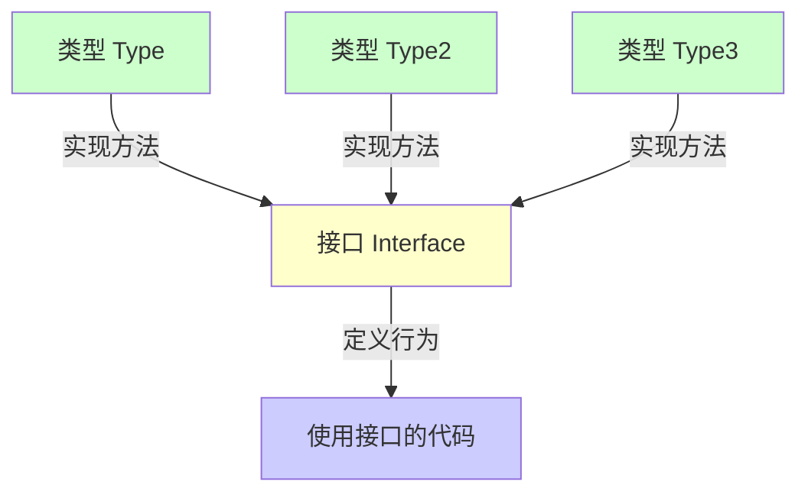
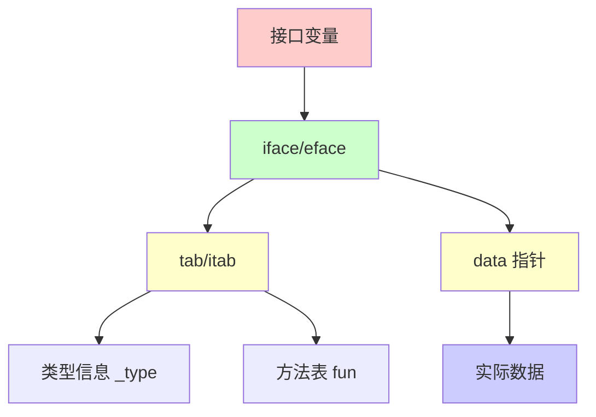
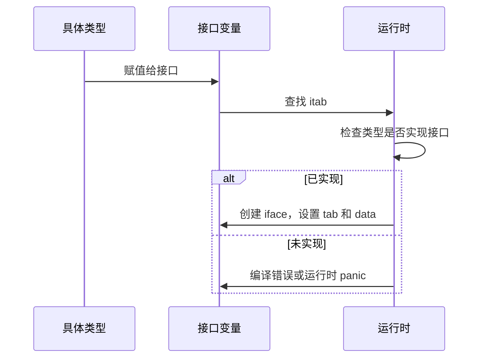

推荐阅读：[Go Interface Source Code](https://go.dev/src/runtime/iface.go)

# Interface 概述

Interface（接口）是 Go 语言类型系统的核心，它定义了对象的行为规范。Go 语言的接口采用**隐式实现**，只要类型实现了接口的所有方法，就认为该类型实现了该接口。

## 设计理念

Go 接口的设计遵循以下原则：

1. **隐式实现**：不需要显式声明实现接口
2. **小而专一**：接口应该小而专注，通常只包含 1-3 个方法
3. **组合优于继承**：通过接口组合实现复杂功能
4. **面向行为**：接口定义"做什么"，而不是"是什么"



## Interface 的特点

- ✅ **隐式实现**：无需显式声明
- ✅ **类型安全**：编译时检查
- ✅ **解耦合**：接口与实现分离
- ✅ **可组合**：接口可以组合
- ✅ **多态性**：同一接口可以有多种实现

---

# Interface 的定义和隐式实现

## 接口定义

接口定义了一组方法的集合，任何实现了这些方法的类型都实现了该接口。

```go
// 定义接口
type Writer interface {
    Write([]byte) (int, error)
}

type Reader interface {
    Read([]byte) (int, error)
}

// 组合接口
type ReadWriter interface {
    Reader
    Writer
}
```

## 隐式实现

Go 语言的接口实现是隐式的，不需要显式声明。

```go
// 定义接口
type Animal interface {
    Speak() string
}

// 定义类型
type Dog struct {
    Name string
}

// 实现接口方法（隐式实现）
func (d Dog) Speak() string {
    return "Woof!"
}

type Cat struct {
    Name string
}

func (c Cat) Speak() string {
    return "Meow!"
}

// 使用接口
func MakeSound(a Animal) {
    fmt.Println(a.Speak())
}

func main() {
    dog := Dog{Name: "Buddy"}
    cat := Cat{Name: "Whiskers"}
    
    MakeSound(dog)  // 输出: Woof!
    MakeSound(cat)  // 输出: Meow!
}
```

## 接口实现检查

虽然接口是隐式实现的，但可以在编译时检查类型是否实现了接口。

```go
// 编译时检查：确保 *MyType 实现了 MyInterface
var _ MyInterface = (*MyType)(nil)

// 如果 MyType 没有实现 MyInterface 的所有方法，编译会失败
```

---

# 空接口 interface{} 和 any

## 空接口 interface{}

空接口 `interface{}` 不包含任何方法，因此所有类型都实现了空接口。空接口可以表示任何类型的值。

```go
// 空接口可以存储任何类型的值
var i interface{}

i = 42           // int
i = "hello"       // string
i = []int{1, 2, 3} // slice

// 使用空接口作为参数
func PrintAnything(v interface{}) {
    fmt.Printf("Value: %v, Type: %T\n", v, v)
}

func main() {
    PrintAnything(42)
    PrintAnything("hello")
    PrintAnything([]int{1, 2, 3})
}
```

## any 类型（Go 1.18+）

从 Go 1.18 开始，`any` 是 `interface{}` 的类型别名，推荐使用 `any` 代替 `interface{}`。

```go
// any 是 interface{} 的别名
type any = interface{}

// 使用 any
func PrintAnything(v any) {
    fmt.Printf("Value: %v, Type: %T\n", v, v)
}

// 两者等价
var v1 interface{} = 42
var v2 any = 42
```

## 空接口的使用场景

### 1. 泛型容器（Go 1.18 之前）

```go
// 在泛型出现之前，使用空接口实现通用容器
type Stack struct {
    items []interface{}
}

func (s *Stack) Push(item interface{}) {
    s.items = append(s.items, item)
}

func (s *Stack) Pop() interface{} {
    if len(s.items) == 0 {
        return nil
    }
    item := s.items[len(s.items)-1]
    s.items = s.items[:len(s.items)-1]
    return item
}
```

### 2. JSON 序列化

```go
import "encoding/json"

func main() {
    data := map[string]interface{}{
        "name": "John",
        "age":  30,
        "city": "New York",
    }
    
    jsonData, _ := json.Marshal(data)
    fmt.Println(string(jsonData))
}
```

### 3. 反射

```go
import "reflect"

func PrintType(v interface{}) {
    t := reflect.TypeOf(v)
    fmt.Printf("Type: %v\n", t)
}

func main() {
    PrintType(42)
    PrintType("hello")
    PrintType([]int{1, 2, 3})
}
```

---

# 类型断言（Type Assertion）

## 基本语法

类型断言用于从接口值中提取具体类型的值。

```go
// 语法1：value := i.(Type)
value := i.(int)

// 语法2：value, ok := i.(Type)
value, ok := i.(int)
if ok {
    // 类型断言成功
    fmt.Println(value)
} else {
    // 类型断言失败
    fmt.Println("不是 int 类型")
}
```

## 类型断言示例

```go
func main() {
    var i interface{} = 42
    
    // 方式1：如果断言失败会 panic
    value := i.(int)
    fmt.Println(value)  // 42
    
    // 方式2：安全断言，返回 ok 值
    value, ok := i.(int)
    if ok {
        fmt.Println("是 int 类型:", value)
    } else {
        fmt.Println("不是 int 类型")
    }
    
    // 断言失败示例
    str, ok := i.(string)
    if !ok {
        fmt.Println("不是 string 类型")
    }
}
```

## 类型断言的应用

### 1. 类型检查

```go
func processValue(v interface{}) {
    switch v.(type) {
    case int:
        fmt.Println("是整数:", v.(int))
    case string:
        fmt.Println("是字符串:", v.(string))
    case []int:
        fmt.Println("是整数切片:", v.([]int))
    default:
        fmt.Println("未知类型")
    }
}
```

### 2. 接口转换

```go
type Writer interface {
    Write([]byte) (int, error)
}

type FileWriter struct {
    filename string
}

func (f FileWriter) Write(data []byte) (int, error) {
    // 实现写入逻辑
    return len(data), nil
}

func main() {
    var w Writer = FileWriter{filename: "test.txt"}
    
    // 类型断言：从 Writer 接口转换为具体类型
    if fw, ok := w.(FileWriter); ok {
        fmt.Println("文件名:", fw.filename)
    }
}
```

---

# 类型转换（Type Switch）

## Type Switch 语法

`type switch` 是 Go 语言中用于类型判断的特殊 switch 语句。

```go
switch v := i.(type) {
case int:
    fmt.Println("是 int:", v)
case string:
    fmt.Println("是 string:", v)
case bool:
    fmt.Println("是 bool:", v)
default:
    fmt.Println("未知类型")
}
```

## Type Switch 示例

```go
func printType(i interface{}) {
    switch v := i.(type) {
    case int:
        fmt.Printf("整数: %d\n", v)
    case string:
        fmt.Printf("字符串: %s\n", v)
    case float64:
        fmt.Printf("浮点数: %f\n", v)
    case bool:
        fmt.Printf("布尔值: %t\n", v)
    case []int:
        fmt.Printf("整数切片: %v\n", v)
    default:
        fmt.Printf("未知类型: %T\n", v)
    }
}

func main() {
    printType(42)
    printType("hello")
    printType(3.14)
    printType(true)
    printType([]int{1, 2, 3})
}
```

## Type Switch 与类型断言的区别

```go
// 类型断言：只能检查一种类型
if v, ok := i.(int); ok {
    fmt.Println(v)
}

// Type Switch：可以检查多种类型
switch v := i.(type) {
case int:
    fmt.Println("int:", v)
case string:
    fmt.Println("string:", v)
}
```

---

# 接口的底层实现

## iface 和 eface

Go 语言的接口在运行时由两种结构体表示：

1. **iface**：非空接口（包含方法的接口）
2. **eface**：空接口（interface{} 或 any）

## iface 结构体

```go
// runtime/runtime2.go
type iface struct {
    tab  *itab          // 接口表，包含类型和方法信息
    data unsafe.Pointer // 指向实际数据的指针
}

// itab 结构
type itab struct {
    inter *interfacetype // 接口类型信息
    _type *_type         // 具体类型信息
    hash  uint32         // 类型哈希值，用于类型断言
    _     [4]byte
    fun   [1]uintptr     // 方法函数指针数组
}
```

## eface 结构体

```go
// runtime/runtime2.go
type eface struct {
    _type *_type         // 类型信息
    data  unsafe.Pointer // 指向实际数据的指针
}
```

## 接口的内存布局



## 接口转换过程



## 源码分析

### 接口赋值（convT2I）

```go
// runtime/iface.go
func convT2I(tab *itab, elem unsafe.Pointer) (i iface) {
    t := tab._type
    if raceenabled {
        raceReadObjectPC(t, elem, getcallerpc(), abi.FuncPCABIInternal(convT2I))
    }
    if msanenabled {
        msanread(elem, t.size)
    }
    if asanenabled {
        asanread(elem, t.size)
    }
    x := mallocgc(t.size, t, true)
    typedmemmove(t, x, elem)
    i.tab = tab
    i.data = x
    return
}
```

### 类型断言（assertI2T）

```go
// runtime/iface.go
func assertI2T(inter *interfacetype, tab *itab, r unsafe.Pointer) unsafe.Pointer {
    t := tab._type
    if tab == nil {
        panic(&TypeAssertionError{inter, nil, nil, ""})
    }
    if t == nil {
        panic(&TypeAssertionError{inter, nil, nil, ""})
    }
    r = mallocgc(t.size, t, true)
    typedmemmove(t, r, tab.data)
    return r
}
```

---

# 接口的方法集规则

## 方法集定义

方法集（Method Set）是类型可以调用的方法集合。Go 语言的方法集规则决定了哪些方法可以被接口使用。

## 方法集规则

### 规则1：值接收者的方法

```go
type T struct {
    value int
}

// 值接收者方法
func (t T) ValueMethod() {
    fmt.Println("Value Method")
}

// T 的方法集包含 ValueMethod
// *T 的方法集也包含 ValueMethod（自动提升）
```

### 规则2：指针接收者的方法

```go
type T struct {
    value int
}

// 指针接收者方法
func (t *T) PointerMethod() {
    fmt.Println("Pointer Method")
}

// T 的方法集不包含 PointerMethod
// *T 的方法集包含 PointerMethod
```

## 方法集规则总结

| 接收者类型 | 值类型 T 的方法集 | 指针类型 *T 的方法集 |
|-----------|-----------------|-------------------|
| `(t T)`   | ✅ 包含          | ✅ 包含（自动提升） |
| `(t *T)`  | ❌ 不包含        | ✅ 包含           |

## 接口实现的影响

```go
type Interface interface {
    Method()
}

type T struct{}

// 值接收者实现
func (t T) Method() {
    fmt.Println("Method")
}

func main() {
    var i Interface
    
    // ✅ 可以：T 实现了 Interface
    i = T{}
    i.Method()
    
    // ✅ 可以：*T 也实现了 Interface（自动提升）
    i = &T{}
    i.Method()
}
```

```go
type Interface interface {
    Method()
}

type T struct{}

// 指针接收者实现
func (t *T) Method() {
    fmt.Println("Method")
}

func main() {
    var i Interface
    
    // ❌ 不可以：T 没有实现 Interface
    // i = T{}  // 编译错误
    
    // ✅ 可以：*T 实现了 Interface
    i = &T{}
    i.Method()
}
```

## 实际应用

```go
type Writer interface {
    Write([]byte) (int, error)
}

type Buffer struct {
    data []byte
}

// 值接收者：Buffer 和 *Buffer 都实现了 Writer
func (b Buffer) Write(p []byte) (int, error) {
    b.data = append(b.data, p...)
    return len(p), nil
}

// 指针接收者：只有 *Buffer 实现了 Writer
func (b *Buffer) WritePointer(p []byte) (int, error) {
    b.data = append(b.data, p...)
    return len(p), nil
}

func main() {
    var w Writer
    
    // ✅ 值接收者：都可以
    w = Buffer{}
    w = &Buffer{}
    
    // ❌ 指针接收者：只有指针可以
    // w = Buffer{}  // 编译错误
    w = &Buffer{}
}
```

---

# 接口组合

## 接口嵌入

Go 语言支持接口组合，通过嵌入其他接口来创建新接口。

```go
// 基础接口
type Reader interface {
    Read([]byte) (int, error)
}

type Writer interface {
    Write([]byte) (int, error)
}

// 组合接口
type ReadWriter interface {
    Reader  // 嵌入 Reader
    Writer // 嵌入 Writer
}

// 等价写法
type ReadWriter2 interface {
    Read([]byte) (int, error)
    Write([]byte) (int, error)
}
```

## 接口组合示例

```go
// 定义基础接口
type Closer interface {
    Close() error
}

type Reader interface {
    Read([]byte) (int, error)
}

type Writer interface {
    Write([]byte) (int, error)
}

// 组合接口
type ReadCloser interface {
    Reader
    Closer
}

type WriteCloser interface {
    Writer
    Closer
}

type ReadWriteCloser interface {
    Reader
    Writer
    Closer
}

// 实现组合接口
type File struct {
    name string
}

func (f *File) Read(data []byte) (int, error) {
    // 实现读取逻辑
    return 0, nil
}

func (f *File) Write(data []byte) (int, error) {
    // 实现写入逻辑
    return 0, nil
}

func (f *File) Close() error {
    // 实现关闭逻辑
    return nil
}

// *File 实现了 ReadWriteCloser
func main() {
    var rwc ReadWriteCloser = &File{name: "test.txt"}
    rwc.Read(nil)
    rwc.Write(nil)
    rwc.Close()
}
```

## io 包中的接口组合

标准库 `io` 包是接口组合的典型例子：

```go
// io 包中的接口定义
package io

type Reader interface {
    Read(p []byte) (n int, err error)
}

type Writer interface {
    Write(p []byte) (n int, err error)
}

type Closer interface {
    Close() error
}

// 组合接口
type ReadCloser interface {
    Reader
    Closer
}

type WriteCloser interface {
    Writer
    Closer
}

type ReadWriteCloser interface {
    Reader
    Writer
    Closer
}
```

## 接口组合的优势

1. **代码复用**：避免重复定义方法
2. **灵活性**：可以灵活组合接口
3. **可读性**：接口组合更清晰
4. **扩展性**：易于扩展新接口

---

# 接口的最佳实践

## 1. 小而专一的接口

接口应该小而专注，通常只包含 1-3 个方法。

```go
// ✅ 好的接口：小而专注
type Reader interface {
    Read([]byte) (int, error)
}

type Writer interface {
    Write([]byte) (int, error)
}

// ❌ 不好的接口：太大
type FileOperations interface {
    Read([]byte) (int, error)
    Write([]byte) (int, error)
    Close() error
    Seek(int64, int) (int64, error)
    Stat() (FileInfo, error)
    // ... 太多方法
}
```

## 2. 接受接口，返回具体类型

函数应该接受接口作为参数，返回具体类型。

```go
// ✅ 好的设计
func ProcessData(r Reader) error {
    // 接受接口
    data := make([]byte, 1024)
    _, err := r.Read(data)
    return err
}

// ❌ 不好的设计
func ProcessData(r *File) error {
    // 接受具体类型，耦合度高
    // ...
}
```

## 3. 使用接口组合

通过接口组合实现复杂功能，而不是定义大接口。

```go
// ✅ 好的设计：组合接口
type ReadWriter interface {
    Reader
    Writer
}

// ❌ 不好的设计：大接口
type ReadWriter interface {
    Read([]byte) (int, error)
    Write([]byte) (int, error)
}
```

## 4. 避免不必要的接口

不要为了使用接口而使用接口，只在需要多态性时使用。

```go
// ❌ 不必要的接口
type Stringer interface {
    String() string
}

func Print(s Stringer) {
    fmt.Println(s.String())
}

// ✅ 直接使用具体类型
func Print(s string) {
    fmt.Println(s)
}
```

## 5. 接口命名

接口命名应该清晰表达其用途。

```go
// ✅ 好的命名
type Reader interface { ... }
type Writer interface { ... }
type Closer interface { ... }

// ❌ 不好的命名
type IReader interface { ... }  // 不要加 I 前缀
type ReaderInterface interface { ... }  // 不要加 Interface 后缀
```

---

# 常见陷阱和问题

## 1. nil 接口值

nil 接口值不等于 nil。

```go
func main() {
    var i interface{}
    fmt.Println(i == nil)  // true
    
    var p *int
    i = p
    fmt.Println(i == nil)  // false！i 不是 nil
    fmt.Println(p == nil)   // true
}
```

### 原因

接口值包含类型信息和数据指针。当接口值为 nil 时，类型信息和数据指针都为 nil。但当接口存储了 nil 指针时，类型信息不为 nil，只有数据指针为 nil。

```go
// 正确的 nil 检查
func process(i interface{}) {
    if i == nil {
        return
    }
    
    // 或者使用反射
    if reflect.ValueOf(i).IsNil() {
        return
    }
}
```

## 2. 接口值的比较

接口值可以比较，但需要注意：

```go
func main() {
    var i1, i2 interface{}
    
    i1 = []int{1, 2, 3}
    i2 = []int{1, 2, 3}
    
    // ❌ 编译错误：slice 不能比较
    // fmt.Println(i1 == i2)
    
    i1 = map[string]int{"a": 1}
    i2 = map[string]int{"a": 1}
    
    // ❌ 编译错误：map 不能比较
    // fmt.Println(i1 == i2)
    
    // ✅ 可以比较的类型
    i1 = 42
    i2 = 42
    fmt.Println(i1 == i2)  // true
}
```

## 3. 接口值的修改

通过接口值修改底层数据需要指针。

```go
type Counter struct {
    value int
}

func (c *Counter) Increment() {
    c.value++
}

func main() {
    var c Counter
    var i interface{} = c  // 值拷贝
    
    // ❌ 错误：c 没有 Increment 方法（值接收者）
    // i.Increment()
    
    var i2 interface{} = &c  // 指针
    // ✅ 正确：*Counter 有 Increment 方法
    if counter, ok := i2.(*Counter); ok {
        counter.Increment()
    }
}
```

## 4. 类型断言失败

类型断言失败会导致 panic。

```go
func main() {
    var i interface{} = "hello"
    
    // ❌ 会 panic：类型断言失败
    // value := i.(int)
    
    // ✅ 安全的方式
    value, ok := i.(int)
    if ok {
        fmt.Println(value)
    } else {
        fmt.Println("类型断言失败")
    }
}
```

## 5. 接口方法集的陷阱

指针接收者和值接收者的方法集不同。

```go
type Interface interface {
    Method()
}

type T struct{}

func (t *T) Method() {
    fmt.Println("Method")
}

func main() {
    var i Interface
    
    // ❌ 编译错误：T 没有实现 Interface
    // i = T{}
    
    // ✅ 正确：*T 实现了 Interface
    i = &T{}
    i.Method()
}
```

## 6. 空接口的性能

空接口的使用会有性能开销（类型转换、内存分配）。

```go
// ❌ 性能较差：使用空接口
func process(v interface{}) {
    // 需要类型断言，有性能开销
    if str, ok := v.(string); ok {
        fmt.Println(str)
    }
}

// ✅ 性能更好：使用泛型（Go 1.18+）
func process[T any](v T) {
    fmt.Println(v)
}
```

---

# 实际应用示例

## 1. 依赖注入

```go
// 定义接口
type UserRepository interface {
    GetUser(id int) (*User, error)
    SaveUser(user *User) error
}

// 实现接口
type MySQLUserRepository struct {
    db *sql.DB
}

func (r *MySQLUserRepository) GetUser(id int) (*User, error) {
    // 实现逻辑
    return nil, nil
}

func (r *MySQLUserRepository) SaveUser(user *User) error {
    // 实现逻辑
    return nil
}

// 使用接口
type UserService struct {
    repo UserRepository  // 依赖接口，而不是具体实现
}

func NewUserService(repo UserRepository) *UserService {
    return &UserService{repo: repo}
}

func (s *UserService) GetUser(id int) (*User, error) {
    return s.repo.GetUser(id)
}
```

## 2. 测试 Mock

```go
// 生产代码
type EmailSender interface {
    SendEmail(to, subject, body string) error
}

type UserService struct {
    emailSender EmailSender
}

func (s *UserService) RegisterUser(email string) error {
    // 注册逻辑
    return s.emailSender.SendEmail(email, "Welcome", "Welcome to our service")
}

// 测试代码
type MockEmailSender struct {
    sentEmails []string
}

func (m *MockEmailSender) SendEmail(to, subject, body string) error {
    m.sentEmails = append(m.sentEmails, to)
    return nil
}

func TestUserService_RegisterUser(t *testing.T) {
    mockSender := &MockEmailSender{}
    service := &UserService{emailSender: mockSender}
    
    err := service.RegisterUser("test@example.com")
    if err != nil {
        t.Fatal(err)
    }
    
    if len(mockSender.sentEmails) != 1 {
        t.Errorf("期望发送 1 封邮件，实际发送 %d 封", len(mockSender.sentEmails))
    }
}
```

## 3. 策略模式

```go
// 定义策略接口
type PaymentStrategy interface {
    Pay(amount float64) error
}

// 实现不同策略
type CreditCardPayment struct{}

func (c *CreditCardPayment) Pay(amount float64) error {
    fmt.Printf("使用信用卡支付 %.2f\n", amount)
    return nil
}

type PayPalPayment struct{}

func (p *PayPalPayment) Pay(amount float64) error {
    fmt.Printf("使用 PayPal 支付 %.2f\n", amount)
    return nil
}

// 使用策略
type PaymentProcessor struct {
    strategy PaymentStrategy
}

func (p *PaymentProcessor) ProcessPayment(amount float64) error {
    return p.strategy.Pay(amount)
}

func main() {
    processor := &PaymentProcessor{strategy: &CreditCardPayment{}}
    processor.ProcessPayment(100.0)
    
    processor.strategy = &PayPalPayment{}
    processor.ProcessPayment(200.0)
}
```

---

# 总结

Interface 是 Go 语言类型系统的核心，提供了强大的多态性和解耦合能力。

## 关键要点

1. **隐式实现**：类型无需显式声明实现接口
2. **空接口**：`interface{}` 和 `any` 可以表示任何类型
3. **类型断言**：从接口值中提取具体类型
4. **类型转换**：使用 `type switch` 进行类型判断
5. **底层实现**：`iface`（非空接口）和 `eface`（空接口）
6. **方法集规则**：值接收者和指针接收者的方法集不同
7. **接口组合**：通过嵌入接口实现组合

## 使用建议

- ✅ 定义小而专一的接口
- ✅ 接受接口，返回具体类型
- ✅ 使用接口组合而非大接口
- ✅ 避免不必要的接口
- ✅ 注意 nil 接口值的处理
- ✅ 注意方法集规则的影响

## 参考资源

- [Go Interface Source Code](https://go.dev/src/runtime/iface.go)
- [Effective Go: Interfaces](https://go.dev/doc/effective_go#interfaces)
- [Go Blog: Laws of Reflection](https://go.dev/blog/laws-of-reflection)
- [Go Blog: The Go Memory Model](https://go.dev/ref/mem)
