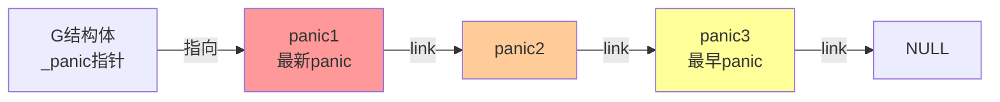
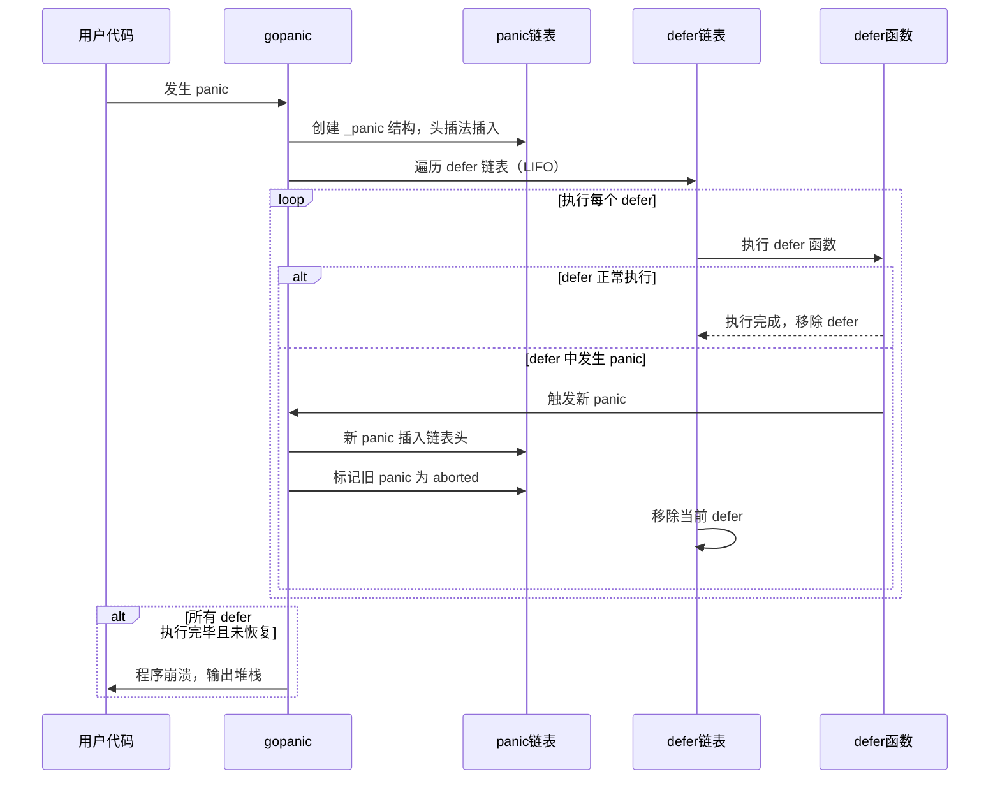
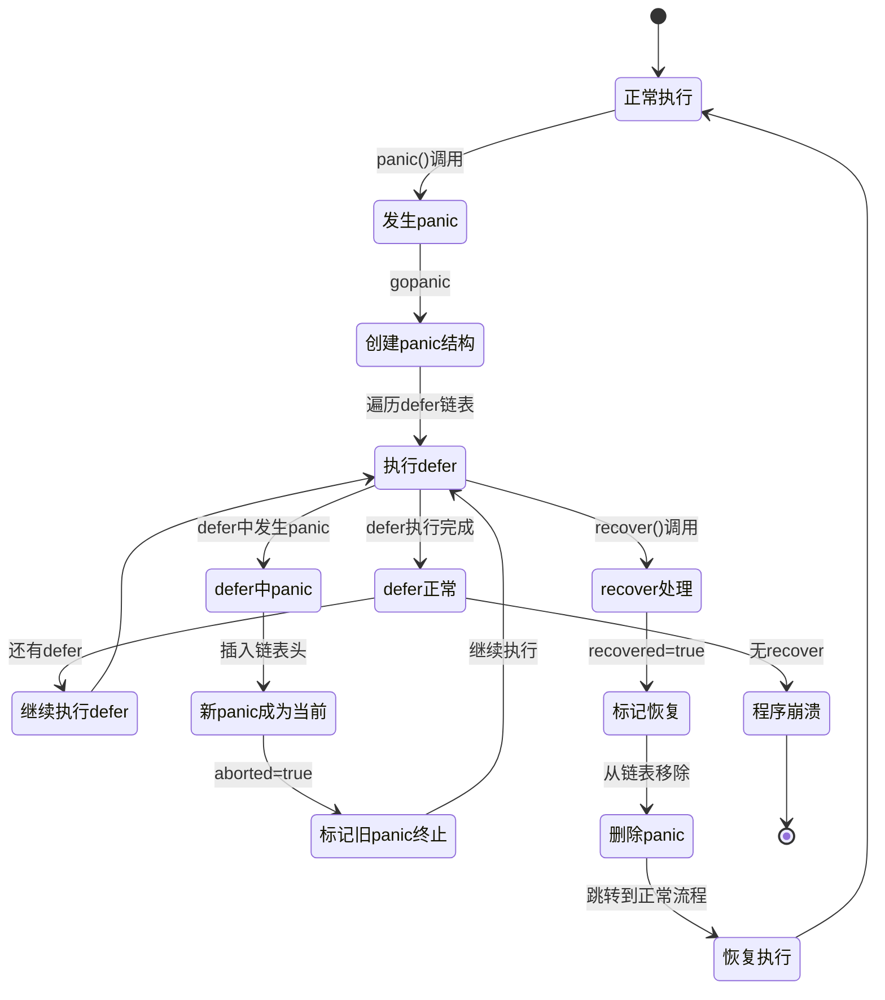
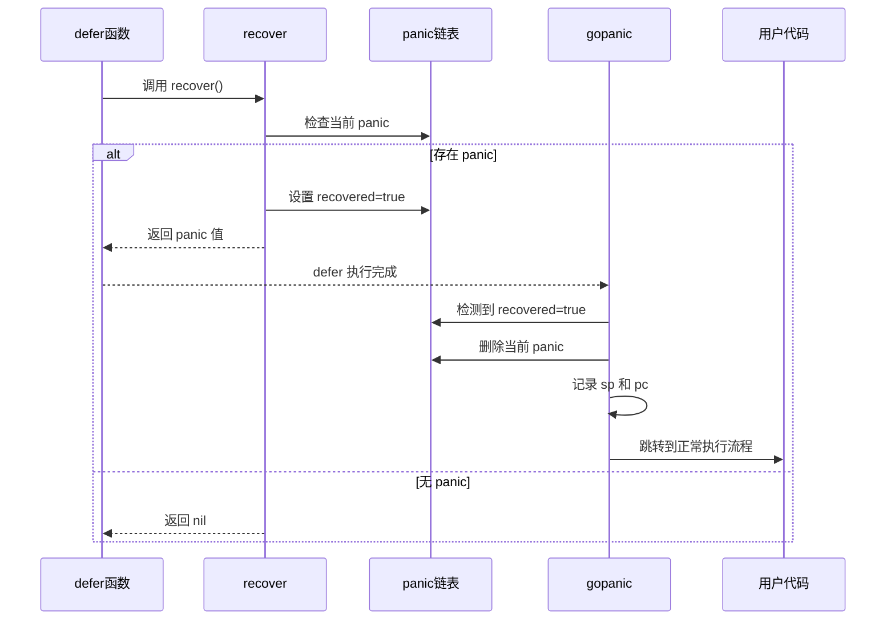
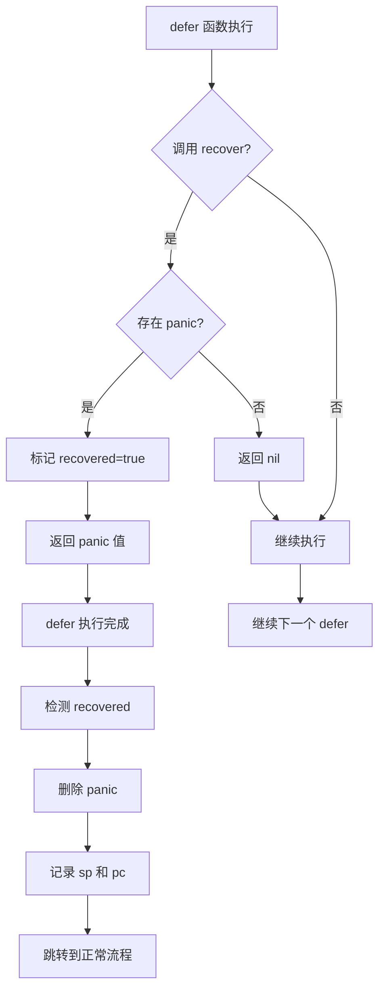

# 概述

`panic` 和 `recover` 是 Go 语言提供的错误处理机制。`panic` 用于触发运行时错误，`recover` 用于恢复 panic 并继续执行程序。

# 基本用法

## panic

```go
func example() {
    panic("something went wrong")
    // panic 后的代码不会执行
}
```

## recover

```go
func example() {
    defer func() {
        if r := recover(); r != nil {
            fmt.Println("Recovered from:", r)
        }
    }()
    panic("something went wrong")
    // 程序会继续执行，不会崩溃
}
```

# panic 结构体

在 G 结构体（goroutine 结构）中用 `_panic` 标识当前 goroutine 的所有 panic 链表，通过链表链接起一个个 panic 结构体。发生新 panic 时使用头插法插入链表。

```go
type _panic struct {
    argp      unsafe.Pointer // 指向defer参数空间地址
    arg       interface{}    // panic参数
    link      *_panic        // 链接之前发生的panic
    recovered bool           // 表示panic是否被恢复
    aborted   bool           // 表示panic是否被终止
}
```

### panic 链表结构图



**说明**：
- 新 panic 使用头插法插入链表头
- 链表头指向最新的 panic
- 链表尾指向最早的 panic
- 输出 panic 信息时从链表尾开始（最早到最新）

# panic 执行流程

## 触发 panic

一旦发生 panic，panic 后面的代码就不会执行，会触发 `runtime.gopanic` 函数：

1. **创建 panic 结构**：创建新的 `_panic` 结构体，使用头插法插入 panic 链表
2. **执行 defer 函数**：转而执行注册的 defer 函数
3. **关联 panic**：将 defer 结构的 `_panic` 字段设置为当前 panic

## defer 执行过程

在执行 defer 函数时：

- **正常结束**：如果 defer 函数正常执行完毕，则移除当前 defer 结构，执行下一个 defer
- **defer 中发生 panic**：
  - 将新 panic 插入链表头，新 panic 成为当前执行的 panic
  - 执行 defer 链表，发现第一个 defer 已经执行并且执行的 panic 不是新 panic
  - 将 defer 执行的 panic 标记为已终止（`aborted = true`）
  - 移除当前的 defer

## defer 链表处理

defer 链表采用先标记后释放的策略：
- 先标记需要执行的 defer
- 执行完成后统一释放

### panic 执行流程图





# recover 机制

## recover 工作原理

`recover` 函数将当前执行的 panic 置为已恢复：

1. **标记恢复**：将当前 panic 的 `recovered` 字段设置为 `true`
2. **检测恢复**：当执行完当前 defer 函数后会检测当前 panic 是否已恢复
3. **删除 panic**：如果已恢复则删除当前 panic
4. **移除 defer**：当前执行的 defer 也会移除
5. **记录跳转信息**：记录当前 defer 的 `pc` 和 `sp`，用于跳出 panic 流程
   - `sp`：用于记录调用 defer 函数的函数栈指针，通过 `sp` 可以恢复调用者的栈帧
   - `pc`：用于记录 defer 函数注册时的 `deferproc` 函数返回地址，通过 `pc` 可以跳转到 defer 函数注册时的返回地址

## recover 后继续执行

recover 之后需要跳转代码位置：
- 通过恢复的栈帧（`sp`）和程序计数器（`pc`）跳转到正常执行流程
- 程序从 panic 发生的位置继续执行，而不是崩溃退出

## recover 后又 panic

如果在 recover 之后又发生 panic，等同于在 defer 函数中发生 panic：

1. 移除当前 defer
2. 执行下一个 defer
3. 将下一个 defer 触发的 panic 置为当前 panic
4. 继续 panic 处理流程

### recover 机制流程图





# panic 信息输出

## 输出顺序

打印 panic 信息时会从 panic 链表尾开始输出（即按照 panic 发生的顺序，从最早到最新）。

## 恢复标记

如果 panic 已经恢复，会在输出时加上 `[recovered]` 标记，表示该 panic 已被 recover 处理。

## 输出示例

```go
panic: first panic
[recovered]
panic: second panic
```

# 总结

## panic 和 defer 的交互

1. **panic 触发**：创建 panic 结构，插入链表头
2. **defer 执行**：按照 LIFO 顺序执行 defer 函数
3. **panic 传播**：如果 defer 中发生 panic，新 panic 成为当前 panic
4. **panic 终止**：如果 defer 关联的 panic 不是当前 panic，标记为已终止

## recover 的作用

1. **恢复 panic**：将当前 panic 标记为已恢复
2. **跳转执行**：通过 `sp` 和 `pc` 恢复到正常执行流程
3. **继续运行**：程序不会崩溃，继续执行后续代码

## 最佳实践

1. **只在 defer 中使用 recover**：recover 只在 defer 函数中有效
2. **及时处理 panic**：在可能发生 panic 的地方使用 defer + recover
3. **记录错误信息**：在 recover 中记录 panic 信息，便于调试
4. **避免滥用 panic**：panic 应该用于不可恢复的错误，常规错误应该使用 error 返回

## 注意事项

- panic 会中断当前函数的执行，但会执行 defer 函数
- recover 只能恢复当前 goroutine 的 panic
- 如果 panic 没有被 recover，程序会崩溃并输出堆栈信息
- 在 defer 中再次 panic 会导致新的 panic 传播
