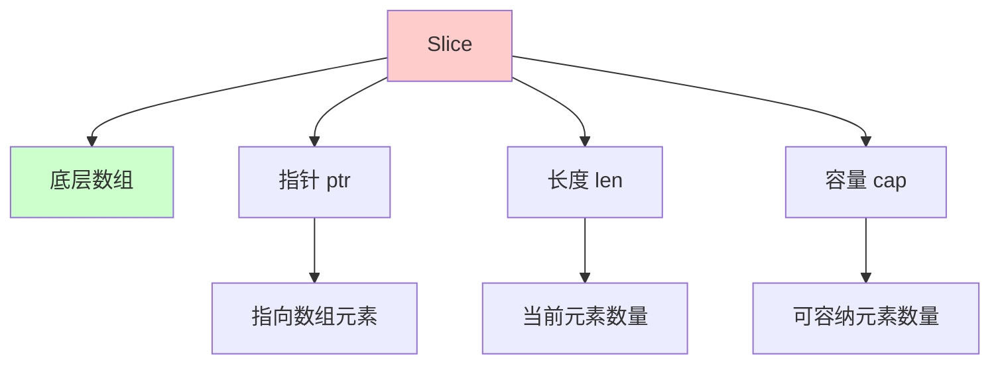

# Go Slice 详解

Slice（切片）是 Go 语言中最重要的数据结构之一，它提供了对数组的动态视图。理解 slice 的底层实现对于编写高效、正确的 Go 程序至关重要。

## 目录

- [Slice 概述](#slice-概述)
- [Slice 的底层结构](#slice-的底层结构)
- [Slice 的创建和初始化](#slice-的创建和初始化)
- [Slice 的扩容机制](#slice-的扩容机制)
- [Slice 的截取和复制](#slice-的截取和复制)
- [Slice 与数组的关系](#slice-与数组的关系)
- [Slice 的内存布局](#slice-的内存布局)
- [Slice 的性能考虑](#slice-的性能考虑)
- [Slice 的常见陷阱](#slice-的常见陷阱)
- [最佳实践](#最佳实践)

# Slice 概述

## 什么是 Slice

Slice 是对数组的抽象，提供了对数组元素的动态访问。Slice 本身不存储数据，而是引用底层数组的一部分。



## Slice 的特点

- **动态长度**：可以在运行时改变长度
- **引用语义**：多个 slice 可以共享同一个底层数组
- **零值可用**：nil slice 可以直接使用
- **类型安全**：编译时检查类型

## Slice vs Array

| 特性 | Array | Slice |
|------|-------|-------|
| **长度** | 固定 | 可变 |
| **类型** | `[n]T` | `[]T` |
| **值传递** | 值拷贝 | 引用传递 |
| **零值** | 零值数组 | nil |
| **使用场景** | 固定大小数据 | 动态大小数据 |

# Slice 的底层结构

## 运行时表示

Slice 在运行时由三个字段组成：

```go
type slice struct {
    ptr unsafe.Pointer  // 指向底层数组的指针
    len int            // 当前长度
    cap int            // 容量
}
```

## 字段说明

### ptr（指针）

- 指向底层数组的第一个元素
- 如果 slice 为 nil，ptr 为 nil
- 多个 slice 可以指向同一个底层数组

### len（长度）

- 当前 slice 中元素的数量
- 可以通过 `len(slice)` 获取
- 长度不能超过容量

### cap（容量）

- 底层数组从 ptr 开始到数组末尾的元素数量
- 可以通过 `cap(slice)` 获取
- 容量 >= 长度

## 内存布局示例

```go
package main

import (
    "fmt"
    "unsafe"
)

func main() {
    arr := [5]int{1, 2, 3, 4, 5}
    s := arr[1:4]  // len=3, cap=4
    
    // 获取 slice 的底层结构信息
    sPtr := (*[3]int)(unsafe.Pointer(&s))
    fmt.Printf("Slice header: %+v\n", sPtr)
    
    fmt.Printf("Length: %d\n", len(s))
    fmt.Printf("Capacity: %d\n", cap(s))
    fmt.Printf("Elements: %v\n", s)
}
```

## 可视化表示

```
底层数组: [1, 2, 3, 4, 5]
           ↑     ↑        ↑
           |     |        |
          ptr   len=3    cap=4

Slice: {ptr: &arr[1], len: 3, cap: 4}
实际元素: [2, 3, 4]
```

# Slice 的创建和初始化

## 声明 Slice

```go
// 声明一个 nil slice
var s []int
fmt.Println(s == nil)  // true

// 声明并初始化
var s1 []int = []int{1, 2, 3}

// 短变量声明
s2 := []int{1, 2, 3}
```

## 使用 make 创建

```go
// 创建指定长度和容量的 slice
s := make([]int, 5)        // len=5, cap=5
s := make([]int, 5, 10)    // len=5, cap=10

// 只指定长度，容量等于长度
s := make([]int, 3)        // len=3, cap=3
```

## 从数组创建

```go
arr := [5]int{1, 2, 3, 4, 5}

// 完整数组转 slice
s1 := arr[:]               // len=5, cap=5

// 从索引开始
s2 := arr[1:]              // len=4, cap=4

// 到索引结束（不包含）
s3 := arr[:3]               // len=3, cap=5

// 指定范围
s4 := arr[1:3]              // len=2, cap=4
```

## 从另一个 Slice 创建

```go
s1 := []int{1, 2, 3, 4, 5}
s2 := s1[1:3]               // len=2, cap=4
s3 := s1[:]                 // 完整 slice
```

## 空 Slice vs Nil Slice

```go
// nil slice
var s1 []int
fmt.Println(s1 == nil)      // true
fmt.Println(len(s1))        // 0
fmt.Println(cap(s1))        // 0

// 空 slice（非 nil）
s2 := []int{}
fmt.Println(s2 == nil)      // false
fmt.Println(len(s2))        // 0
fmt.Println(cap(s2))        // 0

// 使用 make 创建的空 slice
s3 := make([]int, 0)
fmt.Println(s3 == nil)      // false
fmt.Println(len(s3))        // 0
fmt.Println(cap(s3))        // 0

// 使用 make 创建的空 slice（指定容量）
s4 := make([]int, 0, 10)
fmt.Println(s4 == nil)      // false
fmt.Println(len(s4))        // 0
fmt.Println(cap(s4))        // 10
```

**注意**：nil slice 和空 slice 在大多数操作中行为相同，但 nil slice 可以与 nil 比较。

## 初始化方式对比

```go
// 方式 1: 字面量
s1 := []int{1, 2, 3}

// 方式 2: make + 循环赋值
s2 := make([]int, 3)
for i := range s2 {
    s2[i] = i + 1
}

// 方式 3: make + append
s3 := make([]int, 0, 3)
s3 = append(s3, 1, 2, 3)

// 方式 4: 从数组切片
arr := [3]int{1, 2, 3}
s4 := arr[:]
```

# Slice 的扩容机制

## 扩容触发条件

当 slice 的长度达到容量时，继续 append 会触发扩容：

```go
s := make([]int, 0, 2)
s = append(s, 1, 2)  // len=2, cap=2，未扩容
s = append(s, 3)     // len=3，触发扩容
```

## 扩容策略

Go 1.18+ 的扩容策略：

```go
// 伪代码
func growslice(oldCap, newLen int) int {
    newCap := oldCap
    doubleCap := newCap + newCap
    
    if newLen > doubleCap {
        // 新长度超过两倍旧容量，直接使用新长度
        newCap = newLen
    } else {
        // 旧容量 < 256，直接翻倍
        if oldCap < 256 {
            newCap = doubleCap
        } else {
            // 旧容量 >= 256，按 1.25 倍增长
            for 0 < newCap && newCap < newLen {
                newCap += (newCap + 3*256) / 4
            }
            if newCap <= 0 {
                newCap = newLen
            }
        }
    }
    
    // 内存对齐
    return roundupsize(newCap)
}
```

## 扩容示例

```go
package main

import "fmt"

func main() {
    s := make([]int, 0)
    
    for i := 0; i < 20; i++ {
        oldCap := cap(s)
        s = append(s, i)
        newCap := cap(s)
        
        if oldCap != newCap {
            fmt.Printf("len=%d, cap=%d -> cap=%d (增长 %.2f 倍)\n",
                len(s)-1, oldCap, newCap, float64(newCap)/float64(oldCap))
        }
    }
}
```

输出示例：
```
len=0, cap=0 -> cap=1 (增长 +Inf 倍)
len=1, cap=1 -> cap=2 (增长 2.00 倍)
len=2, cap=2 -> cap=4 (增长 2.00 倍)
len=4, cap=4 -> cap=8 (增长 2.00 倍)
len=8, cap=8 -> cap=16 (增长 2.00 倍)
len=16, cap=16 -> cap=32 (增长 2.00 倍)
```

## 扩容后的内存分配

```go
package main

import "fmt"

func main() {
    s1 := []int{1, 2, 3}
    fmt.Printf("s1: %p, len=%d, cap=%d\n", s1, len(s1), cap(s1))
    
    // 扩容会分配新的底层数组
    s1 = append(s1, 4)
    fmt.Printf("s1: %p, len=%d, cap=%d\n", s1, len(s1), cap(s1))
    
    // 如果容量足够，不会重新分配
    s2 := make([]int, 0, 10)
    fmt.Printf("s2: %p, len=%d, cap=%d\n", s2, len(s2), cap(s2))
    
    s2 = append(s2, 1, 2, 3)
    fmt.Printf("s2: %p, len=%d, cap=%d\n", s2, len(s2), cap(s2))  // 地址不变
}
```

## 内存对齐

扩容后的容量会进行内存对齐，实际容量可能大于计算值：

```go
package main

import "fmt"

func main() {
    // int 类型（8 字节）
    s1 := make([]int, 0)
    for i := 0; i < 10; i++ {
        s1 = append(s1, i)
        fmt.Printf("len=%d, cap=%d\n", len(s1), cap(s1))
    }
    
    // string 类型（16 字节）
    s2 := make([]string, 0)
    for i := 0; i < 10; i++ {
        s2 = append(s2, fmt.Sprintf("%d", i))
        fmt.Printf("len=%d, cap=%d\n", len(s2), cap(s2))
    }
}
```

# Slice 的截取和复制

## Slice 截取（Slicing）

截取操作创建新的 slice，但共享底层数组：

```go
s := []int{1, 2, 3, 4, 5}
s1 := s[1:3]  // [2, 3]
s2 := s[2:4]  // [3, 4]
```

### 截取语法

```go
s[start:end]        // 从 start 到 end（不包含 end）
s[start:]           // 从 start 到末尾
s[:end]             // 从开头到 end（不包含 end）
s[:]                // 完整 slice
```

### 容量计算

```go
s := []int{1, 2, 3, 4, 5}  // len=5, cap=5
s1 := s[1:3]                // len=2, cap=4 (从索引1开始，到数组末尾)

// 容量 = 原容量 - 起始索引
// s1 的容量 = 5 - 1 = 4
```

### 共享底层数组

```go
package main

import "fmt"

func main() {
    s := []int{1, 2, 3, 4, 5}
    s1 := s[1:3]  // [2, 3]
    
    // 修改原 slice
    s[1] = 99
    fmt.Println(s1)  // [99, 3] - s1 也受到影响
    
    // 修改新 slice
    s1[0] = 88
    fmt.Println(s)   // [1, 88, 3, 4, 5] - s 也受到影响
}
```

## Slice 复制

### copy 函数

```go
func copy(dst, src []T) int
```

`copy` 函数将 src 的元素复制到 dst，返回复制的元素数量。

```go
s1 := []int{1, 2, 3, 4, 5}
s2 := make([]int, 3)

n := copy(s2, s1)  // n=3, s2=[1, 2, 3]
```

### 完整复制

```go
// 方式 1: 使用 make + copy
s1 := []int{1, 2, 3, 4, 5}
s2 := make([]int, len(s1))
copy(s2, s1)

// 方式 2: 使用 append
s3 := append([]int(nil), s1...)

// 方式 3: 使用 append + make（预分配容量）
s4 := append(make([]int, 0, len(s1)), s1...)
```

### 部分复制

```go
s1 := []int{1, 2, 3, 4, 5}
s2 := make([]int, 3)

// 复制前 3 个元素
copy(s2, s1)  // s2=[1, 2, 3]

// 复制后 3 个元素
s3 := make([]int, 3)
copy(s3, s1[2:])  // s3=[3, 4, 5]
```

### 复制 vs 截取

```go
package main

import "fmt"

func main() {
    s := []int{1, 2, 3, 4, 5}
    
    // 截取：共享底层数组
    s1 := s[1:3]
    s1[0] = 99
    fmt.Println(s)   // [1, 99, 3, 4, 5] - 原 slice 受影响
    
    // 复制：独立底层数组
    s2 := make([]int, 2)
    copy(s2, s[1:3])
    s2[0] = 88
    fmt.Println(s)   // [1, 99, 3, 4, 5] - 原 slice 不受影响
    fmt.Println(s2)   // [88, 3]
}
```

## 深拷贝 vs 浅拷贝

对于包含引用类型的 slice，需要注意深拷贝：

```go
package main

import "fmt"

func main() {
    // 浅拷贝（只复制 slice header）
    s1 := [][]int{{1, 2}, {3, 4}}
    s2 := make([][]int, len(s1))
    copy(s2, s1)  // 只复制了外层 slice
    
    s2[0][0] = 99
    fmt.Println(s1)  // [[99, 2], [3, 4]] - 受影响
    fmt.Println(s2)  // [[99, 2], [3, 4]]
    
    // 深拷贝
    s3 := make([][]int, len(s1))
    for i := range s1 {
        s3[i] = make([]int, len(s1[i]))
        copy(s3[i], s1[i])
    }
    
    s3[0][0] = 88
    fmt.Println(s1)  // [[99, 2], [3, 4]] - 不受影响
    fmt.Println(s3)  // [[88, 2], [3, 4]]
}
```

# Slice 与数组的关系

## 数组转 Slice

```go
// 数组
arr := [5]int{1, 2, 3, 4, 5}

// 转 slice（完整）
s1 := arr[:]

// 转 slice（部分）
s2 := arr[1:4]
```

## Slice 转数组（Go 1.20+）

```go
// Go 1.20+ 支持 slice 转数组
s := []int{1, 2, 3, 4, 5}

// 方式 1: 直接转换（长度必须匹配）
arr := [5]int(s)  // 如果 len(s) != 5 会 panic

// 方式 2: 安全转换
if len(s) >= 5 {
    arr := [5]int(s[:5])
    // 使用 arr...
}
```

## 底层数组共享

多个 slice 可以共享同一个底层数组：

```go
package main

import "fmt"

func main() {
    arr := [5]int{1, 2, 3, 4, 5}
    
    s1 := arr[0:3]  // [1, 2, 3]
    s2 := arr[2:5]  // [3, 4, 5]
    
    // s1 和 s2 共享底层数组
    fmt.Printf("s1: %v\n", s1)  // [1, 2, 3]
    fmt.Printf("s2: %v\n", s2)  // [3, 4, 5]
    
    // 修改共享元素
    s1[2] = 99
    fmt.Printf("s1: %v\n", s1)  // [1, 2, 99]
    fmt.Printf("s2: %v\n", s2)  // [99, 4, 5] - 也受影响
    fmt.Printf("arr: %v\n", arr)  // [1, 2, 99, 4, 5]
}
```

## 数组 vs Slice 的性能

```go
// 数组：值传递，会拷贝整个数组
func processArray(arr [1000]int) {
    // 传递时会拷贝 1000 个 int（8000 字节）
}

// Slice：引用传递，只拷贝 slice header（24 字节）
func processSlice(s []int) {
    // 只拷贝 slice header
}
```

# Slice 的内存布局

## Slice Header 内存布局

```
+--------+--------+--------+
|  ptr   |  len   |  cap   |
+--------+--------+--------+
  8字节    8字节    8字节
```

## 完整内存布局

```
Slice Header (24 字节)
├── ptr (8 字节) -> 指向底层数组
├── len (8 字节) -> 长度
└── cap (8 字节) -> 容量

底层数组
├── [0] -> 元素 0
├── [1] -> 元素 1
├── [2] -> 元素 2
└── ...
```

## 内存对齐

```go
package main

import (
    "fmt"
    "unsafe"
)

func main() {
    var s []int
    
    // Slice header 大小
    fmt.Printf("Slice header size: %d bytes\n", unsafe.Sizeof(s))
    
    // 各字段偏移
    fmt.Printf("ptr offset: %d\n", unsafe.Offsetof((*struct {
        ptr unsafe.Pointer
        len int
        cap int
    })(nil).ptr))
    
    fmt.Printf("len offset: %d\n", unsafe.Offsetof((*struct {
        ptr unsafe.Pointer
        len int
        cap int
    })(nil).len))
    
    fmt.Printf("cap offset: %d\n", unsafe.Offsetof((*struct {
        ptr unsafe.Pointer
        len int
        cap int
    })(nil).cap))
}
```

## 内存分配示例

```go
package main

import "fmt"

func main() {
    // 小 slice
    s1 := make([]int, 0, 10)
    fmt.Printf("Small slice: len=%d, cap=%d\n", len(s1), cap(s1))
    
    // 大 slice
    s2 := make([]int, 0, 1000000)
    fmt.Printf("Large slice: len=%d, cap=%d\n", len(s2), cap(s2))
    
    // 扩容后的内存分配
    s3 := []int{1, 2, 3}
    fmt.Printf("Before append: len=%d, cap=%d\n", len(s3), cap(s3))
    
    s3 = append(s3, 4)
    fmt.Printf("After append: len=%d, cap=%d\n", len(s3), cap(s3))
}
```

# Slice 的性能考虑

## 预分配容量

```go
// ❌ 不推荐：频繁扩容
func slow() []int {
    s := []int{}
    for i := 0; i < 1000; i++ {
        s = append(s, i)  // 可能多次扩容
    }
    return s
}

// ✅ 推荐：预分配容量
func fast() []int {
    s := make([]int, 0, 1000)  // 预分配容量
    for i := 0; i < 1000; i++ {
        s = append(s, i)  // 不会扩容
    }
    return s
}
```

## 避免不必要的复制

```go
// ❌ 不推荐：不必要的复制
func process(s []int) {
    s2 := make([]int, len(s))
    copy(s2, s)  // 如果不需要修改，这是不必要的
    // 处理 s2...
}

// ✅ 推荐：直接使用原 slice
func process(s []int) {
    // 直接处理 s...
}

// ✅ 如果需要修改但不影响原 slice，使用 copy
func process(s []int) []int {
    s2 := make([]int, len(s))
    copy(s2, s)
    // 修改 s2...
    return s2
}
```

## 批量操作

```go
// ❌ 不推荐：逐个 append
func slow() []int {
    s := []int{}
    for i := 0; i < 100; i++ {
        s = append(s, i)  // 100 次 append 调用
    }
    return s
}

// ✅ 推荐：批量 append
func fast() []int {
    s := make([]int, 0, 100)
    for i := 0; i < 100; i++ {
        s = append(s, i)  // 虽然也是 100 次，但预分配了容量
    }
    return s
}

// ✅ 更推荐：使用 make 预分配长度
func faster() []int {
    s := make([]int, 100)
    for i := 0; i < 100; i++ {
        s[i] = i  // 直接赋值，最快
    }
    return s
}
```

## 内存泄漏

```go
// ❌ 可能导致内存泄漏
func getLargeSlice() []int {
    large := make([]int, 1000000)
    // 只返回一小部分
    return large[:10]  // 底层数组仍然被引用
}

// ✅ 推荐：复制需要的部分
func getLargeSlice() []int {
    large := make([]int, 1000000)
    result := make([]int, 10)
    copy(result, large[:10])
    return result  // 只保留需要的内存
}
```

## 性能基准测试

```go
package main

import "testing"

func BenchmarkAppendWithoutCap(b *testing.B) {
    for i := 0; i < b.N; i++ {
        s := []int{}
        for j := 0; j < 1000; j++ {
            s = append(s, j)
        }
    }
}

func BenchmarkAppendWithCap(b *testing.B) {
    for i := 0; i < b.N; i++ {
        s := make([]int, 0, 1000)
        for j := 0; j < 1000; j++ {
            s = append(s, j)
        }
    }
}

func BenchmarkDirectAssignment(b *testing.B) {
    for i := 0; i < b.N; i++ {
        s := make([]int, 1000)
        for j := 0; j < 1000; j++ {
            s[j] = j
        }
    }
}
```

预期结果：`DirectAssignment` > `AppendWithCap` > `AppendWithoutCap`

# Slice 的常见陷阱

## 陷阱 1: 共享底层数组

```go
// ❌ 问题：多个 slice 共享底层数组
func main() {
    s1 := []int{1, 2, 3, 4, 5}
    s2 := s1[1:3]  // [2, 3]
    
    s2[0] = 99
    fmt.Println(s1)  // [1, 99, 3, 4, 5] - 意外修改
}

// ✅ 解决：使用 copy
func main() {
    s1 := []int{1, 2, 3, 4, 5}
    s2 := make([]int, 2)
    copy(s2, s1[1:3])
    
    s2[0] = 99
    fmt.Println(s1)  // [1, 2, 3, 4, 5] - 不受影响
}
```

## 陷阱 2: Append 后 slice 可能指向新数组

```go
// ❌ 问题：append 可能导致底层数组改变
func main() {
    s1 := []int{1, 2, 3}
    s2 := s1[1:3]  // [2, 3], cap=2
    
    s2 = append(s2, 4)  // 触发扩容，s2 指向新数组
    s2[0] = 99
    
    fmt.Println(s1)  // [1, 2, 3] - 不受影响（因为 s2 指向新数组）
    fmt.Println(s2)  // [99, 3, 4]
}

// ✅ 理解：append 可能触发扩容，创建新数组
```

## 陷阱 3: 在循环中使用 append

```go
// ❌ 问题：在循环中重复创建 slice
func process(items []Item) {
    var results []Item
    for _, item := range items {
        if item.Valid {
            results = append(results, item)  // 可能多次扩容
        }
    }
}

// ✅ 解决：预分配容量
func process(items []Item) {
    results := make([]Item, 0, len(items))  // 预分配
    for _, item := range items {
        if item.Valid {
            results = append(results, item)
        }
    }
}
```

## 陷阱 4: 对 nil slice 的操作

```go
// nil slice 可以安全使用
var s []int
fmt.Println(len(s))        // 0
fmt.Println(cap(s))       // 0
s = append(s, 1)          // 可以 append
fmt.Println(s)             // [1]

// 但不能直接索引
// s[0] = 1  // panic: index out of range
```

## 陷阱 5: Slice 作为函数参数

```go
// ❌ 误解：认为修改 slice 会影响原 slice
func modify(s []int) {
    s = append(s, 99)  // 只修改局部变量
}

func main() {
    s := []int{1, 2, 3}
    modify(s)
    fmt.Println(s)  // [1, 2, 3] - 未改变
}

// ✅ 正确：返回修改后的 slice
func modify(s []int) []int {
    return append(s, 99)
}

func main() {
    s := []int{1, 2, 3}
    s = modify(s)
    fmt.Println(s)  // [1, 2, 3, 99]
}

// ✅ 或者：修改 slice 的元素（不改变长度）
func modify(s []int) {
    if len(s) > 0 {
        s[0] = 99  // 修改元素，会影响原 slice
    }
}
```

## 陷阱 6: 截取后容量计算错误

```go
// ❌ 问题：误解容量计算
s := []int{1, 2, 3, 4, 5}  // len=5, cap=5
s1 := s[1:3]                // len=2, cap=4（不是 2！）

// ✅ 理解：容量 = 原容量 - 起始索引
```

## 陷阱 7: 内存泄漏

```go
// ❌ 问题：大 slice 的小 slice 导致内存泄漏
func getLastN(items []Item, n int) []Item {
    if len(items) < n {
        n = len(items)
    }
    return items[len(items)-n:]  // 仍然引用整个底层数组
}

// ✅ 解决：复制需要的部分
func getLastN(items []Item, n int) []Item {
    if len(items) < n {
        n = len(items)
    }
    result := make([]Item, n)
    copy(result, items[len(items)-n:])
    return result
}
```

## 陷阱 8: 二维 Slice 的共享

```go
// ❌ 问题：二维 slice 共享行
matrix := make([][]int, 3)
row := make([]int, 3)
for i := range matrix {
    matrix[i] = row  // 所有行共享同一个 slice
}
matrix[0][0] = 1
fmt.Println(matrix[1][0])  // 1 - 所有行都受影响

// ✅ 解决：为每行创建独立的 slice
matrix := make([][]int, 3)
for i := range matrix {
    matrix[i] = make([]int, 3)  // 每行独立
}
```

# 最佳实践

## 1. 预分配容量

```go
// ✅ 推荐：如果知道大致大小，预分配容量
s := make([]int, 0, expectedSize)
```

## 2. 使用零值 slice

```go
// ✅ 推荐：nil slice 可以直接使用
var s []int
s = append(s, 1, 2, 3)
```

## 3. 避免不必要的复制

```go
// ✅ 推荐：如果不需要修改，直接传递 slice
func process(s []int) {
    // 只读操作，不需要复制
}

// ✅ 如果需要修改但不影响原 slice，明确复制
func process(s []int) []int {
    result := make([]int, len(s))
    copy(result, s)
    // 修改 result...
    return result
}
```

## 4. 使用 copy 而不是循环

```go
// ❌ 不推荐：手动循环复制
s2 := make([]int, len(s1))
for i := range s1 {
    s2[i] = s1[i]
}

// ✅ 推荐：使用 copy
s2 := make([]int, len(s1))
copy(s2, s1)
```

## 5. 检查 slice 是否为空

```go
// ✅ 推荐：检查长度而不是 nil
if len(s) == 0 {
    // slice 为空
}

// ✅ 如果需要区分 nil 和空 slice
if s == nil {
    // nil slice
} else if len(s) == 0 {
    // 空 slice
}
```

## 6. 使用 slice 作为栈

```go
// 栈操作
var stack []int

// 入栈
stack = append(stack, value)

// 出栈
if len(stack) > 0 {
    value := stack[len(stack)-1]
    stack = stack[:len(stack)-1]
}
```

## 7. 使用 slice 作为队列（低效）

```go
// ⚠️ 注意：slice 作为队列效率低，考虑使用其他数据结构
var queue []int

// 入队
queue = append(queue, value)

// 出队
if len(queue) > 0 {
    value := queue[0]
    queue = queue[1:]  // 需要移动所有元素，O(n)
}
```

## 8. 清空 slice

```go
// ✅ 推荐：重新切片（保留容量）
s = s[:0]

// ✅ 如果需要释放内存
s = nil
```

# 总结

Slice 是 Go 语言中最重要的数据结构之一：

## 核心要点

1. **底层结构**：ptr、len、cap 三个字段
2. **引用语义**：多个 slice 可以共享底层数组
3. **动态扩容**：append 时可能触发扩容
4. **内存布局**：slice header + 底层数组

## 关键理解

- Slice 不存储数据，只引用底层数组
- 截取操作共享底层数组
- Append 可能创建新的底层数组
- 容量和长度的区别

## 最佳实践

- 预分配容量以提高性能
- 避免不必要的复制
- 注意共享底层数组的影响
- 防止内存泄漏

掌握 slice 的底层实现和特性，能够编写更高效、更安全的 Go 代码。

# 参考文献

- [Go 官方文档：Slice](https://go.dev/blog/slices-intro)
- [Go 官方文档：Slice Tricks](https://github.com/golang/go/wiki/SliceTricks)
- [Go 源码：runtime/slice.go](https://go.dev/src/runtime/slice.go)
- [The Go Memory Model](https://go.dev/ref/mem)
