推荐阅读：[Go Memory Allocator](https://go.dev/src/runtime/malloc.go)

# Golang 内存分配器概述

Go 语言的内存分配器是一个高性能的内存管理系统，它采用了**分级分配**和**多级缓存**的设计，能够高效地管理内存分配和回收。

## 设计目标

1. **高性能**: 减少内存分配和回收的开销
2. **低延迟**: 快速响应内存分配请求
3. **内存效率**: 减少内存碎片和浪费
4. **并发安全**: 支持多 goroutine 并发分配

## 核心设计思想

- **分级分配**: 根据对象大小使用不同的分配策略
- **多级缓存**: 使用线程本地缓存减少锁竞争
- **内存池化**: 复用已分配的内存块
- **按需分配**: 延迟分配，减少内存占用

# 核心组件架构

Go 内存分配器由以下核心组件组成：

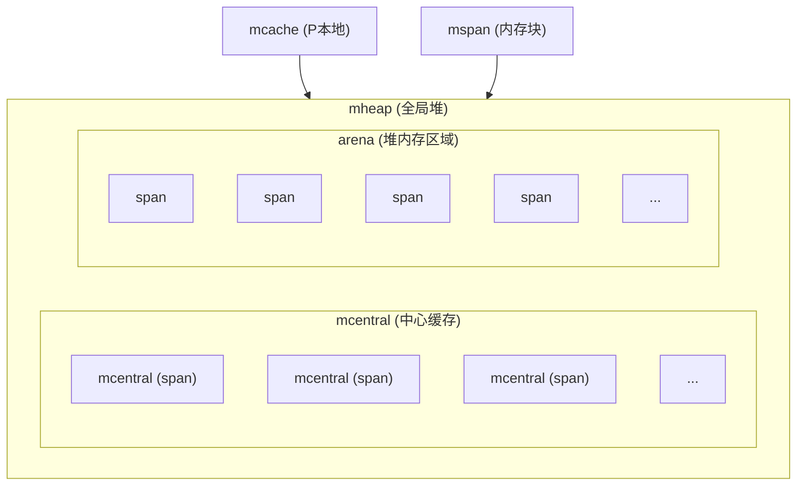

## 组件关系图

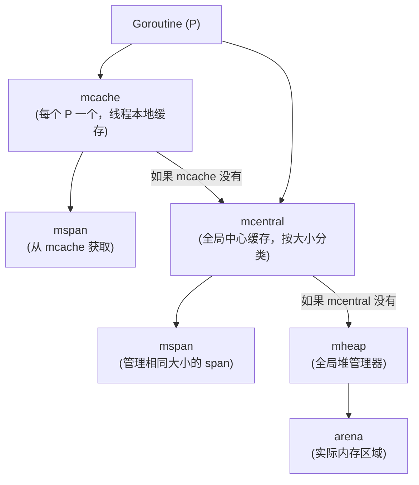

# 核心组件详解

## 1. mspan (内存块)

`mspan` 是内存分配的基本单位，代表一块连续的内存区域。

### 结构定义（简化）

```go
type mspan struct {
    next        *mspan      // 链表中的下一个 span
    prev        *mspan      // 链表中的上一个 span
    
    startAddr   uintptr     // span 的起始地址
    npages      uintptr     // span 包含的页数
    nelems      uintptr     // span 中对象数量
    elemsize    uintptr     // 每个对象的大小
    
    allocCount  uint16      // 已分配的对象数量
    freeindex   uintptr     // 下一个空闲对象的索引
    
    allocBits   *gcBits     // 分配位图
    gcmarkBits  *gcBits     // GC 标记位图
    
    spanclass   spanClass   // span 的类别
    state       mSpanStateBox // span 的状态
}
```

### mspan 的作用

1. **内存块管理**: 管理一块连续的内存区域
2. **对象分配**: 从 span 中分配固定大小的对象
3. **状态跟踪**: 跟踪哪些对象已分配，哪些空闲
4. **GC 支持**: 支持垃圾回收的标记和扫描

### span 的大小分类

Go 将对象按大小分为多个类别（spanclass）：

```text
类别 0:  0-8 字节
类别 1:  9-16 字节
类别 2:  17-24 字节
类别 3:  25-32 字节
...
类别 66: 32KB-64KB
类别 67: 大对象（>64KB，直接从 mheap 分配）
```

### span 的状态

```go
type mSpanState uint8

const (
    mSpanDead   mSpanState = iota  // 已释放
    mSpanInUse                     // 正在使用
    mSpanManual                    // 手动管理
    mSpanFree                      // 空闲
)
```

## 2. mcache (线程本地缓存)

`mcache` 是每个 P（Processor）的本地缓存，用于快速分配小对象。

### 结构定义（简化）

```go
type mcache struct {
    // 小对象分配器（按 spanclass 分类）
    alloc [numSpanClasses]*mspan
    
    // 其他字段...
    tiny             uintptr      // 微小对象分配器
    tinyoffset       uintptr
    local_tinyallocs uintptr
    
    // 统计信息
    nextSample       uintptr
    local_scan       uintptr
}
```

### mcache 的特点

1. **线程本地**: 每个 P 有独立的 mcache，无需加锁
2. **快速分配**: 直接从 mcache 分配，无需访问全局结构
3. **按类缓存**: 为每个 spanclass 缓存一个 span
4. **自动补充**: 当 span 用完时，从 mcentral 获取新的 span

### mcache 的分配流程

1. 检查 mcache.alloc[spanclass] 是否有空闲对象
2. 如果有，直接分配
3. 如果没有，从 mcentral 获取新的 span
4. 将新 span 放入 mcache，然后分配

## 3. mcentral (中心缓存)

`mcentral` 是全局的中心缓存，管理特定大小的 span。

### 结构定义（简化）

```go
type mcentral struct {
    spanclass spanClass      // span 的类别
    
    // 非空 span 链表（有可用对象）
    nonempty mSpanList
    
    // 空 span 链表（所有对象都已分配）
    empty    mSpanList
    
    // 锁保护
    lock mutex
}
```

### mcentral 的作用

1. **集中管理**: 集中管理特定大小的 span
2. **缓存复用**: 缓存已分配的 span，供多个 P 复用
3. **内存回收**: 当 span 完全空闲时，可以归还给 mheap
4. **并发控制**: 使用锁保护，支持多 P 并发访问

### mcentral 的分配流程

1. 加锁
2. 从 nonempty 链表中获取一个 span
3. 如果 span 分配完，移到 empty 链表
4. 解锁
5. 返回 span 给 mcache


## 4. mheap (全局堆)

`mheap` 是全局的堆管理器，管理所有的内存页和 span。

### 结构定义（简化）

```go
type mheap struct {
    // 中心缓存数组（按 spanclass 分类）
    central [numSpanClasses]struct {
        mcentral mcentral
        pad      [cpu.CacheLinePadSize - unsafe.Sizeof(mcentral{})%cpu.CacheLinePadSize]byte
    }
    
    // 页分配器
    pages pageAlloc
    
    // arena 区域
    arenas [1 << arenaL1Bits]*[1 << arenaL2Bits]*heapArena
    
    // 大对象分配
    largefree  mTreap
    largealloc mTreap
    
    // 锁
    lock mutex
}
```

### mheap 的功能

1. **内存页管理**: 管理所有的内存页（page）
2. **span 分配**: 从空闲页中分配新的 span
3. **大对象分配**: 直接分配大对象（>32KB）
4. **内存回收**: 回收空闲的 span 和页
5. **arena 管理**: 管理实际的堆内存区域

### arena 结构

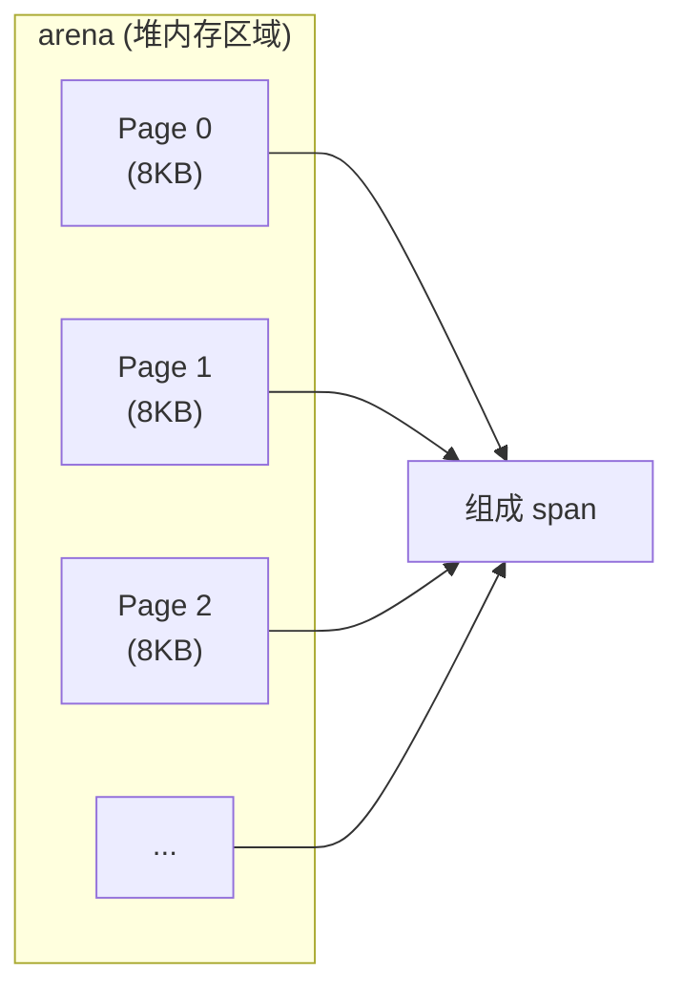

# 内存分配流程

## 小对象分配（<32KB）

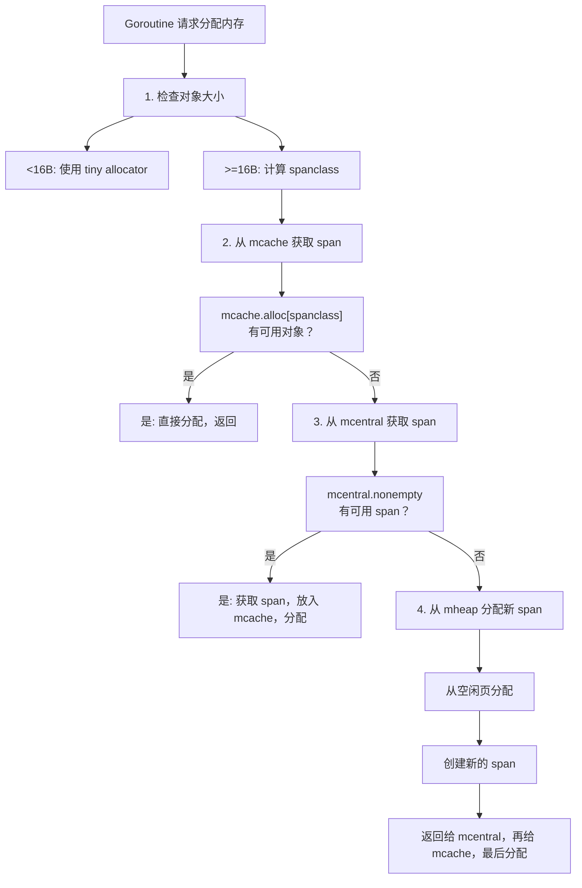

### 代码示例（简化流程）

```go
// 伪代码展示分配流程
func mallocgc(size uintptr, typ *_type, needzero bool) unsafe.Pointer {
    // 1. 微小对象分配
    if size < maxTinySize {
        // 使用 tiny allocator
        return tinyAlloc(size)
    }
    
    // 2. 计算 spanclass
    spanclass := size_to_class(size)
    
    // 3. 从 mcache 获取
    span := getg().m.p.ptr().mcache.alloc[spanclass]
    if span == nil || span.freeindex >= span.nelems {
        // 4. mcache 没有，从 mcentral 获取
        span = mheap_.central[spanclass].mcentral.cacheSpan()
        getg().m.p.ptr().mcache.alloc[spanclass] = span
    }
    
    // 5. 从 span 分配对象
    obj := span.alloc()
    return obj
}
```

## 大对象分配（>=32KB）

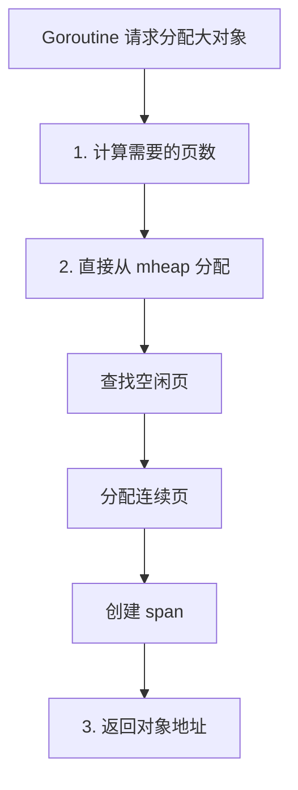

### 大对象分配特点

- **直接分配**: 不经过 mcache 和 mcentral
- **页对齐**: 按页（8KB）对齐分配
- **独立管理**: 大对象 span 单独管理
- **GC 友好**: 大对象更容易被 GC 回收

# 组件之间的交互关系

## 1. mcache ↔ mcentral

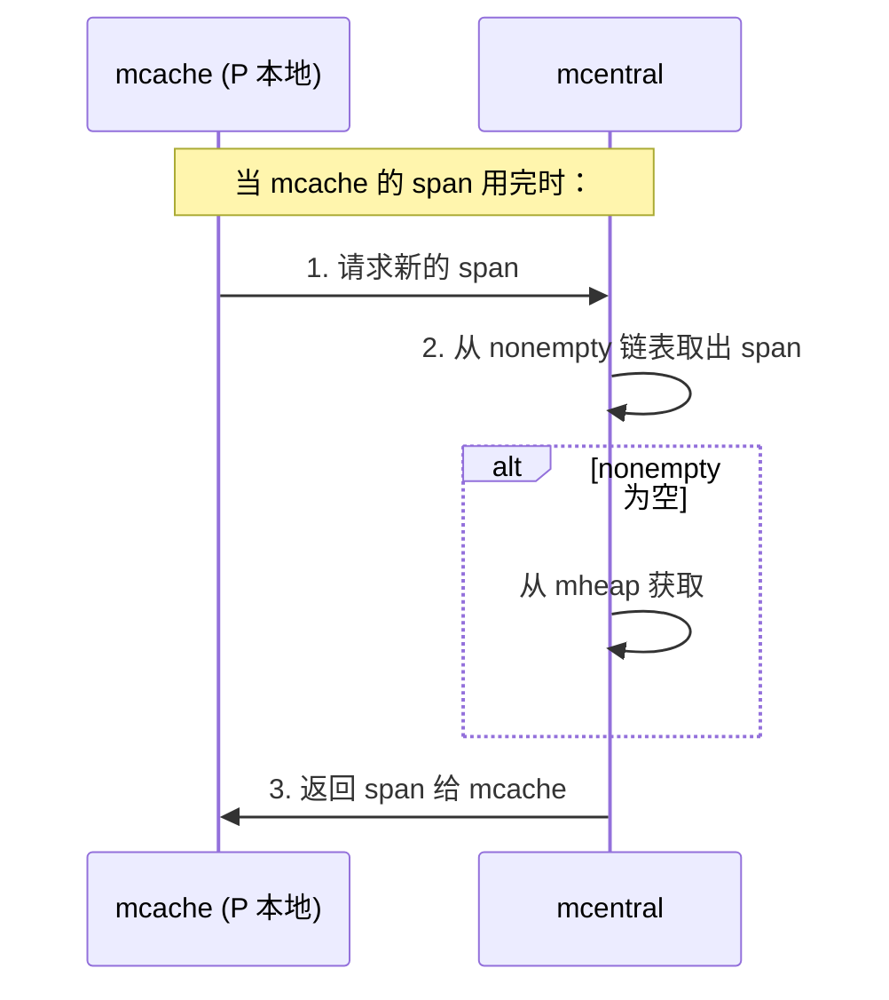

## 2. mcentral ↔ mheap

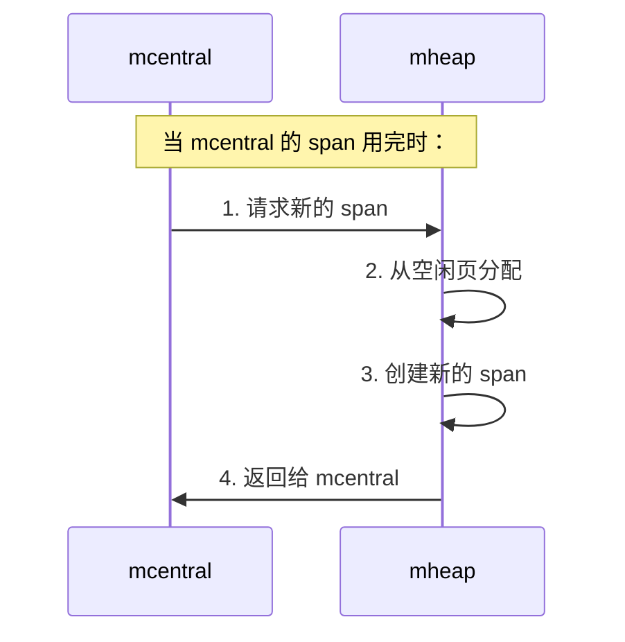

## 3. mheap ↔ arena

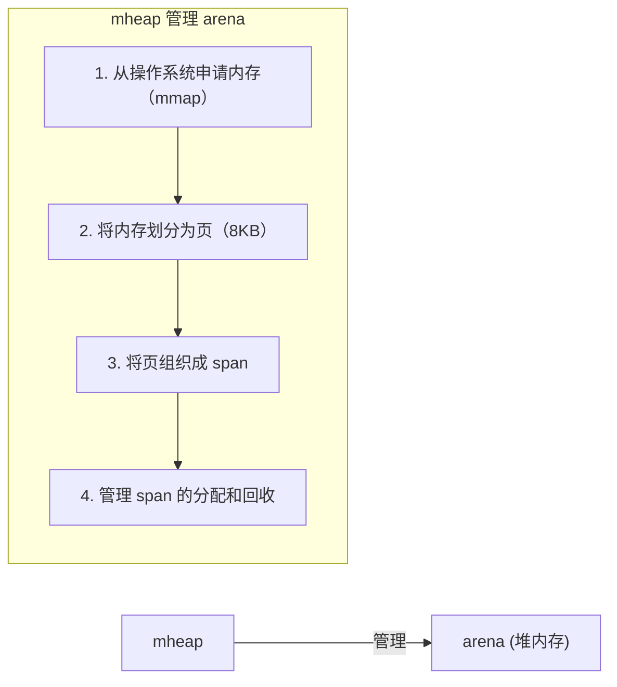

## 完整交互流程图

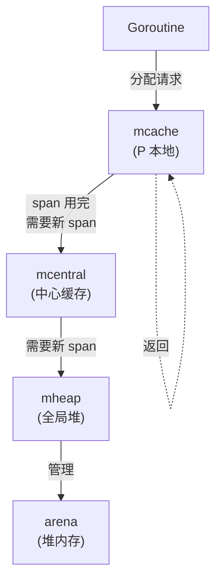

# 内存分配优化策略

## 1. 分级分配

根据对象大小使用不同的分配策略：

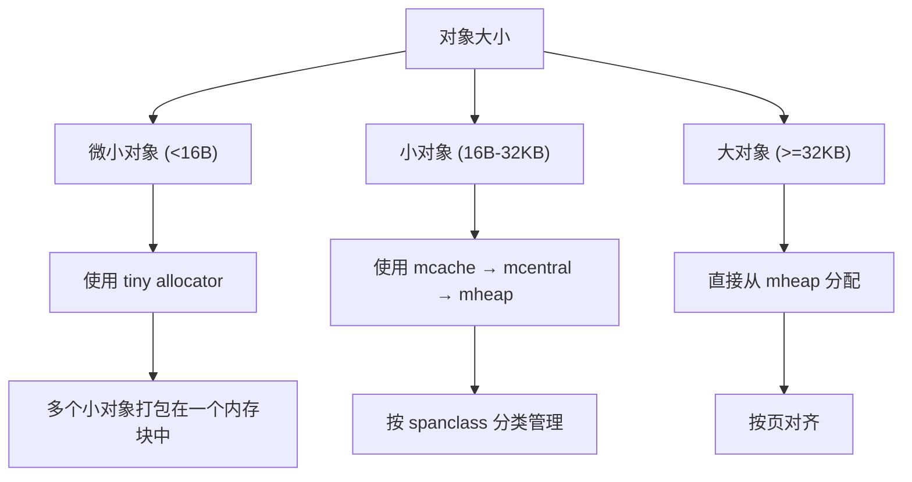

## 2. 多级缓存

减少锁竞争，提高并发性能：

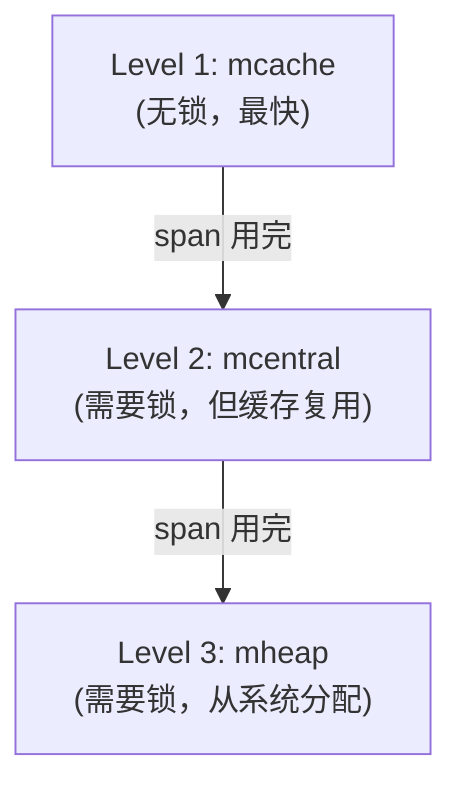

## 3. 内存池化

复用已分配的内存，减少系统调用：


## 4. 按需分配

延迟分配，减少内存占用：


# 内存回收机制

## GC 与内存分配器的协作

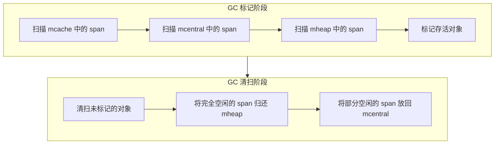

## span 的生命周期

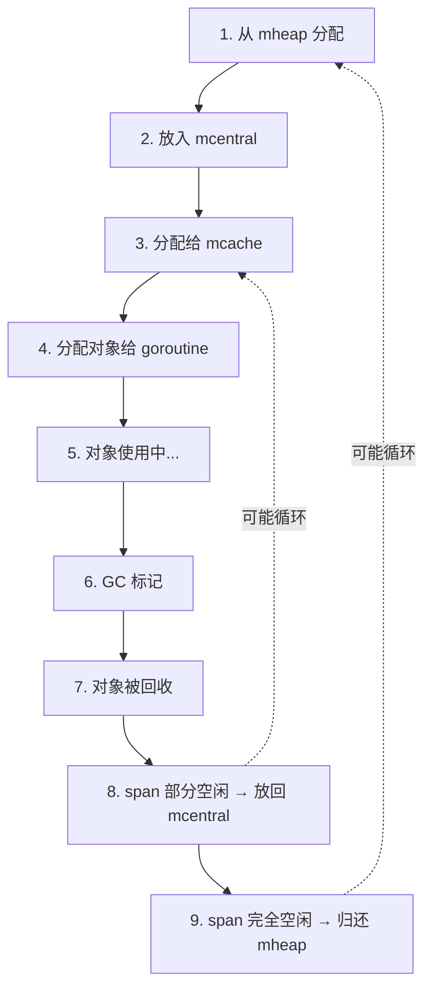

# 实际应用和优化

## 1. 减少内存分配

### 对象池（sync.Pool）

```go
package main

import (
    "sync"
)

var pool = sync.Pool{
    New: func() interface{} {
        return make([]byte, 1024)
    },
}

func main() {
    // 从池中获取
    buf := pool.Get().([]byte)
    defer pool.Put(buf) // 归还到池中
    
    // 使用 buf
    // ...
}
```

### 预分配切片容量

```go
// 不好：频繁扩容
var s []int
for i := 0; i < 1000; i++ {
    s = append(s, i) // 可能多次扩容
}

// 好：预分配容量
s := make([]int, 0, 1000)
for i := 0; i < 1000; i++ {
    s = append(s, i) // 不会扩容
}
```

## 2. 理解内存分配行为

### 查看内存分配

```go
package main

import (
    "runtime"
    "fmt"
)

func main() {
    var m1, m2 runtime.MemStats
    
    runtime.GC()
    runtime.ReadMemStats(&m1)
    
    // 执行代码
    data := make([]byte, 1024*1024)
    _ = data
    
    runtime.GC()
    runtime.ReadMemStats(&m2)
    
    fmt.Printf("分配的内存: %d KB\n", (m2.TotalAlloc-m1.TotalAlloc)/1024)
    fmt.Printf("分配次数: %d\n", m2.Mallocs-m1.Mallocs)
}
```

### 使用 pprof 分析

```bash
# 获取内存 profile
go tool pprof http://localhost:6060/debug/pprof/heap

# 分析内存分配
(pprof) top
(pprof) list 函数名
```

## 3. 优化建议

### 避免频繁的小对象分配

```go
// 不好：每次分配新的字符串
func process(data []byte) {
    s := string(data) // 分配新内存
    // ...
}

// 好：复用缓冲区
var buf []byte
func process(data []byte) {
    buf = append(buf[:0], data...) // 复用
    // ...
}
```

### 使用值类型而非指针

```go
// 小结构体使用值类型
type Point struct {
    X, Y int
}

// 值类型：在栈上分配，无需 GC
func useValue(p Point) {
    // ...
}

// 指针类型：在堆上分配，需要 GC
func usePointer(p *Point) {
    // ...
}
```

### 减少指针的使用

```go
// 不好：大量指针
type Node struct {
    Children []*Node // 指针数组
}

// 好：使用索引
type Node struct {
    Children []int // 索引数组
}
```

# 内存分配器调优

## 1. GOGC 参数

控制 GC 的频率：

```bash
# 默认值：100
# 表示：当堆内存增长 100% 时触发 GC
export GOGC=100

# 更积极的 GC（更频繁）
export GOGC=50

# 更宽松的 GC（更少 GC）
export GOGC=200
```

## 2. 内存限制

```bash
# 设置最大内存使用
export GOMEMLIMIT=2GiB
```

## 3. 调试内存分配

```go
package main

import (
    "runtime"
    "runtime/debug"
)

func main() {
    // 设置 GC 目标百分比
    debug.SetGCPercent(100)
    
    // 强制 GC
    runtime.GC()
    
    // 查看内存统计
    var m runtime.MemStats
    runtime.ReadMemStats(&m)
    fmt.Printf("堆内存: %d KB\n", m.HeapAlloc/1024)
}
```

# 常见问题

## 1. 内存泄漏

### 检测方法

```go
// 定期检查内存增长
func checkMemoryLeak() {
    var m runtime.MemStats
    for {
        runtime.ReadMemStats(&m)
        fmt.Printf("堆内存: %d MB\n", m.HeapInuse/1024/1024)
        time.Sleep(5 * time.Second)
    }
}
```

### 使用 pprof

```bash
# 对比两个时间点的 heap profile
curl http://localhost:6060/debug/pprof/heap > heap1.prof
sleep 60
curl http://localhost:6060/debug/pprof/heap > heap2.prof

# 对比分析
go tool pprof -base heap1.prof heap2.prof
```

## 2. 内存碎片

内存碎片会导致：
- 无法分配大块连续内存
- 内存使用率低
- GC 压力增大

**解决方案：**
- 使用对象池减少分配
- 预分配大块内存
- 定期整理内存

## 3. GC 压力大

**表现：**
- GC 时间占比高
- 程序响应慢
- CPU 使用率高

**解决方案：**
- 减少内存分配
- 使用对象池
- 调整 GOGC 参数
- 优化数据结构

# 总结

Go 内存分配器的核心特点：

1. **分级分配**: 根据对象大小使用不同策略
2. **多级缓存**: mcache → mcentral → mheap
3. **并发优化**: 每个 P 有独立的 mcache，减少锁竞争
4. **内存复用**: span 可以复用，减少系统调用
5. **GC 友好**: 与 GC 紧密协作，高效回收内存

**核心组件关系：**

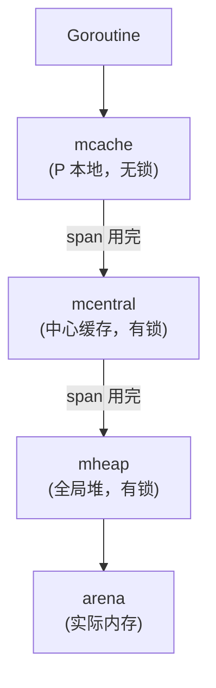

**优化建议：**

1. 减少内存分配（使用对象池、预分配）
2. 减少指针使用（减少 GC 压力）
3. 理解分配行为（使用 pprof 分析）
4. 合理设置 GC 参数（GOGC、GOMEMLIMIT）

理解 Go 内存分配器的工作原理，有助于编写高性能的 Go 程序，减少内存分配和 GC 压力。

