推荐阅读：[Go Memory Allocator](https://go.dev/src/runtime/malloc.go)

# Golang 内存分配器概述

Go 语言的内存分配器是一个高性能的内存管理系统，它采用了**分级分配**和**多级缓存**的设计，能够高效地管理内存分配和回收。

## 设计目标

1. **高性能**: 减少内存分配和回收的开销
2. **低延迟**: 快速响应内存分配请求
3. **内存效率**: 减少内存碎片和浪费
4. **并发安全**: 支持多 goroutine 并发分配

## 核心设计思想

- **分级分配**: 根据对象大小使用不同的分配策略
- **多级缓存**: 使用线程本地缓存减少锁竞争
- **内存池化**: 复用已分配的内存块
- **按需分配**: 延迟分配，减少内存占用

# 核心组件架构

Go 内存分配器由以下核心组件组成：

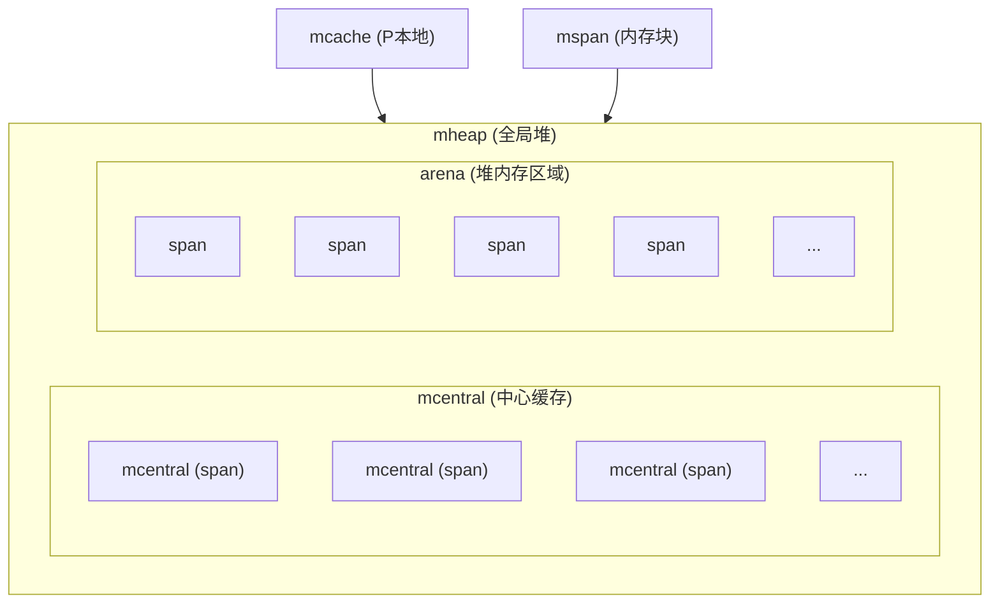
```mermaid
graph TB
    subgraph mheap["mheap (全局堆)"]
        subgraph mcentral_group["mcentral (中心缓存)"]
            mc1["mcentral (span)"]
            mc2["mcentral (span)"]
            mc3["mcentral (span)"]
            mcn["..."]
        end
        subgraph arena_group["arena (堆内存区域)"]
            s1["span"]
            s2["span"]
            s3["span"]
            s4["span"]
            sn["..."]
        end
    end
    
    mcache["mcache (P本地)"]
    mspan["mspan (内存块)"]
    
    mcache --> mheap
    mspan --> mheap
```

## 组件关系图

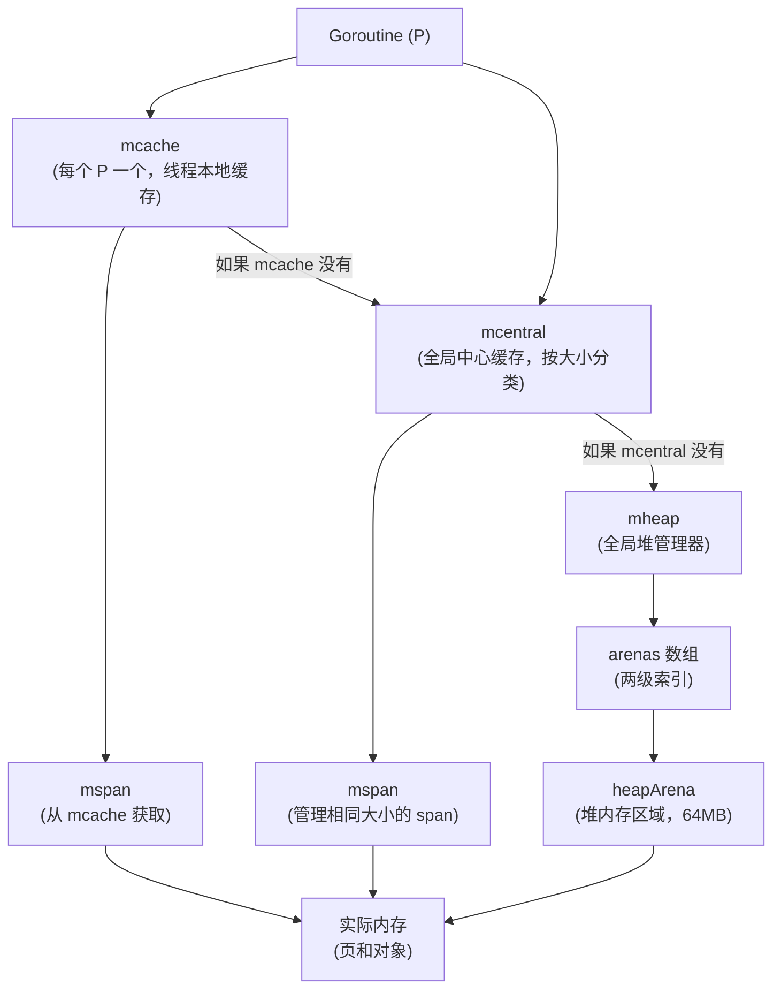
```mermaid
flowchart TD
    P["Goroutine (P)"]
    mcache["mcache<br/>(每个 P 一个，线程本地缓存)"]
    mspan1["mspan<br/>(从 mcache 获取)"]
    mcentral["mcentral<br/>(全局中心缓存，按大小分类)"]
    mspan2["mspan<br/>(管理相同大小的 span)"]
    mheap["mheap<br/>(全局堆管理器)"]
    arenas["arenas 数组<br/>(两级索引)"]
    heapArena["heapArena<br/>(堆内存区域，64MB)"]
    memory["实际内存<br/>(页和对象)"]
    
    P --> mcache
    mcache --> mspan1
    mcache -->|如果 mcache 没有| mcentral
    P --> mcentral
    mcentral --> mspan2
    mcentral -->|如果 mcentral 没有| mheap
    mheap --> arenas
    arenas --> heapArena
    heapArena --> memory
    mspan1 --> memory
    mspan2 --> memory
```

# 核心组件详解

## 1. mspan (内存块)

`mspan` 是内存分配的基本单位，代表一块连续的内存区域。

### 结构定义（简化）

```go
type mspan struct {
    next        *mspan      // 链表中的下一个 span
    prev        *mspan      // 链表中的上一个 span
    
    startAddr   uintptr     // span 的起始地址
    npages      uintptr     // span 包含的页数
    nelems      uintptr     // span 中对象数量
    elemsize    uintptr     // 每个对象的大小
    
    allocCount  uint16      // 已分配的对象数量
    freeindex   uintptr     // 下一个空闲对象的索引
    
    allocBits   *gcBits     // 分配位图
    gcmarkBits  *gcBits     // GC 标记位图
    
    spanclass   spanClass   // span 的类别
    state       mSpanStateBox // span 的状态
}
```

### mspan 的作用

1. **内存块管理**: 管理一块连续的内存区域
2. **对象分配**: 从 span 中分配固定大小的对象
3. **状态跟踪**: 跟踪哪些对象已分配，哪些空闲
4. **GC 支持**: 支持垃圾回收的标记和扫描

### span 的大小分类

Go 将对象按大小分为多个类别（spanclass）：

```text
类别 0:  0-8 字节
类别 1:  9-16 字节
类别 2:  17-24 字节
类别 3:  25-32 字节
...
类别 66: 32KB-64KB
类别 67: 大对象（>64KB，直接从 mheap 分配）
```

### span 的状态

```go
type mSpanState uint8

const (
    mSpanDead   mSpanState = iota  // 已释放
    mSpanInUse                     // 正在使用
    mSpanManual                    // 手动管理
    mSpanFree                      // 空闲
)
```

## 2. mcache (线程本地缓存)

`mcache` 是每个 P（Processor）的本地缓存，用于快速分配小对象。

### 结构定义（简化）

```go
type mcache struct {
    // 小对象分配器（按 spanclass 分类）
    alloc [numSpanClasses]*mspan
    
    // 其他字段...
    tiny             uintptr      // 微小对象分配器
    tinyoffset       uintptr
    local_tinyallocs uintptr
    
    // 统计信息
    nextSample       uintptr
    local_scan       uintptr
}
```

### mcache 的特点

1. **线程本地**: 每个 P 有独立的 mcache，无需加锁
2. **快速分配**: 直接从 mcache 分配，无需访问全局结构
3. **按类缓存**: 为每个 spanclass 缓存一个 span
4. **自动补充**: 当 span 用完时，从 mcentral 获取新的 span

### mcache 的分配流程

1. 检查 mcache.alloc[spanclass] 是否有空闲对象
2. 如果有，直接分配
3. 如果没有，从 mcentral 获取新的 span
4. 将新 span 放入 mcache，然后分配

## 3. mcentral (中心缓存)

`mcentral` 是全局的中心缓存，管理特定大小的 span。在 Go 1.18+ 版本中，`mcentral` 结构进行了优化，使用 `partial` 和 `full` 替代了原来的 `nonempty` 和 `empty`，使语义更加清晰。

### 结构定义（简化）

```go
type mcentral struct {
    spanclass spanClass      // span 的类别
    
    // 部分空闲的 span 集合（有可用对象）
    partial [2]spanSet       // 两个 spanSet，用于无锁操作
    
    // 完全分配的 span 集合（所有对象都已分配）
    full    [2]spanSet       // 两个 spanSet，用于无锁操作
}
```

**注意：** 在最新的 Go 实现中，`mcentral` 已经移除了 `lock` 字段，因为 `spanSet` 是完全无锁的数据结构，不需要额外的锁保护。

### spanSet 结构

`spanSet` 是 Go 1.18+ 引入的无锁数据结构，用于高效管理 span 集合。在最新的实现中，`spanSet` 使用原子操作实现完全无锁的队列：

```go
type spanSet struct {
    // 无锁队列的头尾指针（原子操作，打包在一个 uint64 中）
    headTail atomic.Uint64
    
    // span 数组（环形缓冲区）
    blocks [spanSetBlockEntries]*spanSetBlock
}

type spanSetBlock struct {
    spans [spanSetBlockEntries]*mspan  // 每个 block 包含多个 span
}

// headTail 的布局：
// [32 bits head][32 bits tail]
// head: 下一个要读取的位置
// tail: 下一个要写入的位置
```

**关键改进：**

1. **原子打包**: `headTail` 是一个 `atomic.Uint64`，将 head 和 tail 打包在一起，保证原子性
2. **无锁操作**: 所有操作都使用原子操作，完全无锁
3. **环形缓冲区**: `blocks` 数组作为环形缓冲区，支持高效的插入和删除
4. **内存对齐**: 结构体经过精心设计，避免 false sharing

### spanSet 的工作原理

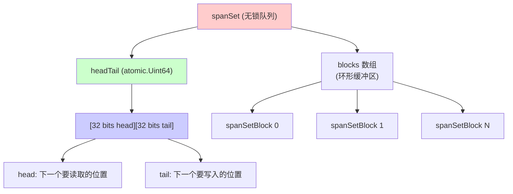
```mermaid
flowchart TD
    A["spanSet (无锁队列)"]
    B["headTail (atomic.Uint64)"]
    B1["[32 bits head][32 bits tail]"]
    D["blocks 数组<br/>(环形缓冲区)"]
    E["spanSetBlock 0"]
    F["spanSetBlock 1"]
    G["spanSetBlock N"]
    
    A --> B
    B --> B1
    A --> D
    D --> E
    D --> F
    D --> G
    
    B1 --> B2["head: 下一个要读取的位置"]
    B1 --> B3["tail: 下一个要写入的位置"]
    
    style A fill:#ffcccc
    style B fill:#ccffcc
    style B1 fill:#ccccff
```

**关键特性：**

1. **完全无锁**: 使用 `atomic.Uint64` 打包 head 和 tail，所有操作都是原子操作
2. **原子打包**: head 和 tail 打包在一个 64 位整数中，保证原子性更新
3. **环形缓冲区**: `blocks` 数组作为环形缓冲区，支持高效的插入和删除（O(1)）
4. **并发安全**: 多个 P 可以并发地从不同的 `spanSet` 中获取 span，无需加锁
5. **内存局部性**: span 连续存储，提高缓存命中率
6. **避免 false sharing**: 结构体设计避免缓存行冲突

### mcentral 的双 spanSet 设计

`mcentral` 使用两个 `spanSet` 数组（`partial` 和 `full`），每个数组包含 2 个 `spanSet`：

```go
partial [2]spanSet  // 两个 spanSet，用于无锁操作
full    [2]spanSet  // 两个 spanSet，用于无锁操作
```

**为什么使用两个 spanSet？**

1. **减少竞争**: 两个 `spanSet` 可以并行操作，减少竞争
2. **负载均衡**: 根据 P 的 ID 选择不同的 `spanSet`，分散负载
3. **性能优化**: 避免所有 P 都访问同一个 `spanSet` 造成的热点

### mcentral 的作用

1. **集中管理**: 集中管理特定大小的 span
2. **缓存复用**: 缓存已分配的 span，供多个 P 复用
3. **内存回收**: 当 span 完全空闲时，可以归还给 mheap
4. **完全无锁**: 使用无锁的 `spanSet` 结构，**所有操作都是无锁的**，无需任何 mutex
5. **状态分类**: 通过 `partial` 和 `full` 清晰区分 span 状态
6. **高性能并发**: 多个 P 可以并发访问，无锁竞争，性能优异

### mcentral 的分配流程

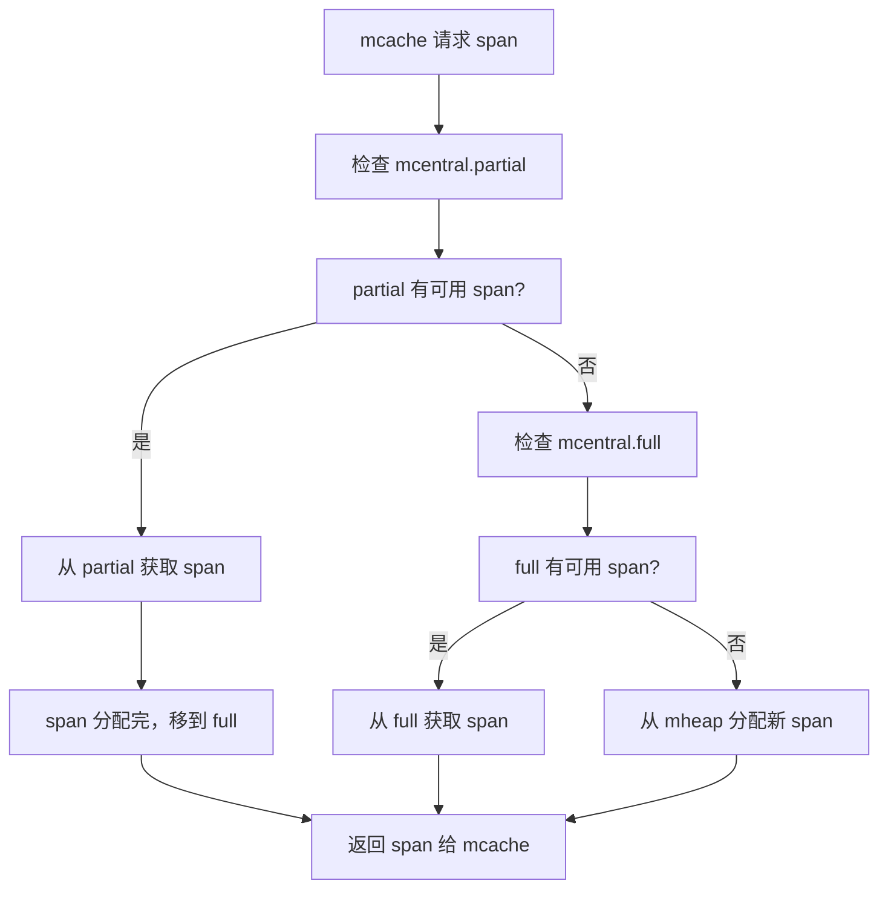
```mermaid
flowchart TD
    Start["mcache 请求 span"]
    Check["检查 mcentral.partial"]
    HasPartial["partial 有可用 span?"]
    GetPartial["从 partial 获取 span"]
    MoveToFull["span 分配完，移到 full"]
    CheckFull["检查 mcentral.full"]
    HasFull["full 有可用 span?"]
    GetFull["从 full 获取 span"]
    CheckMheap["从 mheap 分配新 span"]
    Return["返回 span 给 mcache"]
    
    Start --> Check
    Check --> HasPartial
    HasPartial -->|是| GetPartial
    HasPartial -->|否| CheckFull
    GetPartial --> MoveToFull
    MoveToFull --> Return
    CheckFull --> HasFull
    HasFull -->|是| GetFull
    HasFull -->|否| CheckMheap
    GetFull --> Return
    CheckMheap --> Return
```

**详细步骤：**

1. **选择 spanSet**: 根据当前 P 的 ID 选择 `partial[P.id % 2]` 或 `full[P.id % 2]`，实现负载均衡
2. **优先从 partial 获取**: 尝试从选定的 `partial` spanSet 中获取有可用对象的 span（**完全无锁操作**）
3. **原子操作**: 使用 `spanSet.pop()` 原子地获取 span，无需任何锁
4. **状态转换**: 如果 span 分配完，使用 `spanSet.push()` 原子地将其移到对应的 `full` spanSet
5. **回退到 full**: 如果 `partial` 为空，尝试从对应的 `full` spanSet 中获取（可能有些对象被 GC 释放）
6. **从 mheap 分配**: 如果都没有，从 `mheap` 分配新的 span（这里可能需要锁，因为 mheap 有锁）
7. **返回给 mcache**: 将获取的 span 返回给 `mcache`

**关键点：**

- **mcentral 操作完全无锁**: 所有对 `partial` 和 `full` spanSet 的操作都是无锁的
- **原子操作保证**: 使用 `atomic.Uint64` 的 CAS（Compare-And-Swap）操作保证原子性
- **高性能**: 无锁设计避免了锁竞争，显著提升了并发性能

**spanSet 选择策略：**

```go
// 伪代码：选择 spanSet
func (c *mcentral) selectSpanSet() (partial, full *spanSet) {
    pid := getg().m.p.ptr().id
    idx := pid % 2  // 根据 P 的 ID 选择索引
    return &c.partial[idx], &c.full[idx]
}
```

这样可以确保：
- 不同的 P 访问不同的 `spanSet`，减少竞争
- 负载分散，避免热点
- 保持无锁操作的高性能

### spanSet 的核心操作

`spanSet` 提供两个核心操作，都是完全无锁的：

```go
// 从 spanSet 中弹出一个 span（无锁）
func (s *spanSet) pop() *mspan {
    // 使用原子操作读取 headTail
    headTail := s.headTail.Load()
    head := headTail & ((1 << 32) - 1)  // 低 32 位是 head
    tail := headTail >> 32               // 高 32 位是 tail
    
    // 如果队列为空
    if head == tail {
        return nil
    }
    
    // 计算 block 索引和 span 索引
    blockIdx := head / spanSetBlockEntries
    spanIdx := head % spanSetBlockEntries
    
    // 获取 span
    span := s.blocks[blockIdx].spans[spanIdx]
    
    // 原子地更新 head
    newHead := head + 1
    newHeadTail := (tail << 32) | newHead
    s.headTail.CompareAndSwap(headTail, newHeadTail)
    
    return span
}

// 向 spanSet 中推入一个 span（无锁）
func (s *spanSet) push(span *mspan) {
    // 使用原子操作读取 headTail
    headTail := s.headTail.Load()
    head := headTail & ((1 << 32) - 1)
    tail := headTail >> 32
    
    // 计算 block 索引和 span 索引
    blockIdx := tail / spanSetBlockEntries
    spanIdx := tail % spanSetBlockEntries
    
    // 存储 span
    s.blocks[blockIdx].spans[spanIdx] = span
    
    // 原子地更新 tail
    newTail := tail + 1
    newHeadTail := (newTail << 32) | head
    s.headTail.CompareAndSwap(headTail, newHeadTail)
}
```

**关键点：**

1. **原子读取**: 使用 `Load()` 原子地读取 `headTail`
2. **原子更新**: 使用 `CompareAndSwap()` 原子地更新 `headTail`
3. **无锁保证**: 所有操作都是原子操作，无需 mutex
4. **环形缓冲区**: 通过取模操作实现环形缓冲区

### mcentral.cacheSpan() 方法

`cacheSpan()` 是 `mcentral` 的核心方法，用于从 mcentral 获取 span 给 mcache。该方法**完全无锁**：

```go
// cacheSpan 从 mcentral 获取一个 span 给 mcache（无锁）
func (c *mcentral) cacheSpan() *mspan {
    // 1. 选择 spanSet（根据 P 的 ID）
    pid := getg().m.p.ptr().id
    partial := &c.partial[pid%2]
    full := &c.full[pid%2]
    
    // 2. 优先从 partial 获取（无锁）
    if span := partial.pop(); span != nil {
        // 如果 span 分配完，移到 full
        if span.nelems == span.allocCount {
            full.push(span)  // 无锁操作
        }
        return span
    }
    
    // 3. 如果 partial 为空，尝试从 full 获取（无锁）
    if span := full.pop(); span != nil {
        // 检查是否有对象被释放
        if span.allocCount < span.nelems {
            // 有可用对象，放回 partial
            partial.push(span)  // 无锁操作
            return span
        }
        // 仍然完全分配，放回 full
        full.push(span)  // 无锁操作
    }
    
    // 4. 如果都没有，从 mheap 分配新 span（这里需要锁）
    return c.grow()  // 调用 mheap，可能需要锁
}
```

**关键点：**

1. **完全无锁**: 所有对 `partial` 和 `full` 的操作都是无锁的
2. **负载均衡**: 根据 P 的 ID 选择不同的 spanSet，减少竞争
3. **状态管理**: 自动管理 span 在 `partial` 和 `full` 之间的转换
4. **回退机制**: 如果 `partial` 为空，会尝试从 `full` 获取（可能有些对象被 GC 释放）

### mcentral 的回收流程

当 span 中的对象被 GC 回收后：

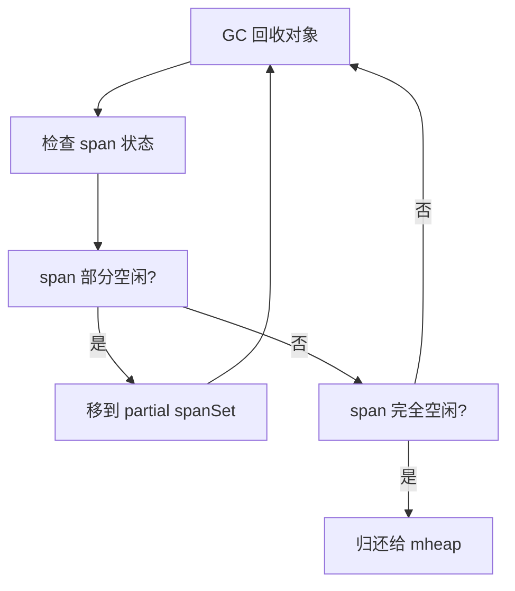
```mermaid
flowchart TD
    Start["GC 回收对象"]
    CheckSpan["检查 span 状态"]
    PartialFree["span 部分空闲?"]
    MoveToPartial["移到 partial spanSet"]
    CompletelyFree["span 完全空闲?"]
    ReturnToMheap["归还给 mheap"]
    
    Start --> CheckSpan
    CheckSpan --> PartialFree
    PartialFree -->|是| MoveToPartial
    PartialFree -->|否| CompletelyFree
    CompletelyFree -->|是| ReturnToMheap
    CompletelyFree -->|否| Start
    MoveToPartial --> Start
```

### partial vs full 的区别

| 特性 | partial | full |
|------|---------|------|
| **对象状态** | 有可用对象 | 所有对象都已分配 |
| **分配来源** | 优先从此获取 | 作为备选 |
| **回收后** | 保持在此 | 移到 partial |
| **完全空闲** | 移到 mheap | 移到 mheap |

### spanSet 的优势

1. **无锁操作**: 使用原子操作，减少锁竞争
2. **高性能**: 环形缓冲区设计，O(1) 插入和删除
3. **并发友好**: 多个 P 可以并发访问不同的 spanSet
4. **内存局部性**: span 数组连续存储，提高缓存命中率

### 新旧版本对比

**旧版本（Go 1.17 及之前）：**
- 使用 `nonempty` 和 `empty` 链表
- 需要全局锁（`lock mutex`）保护
- 链表操作可能较慢
- 锁竞争严重，影响并发性能

**新版本（Go 1.18+）：**
- 使用 `partial` 和 `full` spanSet
- **完全无锁操作**，移除了 `lock` 字段
- 使用原子操作实现并发安全
- 语义更清晰（partial = 部分空闲，full = 完全分配）
- 性能显著提升，特别是在高并发场景下

**性能对比：**

| 特性 | 旧版本 | 新版本 |
|------|--------|--------|
| **锁机制** | 全局 mutex | 完全无锁 |
| **并发性能** | 锁竞争严重 | 无锁，性能更好 |
| **数据结构** | 链表 | spanSet（环形缓冲区） |
| **操作复杂度** | O(n) | O(1) |
| **内存开销** | 较低 | 稍高（但值得） |


## 4. mheap (全局堆)

`mheap` 是全局的堆管理器，管理所有的内存页和 span。

### 结构定义（简化）

```go
type mheap struct {
    // 中心缓存数组（按 spanclass 分类）
    central [numSpanClasses]struct {
        mcentral mcentral
        pad      [cpu.CacheLinePadSize - unsafe.Sizeof(mcentral{})%cpu.CacheLinePadSize]byte
    }
    
    // 页分配器
    pages pageAlloc
    
    // arena 区域
    arenas [1 << arenaL1Bits]*[1 << arenaL2Bits]*heapArena
    
    // 大对象分配
    largefree  mTreap
    largealloc mTreap
    
    // 锁
    lock mutex
}
```

### mheap 的功能

1. **内存页管理**: 管理所有的内存页（page）
2. **span 分配**: 从空闲页中分配新的 span
3. **大对象分配**: 直接分配大对象（>32KB）
4. **内存回收**: 回收空闲的 span 和页
5. **arena 管理**: 通过 `arenas` 数组管理所有的 `heapArena`

### arenas 数组结构

`mheap.arenas` 是一个两级数组，用于快速定位 `heapArena`：

```go
// arenas 数组结构
arenas [1 << arenaL1Bits]*[1 << arenaL2Bits]*heapArena

// 典型值（64位系统）:
// arenaL1Bits = 6  (64个一级索引)
// arenaL2Bits = 13 (8192个二级索引)
// 总共可管理: 64 * 8192 = 524,288 个 arena
// 总内存: 524,288 * 64MB ≈ 32TB (理论值)
```

### arenas 数组的查找

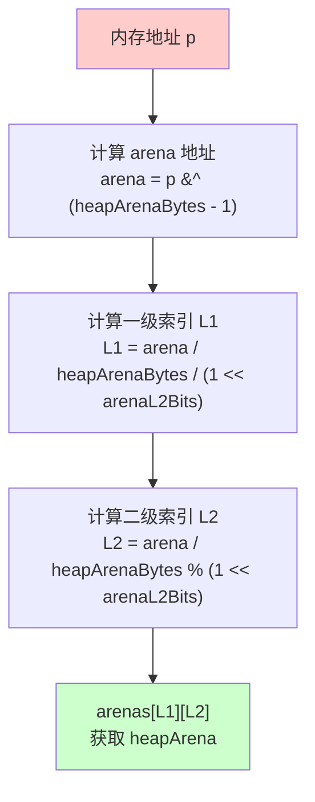
```mermaid
flowchart TD
    A["内存地址 p"]
    B["计算 arena 地址<br/>arena = p &^ (heapArenaBytes - 1)"]
    C["计算一级索引 L1<br/>L1 = arena / heapArenaBytes / (1 << arenaL2Bits)"]
    D["计算二级索引 L2<br/>L2 = arena / heapArenaBytes % (1 << arenaL2Bits)"]
    E["arenas[L1][L2]<br/>获取 heapArena"]
    
    A --> B --> C --> D --> E
    
    style A fill:#ffcccc
    style E fill:#ccffcc
```

### arena 结构

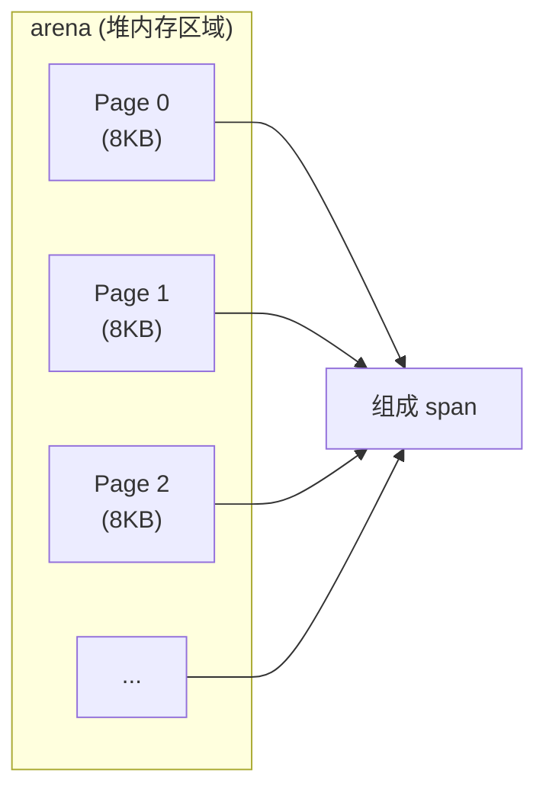
```mermaid
graph LR
    subgraph arena["arena (堆内存区域)"]
        p0["Page 0<br/>(8KB)"]
        p1["Page 1<br/>(8KB)"]
        p2["Page 2<br/>(8KB)"]
        pn["..."]
    end
    
    p0 --> span["组成 span"]
    p1 --> span
    p2 --> span
    pn --> span
```

## 5. heapArena (堆内存区域)

`heapArena` 是 Go 运行时中管理实际堆内存区域的核心结构，每个 `heapArena` 管理一个固定大小的内存区域（通常是 64MB 或 512MB，取决于平台）。

### 结构定义（简化）

```go
type heapArena struct {
    // 位图：标记每个页的分配状态
    bitmap [heapArenaBitmapBytes]byte
    
    // span 映射：记录每个页属于哪个 span
    spans [pagesPerArena]*mspan
    
    // 页分配状态
    pageInUse [pagesPerArena / 8]uint8  // 页使用位图
    pageMarks [pagesPerArena / 8]uint8  // GC 标记位图
    
    // 零基地址（用于快速计算页索引）
    zeroedBase uintptr
}
```

### heapArena 的作用

1. **内存区域管理**: 管理一个固定大小的连续内存区域（arena）
2. **页状态跟踪**: 跟踪每个页的分配状态和使用情况
3. **span 映射**: 记录每个页属于哪个 span，支持快速查找
4. **GC 支持**: 提供位图支持垃圾回收的标记和扫描
5. **内存分配**: 作为实际内存分配的底层存储

### arena 大小

不同平台上的 arena 大小不同：

```text
平台          arena 大小
Linux/AMD64   64MB
Linux/ARM64   64MB
Windows/AMD64 64MB
macOS/AMD64   64MB
32位平台      4MB
```

### heapArena 与 mheap 的关系

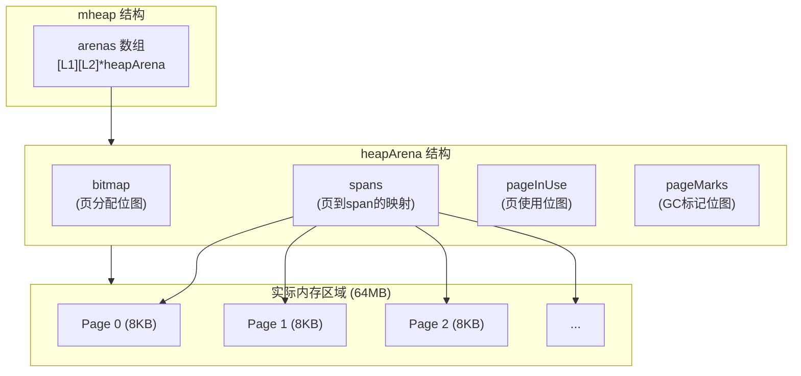
```mermaid
graph TB
    subgraph mheap_structure["mheap 结构"]
        arenas_array["arenas 数组<br/>[L1][L2]*heapArena"]
    end
    
    subgraph arena_structure["heapArena 结构"]
        bitmap["bitmap<br/>(页分配位图)"]
        spans["spans<br/>(页到span的映射)"]
        pageInUse["pageInUse<br/>(页使用位图)"]
        pageMarks["pageMarks<br/>(GC标记位图)"]
    end
    
    subgraph memory["实际内存区域 (64MB)"]
        page0["Page 0 (8KB)"]
        page1["Page 1 (8KB)"]
        page2["Page 2 (8KB)"]
        pagen["..."]
    end
    
    arenas_array --> arena_structure
    arena_structure --> memory
    spans --> page0
    spans --> page1
    spans --> page2
    spans --> pagen
```

### arena 索引计算

`mheap` 使用两级索引来快速定位 `heapArena`：

```go
// arena 索引计算
func (h *mheap) arenaIndex(p uintptr) (l1, l2 uint) {
    // 计算 arena 地址
    arena := p &^ (heapArenaBytes - 1)
    
    // 计算两级索引
    l1 = uint((arena - h.arenaHints[0]) / heapArenaBytes / (1 << arenaL2Bits))
    l2 = uint((arena - h.arenaHints[0]) / heapArenaBytes % (1 << arenaL2Bits))
    
    return l1, l2
}

// 获取 heapArena
func (h *mheap) arena(p uintptr) *heapArena {
    l1, l2 := h.arenaIndex(p)
    return h.arenas[l1][l2]
}
```

### heapArena 的位图管理

`heapArena` 使用位图来高效管理内存：

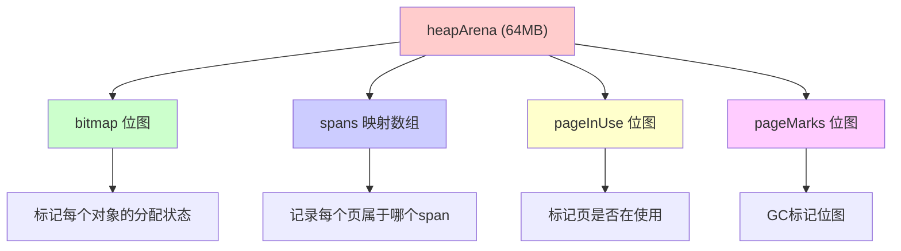
```mermaid
flowchart TD
    A["heapArena (64MB)"]
    B["bitmap 位图"]
    C["spans 映射数组"]
    D["pageInUse 位图"]
    E["pageMarks 位图"]
    
    A --> B
    A --> C
    A --> D
    A --> E
    
    B --> B1["标记每个对象的分配状态"]
    C --> C1["记录每个页属于哪个span"]
    D --> D1["标记页是否在使用"]
    E --> E1["GC标记位图"]
    
    style A fill:#ffcccc
    style B fill:#ccffcc
    style C fill:#ccccff
    style D fill:#ffffcc
    style E fill:#ffccff
```

### heapArena 的内存布局

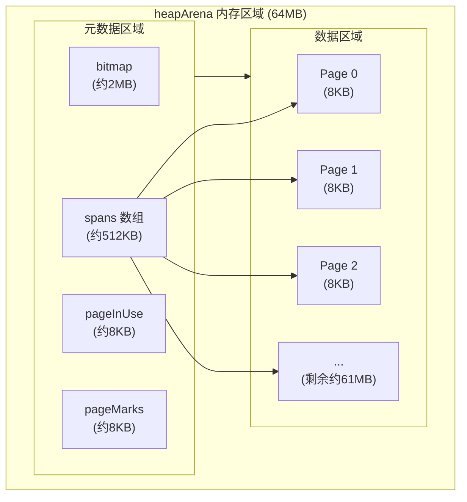
```mermaid
graph TB
    subgraph arena_memory["heapArena 内存区域 (64MB)"]
        subgraph metadata["元数据区域"]
            bitmap_region["bitmap<br/>(约2MB)"]
            spans_region["spans 数组<br/>(约512KB)"]
            pageInUse_region["pageInUse<br/>(约8KB)"]
            pageMarks_region["pageMarks<br/>(约8KB)"]
        end
        
        subgraph data["数据区域"]
            page0_data["Page 0<br/>(8KB)"]
            page1_data["Page 1<br/>(8KB)"]
            page2_data["Page 2<br/>(8KB)"]
            pagen_data["...<br/>(剩余约61MB)"]
        end
    end
    
    metadata --> data
    spans_region --> page0_data
    spans_region --> page1_data
    spans_region --> page2_data
    spans_region --> pagen_data
```

### heapArena 的生命周期

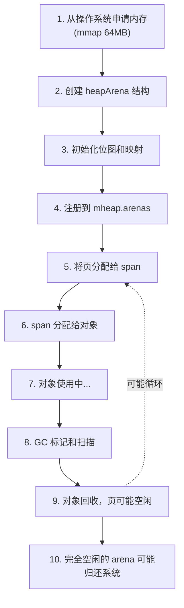
```mermaid
flowchart TD
    S1["1. 从操作系统申请内存<br/>(mmap 64MB)"]
    S2["2. 创建 heapArena 结构"]
    S3["3. 初始化位图和映射"]
    S4["4. 注册到 mheap.arenas"]
    S5["5. 将页分配给 span"]
    S6["6. span 分配给对象"]
    S7["7. 对象使用中..."]
    S8["8. GC 标记和扫描"]
    S9["9. 对象回收，页可能空闲"]
    S10["10. 完全空闲的 arena 可能归还系统"]
    
    S1 --> S2 --> S3 --> S4 --> S5 --> S6 --> S7 --> S8 --> S9 --> S10
    S9 -.->|可能循环| S5
```

### heapArena 的关键操作

#### 1. 查找页所属的 span

```go
// 根据地址查找对应的 span
func (h *mheap) spanOf(p uintptr) *mspan {
    // 获取 arena
    arena := h.arena(p)
    if arena == nil {
        return nil
    }
    
    // 计算页索引
    pageIdx := (p - arena.baseAddr) / pageSize
    
    // 从 spans 数组获取
    return arena.spans[pageIdx]
}
```

#### 2. 标记页为已使用

```go
// 标记页为已使用
func (a *heapArena) setPageInUse(pageIdx uintptr) {
    byteIdx := pageIdx / 8
    bitIdx := pageIdx % 8
    a.pageInUse[byteIdx] |= 1 << bitIdx
}
```

#### 3. 检查页是否在使用

```go
// 检查页是否在使用
func (a *heapArena) isPageInUse(pageIdx uintptr) bool {
    byteIdx := pageIdx / 8
    bitIdx := pageIdx % 8
    return (a.pageInUse[byteIdx] & (1 << bitIdx)) != 0
}
```

### heapArena 与 GC 的协作

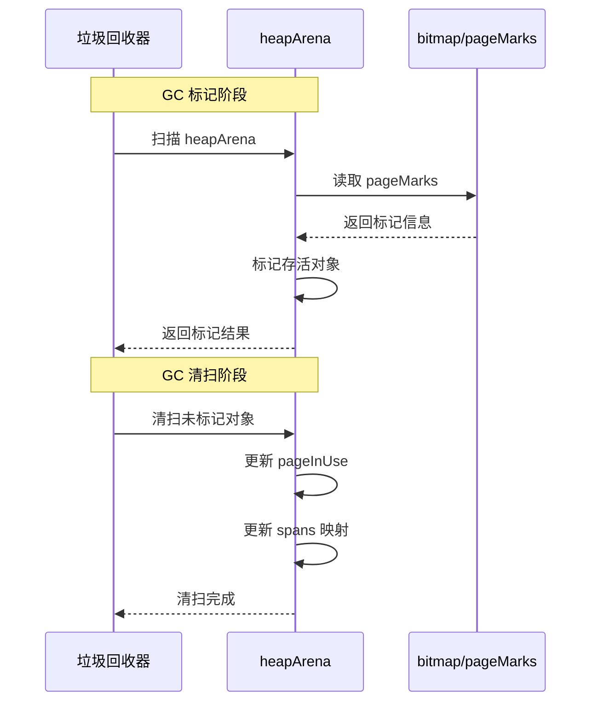
```mermaid
sequenceDiagram
    participant GC as 垃圾回收器
    participant HA as heapArena
    participant Bitmap as bitmap/pageMarks
    
    Note over GC,HA: GC 标记阶段
    GC->>HA: 扫描 heapArena
    HA->>Bitmap: 读取 pageMarks
    Bitmap-->>HA: 返回标记信息
    HA->>HA: 标记存活对象
    HA-->>GC: 返回标记结果
    
    Note over GC,HA: GC 清扫阶段
    GC->>HA: 清扫未标记对象
    HA->>HA: 更新 pageInUse
    HA->>HA: 更新 spans 映射
    HA-->>GC: 清扫完成
```

### heapArena 的优势

1. **快速查找**: 通过两级索引快速定位 arena
2. **位图管理**: 使用位图高效管理内存状态
3. **内存对齐**: arena 大小对齐，便于管理
4. **GC 友好**: 位图支持高效的 GC 标记和扫描
5. **并发安全**: 通过锁保护，支持并发访问

### heapArena 的注意事项

1. **内存开销**: 每个 arena 需要额外的元数据（位图、映射等）
2. **碎片问题**: 如果 arena 中只有少量页在使用，可能造成浪费
3. **系统限制**: 受操作系统虚拟内存限制
4. **平台差异**: 不同平台的 arena 大小可能不同

# 内存分配流程

## 小对象分配（<32KB）


```mermaid
flowchart TD
    Start["Goroutine 请求分配内存"]
    Step1["1. 检查对象大小"]
    Tiny["<16B: 使用 tiny allocator"]
    Calc[">=16B: 计算 spanclass"]
    Step2["2. 从 mcache 获取 span"]
    Check1["mcache.alloc[spanclass]<br/>有可用对象？"]
    Alloc1["是: 直接分配，返回"]
    Step3["3. 从 mcentral 获取 span"]
    Check2["mcentral.partial<br/>有可用 span？"]
    Alloc2["是: 获取 span，放入 mcache，分配"]
    Step4["4. 从 mheap 分配新 span"]
    AllocPage["从空闲页分配"]
    CreateSpan["创建新的 span"]
    Return["返回给 mcentral，再给 mcache，最后分配"]
    
    Start --> Step1
    Step1 --> Tiny
    Step1 --> Calc
    Calc --> Step2
    Step2 --> Check1
    Check1 -->|是| Alloc1
    Check1 -->|否| Step3
    Step3 --> Check2
    Check2 -->|是| Alloc2
    Check2 -->|否| Step4
    Step4 --> AllocPage
    AllocPage --> CreateSpan
    CreateSpan --> Return
```

### 代码示例（简化流程）

```go
// 伪代码展示分配流程
func mallocgc(size uintptr, typ *_type, needzero bool) unsafe.Pointer {
    // 1. 微小对象分配
    if size < maxTinySize {
        // 使用 tiny allocator
        return tinyAlloc(size)
    }
    
    // 2. 计算 spanclass
    spanclass := size_to_class(size)
    
    // 3. 从 mcache 获取
    span := getg().m.p.ptr().mcache.alloc[spanclass]
    if span == nil || span.freeindex >= span.nelems {
        // 4. mcache 没有，从 mcentral 获取（完全无锁操作）
        span = mheap_.central[spanclass].mcentral.cacheSpan()
        getg().m.p.ptr().mcache.alloc[spanclass] = span
    }
    
    // 5. 从 span 分配对象
    obj := span.alloc()
    return obj
}
```

## 大对象分配（>=32KB）

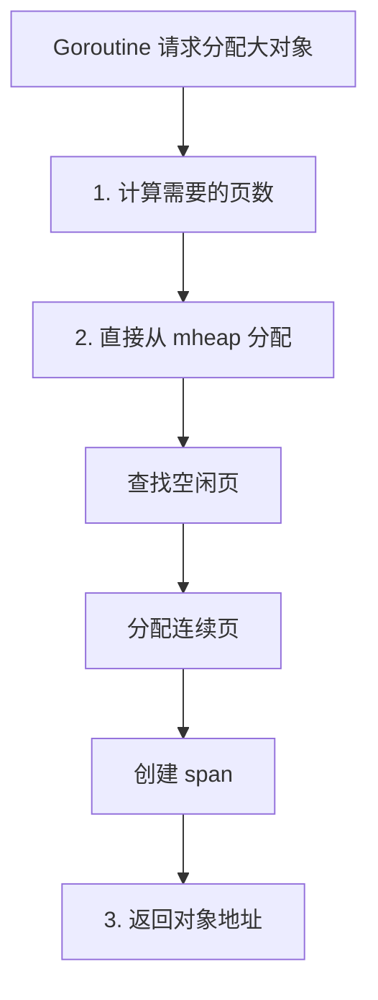
```mermaid
flowchart TD
    Start["Goroutine 请求分配大对象"]
    Step1["1. 计算需要的页数"]
    Step2["2. 直接从 mheap 分配"]
    FindPage["查找空闲页"]
    AllocPage["分配连续页"]
    CreateSpan["创建 span"]
    Step3["3. 返回对象地址"]
    
    Start --> Step1
    Step1 --> Step2
    Step2 --> FindPage
    FindPage --> AllocPage
    AllocPage --> CreateSpan
    CreateSpan --> Step3
```

### 大对象分配特点

- **直接分配**: 不经过 mcache 和 mcentral
- **页对齐**: 按页（8KB）对齐分配
- **独立管理**: 大对象 span 单独管理
- **GC 友好**: 大对象更容易被 GC 回收

# 组件之间的交互关系

## 1. mcache ↔ mcentral

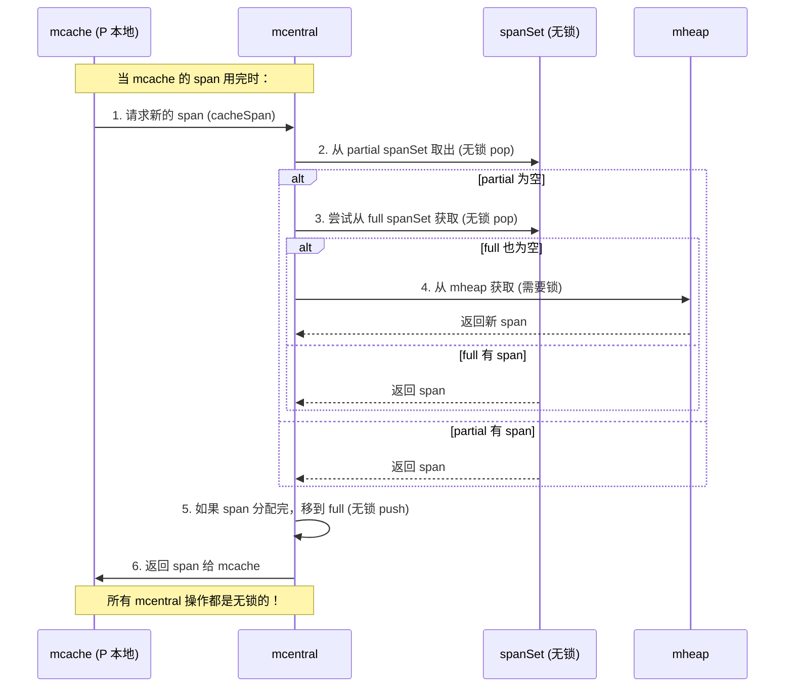
```mermaid
sequenceDiagram
    participant M as mcache (P 本地)
    participant C as mcentral
    participant SS as spanSet (无锁)
    participant H as mheap
    
    Note over M,C: 当 mcache 的 span 用完时：
    M->>C: 1. 请求新的 span (cacheSpan)
    C->>SS: 2. 从 partial spanSet 取出 (无锁 pop)
    alt partial 为空
        C->>SS: 3. 尝试从 full spanSet 获取 (无锁 pop)
        alt full 也为空
            C->>H: 4. 从 mheap 获取 (需要锁)
            H-->>C: 返回新 span
        else full 有 span
            SS-->>C: 返回 span
        end
    else partial 有 span
        SS-->>C: 返回 span
    end
    C->>C: 5. 如果 span 分配完，移到 full (无锁 push)
    C->>M: 6. 返回 span 给 mcache
    
    Note over M,C: 所有 mcentral 操作都是无锁的！
```

## 2. mcentral ↔ mheap

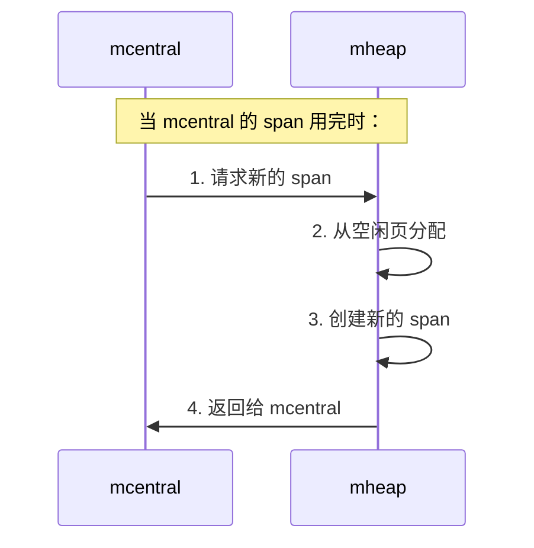
```mermaid
sequenceDiagram
    participant C as mcentral
    participant H as mheap
    
    Note over C,H: 当 mcentral 的 span 用完时：
    C->>H: 1. 请求新的 span
    H->>H: 2. 从空闲页分配
    H->>H: 3. 创建新的 span
    H->>C: 4. 返回给 mcentral
```

## 3. mheap ↔ heapArena

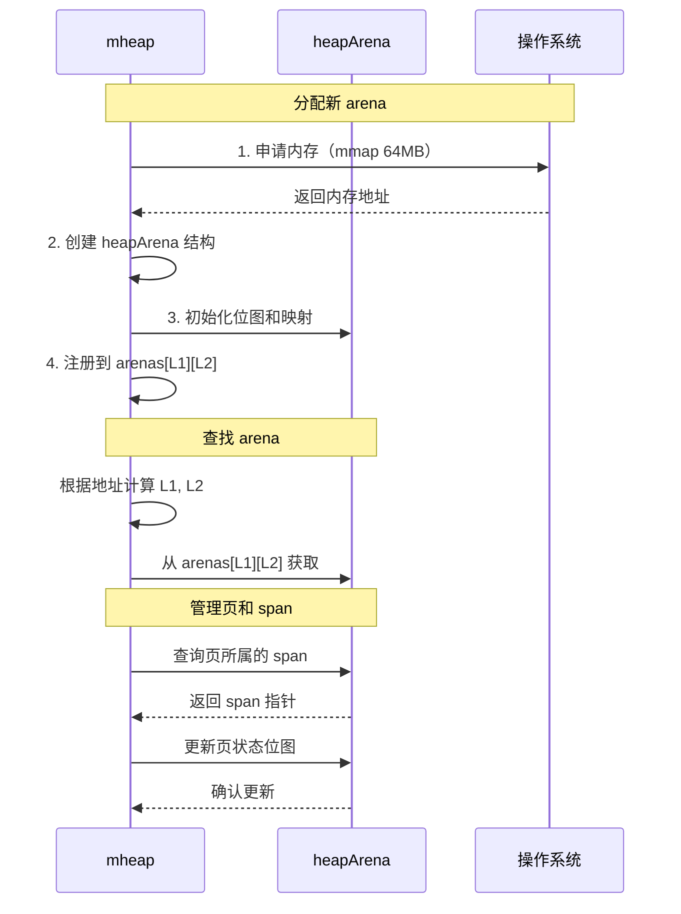
```mermaid
sequenceDiagram
    participant H as mheap
    participant A as heapArena
    participant OS as 操作系统
    
    Note over H,OS: 分配新 arena
    H->>OS: 1. 申请内存（mmap 64MB）
    OS-->>H: 返回内存地址
    H->>H: 2. 创建 heapArena 结构
    H->>A: 3. 初始化位图和映射
    H->>H: 4. 注册到 arenas[L1][L2]
    
    Note over H,A: 查找 arena
    H->>H: 根据地址计算 L1, L2
    H->>A: 从 arenas[L1][L2] 获取
    
    Note over H,A: 管理页和 span
    H->>A: 查询页所属的 span
    A-->>H: 返回 span 指针
    H->>A: 更新页状态位图
    A-->>H: 确认更新
```

### mheap 管理 heapArena 的流程

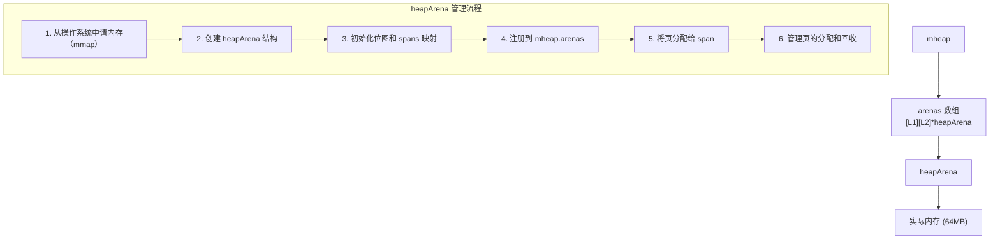
```mermaid
flowchart TD
    H["mheap"]
    Arenas["arenas 数组<br/>[L1][L2]*heapArena"]
    HA["heapArena"]
    Memory["实际内存 (64MB)"]
    
    H --> Arenas
    Arenas --> HA
    HA --> Memory
    
    subgraph Process["heapArena 管理流程"]
        P1["1. 从操作系统申请内存（mmap）"]
        P2["2. 创建 heapArena 结构"]
        P3["3. 初始化位图和 spans 映射"]
        P4["4. 注册到 mheap.arenas"]
        P5["5. 将页分配给 span"]
        P6["6. 管理页的分配和回收"]
        P1 --> P2 --> P3 --> P4 --> P5 --> P6
    end
```

## 完整交互流程图

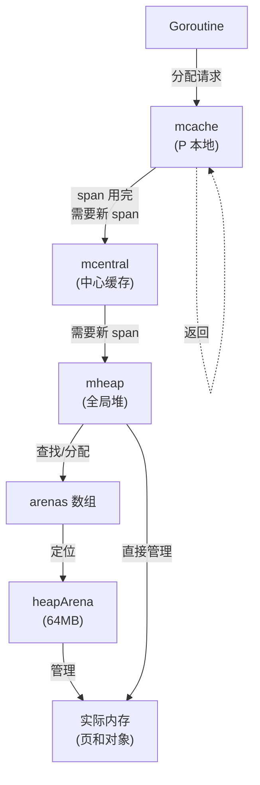
```mermaid
flowchart TD
    G["Goroutine"]
    M["mcache<br/>(P 本地)"]
    C["mcentral<br/>(中心缓存)"]
    H["mheap<br/>(全局堆)"]
    Arenas["arenas 数组"]
    HA["heapArena<br/>(64MB)"]
    Memory["实际内存<br/>(页和对象)"]
    
    G -->|分配请求| M
    M -->|span 用完<br/>需要新 span| C
    M -.->|返回| M
    C -->|需要新 span| H
    H -->|查找/分配| Arenas
    Arenas -->|定位| HA
    HA -->|管理| Memory
    H -->|直接管理| Memory
```

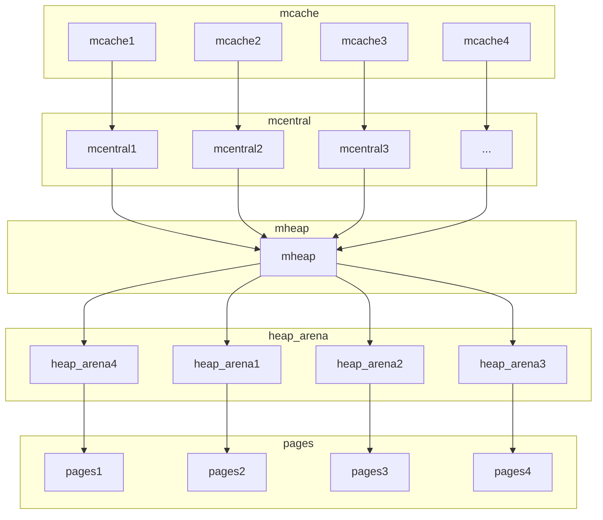
```mermaid
flowchart TB
  subgraph pages [pages]
  pages1
  pages2
  pages3
  pages4
  end
  subgraph heap_arena [heap_arena]
  heap_arena1
  heap_arena2
  heap_arena3
  heap_arena4
  end
  subgraph mheap [mheap]
  mheap1[mheap]
  end
  subgraph mcentral [mcentral]
  mcentral1
  mcentral2
  mcentral3
  mcentral4[...]
  end
  subgraph mcache [mcache]
  mcache1
  mcache2
  mcache3
  mcache4
  end

  heap_arena1 --> pages2
  heap_arena4 --> pages1
  heap_arena2 --> pages3
  heap_arena3 --> pages4
 
  mheap1 --> heap_arena1
  mheap1 --> heap_arena4
  mheap1 --> heap_arena2
  mheap1 --> heap_arena3

  mcentral1 --> mheap1
  mcentral2 --> mheap1
  mcentral3 --> mheap1
  mcentral4 --> mheap1

  mcache1 --> mcentral1
  mcache2 --> mcentral2
  mcache3 --> mcentral3
  mcache4 --> mcentral4
```

# 内存分配优化策略

## 1. 分级分配

根据对象大小使用不同的分配策略：

```mermaid
flowchart TD
    Start["对象大小"]
    Tiny["微小对象 (<16B)"]
    Small["小对象 (16B-32KB)"]
    Large["大对象 (>=32KB)"]
    
    Tiny1["使用 tiny allocator"]
    Tiny2["多个小对象打包在一个内存块中"]
    
    Small1["使用 mcache → mcentral → mheap"]
    Small2["按 spanclass 分类管理"]
    
    Large1["直接从 mheap 分配"]
    Large2["按页对齐"]
    
    Start --> Tiny
    Start --> Small
    Start --> Large
    
    Tiny --> Tiny1
    Tiny1 --> Tiny2
    
    Small --> Small1
    Small1 --> Small2
    
    Large --> Large1
    Large1 --> Large2
```

## 2. 多级缓存

减少锁竞争，提高并发性能：

```mermaid
flowchart TD
    L1["Level 1: mcache<br/>(无锁，最快)"]
    L2["Level 2: mcentral<br/>(需要锁，但缓存复用)"]
    L3["Level 3: mheap<br/>(需要锁，从系统分配)"]
    
    L1 -->|span 用完| L2
    L2 -->|span 用完| L3
```

## 3. 内存池化

复用已分配的内存，减少系统调用：

```mermaid
flowchart LR
    A["已分配的 span"]
    B["使用完"]
    C["归还 mcentral"]
    D["复用"]
    
    A --> B --> C --> D
    D -.->|循环| A
```

## 4. 按需分配

延迟分配，减少内存占用：

```mermaid
flowchart LR
    A["不预先分配所有内存"]
    B["只在需要时从系统申请"]
    
    A --> B
```

# 内存回收机制

## GC 与内存分配器的协作

```mermaid
flowchart TD
    subgraph Mark["GC 标记阶段"]
        M1["扫描 mcache 中的 span"]
        M2["扫描 mcentral 中的 span"]
        M3["扫描 mheap 中的 span"]
        M4["标记存活对象"]
        M1 --> M2 --> M3 --> M4
    end
    
    subgraph Sweep["GC 清扫阶段"]
        S1["清扫未标记的对象"]
        S2["将完全空闲的 span 归还 mheap"]
        S3["将部分空闲的 span 放回 mcentral"]
        S1 --> S2 --> S3
    end
    
    Mark --> Sweep
```

## span 的生命周期

```mermaid
flowchart TD
    S1["1. 从 mheap 分配"]
    S2["2. 放入 mcentral"]
    S3["3. 分配给 mcache"]
    S4["4. 分配对象给 goroutine"]
    S5["5. 对象使用中..."]
    S6["6. GC 标记"]
    S7["7. 对象被回收"]
    S8["8. span 部分空闲 → 放回 mcentral"]
    S9["9. span 完全空闲 → 归还 mheap"]
    
    S1 --> S2 --> S3 --> S4 --> S5 --> S6 --> S7 --> S8 --> S9
    S8 -.->|可能循环| S3
    S9 -.->|可能循环| S1
```

# 实际应用和优化

## 1. 减少内存分配

### 对象池（sync.Pool）

```go
package main

import (
    "sync"
)

var pool = sync.Pool{
    New: func() interface{} {
        return make([]byte, 1024)
    },
}

func main() {
    // 从池中获取
    buf := pool.Get().([]byte)
    defer pool.Put(buf) // 归还到池中
    
    // 使用 buf
    // ...
}
```

### 预分配切片容量

```go
// 不好：频繁扩容
var s []int
for i := 0; i < 1000; i++ {
    s = append(s, i) // 可能多次扩容
}

// 好：预分配容量
s := make([]int, 0, 1000)
for i := 0; i < 1000; i++ {
    s = append(s, i) // 不会扩容
}
```

## 2. 理解内存分配行为

### 查看内存分配

```go
package main

import (
    "runtime"
    "fmt"
)

func main() {
    var m1, m2 runtime.MemStats
    
    runtime.GC()
    runtime.ReadMemStats(&m1)
    
    // 执行代码
    data := make([]byte, 1024*1024)
    _ = data
    
    runtime.GC()
    runtime.ReadMemStats(&m2)
    
    fmt.Printf("分配的内存: %d KB\n", (m2.TotalAlloc-m1.TotalAlloc)/1024)
    fmt.Printf("分配次数: %d\n", m2.Mallocs-m1.Mallocs)
}
```

### 使用 pprof 分析

```bash
# 获取内存 profile
go tool pprof http://localhost:6060/debug/pprof/heap

# 分析内存分配
(pprof) top
(pprof) list 函数名
```

## 3. 优化建议

### 避免频繁的小对象分配

```go
// 不好：每次分配新的字符串
func process(data []byte) {
    s := string(data) // 分配新内存
    // ...
}

// 好：复用缓冲区
var buf []byte
func process(data []byte) {
    buf = append(buf[:0], data...) // 复用
    // ...
}
```

### 使用值类型而非指针

```go
// 小结构体使用值类型
type Point struct {
    X, Y int
}

// 值类型：在栈上分配，无需 GC
func useValue(p Point) {
    // ...
}

// 指针类型：在堆上分配，需要 GC
func usePointer(p *Point) {
    // ...
}
```

### 减少指针的使用

```go
// 不好：大量指针
type Node struct {
    Children []*Node // 指针数组
}

// 好：使用索引
type Node struct {
    Children []int // 索引数组
}
```

# 内存分配器调优

## 1. GOGC 参数

控制 GC 的频率：

```bash
# 默认值：100
# 表示：当堆内存增长 100% 时触发 GC
export GOGC=100

# 更积极的 GC（更频繁）
export GOGC=50

# 更宽松的 GC（更少 GC）
export GOGC=200
```

## 2. 内存限制

```bash
# 设置最大内存使用
export GOMEMLIMIT=2GiB
```

## 3. 调试内存分配

```go
package main

import (
    "runtime"
    "runtime/debug"
)

func main() {
    // 设置 GC 目标百分比
    debug.SetGCPercent(100)
    
    // 强制 GC
    runtime.GC()
    
    // 查看内存统计
    var m runtime.MemStats
    runtime.ReadMemStats(&m)
    fmt.Printf("堆内存: %d KB\n", m.HeapAlloc/1024)
}
```

# 常见问题

## 1. 内存泄漏

### 检测方法

```go
// 定期检查内存增长
func checkMemoryLeak() {
    var m runtime.MemStats
    for {
        runtime.ReadMemStats(&m)
        fmt.Printf("堆内存: %d MB\n", m.HeapInuse/1024/1024)
        time.Sleep(5 * time.Second)
    }
}
```

### 使用 pprof

```bash
# 对比两个时间点的 heap profile
curl http://localhost:6060/debug/pprof/heap > heap1.prof
sleep 60
curl http://localhost:6060/debug/pprof/heap > heap2.prof

# 对比分析
go tool pprof -base heap1.prof heap2.prof
```

## 2. 内存碎片

内存碎片会导致：
- 无法分配大块连续内存
- 内存使用率低
- GC 压力增大

**解决方案：**
- 使用对象池减少分配
- 预分配大块内存
- 定期整理内存

## 3. GC 压力大

**表现：**
- GC 时间占比高
- 程序响应慢
- CPU 使用率高

**解决方案：**
- 减少内存分配
- 使用对象池
- 调整 GOGC 参数
- 优化数据结构

# 总结

Go 内存分配器的核心特点：

1. **分级分配**: 根据对象大小使用不同策略
2. **多级缓存**: mcache → mcentral → mheap
3. **完全无锁的 mcentral**: 使用 `spanSet` 实现完全无锁操作，显著提升并发性能
4. **并发优化**: 每个 P 有独立的 mcache，mcentral 也完全无锁，减少锁竞争
5. **内存复用**: span 可以复用，减少系统调用
6. **GC 友好**: 与 GC 紧密协作，高效回收内存

**核心组件关系：**

```mermaid
flowchart TD
    G["Goroutine"]
    M["mcache<br/>(P 本地，无锁)"]
    C["mcentral<br/>(中心缓存，有锁)"]
    H["mheap<br/>(全局堆，有锁)"]
    Arenas["arenas 数组<br/>(两级索引)"]
    HA["heapArena<br/>(64MB，管理实际内存)"]
    
    G --> M
    M -->|span 用完| C
    C -->|span 用完| H
    H --> Arenas
    Arenas --> HA
```

**heapArena 的关键作用：**

1. **内存区域管理**: 每个 `heapArena` 管理 64MB 的连续内存区域
2. **快速定位**: 通过两级索引 `arenas[L1][L2]` 快速定位
3. **位图管理**: 使用位图高效跟踪页和对象的分配状态
4. **span 映射**: 通过 `spans` 数组快速查找页所属的 span
5. **GC 支持**: 提供位图支持垃圾回收的标记和扫描

**优化建议：**

1. 减少内存分配（使用对象池、预分配）
2. 减少指针使用（减少 GC 压力）
3. 理解分配行为（使用 pprof 分析）
4. 合理设置 GC 参数（GOGC、GOMEMLIMIT）
5. **利用无锁设计**: Go 1.18+ 的 mcentral 完全无锁，高并发场景下性能优异

**最新改进（Go 1.18+）：**

- **mcentral 完全无锁**: 移除了 `lock` 字段，使用 `spanSet` 实现无锁操作
- **性能提升**: 无锁设计显著提升了高并发场景下的内存分配性能
- **更好的并发**: 多个 P 可以并发访问 mcentral，无锁竞争

理解 Go 内存分配器的工作原理，有助于编写高性能的 Go 程序，减少内存分配和 GC 压力。

