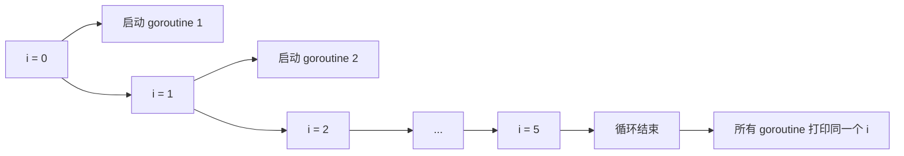
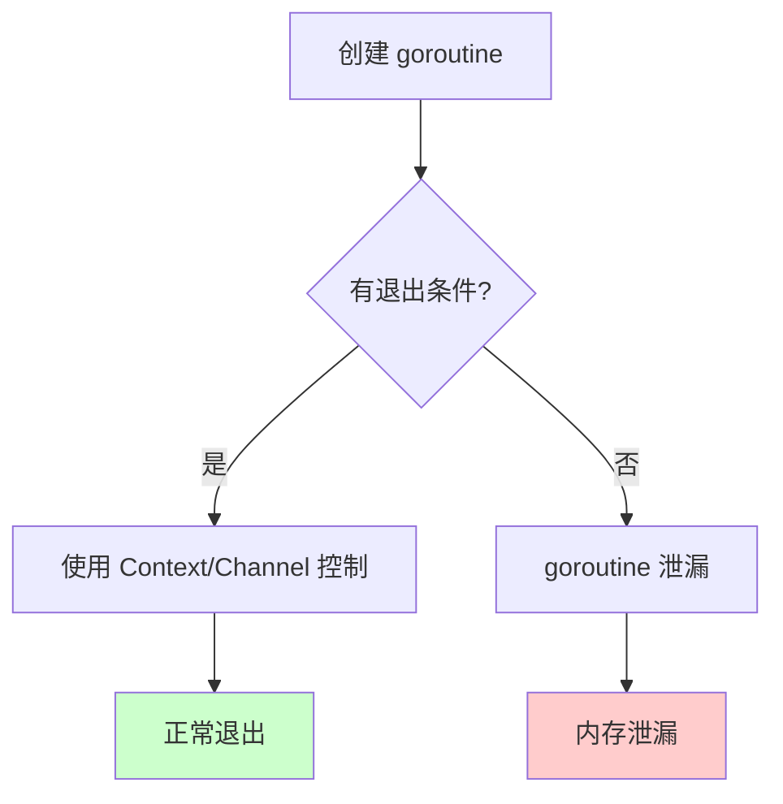

# Go 协程常见代码问题

在使用 Go 协程（goroutine）编写并发程序时，容易遇到各种陷阱与问题。本文汇总常见的协程相关代码问题、原因分析与解决方案。

---

# 一、循环变量捕获问题

## 1.1 问题描述

在 `for` 循环中启动 goroutine 时，闭包捕获的是循环变量的**引用**而非值，导致所有 goroutine 使用同一个变量。

```go
// 错误示例
func main() {
    for i := 0; i < 5; i++ {
        go func() {
            fmt.Println(i)  // 可能全部输出 5
        }()
    }
    time.Sleep(time.Second)
}
```

**输出**（可能）：`5 5 5 5 5`

## 1.2 原因分析



- 循环变量 `i` 在整个循环中只有一个实例
- goroutine 中的闭包捕获的是 `i` 的**地址**
- 当 goroutine 执行时，循环可能已结束，`i` 的值为 5

## 1.3 解决方案

### 方案一：传参（推荐）

```go
func main() {
    for i := 0; i < 5; i++ {
        go func(n int) {
            fmt.Println(n)
        }(i)  // 将 i 的值作为参数传入
    }
    time.Sleep(time.Second)
}
```

### 方案二：局部变量拷贝

```go
func main() {
    for i := 0; i < 5; i++ {
        i := i  // 创建局部副本
        go func() {
            fmt.Println(i)
        }()
    }
    time.Sleep(time.Second)
}
```

### 方案三：Go 1.22+ 自动修复

Go 1.22 之后，`for` 循环的变量在每次迭代时会自动创建新实例，无需手动处理。

---

# 二、竞态条件（Race Condition）

## 2.1 问题描述

多个 goroutine 同时读写共享变量，没有正确同步，导致数据不一致。

```go
// 错误示例
var count int

func main() {
    for i := 0; i < 1000; i++ {
        go func() {
            count++  // 竞态！
        }()
    }
    time.Sleep(time.Second)
    fmt.Println(count)  // 结果小于 1000
}
```

## 2.2 检测方法

使用 `-race` 标志运行程序：

```bash
go run -race main.go
```

## 2.3 解决方案

### 方案一：使用 Mutex

```go
var (
    count int
    mu    sync.Mutex
)

func main() {
    for i := 0; i < 1000; i++ {
        go func() {
            mu.Lock()
            count++
            mu.Unlock()
        }()
    }
    time.Sleep(time.Second)
    fmt.Println(count)  // 1000
}
```

### 方案二：使用 atomic

```go
var count int64

func main() {
    for i := 0; i < 1000; i++ {
        go func() {
            atomic.AddInt64(&count, 1)
        }()
    }
    time.Sleep(time.Second)
    fmt.Println(count)  // 1000
}
```

### 方案三：使用 Channel

```go
func main() {
    ch := make(chan int)
    count := 0
    
    // 单独 goroutine 处理累加
    go func() {
        for range ch {
            count++
        }
    }()
    
    for i := 0; i < 1000; i++ {
        go func() {
            ch <- 1
        }()
    }
    
    time.Sleep(time.Second)
    close(ch)
    time.Sleep(time.Millisecond * 10)
    fmt.Println(count)
}
```

---

# 三、Goroutine 泄漏

## 3.1 问题描述

goroutine 启动后无法正常退出，持续占用资源，导致内存泄漏。

### 常见场景一：Channel 阻塞

```go
// 错误示例
func leak() {
    ch := make(chan int)
    go func() {
        val := <-ch  // 永久阻塞，goroutine 泄漏
        fmt.Println(val)
    }()
    // ch 永远不会发送数据
}
```

### 常见场景二：无限循环无退出条件

```go
// 错误示例
func leak() {
    go func() {
        for {
            // 没有退出条件，goroutine 永远运行
            doSomething()
            time.Sleep(time.Second)
        }
    }()
}
```

## 3.2 解决方案

### 使用 Context 控制生命周期

```go
func worker(ctx context.Context) {
    for {
        select {
        case <-ctx.Done():
            return  // 退出
        default:
            doSomething()
        }
    }
}

func main() {
    ctx, cancel := context.WithCancel(context.Background())
    go worker(ctx)
    
    time.Sleep(time.Second * 5)
    cancel()  // 通知 worker 退出
}
```

### Channel + done 信号

```go
func worker(done <-chan struct{}) {
    for {
        select {
        case <-done:
            return
        default:
            doSomething()
        }
    }
}

func main() {
    done := make(chan struct{})
    go worker(done)
    
    time.Sleep(time.Second * 5)
    close(done)  // 通知退出
}
```

## 3.3 检测泄漏

```go
// 记录 goroutine 数量
before := runtime.NumGoroutine()
// ... 执行代码 ...
after := runtime.NumGoroutine()
if after > before {
    fmt.Printf("Leaked %d goroutines\n", after-before)
}
```

---

# 四、死锁（Deadlock）

## 4.1 Channel 死锁

### 场景一：无缓冲 Channel 自己给自己发送

```go
// 错误示例
func main() {
    ch := make(chan int)
    ch <- 1  // 死锁！没有接收者
    fmt.Println(<-ch)
}
```

**解决**：使用 goroutine 或带缓冲 channel

```go
func main() {
    ch := make(chan int, 1)  // 带缓冲
    ch <- 1
    fmt.Println(<-ch)
}
```

### 场景二：循环等待

```go
// 错误示例
func main() {
    ch1, ch2 := make(chan int), make(chan int)
    
    go func() {
        <-ch1
        ch2 <- 1
    }()
    
    go func() {
        <-ch2
        ch1 <- 1
    }()
    
    time.Sleep(time.Second)  // 两个 goroutine 互相等待，死锁
}
```

## 4.2 Mutex 死锁

### 场景：重复加锁

```go
// 错误示例
var mu sync.Mutex

func foo() {
    mu.Lock()
    bar()
    mu.Unlock()
}

func bar() {
    mu.Lock()  // 死锁！同一 goroutine 重复加锁
    // ...
    mu.Unlock()
}
```

**解决**：使用 `sync.RWMutex` 或避免嵌套锁

---

# 五、WaitGroup 误用

## 5.1 Add 与 Done 不匹配

```go
// 错误示例
var wg sync.WaitGroup

func main() {
    for i := 0; i < 5; i++ {
        wg.Add(1)
        go func() {
            fmt.Println("work")
            // 忘记调用 wg.Done()，程序永久阻塞
        }()
    }
    wg.Wait()
}
```

**解决**：确保每个 `Add` 对应一个 `Done`

```go
go func() {
    defer wg.Done()
    fmt.Println("work")
}()
```

## 5.2 Add 在 goroutine 内部

```go
// 错误示例（可能导致竞态）
var wg sync.WaitGroup

func main() {
    for i := 0; i < 5; i++ {
        go func() {
            wg.Add(1)  // 错误！可能在 Wait 之后才 Add
            defer wg.Done()
            fmt.Println("work")
        }()
    }
    wg.Wait()
}
```

**解决**：在启动 goroutine 前 `Add`

```go
for i := 0; i < 5; i++ {
    wg.Add(1)
    go func() {
        defer wg.Done()
        fmt.Println("work")
    }()
}
```

## 5.3 WaitGroup 拷贝

```go
// 错误示例
func work(wg sync.WaitGroup) {  // 传值，拷贝了 WaitGroup
    defer wg.Done()
    fmt.Println("work")
}

func main() {
    var wg sync.WaitGroup
    wg.Add(1)
    go work(wg)  // 拷贝的 WaitGroup，原 wg 计数不变
    wg.Wait()    // 死锁
}
```

**解决**：传指针

```go
func work(wg *sync.WaitGroup) {
    defer wg.Done()
    fmt.Println("work")
}

func main() {
    var wg sync.WaitGroup
    wg.Add(1)
    go work(&wg)
    wg.Wait()
}
```

---

# 六、Channel 使用问题

## 6.1 重复关闭 Channel

```go
// 错误示例
ch := make(chan int)
close(ch)
close(ch)  // panic: close of closed channel
```

**解决**：使用 `sync.Once` 确保只关闭一次

```go
var once sync.Once
once.Do(func() {
    close(ch)
})
```

## 6.2 向已关闭 Channel 发送

```go
// 错误示例
ch := make(chan int)
close(ch)
ch <- 1  // panic: send on closed channel
```

## 6.3 nil Channel

```go
var ch chan int  // nil channel

ch <- 1   // 永久阻塞
<-ch      // 永久阻塞
close(ch) // panic: close of nil channel
```

**在 select 中的应用**（禁用某个 case）：

```go
var ch1, ch2 chan int
ch1 = make(chan int)
// ch2 为 nil

select {
case v := <-ch1:
    fmt.Println(v)
case v := <-ch2:  // 永远不会选中
    fmt.Println(v)
}
```

## 6.4 无缓冲 vs 有缓冲

```go
// 无缓冲：发送与接收必须同时准备好
ch := make(chan int)

// 有缓冲：发送可在缓冲区满之前非阻塞
ch := make(chan int, 10)
```

---

# 七、Panic 处理

## 7.1 Goroutine 中的 Panic

```go
// 错误示例
func main() {
    go func() {
        panic("oops")  // panic 会导致整个程序崩溃
    }()
    time.Sleep(time.Second)
}
```

**解决**：每个 goroutine 内部 recover

```go
func main() {
    go func() {
        defer func() {
            if r := recover(); r != nil {
                fmt.Println("Recovered:", r)
            }
        }()
        panic("oops")
    }()
    time.Sleep(time.Second)
}
```

## 7.2 统一 Panic 处理

```go
func safeGo(fn func()) {
    go func() {
        defer func() {
            if r := recover(); r != nil {
                log.Printf("Panic recovered: %v\n%s", r, debug.Stack())
            }
        }()
        fn()
    }()
}

func main() {
    safeGo(func() {
        panic("oops")
    })
    time.Sleep(time.Second)
}
```

---

# 八、Select 语句陷阱

## 8.1 所有 case 都阻塞时无 default

```go
// 错误示例
func main() {
    ch1 := make(chan int)
    ch2 := make(chan int)
    
    select {
    case <-ch1:
    case <-ch2:
    }
    // 永久阻塞，因为两个 channel 都没有数据
}
```

**解决**：添加 `default` 或 `timeout`

```go
select {
case <-ch1:
case <-ch2:
case <-time.After(time.Second):
    fmt.Println("timeout")
}
```

## 8.2 空 select

```go
select {}  // 永久阻塞
```

**用途**：阻止 main 函数退出

## 8.3 case 的执行顺序

select 在多个 case 同时就绪时**随机选择**，不按顺序。

```go
ch1 := make(chan int, 1)
ch2 := make(chan int, 1)
ch1 <- 1
ch2 <- 2

select {
case <-ch1:
    fmt.Println("ch1")
case <-ch2:
    fmt.Println("ch2")
}
// 输出不确定，可能是 ch1 或 ch2
```

---

# 九、Context 使用问题

## 9.1 不传递 Context

```go
// 错误示例
func work() {
    // 无法取消
    time.Sleep(time.Hour)
}
```

**解决**：接收并监听 Context

```go
func work(ctx context.Context) {
    select {
    case <-time.After(time.Hour):
    case <-ctx.Done():
        return
    }
}
```

## 9.2 使用错误的父 Context

```go
// 错误示例
ctx, cancel := context.WithCancel(context.Background())
// ... 传递给子函数 ...

// 在另一个地方创建新的根 Context
ctx2 := context.Background()  // 与 ctx 无关系，cancel 不会影响 ctx2
```

## 9.3 Context 值的滥用

```go
// 不推荐：用 Context 传递业务参数
ctx := context.WithValue(ctx, "userID", 123)

// 推荐：用 Context 传递请求范围的元数据（trace ID、auth token 等）
ctx := context.WithValue(ctx, "requestID", "abc-123")
```

---

# 十、最佳实践

## 10.1 不要泄漏 Goroutine



- 每个 goroutine 都应有明确的退出条件
- 使用 Context 或 Channel 传递取消信号
- 定期检查 `runtime.NumGoroutine()`

## 10.2 避免共享内存，使用 Channel 通信

```go
// 推荐：通过 Channel 传递数据
ch := make(chan Data)
go producer(ch)
go consumer(ch)
```

## 10.3 使用 -race 检测竞态

```bash
go test -race ./...
go build -race
```

## 10.4 Goroutine 数量控制

```go
// 使用 worker pool 限制并发
func workerPool(jobs <-chan Job, results chan<- Result, workers int) {
    var wg sync.WaitGroup
    for i := 0; i < workers; i++ {
        wg.Add(1)
        go func() {
            defer wg.Done()
            for job := range jobs {
                results <- process(job)
            }
        }()
    }
    wg.Wait()
    close(results)
}
```

## 10.5 使用 errgroup 简化错误处理

```go
import "golang.org/x/sync/errgroup"

func main() {
    g := new(errgroup.Group)
    
    for i := 0; i < 10; i++ {
        i := i
        g.Go(func() error {
            return work(i)
        })
    }
    
    if err := g.Wait(); err != nil {
        log.Fatal(err)
    }
}
```

---

# 十一、小结

| 问题类型 | 原因 | 解决方案 |
|----------|------|----------|
| **循环变量捕获** | 闭包引用循环变量地址 | 传参或局部变量拷贝 |
| **竞态条件** | 多 goroutine 无同步访问共享变量 | Mutex / atomic / Channel |
| **Goroutine 泄漏** | 无退出条件或 Channel 阻塞 | Context / done Channel |
| **死锁** | Channel 或 Mutex 循环等待 | 避免循环依赖、超时机制 |
| **WaitGroup 误用** | Add/Done 不匹配或拷贝 | 确保配对、传指针 |
| **Channel 问题** | 重复关闭、nil Channel | sync.Once、检查 nil |
| **Panic** | goroutine 内 panic 未 recover | defer recover |
| **Context** | 不传递或滥用 WithValue | 正确传递、合理使用 |

**核心原则**：
1. **不要泄漏 goroutine**：明确退出条件
2. **避免竞态**：使用 `-race` 检测，正确同步
3. **用 Channel 通信**：而非共享内存
4. **控制并发数**：避免创建过多 goroutine
5. **优雅处理错误**：recover panic、检查 error
