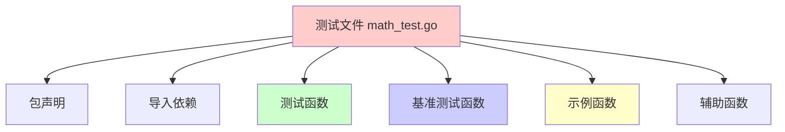
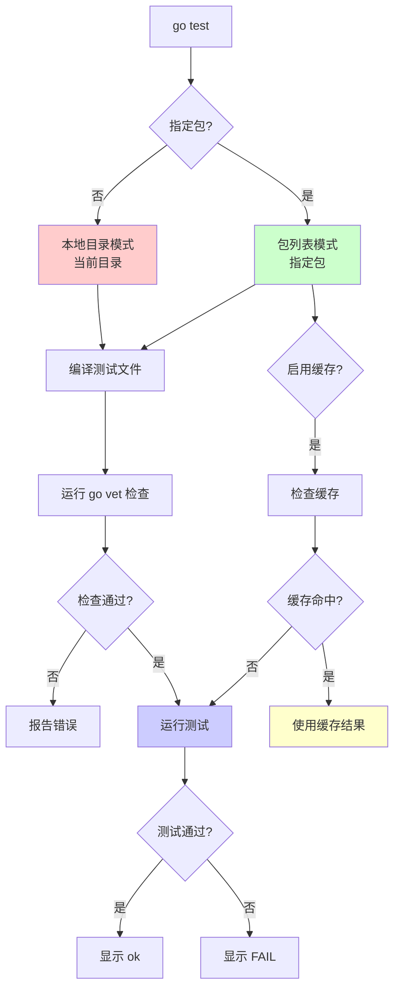
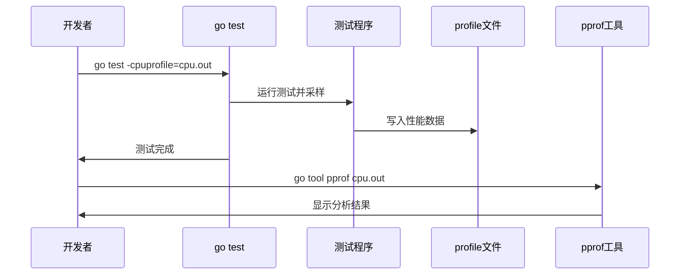

推荐阅读：[golang test](https://golang.org/pkg/testing/)

# Go 单元测试详解

## 概述

Go 语言内置了强大的测试框架，通过 `testing` 包提供了完整的测试支持。Go 的测试框架具有以下特点：

- **简单易用**：无需复杂的配置，开箱即用
- **快速执行**：测试执行速度快，支持并行测试
- **内置工具**：提供代码覆盖率、性能分析等工具
- **标准规范**：统一的测试文件命名和函数签名规范

## 测试文件规范

### 文件命名

测试文件必须以 `_test.go` 结尾，例如：
- `math.go` → `math_test.go`
- `user.go` → `user_test.go`

### 包声明

测试文件可以有两种包声明方式：

```go
// 方式1：同包测试（推荐）
package math

// 方式2：外部包测试
package math_test
```

**区别**：
- **同包测试**：可以访问包内未导出的函数和变量
- **外部包测试**：只能访问导出的函数和变量，更接近真实使用场景

### 测试文件结构



# 测试类型

## 单元测试（Unit Test）

单元测试用于测试单个函数或方法的正确性。

### 基本语法

```go
func TestFuncName(t *testing.T) {
    // 测试代码
}
```

**规则**：
- 函数名必须以 `Test` 开头
- 函数参数必须是 `*testing.T` 类型
- 函数不能有返回值

### 示例

```go
package math

import "testing"

func TestAdd(t *testing.T) {
    result := Add(1, 2)
    if result != 3 {
        t.Errorf("Add(1, 2) = %d; want 3", result)
    }
}
```

### 测试辅助方法

`testing.T` 提供了丰富的测试辅助方法：

```go
// 标记测试失败，但继续执行
t.Error(args ...interface{})
t.Errorf(format string, args ...interface{})

// 标记测试失败，并立即终止
t.Fatal(args ...interface{})
t.Fatalf(format string, args ...interface{})

// 跳过测试
t.Skip(args ...interface{})
t.Skipf(format string, args ...interface{})
t.SkipNow()

// 标记测试失败，但标记为已跳过
t.SkipIf(condition bool, args ...interface{})

// 并行执行测试
t.Parallel()

// 运行子测试
t.Run(name string, f func(t *testing.T))

// 清理函数
t.Cleanup(f func())

// 帮助函数（标记为辅助函数，错误信息会跳过该函数）
t.Helper()
```

## 表格驱动测试（Table-Driven Tests）

表格驱动测试是 Go 中推荐的测试模式，可以简洁地测试多个场景：

```go
func TestAdd(t *testing.T) {
    tests := []struct {
        name     string
        a        int
        b        int
        expected int
    }{
        {"positive numbers", 1, 2, 3},
        {"negative numbers", -1, -2, -3},
        {"mixed numbers", -1, 2, 1},
        {"zero", 0, 0, 0},
    }

    for _, tt := range tests {
        t.Run(tt.name, func(t *testing.T) {
            result := Add(tt.a, tt.b)
            if result != tt.expected {
                t.Errorf("Add(%d, %d) = %d; want %d", tt.a, tt.b, result, tt.expected)
            }
        })
    }
}
```

**优势**：
- 测试用例集中管理
- 易于添加新测试用例
- 代码简洁清晰

## 子测试（Subtests）

使用 `t.Run()` 可以创建子测试，支持并行执行和单独运行：

```go
func TestMath(t *testing.T) {
    t.Run("Add", func(t *testing.T) {
        result := Add(1, 2)
        if result != 3 {
            t.Error("Add failed")
        }
    })
    
    t.Run("Subtract", func(t *testing.T) {
        result := Subtract(5, 3)
        if result != 2 {
            t.Error("Subtract failed")
        }
    })
}
```

**运行特定子测试**：
```bash
go test -run TestMath/Add
```

## 基准测试（Benchmark Test）

基准测试用于测试代码的性能。

### 基本语法

```go
func BenchmarkFuncName(b *testing.B) {
    // 基准测试代码
    for i := 0; i < b.N; i++ {
        // 被测试的代码
    }
}
```

**规则**：
- 函数名必须以 `Benchmark` 开头
- 函数参数必须是 `*testing.B` 类型
- 必须使用 `b.N` 作为循环次数

### 示例

```go
func BenchmarkAdd(b *testing.B) {
    for i := 0; i < b.N; i++ {
        Add(1, 2)
    }
}
```

### 基准测试辅助方法

```go
// 重置计时器（跳过初始化代码）
b.ResetTimer()

// 开始计时（在初始化后调用）
b.StartTimer()

// 停止计时（在清理代码前调用）
b.StopTimer()

// 并行执行基准测试
b.RunParallel(func(pb *testing.PB) {
    for pb.Next() {
        // 测试代码
    }
})

// 报告内存分配
b.ReportAllocs()

// 设置内存分配采样率
b.SetBytes(n int64)
```

### 运行基准测试

```bash
# 运行所有基准测试
go test -bench=.

# 运行特定基准测试
go test -bench=BenchmarkAdd

# 显示内存分配
go test -bench=. -benchmem

# 指定运行时间
go test -bench=. -benchtime=5s

# 指定运行次数
go test -bench=. -count=3
```

## 示例测试（Example Test）

示例测试用于生成文档，同时也可以作为可执行的测试。

### 基本语法

```go
func ExampleFuncName() {
    // 示例代码
    // Output: 期望的输出
}
```

### 示例

```go
func ExampleAdd() {
    result := Add(1, 2)
    fmt.Println(result)
    // Output: 3
}
```

**规则**：
- 函数名必须以 `Example` 开头
- 可以没有参数
- 通过注释 `// Output:` 指定期望输出

## 测试辅助函数

### Helper 函数

使用 `t.Helper()` 标记辅助函数，错误信息会跳过该函数：

```go
func assertEqual(t *testing.T, got, want int) {
    t.Helper()  // 标记为辅助函数
    if got != want {
        t.Errorf("got %d; want %d", got, want)
    }
}

func TestAdd(t *testing.T) {
    assertEqual(t, Add(1, 2), 3)
}
```

### Cleanup 函数

使用 `t.Cleanup()` 注册清理函数，测试结束后自动执行：

```go
func TestWithCleanup(t *testing.T) {
    tempFile := createTempFile()
    t.Cleanup(func() {
        os.Remove(tempFile.Name())
    })
    // 测试代码
}
```

# 命令行操作

## 帮助文档
`go test`帮助文档

```text
➜ go help test                               
usage: go test [build/test flags] [packages] [build/test flags & test binary flags]

'Go test' automates testing the packages named by the import paths.
It prints a summary of the test results in the format:

        ok   archive/tar   0.011s
        FAIL archive/zip   0.022s
        ok   compress/gzip 0.033s
        ...

followed by detailed output for each failed package.

'Go test' recompiles each package along with any files with names matching
the file pattern "*_test.go".
These additional files can contain test functions, benchmark functions, and
example functions. See 'go help testfunc' for more.
Each listed package causes the execution of a separate test binary.
Files whose names begin with "_" (including "_test.go") or "." are ignored.

Test files that declare a package with the suffix "_test" will be compiled as a
separate package, and then linked and run with the main test binary.

The go tool will ignore a directory named "testdata", making it available
to hold ancillary data needed by the tests.

As part of building a test binary, go test runs go vet on the package
and its test source files to identify significant problems. If go vet
finds any problems, go test reports those and does not run the test
binary. Only a high-confidence subset of the default go vet checks are
used. That subset is: 'atomic', 'bool', 'buildtags', 'errorsas',
'ifaceassert', 'nilfunc', 'printf', and 'stringintconv'. You can see
the documentation for these and other vet tests via "go doc cmd/vet".
To disable the running of go vet, use the -vet=off flag.

All test output and summary lines are printed to the go command's
standard output, even if the test printed them to its own standard
error. (The go command's standard error is reserved for printing
errors building the tests.)

Go test runs in two different modes:

The first, called local directory mode, occurs when go test is
invoked with no package arguments (for example, 'go test' or 'go
test -v'). In this mode, go test compiles the package sources and
tests found in the current directory and then runs the resulting
test binary. In this mode, caching (discussed below) is disabled.
After the package test finishes, go test prints a summary line
showing the test status ('ok' or 'FAIL'), package name, and elapsed
time.

The second, called package list mode, occurs when go test is invoked
with explicit package arguments (for example 'go test math', 'go
test ./...', and even 'go test .'). In this mode, go test compiles
and tests each of the packages listed on the command line. If a
package test passes, go test prints only the final 'ok' summary
line. If a package test fails, go test prints the full test output.
If invoked with the -bench or -v flag, go test prints the full
output even for passing package tests, in order to display the
requested benchmark results or verbose logging. After the package
tests for all of the listed packages finish, and their output is
printed, go test prints a final 'FAIL' status if any package test
has failed.

In package list mode only, go test caches successful package test
results to avoid unnecessary repeated running of tests. When the
result of a test can be recovered from the cache, go test will
redisplay the previous output instead of running the test binary
again. When this happens, go test prints '(cached)' in place of the
elapsed time in the summary line.

The rule for a match in the cache is that the run involves the same
test binary and the flags on the command line come entirely from a
restricted set of 'cacheable' test flags, defined as -cpu, -list,
-parallel, -run, -short, and -v. If a run of go test has any test
or non-test flags outside this set, the result is not cached. To
disable test caching, use any test flag or argument other than the
cacheable flags. The idiomatic way to disable test caching explicitly
is to use -count=1\. Tests that open files within the package's source
root (usually $GOPATH) or that consult environment variables only
match future runs in which the files and environment variables are unchanged.
A cached test result is treated as executing in no time at all,
so a successful package test result will be cached and reused
regardless of -timeout setting.

In addition to the build flags, the flags handled by 'go test' itself are:

        -args
            Pass the remainder of the command line (everything after -args)
            to the test binary, uninterpreted and unchanged.
            Because this flag consumes the remainder of the command line,
            the package list (if present) must appear before this flag.

        -c
            Compile the test binary to pkg.test but do not run it
            (where pkg is the last element of the package's import path).
            The file name can be changed with the -o flag.

        -exec xprog
            Run the test binary using xprog. The behavior is the same as
            in 'go run'. See 'go help run' for details.

        -i
            Install packages that are dependencies of the test.
            Do not run the test.
            The -i flag is deprecated. Compiled packages are cached automatically.

        -json
            Convert test output to JSON suitable for automated processing.
            See 'go doc test2json' for the encoding details.

        -o file
            Compile the test binary to the named file.
            The test still runs (unless -c or -i is specified).

The test binary also accepts flags that control execution of the test; these
flags are also accessible by 'go test'. See 'go help testflag' for details.

For more about build flags, see 'go help build'.
For more about specifying packages, see 'go help packages'.

See also: go build, go vet.

```

将当前包的测试文件编译成二进制后的帮助文档

```text
➜ go.test -h 
Usage of go.test:
-test.bench regexp
run only benchmarks matching regexp
-test.benchmem
print memory allocations for benchmarks
-test.benchtime d
run each benchmark for duration d (default 1s)
-test.blockprofile file
write a goroutine blocking profile to file
-test.blockprofilerate rate
set blocking profile rate (see runtime.SetBlockProfileRate) (default 1)
-test.count n
run tests and benchmarks n times (default 1)
-test.coverprofile file
write a coverage profile to file
-test.cpu list
comma-separated list of cpu counts to run each test with
-test.cpuprofile file
write a cpu profile to file
-test.failfast
do not start new tests after the first test failure
-test.list regexp
list tests, examples, and benchmarks matching regexp then exit
-test.memprofile file
write an allocation profile to file
-test.memprofilerate rate
set memory allocation profiling rate (see runtime.MemProfileRate)
-test.mutexprofile string
write a mutex contention profile to the named file after execution
-test.mutexprofilefraction int
if >= 0, calls runtime.SetMutexProfileFraction() (default 1)
-test.outputdir dir
write profiles to dir
-test.paniconexit0
panic on call to os.Exit(0)
-test.parallel n
run at most n tests in parallel (default 4)
-test.run regexp
run only tests and examples matching regexp
-test.short
run smaller test suite to save time
-test.testlogfile file
write test action log to file (for use only by cmd/go)
-test.timeout d
panic test binary after duration d (default 0, timeout disabled)
-test.trace file
write an execution trace to file
-test.v
verbose: print additional output

```

## 常用命令

### 基本命令

```bash
# 运行当前目录所有测试
go test

# 运行并显示详细信息
go test -v

# 运行特定测试函数
go test -run TestFunc

# 运行匹配正则表达式的测试
go test -run "Test.*"

# 运行所有测试（包括子测试）
go test -run TestMath/Add
```

### 测试执行流程



### 常用标志

```bash
# 显示详细信息
go test -v

# 运行特定测试（支持正则）
go test -run TestFunc

# 并行执行测试
go test -parallel 4

# 快速测试（跳过长时间测试）
go test -short

# 失败后立即停止
go test -failfast

# 运行指定次数
go test -count=3

# 禁用测试缓存
go test -count=1

# 设置超时时间
go test -timeout 30s

# 输出 JSON 格式
go test -json

# 只编译不运行
go test -c

# 列出匹配的测试
go test -list TestFunc
```

## 代码覆盖率

### 生成覆盖率报告

```bash
# 生成覆盖率文件
go test -coverprofile=cover.out

# 查看覆盖率
go tool cover -func=cover.out

# 生成 HTML 报告
go tool cover -html=cover.out

# 在浏览器中查看
go tool cover -html=cover.out -o cover.html
```

### 覆盖率示例

```go
package math

import "testing"

func TestAdd(t *testing.T) {
    result := Add(1, 2)
    if result != 3 {
        t.Errorf("Add(1, 2) = %d; want 3", result)
    }
}
```

```bash
# 运行测试并生成覆盖率
go test -coverprofile=cover.out

# 查看覆盖率统计
go tool cover -func=cover.out
# 输出：
# math.go:3: Add         100.0%
# total:                  (statements)    100.0%
```

## 性能分析

### 生成性能分析文件

```bash
# 生成 CPU profile
go test -cpuprofile=cpu.out -run TestFunc

# 生成内存 profile
go test -memprofile=mem.out -run TestFunc

# 生成阻塞 profile
go test -blockprofile=block.out -run TestFunc

# 生成互斥锁 profile
go test -mutexprofile=mutex.out -run TestFunc

# 生成执行追踪
go test -trace=trace.out -run TestFunc

# 同时生成多个 profile
go test -coverprofile=cover.out \
        -cpuprofile=cpu.out \
        -memprofile=mem.out \
        -run TestFunc
```

### 分析性能数据

```bash
# 使用 pprof 分析 CPU
go tool pprof cpu.out

# 使用 Web UI 分析
go tool pprof -http=:8080 cpu.out

# 使用 pprof 分析内存
go tool pprof -http=:8080 mem.out

# 使用 trace 分析执行追踪
go tool trace trace.out
```

### 性能分析流程



**Web UI 视图说明**：
- **Top**：通过列表的方式，由高到低显示相关信息
- **Graph**：通过图形连线的方式，显示各个节点调用关系和相关信息
- **Flame Graph**：通过火焰图展示各个节点调用关系和相关信息
- **Peek**：通过列表的方式，由高到低显示调用链的相关信息
- **Source**：以源码的方式，由高到低显示相关信息

> 详细内容请参考 [pprof 文档](./pprof.md)

## 测试模式

### 本地目录模式

```bash
# 无参数运行，使用本地目录模式
go test
go test -v
```

**特点**：
- 只测试当前目录
- 禁用缓存
- 显示详细输出

### 包列表模式

```bash
# 指定包运行，使用包列表模式
go test ./...
go test math
go test .
```

**特点**：
- 可以测试多个包
- 启用缓存
- 只显示失败的测试输出

### 测试缓存

Go 会缓存测试结果以提高效率：

```bash
# 缓存条件
# 1. 使用可缓存的标志：-cpu, -list, -parallel, -run, -short, -v
# 2. 测试文件和依赖未改变
# 3. 环境变量未改变

# 禁用缓存
go test -count=1

# 查看缓存状态
go test -v  # 缓存命中会显示 (cached)
```


# IDE 集成

## GoLand 操作

GoLand 提供了强大的测试集成功能：

### 运行测试

1. **运行单个测试**：点击测试函数左侧的绿色运行按钮
2. **运行所有测试**：右键点击测试文件，选择 "Run 'TestXXX'"
3. **运行配置**：可以配置运行参数、环境变量等

### 测试覆盖率

GoLand 可以可视化显示代码覆盖率：
- 运行测试时选择 "Run with Coverage"
- 代码会以颜色标记覆盖情况
- 绿色表示已覆盖，红色表示未覆盖

### 性能分析

GoLand 集成了 pprof 工具：
- 运行测试时选择 "Run with Profiling"
- 自动生成性能分析报告
- 提供可视化界面查看分析结果

## VS Code 操作

VS Code 通过 Go 扩展也支持测试：

### 运行测试

- 点击测试函数上方的 "run test" 链接
- 使用命令面板：`Go: Test Function At Cursor`
- 使用快捷键运行测试

### 测试覆盖率

安装 `Go Coverage` 扩展可以查看代码覆盖率。

# 测试最佳实践

## 1. 测试组织

### 文件结构

```
project/
├── math.go
├── math_test.go
├── user.go
├── user_test.go
└── testdata/
    └── test_input.txt
```

### 测试数据

使用 `testdata` 目录存放测试数据：

```go
func TestReadFile(t *testing.T) {
    data, err := os.ReadFile("testdata/input.txt")
    if err != nil {
        t.Fatal(err)
    }
    // 使用测试数据
}
```

## 2. 测试命名

### 函数命名

```go
// ✅ 好的命名
func TestAdd_PositiveNumbers(t *testing.T)
func TestAdd_NegativeNumbers(t *testing.T)
func TestUser_Create(t *testing.T)

// ❌ 不好的命名
func Test1(t *testing.T)
func TestFunc(t *testing.T)
```

### 子测试命名

```go
func TestAdd(t *testing.T) {
    t.Run("positive numbers", func(t *testing.T) {})
    t.Run("negative numbers", func(t *testing.T) {})
    t.Run("zero", func(t *testing.T) {})
}
```

## 3. 测试原则

### AAA 模式

```go
func TestAdd(t *testing.T) {
    // Arrange（准备）
    a, b := 1, 2
    expected := 3
    
    // Act（执行）
    result := Add(a, b)
    
    // Assert（断言）
    if result != expected {
        t.Errorf("Add(%d, %d) = %d; want %d", a, b, result, expected)
    }
}
```

### 测试独立性

每个测试应该独立，不依赖其他测试的执行顺序：

```go
// ✅ 好的测试
func TestAdd(t *testing.T) {
    result := Add(1, 2)
    // 不依赖全局状态
}

// ❌ 不好的测试
var globalCounter int

func TestIncrement(t *testing.T) {
    globalCounter++  // 依赖全局状态
}
```

## 4. 错误处理测试

```go
func TestDivide(t *testing.T) {
    tests := []struct {
        name    string
        a, b    float64
        want    float64
        wantErr bool
    }{
        {"normal division", 10, 2, 5, false},
        {"divide by zero", 10, 0, 0, true},
    }
    
    for _, tt := range tests {
        t.Run(tt.name, func(t *testing.T) {
            got, err := Divide(tt.a, tt.b)
            if (err != nil) != tt.wantErr {
                t.Errorf("Divide() error = %v, wantErr %v", err, tt.wantErr)
                return
            }
            if got != tt.want {
                t.Errorf("Divide() = %v, want %v", got, tt.want)
            }
        })
    }
}
```

## 5. 并发测试

```go
func TestConcurrentAdd(t *testing.T) {
    t.Parallel()  // 标记为可并行执行
    
    result := Add(1, 2)
    if result != 3 {
        t.Error("Add failed")
    }
}
```

## 6. 基准测试优化

```go
func BenchmarkAdd(b *testing.B) {
    // 初始化代码（不计入基准测试时间）
    a, b := 1, 2
    
    b.ResetTimer()  // 重置计时器
    
    for i := 0; i < b.N; i++ {
        Add(a, b)
    }
}
```

## 7. Mock 和 Stub

### 接口 Mock

```go
type Calculator interface {
    Add(a, b int) int
}

func TestWithMock(t *testing.T) {
    mockCalc := &MockCalculator{}
    mockCalc.AddFunc = func(a, b int) int {
        return a + b
    }
    
    result := UseCalculator(mockCalc, 1, 2)
    if result != 3 {
        t.Error("failed")
    }
}
```

## 8. 测试工具库

### 推荐工具

- **testify**：提供断言和 mock 功能
- **httptest**：HTTP 测试工具
- **gomock**：生成 mock 代码

### testify 示例

```go
import (
    "github.com/stretchr/testify/assert"
    "github.com/stretchr/testify/require"
)

func TestAdd(t *testing.T) {
    result := Add(1, 2)
    assert.Equal(t, 3, result)
    require.Equal(t, 3, result)  // 失败时立即终止
}
```

# 常见问题

## 1. 测试不运行

**问题**：测试函数不执行

**原因**：
- 函数名不以 `Test` 开头
- 参数类型不是 `*testing.T`
- 文件不在 `_test.go` 文件中

## 2. 测试缓存问题

**问题**：修改代码后测试结果不变

**解决**：
```bash
go test -count=1  # 禁用缓存
```

## 3. 并行测试问题

**问题**：并行测试时出现竞态条件

**解决**：
- 确保测试之间不共享状态
- 使用 `t.Parallel()` 明确标记并行测试
- 使用 `sync` 包保护共享资源

## 4. 测试超时

**问题**：测试执行时间过长

**解决**：
```bash
go test -timeout 30s  # 设置超时时间
```

# 总结

Go 的测试框架提供了：

1. **简单易用**：统一的命名规范和函数签名
2. **功能完整**：支持单元测试、基准测试、示例测试
3. **工具丰富**：代码覆盖率、性能分析等工具
4. **高效执行**：支持并行测试和结果缓存
5. **标准规范**：官方推荐的测试模式和最佳实践

掌握 Go 测试框架，可以大大提高代码质量和开发效率。