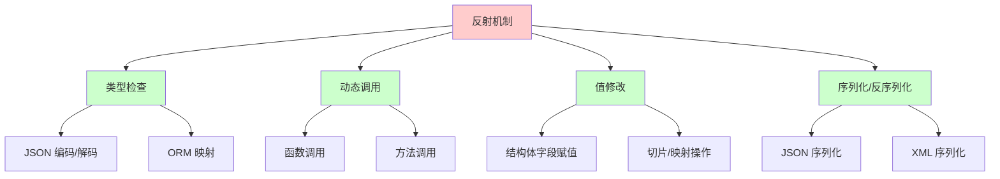

# Go 反射机制详解

反射（Reflection）是 Go 语言提供的一种强大的机制，允许程序在运行时检查、修改和操作类型信息。虽然反射功能强大，但应该谨慎使用，因为它会影响性能和类型安全。

## 目录

- [反射概述](#反射概述)
- [reflect 包的使用](#reflect-包的使用)
- [Type 和 Value](#type-和-value)
- [反射获取类型信息](#反射获取类型信息)
- [反射获取值信息](#反射获取值信息)
- [反射调用方法](#反射调用方法)
- [反射修改值](#反射修改值)
- [反射的性能影响](#反射的性能影响)
- [反射的常见应用场景](#反射的常见应用场景)
- [反射的最佳实践](#反射的最佳实践)

# 反射概述

## 什么是反射

反射是程序在运行时检查自身结构的能力。Go 语言的反射通过 `reflect` 包提供，允许我们：

- 检查变量的类型和值
- 动态创建类型实例
- 调用方法和函数
- 修改结构体字段的值
- 实现通用的序列化/反序列化

## 反射的用途



## 何时使用反射

### ✅ 适合使用反射的场景

- **序列化/反序列化**：JSON、XML、protobuf 等
- **ORM 框架**：数据库表与结构体的映射
- **配置解析**：配置文件到结构体的映射
- **依赖注入**：动态创建和注入依赖
- **通用工具函数**：需要处理任意类型的函数

### ❌ 不适合使用反射的场景

- **性能敏感代码**：反射有性能开销
- **类型已知的场景**：直接使用类型更高效
- **简单操作**：能用普通代码实现就不要用反射

# reflect 包的使用

## 核心函数

`reflect` 包提供了两个核心函数：

```go
// 获取类型信息
reflect.TypeOf(i interface{}) Type

// 获取值信息
reflect.ValueOf(i interface{}) Value
```

## 基本示例

```go
package main

import (
    "fmt"
    "reflect"
)

func main() {
    var x int = 42
    
    // 获取类型信息
    t := reflect.TypeOf(x)
    fmt.Println("Type:", t)  // 输出: Type: int
    
    // 获取值信息
    v := reflect.ValueOf(x)
    fmt.Println("Value:", v)  // 输出: Value: 42
    fmt.Println("Kind:", v.Kind())  // 输出: Kind: int
}
```

## 接口到反射的转换

```go
package main

import (
    "fmt"
    "reflect"
)

func inspect(i interface{}) {
    t := reflect.TypeOf(i)
    v := reflect.ValueOf(i)
    
    fmt.Printf("Type: %s\n", t)
    fmt.Printf("Kind: %s\n", t.Kind())
    fmt.Printf("Value: %v\n", v)
}

func main() {
    inspect(42)           // int
    inspect("hello")      // string
    inspect([]int{1, 2}) // []int
    inspect(map[string]int{"a": 1}) // map[string]int
}
```

# Type 和 Value

## Type 接口

`Type` 表示 Go 类型的接口，提供了类型相关的信息：

```go
type Type interface {
    // 方法数量
    NumMethod() int
    
    // 方法信息
    Method(int) Method
    MethodByName(string) (Method, bool)
    
    // 字段信息（结构体）
    NumField() int
    Field(int) StructField
    FieldByName(string) (StructField, bool)
    
    // 类型信息
    Name() string
    Kind() Kind
    String() string
    
    // 其他方法...
}
```

## Value 结构体

`Value` 表示 Go 值的结构体，提供了值相关的操作：

```go
type Value struct {
    // 内部字段（未导出）
}

// 常用方法
func (v Value) Type() Type
func (v Value) Kind() Kind
func (v Value) Interface() interface{}
func (v Value) CanSet() bool
func (v Value) CanAddr() bool
```

## Type vs Value

| 特性 | Type | Value |
|------|------|-------|
| **表示** | 类型信息 | 值信息 |
| **获取方式** | `reflect.TypeOf()` | `reflect.ValueOf()` |
| **用途** | 检查类型结构 | 操作值 |
| **是否可变** | 不可变 | 可能可变 |

## 基本操作

```go
package main

import (
    "fmt"
    "reflect"
)

func main() {
    var x float64 = 3.14
    
    // 获取 Type
    t := reflect.TypeOf(x)
    fmt.Println("Type:", t)           // Type: float64
    fmt.Println("Kind:", t.Kind())     // Kind: float64
    fmt.Println("Name:", t.Name())    // Name: float64
    
    // 获取 Value
    v := reflect.ValueOf(x)
    fmt.Println("Value:", v)          // Value: 3.14
    fmt.Println("Kind:", v.Kind())    // Kind: float64
    fmt.Println("Type:", v.Type())    // Type: float64
    
    // 获取接口值
    i := v.Interface()
    fmt.Println("Interface:", i)      // Interface: 3.14
}
```

# 反射获取类型信息

## 基本类型信息

```go
package main

import (
    "fmt"
    "reflect"
)

func printTypeInfo(i interface{}) {
    t := reflect.TypeOf(i)
    
    fmt.Printf("Type: %s\n", t)
    fmt.Printf("Kind: %s\n", t.Kind())
    fmt.Printf("Name: %s\n", t.Name())
    fmt.Printf("String: %s\n", t.String())
    fmt.Println("---")
}

func main() {
    printTypeInfo(42)                    // int
    printTypeInfo("hello")               // string
    printTypeInfo([]int{1, 2, 3})       // []int
    printTypeInfo(map[string]int{})     // map[string]int
    printTypeInfo(make(chan int))        // chan int
}
```

## 结构体类型信息

```go
package main

import (
    "fmt"
    "reflect"
)

type User struct {
    ID    int    `json:"id" db:"user_id"`
    Name  string `json:"name" db:"user_name"`
    Email string `json:"email" db:"user_email"`
}

func inspectStruct(s interface{}) {
    t := reflect.TypeOf(s)
    
    // 检查是否为结构体
    if t.Kind() != reflect.Struct {
        fmt.Println("Not a struct")
        return
    }
    
    fmt.Printf("Struct: %s\n", t.Name())
    fmt.Printf("Fields: %d\n", t.NumField())
    fmt.Println("---")
    
    // 遍历字段
    for i := 0; i < t.NumField(); i++ {
        field := t.Field(i)
        fmt.Printf("Field %d:\n", i)
        fmt.Printf("  Name: %s\n", field.Name)
        fmt.Printf("  Type: %s\n", field.Type)
        fmt.Printf("  Tag: %s\n", field.Tag)
        
        // 解析标签
        jsonTag := field.Tag.Get("json")
        dbTag := field.Tag.Get("db")
        fmt.Printf("  JSON Tag: %s\n", jsonTag)
        fmt.Printf("  DB Tag: %s\n", dbTag)
        fmt.Println()
    }
}

func main() {
    user := User{
        ID:    1,
        Name:  "Alice",
        Email: "alice@example.com",
    }
    inspectStruct(user)
}
```

## 方法信息

```go
package main

import (
    "fmt"
    "reflect"
)

type Calculator struct {
    value int
}

func (c *Calculator) Add(x int) {
    c.value += x
}

func (c *Calculator) Subtract(x int) {
    c.value -= x
}

func (c Calculator) GetValue() int {
    return c.value
}

func inspectMethods(i interface{}) {
    t := reflect.TypeOf(i)
    
    fmt.Printf("Type: %s\n", t)
    fmt.Printf("Methods: %d\n", t.NumMethod())
    fmt.Println("---")
    
    // 遍历方法
    for i := 0; i < t.NumMethod(); i++ {
        method := t.Method(i)
        fmt.Printf("Method %d:\n", i)
        fmt.Printf("  Name: %s\n", method.Name)
        fmt.Printf("  Type: %s\n", method.Type)
        fmt.Printf("  PkgPath: %s\n", method.PkgPath)
        fmt.Println()
    }
}

func main() {
    calc := &Calculator{value: 10}
    inspectMethods(calc)
    
    // 也可以检查值类型的方法
    calc2 := Calculator{value: 20}
    inspectMethods(calc2)
}
```

## 指针类型信息

```go
package main

import (
    "fmt"
    "reflect"
)

func inspectPointer(ptr interface{}) {
    t := reflect.TypeOf(ptr)
    v := reflect.ValueOf(ptr)
    
    fmt.Printf("Type: %s\n", t)
    fmt.Printf("Kind: %s\n", t.Kind())
    
    // 检查是否为指针
    if t.Kind() == reflect.Ptr {
        // 获取指针指向的类型
        elemType := t.Elem()
        fmt.Printf("Element Type: %s\n", elemType)
        
        // 获取指针指向的值
        if v.IsNil() {
            fmt.Println("Pointer is nil")
        } else {
            elemValue := v.Elem()
            fmt.Printf("Element Value: %v\n", elemValue)
        }
    }
}

func main() {
    x := 42
    inspectPointer(&x)
    
    var y *int
    inspectPointer(y)  // nil pointer
}
```

## 切片和映射类型信息

```go
package main

import (
    "fmt"
    "reflect"
)

func inspectCollection(c interface{}) {
    t := reflect.TypeOf(c)
    v := reflect.ValueOf(c)
    
    fmt.Printf("Type: %s\n", t)
    fmt.Printf("Kind: %s\n", t.Kind())
    
    switch t.Kind() {
    case reflect.Slice, reflect.Array:
        fmt.Printf("Length: %d\n", v.Len())
        if v.Len() > 0 {
            elemType := t.Elem()
            fmt.Printf("Element Type: %s\n", elemType)
        }
        
    case reflect.Map:
        fmt.Printf("Length: %d\n", v.Len())
        keyType := t.Key()
        elemType := t.Elem()
        fmt.Printf("Key Type: %s\n", keyType)
        fmt.Printf("Element Type: %s\n", elemType)
    }
}

func main() {
    // 切片
    slice := []int{1, 2, 3}
    inspectCollection(slice)
    
    // 映射
    m := map[string]int{"a": 1, "b": 2}
    inspectCollection(m)
}
```

# 反射获取值信息

## 基本值操作

```go
package main

import (
    "fmt"
    "reflect"
)

func inspectValue(i interface{}) {
    v := reflect.ValueOf(i)
    
    fmt.Printf("Value: %v\n", v)
    fmt.Printf("Type: %s\n", v.Type())
    fmt.Printf("Kind: %s\n", v.Kind())
    fmt.Printf("CanSet: %v\n", v.CanSet())
    fmt.Printf("CanAddr: %v\n", v.CanAddr())
    fmt.Println("---")
}

func main() {
    x := 42
    inspectValue(x)
    
    y := "hello"
    inspectValue(y)
    
    z := []int{1, 2, 3}
    inspectValue(z)
}
```

## 获取具体类型的值

```go
package main

import (
    "fmt"
    "reflect"
)

func getValue(i interface{}) {
    v := reflect.ValueOf(i)
    
    switch v.Kind() {
    case reflect.Int, reflect.Int8, reflect.Int16, reflect.Int32, reflect.Int64:
        fmt.Printf("Int value: %d\n", v.Int())
        
    case reflect.Uint, reflect.Uint8, reflect.Uint16, reflect.Uint32, reflect.Uint64:
        fmt.Printf("Uint value: %d\n", v.Uint())
        
    case reflect.Float32, reflect.Float64:
        fmt.Printf("Float value: %f\n", v.Float())
        
    case reflect.String:
        fmt.Printf("String value: %s\n", v.String())
        
    case reflect.Bool:
        fmt.Printf("Bool value: %v\n", v.Bool())
        
    default:
        fmt.Printf("Other type: %v\n", v.Interface())
    }
}

func main() {
    getValue(42)
    getValue(3.14)
    getValue("hello")
    getValue(true)
}
```

## 结构体字段值

```go
package main

import (
    "fmt"
    "reflect"
)

type Person struct {
    Name string
    Age  int
    City string
}

func inspectStructValue(s interface{}) {
    v := reflect.ValueOf(s)
    
    // 如果是指针，获取指向的值
    if v.Kind() == reflect.Ptr {
        v = v.Elem()
    }
    
    if v.Kind() != reflect.Struct {
        fmt.Println("Not a struct")
        return
    }
    
    t := v.Type()
    fmt.Printf("Struct: %s\n", t.Name())
    fmt.Println("---")
    
    // 遍历字段
    for i := 0; i < v.NumField(); i++ {
        field := t.Field(i)
        fieldValue := v.Field(i)
        
        fmt.Printf("Field: %s\n", field.Name)
        fmt.Printf("  Type: %s\n", field.Type)
        fmt.Printf("  Value: %v\n", fieldValue.Interface())
        fmt.Printf("  CanSet: %v\n", fieldValue.CanSet())
        fmt.Println()
    }
}

func main() {
    p := Person{
        Name: "Alice",
        Age:  30,
        City: "Beijing",
    }
    inspectStructValue(p)
    inspectStructValue(&p)  // 指针也可以
}
```

## 切片和映射的值操作

```go
package main

import (
    "fmt"
    "reflect"
)

func inspectSlice(s interface{}) {
    v := reflect.ValueOf(s)
    
    if v.Kind() != reflect.Slice {
        fmt.Println("Not a slice")
        return
    }
    
    fmt.Printf("Length: %d\n", v.Len())
    fmt.Printf("Capacity: %d\n", v.Cap())
    fmt.Println("Elements:")
    
    for i := 0; i < v.Len(); i++ {
        elem := v.Index(i)
        fmt.Printf("  [%d]: %v\n", i, elem.Interface())
    }
}

func inspectMap(m interface{}) {
    v := reflect.ValueOf(m)
    
    if v.Kind() != reflect.Map {
        fmt.Println("Not a map")
        return
    }
    
    fmt.Printf("Length: %d\n", v.Len())
    fmt.Println("Key-Value pairs:")
    
    for _, key := range v.MapKeys() {
        value := v.MapIndex(key)
        fmt.Printf("  %v: %v\n", key.Interface(), value.Interface())
    }
}

func main() {
    // 切片
    slice := []int{1, 2, 3, 4, 5}
    inspectSlice(slice)
    
    // 映射
    m := map[string]int{
        "a": 1,
        "b": 2,
        "c": 3,
    }
    inspectMap(m)
}
```

# 反射调用方法

## 调用方法

```go
package main

import (
    "fmt"
    "reflect"
)

type Calculator struct {
    value int
}

func (c *Calculator) Add(x int) {
    c.value += x
}

func (c *Calculator) Subtract(x int) {
    c.value -= x
}

func (c Calculator) GetValue() int {
    return c.value
}

func (c Calculator) Multiply(x, y int) int {
    return x * y
}

func callMethod(obj interface{}, methodName string, args ...interface{}) []reflect.Value {
    v := reflect.ValueOf(obj)
    method := v.MethodByName(methodName)
    
    if !method.IsValid() {
        fmt.Printf("Method %s not found\n", methodName)
        return nil
    }
    
    // 准备参数
    in := make([]reflect.Value, len(args))
    for i, arg := range args {
        in[i] = reflect.ValueOf(arg)
    }
    
    // 调用方法
    return method.Call(in)
}

func main() {
    calc := &Calculator{value: 10}
    
    // 调用无返回值方法
    callMethod(calc, "Add", 5)
    fmt.Printf("After Add(5): %d\n", calc.value)
    
    // 调用有返回值方法
    results := callMethod(calc, "GetValue")
    if len(results) > 0 {
        fmt.Printf("GetValue(): %d\n", results[0].Int())
    }
    
    // 调用多参数方法
    results = callMethod(calc, "Multiply", 3, 4)
    if len(results) > 0 {
        fmt.Printf("Multiply(3, 4): %d\n", results[0].Int())
    }
}
```

## 调用函数

```go
package main

import (
    "fmt"
    "reflect"
)

func add(a, b int) int {
    return a + b
}

func greet(name string) string {
    return "Hello, " + name
}

func callFunction(fn interface{}, args ...interface{}) []reflect.Value {
    v := reflect.ValueOf(fn)
    
    if v.Kind() != reflect.Func {
        fmt.Println("Not a function")
        return nil
    }
    
    // 准备参数
    in := make([]reflect.Value, len(args))
    for i, arg := range args {
        in[i] = reflect.ValueOf(arg)
    }
    
    // 调用函数
    return v.Call(in)
}

func main() {
    // 调用 add 函数
    results := callFunction(add, 3, 4)
    if len(results) > 0 {
        fmt.Printf("add(3, 4) = %d\n", results[0].Int())
    }
    
    // 调用 greet 函数
    results = callFunction(greet, "Alice")
    if len(results) > 0 {
        fmt.Printf("greet(\"Alice\") = %s\n", results[0].String())
    }
}
```

## 方法查找和调用

```go
package main

import (
    "fmt"
    "reflect"
)

type Service struct {
    name string
}

func (s *Service) Process(data string) string {
    return fmt.Sprintf("Processing %s by %s", data, s.name)
}

func (s Service) GetName() string {
    return s.name
}

func findAndCall(obj interface{}, methodName string, args ...interface{}) {
    v := reflect.ValueOf(obj)
    t := reflect.TypeOf(obj)
    
    // 方法 1: 通过 Value 查找（只能找到值接收者方法）
    method := v.MethodByName(methodName)
    if method.IsValid() {
        fmt.Printf("Found method via Value: %s\n", methodName)
        // 调用方法...
        return
    }
    
    // 方法 2: 通过 Type 查找（包括指针接收者方法）
    methodType, ok := t.MethodByName(methodName)
    if ok {
        fmt.Printf("Found method via Type: %s\n", methodName)
        
        // 如果是值类型，需要获取指针
        if v.Kind() != reflect.Ptr {
            v = v.Addr()
        }
        
        method = v.MethodByName(methodName)
        if method.IsValid() {
            // 准备参数（注意：第一个参数是接收者）
            in := make([]reflect.Value, len(args))
            for i, arg := range args {
                in[i] = reflect.ValueOf(arg)
            }
            results := method.Call(in)
            if len(results) > 0 {
                fmt.Printf("Result: %v\n", results[0].Interface())
            }
        }
    } else {
        fmt.Printf("Method %s not found\n", methodName)
    }
}

func main() {
    service := &Service{name: "MyService"}
    
    findAndCall(service, "Process", "data123")
    findAndCall(service, "GetName")
}
```

# 反射修改值

## 可设置性（Settability）

只有可寻址（addressable）的值才能被修改：

```go
package main

import (
    "fmt"
    "reflect"
)

func main() {
    x := 42
    
    // 直接传递值，不可设置
    v1 := reflect.ValueOf(x)
    fmt.Printf("CanSet: %v\n", v1.CanSet())  // false
    
    // 传递指针，可以获取可设置的值
    v2 := reflect.ValueOf(&x)
    fmt.Printf("CanSet: %v\n", v2.CanSet())  // false（指针本身不可设置）
    
    // 获取指针指向的值，可设置
    v3 := v2.Elem()
    fmt.Printf("CanSet: %v\n", v3.CanSet())  // true
    
    // 修改值
    v3.SetInt(100)
    fmt.Printf("x = %d\n", x)  // x = 100
}
```

## 修改基本类型

```go
package main

import (
    "fmt"
    "reflect"
)

func modifyValue(ptr interface{}, newValue interface{}) {
    v := reflect.ValueOf(ptr)
    
    if v.Kind() != reflect.Ptr {
        fmt.Println("Not a pointer")
        return
    }
    
    elem := v.Elem()
    if !elem.CanSet() {
        fmt.Println("Cannot set")
        return
    }
    
    newVal := reflect.ValueOf(newValue)
    if elem.Type() != newVal.Type() {
        fmt.Printf("Type mismatch: %s vs %s\n", elem.Type(), newVal.Type())
        return
    }
    
    elem.Set(newVal)
}

func main() {
    // 修改 int
    x := 42
    modifyValue(&x, 100)
    fmt.Printf("x = %d\n", x)  // x = 100
    
    // 修改 string
    s := "hello"
    modifyValue(&s, "world")
    fmt.Printf("s = %s\n", s)  // s = world
    
    // 修改 float
    f := 3.14
    modifyValue(&f, 2.71)
    fmt.Printf("f = %f\n", f)  // f = 2.710000
}
```

## 修改结构体字段

```go
package main

import (
    "fmt"
    "reflect"
)

type Person struct {
    Name string
    Age  int
}

func modifyStructField(s interface{}, fieldName string, newValue interface{}) {
    v := reflect.ValueOf(s)
    
    // 如果是指针，获取指向的值
    if v.Kind() == reflect.Ptr {
        v = v.Elem()
    }
    
    if v.Kind() != reflect.Struct {
        fmt.Println("Not a struct")
        return
    }
    
    field := v.FieldByName(fieldName)
    if !field.IsValid() {
        fmt.Printf("Field %s not found\n", fieldName)
        return
    }
    
    if !field.CanSet() {
        fmt.Printf("Field %s cannot be set\n", fieldName)
        return
    }
    
    newVal := reflect.ValueOf(newValue)
    if field.Type() != newVal.Type() {
        fmt.Printf("Type mismatch for field %s\n", fieldName)
        return
    }
    
    field.Set(newVal)
}

func main() {
    p := &Person{Name: "Alice", Age: 30}
    
    fmt.Printf("Before: %+v\n", p)
    
    modifyStructField(p, "Name", "Bob")
    modifyStructField(p, "Age", 25)
    
    fmt.Printf("After: %+v\n", p)
}
```

## 修改切片元素

```go
package main

import (
    "fmt"
    "reflect"
)

func modifySliceElement(slice interface{}, index int, newValue interface{}) {
    v := reflect.ValueOf(slice)
    
    if v.Kind() != reflect.Slice {
        fmt.Println("Not a slice")
        return
    }
    
    if index < 0 || index >= v.Len() {
        fmt.Printf("Index %d out of range\n", index)
        return
    }
    
    elem := v.Index(index)
    if !elem.CanSet() {
        fmt.Println("Cannot set element")
        return
    }
    
    newVal := reflect.ValueOf(newValue)
    if elem.Type() != newVal.Type() {
        fmt.Println("Type mismatch")
        return
    }
    
    elem.Set(newVal)
}

func main() {
    slice := []int{1, 2, 3, 4, 5}
    fmt.Printf("Before: %v\n", slice)
    
    modifySliceElement(slice, 2, 99)
    fmt.Printf("After: %v\n", slice)  // [1 2 99 4 5]
}
```

## 修改映射

```go
package main

import (
    "fmt"
    "reflect"
)

func modifyMap(m interface{}, key interface{}, value interface{}) {
    v := reflect.ValueOf(m)
    
    if v.Kind() != reflect.Map {
        fmt.Println("Not a map")
        return
    }
    
    keyVal := reflect.ValueOf(key)
    valueVal := reflect.ValueOf(value)
    
    if keyVal.Type() != v.Type().Key() {
        fmt.Println("Key type mismatch")
        return
    }
    
    if valueVal.Type() != v.Type().Elem() {
        fmt.Println("Value type mismatch")
        return
    }
    
    v.SetMapIndex(keyVal, valueVal)
}

func main() {
    m := map[string]int{
        "a": 1,
        "b": 2,
    }
    
    fmt.Printf("Before: %v\n", m)
    
    modifyMap(m, "a", 10)
    modifyMap(m, "c", 3)
    
    fmt.Printf("After: %v\n", m)  // map[a:10 b:2 c:3]
}
```

## 创建新值

```go
package main

import (
    "fmt"
    "reflect"
)

func createValue(t reflect.Type) reflect.Value {
    // 创建新值
    return reflect.New(t).Elem()
}

func createSlice(t reflect.Type, len, cap int) reflect.Value {
    // 创建切片
    sliceType := reflect.SliceOf(t)
    return reflect.MakeSlice(sliceType, len, cap)
}

func createMap(keyType, elemType reflect.Type) reflect.Value {
    // 创建映射
    mapType := reflect.MapOf(keyType, elemType)
    return reflect.MakeMap(mapType)
}

func main() {
    // 创建 int 值
    intType := reflect.TypeOf(0)
    intValue := createValue(intType)
    intValue.SetInt(42)
    fmt.Printf("Created int: %d\n", intValue.Int())
    
    // 创建切片
    sliceValue := createSlice(intType, 3, 5)
    for i := 0; i < sliceValue.Len(); i++ {
        sliceValue.Index(i).SetInt(int64(i + 1))
    }
    fmt.Printf("Created slice: %v\n", sliceValue.Interface())
    
    // 创建映射
    stringType := reflect.TypeOf("")
    mapValue := createMap(stringType, intType)
    mapValue.SetMapIndex(reflect.ValueOf("a"), reflect.ValueOf(1))
    mapValue.SetMapIndex(reflect.ValueOf("b"), reflect.ValueOf(2))
    fmt.Printf("Created map: %v\n", mapValue.Interface())
}
```

# 反射的性能影响

## 性能对比

反射操作比直接操作慢得多，应该谨慎使用：

```go
package main

import (
    "fmt"
    "reflect"
    "testing"
)

type Person struct {
    Name string
    Age  int
}

// 直接访问
func directAccess(p *Person) {
    p.Name = "Alice"
    p.Age = 30
}

// 反射访问
func reflectAccess(p *Person) {
    v := reflect.ValueOf(p).Elem()
    v.FieldByName("Name").SetString("Alice")
    v.FieldByName("Age").SetInt(30)
}

// 基准测试
func BenchmarkDirectAccess(b *testing.B) {
    p := &Person{}
    for i := 0; i < b.N; i++ {
        directAccess(p)
    }
}

func BenchmarkReflectAccess(b *testing.B) {
    p := &Person{}
    for i := 0; i < b.N; i++ {
        reflectAccess(p)
    }
}
```

运行结果示例：
```
BenchmarkDirectAccess-8     1000000000    0.5 ns/op
BenchmarkReflectAccess-8     5000000       200 ns/op
```

反射操作比直接操作慢约 **400 倍**。

## 性能优化技巧

### 1. 缓存反射结果

```go
package main

import (
    "reflect"
    "sync"
)

type fieldCache struct {
    mu     sync.RWMutex
    fields map[reflect.Type][]reflect.StructField
}

var cache = &fieldCache{
    fields: make(map[reflect.Type][]reflect.StructField),
}

func getCachedFields(t reflect.Type) []reflect.StructField {
    cache.mu.RLock()
    if fields, ok := cache.fields[t]; ok {
        cache.mu.RUnlock()
        return fields
    }
    cache.mu.RUnlock()
    
    cache.mu.Lock()
    defer cache.mu.Unlock()
    
    // 双重检查
    if fields, ok := cache.fields[t]; ok {
        return fields
    }
    
    // 计算并缓存
    fields := make([]reflect.StructField, t.NumField())
    for i := 0; i < t.NumField(); i++ {
        fields[i] = t.Field(i)
    }
    cache.fields[t] = fields
    return fields
}
```

### 2. 使用类型断言优先

```go
// ❌ 不推荐：总是使用反射
func processValue(v interface{}) {
    rv := reflect.ValueOf(v)
    // 反射操作...
}

// ✅ 推荐：优先使用类型断言
func processValue(v interface{}) {
    switch val := v.(type) {
    case int:
        // 直接处理
    case string:
        // 直接处理
    default:
        // 只有必要时才使用反射
        rv := reflect.ValueOf(v)
        // 反射操作...
    }
}
```

### 3. 避免在循环中使用反射

```go
// ❌ 不推荐：在循环中重复获取类型信息
func processSlice(slice []interface{}) {
    for _, item := range slice {
        t := reflect.TypeOf(item)  // 每次都获取类型
        // 处理...
    }
}

// ✅ 推荐：在循环外获取类型信息
func processSlice(slice []interface{}) {
    if len(slice) == 0 {
        return
    }
    t := reflect.TypeOf(slice[0])  // 只获取一次
    for _, item := range slice {
        // 使用缓存的类型信息
        // 处理...
    }
}
```

# 反射的常见应用场景

## JSON 序列化/反序列化

Go 标准库的 `encoding/json` 包大量使用反射：

```go
package main

import (
    "encoding/json"
    "fmt"
    "reflect"
)

type User struct {
    ID    int    `json:"id"`
    Name  string `json:"name"`
    Email string `json:"email"`
}

// 简化的 JSON 编码器（演示反射用法）
func encodeJSON(v interface{}) (string, error) {
    t := reflect.TypeOf(v)
    vVal := reflect.ValueOf(v)
    
    if t.Kind() == reflect.Ptr {
        t = t.Elem()
        vVal = vVal.Elem()
    }
    
    if t.Kind() != reflect.Struct {
        return "", fmt.Errorf("not a struct")
    }
    
    result := "{"
    for i := 0; i < t.NumField(); i++ {
        field := t.Field(i)
        fieldValue := vVal.Field(i)
        
        // 获取 JSON 标签
        jsonTag := field.Tag.Get("json")
        if jsonTag == "" {
            jsonTag = field.Name
        }
        
        if i > 0 {
            result += ","
        }
        result += fmt.Sprintf(`"%s":`, jsonTag)
        
        // 根据类型格式化值
        switch fieldValue.Kind() {
        case reflect.String:
            result += fmt.Sprintf(`"%s"`, fieldValue.String())
        case reflect.Int, reflect.Int8, reflect.Int16, reflect.Int32, reflect.Int64:
            result += fmt.Sprintf("%d", fieldValue.Int())
        default:
            result += fmt.Sprintf("%v", fieldValue.Interface())
        }
    }
    result += "}"
    return result, nil
}

func main() {
    user := User{
        ID:    1,
        Name:  "Alice",
        Email: "alice@example.com",
    }
    
    // 使用标准库
    jsonData, _ := json.Marshal(user)
    fmt.Println(string(jsonData))
    
    // 使用自定义编码器（演示）
    customJSON, _ := encodeJSON(user)
    fmt.Println(customJSON)
}
```

## ORM 映射

ORM 框架使用反射将数据库行映射到结构体：

```go
package main

import (
    "fmt"
    "reflect"
    "strings"
)

type Model struct {
    ID        int    `db:"id"`
    Name      string `db:"name"`
    CreatedAt string `db:"created_at"`
}

// 简化的 ORM 映射（演示反射用法）
func mapRowToStruct(row map[string]interface{}, dest interface{}) error {
    v := reflect.ValueOf(dest)
    if v.Kind() != reflect.Ptr {
        return fmt.Errorf("dest must be a pointer")
    }
    
    v = v.Elem()
    t := v.Type()
    
    if t.Kind() != reflect.Struct {
        return fmt.Errorf("dest must be a struct")
    }
    
    for i := 0; i < t.NumField(); i++ {
        field := t.Field(i)
        fieldValue := v.Field(i)
        
        // 获取数据库标签
        dbTag := field.Tag.Get("db")
        if dbTag == "" {
            dbTag = strings.ToLower(field.Name)
        }
        
        // 从行数据中获取值
        if value, ok := row[dbTag]; ok {
            valueVal := reflect.ValueOf(value)
            
            // 类型转换
            if valueVal.Type().AssignableTo(fieldValue.Type()) {
                fieldValue.Set(valueVal)
            } else if valueVal.Type().ConvertibleTo(fieldValue.Type()) {
                fieldValue.Set(valueVal.Convert(fieldValue.Type()))
            }
        }
    }
    
    return nil
}

func main() {
    // 模拟数据库行
    row := map[string]interface{}{
        "id":         1,
        "name":       "Test Model",
        "created_at": "2024-01-01",
    }
    
    var model Model
    mapRowToStruct(row, &model)
    
    fmt.Printf("%+v\n", model)
}
```

## 配置解析

使用反射将配置文件映射到结构体：

```go
package main

import (
    "fmt"
    "reflect"
    "strconv"
)

type Config struct {
    Host     string `config:"host"`
    Port     int    `config:"port"`
    Debug    bool   `config:"debug"`
    Timeout  int    `config:"timeout"`
}

// 简化的配置解析器（演示反射用法）
func parseConfig(settings map[string]string, dest interface{}) error {
    v := reflect.ValueOf(dest)
    if v.Kind() != reflect.Ptr {
        return fmt.Errorf("dest must be a pointer")
    }
    
    v = v.Elem()
    t := v.Type()
    
    for i := 0; i < t.NumField(); i++ {
        field := t.Field(i)
        fieldValue := v.Field(i)
        
        // 获取配置标签
        configTag := field.Tag.Get("config")
        if configTag == "" {
            continue
        }
        
        // 从设置中获取值
        valueStr, ok := settings[configTag]
        if !ok {
            continue
        }
        
        // 根据字段类型转换值
        switch fieldValue.Kind() {
        case reflect.String:
            fieldValue.SetString(valueStr)
            
        case reflect.Int, reflect.Int8, reflect.Int16, reflect.Int32, reflect.Int64:
            intVal, err := strconv.ParseInt(valueStr, 10, 64)
            if err != nil {
                return fmt.Errorf("invalid int value for %s: %v", configTag, err)
            }
            fieldValue.SetInt(intVal)
            
        case reflect.Bool:
            boolVal, err := strconv.ParseBool(valueStr)
            if err != nil {
                return fmt.Errorf("invalid bool value for %s: %v", configTag, err)
            }
            fieldValue.SetBool(boolVal)
        }
    }
    
    return nil
}

func main() {
    settings := map[string]string{
        "host":    "localhost",
        "port":    "8080",
        "debug":   "true",
        "timeout": "30",
    }
    
    var config Config
    parseConfig(settings, &config)
    
    fmt.Printf("%+v\n", config)
}
```

## 依赖注入

使用反射实现简单的依赖注入：

```go
package main

import (
    "fmt"
    "reflect"
)

type Service struct {
    DB     *Database
    Logger *Logger
}

type Database struct {
    ConnectionString string
}

type Logger struct {
    Level string
}

// 简化的依赖注入器（演示反射用法）
func injectDependencies(target interface{}, deps map[reflect.Type]interface{}) {
    v := reflect.ValueOf(target)
    if v.Kind() != reflect.Ptr {
        return
    }
    
    v = v.Elem()
    t := v.Type()
    
    for i := 0; i < t.NumField(); i++ {
        field := t.Field(i)
        fieldValue := v.Field(i)
        
        // 查找匹配的依赖
        fieldType := field.Type
        if dep, ok := deps[fieldType]; ok {
            depValue := reflect.ValueOf(dep)
            if fieldValue.CanSet() {
                fieldValue.Set(depValue)
            }
        }
    }
}

func main() {
    db := &Database{ConnectionString: "postgres://localhost"}
    logger := &Logger{Level: "info"}
    
    deps := map[reflect.Type]interface{}{
        reflect.TypeOf((*Database)(nil)).Elem(): db,
        reflect.TypeOf((*Logger)(nil)).Elem():   logger,
    }
    
    service := &Service{}
    injectDependencies(service, deps)
    
    fmt.Printf("Service: %+v\n", service)
    fmt.Printf("Service.DB: %+v\n", service.DB)
    fmt.Printf("Service.Logger: %+v\n", service.Logger)
}
```

## 通用工具函数

使用反射实现通用的工具函数：

```go
package main

import (
    "fmt"
    "reflect"
)

// 通用的深拷贝函数
func deepCopy(src interface{}) interface{} {
    if src == nil {
        return nil
    }
    
    srcVal := reflect.ValueOf(src)
    srcType := reflect.TypeOf(src)
    
    switch srcType.Kind() {
    case reflect.Ptr:
        if srcVal.IsNil() {
            return nil
        }
        elem := srcVal.Elem()
        newVal := reflect.New(elem.Type())
        newVal.Elem().Set(deepCopyValue(elem))
        return newVal.Interface()
        
    case reflect.Slice:
        newSlice := reflect.MakeSlice(srcType, srcVal.Len(), srcVal.Cap())
        for i := 0; i < srcVal.Len(); i++ {
            newSlice.Index(i).Set(deepCopyValue(srcVal.Index(i)))
        }
        return newSlice.Interface()
        
    case reflect.Map:
        newMap := reflect.MakeMap(srcType)
        for _, key := range srcVal.MapKeys() {
            newMap.SetMapIndex(key, deepCopyValue(srcVal.MapIndex(key)))
        }
        return newMap.Interface()
        
    default:
        return src
    }
}

func deepCopyValue(v reflect.Value) reflect.Value {
    switch v.Kind() {
    case reflect.Ptr:
        if v.IsNil() {
            return reflect.New(v.Type()).Elem()
        }
        newVal := reflect.New(v.Elem().Type())
        newVal.Elem().Set(deepCopyValue(v.Elem()))
        return newVal.Elem()
        
    case reflect.Slice:
        newSlice := reflect.MakeSlice(v.Type(), v.Len(), v.Cap())
        for i := 0; i < v.Len(); i++ {
            newSlice.Index(i).Set(deepCopyValue(v.Index(i)))
        }
        return newSlice
        
    case reflect.Map:
        newMap := reflect.MakeMap(v.Type())
        for _, key := range v.MapKeys() {
            newMap.SetMapIndex(key, deepCopyValue(v.MapIndex(key)))
        }
        return newMap
        
    default:
        return v
    }
}

func main() {
    original := []int{1, 2, 3, 4, 5}
    copied := deepCopy(original).([]int)
    
    copied[0] = 99
    fmt.Printf("Original: %v\n", original)  // [1 2 3 4 5]
    fmt.Printf("Copied: %v\n", copied)      // [99 2 3 4 5]
}
```

# 反射的最佳实践

## 1. 谨慎使用反射

```go
// ❌ 不推荐：能用普通代码实现就不要用反射
func getFieldValue(obj interface{}, fieldName string) interface{} {
    v := reflect.ValueOf(obj)
    return v.FieldByName(fieldName).Interface()
}

// ✅ 推荐：直接使用类型断言或方法调用
func getFieldValue(obj *Person) string {
    return obj.Name
}
```

## 2. 缓存反射结果

```go
var typeCache = make(map[reflect.Type]*TypeInfo)

type TypeInfo struct {
    Fields []FieldInfo
}

type FieldInfo struct {
    Name     string
    Type     reflect.Type
    Tag      reflect.StructTag
    Index    int
}

func getTypeInfo(t reflect.Type) *TypeInfo {
    if info, ok := typeCache[t]; ok {
        return info
    }
    
    info := &TypeInfo{}
    for i := 0; i < t.NumField(); i++ {
        field := t.Field(i)
        info.Fields = append(info.Fields, FieldInfo{
            Name:  field.Name,
            Type:  field.Type,
            Tag:   field.Tag,
            Index: i,
        })
    }
    
    typeCache[t] = info
    return info
}
```

## 3. 优先使用类型断言

```go
// ❌ 不推荐：总是使用反射
func process(v interface{}) {
    rv := reflect.ValueOf(v)
    // 反射操作...
}

// ✅ 推荐：优先使用类型断言
func process(v interface{}) {
    switch val := v.(type) {
    case int:
        // 直接处理
    case string:
        // 直接处理
    default:
        // 只有必要时才使用反射
        rv := reflect.ValueOf(v)
        // 反射操作...
    }
}
```

## 4. 检查类型和值有效性

```go
func safeReflectOperation(v interface{}) error {
    rv := reflect.ValueOf(v)
    
    // 检查是否为 nil
    if !rv.IsValid() {
        return fmt.Errorf("invalid value")
    }
    
    // 检查类型
    if rv.Kind() != reflect.Struct {
        return fmt.Errorf("not a struct")
    }
    
    // 检查可设置性
    if !rv.CanSet() {
        return fmt.Errorf("cannot set value")
    }
    
    // 安全操作...
    return nil
}
```

## 5. 处理 panic

反射操作可能引发 panic，应该使用 recover：

```go
func safeReflectCall(fn interface{}, args ...interface{}) (results []interface{}, err error) {
    defer func() {
        if r := recover(); r != nil {
            err = fmt.Errorf("reflection panic: %v", r)
        }
    }()
    
    v := reflect.ValueOf(fn)
    if v.Kind() != reflect.Func {
        return nil, fmt.Errorf("not a function")
    }
    
    in := make([]reflect.Value, len(args))
    for i, arg := range args {
        in[i] = reflect.ValueOf(arg)
    }
    
    out := v.Call(in)
    results = make([]interface{}, len(out))
    for i, val := range out {
        results[i] = val.Interface()
    }
    
    return results, nil
}
```

## 6. 使用接口约束

```go
// 定义接口约束
type Serializable interface {
    Serialize() ([]byte, error)
}

// 使用接口而不是反射
func serialize(v Serializable) ([]byte, error) {
    return v.Serialize()
}

// 只有在真正需要处理任意类型时才使用反射
func serializeAny(v interface{}) ([]byte, error) {
    // 反射实现...
}
```

## 7. 文档化反射使用

```go
// ProcessStruct uses reflection to process struct fields.
// WARNING: This function uses reflection and has performance overhead.
// Only use when the struct type is not known at compile time.
// 
// The function will panic if v is not a struct or pointer to struct.
func ProcessStruct(v interface{}) error {
    // 实现...
}
```

## 8. 测试反射代码

```go
func TestReflectionOperations(t *testing.T) {
    tests := []struct {
        name    string
        input   interface{}
        wantErr bool
    }{
        {
            name:    "valid struct",
            input:   &Person{Name: "Alice"},
            wantErr: false,
        },
        {
            name:    "nil pointer",
            input:   (*Person)(nil),
            wantErr: true,
        },
        {
            name:    "not a struct",
            input:   "string",
            wantErr: true,
        },
    }
    
    for _, tt := range tests {
        t.Run(tt.name, func(t *testing.T) {
            err := processStruct(tt.input)
            if (err != nil) != tt.wantErr {
                t.Errorf("processStruct() error = %v, wantErr %v", err, tt.wantErr)
            }
        })
    }
}
```

# 总结

反射是 Go 语言提供的强大机制，但应该谨慎使用：

## 核心要点

1. **Type 和 Value**：反射的两个核心概念
2. **类型信息**：可以检查类型结构、字段、方法等
3. **值操作**：可以读取和修改值（需要可设置）
4. **方法调用**：可以动态调用方法和函数
5. **性能影响**：反射比直接操作慢得多

## 适用场景

- ✅ JSON/XML 序列化
- ✅ ORM 框架
- ✅ 配置解析
- ✅ 依赖注入
- ✅ 通用工具函数

## 最佳实践

1. **谨慎使用**：能用普通代码就不要用反射
2. **缓存结果**：避免重复的反射操作
3. **类型断言优先**：优先使用类型断言
4. **检查有效性**：总是检查类型和值的有效性
5. **处理 panic**：使用 recover 处理可能的 panic
6. **文档化**：明确说明反射的使用和性能影响

掌握反射机制有助于理解 Go 语言的类型系统，并在需要时实现强大的通用功能。

# 参考文献

- [Go 官方文档：reflect 包](https://pkg.go.dev/reflect)
- [The Laws of Reflection](https://go.dev/blog/laws-of-reflection)
- [Effective Go: Reflection](https://go.dev/doc/effective_go#reflection)
