推荐阅读：[Go Garbage Collector](https://go.dev/src/runtime/mgc.go)

# Golang 垃圾回收器概述

Go 语言的垃圾回收器（Garbage Collector, GC）是一个**并发、三色标记、非分代**的垃圾回收器，能够在程序运行的同时进行垃圾回收，最小化对程序性能的影响。

## 设计目标

1. **低延迟**: 减少 GC 导致的程序停顿时间（STW - Stop The World）
2. **高吞吐**: 在保证低延迟的同时，提高整体性能
3. **并发执行**: GC 与程序并发运行，减少对业务的影响
4. **自动管理**: 无需手动管理内存，减少内存泄漏风险

## 核心特性

- **并发标记**: GC 标记阶段与程序并发执行
- **三色标记算法**: 使用三色标记法追踪可达对象
- **写屏障（Write Barrier）**: 保证并发标记的正确性
- **增量清扫**: 将清扫工作分散到多个 GC 周期
- **非分代**: 不区分新生代和老生代

# GC 核心算法

## 三色标记算法

三色标记算法是 Go GC 的核心算法，它将对象标记为三种颜色：

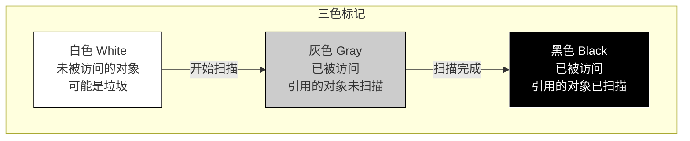

**颜色说明**：
- **白色（White）**：未被访问的对象（可能是垃圾）
- **灰色（Gray）**：已被访问，但其引用的对象还未被扫描
- **黑色（Black）**：已被访问，且其引用的对象都已被扫描

### 标记过程

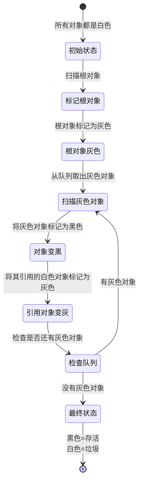

**详细步骤**：

1. **初始状态**：所有对象都是白色
2. **标记根对象**：根对象（全局变量、栈变量等）标记为灰色
3. **扫描灰色对象**：
   - 将灰色对象标记为黑色
   - 将其引用的白色对象标记为灰色
   - 重复直到没有灰色对象
4. **最终状态**：
   - 黑色对象 = 存活对象
   - 白色对象 = 垃圾对象（可回收）

### 标记过程示例图

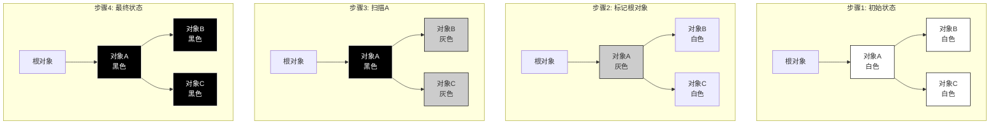

### 三色标记完整示例

```mermaid
graph TD
    subgraph "初始状态：所有对象都是白色"
        R1[Root] --> A1[对象A<br/>白色]
        A1 --> B1[对象B<br/>白色]
        B1 --> C1[对象C<br/>白色]
        A1 --> D1[对象D<br/>白色]
        
        style A1 fill:#ffffff,stroke:#000000
        style B1 fill:#ffffff,stroke:#000000
        style C1 fill:#ffffff,stroke:#000000
        style D1 fill:#ffffff,stroke:#000000
    end
    
    subgraph "标记根对象：Root 引用的对象变灰"
        R2[Root] --> A2[对象A<br/>灰色]
        A2 --> B2[对象B<br/>白色]
        B2 --> C2[对象C<br/>白色]
        A2 --> D2[对象D<br/>白色]
        
        style A2 fill:#cccccc,stroke:#000000
        style B2 fill:#ffffff,stroke:#000000
        style C2 fill:#ffffff,stroke:#000000
        style D2 fill:#ffffff,stroke:#000000
    end
    
    subgraph "扫描A：A变黑，引用的对象变灰"
        R3[Root] --> A3[对象A<br/>黑色]
        A3 --> B3[对象B<br/>灰色]
        B3 --> C3[对象C<br/>白色]
        A3 --> D3[对象D<br/>灰色]
        
        style A3 fill:#000000,stroke:#ffffff,color:#ffffff
        style B3 fill:#cccccc,stroke:#000000
        style C3 fill:#ffffff,stroke:#000000
        style D3 fill:#cccccc,stroke:#000000
    end
    
    subgraph "扫描B：B变黑，引用的对象变灰"
        R4[Root] --> A4[对象A<br/>黑色]
        A4 --> B4[对象B<br/>黑色]
        B4 --> C4[对象C<br/>灰色]
        A4 --> D4[对象D<br/>灰色]
        
        style A4 fill:#000000,stroke:#ffffff,color:#ffffff
        style B4 fill:#000000,stroke:#ffffff,color:#ffffff
        style C4 fill:#cccccc,stroke:#000000
        style D4 fill:#cccccc,stroke:#000000
    end
    
    subgraph "最终状态：所有对象都是黑色"
        R5[Root] --> A5[对象A<br/>黑色]
        A5 --> B5[对象B<br/>黑色]
        B5 --> C5[对象C<br/>黑色]
        A5 --> D5[对象D<br/>黑色]
        
        style A5 fill:#000000,stroke:#ffffff,color:#ffffff
        style B5 fill:#000000,stroke:#ffffff,color:#ffffff
        style C5 fill:#000000,stroke:#ffffff,color:#ffffff
        style D5 fill:#000000,stroke:#ffffff,color:#ffffff
    end
```

**结果**：
- 黑色对象（A, B, C, D）：存活，需要保留
- 白色对象：不存在，说明没有垃圾

## 并发标记的挑战

在并发标记过程中，程序可能修改对象之间的引用关系，导致标记错误：

### 问题场景：丢失标记

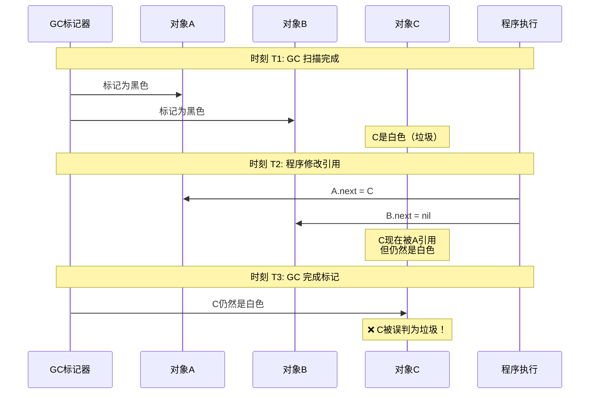

**问题**：C 对象实际上被 A 引用了，但因为标记时是白色，被误判为垃圾。

### 丢失标记的可视化

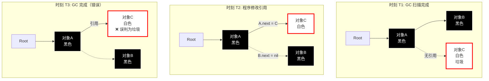

### 解决方案：写屏障（Write Barrier）

写屏障在对象引用关系改变时，将被引用的对象标记为灰色，确保不会丢失标记。

**写屏障规则**：如果黑色对象引用白色对象，将白色对象标记为灰色

```mermaid
sequenceDiagram
    participant GC as GC标记器
    participant A as 对象A黑色
    participant B as 对象B黑色
    participant C as 对象C白色
    participant 程序 as 程序执行
    participant 写屏障 as 写屏障
    
    Note over GC,程序: 时刻 T1: GC 扫描完成
    GC->>A: 标记为黑色
    GC->>B: 标记为黑色
    Note over C: C是白色
    
    Note over GC,程序: 时刻 T2: 程序修改引用
    程序->>A: A.next = C
    程序->>写屏障: 检测到黑色引用白色
    写屏障->>C: 将C标记为灰色
    Note over C: ✅ C被保护
    
    Note over GC,程序: 时刻 T3: GC 继续扫描
    GC->>C: 扫描灰色对象C
    GC->>C: 标记为黑色
    Note over C: ✅ C被正确标记
    
    Note over GC,程序: 时刻 T4: GC 完成
    Note over A,B,C: 所有对象正确标记
```

### 写屏障保护过程

```mermaid
graph TD
    subgraph "时刻 T1: GC 扫描完成"
        R1[Root] --> A1[对象A<br/>黑色]
        A1 --> B1[对象B<br/>黑色]
        A1 -.->|无引用| C1[对象C<br/>白色]
        
        style A1 fill:#000000,stroke:#ffffff,color:#ffffff
        style B1 fill:#000000,stroke:#ffffff,color:#ffffff
        style C1 fill:#ffffff,stroke:#000000
    end
    
    subgraph "时刻 T2: 写屏障触发"
        R2[Root] --> A2[对象A<br/>黑色]
        A2 -->|A.next = C| C2[对象C<br/>灰色<br/>✅ 写屏障保护]
        A2 -.-> B2[对象B<br/>黑色]
        
        style A2 fill:#000000,stroke:#ffffff,color:#ffffff
        style B2 fill:#000000,stroke:#ffffff,color:#ffffff
        style C2 fill:#cccccc,stroke:#00ff00,stroke-width:3px
    end
    
    subgraph "时刻 T3: GC 继续扫描"
        R3[Root] --> A3[对象A<br/>黑色]
        A3 --> C3[对象C<br/>灰色]
        A3 -.-> B3[对象B<br/>黑色]
        
        style A3 fill:#000000,stroke:#ffffff,color:#ffffff
        style B3 fill:#000000,stroke:#ffffff,color:#ffffff
        style C3 fill:#cccccc,stroke:#000000
    end
    
    subgraph "时刻 T4: GC 完成（正确）"
        R4[Root] --> A4[对象A<br/>黑色]
        A4 --> C4[对象C<br/>黑色<br/>✅ 正确保留]
        A4 -.-> B4[对象B<br/>黑色]
        
        style A4 fill:#000000,stroke:#ffffff,color:#ffffff
        style B4 fill:#000000,stroke:#ffffff,color:#ffffff
        style C4 fill:#000000,stroke:#00ff00,stroke-width:3px,color:#ffffff
    end
```

# GC 核心组件

## 1. GC 工作器（GC Worker）

GC 工作器是执行标记和清扫任务的 goroutine。

### 结构定义（简化）

```go
type gcWork struct {
    // 工作缓冲区
    wbuf1, wbuf2 *workbuf
    
    // 标记队列
    bytesMarked uint64
    scanWork    int64
}
```

### GC 工作器的作用

1. **标记对象**: 扫描灰色对象，标记其引用的对象
2. **并行工作**: 多个工作器并行标记，提高效率
3. **工作窃取**: 工作器可以窃取其他工作器的工作

## 2. 标记队列（Mark Queue）

标记队列用于存储待扫描的灰色对象。

### 标记队列结构

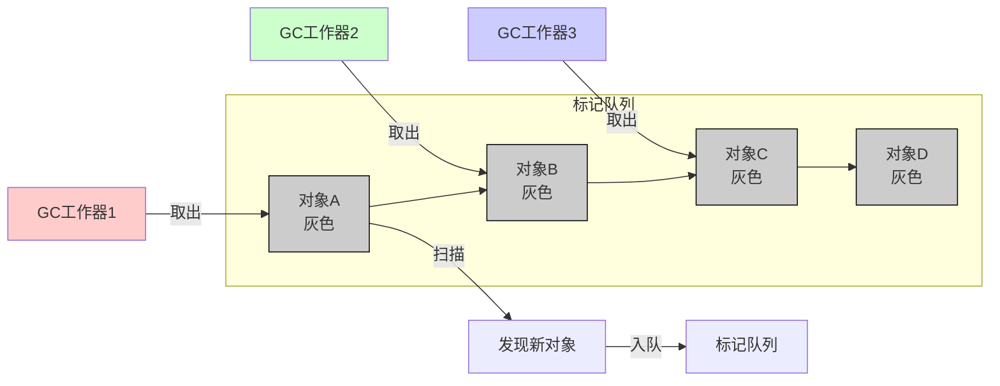

### 工作流程

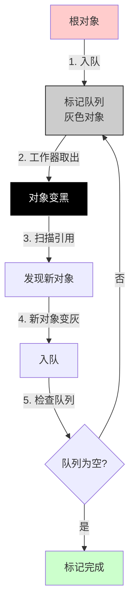

## 3. 写屏障（Write Barrier）

写屏障在对象引用改变时触发，确保并发标记的正确性。

### 插入写屏障（Insert Write Barrier）

```go
// 伪代码
func writebarrierptr(dst *unsafe.Pointer, src unsafe.Pointer) {
    // 如果 dst 是黑色对象，src 是白色对象
    if isBlack(dst) && isWhite(src) {
        // 将 src 标记为灰色
        shade(src)
    }
    // 执行实际的写操作
    *dst = src
}
```

### 写屏障类型

Go 1.8+ 使用**混合写屏障**（Hybrid Write Barrier），结合了插入写屏障和删除写屏障的优点。

## 4. 根对象扫描器（Root Scanner）

根对象是 GC 的起点，包括：

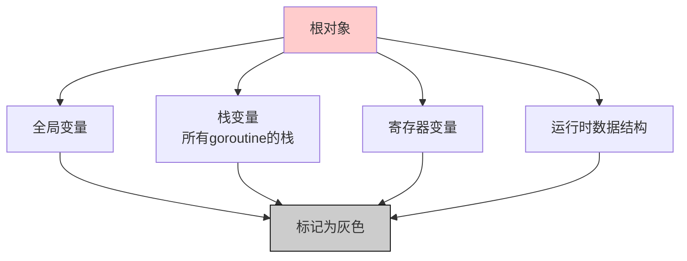

### 根扫描流程

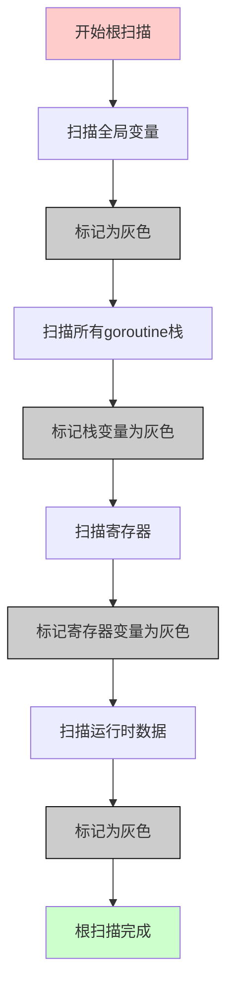

## 5. 清扫器（Sweeper）

清扫器负责回收标记为白色的对象（垃圾）。

### 清扫流程

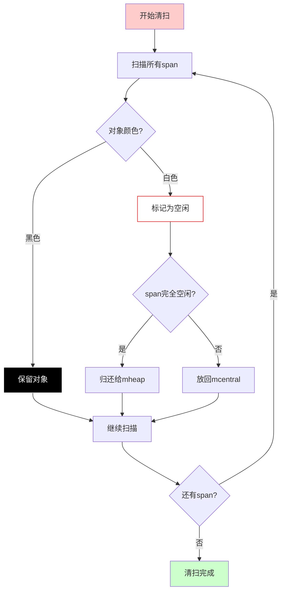

### 增量清扫

Go 使用增量清扫，将清扫工作分散到多个 GC 周期：

```mermaid
gantt
    title 增量清扫时间线
    dateFormat X
    axisFormat %s
    
    section GC周期1
    清扫部分内存    :0, 30
    
    section GC周期2
    继续清扫剩余内存 :30, 30
    
    section GC周期3
    完成清扫        :60, 30
```

**优势**：
- 避免一次性清扫导致的长停顿
- 将清扫工作分散到多个周期
- 与程序并发执行，减少影响

# GC 执行流程

## 完整的 GC 周期

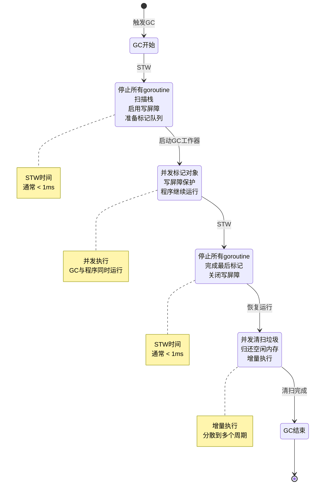

### GC 周期时间线

```mermaid
gantt
    title GC周期时间线
    dateFormat X
    axisFormat %L ms
    
    section STW阶段
    准备阶段    :0, 1
    
    section 并发阶段
    标记阶段    :1, 50
    
    section STW阶段
    标记终止    :51, 1
    
    section 并发阶段
    清扫阶段    :52, 100
```

## 详细流程说明

### 阶段 1: 准备阶段（STW - Stop The World）

```go
// 伪代码
func gcStart() {
    // 1. 停止所有 goroutine（STW）
    stopTheWorld()
    
    // 2. 扫描所有 goroutine 的栈
    scanStacks()
    
    // 3. 启用写屏障
    enableWriteBarrier()
    
    // 4. 初始化标记队列
    initMarkQueue()
    
    // 5. 标记根对象为灰色
    markRoots()
}
```

**STW 时间**: 通常 < 1ms

### 阶段 2: 标记阶段（并发）

```go
// 伪代码
func concurrentMark() {
    // 1. 启动 GC 工作器
    for i := 0; i < numGCWorkers; i++ {
        go gcWorker()
    }
    
    // 2. 恢复 goroutine 运行
    startTheWorld()
    
    // 3. 工作器并发标记
    // - 从标记队列取出灰色对象
    // - 扫描对象引用的其他对象
    // - 将新发现的灰色对象入队
    // - 写屏障保护并发安全
}
```

**并发执行**: GC 与程序同时运行

### 阶段 3: 标记终止（STW）

```go
// 伪代码
func markTermination() {
    // 1. 停止所有 goroutine（STW）
    stopTheWorld()
    
    // 2. 完成最后的标记工作
    drainMarkQueue()
    
    // 3. 关闭写屏障
    disableWriteBarrier()
    
    // 4. 计算需要清扫的内存
    calculateSweepWork()
}
```

**STW 时间**: 通常 < 1ms

### 阶段 4: 清扫阶段（并发）

```go
// 伪代码
func concurrentSweep() {
    // 1. 恢复 goroutine 运行
    startTheWorld()
    
    // 2. 并发清扫
    // - 扫描所有 span
    // - 回收白色对象（垃圾）
    // - 归还空闲内存
    // - 增量执行，不一次性完成
}
```

**增量执行**: 清扫工作分散到多个周期

# GC 触发条件

## 1. 自动触发

GC 会在以下情况自动触发：

### 堆内存增长触发

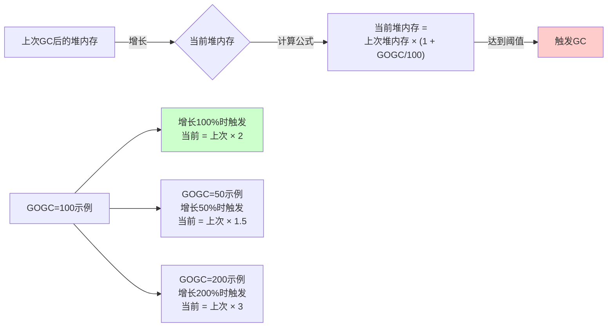

**计算公式**：
```
当前堆内存 = 上次 GC 后的堆内存 × (1 + GOGC/100)
```

**示例**：
- `GOGC = 100`：当前堆内存 = 上次堆内存 × 2（增长 100% 时触发）
- `GOGC = 50`：当前堆内存 = 上次堆内存 × 1.5（增长 50% 时触发）
- `GOGC = 200`：当前堆内存 = 上次堆内存 × 3（增长 200% 时触发）

### 代码触发

```go
// 手动触发 GC
runtime.GC()

// 设置 GC 目标百分比
debug.SetGCPercent(100)  // 默认 100
```

## 2. 强制触发

### 内存限制触发

```go
// Go 1.19+ 支持内存限制
debug.SetMemoryLimit(2 * 1024 * 1024 * 1024)  // 2GB

// 当内存使用超过限制时，强制触发 GC
```

### 系统压力触发

当系统内存压力大时，Go 会主动触发更频繁的 GC。

## 3. 定时触发

Go 运行时可能会定时触发 GC，确保内存及时回收。

# GC 性能指标

## 关键指标

### 1. GC 频率（GC Frequency）

```
GC 频率 = GC 次数 / 运行时间

频率过高: 可能内存分配过快
频率过低: 可能内存使用过多
```

### 2. GC 暂停时间（GC Pause Time）

```
STW 时间 = 准备阶段时间 + 标记终止时间

目标: < 1ms（通常 < 0.5ms）
```

### 3. GC CPU 占用（GC CPU Usage）

```
GC CPU 占用 = GC 使用的 CPU 时间 / 总 CPU 时间

目标: < 25%
```

### 4. 堆内存使用（Heap Usage）

```
堆内存使用 = 当前堆内存 / 最大堆内存

目标: 合理使用，避免过度分配
```

## 查看 GC 统计信息

### 方式 1: 使用 GODEBUG

```bash
# 设置环境变量
export GODEBUG=gctrace=1

# 运行程序
go run main.go
```

**输出示例：**
```
gc 1 @0.001s 2%: 0.010+0.20+0.002 ms clock, 0.040+0.20/0.10/0.20+0.008 ms cpu, 4->4->0 MB, 5 MB goal, 4 P
```

**字段说明：**
- `gc 1`: GC 周期编号
- `@0.001s`: 程序运行时间
- `2%`: GC 占用的 CPU 百分比
- `0.010+0.20+0.002 ms`: STW 时间（准备+标记终止+其他）
- `4->4->0 MB`: 堆内存变化（GC前->GC后->存活对象）
- `5 MB goal`: GC 目标堆大小
- `4 P`: 使用的 P 数量

### 方式 2: 使用 runtime.ReadMemStats

```go
package main

import (
    "fmt"
    "runtime"
    "time"
)

func main() {
    var m1, m2 runtime.MemStats
    
    runtime.GC()
    runtime.ReadMemStats(&m1)
    
    // 执行代码
    data := make([]byte, 1024*1024)
    _ = data
    
    runtime.GC()
    runtime.ReadMemStats(&m2)
    
    fmt.Printf("GC 次数: %d\n", m2.NumGC-m1.NumGC)
    fmt.Printf("GC 暂停时间: %v\n", time.Duration(m2.PauseTotalNs-m1.PauseTotalNs))
    fmt.Printf("堆内存: %d KB\n", m2.HeapAlloc/1024)
}
```

### 方式 3: 使用 pprof

```bash
# 获取 GC 统计
go tool pprof http://localhost:6060/debug/pprof/heap

# 查看 GC 相关信息
(pprof) top
(pprof) list 函数名
```

# GC 调优参数

## 1. GOGC 参数

控制 GC 的触发频率：

```bash
# 默认值：100
# 表示：当堆内存增长 100% 时触发 GC
export GOGC=100

# 更积极的 GC（更频繁，内存使用更少）
export GOGC=50   # 增长 50% 就触发

# 更宽松的 GC（更少 GC，内存使用更多）
export GOGC=200  # 增长 200% 才触发

# 禁用自动 GC（不推荐）
export GOGC=off
```

### GOGC 的影响

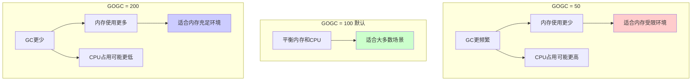

**对比表**：

| GOGC 值 | GC 频率 | 内存使用 | CPU 占用 | 适用场景 |
|---------|---------|---------|---------|---------|
| 50 | 更频繁 | 更少 | 可能更高 | 内存受限环境 |
| 100（默认） | 平衡 | 平衡 | 平衡 | 大多数场景 |
| 200 | 更少 | 更多 | 可能更低 | 内存充足环境 |

## 2. GOMEMLIMIT 参数

设置内存使用上限（Go 1.19+）：

```bash
# 设置最大内存使用为 2GB
export GOMEMLIMIT=2GiB

# 设置最大内存使用为 512MB
export GOMEMLIMIT=512MiB

# 禁用内存限制（默认）
export GOMEMLIMIT=0
```

### GOMEMLIMIT 的影响

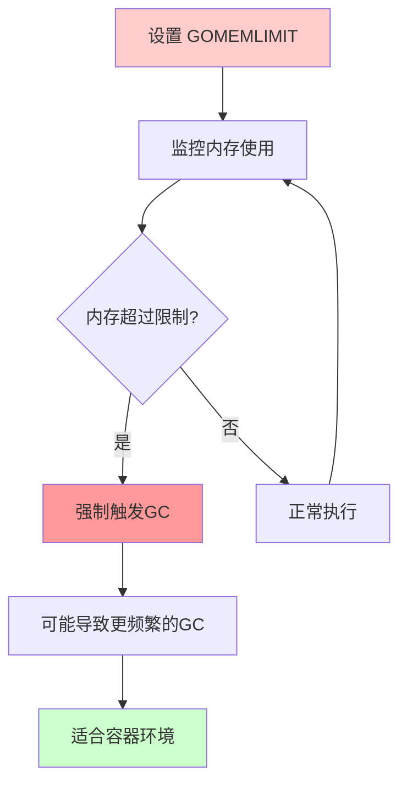

**特点**：
- 防止程序使用过多内存
- 超过限制时强制触发 GC
- 可能导致更频繁的 GC
- 适合容器环境

## 3. 其他环境变量

```bash
# GC 调试信息
export GODEBUG=gctrace=1

# 设置 GC 目标百分比（代码中）
debug.SetGCPercent(100)

# 设置内存限制（代码中）
debug.SetMemoryLimit(2 * 1024 * 1024 * 1024)
```

# GC 优化策略

## 1. 减少内存分配

### 使用对象池

```go
package main

import (
    "sync"
)

var pool = sync.Pool{
    New: func() interface{} {
        return make([]byte, 1024)
    },
}

func main() {
    // 从池中获取
    buf := pool.Get().([]byte)
    defer pool.Put(buf) // 归还到池中
    
    // 使用 buf
    // ...
}
```

### 预分配切片容量

```go
// 不好：频繁扩容，增加 GC 压力
var s []int
for i := 0; i < 1000; i++ {
    s = append(s, i)
}

// 好：预分配容量
s := make([]int, 0, 1000)
for i := 0; i < 1000; i++ {
    s = append(s, i)
}
```

## 2. 减少指针使用

### 使用值类型

```go
// 小结构体使用值类型
type Point struct {
    X, Y int
}

// 值类型：在栈上分配，无需 GC
func useValue(p Point) {
    // ...
}

// 指针类型：在堆上分配，需要 GC
func usePointer(p *Point) {
    // ...
}
```

### 使用数组而非切片

```go
// 固定大小使用数组
var arr [100]int  // 栈上分配

// 动态大小使用切片
var slice []int   // 堆上分配
```

## 3. 优化数据结构

### 减少嵌套指针

```go
// 不好：深层指针嵌套
type Node struct {
    Children []*Node  // 指针数组
}

// 好：使用索引
type Node struct {
    Children []int  // 索引数组
}
```

### 使用结构体数组

```go
// 不好：指针数组
type Nodes []*Node

// 好：值数组
type Nodes []Node
```

## 4. 合理设置 GC 参数

### 根据场景调整 GOGC

```go
// 内存受限环境
os.Setenv("GOGC", "50")

// 内存充足环境
os.Setenv("GOGC", "200")

// 容器环境
os.Setenv("GOMEMLIMIT", "512MiB")
```

## 5. 监控 GC 性能

### 定期检查 GC 统计

```go
package main

import (
    "fmt"
    "runtime"
    "time"
)

func monitorGC() {
    var m runtime.MemStats
    for {
        runtime.ReadMemStats(&m)
        fmt.Printf("GC 次数: %d\n", m.NumGC)
        fmt.Printf("GC 暂停时间: %v\n", time.Duration(m.PauseTotalNs))
        fmt.Printf("堆内存: %d MB\n", m.HeapAlloc/1024/1024)
        time.Sleep(5 * time.Second)
    }
}
```

# GC 与内存分配器的协作

## 协作流程

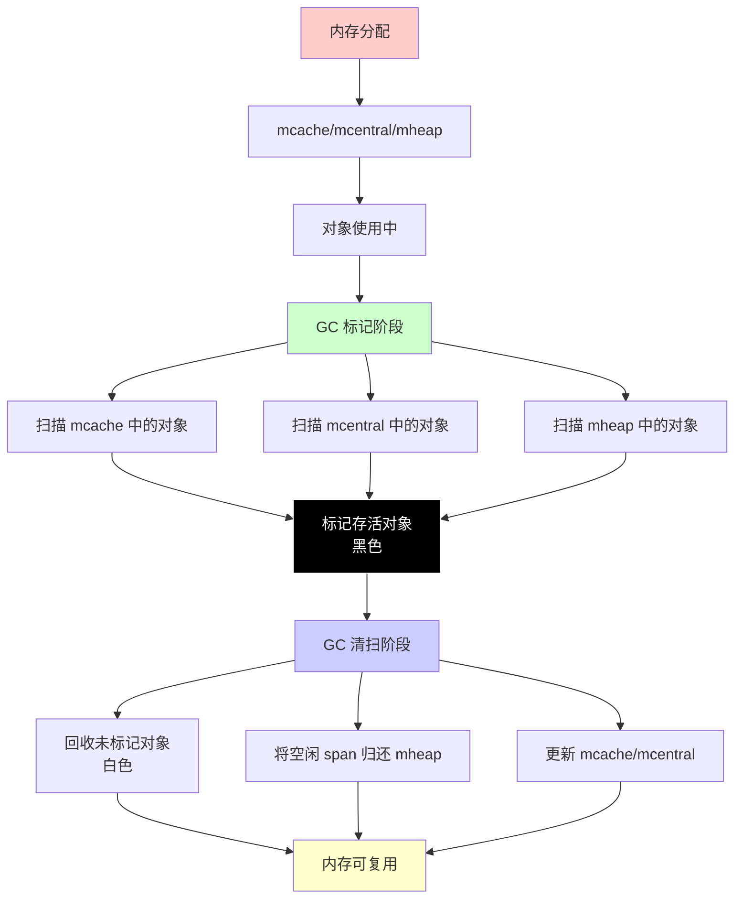

## 标记阶段与分配器的交互

```mermaid
sequenceDiagram
    participant 程序 as 程序执行
    participant mcache as mcache
    participant 写屏障 as 写屏障
    participant GC as GC标记器
    
    Note over 程序,GC: 分配对象时
    程序->>mcache: 从 mcache 分配对象
    mcache-->>程序: 返回对象
    程序->>写屏障: 如果被根对象引用
    写屏障->>写屏障: 标记对象为灰色
    
    Note over 程序,GC: GC 标记时
    GC->>mcache: 扫描 mcache 中的对象
    mcache-->>GC: 返回对象列表
    GC->>GC: 标记可达对象为黑色
    GC->>mcache: 更新对象的标记位
```

## 清扫阶段与分配器的交互

```mermaid
flowchart TD
    A[GC 清扫开始] --> B[扫描所有 span]
    B --> C{对象颜色?}
    C -->|白色| D[回收对象]
    C -->|黑色| E[保留对象]
    
    D --> F{span状态?}
    F -->|完全空闲| G[归还 mheap]
    F -->|部分空闲| H[放回 mcentral]
    
    G --> I[mcache 可以复用]
    H --> I
    E --> J[继续扫描]
    I --> J
    
    style A fill:#ffcccc
    style D fill:#ffffff,stroke:#ff0000
    style E fill:#000000,stroke:#ffffff,color:#ffffff
    style I fill:#ccffcc
```

# 常见问题与解决方案

## 1. GC 暂停时间过长

### 问题表现

```mermaid
graph TB
    A[GC暂停时间 > 10ms] --> B[程序响应变慢]
    B --> C[用户体验差]
    
    style A fill:#ffcccc
    style C fill:#ff9999
```

### 解决方案

```mermaid
flowchart TD
    A[GC暂停时间过长] --> B{解决方案}
    
    B -->|方案1| C1[减少内存分配<br/>对象池/预分配/减少指针]
    B -->|方案2| C2[调整GOGC参数<br/>GOGC=50更频繁GC]
    B -->|方案3| C3[优化数据结构<br/>减少指针嵌套/值类型]
    
    C1 --> D[降低GC压力]
    C2 --> D
    C3 --> D
    
    style A fill:#ffcccc
    style D fill:#ccffcc
```

## 2. GC CPU 占用过高

### 问题表现

```mermaid
graph TB
    A[GC CPU占用 > 50%] --> B[整体性能下降]
    B --> C[CPU资源浪费]
    
    style A fill:#ffcccc
    style C fill:#ff9999
```

### 解决方案

```mermaid
flowchart TD
    A[GC CPU占用过高] --> B{解决方案}
    
    B -->|方案1| C1[减少内存分配<br/>对象池/复用缓冲区]
    B -->|方案2| C2[调整GOGC参数<br/>GOGC=200更宽松]
    B -->|方案3| C3[优化代码<br/>减少不必要分配]
    
    C1 --> D[降低GC频率]
    C2 --> D
    C3 --> D
    
    style A fill:#ffcccc
    style D fill:#ccffcc
```

## 3. 内存使用过多

### 问题表现

```mermaid
graph TB
    A[堆内存持续增长] --> B[可能触发OOM]
    B --> C[内存使用率低]
    
    style A fill:#ffcccc
    style C fill:#ff9999
```

### 解决方案

```mermaid
flowchart TD
    A[内存使用过多] --> B{解决方案}
    
    B -->|方案1| C1[调整GOGC参数<br/>GOGC=50更积极]
    B -->|方案2| C2[设置内存限制<br/>GOMEMLIMIT]
    B -->|方案3| C3[检查内存泄漏<br/>pprof对比分析]
    
    C1 --> D[降低内存使用]
    C2 --> D
    C3 --> D
    
    style A fill:#ffcccc
    style D fill:#ccffcc
```

## 4. GC 频率过高

### 问题表现

```mermaid
graph TB
    A[GC频率 > 10次/秒] --> B[程序性能下降]
    B --> C[CPU占用高]
    
    style A fill:#ffcccc
    style C fill:#ff9999
```

### 解决方案

```mermaid
flowchart TD
    A[GC频率过高] --> B{解决方案}
    
    B -->|方案1| C1[减少内存分配速度<br/>对象池/批量处理]
    B -->|方案2| C2[调整GOGC参数<br/>GOGC=200允许更多增长]
    B -->|方案3| C3[优化代码<br/>复用对象]
    
    C1 --> D[降低GC频率]
    C2 --> D
    C3 --> D
    
    style A fill:#ffcccc
    style D fill:#ccffcc
```

# 实际应用示例

## 示例 1: 监控 GC 性能

```go
package main

import (
    "fmt"
    "runtime"
    "time"
)

func main() {
    // 启动监控
    go monitorGC()
    
    // 模拟工作负载
    for i := 0; i < 1000; i++ {
        data := make([]byte, 1024*1024)
        _ = data
        time.Sleep(100 * time.Millisecond)
    }
}

func monitorGC() {
    var lastNumGC uint32
    var lastPauseTotalNs uint64
    
    for {
        var m runtime.MemStats
        runtime.ReadMemStats(&m)
        
        if lastNumGC > 0 {
            numGC := m.NumGC - lastNumGC
            pauseTotal := m.PauseTotalNs - lastPauseTotalNs
            
            if numGC > 0 {
                avgPause := time.Duration(pauseTotal) / time.Duration(numGC)
                fmt.Printf("GC 次数: %d, 平均暂停: %v, 堆内存: %d MB\n",
                    numGC, avgPause, m.HeapAlloc/1024/1024)
            }
        }
        
        lastNumGC = m.NumGC
        lastPauseTotalNs = m.PauseTotalNs
        time.Sleep(5 * time.Second)
    }
}
```

## 示例 2: 优化内存分配

```go
package main

import (
    "sync"
)

// 使用对象池减少分配
var bufferPool = sync.Pool{
    New: func() interface{} {
        return make([]byte, 0, 1024)
    },
}

func processData(data []byte) {
    // 从池中获取缓冲区
    buf := bufferPool.Get().([]byte)
    defer bufferPool.Put(buf[:0]) // 归还到池中，重置长度
    
    // 使用缓冲区
    buf = append(buf, data...)
    // 处理数据...
    _ = buf
}
```

## 示例 3: 调整 GC 参数

```go
package main

import (
    "runtime/debug"
    "os"
)

func main() {
    // 根据环境调整 GC
    if os.Getenv("ENV") == "production" {
        // 生产环境：平衡内存和性能
        debug.SetGCPercent(100)
        debug.SetMemoryLimit(2 * 1024 * 1024 * 1024) // 2GB
    } else {
        // 开发环境：更积极的 GC
        debug.SetGCPercent(50)
    }
    
    // 业务代码...
}
```

# 总结

Go 垃圾回收器的核心特点：

1. **并发执行**: GC 与程序并发运行，减少停顿时间
2. **三色标记**: 使用三色标记算法追踪可达对象
3. **写屏障保护**: 确保并发标记的正确性
4. **低延迟**: STW 时间通常 < 1ms
5. **自动管理**: 无需手动管理内存

**GC 流程：**

```mermaid
flowchart LR
    A[准备阶段<br/>STW] --> B[标记阶段<br/>并发]
    B --> C[标记终止<br/>STW]
    C --> D[清扫阶段<br/>并发]
    
    style A fill:#ffcccc
    style B fill:#ccffcc
    style C fill:#ffcccc
    style D fill:#ccffcc
```

**核心组件：**

```mermaid
graph TB
    A[GC核心组件] --> B[GC工作器<br/>执行标记和清扫任务]
    A --> C[标记队列<br/>存储待扫描的灰色对象]
    A --> D[写屏障<br/>保护并发标记的正确性]
    A --> E[根扫描器<br/>扫描根对象]
    A --> F[清扫器<br/>回收垃圾对象]
    
    style A fill:#ffcccc
    style B fill:#ccffcc
    style C fill:#ccffcc
    style D fill:#ccffcc
    style E fill:#ccffcc
    style F fill:#ccffcc
```

**优化建议：**

```mermaid
graph TD
    A[GC优化建议] --> B[减少内存分配<br/>对象池/预分配]
    A --> C[减少指针使用<br/>值类型/数组]
    A --> D[合理设置GC参数<br/>GOGC/GOMEMLIMIT]
    A --> E[监控GC性能<br/>GODEBUG/pprof]
    A --> F[优化数据结构<br/>减少嵌套/值类型]
    
    style A fill:#ffcccc
    style B fill:#ccffcc
    style C fill:#ccffcc
    style D fill:#ccffcc
    style E fill:#ccffcc
    style F fill:#ccffcc
```

理解 Go GC 的工作原理，有助于编写高性能的 Go 程序，减少 GC 压力，提高程序性能。

