推荐阅读：[Go Runtime Stack](https://go.dev/src/runtime/stack.go)

# Go 栈概述

Go 语言的栈管理是运行时系统的重要组成部分，负责管理 goroutine 的栈空间。Go 1.4 之前使用**分段栈**（Segmented Stack），Go 1.4+ 使用**连续栈**（Contiguous Stack）。

## 设计目标

1. **高效分配**：快速为 goroutine 分配栈空间
2. **动态扩容**：根据需求自动扩展栈大小
3. **内存效率**：减少栈空间浪费
4. **性能优化**：最小化栈操作开销

## 栈的特点

- **每个 goroutine 独立栈**：初始大小通常为 2KB（Go 1.2+）
- **动态增长**：栈空间不足时自动扩容
- **自动收缩**：栈空间使用率低时自动缩容
- **逃逸分析**：决定变量分配在栈还是堆

# 逃逸分析

逃逸分析（Escape Analysis）是 Go 编译器在编译时进行的静态分析，用于确定变量应该分配在栈上还是堆上。

## 什么是逃逸

当一个变量的生命周期超出了声明它的函数作用域时，就发生了**逃逸**。逃逸的变量必须分配在堆上，以便在函数返回后仍然可以访问。

## 逃逸分析的作用

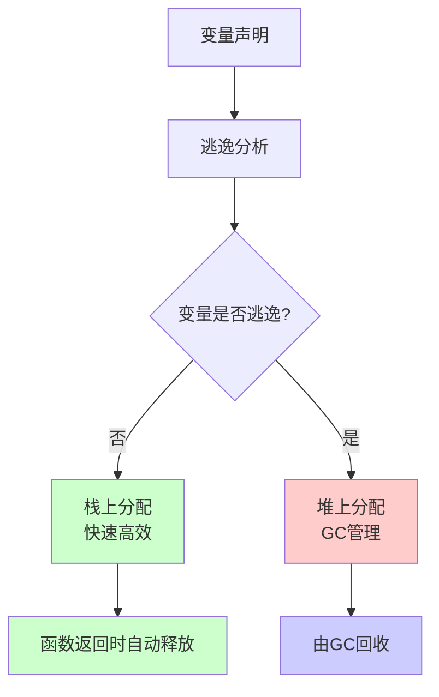

## 逃逸场景

### 1. 返回局部变量指针

```go
func escapeExample() *int {
    x := 42  // x 逃逸到堆
    return &x
}

func noEscapeExample() int {
    x := 42  // x 在栈上
    return x
}
```

### 2. 变量被闭包捕获

```go
func closureEscape() {
    x := 100
    func() {
        fmt.Println(x)  // x 被闭包捕获，逃逸到堆
    }()
}

func closureNoEscape() {
    x := 100
    fmt.Println(x)  // x 不逃逸，在栈上
}
```

### 3. 变量大小超过栈限制

```go
func largeStack() {
    var arr [1024 * 1024]int  // 大数组可能逃逸
    _ = arr
}

func smallStack() {
    var arr [100]int  // 小数组在栈上
    _ = arr
}
```

### 4. 动态大小分配

```go
func dynamicEscape() {
    size := 1000
    arr := make([]int, size)  // 动态大小可能逃逸
    _ = arr
}
```

### 5. 接口类型

```go
func interfaceEscape() {
    x := 42
    var i interface{} = x  // 接口类型可能逃逸
    _ = i
}
```

## 查看逃逸分析结果

### 使用编译器标志

```bash
# 查看逃逸分析详细信息
go build -gcflags="-m -m" main.go

# 只查看逃逸的变量
go build -gcflags="-m" main.go
```

### 示例输出

```go
package main

func escape() *int {
    x := 42
    return &x
}

func main() {
    _ = escape()
}
```

**编译输出**：
```
./main.go:4:6: can inline escape
./main.go:8:6: can inline main
./main.go:4:9: &x escapes to heap
./main.go:4:9:  moved to heap: x
```

## 逃逸分析示例

### 示例 1：栈分配

```go
package main

func stackAlloc() int {
    x := 100  // 栈上分配
    y := 200  // 栈上分配
    return x + y
}

func main() {
    _ = stackAlloc()
}
```

**分析结果**：
- `x` 和 `y` 都在栈上分配
- 函数返回时自动释放
- 无 GC 压力

### 示例 2：堆分配

```go
package main

func heapAlloc() *int {
    x := 100  // 堆上分配（逃逸）
    return &x
}

func main() {
    ptr := heapAlloc()
    _ = ptr
}
```

**分析结果**：
- `x` 逃逸到堆
- 由 GC 管理
- 有 GC 压力

### 示例 3：部分逃逸

```go
package main

func partialEscape(condition bool) *int {
    x := 100
    if condition {
        return &x  // x 逃逸
    }
    return nil
}
```

**分析结果**：
- 即使条件为 false，`x` 仍然逃逸
- 编译器采用保守策略

## 优化逃逸分析

### 1. 避免返回局部变量指针

```go
// ❌ 不好：导致逃逸
func bad() *int {
    x := 42
    return &x
}

// ✅ 好：值传递
func good() int {
    x := 42
    return x
}
```

### 2. 使用值类型而非接口

```go
// ❌ 不好：接口类型可能逃逸
func bad() interface{} {
    x := 42
    return x
}

// ✅ 好：具体类型
func good() int {
    x := 42
    return x
}
```

### 3. 避免大对象

```go
// ❌ 不好：大对象可能逃逸
func bad() {
    var arr [10000]int
    _ = arr
}

// ✅ 好：使用切片（如果可能）
func good() {
    arr := make([]int, 10000)
    _ = arr
}
```

## 逃逸分析总结

| 场景 | 是否逃逸 | 分配位置 |
|------|---------|---------|
| 返回局部变量指针 | 是 | 堆 |
| 闭包捕获变量 | 是 | 堆 |
| 大对象（>64KB） | 是 | 堆 |
| 动态大小分配 | 可能 | 堆/栈 |
| 接口类型 | 可能 | 堆/栈 |
| 局部变量（值传递） | 否 | 栈 |

# 栈空间

## 栈大小

Go 的 goroutine 栈初始大小：

- **Go 1.2 之前**：4KB
- **Go 1.2+**：2KB
- **Go 1.4+**：2KB（使用连续栈）

栈的最大大小：

- **64位系统**：1GB
- **32位系统**：250MB

## 分段栈（Segmented Stack）

Go 1.4 之前使用的栈实现方式。

### 工作原理

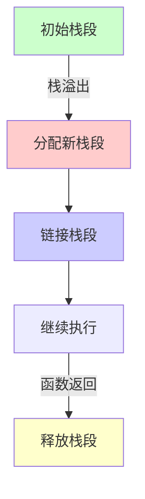

### 特点

- **分段存储**：栈由多个不连续的段组成
- **按需分配**：栈溢出时分配新段
- **自动链接**：新段链接到旧段
- **自动释放**：函数返回时释放段

### 问题

1. **热分裂（Hot Split）问题**：
   - 函数在栈边界频繁调用
   - 导致频繁分配和释放栈段
   - 性能开销大

2. **栈指针跳跃**：
   - 栈段不连续
   - 缓存不友好

### 示例

```go
// Go 1.3 及之前版本
func recursiveCall(n int) {
    if n > 0 {
        recursiveCall(n - 1)  // 可能导致栈段分裂
    }
}
```

## 连续栈（Contiguous Stack）

Go 1.4+ 使用的栈实现方式。

### 工作原理

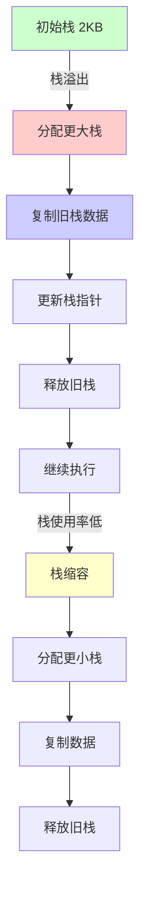

### 特点

- **连续内存**：栈是连续的内存区域
- **动态扩容**：栈溢出时分配更大的栈
- **数据复制**：将旧栈数据复制到新栈
- **自动缩容**：栈使用率低时缩小栈

### 扩容策略

```go
// runtime/stack.go (简化)
const (
    _StackMin = 2048  // 最小栈大小 2KB
    
    // 栈扩容倍数
    stackGrowthMultiplier = 2
)

func stackalloc(n uintptr) *stack {
    // 分配新栈
}

func stackcopy(old *stack, newsize uintptr) {
    // 复制栈数据
}
```

### 扩容条件

- **栈溢出检测**：函数调用时检查栈空间
- **扩容阈值**：栈使用率超过一定比例
- **扩容大小**：通常是当前栈大小的 2 倍

### 缩容条件

- **栈使用率低**：使用率低于 25%
- **缩容大小**：缩小到当前大小的 1/2
- **最小限制**：不小于 `_StackMin`（2KB）

### 优势

1. **性能更好**：连续内存，缓存友好
2. **无热分裂**：解决了分段栈的热分裂问题
3. **更简单**：实现更简单，维护更容易

### 劣势

1. **复制开销**：扩容时需要复制数据
2. **内存浪费**：可能分配比需要更大的栈

## 分段栈 vs 连续栈

| 特性 | 分段栈 | 连续栈 |
|------|--------|--------|
| 内存布局 | 不连续 | 连续 |
| 扩容方式 | 分配新段 | 复制到更大栈 |
| 热分裂问题 | 有 | 无 |
| 缓存友好 | 否 | 是 |
| 实现复杂度 | 高 | 低 |
| Go 版本 | 1.3 及之前 | 1.4+ |

# 栈操作

## 初始化

### goroutine 栈初始化

当创建新的 goroutine 时，会为其分配初始栈空间。

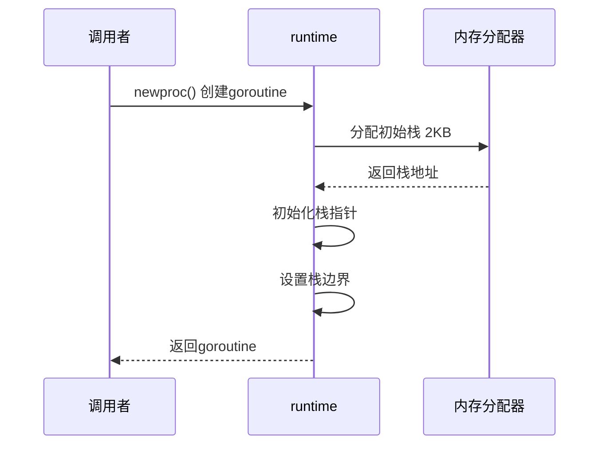

### 代码示例

```go
// runtime/proc.go (简化)
func newproc(siz int32, fn *funcval) {
    // 1. 分配栈空间
    newg := allocg(_StackMin)  // 分配最小栈 2KB
    
    // 2. 初始化栈
    newg.stack = stackalloc(_StackMin)
    newg.stackguard0 = newg.stack.lo + _StackGuard
    newg.stackguard1 = ^uintptr(0)
    
    // 3. 设置栈指针
    sp := newg.stack.hi
    // ...
}
```

## 栈分配

### 栈帧分配

函数调用时，会在栈上分配栈帧（Stack Frame）。

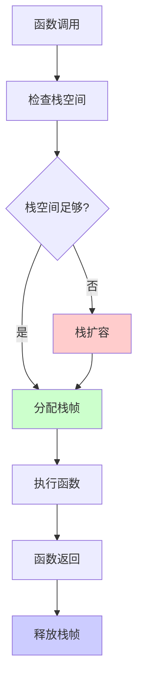

### 栈帧结构

```go
// 栈帧布局（简化）
type stackFrame struct {
    // 返回地址
    returnAddr uintptr
    
    // 局部变量
    localVars []byte
    
    // 参数
    args []byte
    
    // 保存的寄存器
    savedRegs []byte
}
```

### 栈帧大小计算

```go
// 编译器计算栈帧大小
func calculateFrameSize(fn *Func) uintptr {
    size := 0
    
    // 参数大小
    size += fn.argsSize
    
    // 局部变量大小
    size += fn.localVarsSize
    
    // 对齐
    size = alignUp(size, 8)
    
    return size
}
```

## 栈扩容

### 扩容流程

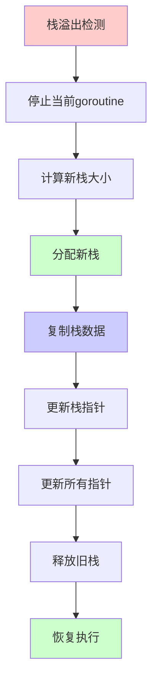

### 扩容代码

```go
// runtime/stack.go (简化)
func copystack(gp *g, newsize uintptr) {
    old := gp.stack
    used := old.hi - gp.sched.sp
    
    // 1. 分配新栈
    new := stackalloc(newsize)
    
    // 2. 复制栈数据
    memmove(new.hi-used, old.hi-used, used)
    
    // 3. 调整指针
    adjustpointers(unsafe.Pointer(new.hi-used), &adjustinfo{
        old:  old,
        new:  new,
        delta: new.hi - old.hi,
    })
    
    // 4. 更新栈信息
    gp.stack = new
    gp.stackguard0 = new.lo + _StackGuard
    gp.sched.sp = new.hi - used
    
    // 5. 释放旧栈
    stackfree(old)
}
```

### 扩容时机

1. **函数调用时**：检查栈空间是否足够
2. **栈溢出检测**：`stackguard0` 检查
3. **扩容阈值**：栈使用率超过阈值

### 扩容大小

```go
// 扩容策略
func stackgrow(gp *g) {
    oldsize := gp.stack.hi - gp.stack.lo
    newsize := oldsize * 2  // 扩容 2 倍
    
    if newsize > _StackMax {
        newsize = _StackMax  // 最大 1GB
    }
    
    copystack(gp, newsize)
}
```

## 栈缩容

### 缩容流程

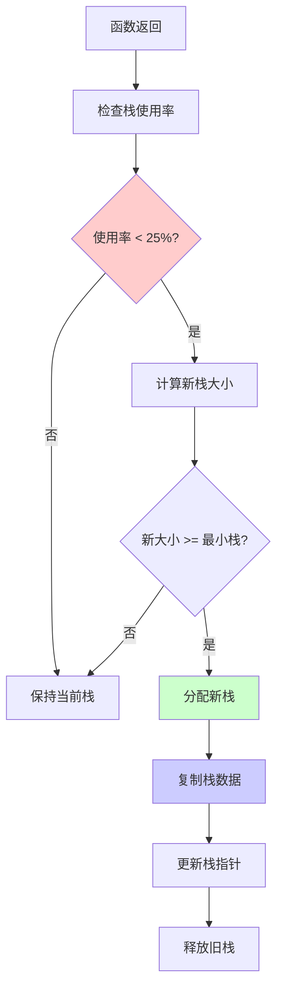

### 缩容代码

```go
// runtime/stack.go (简化)
func shrinkstack(gp *g) {
    oldsize := gp.stack.hi - gp.stack.lo
    used := gp.stack.hi - gp.sched.sp
    usepercent := used * 100 / oldsize
    
    // 使用率低于 25% 才缩容
    if usepercent >= 25 {
        return
    }
    
    // 计算新栈大小（缩小到 1/2）
    newsize := oldsize / 2
    if newsize < _StackMin {
        newsize = _StackMin  // 最小 2KB
    }
    
    // 如果新栈大小和旧栈一样，不缩容
    if newsize >= oldsize {
        return
    }
    
    copystack(gp, newsize)
}
```

### 缩容时机

1. **函数返回时**：检查栈使用率
2. **GC 时**：可能触发缩容
3. **定期检查**：运行时定期检查

### 缩容限制

- **最小栈大小**：不小于 `_StackMin`（2KB）
- **使用率阈值**：使用率低于 25% 才缩容
- **频率限制**：不会频繁缩容

## 栈复用

栈复用（Stack Reuse）是 Go 运行时的一个重要优化机制，用于复用已释放的栈空间，减少内存分配和释放的开销。

### 为什么需要栈复用

当 goroutine 结束时，其栈空间会被释放。如果每次都重新分配栈空间，会产生以下问题：

1. **内存分配开销**：频繁分配和释放栈空间
2. **内存碎片**：频繁分配可能导致内存碎片
3. **性能影响**：分配操作需要系统调用，开销较大

### 栈复用的工作原理

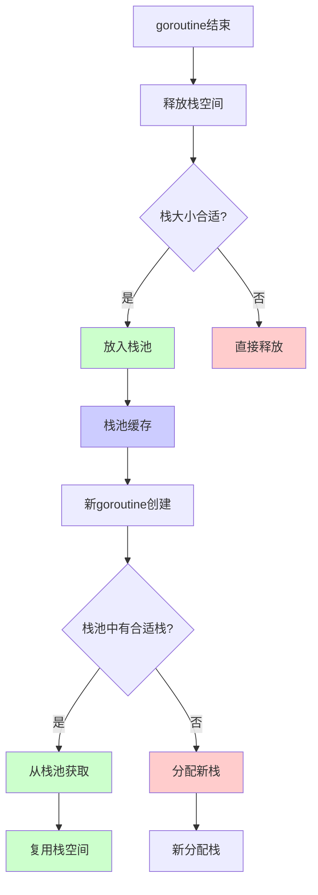

### 栈池（Stack Pool）

Go 运行时维护一个栈池，用于缓存已释放的栈空间。

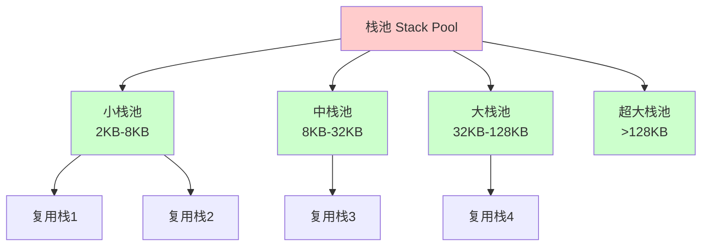

### 栈池实现

```go
// runtime/stack.go (简化)
type stackPool struct {
    // 按大小分类的栈池
    small [4]stackList  // 2KB, 4KB, 8KB, 16KB
    large stackList      // 更大的栈
}

type stackList struct {
    list *stack
    mu   mutex
}

// 从栈池获取栈
func stackpoolalloc(size uintptr) *stack {
    pool := &stackpool[stackPoolSizeClass(size)]
    
    pool.mu.Lock()
    if pool.list != nil {
        s := pool.list
        pool.list = s.next
        pool.mu.Unlock()
        return s
    }
    pool.mu.Unlock()
    
    // 栈池为空，分配新栈
    return stackalloc(size)
}

// 将栈放回栈池
func stackpoolfree(s *stack, size uintptr) {
    pool := &stackpool[stackPoolSizeClass(size)]
    
    // 限制栈池大小，避免占用过多内存
    if pool.count >= maxStackPoolSize {
        stackfree(s)
        return
    }
    
    pool.mu.Lock()
    s.next = pool.list
    pool.list = s
    pool.count++
    pool.mu.Unlock()
}
```

### 栈复用的条件

栈复用需要满足以下条件：

1. **栈大小合适**：栈大小在复用范围内
2. **栈池未满**：栈池未达到最大容量
3. **栈状态正常**：栈没有被损坏

### 栈大小分类

```go
// runtime/stack.go (简化)
func stackPoolSizeClass(size uintptr) int {
    switch {
    case size <= 2*1024:
        return 0  // 2KB
    case size <= 4*1024:
        return 1  // 4KB
    case size <= 8*1024:
        return 2  // 8KB
    case size <= 16*1024:
        return 3  // 16KB
    default:
        return 4  // 更大的栈
    }
}
```

### 栈复用流程

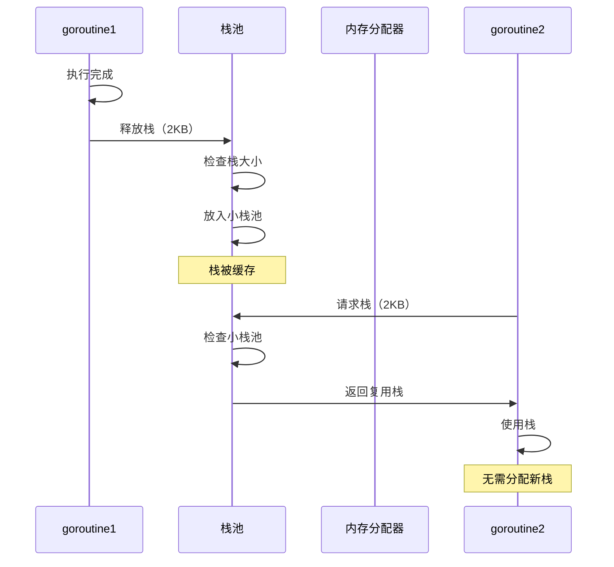

### 栈复用的优势

1. **减少内存分配**：复用已分配的栈空间
2. **提高性能**：避免频繁的系统调用
3. **减少碎片**：复用减少内存碎片
4. **降低延迟**：从栈池获取比分配更快

### 栈复用示例

#### 示例 1：栈复用场景

```go
package main

import (
    "runtime"
    "sync"
    "time"
)

func worker(id int, wg *sync.WaitGroup) {
    defer wg.Done()
    
    // 使用栈空间
    local := make([]int, 100)
    for i := range local {
        local[i] = id * 100 + i
    }
    
    // 模拟工作
    time.Sleep(10 * time.Millisecond)
    
    // goroutine 结束，栈可能被复用
}

func main() {
    var wg sync.WaitGroup
    
    // 创建多个 goroutine
    for i := 0; i < 1000; i++ {
        wg.Add(1)
        go worker(i, &wg)
    }
    
    wg.Wait()
    
    // 后续创建的 goroutine 可能复用之前的栈
    runtime.GC()  // 触发 GC，可能清理栈池
}
```

#### 示例 2：栈复用效果

```go
package main

import (
    "fmt"
    "runtime"
    "time"
)

func showStackReuse() {
    var m1, m2 runtime.MemStats
    
    // 第一次：创建大量 goroutine
    for i := 0; i < 1000; i++ {
        go func() {
            _ = make([]byte, 1024)
            time.Sleep(1 * time.Millisecond)
        }()
    }
    
    runtime.GC()
    runtime.ReadMemStats(&m1)
    
    time.Sleep(100 * time.Millisecond)
    
    // 第二次：再次创建 goroutine（可能复用栈）
    for i := 0; i < 1000; i++ {
        go func() {
            _ = make([]byte, 1024)
            time.Sleep(1 * time.Millisecond)
        }()
    }
    
    runtime.GC()
    runtime.ReadMemStats(&m2)
    
    // 比较内存使用
    fmt.Printf("第一次分配: %d KB\n", m1.StackInuse/1024)
    fmt.Printf("第二次分配: %d KB\n", m2.StackInuse/1024)
    fmt.Printf("栈复用效果: %d KB\n", (m1.StackInuse-m2.StackInuse)/1024)
}
```

### 栈池限制

栈池不是无限制的，有以下限制：

1. **最大容量**：每个栈池有最大容量限制
2. **大小范围**：只缓存特定大小范围的栈
3. **GC 清理**：GC 时可能清理栈池

### 栈池清理

```go
// runtime/stack.go (简化)
func stackpool_trim() {
    // GC 时清理栈池
    for i := range stackpool {
        pool := &stackpool[i]
        pool.mu.Lock()
        
        // 清理部分栈
        for pool.count > maxStackPoolSize/2 {
            s := pool.list
            pool.list = s.next
            stackfree(s)
            pool.count--
        }
        
        pool.mu.Unlock()
    }
}
```

### 栈复用 vs 直接分配

| 特性 | 栈复用 | 直接分配 |
|------|--------|---------|
| 性能 | 快（从池中获取） | 慢（系统调用） |
| 内存使用 | 可能占用更多（缓存） | 按需分配 |
| 适用场景 | 频繁创建 goroutine | 偶尔创建 goroutine |
| 内存碎片 | 较少 | 可能较多 |

### 栈复用的最佳实践

1. **理解栈复用机制**：了解栈何时被复用
2. **合理使用 goroutine**：避免过度创建和销毁
3. **监控栈使用**：使用 pprof 监控栈使用情况
4. **理解 GC 影响**：GC 可能清理栈池

### 查看栈复用情况

#### 使用 runtime 包

```go
package main

import (
    "fmt"
    "runtime"
)

func printStackPoolInfo() {
    var m runtime.MemStats
    runtime.ReadMemStats(&m)
    
    fmt.Printf("栈使用: %d KB\n", m.StackInuse/1024)
    fmt.Printf("栈系统: %d KB\n", m.StackSys/1024)
    fmt.Printf("栈分配: %d KB\n", m.StackAlloc/1024)
}
```

#### 使用 pprof

```bash
# 查看栈使用情况
go tool pprof http://localhost:6060/debug/pprof/heap

# 在 pprof 中查看栈信息
(pprof) top
(pprof) list functionName
```

### 栈复用的注意事项

1. **栈池大小限制**：栈池有容量限制，不会无限缓存
2. **GC 影响**：GC 可能清理栈池，影响复用率
3. **栈大小匹配**：只有大小匹配的栈才会被复用
4. **内存占用**：栈池会占用一定内存，但通常可以接受

### 栈复用总结

栈复用是 Go 运行时的一个重要优化：

- **目的**：减少栈分配开销，提高性能
- **机制**：使用栈池缓存已释放的栈
- **条件**：栈大小合适，栈池未满
- **优势**：减少分配，提高性能，减少碎片
- **限制**：有容量限制，GC 可能清理

理解栈复用机制有助于：
- 优化 goroutine 使用
- 理解内存使用模式
- 调试栈相关问题
- 提高程序性能

# 函数栈帧

## 栈帧结构

函数栈帧（Stack Frame）是函数调用时在栈上分配的内存区域，用于存储：

- **返回地址**：函数返回后继续执行的地址
- **局部变量**：函数内部声明的变量
- **参数**：传递给函数的参数
- **保存的寄存器**：调用者保存的寄存器值

## 栈帧布局

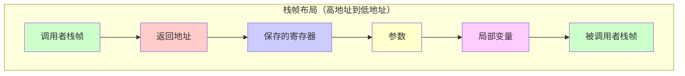

## 标准函数（Frame 函数）

标准函数使用完整的栈帧，包含所有标准信息。

### 栈帧结构

```go
// 标准栈帧布局
type frame struct {
    // 返回地址
    returnAddr uintptr
    
    // 调用者保存的寄存器
    savedRegs [8]uintptr
    
    // 函数参数
    args []byte
    
    // 局部变量
    locals []byte
    
    // 栈指针
    sp uintptr
    
    // 程序计数器
    pc uintptr
}
```

### 函数调用流程

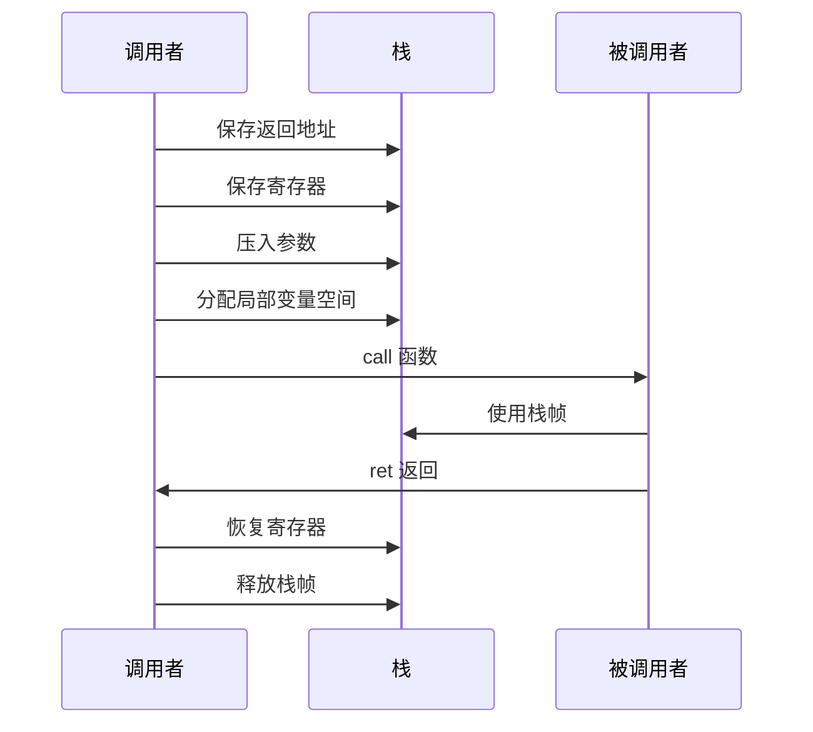

### 示例

```go
// 标准函数
func standardFunction(a, b int) int {
    // 局部变量在栈上
    local := 100
    
    // 参数在栈上
    sum := a + b + local
    
    return sum
}

// 调用
func caller() {
    result := standardFunction(10, 20)
    _ = result
}
```

### 汇编示例

```assembly
// 标准函数栈帧
TEXT ·standardFunction(SB), NOSPLIT, $24-16
    // $24: 局部变量空间（24字节）
    // 16: 参数和返回值大小（16字节）
    
    MOVQ a+0(FP), AX  // 读取参数 a
    MOVQ b+8(FP), BX  // 读取参数 b
    
    MOVQ $100, local-24(SP)  // 局部变量 local = 100
    ADDQ AX, BX
    ADDQ local-24(SP), BX
    
    MOVQ BX, ret+16(FP)  // 返回值
    RET
```

## NOFRAME 函数栈帧

NOFRAME 函数不使用标准栈帧，通常用于：

- **叶子函数**：不调用其他函数的函数
- **内联函数**：可能被内联的函数
- **性能关键函数**：需要最小化开销的函数

### 特点

- **无栈帧**：不分配标准栈帧
- **最小开销**：减少函数调用开销
- **限制**：不能调用其他函数（叶子函数）

### 栈帧结构

```go
// NOFRAME 函数没有标准栈帧
// 直接使用调用者的栈帧
// 或者使用寄存器传递参数
```

### 函数调用流程

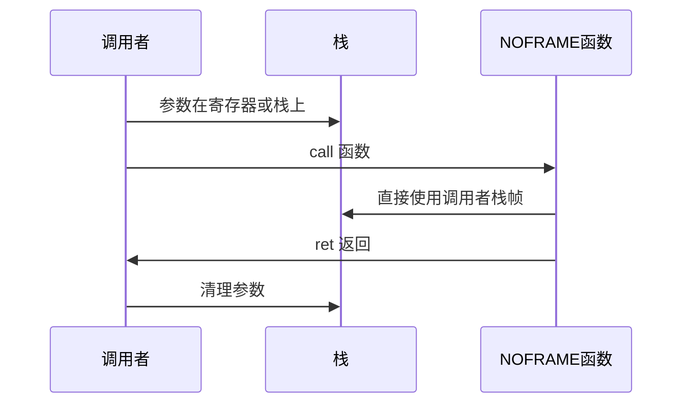

### 示例

```go
// NOFRAME 函数（叶子函数）
//go:noinline
func noframeFunction(x int) int {
    // 不调用其他函数
    // 不使用标准栈帧
    return x * 2
}
```

### 汇编示例

```assembly
// NOFRAME 函数
TEXT ·noframeFunction(SB), NOSPLIT|NOFRAME, $0-8
    // $0: 无局部变量空间
    // 8: 参数和返回值大小（8字节）
    // NOFRAME: 不使用标准栈帧
    
    MOVQ x+0(FP), AX  // 读取参数
    SHLQ $1, AX       // x * 2
    MOVQ AX, ret+8(FP) // 返回值
    RET
```

## Frame vs NOFRAME 对比

| 特性 | Frame（标准） | NOFRAME |
|------|--------------|---------|
| 栈帧分配 | 是 | 否 |
| 调用开销 | 较大 | 较小 |
| 可调用其他函数 | 是 | 否（叶子函数） |
| 使用场景 | 普通函数 | 性能关键函数 |
| 参数传递 | 栈或寄存器 | 寄存器优先 |

## 栈帧大小优化

### 1. 减少局部变量

```go
// ❌ 不好：大量局部变量
func bad() {
    var a, b, c, d, e, f, g, h int
    // ...
}

// ✅ 好：复用变量
func good() {
    var x int
    // 复用 x
}
```

### 2. 使用值类型

```go
// ❌ 不好：大结构体
func bad() {
    var large struct {
        data [1000]int
    }
}

// ✅ 好：使用指针或切片
func good() {
    large := make([]int, 1000)
}
```

### 3. 避免大数组

```go
// ❌ 不好：大数组在栈上
func bad() {
    var arr [10000]int
}

// ✅ 好：使用切片（可能逃逸到堆）
func good() {
    arr := make([]int, 10000)
}
```

# 栈相关工具

## 查看栈信息

### 1. 使用 runtime 包

```go
package main

import (
    "fmt"
    "runtime"
)

func printStackInfo() {
    var buf [64 * 1024]byte
    n := runtime.Stack(buf[:], false)
    fmt.Printf("Stack:\n%s\n", buf[:n])
}

func main() {
    printStackInfo()
}
```

### 2. 使用 pprof

```bash
# 获取 goroutine 栈信息
go tool pprof http://localhost:6060/debug/pprof/goroutine
```

### 3. 使用 trace

```go
import (
    "runtime/trace"
    "os"
)

func main() {
    f, _ := os.Create("trace.out")
    trace.Start(f)
    defer trace.Stop()
    
    // 你的代码
}
```

## 调试栈溢出

### 1. 增加栈大小

```go
// 编译时设置初始栈大小
// 注意：这需要修改运行时源码，不推荐
```

### 2. 使用递归优化

```go
// ❌ 不好：深度递归
func badRecursive(n int) int {
    if n <= 0 {
        return 0
    }
    return n + badRecursive(n-1)
}

// ✅ 好：迭代
func goodIterative(n int) int {
    sum := 0
    for i := 1; i <= n; i++ {
        sum += i
    }
    return sum
}
```

### 3. 使用尾递归优化

```go
// 尾递归（Go 不自动优化，但可以手动优化）
func tailRecursive(n, acc int) int {
    if n <= 0 {
        return acc
    }
    return tailRecursive(n-1, acc+n)
}
```

# 最佳实践

## 1. 避免栈溢出

- **限制递归深度**：使用迭代替代深度递归
- **减少局部变量**：复用变量，减少栈帧大小
- **避免大对象**：大对象考虑使用堆分配

## 2. 优化栈使用

- **减少函数调用**：内联小函数
- **使用值类型**：小结构体使用值传递
- **避免闭包逃逸**：谨慎使用闭包

## 3. 监控栈使用

- **使用 pprof**：监控栈使用情况
- **查看逃逸分析**：使用 `-gcflags="-m"` 查看逃逸
- **性能分析**：使用 trace 分析栈操作

## 4. 理解栈行为

- **栈是自动管理的**：不需要手动管理
- **栈会动态扩容**：不需要担心栈大小
- **逃逸分析很重要**：理解变量分配位置

# 总结

Go 的栈管理是运行时系统的重要组成部分：

## 关键要点

1. **逃逸分析**：编译器决定变量分配在栈还是堆
2. **连续栈**：Go 1.4+ 使用连续栈，性能更好
3. **动态扩容**：栈空间不足时自动扩容
4. **自动缩容**：栈使用率低时自动缩容
5. **栈帧管理**：标准函数和 NOFRAME 函数的不同

## 栈的特点

- **每个 goroutine 独立栈**：初始 2KB
- **自动管理**：无需手动管理栈空间
- **高性能**：连续内存，缓存友好
- **动态调整**：根据使用情况自动调整大小

## 优化建议

1. **理解逃逸分析**：避免不必要的堆分配
2. **减少栈使用**：优化局部变量和函数调用
3. **监控栈行为**：使用工具分析栈使用情况
4. **避免栈溢出**：限制递归深度，使用迭代

理解 Go 的栈管理机制，有助于编写高性能的 Go 程序，减少内存分配和 GC 压力。
