`golang`汇编使用的是plan9汇编，这相当于是一个帮助文档，帮助理解`golang`底层汇编代码的实现。
由于汇编不具备跨平台，所以这里使用的是`linux amd64`平台。

# 寄存器
## 通用寄存器

下面是通用通用寄存器的名字在 IA64 和 plan9 中的对应关系:

| IA64 | RAX | RBX | RCX | RDX | RDI | RSI | RBP | RSP | R8 | R9 | R10 | R11 | R12 | R13 | R14 | RIP |
| --- | --- | --- | --- | --- | --- | --- | --- | --- | --- | --- | --- | --- | --- | --- | --- | --- |
| Plan9 | AX | BX | CX | DX | DI | SI | BP | SP | R8 | R9 | R10 | R11 | R12 | R13 | R14 | PC |

### 寄存器分类图

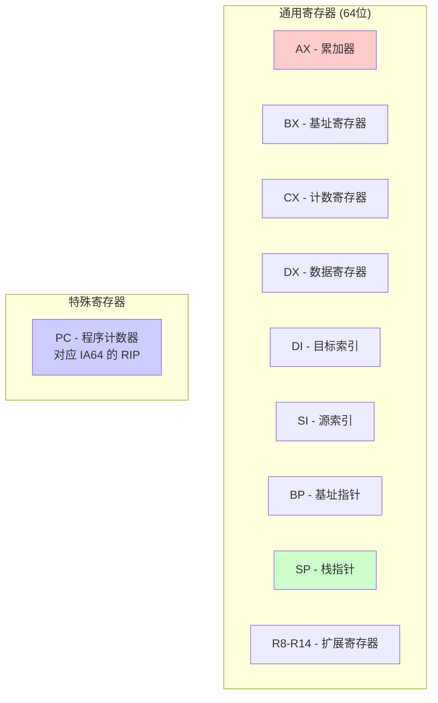

**常用寄存器用途**：
- **AX (RAX)**：累加器，常用于算术运算和函数返回值
- **BX (RBX)**：基址寄存器，常用于存储基址
- **CX (RCX)**：计数寄存器，常用于循环计数
- **DX (RDX)**：数据寄存器，常用于存储数据
- **DI (RDI)**：目标索引，函数调用时存储第一个参数
- **SI (RSI)**：源索引，函数调用时存储第二个参数
- **SP (RSP)**：栈指针，指向当前栈顶
- **BP (RBP)**：基址指针，指向当前栈帧基址
- **PC (RIP)**：程序计数器，指向下一条要执行的指令


## 伪寄存器
汇编中还引入了4个伪寄存器：
* `FP(Frame pointer)`：指向第一个参数（即参数列表最下面），通过其加上偏移量可以获取函数入参和返回值。
`FP`使用形式是`symbol+offset(FP)`，例如 `arg0+0(FP)`，`arg1+8(FP)`，使用 FP 不加 symbol 时，无法通过编译，在汇编层面来讲，symbol 并没有什么用，加 symbol 主要是为了提升代码可读性。
* `PC(Program counter)`：指向当前指令，用于跳转指令或分支。
* `SB(Static base pointer)`：指向全局基底，可通过其引用全局变量或声明函数。
* `SP(Stack pointer)`：指向第一个局部变量（即本地变量最上面），通过其减偏移量可以获取局部变量。`SP`使用形如 `symbol+offset(SP)` 的方式，引用函数的局部变量。`offset`的合法取值是`[-framesize, 0)`，注意是个左闭右开的区间。

`FP`指向内容是有低地址往高地址增长，`SP`指向内容是由高地址往低地址增长，所以对于`offset`，`FP`是正数，`SP`是负数。
如果`SP`前面的偏移量是正数，表示这里`SP`是硬件`SP`寄存器，且硬件`SP`寄存器没有`symbol`。当使用反汇编工具后显示的汇编代码中的`SP`都是硬件`SP`寄存器。

### 伪寄存器指向关系图

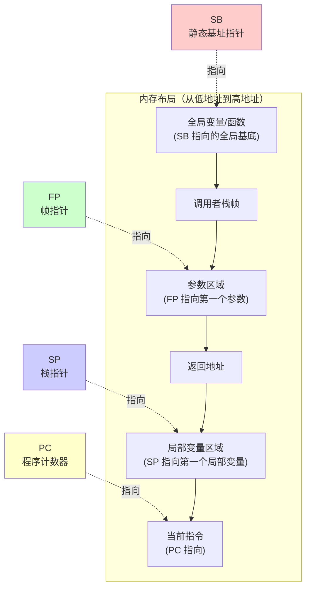

**伪寄存器说明**：
- **SB (Static Base)**：指向全局内存区域的基址，所有全局变量和函数都通过 `symbol(SB)` 的形式引用
- **FP (Frame Pointer)**：指向函数参数区域的起始位置，通过 `symbol+offset(FP)` 访问参数和返回值
- **SP (Stack Pointer)**：指向局部变量区域的起始位置，通过 `symbol+offset(SP)` 访问局部变量（offset 为负数）
- **PC (Program Counter)**：指向当前执行的指令，用于跳转和分支控制


# 数据
## 变量声明
### 常量
常量以`$`为前缀。常量的类型有整数常量、浮点数常量、字符常量和字符串常量等几种类型。以下是几种类型常量的例子：

```text
$1           // 十进制
$0xf4f8fcff  // 十六进制
$1.5         // 浮点数
$'a'         // 字符
$"abcd"      // 字符串
$·myvar(SB)  // 取地址
```

Go汇编语言中的常量其实不仅仅只有编译时常量，还包含运行时常量。比如包中全局的变量和全局函数在运行时地址也是固定不变的，这里地址不会改变的包变量和函数的地址也是一种汇编常量。

下面是本章第一节用汇编定义的字符串代码：

```text
GLOBL ·NameData(SB),$8
DATA  ·NameData(SB)/8,$"gopher"

GLOBL ·Name(SB),$16
DATA  ·Name+0(SB)/8,$·NameData(SB)
DATA  ·Name+8(SB)/8,$6

```

其中`$·NameData(SB)`也是以$美元符号为前缀，因此也可以将它看作是一个常量，它对应的是NameData包变量的地址。在汇编指令中，我们也可以通过LEA指令来获取NameData变量的地址。

### 全局变量
要定义全局变量，首先要声明一个变量对应的符号，以及变量对应的内存大小。导出变量符号的语法如下：

```text
GLOBL symbol(SB), width
```

GLOBL汇编指令用于定义名为symbol的变量，变量对应的内存宽度为width，内存宽度部分必须用常量初始化。下面的代码通过汇编定义一个int32类型的count变量：

```text
GLOBL ·count(SB),$4
```

其中符号`·count`以中点开头表示是当前包的变量，最终符号名为被展开为`path/to/pkg.count`。count变量的大小是4个字节，常量必须以$美元符号开头。内存的宽度必须是2的指数倍，编译器最终会保证变量的真实地址对齐到机器字倍数。需要注意的是，在Go汇编中我们无法为count变量指定具体的类型。在汇编中定义全局变量时，我们只关心变量的名字和内存大小，变量最终的类型只能在Go语言中声明。

变量定义之后，我们可以通过DATA汇编指令指定对应内存中的数据，语法如下：

```text
DATA symbol+offset(SB)/width, value
```

具体的含义是从symbol+offset偏移量开始，width宽度的内存，用value常量对应的值初始化。DATA初始化内存时，width必须是1、2、4、8几个宽度之一，因为再大的内存无法一次性用一个uint64大小的值表示。

## 变量寻址
寻址的方式有很多很迷惑的行为。
利用MOV来说明问题
```asm
MOVQ $10, AX           // Ax = 10
MOVQ $0x10, AX         // Ax = 0x10
MOVQ BX, AX            // AX = BX
MOVQ (BX), AX          // AX = *BX
MOVQ 8(BX), AX         // AX = *(8+BX)
MOVQ 16(CX)(BX*1), AX  // AX = *(16 + CX + BX*1)
MOVQ ·myvar(SB), AX    // AX = *myvar
MOVQ $8(CX)(BX*1), AX  // AX = 8 + CX + BX
MOVQ $·myvar(SB), AX   // AX = &myvar
```

### 寻址方式可视化

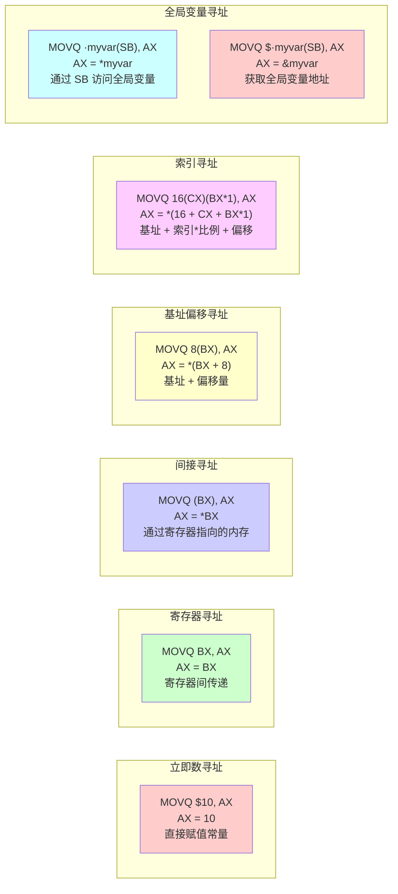

**寻址方式说明**：
- **立即数**：`$` 前缀表示常量值
- **寄存器**：直接使用寄存器名
- **间接**：`(寄存器)` 表示寄存器指向的内存地址
- **基址偏移**：`offset(基址)` 表示基址 + offset 的内存地址
- **索引寻址**：`offset(基址)(索引*比例)` 用于数组访问
- **全局变量**：`symbol(SB)` 访问全局变量，`$symbol(SB)` 获取地址

## 函数声明

```text
 静态基地址(static-base) 指针
                        |    标签
                        |    |      add函数入参+返回值总大小
                        |    |      |
TEXT pkgname·funcname<>(SB),TAG,$16-24
     |       |       |           |
函数所属包名  函数名    |           add函数栈帧大小
                     表示堆栈是否符合GOABI
```

* `TEXT`，定义函数标识
* `pkgname`，函数包名，可以不写，也可以`""`替代
* `·`，在程序链接后会转换为`.`
* `<>`，表示堆栈结构是否符合`GOABI`，也可以写作`<ABIInternal>`
* `(SB)`，让`SB`认识这个函数，即生成全局符号，有用绝对地址
* `TAG`，标签，表示函数某些特殊功能，多个标签可以通过`|`连接，常用标签
  - `NOSPLIT`，向编译器表明，不应该插入`stack-split`的用来检查栈需要扩张的前导指令，减少开销，一般用于叶子节点函数（函数内部不调用其他函数）
  - `NOFRAME`，不分配函数堆栈，函数必须是叶子节点函数，且以0标记堆栈函数，没有保存帧指针（或link寄存器架构上的返回地址）
* `$16-24`，`16`表示函数栈帧大小，`24`表示入参和返回大小


## 预处理
* `#include`，引入头文件
* `#define`，宏定义
* `#undef`，取消宏定义
* `#ifdef`，判断是否有宏定义
* `#ifndef`，判断是否没有宏定义
* `#else`，`if`的另一个情况
* `#endif`，结束`if`

例如在启动函数`runtime·rt0_go`中，会根据不同平台执行响应指令：
```asm
#ifndef GOOS_windows
	JMP ok
#endif
needtls:
#ifdef GOOS_plan9
	// skip TLS setup on Plan 9
	JMP ok
#endif
#ifdef GOOS_solaris
	// skip TLS setup on Solaris
	JMP ok
#endif
#ifdef GOOS_illumos
	// skip TLS setup on illumos
	JMP ok
#endif
#ifdef GOOS_darwin
	// skip TLS setup on Darwin
	JMP ok
#endif
```

## 标签声明
标签用于JMP跳转，用`symbol:`表示。


# 函数栈帧
调用者caller，被调用者callee，以被调用callee的角度理解函数栈帧，并显示伪寄存器指向的位置

## 函数栈帧布局（Frame 函数）

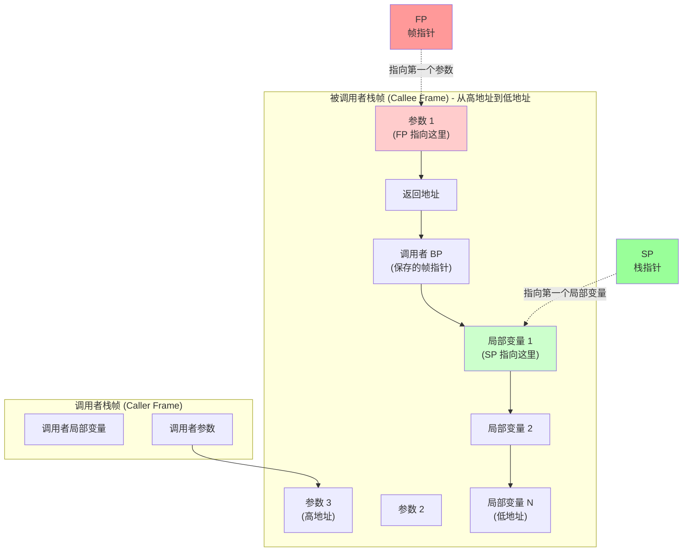

**说明**：
- **FP (Frame Pointer)**：指向第一个参数（参数列表最下面，高地址）
- **SP (Stack Pointer)**：指向第一个局部变量（局部变量最上面，低地址）
- **参数访问**：通过 `arg+offset(FP)` 访问，offset 为正数（向高地址增长）
- **局部变量访问**：通过 `var-offset(SP)` 访问，offset 为负数（向低地址增长）

## 函数栈帧布局（NOFRAME 函数）

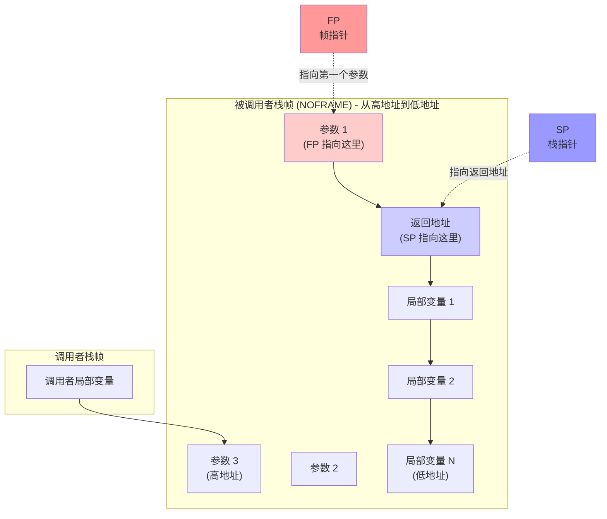

**NOFRAME 特点**：
- 不保存调用者的 BP（帧指针）
- SP 直接指向返回地址
- 函数必须是叶子节点函数（不调用其他函数）
- 栈帧更小，性能更好

# 常见指令
与数据相关的指令结尾会跟上`BWDQ`，分别表示操作字节数`1248`，常见的`MOVQ`、`ADDQ`等都是对8字节数进行操作。下面指令皆以`Q`结尾即8字节操作数。
```asm
MOVB $1, DI      // 1 byte
MOVW $0x10, BX   // 2 bytes
MOVD $1, DX      // 4 bytes
MOVQ $-10, AX    // 8 bytes
```

## 栈操作
由于golang栈帧是固定大小，没有提供压栈弹栈操作，但这些操作可以通过伪指针加偏移量来模拟。
## 移动操作
`MOV`允许赋值，移动数据，解引用，地址偏移等操作
```asm
MOVQ $10, AX           // Ax = 10
MOVQ $0x10, AX         // Ax = 0x10
MOVQ BX, AX            // AX = BX
MOVQ (BX), AX          // AX = *BX
MOVQ 8(BX), AX         // AX = *(8+BX)
MOVQ 16(CX)(BX*1), AX  // AX = *(16 + CX + BX*1)
MOVQ ·myvar(SB), AX    // AX = *myvar
MOVQ $8(CX)(BX*1), AX  // AX = 8 + CX + BX
MOVQ $·myvar(SB), AX   // AX = &myvar
```

## 运算操作
### 数值运算
* ADDQ，加法运算
* SUBQ，减法运算
* IMULQ，乘法运算

示例：
```asm
ADDQ  AX, BX   // BX += AX
SUBQ  AX, BX   // BX -= AX
IMULQ AX, BX   // BX *= AX
```

### 逻辑运算
* `ANDQ`：按位与运算，`ANDQ AX, BX` 表示 `BX = BX & AX`
* `ORQ`：按位或运算，`ORQ AX, BX` 表示 `BX = BX | AX`
* `XORQ`：按位异或运算，`XORQ AX, BX` 表示 `BX = BX ^ AX`
* `NOTQ`：按位取反，`NOTQ AX` 表示 `AX = ~AX`

示例：
```asm
ANDQ  AX, BX   // BX = BX & AX
ORQ   AX, BX   // BX = BX | AX
XORQ  AX, BX   // BX = BX ^ AX
NOTQ  AX       // AX = ~AX
```

### 移位运算
* SALQ，有符号左移
* SARQ，有符号右移
* SHLQ，无符号左移
* SHRQ，无符号右移

## 条件操作
条件操作即为处理当前操作并设置标志寄存器相关标志位的值，常见的标志位有：
* `CF (Carry Flag)`，进位标志位，运算过程是否产生进位或借位
* `PF (Parity Flag)`，奇偶标志位，运算结果中1的个数是奇数还是偶数
* `ZF (Zero Flag)`，零标志位，运算结果是否为0
* `SF (Sign Flag)`，符号标志位，运算结果的最高位
* `OF (Overflow Flag)`，溢出标志位，运算结果超过运算数表示范围

### 标志寄存器结构

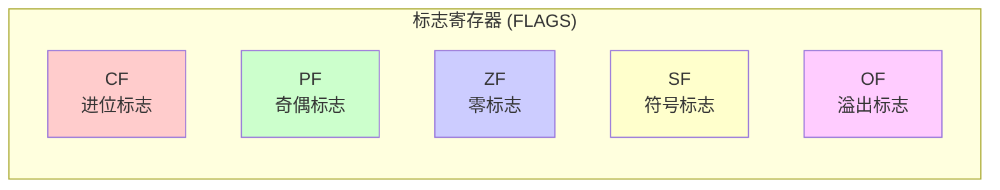

条件指令：
* `TESTQ`，源操作数和目标操作数按位逻辑与，结果不置目标操作数，根据响应的结果设置`SF`、`ZF`、和`PF`标志位，并将`CF`和`OF`标志位清零。常见`TESTQ AX AX`配合`ZF`即可得出`AX`是否为0。
* `CMP`，前操作数减去后操作数，结果不置目标操作数，根据结果设置标志寄存器标志位。
  - 等于，ZF为1
  - 不等于，ZF为0
  - 小于，CF为1
  - 小于等于，CF为1或ZF为1
  - 大于等于，CF为0
  - 大于，CF为0并且ZF为0

### 条件判断流程图

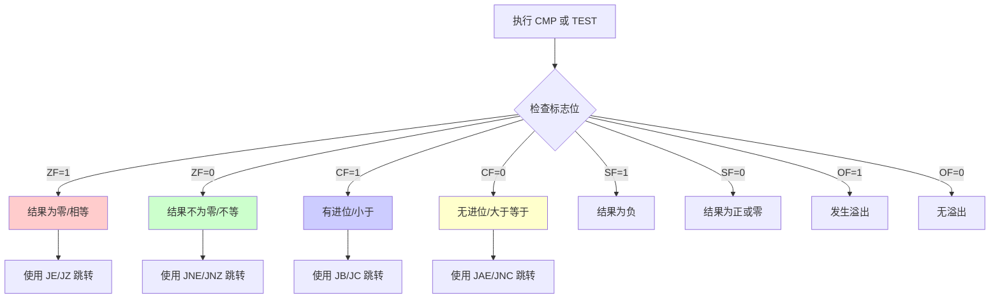

## 跳转操作
跳转操作即为检测标志寄存器相关的标志位，进而处理逻辑。

* `JMP (JuMP)`，无条件跳转，可以跳转标签，跳转函数，跳过指定个数的指令。
例如，如果是`2(PC)`则是跳过两条指令，也可以为负数`-2(PC)`向上跳2个指令
```asm
JMP 2(PC)  // ----
NOP        //    |
NOP        // <---

NOP        // <---
NOP        //    |
JMP -2(PC) // ----
```

### 跳转指令流程图

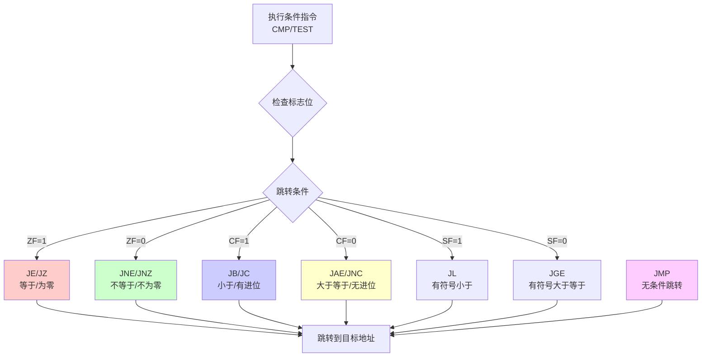

* `JA (Jump if Above)`，无符号大于就跳转
* `JAE (Jump if Above or Equal)`，无符号大于等于就跳转
* `JB (Jump if Below)`，无符号小于就跳转
* `JBE (Jump if Below or Equal)`，无符号小于等于就跳转
* `JC (Jump if Carry)`，如果有进位就跳转
* `JNC (Jump if No Carry)`，没有进位就跳转
* `JE (Jump if Equal)`，相等就跳转
* `JNE (Jump if Not Equal)`，不等就跳转
* `JL (Jump if Less)`，有符号小于就跳转
* `JLE (Jump if Less or Equal)`，有符号小于等于就跳转
* `JG (Jump if Greater)`，有符号大于就跳转
* `JGE (Jump if Greater or Equal)`，有符号大于等于就跳转
* `JHI (Jump if HIgher)`，无符号大于就跳转
* `JHS (Jump if Higher or Same)`，无符号大于就跳转或等于就跳转，同`JC`
* `JLO (Jump if LOwer)`，无符号小于就跳转，同`JNC`
* `JLS (Jump if Lower or Same)`，无符号小于或等于就跳转
* `JN (Jump if Negative)`，为负就跳转
* `JZ (Jump if equal to Zero)`，等于零值就跳转
* `JNZ (Jump if Not equal to Zero)`，不等于零值就跳转


## 其他操作
* `LEAQ`：加载有效地址（Load Effective Address），计算地址但不访问内存，常用于地址计算
* `CALL`：调用函数，也可以理解为跳转到函数，会自动保存返回地址
* `RET`：退出函数，从栈中恢复返回地址并跳转
* `NOP`：空操作，不执行任何操作，常用于对齐或占位
* `INT`：中断，触发软件中断

### 函数调用流程

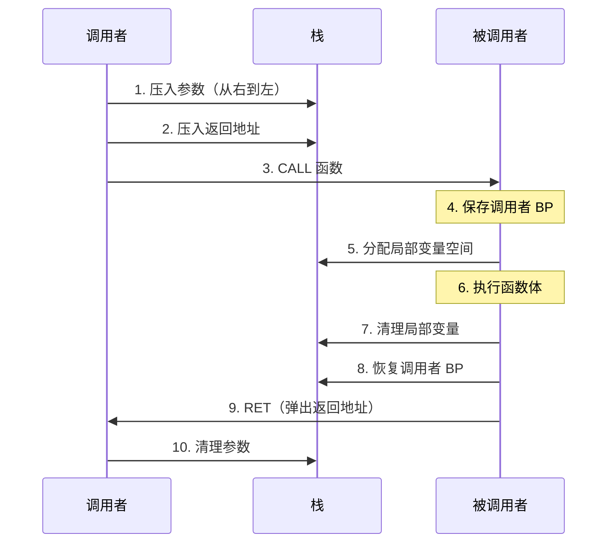

### LEAQ 地址计算示例

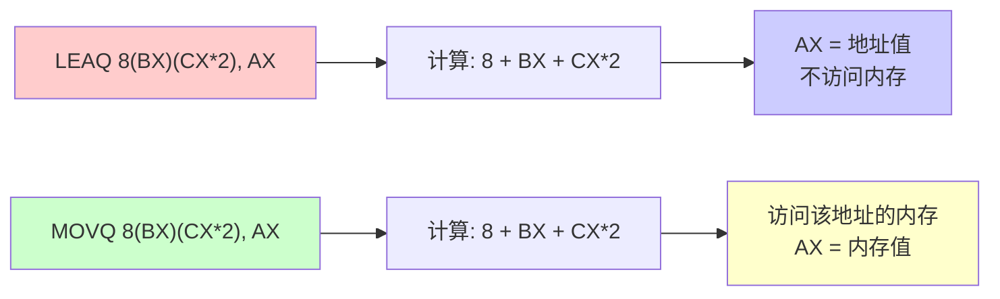

**LEAQ vs MOVQ**：
- `LEAQ`：只计算地址，不访问内存，常用于地址计算和算术运算优化
- `MOVQ`：计算地址并访问该地址的内存内容

# 反汇编

对于写好的 go 源码，生成对应的 Go 汇编，大概有下面几种

*   方法 1 先使用 go build -gcflags "-N -l" main.go 生成对应的可执行二进制文件 再使用 go tool objdump -s "main\." main 反编译获取对应的汇编
反编译时"main\." 表示只输出 main 包中相关的汇编"main\.main" 则表示只输出 main 包中 main 方法相关的汇编
*   方法 2 使用 go tool compile -S -N -l main.go 这种方式直接输出汇编
*   方法 3 使用go build -gcflags="-N -l -S" main.go 直接输出汇编

注意：在使用这些命令时，加上对应的 flag，否则某些逻辑会被编译器优化掉，而看不到对应完整的汇编代码

> -l 禁止内联 -N 编译时，禁止优化 -S 输出汇编代码

## 反汇编流程图

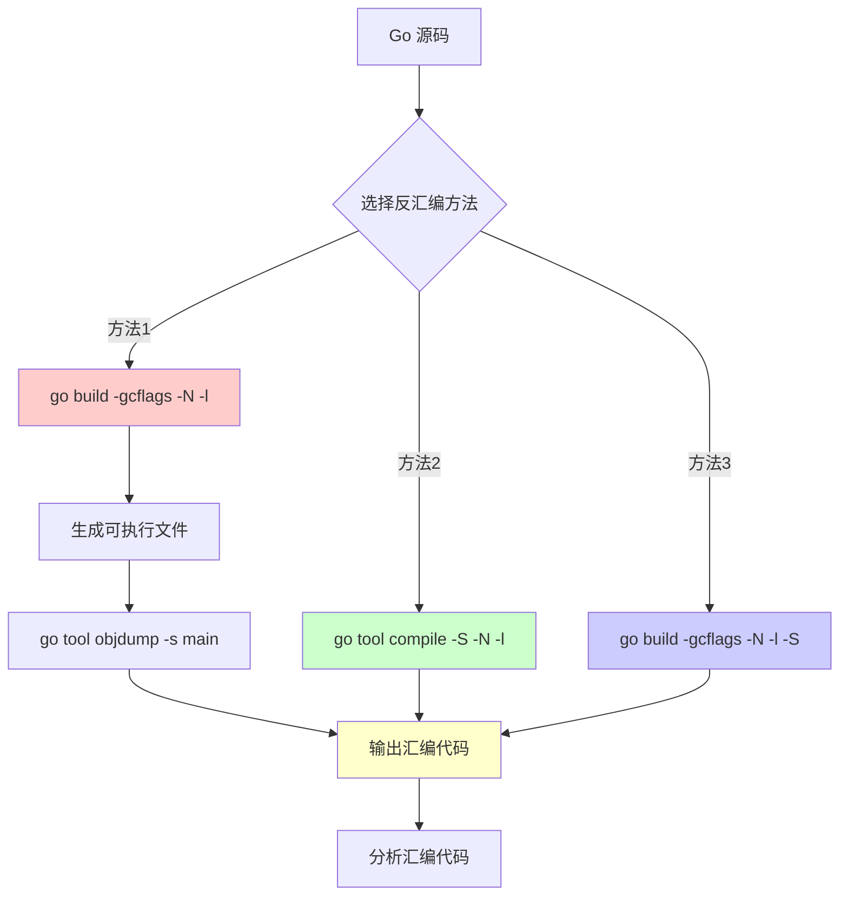

**命令说明**：
- **方法1**：`go build -gcflags "-N -l" main.go` 生成可执行文件，然后 `go tool objdump -s "main\." main` 反编译
- **方法2**：`go tool compile -S -N -l main.go` 直接输出汇编
- **方法3**：`go build -gcflags="-N -l -S" main.go` 直接输出汇编

**编译选项说明**：
- `-l`：禁止内联，保留函数调用
- `-N`：禁止优化，保留所有逻辑
- `-S`：输出汇编代码

# 参考文献
[Go 系列文章3 ：plan9 汇编入门](https://xargin.com/plan9-assembly/)
[状态标志寄存器](https://baike.baidu.com/item/FLAG/6050220)
[Go functions in assembly language](https://github.com/golang/go/files/447163/GoFunctionsInAssembly.pdf)
